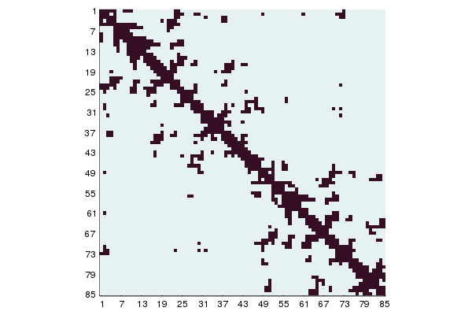

# BioStructures documentation

The BioStructures.jl package provides functionality to manipulate macromolecular structures, and in particular to read and write [Protein Data Bank](http://www.rcsb.org/pdb/home/home.do) (PDB), mmCIF and MMTF files.
It is designed to be used for standard structural analysis tasks, as well as acting as a platform on which others can build to create more specific tools.

It compares favourably in terms of performance to other PDB parsers - see some [benchmarks online](https://github.com/jgreener64/pdb-benchmarks) and the [benchmark suite](https://github.com/BioJulia/BioStructures.jl/blob/master/benchmark/benchmarks.jl).
The PDB, mmCIF and MMTF parsers currently read in the whole PDB without explicit errors (with a handful of known exceptions).
Help on individual functions can be found in the [BioStructures API](@ref) section or by using `?function_name` from within Julia.

## Basics

To download a PDB file:

```julia
using BioStructures

# Stored in the current working directory by default
downloadpdb("1EN2")
```

To parse a PDB file into a Structure-Model-Chain-Residue-Atom framework:

```julia
julia> struc = read("/path/to/pdb/file.pdb", PDB)
ProteinStructure 1EN2.pdb with 1 models, 1 chains (A), 85 residues, 754 atoms
```

mmCIF files can be read into the same data structure with `read("/path/to/cif/file.cif", MMCIF)`.
The keyword argument `gzip`, default `false`, determines if the file is gzipped.
If you want to read an mmCIF file into a dictionary to query yourself (e.g. to access metadata fields), use [`MMCIFDict`](@ref):

```julia
julia> mmcif_dict = MMCIFDict("/path/to/cif/file.cif")
mmCIF dictionary with 716 fields

julia> mmcif_dict["_entity_src_nat.common_name"]
1-element Array{String,1}:
 "great nettle"
```

A [`MMCIFDict`](@ref) can be accessed in similar ways to a standard dictionary, and if necessary the underlying dictionary of [`MMCIFDict`](@ref) `d` can be accessed with `d.dict`.
Note that the values of the dictionary are always an `Array{String,1}`, even if only one value was read in or the data is numerical.

MMTF files can be read into the same data structure with `read("/path/to/mmtf/file.mmtf", MMTF)`.
The keyword argument `gzip`, default `false`, determines if the file is gzipped.
In a similar manner to mmCIF dictionaries, a MMTF file can be read into a dictionary with [`MMTFDict`](@ref).
The values of the dictionary are a variety of types depending on the [MMTF specification](https://github.com/rcsb/mmtf/blob/master/spec.md).
To convert a [`MMCIFDict`](@ref) or [`MMTFDict`](@ref) to the Structure-Model-Chain-Residue-Atom framework, use the [`ProteinStructure`](@ref) constructor, e.g. `ProteinStructure(mmcif_dict)`.

The elements of `struc` can be accessed as follows:

| Command                     | Returns                                                                         | Return type       |
| :-------------------------- | :------------------------------------------------------------------------------ | :---------------- |
| `struc[1]`                  | Model 1                                                                         | `Model`           |
| `struc[1]["A"]`             | Model 1, chain A                                                                | `Chain`           |
| `struc[1]['A']`             | Shortcut to above if the chain ID is a single character                         | `Chain`           |
| `struc["A"]`                | The lowest model (model 1), chain A                                             | `Chain`           |
| `struc["A"]["50"]`          | Model 1, chain A, residue 50                                                    | `AbstractResidue` |
| `struc["A"][50]`            | Shortcut to above if it is not a hetero residue and the insertion code is blank | `AbstractResidue` |
| `struc["A"]["H_90"]`        | Model 1, chain A, hetero residue 90                                             | `AbstractResidue` |
| `struc["A"][50]["CA"]`      | Model 1, chain A, residue 50, atom name CA                                      | `AbstractAtom`    |
| `struc["A"][15]["CG"]['A']` | For disordered atoms, access a specific location                                | `Atom`            |

You can use `begin` and `end` to access the first and last elements, for example `struc[1][begin]` gets the first chain in model 1.
Disordered atoms are stored in a [`DisorderedAtom`](@ref) container but calls fall back to the default atom, so disorder can be ignored if you are not interested in it.
Disordered residues (i.e. point mutations with different residue names) are stored in a [`DisorderedResidue`](@ref) container.
The idea is that disorder will only bother you if you want it to.
See the [Biopython discussion](http://biopython.org/wiki/The_Biopython_Structural_Bioinformatics_FAQ#How_is_disorder_handled.3F) for more.

Properties can be retrieved as follows:

| Function                     | Returns                                                                                | Return type                     |
| :--------------------------- | :------------------------------------------------------------------------------------- | :------------------------------ |
| [`serial`](@ref)             | Serial number of an atom                                                               | `Int`                           |
| [`atomname`](@ref)           | Name of an atom                                                                        | `String`                        |
| [`altlocid`](@ref)           | Alternative location ID of an atom                                                     | `Char`                          |
| [`altlocids`](@ref)          | All alternative location IDs in a `DisorderedAtom`                                     | `Array{Char,1}`                 |
| [`x`](@ref)                  | x coordinate of an atom                                                                | `Float64`                       |
| [`y`](@ref)                  | y coordinate of an atom                                                                | `Float64`                       |
| [`z`](@ref)                  | z coordinate of an atom                                                                | `Float64`                       |
| [`coords`](@ref)             | coordinates of an atom                                                                 | `Array{Float64,1}`              |
| [`occupancy`](@ref)          | Occupancy of an atom (default is `1.0`)                                                | `Float64`                       |
| [`tempfactor`](@ref)         | Temperature factor of an atom (default is `0.0`)                                       | `Float64`                       |
| [`element`](@ref)            | Element of an atom (default is `"  "`)                                                 | `String`                        |
| [`charge`](@ref)             | Charge of an atom (default is `"  "`)                                                  | `String`                        |
| [`residue`](@ref)            | Residue an atom belongs to                                                             | `Residue`                       |
| [`ishetero`](@ref)           | `true` if the residue or atom is a hetero residue/atom                                 | `Bool`                          |
| [`isdisorderedatom`](@ref)   | `true` if the atom is disordered                                                       | `Bool`                          |
| [`pdbline`](@ref)            | PDB ATOM/HETATM record for an atom                                                     | `String`                        |
| [`resname`](@ref)            | Residue name of a residue or atom                                                      | `String`                        |
| [`resnames`](@ref)           | All residue names in a `DisorderedResidue`                                             | `Array{String,1}`               |
| [`resnumber`](@ref)          | Residue number of a residue or atom                                                    | `Int`                           |
| [`sequentialresidues`](@ref) | Determine if the second residue follows the first in sequence                          | `Bool`                          |
| [`inscode`](@ref)            | Insertion code of a residue or atom                                                    | `Char`                          |
| [`resid`](@ref)              | Residue ID of an atom or residue (`full=true` includes chain)                          | `String`                        |
| [`atomnames`](@ref)          | Atom names of the atoms in a residue, sorted by serial                                 | `Array{String,1}`               |
| [`atoms`](@ref)              | Dictionary of atoms in a residue                                                       | `Dict{String,AbstractAtom}`     |
| [`isdisorderedres`](@ref)    | `true` if the residue has multiple residue names                                       | `Bool`                          |
| [`disorderedres`](@ref)      | Access a particular residue name in a `DisorderedResidue`                              | `Residue`                       |
| [`sscode`](@ref)             | Secondary structure code of a residue or atom, requires DSSP or STRIDE to be run first | `Char`                          |
| [`chain`](@ref)              | Chain a residue or atom belongs to                                                     | `Chain`                         |
| [`chainid`](@ref)            | Chain ID of a chain, residue or atom                                                   | `String`                        |
| [`resids`](@ref)             | Sorted residue IDs in a chain                                                          | `Array{String,1}`               |
| [`residues`](@ref)           | Dictionary of residues in a chain                                                      | `Dict{String,AbstractResidue}`  |
| [`model`](@ref)              | Model a chain, residue or atom belongs to                                              | `Model`                         |
| [`modelnumber`](@ref)        | Model number of a model, chain, residue or atom                                        | `Int`                           |
| [`chainids`](@ref)           | Sorted chain IDs in a model or structure                                               | `Array{String,1}`               |
| [`chains`](@ref)             | Dictionary of chains in a model or structure                                           | `Dict{String,Chain}`            |
| [`structure`](@ref)          | Structure a model, chain, residue or atom belongs to                                   | `ProteinStructure`              |
| [`structurename`](@ref)      | Name of the structure an element belongs to                                            | `String`                        |
| [`modelnumbers`](@ref)       | Sorted model numbers in a structure                                                    | `Array{Int,1}`                  |
| [`models`](@ref)             | Dictionary of models in a structure                                                    | `Dict{Int,Model}`               |

The `strip` keyword argument determines whether surrounding whitespace is stripped for [`atomname`](@ref), [`element`](@ref), [`charge`](@ref), [`resname`](@ref) and [`atomnames`](@ref) (default `true`).

The coordinates of an atom can be changed using [`x!`](@ref), [`y!`](@ref), [`z!`](@ref) and [`coords!`](@ref).
The chain ID of a chain or residue can be changed using [`chainid!`](@ref).
Currently these are the only setter functions available.

## Manipulating structures

Elements can be looped over to reveal the sub-elements in the correct order:

```julia
for mod in struc
    for ch in mod
        for res in ch
            for at in res
                # Do something
            end
        end
    end
end
```

Models are ordered numerically; chains are ordered by chain ID character ordering, except the empty chain is last; residues are ordered by residue number and insertion code with hetero residues after standard residues; atoms are ordered by atom serial.
Since the ordering of elements is defined you can use the `sort` function.
For example `sort(res)` sorts a list of residues as described above, or `sort(res, by=resname)` will sort them alphabetically by residue name.

[`collect`](@ref) can be used to get arrays of sub-elements.
[`collectatoms`](@ref), [`collectresidues`](@ref), [`collectchains`](@ref) and [`collectmodels`](@ref) return arrays of a particular type from a structural element or element array.
Since most operations should use a single version of an atom or residue, disordered entities are not expanded by default and only one entity is present in the array.
This can be changed by setting `expand_disordered` to `true` in [`collectatoms`](@ref) or [`collectresidues`](@ref).

Selectors are functions passed as additional arguments to these functions.
Only elements that return `true` when passed to all the selector are retained.
For example:

| Command                                                 | Action                                                            | Return type                |
| :------------------------------------------------------ | :---------------------------------------------------------------- | :------------------------- |
| `collect(struc['A'][50])`                               | Collect the sub-elements of an element, e.g. atoms from a residue | `Array{AbstractAtom,1}`    |
| `collectresidues(struc)`                                | Collect the residues of an element                                | `Array{AbstractResidue,1}` |
| `collectatoms(struc) `                                  | Collect the atoms of an element                                   | `Array{AbstractAtom,1}`    |
| `collectatoms(struc, calphaselector)`                   | Collect the Cα atoms of an element                                | `Array{AbstractAtom,1}`    |
| `collectatoms(struc, calphaselector, disorderselector)` | Collect the disordered Cα atoms of an element                     | `Array{AbstractAtom,1}`    |

The selectors available are:

| Function                    | Acts on                             | Selects for                                                  |
| :-------------------------- | :---------------------------------- | :----------------------------------------------------------- |
| [`standardselector`](@ref)  | `AbstractAtom` or `AbstractResidue` | Atoms/residues arising from standard (ATOM) records          |
| [`heteroselector`](@ref)    | `AbstractAtom` or `AbstractResidue` | Atoms/residues arising from hetero (HETATM) records          |
| [`atomnameselector`](@ref)  | `AbstractAtom`                      | Atoms with atom name in a given list                         |
| [`calphaselector`](@ref)    | `AbstractAtom`                      | Cα atoms                                                     |
| [`cbetaselector`](@ref)     | `AbstractAtom`                      | Cβ atoms, or Cα atoms for glycine residues                   |
| [`backboneselector`](@ref)  | `AbstractAtom`                      | Atoms in the protein backbone (CA, N, C and O)               |
| [`heavyatomselector`](@ref) | `AbstractAtom`                      | Non-hydrogen atoms                                           |
| [`hydrogenselector`](@ref)  | `AbstractAtom`                      | Hydrogen atoms                                               |
| [`resnameselector`](@ref)   | `AbstractAtom` or `AbstractResidue` | Atoms/residues with residue name in a given list             |
| [`waterselector`](@ref)     | `AbstractAtom` or `AbstractResidue` | Atoms/residues with residue name HOH                         |
| [`notwaterselector`](@ref)  | `AbstractAtom` or `AbstractResidue` | Atoms/residues with residue name not HOH                     |
| [`disorderselector`](@ref)  | `AbstractAtom` or `AbstractResidue` | Atoms/residues with alternative locations                    |
| [`allselector`](@ref)       | `AbstractAtom` or `AbstractResidue` | All atoms/residues                                           |
| [`sscodeselector`](@ref)    | `AbstractAtom` or `AbstractResidue` | Atoms/residues with secondary structure code in a given list |
| [`helixselector`](@ref)     | `AbstractAtom` or `AbstractResidue` | Atoms/residues that are part of an α-helix                   |
| [`sheetselector`](@ref)     | `AbstractAtom` or `AbstractResidue` | Atoms/residues that are part of a β-sheet                    |
| [`coilselector`](@ref)      | `AbstractAtom` or `AbstractResidue` | Atoms/residues that are part of a coil                       |

To create a new [`atomnameselector`](@ref), [`resnameselector`](@ref) or [`sscodeselector`](@ref):
```julia
cdeltaselector(at::AbstractAtom) = atomnameselector(at, ["CD"])
```

It is easy to define your own atom, residue, chain or model selectors.
The below will collect all atoms with x coordinate less than 0:

```julia
xselector(at) = x(at) < 0
collectatoms(struc, xselector)
```

Selectors can be inverted with `!`, e.g. `collectatoms(struc, !xselector)`.
Alternatively, you can use an anonymous function:

```julia
collectatoms(struc, at -> x(at) < 0)
```

[`countatoms`](@ref), [`countresidues`](@ref), [`countchains`](@ref) and [`countmodels`](@ref) can be used to count elements with the same selector API.
For example:

```julia
julia> countatoms(struc)
754

julia> countatoms(struc, calphaselector)
85

julia> countresidues(struc, standardselector)
85

julia> countatoms(struc, expand_disordered=true)
819
```

The amino acid sequence of a protein can be retrieved by passing an element to [`LongAA`](@ref) with optional residue selectors:

```julia
julia> LongAA(struc['A'], standardselector)
85aa Amino Acid Sequence:
RCGSQGGGSTCPGLRCCSIWGWCGDSEPYCGRTCENKCW…RCGAAVGNPPCGQDRCCSVHGWCGGGNDYCSGGNCQYRC
```

The `gaps` keyword argument determines whether to add gaps to the sequence based on missing residue numbers (default `true`).
[`threeletter_to_aa`](@ref) provides a lookup table of amino acid codes should that be required.
See [BioSequences.jl](https://github.com/BioJulia/BioSequences.jl) and [BioAlignments.jl](https://github.com/BioJulia/BioAlignments.jl) for more on how to deal with sequences.
[`LongAA`](@ref) is an alias for `LongSequence{AminoAcidAlphabet}`.
For example, to see the alignment of CDK1 and CDK2 (this example also makes use of Julia's [broadcasting](https://docs.julialang.org/en/v1/manual/arrays/#Broadcasting-1)):

```julia
julia> struc1, struc2 = retrievepdb.(["4YC6", "1HCL"])
2-element Array{ProteinStructure,1}:
 ProteinStructure 4YC6.pdb with 1 models, 8 chains (A,B,C,D,E,F,G,H), 1420 residues, 12271 atoms
 ProteinStructure 1HCL.pdb with 1 models, 1 chains (A), 294 residues, 2546 atoms

julia> seq1, seq2 = LongAA.([struc1["A"], struc2["A"]], standardselector, gaps=false)
2-element Vector{LongAA}:
 MEDYTKIEKIGEGTYGVVYKGRHKTTGQVVAMKKIRLES…SHVKNLDENGLDLLSKMLIYDPAKRISGKMALNHPYFND
 MENFQKVEKIGEGTYGVVYKARNKLTGEVVALKKIRTEG…RSLLSQMLHYDPNKRISAKAALAHPFFQDVTKPVPHLRL

julia> using BioAlignments

julia> scoremodel = AffineGapScoreModel(BLOSUM62, gap_open=-10, gap_extend=-1);

julia> alres = pairalign(GlobalAlignment(), seq1, seq2, scoremodel)
PairwiseAlignmentResult{Int64, LongAA, LongAA}:
  score: 945
  seq:   1 MEDYTKIEKIGEGTYGVVYKGRHKTTGQVVAMKKIRLESEEEGVPSTAIREISLLKELRH  60
           ||   | ||||||||||||| | | || ||| |||| |    |||||||||||||||| |
  ref:   1 MENFQKVEKIGEGTYGVVYKARNKLTGEVVALKKIRTE----GVPSTAIREISLLKELNH  56

  seq:  61 PNIVSLQDVLMQDSRLYLIFEFLSMDLKKYLD-SIPPGQYMDSSLVKSYLYQILQGIVFC 119
           |||| | ||      ||| ||||  ||||  | |   |      | |||| | |||  ||
  ref:  57 PNIVKLLDVIHTENKLYLVFEFLHQDLKKFMDASALTG--IPLPLIKSYLFQLLQGLAFC 114

  seq: 120 HSRRVLHRDLKPQNLLIDDKGTIKLADFGLARAFGV----YTHEVVTLWYRSPEVLLGSA 175
           || ||||||||||||||   | ||||||||||||||    ||||||||||| || |||  
  ref: 115 HSHRVLHRDLKPQNLLINTEGAIKLADFGLARAFGVPVRTYTHEVVTLWYRAPEILLGCK 174

  seq: 176 RYSTPVDIWSIGTIFAELATKKPLFHGDSEIDQLFRIFRALGTPNNEVWPEVESLQDYKN 235
            ||| ||||| | ||||  |   || ||||||||||||| ||||   ||| | |  ||| 
  ref: 175 YYSTAVDIWSLGCIFAEMVTRRALFPGDSEIDQLFRIFRTLGTPDEVVWPGVTSMPDYKP 234

  seq: 236 TFPKWKPGSLASHVKNLDENGLDLLSKMLIYDPAKRISGKMALNHPYFND---------- 285
            ||||        |  ||| |  ||| || ||| |||| | || || | |          
  ref: 235 SFPKWARQDFSKVVPPLDEDGRSLLSQMLHYDPNKRISAKAALAHPFFQDVTKPVPHLRL 294

```

In fact, [`pairalign`](@ref) is extended to carry out the above steps and return the alignment by calling `pairalign(struc1["A"], struc2["A"], standardselector)` in this case.
`scoremodel` and `aligntype` are keyword arguments with the defaults shown above.

## Spatial calculations

Various functions are provided to calculate spatial quantities for proteins:

| Command                      | Returns                                                                                          |
| :--------------------------- | :----------------------------------------------------------------------------------------------- |
| [`distance`](@ref)           | Minimum distance between two elements                                                            |
| [`sqdistance`](@ref)         | Minimum square distance between two elements                                                     |
| [`coordarray`](@ref)         | Atomic coordinates in Å of an element as a 2D `Array` with each column corresponding to one atom |
| [`bondangle`](@ref)          | Angle between three atoms                                                                        |
| [`dihedralangle`](@ref)      | Dihedral angle defined by four atoms                                                             |
| [`omegaangle`](@ref)         | Omega dihedral angle between a residue and the previous residue                                  |
| [`phiangle`](@ref)           | Phi dihedral angle between a residue and the previous residue                                    |
| [`psiangle`](@ref)           | Psi dihedral angle between a residue and the next residue                                        |
| [`omegaangles`](@ref)        | `Vector` of omega dihedral angles of an element                                                  |
| [`phiangles`](@ref)          | `Vector` of phi dihedral angles of an element                                                    |
| [`psiangles`](@ref)          | `Vector` of psi dihedral angles of an element                                                    |
| [`ramachandranangles`](@ref) | `Vector`s of phi and psi angles of an element                                                    |
| [`ContactMap`](@ref)         | `ContactMap` of two elements, or one element with itself                                         |
| [`DistanceMap`](@ref)        | `DistanceMap` of two elements, or one element with itself                                        |
| [`showcontactmap`](@ref)     | Print a representation of a `ContactMap` to `stdout` or a specified `IO` instance                |
| [`Transformation`](@ref)     | The 3D transformation to map one set of coordinates onto another                                 |
| [`applytransform!`](@ref)    | Modify all coordinates in an element according to a transformation                               |
| [`applytransform`](@ref)     | Modify coordinates according to a transformation                                                 |
| [`superimpose!`](@ref)       | Superimpose one element onto another                                                             |
| [`rmsd`](@ref)               | RMSD between two elements, with or without superimposition                                       |
| [`displacements`](@ref)      | `Vector` of displacements between two elements, with or without superimposition                  |
| `MetaGraph`                  | Construct a `MetaGraph` of contacting elements (call `using Graphs, MetaGraphs` first)           |

The [`omegaangle`](@ref), [`phiangle`](@ref) and [`psiangle`](@ref) functions can take either a pair of residues or a chain and a position.
The [`omegaangle`](@ref) and [`phiangle`](@ref) functions measure the angle between the residue at the given index and the one before.
The [`psiangle`](@ref) function measures between the given index and the one after.
For example:

```julia
julia> distance(struc['A'][10], struc['A'][20])
10.782158874733762

julia> rad2deg(bondangle(struc['A'][50]["N"], struc['A'][50]["CA"], struc['A'][50]["C"]))
110.77765846083398

julia> rad2deg(dihedralangle(struc['A'][50]["N"], struc['A'][50]["CA"], struc['A'][50]["C"], struc['A'][51]["N"]))
-177.38288114072924

julia> rad2deg(psiangle(struc['A'][50], struc['A'][51]))
-177.38288114072924

julia> rad2deg(psiangle(struc['A'], 50))
-177.38288114072924
```

[`ContactMap`](@ref) takes in a structural element or a list, such as a `Chain` or `Vector{Atom}`, and returns a [`ContactMap`](@ref) object showing the contacts between the elements for a specified distance.
[`ContactMap`](@ref) can also be given two structural elements as arguments, in which case a non-symmetrical 2D array is returned showing contacts between the elements.
The underlying `BitArray{2}` for [`ContactMap`](@ref) `contacts` can be accessed with `contacts.data` if required.

```julia
julia> contacts = ContactMap(collectatoms(struc['A'], cbetaselector), 8.0)
Contact map of size (85, 85)
```

A [plot recipe](http://docs.juliaplots.org/latest/recipes) is defined for this so it can shown with [Plots.jl](http://docs.juliaplots.org/latest):

```julia
using Plots
plot(contacts)
```



For a quick, text-based representation of a [`ContactMap`](@ref) use [`showcontactmap`](@ref).

[`DistanceMap`](@ref) works in an analogous way to [`ContactMap`](@ref) and gives a map of the distances. It can also be plotted:

```julia
dists = DistanceMap(collectatoms(struc['A'], cbetaselector))
using Plots
plot(dists)
```


Structural elements can be superimposed, and superposition-dependent properties such as the RMSD can be calculated.
To carry out superimposition, BioStructures.jl carries out a sequence alignment and superimposes aligned residues using the [Kabsch algorithm](https://en.wikipedia.org/wiki/Kabsch_algorithm).
For example:

```julia
# Change the coordinates of element 1 to superimpose it onto element 2
# Do sequence alignment with standard residues and calculate the transformation with Cα atoms (the default)
superimpose!(el1, el2, standardselector)

# The transformation object for the above superimposition
Transformation(el1, el2, standardselector)

# Calculate the transformation with backbone atoms
superimpose!(el1, el2, standardselector, alignatoms=backboneselector)

# Calculate RMSD on Cα atoms (the default) after superimposition
rmsd(el1, el2, standardselector)

# Superimpose based on backbone atoms and calculate RMSD based on Cβ atoms
rmsd(el1, el2, standardselector, alignatoms=backboneselector, rmsdatoms=cbetaselector)

# Do not do a superimposition - assumes the elements are already superimposed
rmsd(el1, el2, standardselector, superimpose=false)
```

[`displacements`](@ref) is used in a similar way to [`rmsd`](@ref) but returns the vector of distances for each superimposed atom.
`dispatoms` selects the atoms to calculate the displacements on.

These transformation functions may be useful beyond the context of protein structures.
For example, `Transformation(c1, c2)` calculates the transformation to map one set of coordinates to another.
The coordinate sets must be the same size and have the number of dimensions in the first axis and the number of points in the second axis.

The contacting elements in a molecular structure form a graph, and this can be retrieved using `MetaGraph`.
This extends `MetaGraph` from [MetaGraphs.jl](https://github.com/JuliaGraphs/MetaGraphs.jl), allowing you to use all the graph analysis tools in [Graphs.jl](https://github.com/JuliaGraphs/Graphs.jl).
For example:

```julia
julia> using Graphs, MetaGraphs

julia> mg = MetaGraph(collectatoms(struc["A"], cbetaselector), 8.0)
{85, 423} undirected Int64 metagraph with Float64 weights defined by :weight (default weight 1.0)

julia> nv(mg)
85

julia> ne(mg)
423

julia> get_prop(mg, :contactdist)
8.0

julia> mg[10, :element]
Atom CB with serial 71, coordinates [-3.766, 4.031, 23.526]
```

See the [Graphs docs](https://juliagraphs.org/Graphs.jl/dev) for details on how to calculate properties such as shortest paths, centrality measures, community detection and more.
Similar to [`ContactMap`](@ref), contacts are found between any element type passed in.
So if you wanted the graph of chain contacts in a protein complex you could give a [`Model`](@ref) as the first argument.

## Assigning secondary structure

The secondary structure code of a residue or atom can be accessed after assigning the secondary structure using [DSSP](https://github.com/PDB-REDO/dssp) or [STRIDE](https://webclu.bio.wzw.tum.de/stride).
To assign secondary structure when reading the structure:
```julia
# Assign secondary structure using DSSP
read("/path/to/pdb/file.pdb", PDB, run_dssp=true)

# Assign secondary structure using STRIDE
read("/path/to/pdb/file.pdb", PDB, run_stride=true)
```
[`rundssp!`](@ref), [`runstride!`](@ref), [`rundssp`](@ref) and [`runstride`](@ref) can also be used to assign secondary structure to a [`ProteinStructure`](@ref) or [`Model`](@ref):
```julia
rundssp!(struc)
runstride!(struc)
```
The assignment process may fail if the structure is too large, since we use an intermediate PDB file where the atom serial cannot exceed 99999 and the chain ID must be a single character.

To get access to the secondary structure code of a residue or atom as a `Char`:
```julia
sscode(res)
sscode(at)
```
The secondary structure code of a residue can be changed using [`sscode!`](@ref).

[`rundssp`](@ref) and [`runstride`](@ref) can also be run directly on structure files:
```julia
rundssp("/path/to/pdb/file.pdb", "out.dssp") # Also works with mmCIF files
runstride("/path/to/pdb/file.pdb", "out.stride")
```
See the documentation for [DSSP_jll](https://docs.juliahub.com/General/DSSP_jll/stable/autodocs) and [STRIDE_jll](https://docs.juliahub.com/General/STRIDE_jll/stable/autodocs), and also [ProteinSecondaryStructures.jl](https://github.com/m3g/ProteinSecondaryStructures.jl), for other ways to run these programs.

## Downloading PDB files

To download a PDB file to a specified directory:

```julia
downloadpdb("1EN2", dir="path/to/pdb/directory")
```

To download multiple PDB files to a specified directory:

```julia
downloadpdb(["1EN2", "1ALW", "1AKE"], dir="path/to/pdb/directory")
```

To download a PDB file in PDB, XML, mmCIF or MMTF format use the `format` argument:

```julia
# To get mmCIF
downloadpdb("1ALW", dir="path/to/pdb/directory", format=MMCIF)

# To get XML
downloadpdb("1ALW", dir="path/to/pdb/directory", format=PDBXML)
```

To apply a function to a downloaded file and delete the file afterwards:

```julia
downloadpdb(f, "1ALW")
```

Or, using Julia's `do` syntax:

```julia
downloadpdb("1ALW") do fp
    s = read(fp, PDB)
    # Do something
end
```

Note that some PDB entries, e.g. large viral assemblies, are not available as PDB format files.
In this case download the mmCIF file or MMTF file instead.

## Reading PDB files

To parse an existing PDB file into a Structure-Model-Chain-Residue-Atom framework:

```julia
julia> struc = read("/path/to/pdb/file.pdb", PDB)
ProteinStructure 1EN2.pdb with 1 models, 1 chains (A), 85 residues, 754 atoms
```

Read a mmCIF/MMTF file instead by replacing [`PDB`](@ref) with [`MMCIF`](@ref)/[`MMTF`](@ref).
Various options can be set through optional keyword arguments when parsing PDB/mmCIF/MMTF files:

| Keyword Argument                 | Description                                                                          |
| :------------------------------- | :----------------------------------------------------------------------------------- |
| `structure_name::AbstractString` | The name given to the returned [`ProteinStructure`](@ref); defaults to the file name |
| `remove_disorder::Bool=false`    | Whether to remove atoms with alt loc ID not ' ' or 'A'                               |
| `read_std_atoms::Bool=true`      | Whether to read standard ATOM records                                                |
| `read_het_atoms::Bool=true`      | Whether to read HETATOM records                                                      |
| `gzip::Bool=false`               | Whether the file is gzipped (MMTF and mmCIF files only)                              |

Use [`retrievepdb`](@ref) to download and parse a PDB file into a Structure-Model-Chain-Residue-Atom framework in a single line:

```julia
julia> struc = retrievepdb("1ALW", dir="path/to/pdb/directory")
INFO: Downloading PDB: 1ALW
ProteinStructure 1ALW.pdb with 1 models, 2 chains (A,B), 346 residues, 2928 atoms
```

If you prefer to work with data frames rather than the data structures in BioStructures, the `DataFrame` constructor from [DataFrames.jl](https://github.com/JuliaData/DataFrames.jl) has been extended to construct relevant data frames from lists of atoms or residues:

```julia
julia> using DataFrames

julia> df = DataFrame(collectatoms(struc));

julia> first(df, 3)
3×17 DataFrame. Omitted printing of 5 columns
│ Row │ ishetero │ serial │ atomname │ altlocid │ resname │ chainid │ resnumber │ inscode │ x       │ y       │ z       │ occupancy │
│     │ Bool     │ Int64  │ String   │ Char     │ String  │ String  │ Int64     │ Char    │ Float64 │ Float64 │ Float64 │ Float64   │
├─────┼──────────┼────────┼──────────┼──────────┼─────────┼─────────┼───────────┼─────────┼─────────┼─────────┼─────────┼───────────┤
│ 1   │ false    │ 1      │ N        │ ' '      │ GLU     │ A       │ 94        │ ' '     │ 15.637  │ -47.066 │ 18.179  │ 1.0       │
│ 2   │ false    │ 2      │ CA       │ ' '      │ GLU     │ A       │ 94        │ ' '     │ 14.439  │ -47.978 │ 18.304  │ 1.0       │
│ 3   │ false    │ 3      │ C        │ ' '      │ GLU     │ A       │ 94        │ ' '     │ 14.141  │ -48.183 │ 19.736  │ 1.0       │

julia> df = DataFrame(collectresidues(struc));

julia> first(df, 3)
3×8 DataFrame
│ Row │ ishetero │ resname │ chainid │ resnumber │ inscode │ countatoms │ modelnumber │ isdisorderedres │
│     │ Bool     │ String  │ String  │ Int64     │ Char    │ Int64      │ Int64       │ Bool            │
├─────┼──────────┼─────────┼─────────┼───────────┼─────────┼────────────┼─────────────┼─────────────────┤
│ 1   │ false    │ GLU     │ A       │ 94        │ ' '     │ 9          │ 1           │ false           │
│ 2   │ false    │ GLU     │ A       │ 95        │ ' '     │ 9          │ 1           │ false           │
│ 3   │ false    │ VAL     │ A       │ 96        │ ' '     │ 7          │ 1           │ false           │
```

As with file writing disordered entities are expanded by default but this can be changed by setting `expand_disordered` to `false`.

### Reading multiple mmCIF data blocks

You can read and write files containing multiple mmCIF data blocks (equivalent to a `MMCIFDict` in this package) with the [`readmultimmcif`](@ref) and [`writemultimmcif`](@ref) functions.
An example of such a file is the PDB's [chemical component dictionary](https://www.wwpdb.org/data/ccd).

```julia
julia> ccd = readmultimmcif("components.cif.gz"; gzip=true);

julia> ccd["2W4"]
mmCIF dictionary with 64 fields
```

## Writing PDB files

PDB format files can be written:

```julia
writepdb("1EN2_out.pdb", struc)
```

Any element type can be given as input to [`writepdb`](@ref).
The first argument can also be a stream.
Atom selectors can also be given as additional arguments:

```julia
# Only backbone atoms are written out
writepdb("1EN2_out.pdb", struc, backboneselector)
```

To write mmCIF format files, use the [`writemmcif`](@ref) function with similar arguments.
The `gzip` keyword argument, default `false`, determines whether to gzip the written file.
A [`MMCIFDict`](@ref) can also be written using [`writemmcif`](@ref):

```julia
writemmcif("1EN2_out.dic", mmcif_dict)
```

To write out a MMTF file, use the [`writemmtf`](@ref) function with any element type or a [`MMTFDict`](@ref) as an argument.
The `gzip` keyword argument, default `false`, determines whether to gzip the written file.

Unlike for the collection functions, `expand_disordered` is set to `true` when writing files as it is usually desirable to retain all entities.
Set `expand_disordered` to `false` to not write out more than one atom or residue at each location.

Multi-character chain IDs can be written to mmCIF and MMTF files but will throw an error when written to a PDB file as the PDB file format only has one character allocated to the chain ID.

If you want the PDB record line for an [`AbstractAtom`](@ref), use [`pdbline`](@ref).
For example:

```julia
julia> pdbline(at)
"HETATM  101  C  A  X B  20      10.500  20.123  -5.123  0.50 50.13           C1+"
```

If you want to generate a PDB record line from values directly, do so using an [`AtomRecord`](@ref):

```julia
julia> pdbline(AtomRecord(false, 669, "CA", ' ', "ILE", "A", 90, ' ', [31.743, 33.11, 31.221], 1.00, 25.76, "C", ""))
"ATOM    669  CA  ILE A  90      31.743  33.110  31.221  1.00 25.76           C  "
```

This can be useful when writing PDB files from your own data structures.

## RCSB PDB utility functions

To get the list of all PDB entries:

```julia
l = pdbentrylist()
```

To download the entire RCSB PDB database in your preferred file format:

```julia
downloadentirepdb(dir="path/to/pdb/directory", format=MMTF)
```

This operation takes a lot of disk space and time to complete, depending on internet connection.

To update your local PDB directory based on the weekly status list of new, modified and obsolete PDB files from the RCSB server:

```julia
updatelocalpdb(dir="path/to/pdb/directory", format=MMTF)
```

Obsolete PDB files are stored in the auto-generated `obsolete` directory inside the specified local PDB directory.

To maintain a local copy of the entire RCSB PDB database, run the [`downloadentirepdb`](@ref) function once to download all PDB files and set up a CRON job or similar to run [`updatelocalpdb`](@ref) function once a week to keep the local PDB directory up to date with the RCSB server.

There are a few more functions that may be useful:

| Function                         | Returns                                                                         | Return type                                                 |
| :------------------------------- | :------------------------------------------------------------------------------ | :---------------------------------------------------------- |
| [`pdbstatuslist`](@ref)          | List of PDB entries from a specified RCSB weekly status list URL                | `Array{String,1}`                                           |
| [`pdbrecentchanges`](@ref)       | Added, modified and obsolete PDB lists from the recent RCSB weekly status files | `Tuple{Array{String,1},Array{String,1},` `Array{String,1}}` |
| [`pdbobsoletelist`](@ref)        | List of all obsolete PDB entries                                                | `Array{String,1}`                                           |
| [`downloadallobsoletepdb`](@ref) | Downloads all obsolete PDB files from the RCSB PDB server                       | `Array{String,1}`                                           |

## Visualising structures

The [Bio3DView.jl](https://github.com/jgreener64/Bio3DView.jl) package can be used to visualise molecular structures.
For example:

```julia
using Bio3DView
using Blink
viewpdb("1CRN")
```

```@raw html
<script type='text/javascript'>/*! jQuery v3.3.1 | (c) JS Foundation and other contributors | jquery.org/license */
!function(e,t){"use strict";"object"==typeof module&&"object"==typeof module.exports?module.exports=e.document?t(e,!0):function(e){if(!e.document)throw new Error("jQuery requires a window with a document");return t(e)}:t(e)}("undefined"!=typeof window?window:this,function(e,t){"use strict";var n=[],r=e.document,i=Object.getPrototypeOf,o=n.slice,a=n.concat,s=n.push,u=n.indexOf,l={},c=l.toString,f=l.hasOwnProperty,p=f.toString,d=p.call(Object),h={},g=function e(t){return"function"==typeof t&&"number"!=typeof t.nodeType},y=function e(t){return null!=t&&t===t.window},v={type:!0,src:!0,noModule:!0};function m(e,t,n){var i,o=(t=t||r).createElement("script");if(o.text=e,n)for(i in v)n[i]&&(o[i]=n[i]);t.head.appendChild(o).parentNode.removeChild(o)}function x(e){return null==e?e+"":"object"==typeof e||"function"==typeof e?l[c.call(e)]||"object":typeof e}var b="3.3.1",w=function(e,t){return new w.fn.init(e,t)},T=/^[\s\uFEFF\xA0]+|[\s\uFEFF\xA0]+$/g;w.fn=w.prototype={jquery:"3.3.1",constructor:w,length:0,toArray:function(){return o.call(this)},get:function(e){return null==e?o.call(this):e<0?this[e+this.length]:this[e]},pushStack:function(e){var t=w.merge(this.constructor(),e);return t.prevObject=this,t},each:function(e){return w.each(this,e)},map:function(e){return this.pushStack(w.map(this,function(t,n){return e.call(t,n,t)}))},slice:function(){return this.pushStack(o.apply(this,arguments))},first:function(){return this.eq(0)},last:function(){return this.eq(-1)},eq:function(e){var t=this.length,n=+e+(e<0?t:0);return this.pushStack(n>=0&&n<t?[this[n]]:[])},end:function(){return this.prevObject||this.constructor()},push:s,sort:n.sort,splice:n.splice},w.extend=w.fn.extend=function(){var e,t,n,r,i,o,a=arguments[0]||{},s=1,u=arguments.length,l=!1;for("boolean"==typeof a&&(l=a,a=arguments[s]||{},s++),"object"==typeof a||g(a)||(a={}),s===u&&(a=this,s--);s<u;s++)if(null!=(e=arguments[s]))for(t in e)n=a[t],a!==(r=e[t])&&(l&&r&&(w.isPlainObject(r)||(i=Array.isArray(r)))?(i?(i=!1,o=n&&Array.isArray(n)?n:[]):o=n&&w.isPlainObject(n)?n:{},a[t]=w.extend(l,o,r)):void 0!==r&&(a[t]=r));return a},w.extend({expando:"jQuery"+("3.3.1"+Math.random()).replace(/\D/g,""),isReady:!0,error:function(e){throw new Error(e)},noop:function(){},isPlainObject:function(e){var t,n;return!(!e||"[object Object]"!==c.call(e))&&(!(t=i(e))||"function"==typeof(n=f.call(t,"constructor")&&t.constructor)&&p.call(n)===d)},isEmptyObject:function(e){var t;for(t in e)return!1;return!0},globalEval:function(e){m(e)},each:function(e,t){var n,r=0;if(C(e)){for(n=e.length;r<n;r++)if(!1===t.call(e[r],r,e[r]))break}else for(r in e)if(!1===t.call(e[r],r,e[r]))break;return e},trim:function(e){return null==e?"":(e+"").replace(T,"")},makeArray:function(e,t){var n=t||[];return null!=e&&(C(Object(e))?w.merge(n,"string"==typeof e?[e]:e):s.call(n,e)),n},inArray:function(e,t,n){return null==t?-1:u.call(t,e,n)},merge:function(e,t){for(var n=+t.length,r=0,i=e.length;r<n;r++)e[i++]=t[r];return e.length=i,e},grep:function(e,t,n){for(var r,i=[],o=0,a=e.length,s=!n;o<a;o++)(r=!t(e[o],o))!==s&&i.push(e[o]);return i},map:function(e,t,n){var r,i,o=0,s=[];if(C(e))for(r=e.length;o<r;o++)null!=(i=t(e[o],o,n))&&s.push(i);else for(o in e)null!=(i=t(e[o],o,n))&&s.push(i);return a.apply([],s)},guid:1,support:h}),"function"==typeof Symbol&&(w.fn[Symbol.iterator]=n[Symbol.iterator]),w.each("Boolean Number String Function Array Date RegExp Object Error Symbol".split(" "),function(e,t){l["[object "+t+"]"]=t.toLowerCase()});function C(e){var t=!!e&&"length"in e&&e.length,n=x(e);return!g(e)&&!y(e)&&("array"===n||0===t||"number"==typeof t&&t>0&&t-1 in e)}var E=function(e){var t,n,r,i,o,a,s,u,l,c,f,p,d,h,g,y,v,m,x,b="sizzle"+1*new Date,w=e.document,T=0,C=0,E=ae(),k=ae(),S=ae(),D=function(e,t){return e===t&&(f=!0),0},N={}.hasOwnProperty,A=[],j=A.pop,q=A.push,L=A.push,H=A.slice,O=function(e,t){for(var n=0,r=e.length;n<r;n++)if(e[n]===t)return n;return-1},P="checked|selected|async|autofocus|autoplay|controls|defer|disabled|hidden|ismap|loop|multiple|open|readonly|required|scoped",M="[\\x20\\t\\r\\n\\f]",R="(?:\\\\.|[\\w-]|[^\0-\\xa0])+",I="\\["+M+"*("+R+")(?:"+M+"*([*^$|!~]?=)"+M+"*(?:'((?:\\\\.|[^\\\\'])*)'|\"((?:\\\\.|[^\\\\\"])*)\"|("+R+"))|)"+M+"*\\]",W=":("+R+")(?:\\((('((?:\\\\.|[^\\\\'])*)'|\"((?:\\\\.|[^\\\\\"])*)\")|((?:\\\\.|[^\\\\()[\\]]|"+I+")*)|.*)\\)|)",$=new RegExp(M+"+","g"),B=new RegExp("^"+M+"+|((?:^|[^\\\\])(?:\\\\.)*)"+M+"+$","g"),F=new RegExp("^"+M+"*,"+M+"*"),_=new RegExp("^"+M+"*([>+~]|"+M+")"+M+"*"),z=new RegExp("="+M+"*([^\\]'\"]*?)"+M+"*\\]","g"),X=new RegExp(W),U=new RegExp("^"+R+"$"),V={ID:new RegExp("^#("+R+")"),CLASS:new RegExp("^\\.("+R+")"),TAG:new RegExp("^("+R+"|[*])"),ATTR:new RegExp("^"+I),PSEUDO:new RegExp("^"+W),CHILD:new RegExp("^:(only|first|last|nth|nth-last)-(child|of-type)(?:\\("+M+"*(even|odd|(([+-]|)(\\d*)n|)"+M+"*(?:([+-]|)"+M+"*(\\d+)|))"+M+"*\\)|)","i"),bool:new RegExp("^(?:"+P+")$","i"),needsContext:new RegExp("^"+M+"*[>+~]|:(even|odd|eq|gt|lt|nth|first|last)(?:\\("+M+"*((?:-\\d)?\\d*)"+M+"*\\)|)(?=[^-]|$)","i")},G=/^(?:input|select|textarea|button)$/i,Y=/^h\d$/i,Q=/^[^{]+\{\s*\[native \w/,J=/^(?:#([\w-]+)|(\w+)|\.([\w-]+))$/,K=/[+~]/,Z=new RegExp("\\\\([\\da-f]{1,6}"+M+"?|("+M+")|.)","ig"),ee=function(e,t,n){var r="0x"+t-65536;return r!==r||n?t:r<0?String.fromCharCode(r+65536):String.fromCharCode(r>>10|55296,1023&r|56320)},te=/([\0-\x1f\x7f]|^-?\d)|^-$|[^\0-\x1f\x7f-\uFFFF\w-]/g,ne=function(e,t){return t?"\0"===e?"\ufffd":e.slice(0,-1)+"\\"+e.charCodeAt(e.length-1).toString(16)+" ":"\\"+e},re=function(){p()},ie=me(function(e){return!0===e.disabled&&("form"in e||"label"in e)},{dir:"parentNode",next:"legend"});try{L.apply(A=H.call(w.childNodes),w.childNodes),A[w.childNodes.length].nodeType}catch(e){L={apply:A.length?function(e,t){q.apply(e,H.call(t))}:function(e,t){var n=e.length,r=0;while(e[n++]=t[r++]);e.length=n-1}}}function oe(e,t,r,i){var o,s,l,c,f,h,v,m=t&&t.ownerDocument,T=t?t.nodeType:9;if(r=r||[],"string"!=typeof e||!e||1!==T&&9!==T&&11!==T)return r;if(!i&&((t?t.ownerDocument||t:w)!==d&&p(t),t=t||d,g)){if(11!==T&&(f=J.exec(e)))if(o=f[1]){if(9===T){if(!(l=t.getElementById(o)))return r;if(l.id===o)return r.push(l),r}else if(m&&(l=m.getElementById(o))&&x(t,l)&&l.id===o)return r.push(l),r}else{if(f[2])return L.apply(r,t.getElementsByTagName(e)),r;if((o=f[3])&&n.getElementsByClassName&&t.getElementsByClassName)return L.apply(r,t.getElementsByClassName(o)),r}if(n.qsa&&!S[e+" "]&&(!y||!y.test(e))){if(1!==T)m=t,v=e;else if("object"!==t.nodeName.toLowerCase()){(c=t.getAttribute("id"))?c=c.replace(te,ne):t.setAttribute("id",c=b),s=(h=a(e)).length;while(s--)h[s]="#"+c+" "+ve(h[s]);v=h.join(","),m=K.test(e)&&ge(t.parentNode)||t}if(v)try{return L.apply(r,m.querySelectorAll(v)),r}catch(e){}finally{c===b&&t.removeAttribute("id")}}}return u(e.replace(B,"$1"),t,r,i)}function ae(){var e=[];function t(n,i){return e.push(n+" ")>r.cacheLength&&delete t[e.shift()],t[n+" "]=i}return t}function se(e){return e[b]=!0,e}function ue(e){var t=d.createElement("fieldset");try{return!!e(t)}catch(e){return!1}finally{t.parentNode&&t.parentNode.removeChild(t),t=null}}function le(e,t){var n=e.split("|"),i=n.length;while(i--)r.attrHandle[n[i]]=t}function ce(e,t){var n=t&&e,r=n&&1===e.nodeType&&1===t.nodeType&&e.sourceIndex-t.sourceIndex;if(r)return r;if(n)while(n=n.nextSibling)if(n===t)return-1;return e?1:-1}function fe(e){return function(t){return"input"===t.nodeName.toLowerCase()&&t.type===e}}function pe(e){return function(t){var n=t.nodeName.toLowerCase();return("input"===n||"button"===n)&&t.type===e}}function de(e){return function(t){return"form"in t?t.parentNode&&!1===t.disabled?"label"in t?"label"in t.parentNode?t.parentNode.disabled===e:t.disabled===e:t.isDisabled===e||t.isDisabled!==!e&&ie(t)===e:t.disabled===e:"label"in t&&t.disabled===e}}function he(e){return se(function(t){return t=+t,se(function(n,r){var i,o=e([],n.length,t),a=o.length;while(a--)n[i=o[a]]&&(n[i]=!(r[i]=n[i]))})})}function ge(e){return e&&"undefined"!=typeof e.getElementsByTagName&&e}n=oe.support={},o=oe.isXML=function(e){var t=e&&(e.ownerDocument||e).documentElement;return!!t&&"HTML"!==t.nodeName},p=oe.setDocument=function(e){var t,i,a=e?e.ownerDocument||e:w;return a!==d&&9===a.nodeType&&a.documentElement?(d=a,h=d.documentElement,g=!o(d),w!==d&&(i=d.defaultView)&&i.top!==i&&(i.addEventListener?i.addEventListener("unload",re,!1):i.attachEvent&&i.attachEvent("onunload",re)),n.attributes=ue(function(e){return e.className="i",!e.getAttribute("className")}),n.getElementsByTagName=ue(function(e){return e.appendChild(d.createComment("")),!e.getElementsByTagName("*").length}),n.getElementsByClassName=Q.test(d.getElementsByClassName),n.getById=ue(function(e){return h.appendChild(e).id=b,!d.getElementsByName||!d.getElementsByName(b).length}),n.getById?(r.filter.ID=function(e){var t=e.replace(Z,ee);return function(e){return e.getAttribute("id")===t}},r.find.ID=function(e,t){if("undefined"!=typeof t.getElementById&&g){var n=t.getElementById(e);return n?[n]:[]}}):(r.filter.ID=function(e){var t=e.replace(Z,ee);return function(e){var n="undefined"!=typeof e.getAttributeNode&&e.getAttributeNode("id");return n&&n.value===t}},r.find.ID=function(e,t){if("undefined"!=typeof t.getElementById&&g){var n,r,i,o=t.getElementById(e);if(o){if((n=o.getAttributeNode("id"))&&n.value===e)return[o];i=t.getElementsByName(e),r=0;while(o=i[r++])if((n=o.getAttributeNode("id"))&&n.value===e)return[o]}return[]}}),r.find.TAG=n.getElementsByTagName?function(e,t){return"undefined"!=typeof t.getElementsByTagName?t.getElementsByTagName(e):n.qsa?t.querySelectorAll(e):void 0}:function(e,t){var n,r=[],i=0,o=t.getElementsByTagName(e);if("*"===e){while(n=o[i++])1===n.nodeType&&r.push(n);return r}return o},r.find.CLASS=n.getElementsByClassName&&function(e,t){if("undefined"!=typeof t.getElementsByClassName&&g)return t.getElementsByClassName(e)},v=[],y=[],(n.qsa=Q.test(d.querySelectorAll))&&(ue(function(e){h.appendChild(e).innerHTML="<a id='"+b+"'></a><select id='"+b+"-\r\\' msallowcapture=''><option selected=''></option></select>",e.querySelectorAll("[msallowcapture^='']").length&&y.push("[*^$]="+M+"*(?:''|\"\")"),e.querySelectorAll("[selected]").length||y.push("\\["+M+"*(?:value|"+P+")"),e.querySelectorAll("[id~="+b+"-]").length||y.push("~="),e.querySelectorAll(":checked").length||y.push(":checked"),e.querySelectorAll("a#"+b+"+*").length||y.push(".#.+[+~]")}),ue(function(e){e.innerHTML="<a href='' disabled='disabled'></a><select disabled='disabled'><option/></select>";var t=d.createElement("input");t.setAttribute("type","hidden"),e.appendChild(t).setAttribute("name","D"),e.querySelectorAll("[name=d]").length&&y.push("name"+M+"*[*^$|!~]?="),2!==e.querySelectorAll(":enabled").length&&y.push(":enabled",":disabled"),h.appendChild(e).disabled=!0,2!==e.querySelectorAll(":disabled").length&&y.push(":enabled",":disabled"),e.querySelectorAll("*,:x"),y.push(",.*:")})),(n.matchesSelector=Q.test(m=h.matches||h.webkitMatchesSelector||h.mozMatchesSelector||h.oMatchesSelector||h.msMatchesSelector))&&ue(function(e){n.disconnectedMatch=m.call(e,"*"),m.call(e,"[s!='']:x"),v.push("!=",W)}),y=y.length&&new RegExp(y.join("|")),v=v.length&&new RegExp(v.join("|")),t=Q.test(h.compareDocumentPosition),x=t||Q.test(h.contains)?function(e,t){var n=9===e.nodeType?e.documentElement:e,r=t&&t.parentNode;return e===r||!(!r||1!==r.nodeType||!(n.contains?n.contains(r):e.compareDocumentPosition&&16&e.compareDocumentPosition(r)))}:function(e,t){if(t)while(t=t.parentNode)if(t===e)return!0;return!1},D=t?function(e,t){if(e===t)return f=!0,0;var r=!e.compareDocumentPosition-!t.compareDocumentPosition;return r||(1&(r=(e.ownerDocument||e)===(t.ownerDocument||t)?e.compareDocumentPosition(t):1)||!n.sortDetached&&t.compareDocumentPosition(e)===r?e===d||e.ownerDocument===w&&x(w,e)?-1:t===d||t.ownerDocument===w&&x(w,t)?1:c?O(c,e)-O(c,t):0:4&r?-1:1)}:function(e,t){if(e===t)return f=!0,0;var n,r=0,i=e.parentNode,o=t.parentNode,a=[e],s=[t];if(!i||!o)return e===d?-1:t===d?1:i?-1:o?1:c?O(c,e)-O(c,t):0;if(i===o)return ce(e,t);n=e;while(n=n.parentNode)a.unshift(n);n=t;while(n=n.parentNode)s.unshift(n);while(a[r]===s[r])r++;return r?ce(a[r],s[r]):a[r]===w?-1:s[r]===w?1:0},d):d},oe.matches=function(e,t){return oe(e,null,null,t)},oe.matchesSelector=function(e,t){if((e.ownerDocument||e)!==d&&p(e),t=t.replace(z,"='$1']"),n.matchesSelector&&g&&!S[t+" "]&&(!v||!v.test(t))&&(!y||!y.test(t)))try{var r=m.call(e,t);if(r||n.disconnectedMatch||e.document&&11!==e.document.nodeType)return r}catch(e){}return oe(t,d,null,[e]).length>0},oe.contains=function(e,t){return(e.ownerDocument||e)!==d&&p(e),x(e,t)},oe.attr=function(e,t){(e.ownerDocument||e)!==d&&p(e);var i=r.attrHandle[t.toLowerCase()],o=i&&N.call(r.attrHandle,t.toLowerCase())?i(e,t,!g):void 0;return void 0!==o?o:n.attributes||!g?e.getAttribute(t):(o=e.getAttributeNode(t))&&o.specified?o.value:null},oe.escape=function(e){return(e+"").replace(te,ne)},oe.error=function(e){throw new Error("Syntax error, unrecognized expression: "+e)},oe.uniqueSort=function(e){var t,r=[],i=0,o=0;if(f=!n.detectDuplicates,c=!n.sortStable&&e.slice(0),e.sort(D),f){while(t=e[o++])t===e[o]&&(i=r.push(o));while(i--)e.splice(r[i],1)}return c=null,e},i=oe.getText=function(e){var t,n="",r=0,o=e.nodeType;if(o){if(1===o||9===o||11===o){if("string"==typeof e.textContent)return e.textContent;for(e=e.firstChild;e;e=e.nextSibling)n+=i(e)}else if(3===o||4===o)return e.nodeValue}else while(t=e[r++])n+=i(t);return n},(r=oe.selectors={cacheLength:50,createPseudo:se,match:V,attrHandle:{},find:{},relative:{">":{dir:"parentNode",first:!0}," ":{dir:"parentNode"},"+":{dir:"previousSibling",first:!0},"~":{dir:"previousSibling"}},preFilter:{ATTR:function(e){return e[1]=e[1].replace(Z,ee),e[3]=(e[3]||e[4]||e[5]||"").replace(Z,ee),"~="===e[2]&&(e[3]=" "+e[3]+" "),e.slice(0,4)},CHILD:function(e){return e[1]=e[1].toLowerCase(),"nth"===e[1].slice(0,3)?(e[3]||oe.error(e[0]),e[4]=+(e[4]?e[5]+(e[6]||1):2*("even"===e[3]||"odd"===e[3])),e[5]=+(e[7]+e[8]||"odd"===e[3])):e[3]&&oe.error(e[0]),e},PSEUDO:function(e){var t,n=!e[6]&&e[2];return V.CHILD.test(e[0])?null:(e[3]?e[2]=e[4]||e[5]||"":n&&X.test(n)&&(t=a(n,!0))&&(t=n.indexOf(")",n.length-t)-n.length)&&(e[0]=e[0].slice(0,t),e[2]=n.slice(0,t)),e.slice(0,3))}},filter:{TAG:function(e){var t=e.replace(Z,ee).toLowerCase();return"*"===e?function(){return!0}:function(e){return e.nodeName&&e.nodeName.toLowerCase()===t}},CLASS:function(e){var t=E[e+" "];return t||(t=new RegExp("(^|"+M+")"+e+"("+M+"|$)"))&&E(e,function(e){return t.test("string"==typeof e.className&&e.className||"undefined"!=typeof e.getAttribute&&e.getAttribute("class")||"")})},ATTR:function(e,t,n){return function(r){var i=oe.attr(r,e);return null==i?"!="===t:!t||(i+="","="===t?i===n:"!="===t?i!==n:"^="===t?n&&0===i.indexOf(n):"*="===t?n&&i.indexOf(n)>-1:"$="===t?n&&i.slice(-n.length)===n:"~="===t?(" "+i.replace($," ")+" ").indexOf(n)>-1:"|="===t&&(i===n||i.slice(0,n.length+1)===n+"-"))}},CHILD:function(e,t,n,r,i){var o="nth"!==e.slice(0,3),a="last"!==e.slice(-4),s="of-type"===t;return 1===r&&0===i?function(e){return!!e.parentNode}:function(t,n,u){var l,c,f,p,d,h,g=o!==a?"nextSibling":"previousSibling",y=t.parentNode,v=s&&t.nodeName.toLowerCase(),m=!u&&!s,x=!1;if(y){if(o){while(g){p=t;while(p=p[g])if(s?p.nodeName.toLowerCase()===v:1===p.nodeType)return!1;h=g="only"===e&&!h&&"nextSibling"}return!0}if(h=[a?y.firstChild:y.lastChild],a&&m){x=(d=(l=(c=(f=(p=y)[b]||(p[b]={}))[p.uniqueID]||(f[p.uniqueID]={}))[e]||[])[0]===T&&l[1])&&l[2],p=d&&y.childNodes[d];while(p=++d&&p&&p[g]||(x=d=0)||h.pop())if(1===p.nodeType&&++x&&p===t){c[e]=[T,d,x];break}}else if(m&&(x=d=(l=(c=(f=(p=t)[b]||(p[b]={}))[p.uniqueID]||(f[p.uniqueID]={}))[e]||[])[0]===T&&l[1]),!1===x)while(p=++d&&p&&p[g]||(x=d=0)||h.pop())if((s?p.nodeName.toLowerCase()===v:1===p.nodeType)&&++x&&(m&&((c=(f=p[b]||(p[b]={}))[p.uniqueID]||(f[p.uniqueID]={}))[e]=[T,x]),p===t))break;return(x-=i)===r||x%r==0&&x/r>=0}}},PSEUDO:function(e,t){var n,i=r.pseudos[e]||r.setFilters[e.toLowerCase()]||oe.error("unsupported pseudo: "+e);return i[b]?i(t):i.length>1?(n=[e,e,"",t],r.setFilters.hasOwnProperty(e.toLowerCase())?se(function(e,n){var r,o=i(e,t),a=o.length;while(a--)e[r=O(e,o[a])]=!(n[r]=o[a])}):function(e){return i(e,0,n)}):i}},pseudos:{not:se(function(e){var t=[],n=[],r=s(e.replace(B,"$1"));return r[b]?se(function(e,t,n,i){var o,a=r(e,null,i,[]),s=e.length;while(s--)(o=a[s])&&(e[s]=!(t[s]=o))}):function(e,i,o){return t[0]=e,r(t,null,o,n),t[0]=null,!n.pop()}}),has:se(function(e){return function(t){return oe(e,t).length>0}}),contains:se(function(e){return e=e.replace(Z,ee),function(t){return(t.textContent||t.innerText||i(t)).indexOf(e)>-1}}),lang:se(function(e){return U.test(e||"")||oe.error("unsupported lang: "+e),e=e.replace(Z,ee).toLowerCase(),function(t){var n;do{if(n=g?t.lang:t.getAttribute("xml:lang")||t.getAttribute("lang"))return(n=n.toLowerCase())===e||0===n.indexOf(e+"-")}while((t=t.parentNode)&&1===t.nodeType);return!1}}),target:function(t){var n=e.location&&e.location.hash;return n&&n.slice(1)===t.id},root:function(e){return e===h},focus:function(e){return e===d.activeElement&&(!d.hasFocus||d.hasFocus())&&!!(e.type||e.href||~e.tabIndex)},enabled:de(!1),disabled:de(!0),checked:function(e){var t=e.nodeName.toLowerCase();return"input"===t&&!!e.checked||"option"===t&&!!e.selected},selected:function(e){return e.parentNode&&e.parentNode.selectedIndex,!0===e.selected},empty:function(e){for(e=e.firstChild;e;e=e.nextSibling)if(e.nodeType<6)return!1;return!0},parent:function(e){return!r.pseudos.empty(e)},header:function(e){return Y.test(e.nodeName)},input:function(e){return G.test(e.nodeName)},button:function(e){var t=e.nodeName.toLowerCase();return"input"===t&&"button"===e.type||"button"===t},text:function(e){var t;return"input"===e.nodeName.toLowerCase()&&"text"===e.type&&(null==(t=e.getAttribute("type"))||"text"===t.toLowerCase())},first:he(function(){return[0]}),last:he(function(e,t){return[t-1]}),eq:he(function(e,t,n){return[n<0?n+t:n]}),even:he(function(e,t){for(var n=0;n<t;n+=2)e.push(n);return e}),odd:he(function(e,t){for(var n=1;n<t;n+=2)e.push(n);return e}),lt:he(function(e,t,n){for(var r=n<0?n+t:n;--r>=0;)e.push(r);return e}),gt:he(function(e,t,n){for(var r=n<0?n+t:n;++r<t;)e.push(r);return e})}}).pseudos.nth=r.pseudos.eq;for(t in{radio:!0,checkbox:!0,file:!0,password:!0,image:!0})r.pseudos[t]=fe(t);for(t in{submit:!0,reset:!0})r.pseudos[t]=pe(t);function ye(){}ye.prototype=r.filters=r.pseudos,r.setFilters=new ye,a=oe.tokenize=function(e,t){var n,i,o,a,s,u,l,c=k[e+" "];if(c)return t?0:c.slice(0);s=e,u=[],l=r.preFilter;while(s){n&&!(i=F.exec(s))||(i&&(s=s.slice(i[0].length)||s),u.push(o=[])),n=!1,(i=_.exec(s))&&(n=i.shift(),o.push({value:n,type:i[0].replace(B," ")}),s=s.slice(n.length));for(a in r.filter)!(i=V[a].exec(s))||l[a]&&!(i=l[a](i))||(n=i.shift(),o.push({value:n,type:a,matches:i}),s=s.slice(n.length));if(!n)break}return t?s.length:s?oe.error(e):k(e,u).slice(0)};function ve(e){for(var t=0,n=e.length,r="";t<n;t++)r+=e[t].value;return r}function me(e,t,n){var r=t.dir,i=t.next,o=i||r,a=n&&"parentNode"===o,s=C++;return t.first?function(t,n,i){while(t=t[r])if(1===t.nodeType||a)return e(t,n,i);return!1}:function(t,n,u){var l,c,f,p=[T,s];if(u){while(t=t[r])if((1===t.nodeType||a)&&e(t,n,u))return!0}else while(t=t[r])if(1===t.nodeType||a)if(f=t[b]||(t[b]={}),c=f[t.uniqueID]||(f[t.uniqueID]={}),i&&i===t.nodeName.toLowerCase())t=t[r]||t;else{if((l=c[o])&&l[0]===T&&l[1]===s)return p[2]=l[2];if(c[o]=p,p[2]=e(t,n,u))return!0}return!1}}function xe(e){return e.length>1?function(t,n,r){var i=e.length;while(i--)if(!e[i](t,n,r))return!1;return!0}:e[0]}function be(e,t,n){for(var r=0,i=t.length;r<i;r++)oe(e,t[r],n);return n}function we(e,t,n,r,i){for(var o,a=[],s=0,u=e.length,l=null!=t;s<u;s++)(o=e[s])&&(n&&!n(o,r,i)||(a.push(o),l&&t.push(s)));return a}function Te(e,t,n,r,i,o){return r&&!r[b]&&(r=Te(r)),i&&!i[b]&&(i=Te(i,o)),se(function(o,a,s,u){var l,c,f,p=[],d=[],h=a.length,g=o||be(t||"*",s.nodeType?[s]:s,[]),y=!e||!o&&t?g:we(g,p,e,s,u),v=n?i||(o?e:h||r)?[]:a:y;if(n&&n(y,v,s,u),r){l=we(v,d),r(l,[],s,u),c=l.length;while(c--)(f=l[c])&&(v[d[c]]=!(y[d[c]]=f))}if(o){if(i||e){if(i){l=[],c=v.length;while(c--)(f=v[c])&&l.push(y[c]=f);i(null,v=[],l,u)}c=v.length;while(c--)(f=v[c])&&(l=i?O(o,f):p[c])>-1&&(o[l]=!(a[l]=f))}}else v=we(v===a?v.splice(h,v.length):v),i?i(null,a,v,u):L.apply(a,v)})}function Ce(e){for(var t,n,i,o=e.length,a=r.relative[e[0].type],s=a||r.relative[" "],u=a?1:0,c=me(function(e){return e===t},s,!0),f=me(function(e){return O(t,e)>-1},s,!0),p=[function(e,n,r){var i=!a&&(r||n!==l)||((t=n).nodeType?c(e,n,r):f(e,n,r));return t=null,i}];u<o;u++)if(n=r.relative[e[u].type])p=[me(xe(p),n)];else{if((n=r.filter[e[u].type].apply(null,e[u].matches))[b]){for(i=++u;i<o;i++)if(r.relative[e[i].type])break;return Te(u>1&&xe(p),u>1&&ve(e.slice(0,u-1).concat({value:" "===e[u-2].type?"*":""})).replace(B,"$1"),n,u<i&&Ce(e.slice(u,i)),i<o&&Ce(e=e.slice(i)),i<o&&ve(e))}p.push(n)}return xe(p)}function Ee(e,t){var n=t.length>0,i=e.length>0,o=function(o,a,s,u,c){var f,h,y,v=0,m="0",x=o&&[],b=[],w=l,C=o||i&&r.find.TAG("*",c),E=T+=null==w?1:Math.random()||.1,k=C.length;for(c&&(l=a===d||a||c);m!==k&&null!=(f=C[m]);m++){if(i&&f){h=0,a||f.ownerDocument===d||(p(f),s=!g);while(y=e[h++])if(y(f,a||d,s)){u.push(f);break}c&&(T=E)}n&&((f=!y&&f)&&v--,o&&x.push(f))}if(v+=m,n&&m!==v){h=0;while(y=t[h++])y(x,b,a,s);if(o){if(v>0)while(m--)x[m]||b[m]||(b[m]=j.call(u));b=we(b)}L.apply(u,b),c&&!o&&b.length>0&&v+t.length>1&&oe.uniqueSort(u)}return c&&(T=E,l=w),x};return n?se(o):o}return s=oe.compile=function(e,t){var n,r=[],i=[],o=S[e+" "];if(!o){t||(t=a(e)),n=t.length;while(n--)(o=Ce(t[n]))[b]?r.push(o):i.push(o);(o=S(e,Ee(i,r))).selector=e}return o},u=oe.select=function(e,t,n,i){var o,u,l,c,f,p="function"==typeof e&&e,d=!i&&a(e=p.selector||e);if(n=n||[],1===d.length){if((u=d[0]=d[0].slice(0)).length>2&&"ID"===(l=u[0]).type&&9===t.nodeType&&g&&r.relative[u[1].type]){if(!(t=(r.find.ID(l.matches[0].replace(Z,ee),t)||[])[0]))return n;p&&(t=t.parentNode),e=e.slice(u.shift().value.length)}o=V.needsContext.test(e)?0:u.length;while(o--){if(l=u[o],r.relative[c=l.type])break;if((f=r.find[c])&&(i=f(l.matches[0].replace(Z,ee),K.test(u[0].type)&&ge(t.parentNode)||t))){if(u.splice(o,1),!(e=i.length&&ve(u)))return L.apply(n,i),n;break}}}return(p||s(e,d))(i,t,!g,n,!t||K.test(e)&&ge(t.parentNode)||t),n},n.sortStable=b.split("").sort(D).join("")===b,n.detectDuplicates=!!f,p(),n.sortDetached=ue(function(e){return 1&e.compareDocumentPosition(d.createElement("fieldset"))}),ue(function(e){return e.innerHTML="<a href='#'></a>","#"===e.firstChild.getAttribute("href")})||le("type|href|height|width",function(e,t,n){if(!n)return e.getAttribute(t,"type"===t.toLowerCase()?1:2)}),n.attributes&&ue(function(e){return e.innerHTML="<input/>",e.firstChild.setAttribute("value",""),""===e.firstChild.getAttribute("value")})||le("value",function(e,t,n){if(!n&&"input"===e.nodeName.toLowerCase())return e.defaultValue}),ue(function(e){return null==e.getAttribute("disabled")})||le(P,function(e,t,n){var r;if(!n)return!0===e[t]?t.toLowerCase():(r=e.getAttributeNode(t))&&r.specified?r.value:null}),oe}(e);w.find=E,w.expr=E.selectors,w.expr[":"]=w.expr.pseudos,w.uniqueSort=w.unique=E.uniqueSort,w.text=E.getText,w.isXMLDoc=E.isXML,w.contains=E.contains,w.escapeSelector=E.escape;var k=function(e,t,n){var r=[],i=void 0!==n;while((e=e[t])&&9!==e.nodeType)if(1===e.nodeType){if(i&&w(e).is(n))break;r.push(e)}return r},S=function(e,t){for(var n=[];e;e=e.nextSibling)1===e.nodeType&&e!==t&&n.push(e);return n},D=w.expr.match.needsContext;function N(e,t){return e.nodeName&&e.nodeName.toLowerCase()===t.toLowerCase()}var A=/^<([a-z][^\/\0>:\x20\t\r\n\f]*)[\x20\t\r\n\f]*\/?>(?:<\/\1>|)$/i;function j(e,t,n){return g(t)?w.grep(e,function(e,r){return!!t.call(e,r,e)!==n}):t.nodeType?w.grep(e,function(e){return e===t!==n}):"string"!=typeof t?w.grep(e,function(e){return u.call(t,e)>-1!==n}):w.filter(t,e,n)}w.filter=function(e,t,n){var r=t[0];return n&&(e=":not("+e+")"),1===t.length&&1===r.nodeType?w.find.matchesSelector(r,e)?[r]:[]:w.find.matches(e,w.grep(t,function(e){return 1===e.nodeType}))},w.fn.extend({find:function(e){var t,n,r=this.length,i=this;if("string"!=typeof e)return this.pushStack(w(e).filter(function(){for(t=0;t<r;t++)if(w.contains(i[t],this))return!0}));for(n=this.pushStack([]),t=0;t<r;t++)w.find(e,i[t],n);return r>1?w.uniqueSort(n):n},filter:function(e){return this.pushStack(j(this,e||[],!1))},not:function(e){return this.pushStack(j(this,e||[],!0))},is:function(e){return!!j(this,"string"==typeof e&&D.test(e)?w(e):e||[],!1).length}});var q,L=/^(?:\s*(<[\w\W]+>)[^>]*|#([\w-]+))$/;(w.fn.init=function(e,t,n){var i,o;if(!e)return this;if(n=n||q,"string"==typeof e){if(!(i="<"===e[0]&&">"===e[e.length-1]&&e.length>=3?[null,e,null]:L.exec(e))||!i[1]&&t)return!t||t.jquery?(t||n).find(e):this.constructor(t).find(e);if(i[1]){if(t=t instanceof w?t[0]:t,w.merge(this,w.parseHTML(i[1],t&&t.nodeType?t.ownerDocument||t:r,!0)),A.test(i[1])&&w.isPlainObject(t))for(i in t)g(this[i])?this[i](t[i]):this.attr(i,t[i]);return this}return(o=r.getElementById(i[2]))&&(this[0]=o,this.length=1),this}return e.nodeType?(this[0]=e,this.length=1,this):g(e)?void 0!==n.ready?n.ready(e):e(w):w.makeArray(e,this)}).prototype=w.fn,q=w(r);var H=/^(?:parents|prev(?:Until|All))/,O={children:!0,contents:!0,next:!0,prev:!0};w.fn.extend({has:function(e){var t=w(e,this),n=t.length;return this.filter(function(){for(var e=0;e<n;e++)if(w.contains(this,t[e]))return!0})},closest:function(e,t){var n,r=0,i=this.length,o=[],a="string"!=typeof e&&w(e);if(!D.test(e))for(;r<i;r++)for(n=this[r];n&&n!==t;n=n.parentNode)if(n.nodeType<11&&(a?a.index(n)>-1:1===n.nodeType&&w.find.matchesSelector(n,e))){o.push(n);break}return this.pushStack(o.length>1?w.uniqueSort(o):o)},index:function(e){return e?"string"==typeof e?u.call(w(e),this[0]):u.call(this,e.jquery?e[0]:e):this[0]&&this[0].parentNode?this.first().prevAll().length:-1},add:function(e,t){return this.pushStack(w.uniqueSort(w.merge(this.get(),w(e,t))))},addBack:function(e){return this.add(null==e?this.prevObject:this.prevObject.filter(e))}});function P(e,t){while((e=e[t])&&1!==e.nodeType);return e}w.each({parent:function(e){var t=e.parentNode;return t&&11!==t.nodeType?t:null},parents:function(e){return k(e,"parentNode")},parentsUntil:function(e,t,n){return k(e,"parentNode",n)},next:function(e){return P(e,"nextSibling")},prev:function(e){return P(e,"previousSibling")},nextAll:function(e){return k(e,"nextSibling")},prevAll:function(e){return k(e,"previousSibling")},nextUntil:function(e,t,n){return k(e,"nextSibling",n)},prevUntil:function(e,t,n){return k(e,"previousSibling",n)},siblings:function(e){return S((e.parentNode||{}).firstChild,e)},children:function(e){return S(e.firstChild)},contents:function(e){return N(e,"iframe")?e.contentDocument:(N(e,"template")&&(e=e.content||e),w.merge([],e.childNodes))}},function(e,t){w.fn[e]=function(n,r){var i=w.map(this,t,n);return"Until"!==e.slice(-5)&&(r=n),r&&"string"==typeof r&&(i=w.filter(r,i)),this.length>1&&(O[e]||w.uniqueSort(i),H.test(e)&&i.reverse()),this.pushStack(i)}});var M=/[^\x20\t\r\n\f]+/g;function R(e){var t={};return w.each(e.match(M)||[],function(e,n){t[n]=!0}),t}w.Callbacks=function(e){e="string"==typeof e?R(e):w.extend({},e);var t,n,r,i,o=[],a=[],s=-1,u=function(){for(i=i||e.once,r=t=!0;a.length;s=-1){n=a.shift();while(++s<o.length)!1===o[s].apply(n[0],n[1])&&e.stopOnFalse&&(s=o.length,n=!1)}e.memory||(n=!1),t=!1,i&&(o=n?[]:"")},l={add:function(){return o&&(n&&!t&&(s=o.length-1,a.push(n)),function t(n){w.each(n,function(n,r){g(r)?e.unique&&l.has(r)||o.push(r):r&&r.length&&"string"!==x(r)&&t(r)})}(arguments),n&&!t&&u()),this},remove:function(){return w.each(arguments,function(e,t){var n;while((n=w.inArray(t,o,n))>-1)o.splice(n,1),n<=s&&s--}),this},has:function(e){return e?w.inArray(e,o)>-1:o.length>0},empty:function(){return o&&(o=[]),this},disable:function(){return i=a=[],o=n="",this},disabled:function(){return!o},lock:function(){return i=a=[],n||t||(o=n=""),this},locked:function(){return!!i},fireWith:function(e,n){return i||(n=[e,(n=n||[]).slice?n.slice():n],a.push(n),t||u()),this},fire:function(){return l.fireWith(this,arguments),this},fired:function(){return!!r}};return l};function I(e){return e}function W(e){throw e}function $(e,t,n,r){var i;try{e&&g(i=e.promise)?i.call(e).done(t).fail(n):e&&g(i=e.then)?i.call(e,t,n):t.apply(void 0,[e].slice(r))}catch(e){n.apply(void 0,[e])}}w.extend({Deferred:function(t){var n=[["notify","progress",w.Callbacks("memory"),w.Callbacks("memory"),2],["resolve","done",w.Callbacks("once memory"),w.Callbacks("once memory"),0,"resolved"],["reject","fail",w.Callbacks("once memory"),w.Callbacks("once memory"),1,"rejected"]],r="pending",i={state:function(){return r},always:function(){return o.done(arguments).fail(arguments),this},"catch":function(e){return i.then(null,e)},pipe:function(){var e=arguments;return w.Deferred(function(t){w.each(n,function(n,r){var i=g(e[r[4]])&&e[r[4]];o[r[1]](function(){var e=i&&i.apply(this,arguments);e&&g(e.promise)?e.promise().progress(t.notify).done(t.resolve).fail(t.reject):t[r[0]+"With"](this,i?[e]:arguments)})}),e=null}).promise()},then:function(t,r,i){var o=0;function a(t,n,r,i){return function(){var s=this,u=arguments,l=function(){var e,l;if(!(t<o)){if((e=r.apply(s,u))===n.promise())throw new TypeError("Thenable self-resolution");l=e&&("object"==typeof e||"function"==typeof e)&&e.then,g(l)?i?l.call(e,a(o,n,I,i),a(o,n,W,i)):(o++,l.call(e,a(o,n,I,i),a(o,n,W,i),a(o,n,I,n.notifyWith))):(r!==I&&(s=void 0,u=[e]),(i||n.resolveWith)(s,u))}},c=i?l:function(){try{l()}catch(e){w.Deferred.exceptionHook&&w.Deferred.exceptionHook(e,c.stackTrace),t+1>=o&&(r!==W&&(s=void 0,u=[e]),n.rejectWith(s,u))}};t?c():(w.Deferred.getStackHook&&(c.stackTrace=w.Deferred.getStackHook()),e.setTimeout(c))}}return w.Deferred(function(e){n[0][3].add(a(0,e,g(i)?i:I,e.notifyWith)),n[1][3].add(a(0,e,g(t)?t:I)),n[2][3].add(a(0,e,g(r)?r:W))}).promise()},promise:function(e){return null!=e?w.extend(e,i):i}},o={};return w.each(n,function(e,t){var a=t[2],s=t[5];i[t[1]]=a.add,s&&a.add(function(){r=s},n[3-e][2].disable,n[3-e][3].disable,n[0][2].lock,n[0][3].lock),a.add(t[3].fire),o[t[0]]=function(){return o[t[0]+"With"](this===o?void 0:this,arguments),this},o[t[0]+"With"]=a.fireWith}),i.promise(o),t&&t.call(o,o),o},when:function(e){var t=arguments.length,n=t,r=Array(n),i=o.call(arguments),a=w.Deferred(),s=function(e){return function(n){r[e]=this,i[e]=arguments.length>1?o.call(arguments):n,--t||a.resolveWith(r,i)}};if(t<=1&&($(e,a.done(s(n)).resolve,a.reject,!t),"pending"===a.state()||g(i[n]&&i[n].then)))return a.then();while(n--)$(i[n],s(n),a.reject);return a.promise()}});var B=/^(Eval|Internal|Range|Reference|Syntax|Type|URI)Error$/;w.Deferred.exceptionHook=function(t,n){e.console&&e.console.warn&&t&&B.test(t.name)&&e.console.warn("jQuery.Deferred exception: "+t.message,t.stack,n)},w.readyException=function(t){e.setTimeout(function(){throw t})};var F=w.Deferred();w.fn.ready=function(e){return F.then(e)["catch"](function(e){w.readyException(e)}),this},w.extend({isReady:!1,readyWait:1,ready:function(e){(!0===e?--w.readyWait:w.isReady)||(w.isReady=!0,!0!==e&&--w.readyWait>0||F.resolveWith(r,[w]))}}),w.ready.then=F.then;function _(){r.removeEventListener("DOMContentLoaded",_),e.removeEventListener("load",_),w.ready()}"complete"===r.readyState||"loading"!==r.readyState&&!r.documentElement.doScroll?e.setTimeout(w.ready):(r.addEventListener("DOMContentLoaded",_),e.addEventListener("load",_));var z=function(e,t,n,r,i,o,a){var s=0,u=e.length,l=null==n;if("object"===x(n)){i=!0;for(s in n)z(e,t,s,n[s],!0,o,a)}else if(void 0!==r&&(i=!0,g(r)||(a=!0),l&&(a?(t.call(e,r),t=null):(l=t,t=function(e,t,n){return l.call(w(e),n)})),t))for(;s<u;s++)t(e[s],n,a?r:r.call(e[s],s,t(e[s],n)));return i?e:l?t.call(e):u?t(e[0],n):o},X=/^-ms-/,U=/-([a-z])/g;function V(e,t){return t.toUpperCase()}function G(e){return e.replace(X,"ms-").replace(U,V)}var Y=function(e){return 1===e.nodeType||9===e.nodeType||!+e.nodeType};function Q(){this.expando=w.expando+Q.uid++}Q.uid=1,Q.prototype={cache:function(e){var t=e[this.expando];return t||(t={},Y(e)&&(e.nodeType?e[this.expando]=t:Object.defineProperty(e,this.expando,{value:t,configurable:!0}))),t},set:function(e,t,n){var r,i=this.cache(e);if("string"==typeof t)i[G(t)]=n;else for(r in t)i[G(r)]=t[r];return i},get:function(e,t){return void 0===t?this.cache(e):e[this.expando]&&e[this.expando][G(t)]},access:function(e,t,n){return void 0===t||t&&"string"==typeof t&&void 0===n?this.get(e,t):(this.set(e,t,n),void 0!==n?n:t)},remove:function(e,t){var n,r=e[this.expando];if(void 0!==r){if(void 0!==t){n=(t=Array.isArray(t)?t.map(G):(t=G(t))in r?[t]:t.match(M)||[]).length;while(n--)delete r[t[n]]}(void 0===t||w.isEmptyObject(r))&&(e.nodeType?e[this.expando]=void 0:delete e[this.expando])}},hasData:function(e){var t=e[this.expando];return void 0!==t&&!w.isEmptyObject(t)}};var J=new Q,K=new Q,Z=/^(?:\{[\w\W]*\}|\[[\w\W]*\])$/,ee=/[A-Z]/g;function te(e){return"true"===e||"false"!==e&&("null"===e?null:e===+e+""?+e:Z.test(e)?JSON.parse(e):e)}function ne(e,t,n){var r;if(void 0===n&&1===e.nodeType)if(r="data-"+t.replace(ee,"-$&").toLowerCase(),"string"==typeof(n=e.getAttribute(r))){try{n=te(n)}catch(e){}K.set(e,t,n)}else n=void 0;return n}w.extend({hasData:function(e){return K.hasData(e)||J.hasData(e)},data:function(e,t,n){return K.access(e,t,n)},removeData:function(e,t){K.remove(e,t)},_data:function(e,t,n){return J.access(e,t,n)},_removeData:function(e,t){J.remove(e,t)}}),w.fn.extend({data:function(e,t){var n,r,i,o=this[0],a=o&&o.attributes;if(void 0===e){if(this.length&&(i=K.get(o),1===o.nodeType&&!J.get(o,"hasDataAttrs"))){n=a.length;while(n--)a[n]&&0===(r=a[n].name).indexOf("data-")&&(r=G(r.slice(5)),ne(o,r,i[r]));J.set(o,"hasDataAttrs",!0)}return i}return"object"==typeof e?this.each(function(){K.set(this,e)}):z(this,function(t){var n;if(o&&void 0===t){if(void 0!==(n=K.get(o,e)))return n;if(void 0!==(n=ne(o,e)))return n}else this.each(function(){K.set(this,e,t)})},null,t,arguments.length>1,null,!0)},removeData:function(e){return this.each(function(){K.remove(this,e)})}}),w.extend({queue:function(e,t,n){var r;if(e)return t=(t||"fx")+"queue",r=J.get(e,t),n&&(!r||Array.isArray(n)?r=J.access(e,t,w.makeArray(n)):r.push(n)),r||[]},dequeue:function(e,t){t=t||"fx";var n=w.queue(e,t),r=n.length,i=n.shift(),o=w._queueHooks(e,t),a=function(){w.dequeue(e,t)};"inprogress"===i&&(i=n.shift(),r--),i&&("fx"===t&&n.unshift("inprogress"),delete o.stop,i.call(e,a,o)),!r&&o&&o.empty.fire()},_queueHooks:function(e,t){var n=t+"queueHooks";return J.get(e,n)||J.access(e,n,{empty:w.Callbacks("once memory").add(function(){J.remove(e,[t+"queue",n])})})}}),w.fn.extend({queue:function(e,t){var n=2;return"string"!=typeof e&&(t=e,e="fx",n--),arguments.length<n?w.queue(this[0],e):void 0===t?this:this.each(function(){var n=w.queue(this,e,t);w._queueHooks(this,e),"fx"===e&&"inprogress"!==n[0]&&w.dequeue(this,e)})},dequeue:function(e){return this.each(function(){w.dequeue(this,e)})},clearQueue:function(e){return this.queue(e||"fx",[])},promise:function(e,t){var n,r=1,i=w.Deferred(),o=this,a=this.length,s=function(){--r||i.resolveWith(o,[o])};"string"!=typeof e&&(t=e,e=void 0),e=e||"fx";while(a--)(n=J.get(o[a],e+"queueHooks"))&&n.empty&&(r++,n.empty.add(s));return s(),i.promise(t)}});var re=/[+-]?(?:\d*\.|)\d+(?:[eE][+-]?\d+|)/.source,ie=new RegExp("^(?:([+-])=|)("+re+")([a-z%]*)$","i"),oe=["Top","Right","Bottom","Left"],ae=function(e,t){return"none"===(e=t||e).style.display||""===e.style.display&&w.contains(e.ownerDocument,e)&&"none"===w.css(e,"display")},se=function(e,t,n,r){var i,o,a={};for(o in t)a[o]=e.style[o],e.style[o]=t[o];i=n.apply(e,r||[]);for(o in t)e.style[o]=a[o];return i};function ue(e,t,n,r){var i,o,a=20,s=r?function(){return r.cur()}:function(){return w.css(e,t,"")},u=s(),l=n&&n[3]||(w.cssNumber[t]?"":"px"),c=(w.cssNumber[t]||"px"!==l&&+u)&&ie.exec(w.css(e,t));if(c&&c[3]!==l){u/=2,l=l||c[3],c=+u||1;while(a--)w.style(e,t,c+l),(1-o)*(1-(o=s()/u||.5))<=0&&(a=0),c/=o;c*=2,w.style(e,t,c+l),n=n||[]}return n&&(c=+c||+u||0,i=n[1]?c+(n[1]+1)*n[2]:+n[2],r&&(r.unit=l,r.start=c,r.end=i)),i}var le={};function ce(e){var t,n=e.ownerDocument,r=e.nodeName,i=le[r];return i||(t=n.body.appendChild(n.createElement(r)),i=w.css(t,"display"),t.parentNode.removeChild(t),"none"===i&&(i="block"),le[r]=i,i)}function fe(e,t){for(var n,r,i=[],o=0,a=e.length;o<a;o++)(r=e[o]).style&&(n=r.style.display,t?("none"===n&&(i[o]=J.get(r,"display")||null,i[o]||(r.style.display="")),""===r.style.display&&ae(r)&&(i[o]=ce(r))):"none"!==n&&(i[o]="none",J.set(r,"display",n)));for(o=0;o<a;o++)null!=i[o]&&(e[o].style.display=i[o]);return e}w.fn.extend({show:function(){return fe(this,!0)},hide:function(){return fe(this)},toggle:function(e){return"boolean"==typeof e?e?this.show():this.hide():this.each(function(){ae(this)?w(this).show():w(this).hide()})}});var pe=/^(?:checkbox|radio)$/i,de=/<([a-z][^\/\0>\x20\t\r\n\f]+)/i,he=/^$|^module$|\/(?:java|ecma)script/i,ge={option:[1,"<select multiple='multiple'>","</select>"],thead:[1,"<table>","</table>"],col:[2,"<table><colgroup>","</colgroup></table>"],tr:[2,"<table><tbody>","</tbody></table>"],td:[3,"<table><tbody><tr>","</tr></tbody></table>"],_default:[0,"",""]};ge.optgroup=ge.option,ge.tbody=ge.tfoot=ge.colgroup=ge.caption=ge.thead,ge.th=ge.td;function ye(e,t){var n;return n="undefined"!=typeof e.getElementsByTagName?e.getElementsByTagName(t||"*"):"undefined"!=typeof e.querySelectorAll?e.querySelectorAll(t||"*"):[],void 0===t||t&&N(e,t)?w.merge([e],n):n}function ve(e,t){for(var n=0,r=e.length;n<r;n++)J.set(e[n],"globalEval",!t||J.get(t[n],"globalEval"))}var me=/<|&#?\w+;/;function xe(e,t,n,r,i){for(var o,a,s,u,l,c,f=t.createDocumentFragment(),p=[],d=0,h=e.length;d<h;d++)if((o=e[d])||0===o)if("object"===x(o))w.merge(p,o.nodeType?[o]:o);else if(me.test(o)){a=a||f.appendChild(t.createElement("div")),s=(de.exec(o)||["",""])[1].toLowerCase(),u=ge[s]||ge._default,a.innerHTML=u[1]+w.htmlPrefilter(o)+u[2],c=u[0];while(c--)a=a.lastChild;w.merge(p,a.childNodes),(a=f.firstChild).textContent=""}else p.push(t.createTextNode(o));f.textContent="",d=0;while(o=p[d++])if(r&&w.inArray(o,r)>-1)i&&i.push(o);else if(l=w.contains(o.ownerDocument,o),a=ye(f.appendChild(o),"script"),l&&ve(a),n){c=0;while(o=a[c++])he.test(o.type||"")&&n.push(o)}return f}!function(){var e=r.createDocumentFragment().appendChild(r.createElement("div")),t=r.createElement("input");t.setAttribute("type","radio"),t.setAttribute("checked","checked"),t.setAttribute("name","t"),e.appendChild(t),h.checkClone=e.cloneNode(!0).cloneNode(!0).lastChild.checked,e.innerHTML="<textarea>x</textarea>",h.noCloneChecked=!!e.cloneNode(!0).lastChild.defaultValue}();var be=r.documentElement,we=/^key/,Te=/^(?:mouse|pointer|contextmenu|drag|drop)|click/,Ce=/^([^.]*)(?:\.(.+)|)/;function Ee(){return!0}function ke(){return!1}function Se(){try{return r.activeElement}catch(e){}}function De(e,t,n,r,i,o){var a,s;if("object"==typeof t){"string"!=typeof n&&(r=r||n,n=void 0);for(s in t)De(e,s,n,r,t[s],o);return e}if(null==r&&null==i?(i=n,r=n=void 0):null==i&&("string"==typeof n?(i=r,r=void 0):(i=r,r=n,n=void 0)),!1===i)i=ke;else if(!i)return e;return 1===o&&(a=i,(i=function(e){return w().off(e),a.apply(this,arguments)}).guid=a.guid||(a.guid=w.guid++)),e.each(function(){w.event.add(this,t,i,r,n)})}w.event={global:{},add:function(e,t,n,r,i){var o,a,s,u,l,c,f,p,d,h,g,y=J.get(e);if(y){n.handler&&(n=(o=n).handler,i=o.selector),i&&w.find.matchesSelector(be,i),n.guid||(n.guid=w.guid++),(u=y.events)||(u=y.events={}),(a=y.handle)||(a=y.handle=function(t){return"undefined"!=typeof w&&w.event.triggered!==t.type?w.event.dispatch.apply(e,arguments):void 0}),l=(t=(t||"").match(M)||[""]).length;while(l--)d=g=(s=Ce.exec(t[l])||[])[1],h=(s[2]||"").split(".").sort(),d&&(f=w.event.special[d]||{},d=(i?f.delegateType:f.bindType)||d,f=w.event.special[d]||{},c=w.extend({type:d,origType:g,data:r,handler:n,guid:n.guid,selector:i,needsContext:i&&w.expr.match.needsContext.test(i),namespace:h.join(".")},o),(p=u[d])||((p=u[d]=[]).delegateCount=0,f.setup&&!1!==f.setup.call(e,r,h,a)||e.addEventListener&&e.addEventListener(d,a)),f.add&&(f.add.call(e,c),c.handler.guid||(c.handler.guid=n.guid)),i?p.splice(p.delegateCount++,0,c):p.push(c),w.event.global[d]=!0)}},remove:function(e,t,n,r,i){var o,a,s,u,l,c,f,p,d,h,g,y=J.hasData(e)&&J.get(e);if(y&&(u=y.events)){l=(t=(t||"").match(M)||[""]).length;while(l--)if(s=Ce.exec(t[l])||[],d=g=s[1],h=(s[2]||"").split(".").sort(),d){f=w.event.special[d]||{},p=u[d=(r?f.delegateType:f.bindType)||d]||[],s=s[2]&&new RegExp("(^|\\.)"+h.join("\\.(?:.*\\.|)")+"(\\.|$)"),a=o=p.length;while(o--)c=p[o],!i&&g!==c.origType||n&&n.guid!==c.guid||s&&!s.test(c.namespace)||r&&r!==c.selector&&("**"!==r||!c.selector)||(p.splice(o,1),c.selector&&p.delegateCount--,f.remove&&f.remove.call(e,c));a&&!p.length&&(f.teardown&&!1!==f.teardown.call(e,h,y.handle)||w.removeEvent(e,d,y.handle),delete u[d])}else for(d in u)w.event.remove(e,d+t[l],n,r,!0);w.isEmptyObject(u)&&J.remove(e,"handle events")}},dispatch:function(e){var t=w.event.fix(e),n,r,i,o,a,s,u=new Array(arguments.length),l=(J.get(this,"events")||{})[t.type]||[],c=w.event.special[t.type]||{};for(u[0]=t,n=1;n<arguments.length;n++)u[n]=arguments[n];if(t.delegateTarget=this,!c.preDispatch||!1!==c.preDispatch.call(this,t)){s=w.event.handlers.call(this,t,l),n=0;while((o=s[n++])&&!t.isPropagationStopped()){t.currentTarget=o.elem,r=0;while((a=o.handlers[r++])&&!t.isImmediatePropagationStopped())t.rnamespace&&!t.rnamespace.test(a.namespace)||(t.handleObj=a,t.data=a.data,void 0!==(i=((w.event.special[a.origType]||{}).handle||a.handler).apply(o.elem,u))&&!1===(t.result=i)&&(t.preventDefault(),t.stopPropagation()))}return c.postDispatch&&c.postDispatch.call(this,t),t.result}},handlers:function(e,t){var n,r,i,o,a,s=[],u=t.delegateCount,l=e.target;if(u&&l.nodeType&&!("click"===e.type&&e.button>=1))for(;l!==this;l=l.parentNode||this)if(1===l.nodeType&&("click"!==e.type||!0!==l.disabled)){for(o=[],a={},n=0;n<u;n++)void 0===a[i=(r=t[n]).selector+" "]&&(a[i]=r.needsContext?w(i,this).index(l)>-1:w.find(i,this,null,[l]).length),a[i]&&o.push(r);o.length&&s.push({elem:l,handlers:o})}return l=this,u<t.length&&s.push({elem:l,handlers:t.slice(u)}),s},addProp:function(e,t){Object.defineProperty(w.Event.prototype,e,{enumerable:!0,configurable:!0,get:g(t)?function(){if(this.originalEvent)return t(this.originalEvent)}:function(){if(this.originalEvent)return this.originalEvent[e]},set:function(t){Object.defineProperty(this,e,{enumerable:!0,configurable:!0,writable:!0,value:t})}})},fix:function(e){return e[w.expando]?e:new w.Event(e)},special:{load:{noBubble:!0},focus:{trigger:function(){if(this!==Se()&&this.focus)return this.focus(),!1},delegateType:"focusin"},blur:{trigger:function(){if(this===Se()&&this.blur)return this.blur(),!1},delegateType:"focusout"},click:{trigger:function(){if("checkbox"===this.type&&this.click&&N(this,"input"))return this.click(),!1},_default:function(e){return N(e.target,"a")}},beforeunload:{postDispatch:function(e){void 0!==e.result&&e.originalEvent&&(e.originalEvent.returnValue=e.result)}}}},w.removeEvent=function(e,t,n){e.removeEventListener&&e.removeEventListener(t,n)},w.Event=function(e,t){if(!(this instanceof w.Event))return new w.Event(e,t);e&&e.type?(this.originalEvent=e,this.type=e.type,this.isDefaultPrevented=e.defaultPrevented||void 0===e.defaultPrevented&&!1===e.returnValue?Ee:ke,this.target=e.target&&3===e.target.nodeType?e.target.parentNode:e.target,this.currentTarget=e.currentTarget,this.relatedTarget=e.relatedTarget):this.type=e,t&&w.extend(this,t),this.timeStamp=e&&e.timeStamp||Date.now(),this[w.expando]=!0},w.Event.prototype={constructor:w.Event,isDefaultPrevented:ke,isPropagationStopped:ke,isImmediatePropagationStopped:ke,isSimulated:!1,preventDefault:function(){var e=this.originalEvent;this.isDefaultPrevented=Ee,e&&!this.isSimulated&&e.preventDefault()},stopPropagation:function(){var e=this.originalEvent;this.isPropagationStopped=Ee,e&&!this.isSimulated&&e.stopPropagation()},stopImmediatePropagation:function(){var e=this.originalEvent;this.isImmediatePropagationStopped=Ee,e&&!this.isSimulated&&e.stopImmediatePropagation(),this.stopPropagation()}},w.each({altKey:!0,bubbles:!0,cancelable:!0,changedTouches:!0,ctrlKey:!0,detail:!0,eventPhase:!0,metaKey:!0,pageX:!0,pageY:!0,shiftKey:!0,view:!0,"char":!0,charCode:!0,key:!0,keyCode:!0,button:!0,buttons:!0,clientX:!0,clientY:!0,offsetX:!0,offsetY:!0,pointerId:!0,pointerType:!0,screenX:!0,screenY:!0,targetTouches:!0,toElement:!0,touches:!0,which:function(e){var t=e.button;return null==e.which&&we.test(e.type)?null!=e.charCode?e.charCode:e.keyCode:!e.which&&void 0!==t&&Te.test(e.type)?1&t?1:2&t?3:4&t?2:0:e.which}},w.event.addProp),w.each({mouseenter:"mouseover",mouseleave:"mouseout",pointerenter:"pointerover",pointerleave:"pointerout"},function(e,t){w.event.special[e]={delegateType:t,bindType:t,handle:function(e){var n,r=this,i=e.relatedTarget,o=e.handleObj;return i&&(i===r||w.contains(r,i))||(e.type=o.origType,n=o.handler.apply(this,arguments),e.type=t),n}}}),w.fn.extend({on:function(e,t,n,r){return De(this,e,t,n,r)},one:function(e,t,n,r){return De(this,e,t,n,r,1)},off:function(e,t,n){var r,i;if(e&&e.preventDefault&&e.handleObj)return r=e.handleObj,w(e.delegateTarget).off(r.namespace?r.origType+"."+r.namespace:r.origType,r.selector,r.handler),this;if("object"==typeof e){for(i in e)this.off(i,t,e[i]);return this}return!1!==t&&"function"!=typeof t||(n=t,t=void 0),!1===n&&(n=ke),this.each(function(){w.event.remove(this,e,n,t)})}});var Ne=/<(?!area|br|col|embed|hr|img|input|link|meta|param)(([a-z][^\/\0>\x20\t\r\n\f]*)[^>]*)\/>/gi,Ae=/<script|<style|<link/i,je=/checked\s*(?:[^=]|=\s*.checked.)/i,qe=/^\s*<!(?:\[CDATA\[|--)|(?:\]\]|--)>\s*$/g;function Le(e,t){return N(e,"table")&&N(11!==t.nodeType?t:t.firstChild,"tr")?w(e).children("tbody")[0]||e:e}function He(e){return e.type=(null!==e.getAttribute("type"))+"/"+e.type,e}function Oe(e){return"true/"===(e.type||"").slice(0,5)?e.type=e.type.slice(5):e.removeAttribute("type"),e}function Pe(e,t){var n,r,i,o,a,s,u,l;if(1===t.nodeType){if(J.hasData(e)&&(o=J.access(e),a=J.set(t,o),l=o.events)){delete a.handle,a.events={};for(i in l)for(n=0,r=l[i].length;n<r;n++)w.event.add(t,i,l[i][n])}K.hasData(e)&&(s=K.access(e),u=w.extend({},s),K.set(t,u))}}function Me(e,t){var n=t.nodeName.toLowerCase();"input"===n&&pe.test(e.type)?t.checked=e.checked:"input"!==n&&"textarea"!==n||(t.defaultValue=e.defaultValue)}function Re(e,t,n,r){t=a.apply([],t);var i,o,s,u,l,c,f=0,p=e.length,d=p-1,y=t[0],v=g(y);if(v||p>1&&"string"==typeof y&&!h.checkClone&&je.test(y))return e.each(function(i){var o=e.eq(i);v&&(t[0]=y.call(this,i,o.html())),Re(o,t,n,r)});if(p&&(i=xe(t,e[0].ownerDocument,!1,e,r),o=i.firstChild,1===i.childNodes.length&&(i=o),o||r)){for(u=(s=w.map(ye(i,"script"),He)).length;f<p;f++)l=i,f!==d&&(l=w.clone(l,!0,!0),u&&w.merge(s,ye(l,"script"))),n.call(e[f],l,f);if(u)for(c=s[s.length-1].ownerDocument,w.map(s,Oe),f=0;f<u;f++)l=s[f],he.test(l.type||"")&&!J.access(l,"globalEval")&&w.contains(c,l)&&(l.src&&"module"!==(l.type||"").toLowerCase()?w._evalUrl&&w._evalUrl(l.src):m(l.textContent.replace(qe,""),c,l))}return e}function Ie(e,t,n){for(var r,i=t?w.filter(t,e):e,o=0;null!=(r=i[o]);o++)n||1!==r.nodeType||w.cleanData(ye(r)),r.parentNode&&(n&&w.contains(r.ownerDocument,r)&&ve(ye(r,"script")),r.parentNode.removeChild(r));return e}w.extend({htmlPrefilter:function(e){return e.replace(Ne,"<$1></$2>")},clone:function(e,t,n){var r,i,o,a,s=e.cloneNode(!0),u=w.contains(e.ownerDocument,e);if(!(h.noCloneChecked||1!==e.nodeType&&11!==e.nodeType||w.isXMLDoc(e)))for(a=ye(s),r=0,i=(o=ye(e)).length;r<i;r++)Me(o[r],a[r]);if(t)if(n)for(o=o||ye(e),a=a||ye(s),r=0,i=o.length;r<i;r++)Pe(o[r],a[r]);else Pe(e,s);return(a=ye(s,"script")).length>0&&ve(a,!u&&ye(e,"script")),s},cleanData:function(e){for(var t,n,r,i=w.event.special,o=0;void 0!==(n=e[o]);o++)if(Y(n)){if(t=n[J.expando]){if(t.events)for(r in t.events)i[r]?w.event.remove(n,r):w.removeEvent(n,r,t.handle);n[J.expando]=void 0}n[K.expando]&&(n[K.expando]=void 0)}}}),w.fn.extend({detach:function(e){return Ie(this,e,!0)},remove:function(e){return Ie(this,e)},text:function(e){return z(this,function(e){return void 0===e?w.text(this):this.empty().each(function(){1!==this.nodeType&&11!==this.nodeType&&9!==this.nodeType||(this.textContent=e)})},null,e,arguments.length)},append:function(){return Re(this,arguments,function(e){1!==this.nodeType&&11!==this.nodeType&&9!==this.nodeType||Le(this,e).appendChild(e)})},prepend:function(){return Re(this,arguments,function(e){if(1===this.nodeType||11===this.nodeType||9===this.nodeType){var t=Le(this,e);t.insertBefore(e,t.firstChild)}})},before:function(){return Re(this,arguments,function(e){this.parentNode&&this.parentNode.insertBefore(e,this)})},after:function(){return Re(this,arguments,function(e){this.parentNode&&this.parentNode.insertBefore(e,this.nextSibling)})},empty:function(){for(var e,t=0;null!=(e=this[t]);t++)1===e.nodeType&&(w.cleanData(ye(e,!1)),e.textContent="");return this},clone:function(e,t){return e=null!=e&&e,t=null==t?e:t,this.map(function(){return w.clone(this,e,t)})},html:function(e){return z(this,function(e){var t=this[0]||{},n=0,r=this.length;if(void 0===e&&1===t.nodeType)return t.innerHTML;if("string"==typeof e&&!Ae.test(e)&&!ge[(de.exec(e)||["",""])[1].toLowerCase()]){e=w.htmlPrefilter(e);try{for(;n<r;n++)1===(t=this[n]||{}).nodeType&&(w.cleanData(ye(t,!1)),t.innerHTML=e);t=0}catch(e){}}t&&this.empty().append(e)},null,e,arguments.length)},replaceWith:function(){var e=[];return Re(this,arguments,function(t){var n=this.parentNode;w.inArray(this,e)<0&&(w.cleanData(ye(this)),n&&n.replaceChild(t,this))},e)}}),w.each({appendTo:"append",prependTo:"prepend",insertBefore:"before",insertAfter:"after",replaceAll:"replaceWith"},function(e,t){w.fn[e]=function(e){for(var n,r=[],i=w(e),o=i.length-1,a=0;a<=o;a++)n=a===o?this:this.clone(!0),w(i[a])[t](n),s.apply(r,n.get());return this.pushStack(r)}});var We=new RegExp("^("+re+")(?!px)[a-z%]+$","i"),$e=function(t){var n=t.ownerDocument.defaultView;return n&&n.opener||(n=e),n.getComputedStyle(t)},Be=new RegExp(oe.join("|"),"i");!function(){function t(){if(c){l.style.cssText="position:absolute;left:-11111px;width:60px;margin-top:1px;padding:0;border:0",c.style.cssText="position:relative;display:block;box-sizing:border-box;overflow:scroll;margin:auto;border:1px;padding:1px;width:60%;top:1%",be.appendChild(l).appendChild(c);var t=e.getComputedStyle(c);i="1%"!==t.top,u=12===n(t.marginLeft),c.style.right="60%",s=36===n(t.right),o=36===n(t.width),c.style.position="absolute",a=36===c.offsetWidth||"absolute",be.removeChild(l),c=null}}function n(e){return Math.round(parseFloat(e))}var i,o,a,s,u,l=r.createElement("div"),c=r.createElement("div");c.style&&(c.style.backgroundClip="content-box",c.cloneNode(!0).style.backgroundClip="",h.clearCloneStyle="content-box"===c.style.backgroundClip,w.extend(h,{boxSizingReliable:function(){return t(),o},pixelBoxStyles:function(){return t(),s},pixelPosition:function(){return t(),i},reliableMarginLeft:function(){return t(),u},scrollboxSize:function(){return t(),a}}))}();function Fe(e,t,n){var r,i,o,a,s=e.style;return(n=n||$e(e))&&(""!==(a=n.getPropertyValue(t)||n[t])||w.contains(e.ownerDocument,e)||(a=w.style(e,t)),!h.pixelBoxStyles()&&We.test(a)&&Be.test(t)&&(r=s.width,i=s.minWidth,o=s.maxWidth,s.minWidth=s.maxWidth=s.width=a,a=n.width,s.width=r,s.minWidth=i,s.maxWidth=o)),void 0!==a?a+"":a}function _e(e,t){return{get:function(){if(!e())return(this.get=t).apply(this,arguments);delete this.get}}}var ze=/^(none|table(?!-c[ea]).+)/,Xe=/^--/,Ue={position:"absolute",visibility:"hidden",display:"block"},Ve={letterSpacing:"0",fontWeight:"400"},Ge=["Webkit","Moz","ms"],Ye=r.createElement("div").style;function Qe(e){if(e in Ye)return e;var t=e[0].toUpperCase()+e.slice(1),n=Ge.length;while(n--)if((e=Ge[n]+t)in Ye)return e}function Je(e){var t=w.cssProps[e];return t||(t=w.cssProps[e]=Qe(e)||e),t}function Ke(e,t,n){var r=ie.exec(t);return r?Math.max(0,r[2]-(n||0))+(r[3]||"px"):t}function Ze(e,t,n,r,i,o){var a="width"===t?1:0,s=0,u=0;if(n===(r?"border":"content"))return 0;for(;a<4;a+=2)"margin"===n&&(u+=w.css(e,n+oe[a],!0,i)),r?("content"===n&&(u-=w.css(e,"padding"+oe[a],!0,i)),"margin"!==n&&(u-=w.css(e,"border"+oe[a]+"Width",!0,i))):(u+=w.css(e,"padding"+oe[a],!0,i),"padding"!==n?u+=w.css(e,"border"+oe[a]+"Width",!0,i):s+=w.css(e,"border"+oe[a]+"Width",!0,i));return!r&&o>=0&&(u+=Math.max(0,Math.ceil(e["offset"+t[0].toUpperCase()+t.slice(1)]-o-u-s-.5))),u}function et(e,t,n){var r=$e(e),i=Fe(e,t,r),o="border-box"===w.css(e,"boxSizing",!1,r),a=o;if(We.test(i)){if(!n)return i;i="auto"}return a=a&&(h.boxSizingReliable()||i===e.style[t]),("auto"===i||!parseFloat(i)&&"inline"===w.css(e,"display",!1,r))&&(i=e["offset"+t[0].toUpperCase()+t.slice(1)],a=!0),(i=parseFloat(i)||0)+Ze(e,t,n||(o?"border":"content"),a,r,i)+"px"}w.extend({cssHooks:{opacity:{get:function(e,t){if(t){var n=Fe(e,"opacity");return""===n?"1":n}}}},cssNumber:{animationIterationCount:!0,columnCount:!0,fillOpacity:!0,flexGrow:!0,flexShrink:!0,fontWeight:!0,lineHeight:!0,opacity:!0,order:!0,orphans:!0,widows:!0,zIndex:!0,zoom:!0},cssProps:{},style:function(e,t,n,r){if(e&&3!==e.nodeType&&8!==e.nodeType&&e.style){var i,o,a,s=G(t),u=Xe.test(t),l=e.style;if(u||(t=Je(s)),a=w.cssHooks[t]||w.cssHooks[s],void 0===n)return a&&"get"in a&&void 0!==(i=a.get(e,!1,r))?i:l[t];"string"==(o=typeof n)&&(i=ie.exec(n))&&i[1]&&(n=ue(e,t,i),o="number"),null!=n&&n===n&&("number"===o&&(n+=i&&i[3]||(w.cssNumber[s]?"":"px")),h.clearCloneStyle||""!==n||0!==t.indexOf("background")||(l[t]="inherit"),a&&"set"in a&&void 0===(n=a.set(e,n,r))||(u?l.setProperty(t,n):l[t]=n))}},css:function(e,t,n,r){var i,o,a,s=G(t);return Xe.test(t)||(t=Je(s)),(a=w.cssHooks[t]||w.cssHooks[s])&&"get"in a&&(i=a.get(e,!0,n)),void 0===i&&(i=Fe(e,t,r)),"normal"===i&&t in Ve&&(i=Ve[t]),""===n||n?(o=parseFloat(i),!0===n||isFinite(o)?o||0:i):i}}),w.each(["height","width"],function(e,t){w.cssHooks[t]={get:function(e,n,r){if(n)return!ze.test(w.css(e,"display"))||e.getClientRects().length&&e.getBoundingClientRect().width?et(e,t,r):se(e,Ue,function(){return et(e,t,r)})},set:function(e,n,r){var i,o=$e(e),a="border-box"===w.css(e,"boxSizing",!1,o),s=r&&Ze(e,t,r,a,o);return a&&h.scrollboxSize()===o.position&&(s-=Math.ceil(e["offset"+t[0].toUpperCase()+t.slice(1)]-parseFloat(o[t])-Ze(e,t,"border",!1,o)-.5)),s&&(i=ie.exec(n))&&"px"!==(i[3]||"px")&&(e.style[t]=n,n=w.css(e,t)),Ke(e,n,s)}}}),w.cssHooks.marginLeft=_e(h.reliableMarginLeft,function(e,t){if(t)return(parseFloat(Fe(e,"marginLeft"))||e.getBoundingClientRect().left-se(e,{marginLeft:0},function(){return e.getBoundingClientRect().left}))+"px"}),w.each({margin:"",padding:"",border:"Width"},function(e,t){w.cssHooks[e+t]={expand:function(n){for(var r=0,i={},o="string"==typeof n?n.split(" "):[n];r<4;r++)i[e+oe[r]+t]=o[r]||o[r-2]||o[0];return i}},"margin"!==e&&(w.cssHooks[e+t].set=Ke)}),w.fn.extend({css:function(e,t){return z(this,function(e,t,n){var r,i,o={},a=0;if(Array.isArray(t)){for(r=$e(e),i=t.length;a<i;a++)o[t[a]]=w.css(e,t[a],!1,r);return o}return void 0!==n?w.style(e,t,n):w.css(e,t)},e,t,arguments.length>1)}});function tt(e,t,n,r,i){return new tt.prototype.init(e,t,n,r,i)}w.Tween=tt,tt.prototype={constructor:tt,init:function(e,t,n,r,i,o){this.elem=e,this.prop=n,this.easing=i||w.easing._default,this.options=t,this.start=this.now=this.cur(),this.end=r,this.unit=o||(w.cssNumber[n]?"":"px")},cur:function(){var e=tt.propHooks[this.prop];return e&&e.get?e.get(this):tt.propHooks._default.get(this)},run:function(e){var t,n=tt.propHooks[this.prop];return this.options.duration?this.pos=t=w.easing[this.easing](e,this.options.duration*e,0,1,this.options.duration):this.pos=t=e,this.now=(this.end-this.start)*t+this.start,this.options.step&&this.options.step.call(this.elem,this.now,this),n&&n.set?n.set(this):tt.propHooks._default.set(this),this}},tt.prototype.init.prototype=tt.prototype,tt.propHooks={_default:{get:function(e){var t;return 1!==e.elem.nodeType||null!=e.elem[e.prop]&&null==e.elem.style[e.prop]?e.elem[e.prop]:(t=w.css(e.elem,e.prop,""))&&"auto"!==t?t:0},set:function(e){w.fx.step[e.prop]?w.fx.step[e.prop](e):1!==e.elem.nodeType||null==e.elem.style[w.cssProps[e.prop]]&&!w.cssHooks[e.prop]?e.elem[e.prop]=e.now:w.style(e.elem,e.prop,e.now+e.unit)}}},tt.propHooks.scrollTop=tt.propHooks.scrollLeft={set:function(e){e.elem.nodeType&&e.elem.parentNode&&(e.elem[e.prop]=e.now)}},w.easing={linear:function(e){return e},swing:function(e){return.5-Math.cos(e*Math.PI)/2},_default:"swing"},w.fx=tt.prototype.init,w.fx.step={};var nt,rt,it=/^(?:toggle|show|hide)$/,ot=/queueHooks$/;function at(){rt&&(!1===r.hidden&&e.requestAnimationFrame?e.requestAnimationFrame(at):e.setTimeout(at,w.fx.interval),w.fx.tick())}function st(){return e.setTimeout(function(){nt=void 0}),nt=Date.now()}function ut(e,t){var n,r=0,i={height:e};for(t=t?1:0;r<4;r+=2-t)i["margin"+(n=oe[r])]=i["padding"+n]=e;return t&&(i.opacity=i.width=e),i}function lt(e,t,n){for(var r,i=(pt.tweeners[t]||[]).concat(pt.tweeners["*"]),o=0,a=i.length;o<a;o++)if(r=i[o].call(n,t,e))return r}function ct(e,t,n){var r,i,o,a,s,u,l,c,f="width"in t||"height"in t,p=this,d={},h=e.style,g=e.nodeType&&ae(e),y=J.get(e,"fxshow");n.queue||(null==(a=w._queueHooks(e,"fx")).unqueued&&(a.unqueued=0,s=a.empty.fire,a.empty.fire=function(){a.unqueued||s()}),a.unqueued++,p.always(function(){p.always(function(){a.unqueued--,w.queue(e,"fx").length||a.empty.fire()})}));for(r in t)if(i=t[r],it.test(i)){if(delete t[r],o=o||"toggle"===i,i===(g?"hide":"show")){if("show"!==i||!y||void 0===y[r])continue;g=!0}d[r]=y&&y[r]||w.style(e,r)}if((u=!w.isEmptyObject(t))||!w.isEmptyObject(d)){f&&1===e.nodeType&&(n.overflow=[h.overflow,h.overflowX,h.overflowY],null==(l=y&&y.display)&&(l=J.get(e,"display")),"none"===(c=w.css(e,"display"))&&(l?c=l:(fe([e],!0),l=e.style.display||l,c=w.css(e,"display"),fe([e]))),("inline"===c||"inline-block"===c&&null!=l)&&"none"===w.css(e,"float")&&(u||(p.done(function(){h.display=l}),null==l&&(c=h.display,l="none"===c?"":c)),h.display="inline-block")),n.overflow&&(h.overflow="hidden",p.always(function(){h.overflow=n.overflow[0],h.overflowX=n.overflow[1],h.overflowY=n.overflow[2]})),u=!1;for(r in d)u||(y?"hidden"in y&&(g=y.hidden):y=J.access(e,"fxshow",{display:l}),o&&(y.hidden=!g),g&&fe([e],!0),p.done(function(){g||fe([e]),J.remove(e,"fxshow");for(r in d)w.style(e,r,d[r])})),u=lt(g?y[r]:0,r,p),r in y||(y[r]=u.start,g&&(u.end=u.start,u.start=0))}}function ft(e,t){var n,r,i,o,a;for(n in e)if(r=G(n),i=t[r],o=e[n],Array.isArray(o)&&(i=o[1],o=e[n]=o[0]),n!==r&&(e[r]=o,delete e[n]),(a=w.cssHooks[r])&&"expand"in a){o=a.expand(o),delete e[r];for(n in o)n in e||(e[n]=o[n],t[n]=i)}else t[r]=i}function pt(e,t,n){var r,i,o=0,a=pt.prefilters.length,s=w.Deferred().always(function(){delete u.elem}),u=function(){if(i)return!1;for(var t=nt||st(),n=Math.max(0,l.startTime+l.duration-t),r=1-(n/l.duration||0),o=0,a=l.tweens.length;o<a;o++)l.tweens[o].run(r);return s.notifyWith(e,[l,r,n]),r<1&&a?n:(a||s.notifyWith(e,[l,1,0]),s.resolveWith(e,[l]),!1)},l=s.promise({elem:e,props:w.extend({},t),opts:w.extend(!0,{specialEasing:{},easing:w.easing._default},n),originalProperties:t,originalOptions:n,startTime:nt||st(),duration:n.duration,tweens:[],createTween:function(t,n){var r=w.Tween(e,l.opts,t,n,l.opts.specialEasing[t]||l.opts.easing);return l.tweens.push(r),r},stop:function(t){var n=0,r=t?l.tweens.length:0;if(i)return this;for(i=!0;n<r;n++)l.tweens[n].run(1);return t?(s.notifyWith(e,[l,1,0]),s.resolveWith(e,[l,t])):s.rejectWith(e,[l,t]),this}}),c=l.props;for(ft(c,l.opts.specialEasing);o<a;o++)if(r=pt.prefilters[o].call(l,e,c,l.opts))return g(r.stop)&&(w._queueHooks(l.elem,l.opts.queue).stop=r.stop.bind(r)),r;return w.map(c,lt,l),g(l.opts.start)&&l.opts.start.call(e,l),l.progress(l.opts.progress).done(l.opts.done,l.opts.complete).fail(l.opts.fail).always(l.opts.always),w.fx.timer(w.extend(u,{elem:e,anim:l,queue:l.opts.queue})),l}w.Animation=w.extend(pt,{tweeners:{"*":[function(e,t){var n=this.createTween(e,t);return ue(n.elem,e,ie.exec(t),n),n}]},tweener:function(e,t){g(e)?(t=e,e=["*"]):e=e.match(M);for(var n,r=0,i=e.length;r<i;r++)n=e[r],pt.tweeners[n]=pt.tweeners[n]||[],pt.tweeners[n].unshift(t)},prefilters:[ct],prefilter:function(e,t){t?pt.prefilters.unshift(e):pt.prefilters.push(e)}}),w.speed=function(e,t,n){var r=e&&"object"==typeof e?w.extend({},e):{complete:n||!n&&t||g(e)&&e,duration:e,easing:n&&t||t&&!g(t)&&t};return w.fx.off?r.duration=0:"number"!=typeof r.duration&&(r.duration in w.fx.speeds?r.duration=w.fx.speeds[r.duration]:r.duration=w.fx.speeds._default),null!=r.queue&&!0!==r.queue||(r.queue="fx"),r.old=r.complete,r.complete=function(){g(r.old)&&r.old.call(this),r.queue&&w.dequeue(this,r.queue)},r},w.fn.extend({fadeTo:function(e,t,n,r){return this.filter(ae).css("opacity",0).show().end().animate({opacity:t},e,n,r)},animate:function(e,t,n,r){var i=w.isEmptyObject(e),o=w.speed(t,n,r),a=function(){var t=pt(this,w.extend({},e),o);(i||J.get(this,"finish"))&&t.stop(!0)};return a.finish=a,i||!1===o.queue?this.each(a):this.queue(o.queue,a)},stop:function(e,t,n){var r=function(e){var t=e.stop;delete e.stop,t(n)};return"string"!=typeof e&&(n=t,t=e,e=void 0),t&&!1!==e&&this.queue(e||"fx",[]),this.each(function(){var t=!0,i=null!=e&&e+"queueHooks",o=w.timers,a=J.get(this);if(i)a[i]&&a[i].stop&&r(a[i]);else for(i in a)a[i]&&a[i].stop&&ot.test(i)&&r(a[i]);for(i=o.length;i--;)o[i].elem!==this||null!=e&&o[i].queue!==e||(o[i].anim.stop(n),t=!1,o.splice(i,1));!t&&n||w.dequeue(this,e)})},finish:function(e){return!1!==e&&(e=e||"fx"),this.each(function(){var t,n=J.get(this),r=n[e+"queue"],i=n[e+"queueHooks"],o=w.timers,a=r?r.length:0;for(n.finish=!0,w.queue(this,e,[]),i&&i.stop&&i.stop.call(this,!0),t=o.length;t--;)o[t].elem===this&&o[t].queue===e&&(o[t].anim.stop(!0),o.splice(t,1));for(t=0;t<a;t++)r[t]&&r[t].finish&&r[t].finish.call(this);delete n.finish})}}),w.each(["toggle","show","hide"],function(e,t){var n=w.fn[t];w.fn[t]=function(e,r,i){return null==e||"boolean"==typeof e?n.apply(this,arguments):this.animate(ut(t,!0),e,r,i)}}),w.each({slideDown:ut("show"),slideUp:ut("hide"),slideToggle:ut("toggle"),fadeIn:{opacity:"show"},fadeOut:{opacity:"hide"},fadeToggle:{opacity:"toggle"}},function(e,t){w.fn[e]=function(e,n,r){return this.animate(t,e,n,r)}}),w.timers=[],w.fx.tick=function(){var e,t=0,n=w.timers;for(nt=Date.now();t<n.length;t++)(e=n[t])()||n[t]!==e||n.splice(t--,1);n.length||w.fx.stop(),nt=void 0},w.fx.timer=function(e){w.timers.push(e),w.fx.start()},w.fx.interval=13,w.fx.start=function(){rt||(rt=!0,at())},w.fx.stop=function(){rt=null},w.fx.speeds={slow:600,fast:200,_default:400},w.fn.delay=function(t,n){return t=w.fx?w.fx.speeds[t]||t:t,n=n||"fx",this.queue(n,function(n,r){var i=e.setTimeout(n,t);r.stop=function(){e.clearTimeout(i)}})},function(){var e=r.createElement("input"),t=r.createElement("select").appendChild(r.createElement("option"));e.type="checkbox",h.checkOn=""!==e.value,h.optSelected=t.selected,(e=r.createElement("input")).value="t",e.type="radio",h.radioValue="t"===e.value}();var dt,ht=w.expr.attrHandle;w.fn.extend({attr:function(e,t){return z(this,w.attr,e,t,arguments.length>1)},removeAttr:function(e){return this.each(function(){w.removeAttr(this,e)})}}),w.extend({attr:function(e,t,n){var r,i,o=e.nodeType;if(3!==o&&8!==o&&2!==o)return"undefined"==typeof e.getAttribute?w.prop(e,t,n):(1===o&&w.isXMLDoc(e)||(i=w.attrHooks[t.toLowerCase()]||(w.expr.match.bool.test(t)?dt:void 0)),void 0!==n?null===n?void w.removeAttr(e,t):i&&"set"in i&&void 0!==(r=i.set(e,n,t))?r:(e.setAttribute(t,n+""),n):i&&"get"in i&&null!==(r=i.get(e,t))?r:null==(r=w.find.attr(e,t))?void 0:r)},attrHooks:{type:{set:function(e,t){if(!h.radioValue&&"radio"===t&&N(e,"input")){var n=e.value;return e.setAttribute("type",t),n&&(e.value=n),t}}}},removeAttr:function(e,t){var n,r=0,i=t&&t.match(M);if(i&&1===e.nodeType)while(n=i[r++])e.removeAttribute(n)}}),dt={set:function(e,t,n){return!1===t?w.removeAttr(e,n):e.setAttribute(n,n),n}},w.each(w.expr.match.bool.source.match(/\w+/g),function(e,t){var n=ht[t]||w.find.attr;ht[t]=function(e,t,r){var i,o,a=t.toLowerCase();return r||(o=ht[a],ht[a]=i,i=null!=n(e,t,r)?a:null,ht[a]=o),i}});var gt=/^(?:input|select|textarea|button)$/i,yt=/^(?:a|area)$/i;w.fn.extend({prop:function(e,t){return z(this,w.prop,e,t,arguments.length>1)},removeProp:function(e){return this.each(function(){delete this[w.propFix[e]||e]})}}),w.extend({prop:function(e,t,n){var r,i,o=e.nodeType;if(3!==o&&8!==o&&2!==o)return 1===o&&w.isXMLDoc(e)||(t=w.propFix[t]||t,i=w.propHooks[t]),void 0!==n?i&&"set"in i&&void 0!==(r=i.set(e,n,t))?r:e[t]=n:i&&"get"in i&&null!==(r=i.get(e,t))?r:e[t]},propHooks:{tabIndex:{get:function(e){var t=w.find.attr(e,"tabindex");return t?parseInt(t,10):gt.test(e.nodeName)||yt.test(e.nodeName)&&e.href?0:-1}}},propFix:{"for":"htmlFor","class":"className"}}),h.optSelected||(w.propHooks.selected={get:function(e){var t=e.parentNode;return t&&t.parentNode&&t.parentNode.selectedIndex,null},set:function(e){var t=e.parentNode;t&&(t.selectedIndex,t.parentNode&&t.parentNode.selectedIndex)}}),w.each(["tabIndex","readOnly","maxLength","cellSpacing","cellPadding","rowSpan","colSpan","useMap","frameBorder","contentEditable"],function(){w.propFix[this.toLowerCase()]=this});function vt(e){return(e.match(M)||[]).join(" ")}function mt(e){return e.getAttribute&&e.getAttribute("class")||""}function xt(e){return Array.isArray(e)?e:"string"==typeof e?e.match(M)||[]:[]}w.fn.extend({addClass:function(e){var t,n,r,i,o,a,s,u=0;if(g(e))return this.each(function(t){w(this).addClass(e.call(this,t,mt(this)))});if((t=xt(e)).length)while(n=this[u++])if(i=mt(n),r=1===n.nodeType&&" "+vt(i)+" "){a=0;while(o=t[a++])r.indexOf(" "+o+" ")<0&&(r+=o+" ");i!==(s=vt(r))&&n.setAttribute("class",s)}return this},removeClass:function(e){var t,n,r,i,o,a,s,u=0;if(g(e))return this.each(function(t){w(this).removeClass(e.call(this,t,mt(this)))});if(!arguments.length)return this.attr("class","");if((t=xt(e)).length)while(n=this[u++])if(i=mt(n),r=1===n.nodeType&&" "+vt(i)+" "){a=0;while(o=t[a++])while(r.indexOf(" "+o+" ")>-1)r=r.replace(" "+o+" "," ");i!==(s=vt(r))&&n.setAttribute("class",s)}return this},toggleClass:function(e,t){var n=typeof e,r="string"===n||Array.isArray(e);return"boolean"==typeof t&&r?t?this.addClass(e):this.removeClass(e):g(e)?this.each(function(n){w(this).toggleClass(e.call(this,n,mt(this),t),t)}):this.each(function(){var t,i,o,a;if(r){i=0,o=w(this),a=xt(e);while(t=a[i++])o.hasClass(t)?o.removeClass(t):o.addClass(t)}else void 0!==e&&"boolean"!==n||((t=mt(this))&&J.set(this,"__className__",t),this.setAttribute&&this.setAttribute("class",t||!1===e?"":J.get(this,"__className__")||""))})},hasClass:function(e){var t,n,r=0;t=" "+e+" ";while(n=this[r++])if(1===n.nodeType&&(" "+vt(mt(n))+" ").indexOf(t)>-1)return!0;return!1}});var bt=/\r/g;w.fn.extend({val:function(e){var t,n,r,i=this[0];{if(arguments.length)return r=g(e),this.each(function(n){var i;1===this.nodeType&&(null==(i=r?e.call(this,n,w(this).val()):e)?i="":"number"==typeof i?i+="":Array.isArray(i)&&(i=w.map(i,function(e){return null==e?"":e+""})),(t=w.valHooks[this.type]||w.valHooks[this.nodeName.toLowerCase()])&&"set"in t&&void 0!==t.set(this,i,"value")||(this.value=i))});if(i)return(t=w.valHooks[i.type]||w.valHooks[i.nodeName.toLowerCase()])&&"get"in t&&void 0!==(n=t.get(i,"value"))?n:"string"==typeof(n=i.value)?n.replace(bt,""):null==n?"":n}}}),w.extend({valHooks:{option:{get:function(e){var t=w.find.attr(e,"value");return null!=t?t:vt(w.text(e))}},select:{get:function(e){var t,n,r,i=e.options,o=e.selectedIndex,a="select-one"===e.type,s=a?null:[],u=a?o+1:i.length;for(r=o<0?u:a?o:0;r<u;r++)if(((n=i[r]).selected||r===o)&&!n.disabled&&(!n.parentNode.disabled||!N(n.parentNode,"optgroup"))){if(t=w(n).val(),a)return t;s.push(t)}return s},set:function(e,t){var n,r,i=e.options,o=w.makeArray(t),a=i.length;while(a--)((r=i[a]).selected=w.inArray(w.valHooks.option.get(r),o)>-1)&&(n=!0);return n||(e.selectedIndex=-1),o}}}}),w.each(["radio","checkbox"],function(){w.valHooks[this]={set:function(e,t){if(Array.isArray(t))return e.checked=w.inArray(w(e).val(),t)>-1}},h.checkOn||(w.valHooks[this].get=function(e){return null===e.getAttribute("value")?"on":e.value})}),h.focusin="onfocusin"in e;var wt=/^(?:focusinfocus|focusoutblur)$/,Tt=function(e){e.stopPropagation()};w.extend(w.event,{trigger:function(t,n,i,o){var a,s,u,l,c,p,d,h,v=[i||r],m=f.call(t,"type")?t.type:t,x=f.call(t,"namespace")?t.namespace.split("."):[];if(s=h=u=i=i||r,3!==i.nodeType&&8!==i.nodeType&&!wt.test(m+w.event.triggered)&&(m.indexOf(".")>-1&&(m=(x=m.split(".")).shift(),x.sort()),c=m.indexOf(":")<0&&"on"+m,t=t[w.expando]?t:new w.Event(m,"object"==typeof t&&t),t.isTrigger=o?2:3,t.namespace=x.join("."),t.rnamespace=t.namespace?new RegExp("(^|\\.)"+x.join("\\.(?:.*\\.|)")+"(\\.|$)"):null,t.result=void 0,t.target||(t.target=i),n=null==n?[t]:w.makeArray(n,[t]),d=w.event.special[m]||{},o||!d.trigger||!1!==d.trigger.apply(i,n))){if(!o&&!d.noBubble&&!y(i)){for(l=d.delegateType||m,wt.test(l+m)||(s=s.parentNode);s;s=s.parentNode)v.push(s),u=s;u===(i.ownerDocument||r)&&v.push(u.defaultView||u.parentWindow||e)}a=0;while((s=v[a++])&&!t.isPropagationStopped())h=s,t.type=a>1?l:d.bindType||m,(p=(J.get(s,"events")||{})[t.type]&&J.get(s,"handle"))&&p.apply(s,n),(p=c&&s[c])&&p.apply&&Y(s)&&(t.result=p.apply(s,n),!1===t.result&&t.preventDefault());return t.type=m,o||t.isDefaultPrevented()||d._default&&!1!==d._default.apply(v.pop(),n)||!Y(i)||c&&g(i[m])&&!y(i)&&((u=i[c])&&(i[c]=null),w.event.triggered=m,t.isPropagationStopped()&&h.addEventListener(m,Tt),i[m](),t.isPropagationStopped()&&h.removeEventListener(m,Tt),w.event.triggered=void 0,u&&(i[c]=u)),t.result}},simulate:function(e,t,n){var r=w.extend(new w.Event,n,{type:e,isSimulated:!0});w.event.trigger(r,null,t)}}),w.fn.extend({trigger:function(e,t){return this.each(function(){w.event.trigger(e,t,this)})},triggerHandler:function(e,t){var n=this[0];if(n)return w.event.trigger(e,t,n,!0)}}),h.focusin||w.each({focus:"focusin",blur:"focusout"},function(e,t){var n=function(e){w.event.simulate(t,e.target,w.event.fix(e))};w.event.special[t]={setup:function(){var r=this.ownerDocument||this,i=J.access(r,t);i||r.addEventListener(e,n,!0),J.access(r,t,(i||0)+1)},teardown:function(){var r=this.ownerDocument||this,i=J.access(r,t)-1;i?J.access(r,t,i):(r.removeEventListener(e,n,!0),J.remove(r,t))}}});var Ct=e.location,Et=Date.now(),kt=/\?/;w.parseXML=function(t){var n;if(!t||"string"!=typeof t)return null;try{n=(new e.DOMParser).parseFromString(t,"text/xml")}catch(e){n=void 0}return n&&!n.getElementsByTagName("parsererror").length||w.error("Invalid XML: "+t),n};var St=/\[\]$/,Dt=/\r?\n/g,Nt=/^(?:submit|button|image|reset|file)$/i,At=/^(?:input|select|textarea|keygen)/i;function jt(e,t,n,r){var i;if(Array.isArray(t))w.each(t,function(t,i){n||St.test(e)?r(e,i):jt(e+"["+("object"==typeof i&&null!=i?t:"")+"]",i,n,r)});else if(n||"object"!==x(t))r(e,t);else for(i in t)jt(e+"["+i+"]",t[i],n,r)}w.param=function(e,t){var n,r=[],i=function(e,t){var n=g(t)?t():t;r[r.length]=encodeURIComponent(e)+"="+encodeURIComponent(null==n?"":n)};if(Array.isArray(e)||e.jquery&&!w.isPlainObject(e))w.each(e,function(){i(this.name,this.value)});else for(n in e)jt(n,e[n],t,i);return r.join("&")},w.fn.extend({serialize:function(){return w.param(this.serializeArray())},serializeArray:function(){return this.map(function(){var e=w.prop(this,"elements");return e?w.makeArray(e):this}).filter(function(){var e=this.type;return this.name&&!w(this).is(":disabled")&&At.test(this.nodeName)&&!Nt.test(e)&&(this.checked||!pe.test(e))}).map(function(e,t){var n=w(this).val();return null==n?null:Array.isArray(n)?w.map(n,function(e){return{name:t.name,value:e.replace(Dt,"\r\n")}}):{name:t.name,value:n.replace(Dt,"\r\n")}}).get()}});var qt=/%20/g,Lt=/#.*$/,Ht=/([?&])_=[^&]*/,Ot=/^(.*?):[ \t]*([^\r\n]*)$/gm,Pt=/^(?:about|app|app-storage|.+-extension|file|res|widget):$/,Mt=/^(?:GET|HEAD)$/,Rt=/^\/\//,It={},Wt={},$t="*/".concat("*"),Bt=r.createElement("a");Bt.href=Ct.href;function Ft(e){return function(t,n){"string"!=typeof t&&(n=t,t="*");var r,i=0,o=t.toLowerCase().match(M)||[];if(g(n))while(r=o[i++])"+"===r[0]?(r=r.slice(1)||"*",(e[r]=e[r]||[]).unshift(n)):(e[r]=e[r]||[]).push(n)}}function _t(e,t,n,r){var i={},o=e===Wt;function a(s){var u;return i[s]=!0,w.each(e[s]||[],function(e,s){var l=s(t,n,r);return"string"!=typeof l||o||i[l]?o?!(u=l):void 0:(t.dataTypes.unshift(l),a(l),!1)}),u}return a(t.dataTypes[0])||!i["*"]&&a("*")}function zt(e,t){var n,r,i=w.ajaxSettings.flatOptions||{};for(n in t)void 0!==t[n]&&((i[n]?e:r||(r={}))[n]=t[n]);return r&&w.extend(!0,e,r),e}function Xt(e,t,n){var r,i,o,a,s=e.contents,u=e.dataTypes;while("*"===u[0])u.shift(),void 0===r&&(r=e.mimeType||t.getResponseHeader("Content-Type"));if(r)for(i in s)if(s[i]&&s[i].test(r)){u.unshift(i);break}if(u[0]in n)o=u[0];else{for(i in n){if(!u[0]||e.converters[i+" "+u[0]]){o=i;break}a||(a=i)}o=o||a}if(o)return o!==u[0]&&u.unshift(o),n[o]}function Ut(e,t,n,r){var i,o,a,s,u,l={},c=e.dataTypes.slice();if(c[1])for(a in e.converters)l[a.toLowerCase()]=e.converters[a];o=c.shift();while(o)if(e.responseFields[o]&&(n[e.responseFields[o]]=t),!u&&r&&e.dataFilter&&(t=e.dataFilter(t,e.dataType)),u=o,o=c.shift())if("*"===o)o=u;else if("*"!==u&&u!==o){if(!(a=l[u+" "+o]||l["* "+o]))for(i in l)if((s=i.split(" "))[1]===o&&(a=l[u+" "+s[0]]||l["* "+s[0]])){!0===a?a=l[i]:!0!==l[i]&&(o=s[0],c.unshift(s[1]));break}if(!0!==a)if(a&&e["throws"])t=a(t);else try{t=a(t)}catch(e){return{state:"parsererror",error:a?e:"No conversion from "+u+" to "+o}}}return{state:"success",data:t}}w.extend({active:0,lastModified:{},etag:{},ajaxSettings:{url:Ct.href,type:"GET",isLocal:Pt.test(Ct.protocol),global:!0,processData:!0,async:!0,contentType:"application/x-www-form-urlencoded; charset=UTF-8",accepts:{"*":$t,text:"text/plain",html:"text/html",xml:"application/xml, text/xml",json:"application/json, text/javascript"},contents:{xml:/\bxml\b/,html:/\bhtml/,json:/\bjson\b/},responseFields:{xml:"responseXML",text:"responseText",json:"responseJSON"},converters:{"* text":String,"text html":!0,"text json":JSON.parse,"text xml":w.parseXML},flatOptions:{url:!0,context:!0}},ajaxSetup:function(e,t){return t?zt(zt(e,w.ajaxSettings),t):zt(w.ajaxSettings,e)},ajaxPrefilter:Ft(It),ajaxTransport:Ft(Wt),ajax:function(t,n){"object"==typeof t&&(n=t,t=void 0),n=n||{};var i,o,a,s,u,l,c,f,p,d,h=w.ajaxSetup({},n),g=h.context||h,y=h.context&&(g.nodeType||g.jquery)?w(g):w.event,v=w.Deferred(),m=w.Callbacks("once memory"),x=h.statusCode||{},b={},T={},C="canceled",E={readyState:0,getResponseHeader:function(e){var t;if(c){if(!s){s={};while(t=Ot.exec(a))s[t[1].toLowerCase()]=t[2]}t=s[e.toLowerCase()]}return null==t?null:t},getAllResponseHeaders:function(){return c?a:null},setRequestHeader:function(e,t){return null==c&&(e=T[e.toLowerCase()]=T[e.toLowerCase()]||e,b[e]=t),this},overrideMimeType:function(e){return null==c&&(h.mimeType=e),this},statusCode:function(e){var t;if(e)if(c)E.always(e[E.status]);else for(t in e)x[t]=[x[t],e[t]];return this},abort:function(e){var t=e||C;return i&&i.abort(t),k(0,t),this}};if(v.promise(E),h.url=((t||h.url||Ct.href)+"").replace(Rt,Ct.protocol+"//"),h.type=n.method||n.type||h.method||h.type,h.dataTypes=(h.dataType||"*").toLowerCase().match(M)||[""],null==h.crossDomain){l=r.createElement("a");try{l.href=h.url,l.href=l.href,h.crossDomain=Bt.protocol+"//"+Bt.host!=l.protocol+"//"+l.host}catch(e){h.crossDomain=!0}}if(h.data&&h.processData&&"string"!=typeof h.data&&(h.data=w.param(h.data,h.traditional)),_t(It,h,n,E),c)return E;(f=w.event&&h.global)&&0==w.active++&&w.event.trigger("ajaxStart"),h.type=h.type.toUpperCase(),h.hasContent=!Mt.test(h.type),o=h.url.replace(Lt,""),h.hasContent?h.data&&h.processData&&0===(h.contentType||"").indexOf("application/x-www-form-urlencoded")&&(h.data=h.data.replace(qt,"+")):(d=h.url.slice(o.length),h.data&&(h.processData||"string"==typeof h.data)&&(o+=(kt.test(o)?"&":"?")+h.data,delete h.data),!1===h.cache&&(o=o.replace(Ht,"$1"),d=(kt.test(o)?"&":"?")+"_="+Et+++d),h.url=o+d),h.ifModified&&(w.lastModified[o]&&E.setRequestHeader("If-Modified-Since",w.lastModified[o]),w.etag[o]&&E.setRequestHeader("If-None-Match",w.etag[o])),(h.data&&h.hasContent&&!1!==h.contentType||n.contentType)&&E.setRequestHeader("Content-Type",h.contentType),E.setRequestHeader("Accept",h.dataTypes[0]&&h.accepts[h.dataTypes[0]]?h.accepts[h.dataTypes[0]]+("*"!==h.dataTypes[0]?", "+$t+"; q=0.01":""):h.accepts["*"]);for(p in h.headers)E.setRequestHeader(p,h.headers[p]);if(h.beforeSend&&(!1===h.beforeSend.call(g,E,h)||c))return E.abort();if(C="abort",m.add(h.complete),E.done(h.success),E.fail(h.error),i=_t(Wt,h,n,E)){if(E.readyState=1,f&&y.trigger("ajaxSend",[E,h]),c)return E;h.async&&h.timeout>0&&(u=e.setTimeout(function(){E.abort("timeout")},h.timeout));try{c=!1,i.send(b,k)}catch(e){if(c)throw e;k(-1,e)}}else k(-1,"No Transport");function k(t,n,r,s){var l,p,d,b,T,C=n;c||(c=!0,u&&e.clearTimeout(u),i=void 0,a=s||"",E.readyState=t>0?4:0,l=t>=200&&t<300||304===t,r&&(b=Xt(h,E,r)),b=Ut(h,b,E,l),l?(h.ifModified&&((T=E.getResponseHeader("Last-Modified"))&&(w.lastModified[o]=T),(T=E.getResponseHeader("etag"))&&(w.etag[o]=T)),204===t||"HEAD"===h.type?C="nocontent":304===t?C="notmodified":(C=b.state,p=b.data,l=!(d=b.error))):(d=C,!t&&C||(C="error",t<0&&(t=0))),E.status=t,E.statusText=(n||C)+"",l?v.resolveWith(g,[p,C,E]):v.rejectWith(g,[E,C,d]),E.statusCode(x),x=void 0,f&&y.trigger(l?"ajaxSuccess":"ajaxError",[E,h,l?p:d]),m.fireWith(g,[E,C]),f&&(y.trigger("ajaxComplete",[E,h]),--w.active||w.event.trigger("ajaxStop")))}return E},getJSON:function(e,t,n){return w.get(e,t,n,"json")},getScript:function(e,t){return w.get(e,void 0,t,"script")}}),w.each(["get","post"],function(e,t){w[t]=function(e,n,r,i){return g(n)&&(i=i||r,r=n,n=void 0),w.ajax(w.extend({url:e,type:t,dataType:i,data:n,success:r},w.isPlainObject(e)&&e))}}),w._evalUrl=function(e){return w.ajax({url:e,type:"GET",dataType:"script",cache:!0,async:!1,global:!1,"throws":!0})},w.fn.extend({wrapAll:function(e){var t;return this[0]&&(g(e)&&(e=e.call(this[0])),t=w(e,this[0].ownerDocument).eq(0).clone(!0),this[0].parentNode&&t.insertBefore(this[0]),t.map(function(){var e=this;while(e.firstElementChild)e=e.firstElementChild;return e}).append(this)),this},wrapInner:function(e){return g(e)?this.each(function(t){w(this).wrapInner(e.call(this,t))}):this.each(function(){var t=w(this),n=t.contents();n.length?n.wrapAll(e):t.append(e)})},wrap:function(e){var t=g(e);return this.each(function(n){w(this).wrapAll(t?e.call(this,n):e)})},unwrap:function(e){return this.parent(e).not("body").each(function(){w(this).replaceWith(this.childNodes)}),this}}),w.expr.pseudos.hidden=function(e){return!w.expr.pseudos.visible(e)},w.expr.pseudos.visible=function(e){return!!(e.offsetWidth||e.offsetHeight||e.getClientRects().length)},w.ajaxSettings.xhr=function(){try{return new e.XMLHttpRequest}catch(e){}};var Vt={0:200,1223:204},Gt=w.ajaxSettings.xhr();h.cors=!!Gt&&"withCredentials"in Gt,h.ajax=Gt=!!Gt,w.ajaxTransport(function(t){var n,r;if(h.cors||Gt&&!t.crossDomain)return{send:function(i,o){var a,s=t.xhr();if(s.open(t.type,t.url,t.async,t.username,t.password),t.xhrFields)for(a in t.xhrFields)s[a]=t.xhrFields[a];t.mimeType&&s.overrideMimeType&&s.overrideMimeType(t.mimeType),t.crossDomain||i["X-Requested-With"]||(i["X-Requested-With"]="XMLHttpRequest");for(a in i)s.setRequestHeader(a,i[a]);n=function(e){return function(){n&&(n=r=s.onload=s.onerror=s.onabort=s.ontimeout=s.onreadystatechange=null,"abort"===e?s.abort():"error"===e?"number"!=typeof s.status?o(0,"error"):o(s.status,s.statusText):o(Vt[s.status]||s.status,s.statusText,"text"!==(s.responseType||"text")||"string"!=typeof s.responseText?{binary:s.response}:{text:s.responseText},s.getAllResponseHeaders()))}},s.onload=n(),r=s.onerror=s.ontimeout=n("error"),void 0!==s.onabort?s.onabort=r:s.onreadystatechange=function(){4===s.readyState&&e.setTimeout(function(){n&&r()})},n=n("abort");try{s.send(t.hasContent&&t.data||null)}catch(e){if(n)throw e}},abort:function(){n&&n()}}}),w.ajaxPrefilter(function(e){e.crossDomain&&(e.contents.script=!1)}),w.ajaxSetup({accepts:{script:"text/javascript, application/javascript, application/ecmascript, application/x-ecmascript"},contents:{script:/\b(?:java|ecma)script\b/},converters:{"text script":function(e){return w.globalEval(e),e}}}),w.ajaxPrefilter("script",function(e){void 0===e.cache&&(e.cache=!1),e.crossDomain&&(e.type="GET")}),w.ajaxTransport("script",function(e){if(e.crossDomain){var t,n;return{send:function(i,o){t=w("<script>").prop({charset:e.scriptCharset,src:e.url}).on("load error",n=function(e){t.remove(),n=null,e&&o("error"===e.type?404:200,e.type)}),r.head.appendChild(t[0])},abort:function(){n&&n()}}}});var Yt=[],Qt=/(=)\?(?=&|$)|\?\?/;w.ajaxSetup({jsonp:"callback",jsonpCallback:function(){var e=Yt.pop()||w.expando+"_"+Et++;return this[e]=!0,e}}),w.ajaxPrefilter("json jsonp",function(t,n,r){var i,o,a,s=!1!==t.jsonp&&(Qt.test(t.url)?"url":"string"==typeof t.data&&0===(t.contentType||"").indexOf("application/x-www-form-urlencoded")&&Qt.test(t.data)&&"data");if(s||"jsonp"===t.dataTypes[0])return i=t.jsonpCallback=g(t.jsonpCallback)?t.jsonpCallback():t.jsonpCallback,s?t[s]=t[s].replace(Qt,"$1"+i):!1!==t.jsonp&&(t.url+=(kt.test(t.url)?"&":"?")+t.jsonp+"="+i),t.converters["script json"]=function(){return a||w.error(i+" was not called"),a[0]},t.dataTypes[0]="json",o=e[i],e[i]=function(){a=arguments},r.always(function(){void 0===o?w(e).removeProp(i):e[i]=o,t[i]&&(t.jsonpCallback=n.jsonpCallback,Yt.push(i)),a&&g(o)&&o(a[0]),a=o=void 0}),"script"}),h.createHTMLDocument=function(){var e=r.implementation.createHTMLDocument("").body;return e.innerHTML="<form></form><form></form>",2===e.childNodes.length}(),w.parseHTML=function(e,t,n){if("string"!=typeof e)return[];"boolean"==typeof t&&(n=t,t=!1);var i,o,a;return t||(h.createHTMLDocument?((i=(t=r.implementation.createHTMLDocument("")).createElement("base")).href=r.location.href,t.head.appendChild(i)):t=r),o=A.exec(e),a=!n&&[],o?[t.createElement(o[1])]:(o=xe([e],t,a),a&&a.length&&w(a).remove(),w.merge([],o.childNodes))},w.fn.load=function(e,t,n){var r,i,o,a=this,s=e.indexOf(" ");return s>-1&&(r=vt(e.slice(s)),e=e.slice(0,s)),g(t)?(n=t,t=void 0):t&&"object"==typeof t&&(i="POST"),a.length>0&&w.ajax({url:e,type:i||"GET",dataType:"html",data:t}).done(function(e){o=arguments,a.html(r?w("<div>").append(w.parseHTML(e)).find(r):e)}).always(n&&function(e,t){a.each(function(){n.apply(this,o||[e.responseText,t,e])})}),this},w.each(["ajaxStart","ajaxStop","ajaxComplete","ajaxError","ajaxSuccess","ajaxSend"],function(e,t){w.fn[t]=function(e){return this.on(t,e)}}),w.expr.pseudos.animated=function(e){return w.grep(w.timers,function(t){return e===t.elem}).length},w.offset={setOffset:function(e,t,n){var r,i,o,a,s,u,l,c=w.css(e,"position"),f=w(e),p={};"static"===c&&(e.style.position="relative"),s=f.offset(),o=w.css(e,"top"),u=w.css(e,"left"),(l=("absolute"===c||"fixed"===c)&&(o+u).indexOf("auto")>-1)?(a=(r=f.position()).top,i=r.left):(a=parseFloat(o)||0,i=parseFloat(u)||0),g(t)&&(t=t.call(e,n,w.extend({},s))),null!=t.top&&(p.top=t.top-s.top+a),null!=t.left&&(p.left=t.left-s.left+i),"using"in t?t.using.call(e,p):f.css(p)}},w.fn.extend({offset:function(e){if(arguments.length)return void 0===e?this:this.each(function(t){w.offset.setOffset(this,e,t)});var t,n,r=this[0];if(r)return r.getClientRects().length?(t=r.getBoundingClientRect(),n=r.ownerDocument.defaultView,{top:t.top+n.pageYOffset,left:t.left+n.pageXOffset}):{top:0,left:0}},position:function(){if(this[0]){var e,t,n,r=this[0],i={top:0,left:0};if("fixed"===w.css(r,"position"))t=r.getBoundingClientRect();else{t=this.offset(),n=r.ownerDocument,e=r.offsetParent||n.documentElement;while(e&&(e===n.body||e===n.documentElement)&&"static"===w.css(e,"position"))e=e.parentNode;e&&e!==r&&1===e.nodeType&&((i=w(e).offset()).top+=w.css(e,"borderTopWidth",!0),i.left+=w.css(e,"borderLeftWidth",!0))}return{top:t.top-i.top-w.css(r,"marginTop",!0),left:t.left-i.left-w.css(r,"marginLeft",!0)}}},offsetParent:function(){return this.map(function(){var e=this.offsetParent;while(e&&"static"===w.css(e,"position"))e=e.offsetParent;return e||be})}}),w.each({scrollLeft:"pageXOffset",scrollTop:"pageYOffset"},function(e,t){var n="pageYOffset"===t;w.fn[e]=function(r){return z(this,function(e,r,i){var o;if(y(e)?o=e:9===e.nodeType&&(o=e.defaultView),void 0===i)return o?o[t]:e[r];o?o.scrollTo(n?o.pageXOffset:i,n?i:o.pageYOffset):e[r]=i},e,r,arguments.length)}}),w.each(["top","left"],function(e,t){w.cssHooks[t]=_e(h.pixelPosition,function(e,n){if(n)return n=Fe(e,t),We.test(n)?w(e).position()[t]+"px":n})}),w.each({Height:"height",Width:"width"},function(e,t){w.each({padding:"inner"+e,content:t,"":"outer"+e},function(n,r){w.fn[r]=function(i,o){var a=arguments.length&&(n||"boolean"!=typeof i),s=n||(!0===i||!0===o?"margin":"border");return z(this,function(t,n,i){var o;return y(t)?0===r.indexOf("outer")?t["inner"+e]:t.document.documentElement["client"+e]:9===t.nodeType?(o=t.documentElement,Math.max(t.body["scroll"+e],o["scroll"+e],t.body["offset"+e],o["offset"+e],o["client"+e])):void 0===i?w.css(t,n,s):w.style(t,n,i,s)},t,a?i:void 0,a)}})}),w.each("blur focus focusin focusout resize scroll click dblclick mousedown mouseup mousemove mouseover mouseout mouseenter mouseleave change select submit keydown keypress keyup contextmenu".split(" "),function(e,t){w.fn[t]=function(e,n){return arguments.length>0?this.on(t,null,e,n):this.trigger(t)}}),w.fn.extend({hover:function(e,t){return this.mouseenter(e).mouseleave(t||e)}}),w.fn.extend({bind:function(e,t,n){return this.on(e,null,t,n)},unbind:function(e,t){return this.off(e,null,t)},delegate:function(e,t,n,r){return this.on(t,e,n,r)},undelegate:function(e,t,n){return 1===arguments.length?this.off(e,"**"):this.off(t,e||"**",n)}}),w.proxy=function(e,t){var n,r,i;if("string"==typeof t&&(n=e[t],t=e,e=n),g(e))return r=o.call(arguments,2),i=function(){return e.apply(t||this,r.concat(o.call(arguments)))},i.guid=e.guid=e.guid||w.guid++,i},w.holdReady=function(e){e?w.readyWait++:w.ready(!0)},w.isArray=Array.isArray,w.parseJSON=JSON.parse,w.nodeName=N,w.isFunction=g,w.isWindow=y,w.camelCase=G,w.type=x,w.now=Date.now,w.isNumeric=function(e){var t=w.type(e);return("number"===t||"string"===t)&&!isNaN(e-parseFloat(e))},"function"==typeof define&&define.amd&&define("jquery",[],function(){return w});var Jt=e.jQuery,Kt=e.$;return w.noConflict=function(t){return e.$===w&&(e.$=Kt),t&&e.jQuery===w&&(e.jQuery=Jt),w},t||(e.jQuery=e.$=w),w});
</script>
<script type='text/javascript'>var $jscomp=$jscomp||{};$jscomp.scope={};$jscomp.ASSUME_ES5=!1;$jscomp.ASSUME_NO_NATIVE_MAP=!1;$jscomp.ASSUME_NO_NATIVE_SET=!1;$jscomp.defineProperty=$jscomp.ASSUME_ES5||"function"==typeof Object.defineProperties?Object.defineProperty:function(g,l,m){g!=Array.prototype&&g!=Object.prototype&&(g[l]=m.value)};$jscomp.getGlobal=function(g){return"undefined"!=typeof window&&window===g?g:"undefined"!=typeof global&&null!=global?global:g};$jscomp.global=$jscomp.getGlobal(this);$jscomp.SYMBOL_PREFIX="jscomp_symbol_";
$jscomp.initSymbol=function(){$jscomp.initSymbol=function(){};$jscomp.global.Symbol||($jscomp.global.Symbol=$jscomp.Symbol)};$jscomp.symbolCounter_=0;$jscomp.Symbol=function(g){return $jscomp.SYMBOL_PREFIX+(g||"")+$jscomp.symbolCounter_++};
$jscomp.initSymbolIterator=function(){$jscomp.initSymbol();var g=$jscomp.global.Symbol.iterator;g||(g=$jscomp.global.Symbol.iterator=$jscomp.global.Symbol("iterator"));"function"!=typeof Array.prototype[g]&&$jscomp.defineProperty(Array.prototype,g,{configurable:!0,writable:!0,value:function(){return $jscomp.arrayIterator(this)}});$jscomp.initSymbolIterator=function(){}};$jscomp.arrayIterator=function(g){var l=0;return $jscomp.iteratorPrototype(function(){return l<g.length?{done:!1,value:g[l++]}:{done:!0}})};
$jscomp.iteratorPrototype=function(g){$jscomp.initSymbolIterator();g={next:g};g[$jscomp.global.Symbol.iterator]=function(){return this};return g};$jscomp.iteratorFromArray=function(g,l){$jscomp.initSymbolIterator();g instanceof String&&(g+="");var m=0,n={next:function(){if(m<g.length){var q=m++;return{value:l(q,g[q]),done:!1}}n.next=function(){return{done:!0,value:void 0}};return n.next()}};n[Symbol.iterator]=function(){return n};return n};
$jscomp.polyfill=function(g,l,m,n){if(l){m=$jscomp.global;g=g.split(".");for(n=0;n<g.length-1;n++){var q=g[n];q in m||(m[q]={});m=m[q]}g=g[g.length-1];n=m[g];l=l(n);l!=n&&null!=l&&$jscomp.defineProperty(m,g,{configurable:!0,writable:!0,value:l})}};$jscomp.polyfill("Array.prototype.keys",function(g){return g?g:function(){return $jscomp.iteratorFromArray(this,function(g){return g})}},"es6","es3");
(function(g,l){l(g.MMTF=g.MMTF||{})})(this,function(g){function l(a,b,c){for(var d=0,f=c.length;d<f;d++){var e=c.charCodeAt(d);if(128>e)a.setUint8(b++,e>>>0&127|0);else if(2048>e)a.setUint8(b++,e>>>6&31|192),a.setUint8(b++,e>>>0&63|128);else if(65536>e)a.setUint8(b++,e>>>12&15|224),a.setUint8(b++,e>>>6&63|128),a.setUint8(b++,e>>>0&63|128);else if(1114112>e)a.setUint8(b++,e>>>18&7|240),a.setUint8(b++,e>>>12&63|128),a.setUint8(b++,e>>>6&63|128),a.setUint8(b++,e>>>0&63|128);else throw Error("bad codepoint "+
e);}}function m(a){for(var b=0,c=0,d=a.length;c<d;c++){var f=a.charCodeAt(c);if(128>f)b+=1;else if(2048>f)b+=2;else if(65536>f)b+=3;else if(1114112>f)b+=4;else throw Error("bad codepoint "+f);}return b}function n(a,b,c){var d=typeof a;if("string"===d){var f=m(a);if(32>f)return b.setUint8(c,f|160),l(b,c+1,a),1+f;if(256>f)return b.setUint8(c,217),b.setUint8(c+1,f),l(b,c+2,a),2+f;if(65536>f)return b.setUint8(c,218),b.setUint16(c+1,f),l(b,c+3,a),3+f;if(4294967296>f)return b.setUint8(c,219),b.setUint32(c+
1,f),l(b,c+5,a),5+f}if(a instanceof Uint8Array){f=a.byteLength;var e=new Uint8Array(b.buffer);if(256>f)return b.setUint8(c,196),b.setUint8(c+1,f),e.set(a,c+2),2+f;if(65536>f)return b.setUint8(c,197),b.setUint16(c+1,f),e.set(a,c+3),3+f;if(4294967296>f)return b.setUint8(c,198),b.setUint32(c+1,f),e.set(a,c+5),5+f}if("number"===d){if(!isFinite(a))throw Error("Number not finite: "+a);if(Math.floor(a)!==a)return b.setUint8(c,203),b.setFloat64(c+1,a),9;if(0<=a){if(128>a)return b.setUint8(c,a),1;if(256>a)return b.setUint8(c,
204),b.setUint8(c+1,a),2;if(65536>a)return b.setUint8(c,205),b.setUint16(c+1,a),3;if(4294967296>a)return b.setUint8(c,206),b.setUint32(c+1,a),5;throw Error("Number too big 0x"+a.toString(16));}if(-32<=a)return b.setInt8(c,a),1;if(-128<=a)return b.setUint8(c,208),b.setInt8(c+1,a),2;if(-32768<=a)return b.setUint8(c,209),b.setInt16(c+1,a),3;if(-2147483648<=a)return b.setUint8(c,210),b.setInt32(c+1,a),5;throw Error("Number too small -0x"+(-a).toString(16).substr(1));}if(null===a)return b.setUint8(c,192),
1;if("boolean"===d)return b.setUint8(c,a?195:194),1;if("object"===d){d=0;if(e=Array.isArray(a))f=a.length;else{var h=Object.keys(a);f=h.length}16>f?(b.setUint8(c,f|(e?144:128)),d=1):65536>f?(b.setUint8(c,e?220:222),b.setUint16(c+1,f),d=3):4294967296>f&&(b.setUint8(c,e?221:223),b.setUint32(c+1,f),d=5);if(e)for(e=0;e<f;e++)d+=n(a[e],b,c+d);else for(e=0;e<f;e++){var g=h[e];d+=n(g,b,c+d);d+=n(a[g],b,c+d)}return d}throw Error("Unknown type "+d);}function q(a){var b=typeof a;if("string"===b){var c=m(a);
if(32>c)return 1+c;if(256>c)return 2+c;if(65536>c)return 3+c;if(4294967296>c)return 5+c}if(a instanceof Uint8Array){c=a.byteLength;if(256>c)return 2+c;if(65536>c)return 3+c;if(4294967296>c)return 5+c}if("number"===b){if(Math.floor(a)!==a)return 9;if(0<=a){if(128>a)return 1;if(256>a)return 2;if(65536>a)return 3;if(4294967296>a)return 5;throw Error("Number too big 0x"+a.toString(16));}if(-32<=a)return 1;if(-128<=a)return 2;if(-32768<=a)return 3;if(-2147483648<=a)return 5;throw Error("Number too small -0x"+
a.toString(16).substr(1));}if("boolean"===b||null===a)return 1;if("object"===b){b=0;if(Array.isArray(a)){c=a.length;for(var d=0;d<c;d++)b+=q(a[d])}else{var f=Object.keys(a);c=f.length;for(d=0;d<c;d++){var e=f[d];b+=q(e)+q(a[e])}}if(16>c)return 1+b;if(65536>c)return 3+b;if(4294967296>c)return 5+b;throw Error("Array or object too long 0x"+c.toString(16));}throw Error("Unknown type "+b);}function H(a){var b=new ArrayBuffer(q(a)),c=new DataView(b);n(a,c,0);return new Uint8Array(b)}function k(a,b,c){return b?
new a(b.buffer,b.byteOffset,b.byteLength/(c||1)):void 0}function A(a,b){var c=a.length/2;b||(b=new Int16Array(c));for(var d=0,f=0;d<c;++d,f+=2)b[d]=a[f]<<8^a[f+1]<<0;return b}function r(a,b){var c=a.length/4;b||(b=new Int32Array(c));for(var d=0,f=0;d<c;++d,f+=4)b[d]=a[f]<<24^a[f+1]<<16^a[f+2]<<8^a[f+3]<<0;return b}function t(a,b){var c=a.length;b||(b=new Uint8Array(4*c));for(var d=k(DataView,b),f=0;f<c;++f)d.setInt32(4*f,a[f]);return k(Uint8Array,b)}function x(a,b,c){var d=a.length;b=1/b;c||(c=new Float32Array(d));
for(var f=0;f<d;++f)c[f]=a[f]*b;return c}function I(a,b,c){var d=a.length;c||(c=new Int32Array(d));for(var f=0;f<d;++f)c[f]=Math.round(a[f]*b);return c}function B(a,b){var c;if(!b){var d=b=0;for(c=a.length;d<c;d+=2)b+=a[d+1];b=new a.constructor(b)}var f=0;d=0;for(c=a.length;d<c;d+=2)for(var e=a[d],h=a[d+1],g=0;g<h;++g)b[f]=e,++f;return b}function D(a){if(0===a.length)return new Int32Array;var b,c=2;var d=1;for(b=a.length;d<b;++d)a[d-1]!==a[d]&&(c+=2);c=new Int32Array(c);var f=0,e=1;d=1;for(b=a.length;d<
b;++d)a[d-1]!==a[d]?(c[f]=a[d-1],c[f+1]=e,e=1,f+=2):++e;c[f]=a[a.length-1];c[f+1]=e;return c}function J(a,b){var c=a.length;b||(b=new a.constructor(c));c&&(b[0]=a[0]);for(var d=1;d<c;++d)b[d]=a[d]+b[d-1];return b}function K(a,b){var c=a.length;b||(b=new a.constructor(c));b[0]=a[0];for(var d=1;d<c;++d)b[d]=a[d]-a[d-1];return b}function y(a,b){var c=a instanceof Int8Array?127:32767,d=-c-1,f=a.length,e,h;if(!b){for(e=b=0;e<f;++e)a[e]<c&&a[e]>d&&++b;b=new Int32Array(b)}for(h=e=0;e<f;){for(var g=0;a[e]===
c||a[e]===d;)g+=a[e],++e;g+=a[e];++e;b[h]=g;++h}return b}function Y(a){var b=k(DataView,a),c=b.getInt32(0);b=b.getInt32(4);var d=a.subarray(8,12);a=a.subarray(12);return[c,a,b,d]}function u(a,b,c,d){var f=new ArrayBuffer(12+d.byteLength),e=new Uint8Array(f);f=new DataView(f);f.setInt32(0,a);f.setInt32(4,b);c&&e.set(c,8);e.set(d,12);return e}function O(a){var b=a.length;a=k(Uint8Array,a);return u(2,b,void 0,a)}function P(a){var b=a.length;a=t(a);return u(4,b,void 0,a)}function Q(a,b){var c=a.length/
b;b=t([b]);a=k(Uint8Array,a);return u(5,c,b,a)}function R(a){var b=a.length;a=t(D(a));return u(6,b,void 0,a)}function E(a){var b=a.length;a=t(D(K(a)));return u(8,b,void 0,a)}function Z(a,b){var c=a.length,d=t([b]);a=t(D(I(a,b)));return u(9,c,d,a)}function C(a,b){var c=a.length,d=t([b]);b=K(I(a,b),void 0);var f,e=b.length;for(f=a=0;f<e;++f){var h=b[f];0===h?++a:a=32767===h||-32768===h?a+2:0<h?a+Math.ceil(h/32767):a+Math.ceil(h/-32768)}a=new Int16Array(a);var g=0;for(f=0;f<e;++f){h=b[f];if(0<=h)for(;32767<=
h;)a[g]=32767,++g,h-=32767;else for(;-32768>=h;)a[g]=-32768,++g,h-=-32768;a[g]=h;++g}b=void 0;h=a.length;b||(b=new Uint8Array(2*h));f=k(DataView,b);for(e=0;e<h;++e)f.setInt16(2*e,a[e]);a=k(Uint8Array,b);return u(10,c,d,a)}function S(a){var b={};T.forEach(function(c){void 0!==a[c]&&(b[c]=a[c])});a.bondAtomList&&(b.bondAtomList=P(a.bondAtomList));a.bondOrderList&&(b.bondOrderList=O(a.bondOrderList));b.xCoordList=C(a.xCoordList,1E3);b.yCoordList=C(a.yCoordList,1E3);b.zCoordList=C(a.zCoordList,1E3);a.bFactorList&&
(b.bFactorList=C(a.bFactorList,100));a.atomIdList&&(b.atomIdList=E(a.atomIdList));a.altLocList&&(b.altLocList=R(a.altLocList));a.occupancyList&&(b.occupancyList=Z(a.occupancyList,100));b.groupIdList=E(a.groupIdList);b.groupTypeList=P(a.groupTypeList);a.secStructList&&(b.secStructList=O(a.secStructList,1));a.insCodeList&&(b.insCodeList=R(a.insCodeList));a.sequenceIndexList&&(b.sequenceIndexList=E(a.sequenceIndexList));b.chainIdList=Q(a.chainIdList,4);a.chainNameList&&(b.chainNameList=Q(a.chainNameList,
4));return b}function U(a){function b(a){for(var b={},c=0;c<a;c++){var d=e();b[d]=e()}return b}function c(b){var c=a.subarray(h,h+b);h+=b;return c}function d(b){var c=a.subarray(h,h+b);h+=b;if(65535<b){b=[];for(var d=0;d<c.length;d+=65535)b.push(String.fromCharCode.apply(null,c.subarray(d,d+65535)));return b.join("")}return String.fromCharCode.apply(null,c)}function f(a){for(var b=Array(a),c=0;c<a;c++)b[c]=e();return b}function e(){var e=a[h];if(0===(e&128))return h++,e;if(128===(e&240))return h++,
b(e&15);if(144===(e&240))return h++,f(e&15);if(160===(e&224))return h++,d(e&31);if(224===(e&224))return e=g.getInt8(h),h++,e;switch(e){case 192:return h++,null;case 194:return h++,!1;case 195:return h++,!0;case 196:return e=g.getUint8(h+1),h+=2,c(e);case 197:return e=g.getUint16(h+1),h+=3,c(e);case 198:return e=g.getUint32(h+1),h+=5,c(e);case 202:return e=g.getFloat32(h+1),h+=5,e;case 203:return e=g.getFloat64(h+1),h+=9,e;case 204:return e=a[h+1],h+=2,e;case 205:return e=g.getUint16(h+1),h+=3,e;case 206:return e=
g.getUint32(h+1),h+=5,e;case 208:return e=g.getInt8(h+1),h+=2,e;case 209:return e=g.getInt16(h+1),h+=3,e;case 210:return e=g.getInt32(h+1),h+=5,e;case 217:return e=g.getUint8(h+1),h+=2,d(e);case 218:return e=g.getUint16(h+1),h+=3,d(e);case 219:return e=g.getUint32(h+1),h+=5,d(e);case 220:return e=g.getUint16(h+1),h+=3,f(e);case 221:return e=g.getUint32(h+1),h+=5,f(e);case 222:return e=g.getUint16(h+1),h+=3,b(e);case 223:return e=g.getUint32(h+1),h+=5,b(e)}throw Error("Unknown type 0x"+e.toString(16));
}var h=0,g=new DataView(a.buffer);return e()}function aa(a,b,c,d){switch(a){case 1:d=void 0;c=b.length;d||(d=new Float32Array(c/4));a=k(DataView,d);b=k(DataView,b);var f=0,e=0;for(c/=4;f<c;++f,e+=4)a.setFloat32(e,b.getFloat32(e),!0);return d;case 2:return k(Int8Array,b);case 3:return A(b);case 4:return r(b);case 5:return k(Uint8Array,b);case 6:return B(r(b),new Uint8Array(c));case 7:return B(r(b));case 8:return d=r(b),J(B(d),void 0);case 9:return a=r(b),d=r(d)[0],x(B(a,k(Int32Array,void 0,4)),d,void 0);
case 10:return a=A(b),d=r(d)[0],a=y(a,k(Int32Array,void 0,4)),b=k(Float32Array,a,4),x(J(a,k(Int32Array,b,4)),d,b);case 11:return x(A(b),r(d)[0]);case 12:return a=A(b),d=r(d)[0],x(y(a,k(Int32Array,void 0,4)),d,void 0);case 13:return a=k(Int8Array,b),d=r(d)[0],x(y(a,k(Int32Array,void 0,4)),d,void 0);case 14:return y(A(b));case 15:return y(k(Int8Array,b))}}function V(a,b){b=b||{};var c=b.ignoreFields,d={};ba.forEach(function(b){var e=c?-1!==c.indexOf(b):!1,f=a[b];e||void 0===f||(d[b]=f instanceof Uint8Array?
aa.apply(null,Y(f)):f)});return d}function W(a,b){a instanceof ArrayBuffer&&(a=new Uint8Array(a));a=a instanceof Uint8Array?U(a):a;return V(a,b)}function X(a,b,c,d){var f=new XMLHttpRequest;f.addEventListener("load",function(){try{var a=W(f.response);c(a)}catch(h){d(h)}},!0);f.addEventListener("error",d,!0);f.responseType="arraybuffer";f.open("GET",b+a.toUpperCase());f.send()}var T="mmtfVersion mmtfProducer unitCell spaceGroup structureId title depositionDate releaseDate experimentalMethods resolution rFree rWork bioAssemblyList ncsOperatorList entityList groupList numBonds numAtoms numGroups numChains numModels groupsPerChain chainsPerModel".split(" "),
ba=T.concat("xCoordList yCoordList zCoordList groupIdList groupTypeList chainIdList bFactorList atomIdList altLocList occupancyList secStructList insCodeList sequenceIndexList chainNameList bondAtomList bondOrderList".split(" "));g.encode=function(a){return H(S(a))};g.decode=W;g.traverse=function(a,b,c){c=c||{};c=c.firstModelOnly;var d=b.onModel,f=b.onChain,e=b.onGroup,g=b.onAtom;b=b.onBond;var l=0,k=0,n=0,m=0,q,r=-1,t=a.chainNameList,u=a.secStructList,A=a.insCodeList,x=a.sequenceIndexList,y=a.atomIdList,
B=a.bFactorList,C=a.altLocList,D=a.occupancyList,L=a.bondAtomList,E=a.bondOrderList,H;var I=0;for(H=a.chainsPerModel.length;I<H&&!(c&&0<l);++I){var F=a.chainsPerModel[l];d&&d({chainCount:F,modelIndex:l});for(q=0;q<F;++q){var G=a.groupsPerChain[k];if(f){var M=String.fromCharCode.apply(null,a.chainIdList.subarray(4*k,4*k+4)).replace(/\0/g,"");var p=null;t&&(p=String.fromCharCode.apply(null,t.subarray(4*k,4*k+4)).replace(/\0/g,""));f({groupCount:G,chainIndex:k,modelIndex:l,chainId:M,chainName:p})}for(M=
0;M<G;++M){var v=a.groupList[a.groupTypeList[n]],N=v.atomNameList.length;if(e){p=null;u&&(p=u[n]);var w=null;a.insCodeList&&(w=String.fromCharCode(A[n]));var z=null;x&&(z=x[n]);e({atomCount:N,groupIndex:n,chainIndex:k,modelIndex:l,groupId:a.groupIdList[n],groupType:a.groupTypeList[n],groupName:v.groupName,singleLetterCode:v.singleLetterCode,chemCompType:v.chemCompType,secStruct:p,insCode:w,sequenceIndex:z})}for(p=0;p<N;++p){if(g){w=null;y&&(w=y[m]);z=null;B&&(z=B[m]);var J=null;C&&(J=String.fromCharCode(C[m]));
var K=null;D&&(K=D[m]);g({atomIndex:m,groupIndex:n,chainIndex:k,modelIndex:l,atomId:w,element:v.elementList[p],atomName:v.atomNameList[p],formalCharge:v.formalChargeList[p],xCoord:a.xCoordList[m],yCoord:a.yCoordList[m],zCoord:a.zCoordList[m],bFactor:z,altLoc:J,occupancy:K})}m+=1}if(b)for(z=v.bondAtomList,p=0,w=v.bondOrderList.length;p<w;++p)b({atomIndex1:m-N+z[2*p],atomIndex2:m-N+z[2*p+1],bondOrder:v.bondOrderList[p]});n+=1}k+=1}q=r+1;r=m-1;if(b&&L)for(p=0,w=L.length;p<w;p+=2)F=L[p],G=L[p+1],(F>=
q&&F<=r||G>=q&&G<=r)&&b({atomIndex1:F,atomIndex2:G,bondOrder:E?E[p/2]:null});l+=1}};g.fetch=function(a,b,c){X(a,"http://mmtf.rcsb.org/v1.0/full/",b,c)};g.fetchReduced=function(a,b,c){X(a,"http://mmtf.rcsb.org/v1.0/reduced/",b,c)};g.version="v1.0.0";g.fetchUrl="http://mmtf.rcsb.org/v1.0/full/";g.fetchReducedUrl="http://mmtf.rcsb.org/v1.0/reduced/";g.encodeMsgpack=H;g.encodeMmtf=S;g.decodeMsgpack=U;g.decodeMmtf=V;Object.defineProperty(g,"__esModule",{value:!0})});
(function(O){"object"===typeof exports&&"undefined"!==typeof module?module.exports=O():"function"===typeof define&&define.amd?define("pako",[],O):("undefined"!==typeof window?window:"undefined"!==typeof global?global:"undefined"!==typeof self?self:this).pako=O()})(function(){return function x(w,g,E){function z(h,d){if(!g[h]){if(!w[h]){var c="function"==typeof require&&require;if(!d&&c)return c(h,!0);if(m)return m(h,!0);d=Error("Cannot find module '"+h+"'");throw d.code="MODULE_NOT_FOUND",d;}d=g[h]=
{exports:{}};w[h][0].call(d.exports,function(c){var n=w[h][1][c];return z(n?n:c)},d,d.exports,x,w,g,E)}return g[h].exports}for(var m="function"==typeof require&&require,k=0;k<E.length;k++)z(E[k]);return z}({1:[function(x,w,g){x="undefined"!==typeof Uint8Array&&"undefined"!==typeof Uint16Array&&"undefined"!==typeof Int32Array;g.assign=function(m){for(var k=Array.prototype.slice.call(arguments,1);k.length;){var h=k.shift();if(h){if("object"!==typeof h)throw new TypeError(h+"must be non-object");for(var d in h)h.hasOwnProperty(d)&&
(m[d]=h[d])}}return m};g.shrinkBuf=function(m,k){if(m.length===k)return m;if(m.subarray)return m.subarray(0,k);m.length=k;return m};var E={arraySet:function(m,k,h,d,c){if(k.subarray&&m.subarray)m.set(k.subarray(h,h+d),c);else for(var n=0;n<d;n++)m[c+n]=k[h+n]},flattenChunks:function(m){var k,h;var d=h=0;for(k=m.length;d<k;d++)h+=m[d].length;var c=new Uint8Array(h);d=h=0;for(k=m.length;d<k;d++){var n=m[d];c.set(n,h);h+=n.length}return c}},z={arraySet:function(m,k,h,d,c){for(var n=0;n<d;n++)m[c+n]=
k[h+n]},flattenChunks:function(m){return[].concat.apply([],m)}};g.setTyped=function(m){m?(g.Buf8=Uint8Array,g.Buf16=Uint16Array,g.Buf32=Int32Array,g.assign(g,E)):(g.Buf8=Array,g.Buf16=Array,g.Buf32=Array,g.assign(g,z))};g.setTyped(x)},{}],2:[function(x,w,g){function E(h,c){if(65537>c&&(h.subarray&&k||!h.subarray&&m))return String.fromCharCode.apply(null,z.shrinkBuf(h,c));for(var n="",d=0;d<c;d++)n+=String.fromCharCode(h[d]);return n}var z=x("./common"),m=!0,k=!0;try{String.fromCharCode.apply(null,
[0])}catch(d){m=!1}try{String.fromCharCode.apply(null,new Uint8Array(1))}catch(d){k=!1}var h=new z.Buf8(256);for(x=0;256>x;x++)h[x]=252<=x?6:248<=x?5:240<=x?4:224<=x?3:192<=x?2:1;h[254]=h[254]=1;g.string2buf=function(h){var c,n,m=h.length,d=0;for(c=0;c<m;c++){var y=h.charCodeAt(c);if(55296===(y&64512)&&c+1<m){var C=h.charCodeAt(c+1);56320===(C&64512)&&(y=65536+(y-55296<<10)+(C-56320),c++)}d+=128>y?1:2048>y?2:65536>y?3:4}var k=new z.Buf8(d);for(c=n=0;n<d;c++)y=h.charCodeAt(c),55296===(y&64512)&&c+
1<m&&(C=h.charCodeAt(c+1),56320===(C&64512)&&(y=65536+(y-55296<<10)+(C-56320),c++)),128>y?k[n++]=y:(2048>y?k[n++]=192|y>>>6:(65536>y?k[n++]=224|y>>>12:(k[n++]=240|y>>>18,k[n++]=128|y>>>12&63),k[n++]=128|y>>>6&63),k[n++]=128|y&63);return k};g.buf2binstring=function(h){return E(h,h.length)};g.binstring2buf=function(h){for(var c=new z.Buf8(h.length),n=0,m=c.length;n<m;n++)c[n]=h.charCodeAt(n);return c};g.buf2string=function(m,c){var n,k=c||m.length,d=Array(2*k);for(c=n=0;c<k;){var y=m[c++];if(128>y)d[n++]=
y;else{var C=h[y];if(4<C)d[n++]=65533,c+=C-1;else{for(y&=2===C?31:3===C?15:7;1<C&&c<k;)y=y<<6|m[c++]&63,C--;1<C?d[n++]=65533:65536>y?d[n++]=y:(y-=65536,d[n++]=55296|y>>10&1023,d[n++]=56320|y&1023)}}}return E(d,n)};g.utf8border=function(m,c){var n;c=c||m.length;c>m.length&&(c=m.length);for(n=c-1;0<=n&&128===(m[n]&192);)n--;return 0>n||0===n?c:n+h[m[n]]>c?n:c}},{"./common":1}],3:[function(x,w,g){w.exports=function(g,x,m,k){var h=g&65535|0;g=g>>>16&65535|0;for(var d;0!==m;){d=2E3<m?2E3:m;m-=d;do h=h+
x[k++]|0,g=g+h|0;while(--d);h%=65521;g%=65521}return h|g<<16|0}},{}],4:[function(x,w,g){w.exports={Z_NO_FLUSH:0,Z_PARTIAL_FLUSH:1,Z_SYNC_FLUSH:2,Z_FULL_FLUSH:3,Z_FINISH:4,Z_BLOCK:5,Z_TREES:6,Z_OK:0,Z_STREAM_END:1,Z_NEED_DICT:2,Z_ERRNO:-1,Z_STREAM_ERROR:-2,Z_DATA_ERROR:-3,Z_BUF_ERROR:-5,Z_NO_COMPRESSION:0,Z_BEST_SPEED:1,Z_BEST_COMPRESSION:9,Z_DEFAULT_COMPRESSION:-1,Z_FILTERED:1,Z_HUFFMAN_ONLY:2,Z_RLE:3,Z_FIXED:4,Z_DEFAULT_STRATEGY:0,Z_BINARY:0,Z_TEXT:1,Z_UNKNOWN:2,Z_DEFLATED:8}},{}],5:[function(x,
w,g){var E=function(){for(var g,m=[],k=0;256>k;k++){g=k;for(var h=0;8>h;h++)g=g&1?3988292384^g>>>1:g>>>1;m[k]=g}return m}();w.exports=function(g,m,k,h){k=h+k;for(g^=-1;h<k;h++)g=g>>>8^E[(g^m[h])&255];return g^-1}},{}],6:[function(x,w,g){w.exports=function(){this.os=this.xflags=this.time=this.text=0;this.extra=null;this.extra_len=0;this.comment=this.name="";this.hcrc=0;this.done=!1}},{}],7:[function(x,w,g){w.exports=function(g,x){var m=g.state;var k=g.next_in;var h=g.input;var d=k+(g.avail_in-5);var c=
g.next_out;var n=g.output;x=c-(x-g.avail_out);var A=c+(g.avail_out-257);var w=m.dmax;var y=m.wsize;var C=m.whave;var H=m.wnext;var L=m.window;var b=m.hold;var p=m.bits;var Q=m.lencode;var F=m.distcode;var E=(1<<m.lenbits)-1;var a=(1<<m.distbits)-1;a:do{15>p&&(b+=h[k++]<<p,p+=8,b+=h[k++]<<p,p+=8);var D=Q[b&E];b:for(;;){var u=D>>>24;b>>>=u;p-=u;u=D>>>16&255;if(0===u)n[c++]=D&65535;else if(u&16){var q=D&65535;if(u&=15)p<u&&(b+=h[k++]<<p,p+=8),q+=b&(1<<u)-1,b>>>=u,p-=u;15>p&&(b+=h[k++]<<p,p+=8,b+=h[k++]<<
p,p+=8);D=F[b&a];c:for(;;){u=D>>>24;b>>>=u;p-=u;u=D>>>16&255;if(u&16){D&=65535;u&=15;p<u&&(b+=h[k++]<<p,p+=8,p<u&&(b+=h[k++]<<p,p+=8));D+=b&(1<<u)-1;if(D>w){g.msg="invalid distance too far back";m.mode=30;break a}b>>>=u;p-=u;u=c-x;if(D>u){u=D-u;if(u>C&&m.sane){g.msg="invalid distance too far back";m.mode=30;break a}var t=0;var J=L;if(0===H){if(t+=y-u,u<q){q-=u;do n[c++]=L[t++];while(--u);t=c-D;J=n}}else if(H<u){if(t+=y+H-u,u-=H,u<q){q-=u;do n[c++]=L[t++];while(--u);t=0;if(H<q){u=H;q-=u;do n[c++]=
L[t++];while(--u);t=c-D;J=n}}}else if(t+=H-u,u<q){q-=u;do n[c++]=L[t++];while(--u);t=c-D;J=n}for(;2<q;)n[c++]=J[t++],n[c++]=J[t++],n[c++]=J[t++],q-=3;q&&(n[c++]=J[t++],1<q&&(n[c++]=J[t++]))}else{t=c-D;do n[c++]=n[t++],n[c++]=n[t++],n[c++]=n[t++],q-=3;while(2<q);q&&(n[c++]=n[t++],1<q&&(n[c++]=n[t++]))}}else if(0===(u&64)){D=F[(D&65535)+(b&(1<<u)-1)];continue c}else{g.msg="invalid distance code";m.mode=30;break a}break}}else if(0===(u&64)){D=Q[(D&65535)+(b&(1<<u)-1)];continue b}else{u&32?m.mode=12:
(g.msg="invalid literal/length code",m.mode=30);break a}break}}while(k<d&&c<A);q=p>>3;k-=q;p-=q<<3;g.next_in=k;g.next_out=c;g.avail_in=k<d?5+(d-k):5-(k-d);g.avail_out=c<A?257+(A-c):257-(c-A);m.hold=b&(1<<p)-1;m.bits=p}},{}],8:[function(x,w,g){function E(b){return(b>>>24&255)+(b>>>8&65280)+((b&65280)<<8)+((b&255)<<24)}function z(){this.mode=0;this.last=!1;this.wrap=0;this.havedict=!1;this.total=this.check=this.dmax=this.flags=0;this.head=null;this.wnext=this.whave=this.wsize=this.wbits=0;this.window=
null;this.extra=this.offset=this.length=this.bits=this.hold=0;this.distcode=this.lencode=null;this.have=this.ndist=this.nlen=this.ncode=this.distbits=this.lenbits=0;this.next=null;this.lens=new c.Buf16(320);this.work=new c.Buf16(288);this.distdyn=this.lendyn=null;this.was=this.back=this.sane=0}function m(b){if(!b||!b.state)return-2;var p=b.state;b.total_in=b.total_out=p.total=0;b.msg="";p.wrap&&(b.adler=p.wrap&1);p.mode=1;p.last=0;p.havedict=0;p.dmax=32768;p.head=null;p.hold=0;p.bits=0;p.lencode=
p.lendyn=new c.Buf32(852);p.distcode=p.distdyn=new c.Buf32(592);p.sane=1;p.back=-1;return 0}function k(b){if(!b||!b.state)return-2;var p=b.state;p.wsize=0;p.whave=0;p.wnext=0;return m(b)}function h(b,p){if(!b||!b.state)return-2;var c=b.state;if(0>p){var h=0;p=-p}else h=(p>>4)+1,48>p&&(p&=15);if(p&&(8>p||15<p))return-2;null!==c.window&&c.wbits!==p&&(c.window=null);c.wrap=h;c.wbits=p;return k(b)}function d(b,c){if(!b)return-2;var p=new z;b.state=p;p.window=null;c=h(b,c);0!==c&&(b.state=null);return c}
var c=x("../utils/common"),n=x("./adler32"),A=x("./crc32"),I=x("./inffast"),y=x("./inftrees"),C=!0,H,L;g.inflateReset=k;g.inflateReset2=h;g.inflateResetKeep=m;g.inflateInit=function(b){return d(b,15)};g.inflateInit2=d;g.inflate=function(b,p){var h,m=new c.Buf8(4),g=[16,17,18,0,8,7,9,6,10,5,11,4,12,3,13,2,14,1,15];if(!b||!b.state||!b.output||!b.input&&0!==b.avail_in)return-2;var a=b.state;12===a.mode&&(a.mode=13);var k=b.next_out;var u=b.output;var q=b.avail_out;var t=b.next_in;var d=b.input;var r=
b.avail_in;var f=a.hold;var e=a.bits;var x=r;var w=q;var z=0;a:for(;;)switch(a.mode){case 1:if(0===a.wrap){a.mode=13;break}for(;16>e;){if(0===r)break a;r--;f+=d[t++]<<e;e+=8}if(a.wrap&2&&35615===f){a.check=0;m[0]=f&255;m[1]=f>>>8&255;a.check=A(a.check,m,2,0);e=f=0;a.mode=2;break}a.flags=0;a.head&&(a.head.done=!1);if(!(a.wrap&1)||(((f&255)<<8)+(f>>8))%31){b.msg="incorrect header check";a.mode=30;break}if(8!==(f&15)){b.msg="unknown compression method";a.mode=30;break}f>>>=4;e-=4;var v=(f&15)+8;if(0===
a.wbits)a.wbits=v;else if(v>a.wbits){b.msg="invalid window size";a.mode=30;break}a.dmax=1<<v;b.adler=a.check=1;a.mode=f&512?10:12;e=f=0;break;case 2:for(;16>e;){if(0===r)break a;r--;f+=d[t++]<<e;e+=8}a.flags=f;if(8!==(a.flags&255)){b.msg="unknown compression method";a.mode=30;break}if(a.flags&57344){b.msg="unknown header flags set";a.mode=30;break}a.head&&(a.head.text=f>>8&1);a.flags&512&&(m[0]=f&255,m[1]=f>>>8&255,a.check=A(a.check,m,2,0));e=f=0;a.mode=3;case 3:for(;32>e;){if(0===r)break a;r--;f+=
d[t++]<<e;e+=8}a.head&&(a.head.time=f);a.flags&512&&(m[0]=f&255,m[1]=f>>>8&255,m[2]=f>>>16&255,m[3]=f>>>24&255,a.check=A(a.check,m,4,0));e=f=0;a.mode=4;case 4:for(;16>e;){if(0===r)break a;r--;f+=d[t++]<<e;e+=8}a.head&&(a.head.xflags=f&255,a.head.os=f>>8);a.flags&512&&(m[0]=f&255,m[1]=f>>>8&255,a.check=A(a.check,m,2,0));e=f=0;a.mode=5;case 5:if(a.flags&1024){for(;16>e;){if(0===r)break a;r--;f+=d[t++]<<e;e+=8}a.length=f;a.head&&(a.head.extra_len=f);a.flags&512&&(m[0]=f&255,m[1]=f>>>8&255,a.check=A(a.check,
m,2,0));e=f=0}else a.head&&(a.head.extra=null);a.mode=6;case 6:if(a.flags&1024){var l=a.length;l>r&&(l=r);l&&(a.head&&(v=a.head.extra_len-a.length,a.head.extra||(a.head.extra=Array(a.head.extra_len)),c.arraySet(a.head.extra,d,t,l,v)),a.flags&512&&(a.check=A(a.check,d,l,t)),r-=l,t+=l,a.length-=l);if(a.length)break a}a.length=0;a.mode=7;case 7:if(a.flags&2048){if(0===r)break a;l=0;do v=d[t+l++],a.head&&v&&65536>a.length&&(a.head.name+=String.fromCharCode(v));while(v&&l<r);a.flags&512&&(a.check=A(a.check,
d,l,t));r-=l;t+=l;if(v)break a}else a.head&&(a.head.name=null);a.length=0;a.mode=8;case 8:if(a.flags&4096){if(0===r)break a;l=0;do v=d[t+l++],a.head&&v&&65536>a.length&&(a.head.comment+=String.fromCharCode(v));while(v&&l<r);a.flags&512&&(a.check=A(a.check,d,l,t));r-=l;t+=l;if(v)break a}else a.head&&(a.head.comment=null);a.mode=9;case 9:if(a.flags&512){for(;16>e;){if(0===r)break a;r--;f+=d[t++]<<e;e+=8}if(f!==(a.check&65535)){b.msg="header crc mismatch";a.mode=30;break}e=f=0}a.head&&(a.head.hcrc=a.flags>>
9&1,a.head.done=!0);b.adler=a.check=0;a.mode=12;break;case 10:for(;32>e;){if(0===r)break a;r--;f+=d[t++]<<e;e+=8}b.adler=a.check=E(f);e=f=0;a.mode=11;case 11:if(0===a.havedict)return b.next_out=k,b.avail_out=q,b.next_in=t,b.avail_in=r,a.hold=f,a.bits=e,2;b.adler=a.check=1;a.mode=12;case 12:if(5===p||6===p)break a;case 13:if(a.last){f>>>=e&7;e-=e&7;a.mode=27;break}for(;3>e;){if(0===r)break a;r--;f+=d[t++]<<e;e+=8}a.last=f&1;f>>>=1;--e;switch(f&3){case 0:a.mode=14;break;case 1:v=a;if(C){H=new c.Buf32(512);
L=new c.Buf32(32);for(l=0;144>l;)v.lens[l++]=8;for(;256>l;)v.lens[l++]=9;for(;280>l;)v.lens[l++]=7;for(;288>l;)v.lens[l++]=8;y(1,v.lens,0,288,H,0,v.work,{bits:9});for(l=0;32>l;)v.lens[l++]=5;y(2,v.lens,0,32,L,0,v.work,{bits:5});C=!1}v.lencode=H;v.lenbits=9;v.distcode=L;v.distbits=5;a.mode=20;if(6===p){f>>>=2;e-=2;break a}break;case 2:a.mode=17;break;case 3:b.msg="invalid block type",a.mode=30}f>>>=2;e-=2;break;case 14:f>>>=e&7;for(e-=e&7;32>e;){if(0===r)break a;r--;f+=d[t++]<<e;e+=8}if((f&65535)!==
(f>>>16^65535)){b.msg="invalid stored block lengths";a.mode=30;break}a.length=f&65535;e=f=0;a.mode=15;if(6===p)break a;case 15:a.mode=16;case 16:if(l=a.length){l>r&&(l=r);l>q&&(l=q);if(0===l)break a;c.arraySet(u,d,t,l,k);r-=l;t+=l;q-=l;k+=l;a.length-=l;break}a.mode=12;break;case 17:for(;14>e;){if(0===r)break a;r--;f+=d[t++]<<e;e+=8}a.nlen=(f&31)+257;f>>>=5;e-=5;a.ndist=(f&31)+1;f>>>=5;e-=5;a.ncode=(f&15)+4;f>>>=4;e-=4;if(286<a.nlen||30<a.ndist){b.msg="too many length or distance symbols";a.mode=30;
break}a.have=0;a.mode=18;case 18:for(;a.have<a.ncode;){for(;3>e;){if(0===r)break a;r--;f+=d[t++]<<e;e+=8}a.lens[g[a.have++]]=f&7;f>>>=3;e-=3}for(;19>a.have;)a.lens[g[a.have++]]=0;a.lencode=a.lendyn;a.lenbits=7;l={bits:a.lenbits};z=y(0,a.lens,0,19,a.lencode,0,a.work,l);a.lenbits=l.bits;if(z){b.msg="invalid code lengths set";a.mode=30;break}a.have=0;a.mode=19;case 19:for(;a.have<a.nlen+a.ndist;){for(;;){var B=a.lencode[f&(1<<a.lenbits)-1];l=B>>>24;B&=65535;if(l<=e)break;if(0===r)break a;r--;f+=d[t++]<<
e;e+=8}if(16>B)f>>>=l,e-=l,a.lens[a.have++]=B;else{if(16===B){for(v=l+2;e<v;){if(0===r)break a;r--;f+=d[t++]<<e;e+=8}f>>>=l;e-=l;if(0===a.have){b.msg="invalid bit length repeat";a.mode=30;break}v=a.lens[a.have-1];l=3+(f&3);f>>>=2;e-=2}else if(17===B){for(v=l+3;e<v;){if(0===r)break a;r--;f+=d[t++]<<e;e+=8}f>>>=l;e-=l;v=0;l=3+(f&7);f>>>=3;e-=3}else{for(v=l+7;e<v;){if(0===r)break a;r--;f+=d[t++]<<e;e+=8}f>>>=l;e-=l;v=0;l=11+(f&127);f>>>=7;e-=7}if(a.have+l>a.nlen+a.ndist){b.msg="invalid bit length repeat";
a.mode=30;break}for(;l--;)a.lens[a.have++]=v}}if(30===a.mode)break;if(0===a.lens[256]){b.msg="invalid code -- missing end-of-block";a.mode=30;break}a.lenbits=9;l={bits:a.lenbits};z=y(1,a.lens,0,a.nlen,a.lencode,0,a.work,l);a.lenbits=l.bits;if(z){b.msg="invalid literal/lengths set";a.mode=30;break}a.distbits=6;a.distcode=a.distdyn;l={bits:a.distbits};z=y(2,a.lens,a.nlen,a.ndist,a.distcode,0,a.work,l);a.distbits=l.bits;if(z){b.msg="invalid distances set";a.mode=30;break}a.mode=20;if(6===p)break a;case 20:a.mode=
21;case 21:if(6<=r&&258<=q){b.next_out=k;b.avail_out=q;b.next_in=t;b.avail_in=r;a.hold=f;a.bits=e;I(b,w);k=b.next_out;u=b.output;q=b.avail_out;t=b.next_in;d=b.input;r=b.avail_in;f=a.hold;e=a.bits;12===a.mode&&(a.back=-1);break}for(a.back=0;;){B=a.lencode[f&(1<<a.lenbits)-1];l=B>>>24;v=B>>>16&255;B&=65535;if(l<=e)break;if(0===r)break a;r--;f+=d[t++]<<e;e+=8}if(v&&0===(v&240)){var G=l;var M=v;for(h=B;;){B=a.lencode[h+((f&(1<<G+M)-1)>>G)];l=B>>>24;v=B>>>16&255;B&=65535;if(G+l<=e)break;if(0===r)break a;
r--;f+=d[t++]<<e;e+=8}f>>>=G;e-=G;a.back+=G}f>>>=l;e-=l;a.back+=l;a.length=B;if(0===v){a.mode=26;break}if(v&32){a.back=-1;a.mode=12;break}if(v&64){b.msg="invalid literal/length code";a.mode=30;break}a.extra=v&15;a.mode=22;case 22:if(a.extra){for(v=a.extra;e<v;){if(0===r)break a;r--;f+=d[t++]<<e;e+=8}a.length+=f&(1<<a.extra)-1;f>>>=a.extra;e-=a.extra;a.back+=a.extra}a.was=a.length;a.mode=23;case 23:for(;;){B=a.distcode[f&(1<<a.distbits)-1];l=B>>>24;v=B>>>16&255;B&=65535;if(l<=e)break;if(0===r)break a;
r--;f+=d[t++]<<e;e+=8}if(0===(v&240)){G=l;M=v;for(h=B;;){B=a.distcode[h+((f&(1<<G+M)-1)>>G)];l=B>>>24;v=B>>>16&255;B&=65535;if(G+l<=e)break;if(0===r)break a;r--;f+=d[t++]<<e;e+=8}f>>>=G;e-=G;a.back+=G}f>>>=l;e-=l;a.back+=l;if(v&64){b.msg="invalid distance code";a.mode=30;break}a.offset=B;a.extra=v&15;a.mode=24;case 24:if(a.extra){for(v=a.extra;e<v;){if(0===r)break a;r--;f+=d[t++]<<e;e+=8}a.offset+=f&(1<<a.extra)-1;f>>>=a.extra;e-=a.extra;a.back+=a.extra}if(a.offset>a.dmax){b.msg="invalid distance too far back";
a.mode=30;break}a.mode=25;case 25:if(0===q)break a;l=w-q;if(a.offset>l){l=a.offset-l;if(l>a.whave&&a.sane){b.msg="invalid distance too far back";a.mode=30;break}l>a.wnext?(l-=a.wnext,v=a.wsize-l):v=a.wnext-l;l>a.length&&(l=a.length);G=a.window}else G=u,v=k-a.offset,l=a.length;l>q&&(l=q);q-=l;a.length-=l;do u[k++]=G[v++];while(--l);0===a.length&&(a.mode=21);break;case 26:if(0===q)break a;u[k++]=a.length;q--;a.mode=21;break;case 27:if(a.wrap){for(;32>e;){if(0===r)break a;r--;f|=d[t++]<<e;e+=8}w-=q;
b.total_out+=w;a.total+=w;w&&(b.adler=a.check=a.flags?A(a.check,u,w,k-w):n(a.check,u,w,k-w));w=q;if((a.flags?f:E(f))!==a.check){b.msg="incorrect data check";a.mode=30;break}e=f=0}a.mode=28;case 28:if(a.wrap&&a.flags){for(;32>e;){if(0===r)break a;r--;f+=d[t++]<<e;e+=8}if(f!==(a.total&4294967295)){b.msg="incorrect length check";a.mode=30;break}e=f=0}a.mode=29;case 29:z=1;break a;case 30:z=-3;break a;case 31:return-4;default:return-2}b.next_out=k;b.avail_out=q;b.next_in=t;b.avail_in=r;a.hold=f;a.bits=
e;if(a.wsize||w!==b.avail_out&&30>a.mode&&(27>a.mode||4!==p))d=b.output,t=b.next_out,k=w-b.avail_out,q=b.state,null===q.window&&(q.wsize=1<<q.wbits,q.wnext=0,q.whave=0,q.window=new c.Buf8(q.wsize)),k>=q.wsize?(c.arraySet(q.window,d,t-q.wsize,q.wsize,0),q.wnext=0,q.whave=q.wsize):(r=q.wsize-q.wnext,r>k&&(r=k),c.arraySet(q.window,d,t-k,r,q.wnext),(k-=r)?(c.arraySet(q.window,d,t-k,k,0),q.wnext=k,q.whave=q.wsize):(q.wnext+=r,q.wnext===q.wsize&&(q.wnext=0),q.whave<q.wsize&&(q.whave+=r)));x-=b.avail_in;
w-=b.avail_out;b.total_in+=x;b.total_out+=w;a.total+=w;a.wrap&&w&&(b.adler=a.check=a.flags?A(a.check,u,w,b.next_out-w):n(a.check,u,w,b.next_out-w));b.data_type=a.bits+(a.last?64:0)+(12===a.mode?128:0)+(20===a.mode||15===a.mode?256:0);(0===x&&0===w||4===p)&&0===z&&(z=-5);return z};g.inflateEnd=function(b){if(!b||!b.state)return-2;var c=b.state;c.window&&(c.window=null);b.state=null;return 0};g.inflateGetHeader=function(b,c){if(!b||!b.state)return-2;b=b.state;if(0===(b.wrap&2))return-2;b.head=c;c.done=
!1;return 0};g.inflateInfo="pako inflate (from Nodeca project)"},{"../utils/common":1,"./adler32":3,"./crc32":5,"./inffast":7,"./inftrees":9}],9:[function(x,w,g){var E=x("../utils/common"),z=[3,4,5,6,7,8,9,10,11,13,15,17,19,23,27,31,35,43,51,59,67,83,99,115,131,163,195,227,258,0,0],m=[16,16,16,16,16,16,16,16,17,17,17,17,18,18,18,18,19,19,19,19,20,20,20,20,21,21,21,21,16,72,78],k=[1,2,3,4,5,7,9,13,17,25,33,49,65,97,129,193,257,385,513,769,1025,1537,2049,3073,4097,6145,8193,12289,16385,24577,0,0],h=
[16,16,16,16,17,17,18,18,19,19,20,20,21,21,22,22,23,23,24,24,25,25,26,26,27,27,28,28,29,29,64,64];w.exports=function(d,c,g,w,x,y,C,H){var n=H.bits,b,p,A,F,K,a,D=0,u=new E.Buf16(16);var q=new E.Buf16(16);var t,J=0;for(b=0;15>=b;b++)u[b]=0;for(p=0;p<w;p++)u[c[g+p]]++;var r=n;for(A=15;1<=A&&0===u[A];A--);r>A&&(r=A);if(0===A)return x[y++]=20971520,x[y++]=20971520,H.bits=1,0;for(n=1;n<A&&0===u[n];n++);r<n&&(r=n);for(b=F=1;15>=b;b++)if(F<<=1,F-=u[b],0>F)return-1;if(0<F&&(0===d||1!==A))return-1;q[1]=0;for(b=
1;15>b;b++)q[b+1]=q[b]+u[b];for(p=0;p<w;p++)0!==c[g+p]&&(C[q[c[g+p]]++]=p);if(0===d){var f=t=C;var e=19}else 1===d?(f=z,D-=257,t=m,J-=257,e=256):(f=k,t=h,e=-1);p=K=0;b=n;var I=y;w=r;q=0;var P=-1;var N=1<<r;var v=N-1;if(1===d&&852<N||2===d&&592<N)return 1;for(var l=0;;){l++;var B=b-q;if(C[p]<e){var G=0;var M=C[p]}else C[p]>e?(G=t[J+C[p]],M=f[D+C[p]]):(G=96,M=0);F=1<<b-q;n=a=1<<w;do a-=F,x[I+(K>>q)+a]=B<<24|G<<16|M|0;while(0!==a);for(F=1<<b-1;K&F;)F>>=1;0!==F?(K&=F-1,K+=F):K=0;p++;if(0===--u[b]){if(b===
A)break;b=c[g+C[p]]}if(b>r&&(K&v)!==P){0===q&&(q=r);I+=n;w=b-q;for(F=1<<w;w+q<A;){F-=u[w+q];if(0>=F)break;w++;F<<=1}N+=1<<w;if(1===d&&852<N||2===d&&592<N)return 1;P=K&v;x[P]=r<<24|w<<16|I-y|0}}0!==K&&(x[I+K]=b-q<<24|4194304);H.bits=r;return 0}},{"../utils/common":1}],10:[function(x,w,g){w.exports={2:"need dictionary",1:"stream end",0:"","-1":"file error","-2":"stream error","-3":"data error","-4":"insufficient memory","-5":"buffer error","-6":"incompatible version"}},{}],11:[function(x,w,g){w.exports=
function(){this.input=null;this.total_in=this.avail_in=this.next_in=0;this.output=null;this.total_out=this.avail_out=this.next_out=0;this.msg="";this.state=null;this.data_type=2;this.adler=0}},{}],"/lib/inflate.js":[function(x,w,g){function E(c,h){h=new I(h);h.push(c,!0);if(h.err)throw h.msg;return h.result}var z=x("./zlib/inflate.js"),m=x("./utils/common"),k=x("./utils/strings"),h=x("./zlib/constants"),d=x("./zlib/messages"),c=x("./zlib/zstream"),n=x("./zlib/gzheader"),A=Object.prototype.toString,
I=function(g){var k=this.options=m.assign({chunkSize:16384,windowBits:0,to:""},g||{});k.raw&&0<=k.windowBits&&16>k.windowBits&&(k.windowBits=-k.windowBits,0===k.windowBits&&(k.windowBits=-15));!(0<=k.windowBits&&16>k.windowBits)||g&&g.windowBits||(k.windowBits+=32);15<k.windowBits&&48>k.windowBits&&0===(k.windowBits&15)&&(k.windowBits|=15);this.err=0;this.msg="";this.ended=!1;this.chunks=[];this.strm=new c;this.strm.avail_out=0;g=z.inflateInit2(this.strm,k.windowBits);if(g!==h.Z_OK)throw Error(d[g]);
this.header=new n;z.inflateGetHeader(this.strm,this.header)};I.prototype.push=function(c,g){var d=this.strm,n=this.options.chunkSize;if(this.ended)return!1;g=g===~~g?g:!0===g?h.Z_FINISH:h.Z_NO_FLUSH;"string"===typeof c?d.input=k.binstring2buf(c):"[object ArrayBuffer]"===A.call(c)?d.input=new Uint8Array(c):d.input=c;d.next_in=0;d.avail_in=d.input.length;do{0===d.avail_out&&(d.output=new m.Buf8(n),d.next_out=0,d.avail_out=n);c=z.inflate(d,h.Z_NO_FLUSH);if(c!==h.Z_STREAM_END&&c!==h.Z_OK)return this.onEnd(c),
this.ended=!0,!1;if(d.next_out&&(0===d.avail_out||c===h.Z_STREAM_END||0===d.avail_in&&(g===h.Z_FINISH||g===h.Z_SYNC_FLUSH)))if("string"===this.options.to){var b=k.utf8border(d.output,d.next_out);var p=d.next_out-b;var w=k.buf2string(d.output,b);d.next_out=p;d.avail_out=n-p;p&&m.arraySet(d.output,d.output,b,p,0);this.onData(w)}else this.onData(m.shrinkBuf(d.output,d.next_out))}while(0<d.avail_in&&c!==h.Z_STREAM_END);c===h.Z_STREAM_END&&(g=h.Z_FINISH);if(g===h.Z_FINISH)return c=z.inflateEnd(this.strm),
this.onEnd(c),this.ended=!0,c===h.Z_OK;g===h.Z_SYNC_FLUSH&&(this.onEnd(h.Z_OK),d.avail_out=0);return!0};I.prototype.onData=function(c){this.chunks.push(c)};I.prototype.onEnd=function(c){c===h.Z_OK&&(this.result="string"===this.options.to?this.chunks.join(""):m.flattenChunks(this.chunks));this.chunks=[];this.err=c;this.msg=this.strm.msg};g.Inflate=I;g.inflate=E;g.inflateRaw=function(c,d){d=d||{};d.raw=!0;return E(c,d)};g.ungzip=E},{"./utils/common":1,"./utils/strings":2,"./zlib/constants":4,"./zlib/gzheader":6,
"./zlib/inflate.js":8,"./zlib/messages":10,"./zlib/zstream":11}]},{},[])("/lib/inflate.js")});
var $jscomp=$jscomp||{};$jscomp.scope={};$jscomp.ASSUME_ES5=!1;$jscomp.ASSUME_NO_NATIVE_MAP=!1;$jscomp.ASSUME_NO_NATIVE_SET=!1;$jscomp.defineProperty=$jscomp.ASSUME_ES5||"function"==typeof Object.defineProperties?Object.defineProperty:function(b,c,d){b!=Array.prototype&&b!=Object.prototype&&(b[c]=d.value)};$jscomp.getGlobal=function(b){return"undefined"!=typeof window&&window===b?b:"undefined"!=typeof global&&null!=global?global:b};$jscomp.global=$jscomp.getGlobal(this);$jscomp.SYMBOL_PREFIX="jscomp_symbol_";
$jscomp.initSymbol=function(){$jscomp.initSymbol=function(){};$jscomp.global.Symbol||($jscomp.global.Symbol=$jscomp.Symbol)};$jscomp.symbolCounter_=0;$jscomp.Symbol=function(b){return $jscomp.SYMBOL_PREFIX+(b||"")+$jscomp.symbolCounter_++};
$jscomp.initSymbolIterator=function(){$jscomp.initSymbol();var b=$jscomp.global.Symbol.iterator;b||(b=$jscomp.global.Symbol.iterator=$jscomp.global.Symbol("iterator"));"function"!=typeof Array.prototype[b]&&$jscomp.defineProperty(Array.prototype,b,{configurable:!0,writable:!0,value:function(){return $jscomp.arrayIterator(this)}});$jscomp.initSymbolIterator=function(){}};$jscomp.arrayIterator=function(b){var c=0;return $jscomp.iteratorPrototype(function(){return c<b.length?{done:!1,value:b[c++]}:{done:!0}})};
$jscomp.iteratorPrototype=function(b){$jscomp.initSymbolIterator();b={next:b};b[$jscomp.global.Symbol.iterator]=function(){return this};return b};$jscomp.makeIterator=function(b){$jscomp.initSymbolIterator();var c=b[Symbol.iterator];return c?c.call(b):$jscomp.arrayIterator(b)};
$jscomp.polyfill=function(b,c,d,h){if(c){d=$jscomp.global;b=b.split(".");for(h=0;h<b.length-1;h++){var e=b[h];e in d||(d[e]={});d=d[e]}b=b[b.length-1];h=d[b];c=c(h);c!=h&&null!=c&&$jscomp.defineProperty(d,b,{configurable:!0,writable:!0,value:c})}};$jscomp.FORCE_POLYFILL_PROMISE=!1;
$jscomp.polyfill("Promise",function(b){function c(){this.batch_=null}function d(b){return b instanceof e?b:new e(function(c,g){c(b)})}if(b&&!$jscomp.FORCE_POLYFILL_PROMISE)return b;c.prototype.asyncExecute=function(b){null==this.batch_&&(this.batch_=[],this.asyncExecuteBatch_());this.batch_.push(b);return this};c.prototype.asyncExecuteBatch_=function(){var b=this;this.asyncExecuteFunction(function(){b.executeBatch_()})};var h=$jscomp.global.setTimeout;c.prototype.asyncExecuteFunction=function(b){h(b,
0)};c.prototype.executeBatch_=function(){for(;this.batch_&&this.batch_.length;){var b=this.batch_;this.batch_=[];for(var c=0;c<b.length;++c){var d=b[c];delete b[c];try{d()}catch(u){this.asyncThrow_(u)}}}this.batch_=null};c.prototype.asyncThrow_=function(b){this.asyncExecuteFunction(function(){throw b;})};var e=function(b){this.state_=0;this.result_=void 0;this.onSettledCallbacks_=[];var c=this.createResolveAndReject_();try{b(c.resolve,c.reject)}catch(p){c.reject(p)}};e.prototype.createResolveAndReject_=
function(){function b(b){return function(g){d||(d=!0,b.call(c,g))}}var c=this,d=!1;return{resolve:b(this.resolveTo_),reject:b(this.reject_)}};e.prototype.resolveTo_=function(b){if(b===this)this.reject_(new TypeError("A Promise cannot resolve to itself"));else if(b instanceof e)this.settleSameAsPromise_(b);else{a:switch(typeof b){case "object":var c=null!=b;break a;case "function":c=!0;break a;default:c=!1}c?this.resolveToNonPromiseObj_(b):this.fulfill_(b)}};e.prototype.resolveToNonPromiseObj_=function(b){var c=
void 0;try{c=b.then}catch(p){this.reject_(p);return}"function"==typeof c?this.settleSameAsThenable_(c,b):this.fulfill_(b)};e.prototype.reject_=function(b){this.settle_(2,b)};e.prototype.fulfill_=function(b){this.settle_(1,b)};e.prototype.settle_=function(b,c){if(0!=this.state_)throw Error("Cannot settle("+b+", "+c|"): Promise already settled in state"+this.state_);this.state_=b;this.result_=c;this.executeOnSettledCallbacks_()};e.prototype.executeOnSettledCallbacks_=function(){if(null!=this.onSettledCallbacks_){for(var b=
this.onSettledCallbacks_,c=0;c<b.length;++c)b[c].call(),b[c]=null;this.onSettledCallbacks_=null}};var t=new c;e.prototype.settleSameAsPromise_=function(b){var c=this.createResolveAndReject_();b.callWhenSettled_(c.resolve,c.reject)};e.prototype.settleSameAsThenable_=function(b,c){var d=this.createResolveAndReject_();try{b.call(c,d.resolve,d.reject)}catch(u){d.reject(u)}};e.prototype.then=function(b,c){function d(b,c){return"function"==typeof b?function(c){try{g(b(c))}catch(x){m(x)}}:c}var g,m,l=new e(function(b,
c){g=b;m=c});this.callWhenSettled_(d(b,g),d(c,m));return l};e.prototype.catch=function(b){return this.then(void 0,b)};e.prototype.callWhenSettled_=function(b,c){function d(){switch(g.state_){case 1:b(g.result_);break;case 2:c(g.result_);break;default:throw Error("Unexpected state: "+g.state_);}}var g=this;null==this.onSettledCallbacks_?t.asyncExecute(d):this.onSettledCallbacks_.push(function(){t.asyncExecute(d)})};e.resolve=d;e.reject=function(b){return new e(function(c,d){d(b)})};e.race=function(b){return new e(function(c,
g){for(var h=$jscomp.makeIterator(b),m=h.next();!m.done;m=h.next())d(m.value).callWhenSettled_(c,g)})};e.all=function(b){var c=$jscomp.makeIterator(b),g=c.next();return g.done?d([]):new e(function(b,m){function l(c){return function(l){n[c]=l;h--;0==h&&b(n)}}var n=[],h=0;do n.push(void 0),h++,d(g.value).callWhenSettled_(l(n.length-1),m),g=c.next();while(!g.done)})};return e},"es6","es3");
$jscomp.checkStringArgs=function(b,c,d){if(null==b)throw new TypeError("The 'this' value for String.prototype."+d+" must not be null or undefined");if(c instanceof RegExp)throw new TypeError("First argument to String.prototype."+d+" must not be a regular expression");return b+""};
$jscomp.polyfill("String.prototype.repeat",function(b){return b?b:function(b){var c=$jscomp.checkStringArgs(this,null,"repeat");if(0>b||1342177279<b)throw new RangeError("Invalid count value");b|=0;for(var h="";b;)if(b&1&&(h+=c),b>>>=1)c+=c;return h}},"es6","es3");
$jscomp.polyfill("String.prototype.startsWith",function(b){return b?b:function(b,d){var c=$jscomp.checkStringArgs(this,b,"startsWith");b+="";var e=c.length,t=b.length;d=Math.max(0,Math.min(d|0,c.length));for(var g=0;g<t&&d<e;)if(c[d++]!=b[g++])return!1;return g>=t}},"es6","es3");
$jscomp.polyfill("String.prototype.endsWith",function(b){return b?b:function(b,d){var c=$jscomp.checkStringArgs(this,b,"endsWith");b+="";void 0===d&&(d=c.length);d=Math.max(0,Math.min(d|0,c.length));for(var e=b.length;0<e&&0<d;)if(c[--d]!=b[--e])return!1;return 0>=e}},"es6","es3");
$jscomp.polyfill("Array.prototype.fill",function(b){return b?b:function(b,d,h){var c=this.length||0;0>d&&(d=Math.max(0,c+d));if(null==h||h>c)h=c;h=Number(h);0>h&&(h=Math.max(0,c+h));for(d=Number(d||0);d<h;d++)this[d]=b;return this}},"es6","es3");
$jscomp.iteratorFromArray=function(b,c){$jscomp.initSymbolIterator();b instanceof String&&(b+="");var d=0,h={next:function(){if(d<b.length){var e=d++;return{value:c(e,b[e]),done:!1}}h.next=function(){return{done:!0,value:void 0}};return h.next()}};h[Symbol.iterator]=function(){return h};return h};$jscomp.polyfill("Array.prototype.keys",function(b){return b?b:function(){return $jscomp.iteratorFromArray(this,function(b){return b})}},"es6","es3");
$jscomp.polyfill("Object.is",function(b){return b?b:function(b,d){return b===d?0!==b||1/b===1/d:b!==b&&d!==d}},"es6","es3");$jscomp.polyfill("Array.prototype.includes",function(b){return b?b:function(b,d){var c=this;c instanceof String&&(c=String(c));var e=c.length;for(d=d||0;d<e;d++)if(c[d]==b||Object.is(c[d],b))return!0;return!1}},"es7","es3");
$jscomp.polyfill("String.prototype.includes",function(b){return b?b:function(b,d){return-1!==$jscomp.checkStringArgs(this,b,"includes").indexOf(b,d||0)}},"es6","es3");$jscomp.polyfill("Number.isFinite",function(b){return b?b:function(b){return"number"!==typeof b?!1:!isNaN(b)&&Infinity!==b&&-Infinity!==b}},"es6","es3");$jscomp.polyfill("Number.isInteger",function(b){return b?b:function(b){return Number.isFinite(b)?b===Math.floor(b):!1}},"es6","es3");$3Dmol=function(b){return b.$3Dmol||{}}(window);
"object"===typeof module&&"object"===typeof module.exports&&(module.exports=$3Dmol);$3Dmol.notrack||$.get("https://3dmol.csb.pitt.edu/track/report.cgi");String.prototype.startsWith||(String.prototype.startsWith=function(b){return 0===this.lastIndexOf(b,0)});String.prototype.endsWith||(String.prototype.endsWith=function(b){return-1!==this.indexOf(b,this.length-b.length)});
$.ajaxTransport("+binary",function(b,c,d){if(window.FormData&&(b.dataType&&"binary"==b.dataType||b.data&&(window.ArrayBuffer&&b.data instanceof ArrayBuffer||window.Blob&&b.data instanceof Blob)))return{send:function(c,d){var e=new XMLHttpRequest,g=b.url,h=b.type,p=b.async||!0,u=b.responseType||"blob",m=b.data||null,l=b.username||null,n=b.password||null,y=function(){var c={};c[b.dataType]=e.response;d(e.status,e.statusText,c,e.getAllResponseHeaders())};e.addEventListener("load",y);e.addEventListener("error",
y);e.addEventListener("abort",y);e.open(h,g,p,l,n);for(var f in c)e.setRequestHeader(f,c[f]);e.responseType=u;e.send(m)},abort:function(){d.abort()}}});$3Dmol.createViewer=function(b,c){"string"===$.type(b)&&(b=$("#"+b));if(b){c=c||{};try{return new $3Dmol.GLViewer(b,c)}catch(d){throw"error creating viewer: "+d;}}};
$3Dmol.createViewerGrid=function(b,c,d){"string"===$.type(b)&&(b=$("#"+b));if(b){c=c||{};d=d||{};var h=[],e=document.createElement("canvas");d.rows=c.rows;d.cols=c.cols;d.control_all=void 0!=c.control_all?c.control_all:!1;$(b).append($(e));try{for(var t=0;t<c.rows;t++){for(var g=[],q=0;q<c.cols;q++){d.row=t;d.col=q;d.canvas=e;d.viewers=h;d.control_all=c.control_all;var p=$3Dmol.createViewer(b,d);g.push(p)}h.unshift(g)}}catch(u){throw"error creating viewer grid: "+u;}return h}};$3Dmol.viewers={};
$3Dmol.getbin=function(b,c,d,h){var e=new Promise(function(c,g){d=void 0==d?"GET":d;$.ajax({url:b,dataType:"binary",method:d,data:h,responseType:"arraybuffer",processData:!1}).done(function(b,d,g){c(b)}).fail(function(b,c){console.log(c);g()})});return c?e.then(c):e};$3Dmol.base64ToArray=function(b){b=window.atob(b);for(var c=b.length,d=new Uint8Array(c),h=0;h<c;h++)d[h]=b.charCodeAt(h);return d};
$3Dmol.download=function(b,c,d,h){var e="",t="";t="";var g=c.addModel();if("mmtf:"===b.substr(0,5)){t=d&&d.pdbUri?d.pdbUri:"https://mmtf.rcsb.org/v1.0/full/";b=b.substr(5).toUpperCase();var q=t+b;d&&"undefined"===typeof d.noComputeSecondaryStructure&&(d.noComputeSecondaryStructure=!0);b=new Promise(function(b,m){$3Dmol.getbin(q).then(function(l){g.addMolData(l,"mmtf",d);c.zoomTo();c.render();b(g)})})}else{if("pdb:"===b.substr(0,4)){e="mmtf";d&&d.format&&(e=d.format);d&&"undefined"===typeof d.noComputeSecondaryStructure&&
(d.noComputeSecondaryStructure=!0);b=b.substr(4).toUpperCase();if(!b.match(/^[1-9][A-Za-z0-9]{3}$/)){alert("Wrong PDB ID");return}"mmtf"==e?(t=d&&d.mmtfUri?d.mmtfUri:"https://mmtf.rcsb.org/v1.0/full/",q=t+b.toUpperCase()):(t=d&&d.pdbUri?d.pdbUri:"https://files.rcsb.org/view/",q=t+b+"."+e)}else if("cid:"==b.substr(0,4)){e="sdf";b=b.substr(4);if(!b.match(/^[0-9]+$/)){alert("Wrong Compound ID");return}q="https://pubchem.ncbi.nlm.nih.gov/rest/pug/compound/cid/"+b+"/SDF?record_type=3d"}else"url:"==b.substr(0,
4)&&(e=q=b.substr(4));var p=function(b){g.addMolData(b,e,d);c.zoomTo();c.render()};b=new Promise(function(b,c){"mmtf"==e?$3Dmol.getbin(q).then(function(c){p(c);b(g)}):$.get(q,function(c){p(c);b(g)}).fail(function(b){console.log("fetch of "+q+" failed: "+b.statusText)})})}return h?(b.then(function(b){h(b)}),g):b};$3Dmol.SurfaceType={VDW:1,MS:2,SAS:3,SES:4};$3Dmol.mergeGeos=function(b,c){c=c.geometry;void 0!==c&&b.geometryGroups.push(c.geometryGroups[0])};
$3Dmol.multiLineString=function(b){return b.toString().replace(/^[^\/]+\/\*!?/,"").replace(/\*\/[^\/]+$/,"")};$3Dmol.syncSurface=!1;if(0<=window.navigator.userAgent.indexOf("MSIE ")||0<=window.navigator.userAgent.indexOf("Trident/"))$3Dmol.syncSurface=!0;
$3Dmol.specStringToObject=function(b){if("object"===typeof b||"undefined"===typeof b||null==b)return b;b=b.replace(/%7E/,"~");var c=function(b){return $.isNumeric(b)?Math.floor(parseFloat(b))==parseInt(b)?parseFloat(b):0<=b.indexOf(".")?parseFloat(b):parseInt(b):"true"===b?!0:"false"===b?!1:b},d={};if("all"===b)return d;b=b.split(";");for(var h=0;h<b.length;h++){var e=b[h].split(":"),t=e[0],g={};if(e=e[1])if(e=e.replace(/~/g,"="),-1!==e.indexOf("=")){e=e.split(",");for(var q=0;q<e.length;q++){var p=
e[q].split("=",2);g[p[0]]=c(p[1])}}else g=-1!==e.indexOf(",")?e.split(","):c(e);d[t]=g}return d};
$3Dmol.getExtent=function(b,c){var d,h,e,t,g,q,p,u=!c;c=d=h=9999;var m=e=t=-9999;var l=g=q=p=0;if(0===b.length)return[[0,0,0],[0,0,0],[0,0,0]];for(var n=0;n<b.length;n++){var y=b[n];if("undefined"!==typeof y&&isFinite(y.x)&&isFinite(y.y)&&isFinite(y.z)&&(p++,l+=y.x,g+=y.y,q+=y.z,c=c<y.x?c:y.x,d=d<y.y?d:y.y,h=h<y.z?h:y.z,m=m>y.x?m:y.x,e=e>y.y?e:y.y,t=t>y.z?t:y.z,y.symmetries&&u))for(var f=0;f<y.symmetries.length;f++)p++,l+=y.symmetries[f].x,g+=y.symmetries[f].y,q+=y.symmetries[f].z,c=c<y.symmetries[f].x?
c:y.symmetries[f].x,d=d<y.symmetries[f].y?d:y.symmetries[f].y,h=h<y.symmetries[f].z?h:y.symmetries[f].z,m=m>y.symmetries[f].x?m:y.symmetries[f].x,e=e>y.symmetries[f].y?e:y.symmetries[f].y,t=t>y.symmetries[f].z?t:y.symmetries[f].z}return[[c,d,h],[m,e,t],[l/p,g/p,q/p]]};$3Dmol.getAtomProperty=function(b,c){var d=null;b.properties&&"undefined"!=typeof b.properties[c]?d=b.properties[c]:"undefined"!=typeof b[c]&&(d=b[c]);return d};
$3Dmol.getPropertyRange=function(b,c){for(var d=Number.POSITIVE_INFINITY,h=Number.NEGATIVE_INFINITY,e=0,t=b.length;e<t;e++){var g=$3Dmol.getAtomProperty(b[e],c);null!=g&&(g<d&&(d=g),g>h&&(h=g))}isFinite(d)||isFinite(h)?isFinite(d)?isFinite(h)||(h=d):d=h:d=h=0;return[d,h]};"function"===typeof define&&define.amd&&define("$3Dmol",$3Dmol);
$3Dmol.createStereoViewer=function(b){var c=this;"string"===$.type(b)&&(b=$("#"+b));if(b){b=$3Dmol.createViewerGrid(b,{rows:1,cols:2,control_all:!0});this.glviewer1=b[0][0];this.glviewer2=b[0][1];this.glviewer1.setAutoEyeSeparation(!1);this.glviewer2.setAutoEyeSeparation(!0);this.glviewer1.linkViewer(this.glviewer2);this.glviewer2.linkViewer(this.glviewer1);b=Object.getOwnPropertyNames(this.glviewer1).filter(function(b){return"function"==typeof c.glviewer1[b]});for(var d=0;d<b.length;d++)this[b[d]]=
function(b){return function(){var c=this.glviewer1[b].apply(this.glviewer1,arguments),d=this.glviewer2[b].apply(this.glviewer2,arguments);return[c,d]}}(b[d]);this.setCoordinates=function(b,c,d){for(var g=0;g<b.length;g++)b[g].setCoordinates(c,d)};this.surfacesFinished=function(){return this.glviewer1.surfacesFinished()&&this.glviewer2.surfacesFinished()};this.isAnimated=function(){return this.glviewer1.isAnimated()||this.glviewer2.isAnimated()};this.render=function(b){this.glviewer1.render();this.glviewer2.render();
b&&b(this)};this.getCanvas=function(){return this.glviewer1.getCanvas()}}};var $3Dmol=$3Dmol||{};$3Dmol.Math={clamp:function(b,c,d){return Math.min(Math.max(b,c),d)},degToRad:function(){var b=Math.PI/180;return function(c){return c*b}}()};$3Dmol.Quaternion=function(b,c,d,h){this.x=b||0;this.y=c||0;this.z=d||0;this.w=void 0!==h?h:1};
$3Dmol.Quaternion.prototype={constructor:$3Dmol.Quaternion,set:function(b,c,d,h){this.x=b;this.y=c;this.z=d;this.w=h;return this},copy:function(b){this.x=b.x;this.y=b.y;this.z=b.z;this.w=b.w;return this},conjugate:function(){this.x*=-1;this.y*=-1;this.z*=-1;return this},inverse:function(){return this.conjugate().normalize()},length:function(){return Math.sqrt(this.x*this.x+this.y*this.y+this.z*this.z+this.w*this.w)},normalize:function(){var b=this.length();0===b?(this.z=this.y=this.x=0,this.w=1):
(b=1/b,this.x*=b,this.y*=b,this.z*=b,this.w*=b);return this},multiply:function(b){return this.multiplyQuaternions(this,b)},multiplyScalar:function(b){this.x*=b;this.y*=b;this.z*=b;this.w*=b;return this},multiplyQuaternions:function(b,c){var d=b.x,h=b.y,e=b.z;b=b.w;var t=c.x,g=c.y,q=c.z;c=c.w;this.x=d*c+b*t+h*q-e*g;this.y=h*c+b*g+e*t-d*q;this.z=e*c+b*q+d*g-h*t;this.w=b*c-d*t-h*g-e*q;return this},sub:function(b){this.x-=b.x;this.y-=b.y;this.z-=b.z;this.w-=b.w;return this},clone:function(){return new $3Dmol.Quaternion(this.x,
this.y,this.z,this.w)},setFromEuler:function(b){var c=Math.cos(b.x/2),d=Math.cos(b.y/2),h=Math.cos(b.z/2),e=Math.sin(b.x/2),t=Math.sin(b.y/2);b=Math.sin(b.z/2);this.x=e*d*h+c*t*b;this.y=c*t*h-e*d*b;this.z=c*d*b+e*t*h;this.w=c*d*h-e*t*b;return this}};$3Dmol.Vector2=function(b,c){this.x=b||0;this.y=c||0};
$3Dmol.Vector2.prototype={constructor:$3Dmol.Vector2,set:function(b,c){this.x=b;this.y=c;return this},subVectors:function(b,c){this.x=b.x-c.x;this.y=b.y-c.y;return this},copy:function(b){this.x=b.x;this.y=b.y;return this},clone:function(){return new $3Dmol.Vector2(this.x,this.y)}};$3Dmol.Vector3=function(b,c,d){this.x=b||0;this.y=c||0;this.z=d||0};
$3Dmol.Vector3.prototype={constructor:$3Dmol.Vector3,set:function(b,c,d){this.x=b;this.y=c;this.z=d;return this},copy:function(b){this.x=b.x;this.y=b.y;this.z=b.z;return this},add:function(b){this.x+=b.x;this.y+=b.y;this.z+=b.z;return this},addVectors:function(b,c){this.x=b.x+c.x;this.y=b.y+c.y;this.z=b.z+c.z;return this},sub:function(b){this.x-=b.x;this.y-=b.y;this.z-=b.z;return this},subVectors:function(b,c){this.x=b.x-c.x;this.y=b.y-c.y;this.z=b.z-c.z;return this},multiplyScalar:function(b){this.x*=
b;this.y*=b;this.z*=b;return this},divideScalar:function(b){0!==b?(this.x/=b,this.y/=b,this.z/=b):this.z=this.y=this.x=0;return this},max:function(b){this.x=Math.max(this.x,b.x);this.y=Math.max(this.y,b.y);this.z=Math.max(this.z,b.z);return this},min:function(b){this.x=Math.min(this.x,b.x);this.y=Math.min(this.y,b.y);this.z=Math.min(this.z,b.z);return this},distanceTo:function(b){return Math.sqrt(this.distanceToSquared(b))},distanceToSquared:function(b){var c=this.x-b.x,d=this.y-b.y;b=this.z-b.z;
return c*c+d*d+b*b},applyMatrix4:function(b){var c=this.x,d=this.y,h=this.z;b=b.elements;this.x=b[0]*c+b[4]*d+b[8]*h+b[12];this.y=b[1]*c+b[5]*d+b[9]*h+b[13];this.z=b[2]*c+b[6]*d+b[10]*h+b[14];return this},applyProjection:function(b){var c=this.x,d=this.y,h=this.z;b=b.elements;var e=b[3]*c+b[7]*d+b[11]*h+b[15];this.x=(b[0]*c+b[4]*d+b[8]*h+b[12])/e;this.y=(b[1]*c+b[5]*d+b[9]*h+b[13])/e;this.z=(b[2]*c+b[6]*d+b[10]*h+b[14])/e;return this},applyQuaternion:function(b){var c=this.x,d=this.y,h=this.z,e=b.x,
t=b.y,g=b.z;var q=2*(d*g-h*t);var p=2*(h*e-c*g);var u=2*(c*t-d*e);this.x=c+b.w*q+(p*g-u*t);this.y=d+b.w*p+(u*e-q*g);this.z=h+b.w*u+(q*t-p*e);return this},negate:function(){return this.multiplyScalar(-1)},dot:function(b){return this.x*b.x+this.y*b.y+this.z*b.z},length:function(){return Math.sqrt(this.x*this.x+this.y*this.y+this.z*this.z)},lengthSq:function(){return this.x*this.x+this.y*this.y+this.z*this.z},normalize:function(){return this.divideScalar(this.length())},cross:function(b){var c=this.x,
d=this.y,h=this.z;this.x=d*b.z-h*b.y;this.y=h*b.x-c*b.z;this.z=c*b.y-d*b.x;return this},crossVectors:function(b,c){this.x=b.y*c.z-b.z*c.y;this.y=b.z*c.x-b.x*c.z;this.z=b.x*c.y-b.y*c.x;return this},getPositionFromMatrix:function(b){this.x=b.elements[12];this.y=b.elements[13];this.z=b.elements[14];return this},setEulerFromRotationMatrix:function(b,c){var d=b.elements;b=d[0];var h=d[4],e=d[8],t=d[5],g=d[9],q=d[6];d=d[10];void 0===c||"XYZ"===c?(this.y=Math.asin($3Dmol.Math.clamp(e,-1,1)),.99999>Math.abs(e)?
(this.x=Math.atan2(-g,d),this.z=Math.atan2(-h,b)):(this.x=Math.atan2(q,t),this.z=0)):console.error("Error with vector's setEulerFromRotationMatrix: Unknown order: "+c);return this},rotateAboutVector:function(b,c){b.normalize();var d=Math.cos(c),h=Math.sin(c);c=this.clone().multiplyScalar(d);h=b.clone().cross(this).multiplyScalar(h);b=b.clone().multiplyScalar(b.clone().dot(this)).multiplyScalar(1-d);b=c.add(h).add(b);this.x=b.x;this.y=b.y;this.z=b.z;return this},setFromMatrixPosition:function(b){b=
b.elements;this.x=b[12];this.y=b[13];this.z=b[14];return this},transformDirection:function(b){var c=this.x,d=this.y,h=this.z;b=b.elements;this.x=b[0]*c+b[4]*d+b[8]*h;this.y=b[1]*c+b[5]*d+b[9]*h;this.z=b[2]*c+b[6]*d+b[10]*h;return this.normalize()},clone:function(){return new $3Dmol.Vector3(this.x,this.y,this.z)}};$3Dmol.Matrix3=function(b,c,d,h,e,t,g,q,p){this.elements=new Float32Array(9);this.set(void 0!==b?b:1,c||0,d||0,h||0,void 0!==e?e:1,t||0,g||0,q||0,void 0!==p?p:1)};
$3Dmol.Matrix3.prototype={constructor:$3Dmol.Matrix3,set:function(b,c,d,h,e,t,g,q,p){var u=this.elements;u[0]=b;u[3]=c;u[6]=d;u[1]=h;u[4]=e;u[7]=t;u[2]=g;u[5]=q;u[8]=p;return this},identity:function(){this.set(1,0,0,0,1,0,0,0,1);return this},copy:function(b){b=b.elements;this.set(b[0],b[3],b[6],b[1],b[4],b[7],b[2],b[5],b[8])},multiplyScalar:function(b){var c=this.elements;c[0]*=b;c[3]*=b;c[6]*=b;c[1]*=b;c[4]*=b;c[7]*=b;c[2]*=b;c[5]*=b;c[8]*=b;return this},getInverse:function(b,c){b=b.elements;var d=
this.elements;d[0]=b[10]*b[5]-b[6]*b[9];d[1]=-b[10]*b[1]+b[2]*b[9];d[2]=b[6]*b[1]-b[2]*b[5];d[3]=-b[10]*b[4]+b[6]*b[8];d[4]=b[10]*b[0]-b[2]*b[8];d[5]=-b[6]*b[0]+b[2]*b[4];d[6]=b[9]*b[4]-b[5]*b[8];d[7]=-b[9]*b[0]+b[1]*b[8];d[8]=b[5]*b[0]-b[1]*b[4];b=b[0]*d[0]+b[1]*d[3]+b[2]*d[6];if(0===b){if(c)throw Error("Matrix3.getInverse(): can't invert matrix, determinant is 0");console.warn("Matrix3.getInverse(): can't invert matrix, determinant is 0");this.identity();return this}this.multiplyScalar(1/b);return this},
getDeterminant:function(){var b=this.elements;return b[0]*b[4]*b[8]+b[1]*b[5]*b[6]+b[2]*b[3]*b[7]-b[2]*b[4]*b[6]-b[1]*b[3]*b[8]-b[0]*b[5]*b[7]},transpose:function(){var b=this.elements;var c=b[1];b[1]=b[3];b[3]=c;c=b[2];b[2]=b[6];b[6]=c;c=b[5];b[5]=b[7];b[7]=c;return this},clone:function(){var b=this.elements;return new $3Dmol.Matrix3(b[0],b[3],b[6],b[1],b[4],b[7],b[2],b[5],b[8])}};
$3Dmol.Matrix4=function(b,c,d,h,e,t,g,q,p,u,m,l,n,y,f,x){if("undefined"===typeof c&&"undefined"!==typeof b)this.elements=new Float32Array(b);else{var w=this.elements=new Float32Array(16);w[0]=void 0!==b?b:1;w[4]=c||0;w[8]=d||0;w[12]=h||0;w[1]=e||0;w[5]=void 0!==t?t:1;w[9]=g||0;w[13]=q||0;w[2]=p||0;w[6]=u||0;w[10]=void 0!==m?m:1;w[14]=l||0;w[3]=n||0;w[7]=y||0;w[11]=f||0;w[15]=void 0!==x?x:1}};
$3Dmol.Matrix4.prototype={constructor:$3Dmol.Matrix4,set:function(b,c,d,h,e,t,g,q,p,u,m,l,n,y,f,x){var w=this.elements;w[0]=b;w[4]=c;w[8]=d;w[12]=h;w[1]=e;w[5]=t;w[9]=g;w[13]=q;w[2]=p;w[6]=u;w[10]=m;w[14]=l;w[3]=n;w[7]=y;w[11]=f;w[15]=x;return this},identity:function(){this.set(1,0,0,0,0,1,0,0,0,0,1,0,0,0,0,1);return this},copy:function(b){b=b.elements;this.set(b[0],b[4],b[8],b[12],b[1],b[5],b[9],b[13],b[2],b[6],b[10],b[14],b[3],b[7],b[11],b[15]);return this},matrix3FromTopLeft:function(){var b=this.elements;
return new $3Dmol.Matrix3(b[0],b[4],b[8],b[1],b[5],b[9],b[2],b[6],b[10])},setRotationFromEuler:function(b,c){var d=this.elements,h=b.x,e=b.y,t=b.z;b=Math.cos(h);h=Math.sin(h);var g=Math.cos(e);e=Math.sin(e);var q=Math.cos(t);t=Math.sin(t);if(void 0===c||"XYZ"===c){c=b*q;var p=b*t,u=h*q,m=h*t;d[0]=g*q;d[4]=-g*t;d[8]=e;d[1]=p+u*e;d[5]=c-m*e;d[9]=-h*g;d[2]=m-c*e;d[6]=u+p*e;d[10]=b*g}else console.error("Error with matrix4 setRotationFromEuler. Order: "+c);return this},setRotationFromQuaternion:function(b){var c=
this.elements,d=b.x,h=b.y,e=b.z,t=b.w,g=d+d,q=h+h,p=e+e;b=d*g;var u=d*q;d*=p;var m=h*q;h*=p;e*=p;g*=t;q*=t;t*=p;c[0]=1-(m+e);c[4]=u-t;c[8]=d+q;c[1]=u+t;c[5]=1-(b+e);c[9]=h-g;c[2]=d-q;c[6]=h+g;c[10]=1-(b+m);return this},lookAt:function(){var b=new $3Dmol.Vector3,c=new $3Dmol.Vector3,d=new $3Dmol.Vector3;return function(h,e,t){var g=this.elements;d.subVectors(h,e).normalize();0===d.length()&&(d.z=1);b.crossVectors(t,d).normalize();0===b.length()&&(d.x+=1E-4,b.crossVectors(t,d).normalize());c.crossVectors(d,
b);g[0]=b.x;g[4]=c.x;g[8]=d.x;g[1]=b.y;g[5]=c.y;g[9]=d.y;g[2]=b.z;g[6]=c.z;g[10]=d.z;return this}}(),multiplyMatrices:function(b,c){var d=b.elements,h=c.elements;c=this.elements;b=d[0];var e=d[4],t=d[8],g=d[12],q=d[1],p=d[5],u=d[9],m=d[13],l=d[2],n=d[6],y=d[10],f=d[14],x=d[3],w=d[7],R=d[11];d=d[15];var P=h[0],A=h[4],T=h[8],G=h[12],C=h[1],z=h[5],D=h[9],I=h[13],K=h[2],H=h[6],N=h[10],E=h[14],L=h[3],M=h[7],F=h[11];h=h[15];c[0]=b*P+e*C+t*K+g*L;c[4]=b*A+e*z+t*H+g*M;c[8]=b*T+e*D+t*N+g*F;c[12]=b*G+e*I+t*
E+g*h;c[1]=q*P+p*C+u*K+m*L;c[5]=q*A+p*z+u*H+m*M;c[9]=q*T+p*D+u*N+m*F;c[13]=q*G+p*I+u*E+m*h;c[2]=l*P+n*C+y*K+f*L;c[6]=l*A+n*z+y*H+f*M;c[10]=l*T+n*D+y*N+f*F;c[14]=l*G+n*I+y*E+f*h;c[3]=x*P+w*C+R*K+d*L;c[7]=x*A+w*z+R*H+d*M;c[11]=x*T+w*D+R*N+d*F;c[15]=x*G+w*I+R*E+d*h;return this},multiplyScalar:function(b){var c=this.elements;c[0]*=b;c[4]*=b;c[8]*=b;c[12]*=b;c[1]*=b;c[5]*=b;c[9]*=b;c[13]*=b;c[2]*=b;c[6]*=b;c[10]*=b;c[14]*=b;c[3]*=b;c[7]*=b;c[11]*=b;c[15]*=b;return this},makeTranslation:function(b,c,d){this.set(1,
0,0,b,0,1,0,c,0,0,1,d,0,0,0,1);return this},transpose:function(){var b=this.elements;var c=b[1];b[1]=b[4];b[4]=c;c=b[2];b[2]=b[8];b[8]=c;c=b[6];b[6]=b[9];b[9]=c;c=b[3];b[3]=b[12];b[12]=c;c=b[7];b[7]=b[13];b[13]=c;c=b[11];b[11]=b[14];b[14]=c;return this},getPosition:function(){var b=new $3Dmol.Vector3;return function(){console.warn("DEPRECATED: Matrix4's .getPosition() has been removed. Use Vector3.getPositionFromMatrix( matrix ) instead.");var c=this.elements;return b.set(c[12],c[13],c[14])}}(),setPosition:function(b){var c=
this.elements;c[12]=b.x;c[13]=b.y;c[14]=b.z;return this},getInverse:function(b,c){var d=this.elements;b=b.elements;var h=b[0],e=b[4],t=b[8],g=b[12],q=b[1],p=b[5],u=b[9],m=b[13],l=b[2],n=b[6],y=b[10],f=b[14],x=b[3],w=b[7],R=b[11],P=b[15];d[0]=u*f*w-m*y*w+m*n*R-p*f*R-u*n*P+p*y*P;d[4]=g*y*w-t*f*w-g*n*R+e*f*R+t*n*P-e*y*P;d[8]=t*m*w-g*u*w+g*p*R-e*m*R-t*p*P+e*u*P;d[12]=g*u*n-t*m*n-g*p*y+e*m*y+t*p*f-e*u*f;d[1]=m*y*x-u*f*x-m*l*R+q*f*R+u*l*P-q*y*P;d[5]=t*f*x-g*y*x+g*l*R-h*f*R-t*l*P+h*y*P;d[9]=g*u*x-t*m*x-
g*q*R+h*m*R+t*q*P-h*u*P;d[13]=t*m*l-g*u*l+g*q*y-h*m*y-t*q*f+h*u*f;d[2]=p*f*x-m*n*x+m*l*w-q*f*w-p*l*P+q*n*P;d[6]=g*n*x-e*f*x-g*l*w+h*f*w+e*l*P-h*n*P;d[10]=e*m*x-g*p*x+g*q*w-h*m*w-e*q*P+h*p*P;d[14]=g*p*l-e*m*l-g*q*n+h*m*n+e*q*f-h*p*f;d[3]=u*n*x-p*y*x-u*l*w+q*y*w+p*l*R-q*n*R;d[7]=e*y*x-t*n*x+t*l*w-h*y*w-e*l*R+h*n*R;d[11]=t*p*x-e*u*x-t*q*w+h*u*w+e*q*R-h*p*R;d[15]=e*u*l-t*p*l+t*q*n-h*u*n-e*q*y+h*p*y;d=b[0]*d[0]+b[1]*d[4]+b[2]*d[8]+b[3]*d[12];if(0===d){if(c)throw Error("Matrix4.getInverse(): can't invert matrix, determinant is 0");
console.warn("Matrix4.getInverse(): can't invert matrix, determinant is 0");this.identity();return this}this.multiplyScalar(1/d);return this},isReflected:function(){return 0>this.matrix3FromTopLeft().getDeterminant()},compose:function(){var b=new $3Dmol.Matrix4,c=new $3Dmol.Matrix4;return function(d,h,e){var t=this.elements;b.identity();b.setRotationFromQuaternion(h);c.makeScale(e.x,e.y,e.z);this.multiplyMatrices(b,c);t[12]=d.x;t[13]=d.y;t[14]=d.z;return this}}(),decompose:function(){var b=new $3Dmol.Vector3,
c=new $3Dmol.Vector3,d=new $3Dmol.Vector3,h=new $3Dmol.Matrix4;return function(e,t,g){var q=this.elements;b.set(q[0],q[1],q[2]);c.set(q[4],q[5],q[6]);d.set(q[8],q[9],q[10]);e=e instanceof $3Dmol.Vector3?e:new $3Dmol.Vector3;t=t instanceof $3Dmol.Quaternion?t:new $3Dmol.Quaternion;g=g instanceof $3Dmol.Vector3?g:new $3Dmol.Vector3;g.x=b.length();g.y=c.length();g.z=d.length();e.x=q[12];e.y=q[13];e.z=q[14];h.copy(this);h.elements[0]/=g.x;h.elements[1]/=g.x;h.elements[2]/=g.x;h.elements[4]/=g.y;h.elements[5]/=
g.y;h.elements[6]/=g.y;h.elements[8]/=g.z;h.elements[9]/=g.z;h.elements[10]/=g.z;t.setFromRotationMatrix(h);return[e,t,g]}}(),scale:function(b){var c=this.elements,d=b.x,h=b.y;b=b.z;c[0]*=d;c[4]*=h;c[8]*=b;c[1]*=d;c[5]*=h;c[9]*=b;c[2]*=d;c[6]*=h;c[10]*=b;c[3]*=d;c[7]*=h;c[11]*=b;return this},getMaxScaleOnAxis:function(){var b=this.elements;return Math.sqrt(Math.max(b[0]*b[0]+b[1]*b[1]+b[2]*b[2],Math.max(b[4]*b[4]+b[5]*b[5]+b[6]*b[6],b[8]*b[8]+b[9]*b[9]+b[10]*b[10])))},makeFrustum:function(b,c,d,h,
e,t){var g=this.elements;g[0]=2*e/(c-b);g[4]=0;g[8]=(c+b)/(c-b);g[12]=0;g[1]=0;g[5]=2*e/(h-d);g[9]=(h+d)/(h-d);g[13]=0;g[2]=0;g[6]=0;g[10]=-(t+e)/(t-e);g[14]=-2*t*e/(t-e);g[3]=0;g[7]=0;g[11]=-1;g[15]=0;return this},makePerspective:function(b,c,d,h){b=d*Math.tan($3Dmol.Math.degToRad(.5*b));var e=-b;return this.makeFrustum(e*c,b*c,e,b,d,h)},makeOrthographic:function(b,c,d,h,e,t){var g=this.elements,q=1/(c-b),p=1/(d-h),u=1/(t-e);g[0]=2*q;g[4]=0;g[8]=0;g[12]=-((c+b)*q);g[1]=0;g[5]=2*p;g[9]=0;g[13]=-((d+
h)*p);g[2]=0;g[6]=0;g[10]=-2*u;g[14]=-((t+e)*u);g[3]=0;g[7]=0;g[11]=0;g[15]=1;return this},isEqual:function(b){b=b.elements;var c=this.elements;return c[0]==b[0]&&c[4]==b[4]&&c[8]==b[8]&&c[12]==b[12]&&c[1]==b[1]&&c[5]==b[5]&&c[9]==b[9]&&c[13]==b[13]&&c[2]==b[2]&&c[6]==b[6]&&c[10]==b[10]&&c[14]==b[14]&&c[3]==b[3]&&c[7]==b[7]&&c[11]==b[11]&&c[15]==b[15]?!0:!1},clone:function(){var b=this.elements;return new $3Dmol.Matrix4(b[0],b[4],b[8],b[12],b[1],b[5],b[9],b[13],b[2],b[6],b[10],b[14],b[3],b[7],b[11],
b[15])},isIdentity:function(){var b=this.elements;return 1==b[0]&&0==b[4]&&0==b[8]&&0==b[12]&&0==b[1]&&1==b[5]&&0==b[9]&&0==b[13]&&0==b[2]&&0==b[6]&&1==b[10]&&0==b[14]&&0==b[3]&&0==b[7]&&0==b[11]&&1==b[15]?!0:!1}};$3Dmol.Vector3.prototype.unproject=function(){var b=new $3Dmol.Matrix4;return function(c){b.multiplyMatrices(c.matrixWorld,b.getInverse(c.projectionMatrix));return this.applyMatrix4(b)}}();$3Dmol.Ray=function(b,c){this.origin=void 0!==b?b:new $3Dmol.Vector3;this.direction=void 0!==c?c:new $3Dmol.Vector3};
$3Dmol.Ray.prototype={constructor:$3Dmol.Ray,set:function(b,c){this.origin.copy(b);this.direction.copy(c);return this},copy:function(b){this.origin.copy(b.origin);this.direction.copy(b.direction);return this},at:function(b,c){return(c||new $3Dmol.Vector3).copy(this.direction).multiplyScalar(b).add(this.origin)},recast:function(){var b=new $3Dmol.Vector3;return function(c){this.origin.copy(this.at(c,b));return this}}(),closestPointToPoint:function(b,c){c=c||new $3Dmol.Vector3;c.subVectors(b,this.origin);
b=c.dot(this.direction);return c.copy(this.direction).multiplyScalar(b).add(this.origin)},distanceToPoint:function(b){var c=new $3Dmol.Vector3;return function(b){var d=c.subVectors(b,this.origin).dot(this.direction);c.copy(this.direction).multiplyScalar(d).add(this.origin);return c.distanceTo(b)}}(),isIntersectionCylinder:function(){},isIntersectionSphere:function(b){return this.distanceToPoint(b.center)<=b.radius},isIntersectionPlane:function(b){return 0!==b.normal.dot(this.direction)||0===b.distanceToPoint(this.origin)?
!0:!1},distanceToPlane:function(b){var c=b.normal.dot(this.direction);if(0===c){if(0===b.distanceToPoint(this.origin))return 0}else return-(this.origin.dot(b.normal)+b.constant)/c},intersectPlane:function(b,c){b=this.distanceToPlane(b);if(void 0!==b)return this.at(b,c)},applyMatrix4:function(b){this.direction.add(this.origin).applyMatrix4(b);this.origin.applyMatrix4(b);this.direction.sub(this.origin);return this},equals:function(b){return b.origin.equals(this.origin)&&b.direction.equals(this.direction)},
clone:function(){return(new $3Dmol.Ray).copy(this)}};$3Dmol.Sphere=function(b,c){this.center=void 0!==b?b:new $3Dmol.Vector3;this.radius=void 0!==c?c:0};
$3Dmol.Sphere.prototype={constructor:$3Dmol.Sphere,set:function(b,c){this.center.copy(b);this.radius=c;return this},copy:function(b){this.center.copy(b.center);this.radius=b.radius;return this},applyMatrix4:function(b){this.center.applyMatrix4(b);this.radius*=b.getMaxScaleOnAxis();return this},translate:function(b){this.center.add(b);return this},equals:function(b){return b.center.equals(this.center)&&b.radius===this.radius},clone:function(){return(new $3Dmol.Sphere).copy(this)}};
$3Dmol.Cylinder=function(b,c,d){this.c1=void 0!==b?b:new $3Dmol.Vector3;this.c2=void 0!==c?c:new $3Dmol.Vector3;this.direction=(new $3Dmol.Vector3).subVectors(this.c2,this.c1).normalize();this.radius=void 0!==d?d:0};
$3Dmol.Cylinder.prototype={constructor:$3Dmol.Cylinder,copy:function(b){this.c1.copy(b.c1);this.c2.copy(b.c2);this.direction.copy(b.direction);this.radius=b.radius;return this},lengthSq:function(){var b=new $3Dmol.Vector3;return function(){return b.subVectors(this.c2,this.c1).lengthSq()}}(),applyMatrix4:function(b){this.direction.add(this.c1).applyMatrix4(b);this.c1.applyMatrix4(b);this.c2.applyMatrix4(b);this.direction.sub(this.c1).normalize();this.radius*=b.getMaxScaleOnAxis();return this}};
$3Dmol.Triangle=function(b,c,d){this.a=void 0!==b?b:new $3Dmol.Vector3;this.b=void 0!==c?c:new $3Dmol.Vector3;this.c=void 0!==d?d:new $3Dmol.Vector3};
$3Dmol.Triangle.prototype={constructor:$3Dmol.Triangle,copy:function(b){this.a.copy(b.a);this.b.copy(b.b);this.c.copy(b.c);return this},applyMatrix4:function(b){this.a.applyMatrix4(b);this.b.applyMatrix4(b);this.c.applyMatrix4(b);return this},getNormal:function(){var b=new $3Dmol.Vector3;return function(){var c=this.a.clone();c.sub(this.b);b.subVectors(this.c,this.b);c.cross(b);c.normalize();return c}}()};
$3Dmol.EventDispatcher=function(){var b={};this.addEventListener=function(c,d){void 0===b[c]&&(b[c]=[]);-1===b[c].indexOf(d)&&b[c].push(d)};this.removeEventListener=function(c,d){d=b[c].indexOf(d);-1!==d&&b[c].splice(d,1)};this.dispatchEvent=function(c){var d=b[c.type];if(void 0!==d){c.target=this;for(var h=0,e=d.length;h<e;h++)d[h].call(this,c)}}};$3Dmol.Color=function(b){return 1<arguments.length?(this.r=arguments[0]||0,this.g=arguments[1]||0,this.b=arguments[2]||0,this):this.set(b)};
$3Dmol.Color.prototype={constructor:$3Dmol.Color,r:0,g:0,b:0,set:function(b){if(b instanceof $3Dmol.Color)return b.clone();"number"===typeof b?this.setHex(b):"object"===typeof b&&"r"in b&&"g"in b&&"b"in b&&(this.r=b.r,this.g=b.g,this.b=b.b)},setHex:function(b){b=Math.floor(b);this.r=(b>>16&255)/255;this.g=(b>>8&255)/255;this.b=(b&255)/255;return this},getHex:function(){return Math.round(255*this.r)<<16|Math.round(255*this.g)<<8|Math.round(255*this.b)},clone:function(){return new $3Dmol.Color(this.r,
this.g,this.b)},copy:function(b){this.r=b.r;this.g=b.g;this.b=b.b;return this},scaled:function(){var b={};b.r=Math.round(255*this.r);b.g=Math.round(255*this.g);b.b=Math.round(255*this.b);b.a=1;return b}};
$3Dmol.Object3D=function(){this.id=$3Dmol.Object3DIDCount++;this.name="";this.parent=void 0;this.children=[];this.position=new $3Dmol.Vector3;this.rotation=new $3Dmol.Vector3;this.matrix=new $3Dmol.Matrix4;this.matrixWorld=new $3Dmol.Matrix4;this.quaternion=new $3Dmol.Quaternion;this.eulerOrder="XYZ";this.up=new $3Dmol.Vector3(0,1,0);this.scale=new $3Dmol.Vector3(1,1,1);this.rotationAutoUpdate=this.matrixWorldNeedsUpdate=this.matrixAutoUpdate=!0;this.useQuaternion=!1;this.visible=!0};
$3Dmol.Object3D.prototype={constructor:$3Dmol.Object3D,lookAt:function(b){this.matrix.lookAt(b,this.position,this.up);this.rotationAutoUpdate&&(!0===this.useQuaternion?this.quaternion.copy(this.matrix.decompose()[1]):this.rotation.setEulerFromRotationMatrix(this.matrix,this.eulerOrder))},add:function(b){if(b===this)console.error("Can't add $3Dmol.Object3D to itself");else{b.parent=this;this.children.push(b);for(var c=this;void 0!==c.parent;)c=c.parent;void 0!==c&&c instanceof $3Dmol.Scene&&c.__addObject(b)}},
remove:function(b){var c=this.children.indexOf(b);if(-1!==c){b.parent=void 0;this.children.splice(c,1);for(c=this;void 0!==c.parent;)c=c.parent;void 0!==c&&c instanceof $3Dmol.Scene&&c.__removeObject(b)}},updateMatrix:function(){this.matrix.setPosition(this.position);!1===this.useQuaternion?this.matrix.setRotationFromEuler(this.rotation,this.eulerOrder):this.matrix.setRotationFromQuaternion(this.quaternion);1===this.scale.x&&1===this.scale.y&&1===this.scale.z||this.matrix.scale(this.scale);this.matrixWorldNeedsUpdate=
!0},updateMatrixWorld:function(b){!0===this.matrixAutoUpdate&&this.updateMatrix();if(!0===this.matrixWorldNeedsUpdate||!0===b)void 0===this.parent?this.matrixWorld.copy(this.matrix):this.matrixWorld.multiplyMatrices(this.parent.matrixWorld,this.matrix);this.matrixWorldNeedsUpdate=!1;for(b=0;b<this.children.length;b++)this.children[b].updateMatrixWorld(!0)},clone:function(b){void 0===b&&(b=new $3Dmol.Object3D);b.name=this.name;b.up.copy(this.up);b.position.copy(this.position);b.rotation.copy(this.rotation);
b.eulerOrder=this.eulerOrder;b.scale.copy(this.scale);b.rotationAutoUpdate=this.rotationAutoUpdate;b.matrix.copy(this.matrix);b.matrixWorld.copy(this.matrixWorld);b.quaternion.copy(this.quaternion);b.matrixAutoUpdate=this.matrixAutoUpdate;b.matrixWorldNeedsUpdate=this.matrixWorldNeedsUpdate;b.useQuaternion=this.useQuaternion;b.visible=this.visible;for(var c=0;c<this.children.length;c++)b.add(this.children[c].clone());return b},setVisible:function(b){this.visible=b;for(var c=0;c<this.children.length;c++)this.children[c].setVisible(b)}};
$3Dmol.Object3DIDCount=0;
$3Dmol.Geometry=function(){var b=function(b){this.id=b||0;this.lineArray=this.radiusArray=this.faceArray=this.normalArray=this.colorArray=this.vertexArray=null;this.lineidx=this.faceidx=this.vertices=0};b.prototype.setColors=function(b){var c=this.vertexArray,d=this.colorArray;if(c.length!=d.length)console.log("Cannot re-color geometry group due to mismatched lengths.");else for(var g=0;g<c.length;g+=3){var h=b(c[g],c[g+1],c[g+2]);h instanceof $3Dmol.Color||(h=$3Dmol.CC.color(h));d[g]=h.r;d[g+1]=
h.g;d[g+2]=h.b}};b.prototype.getNumVertices=function(){return this.vertices};b.prototype.getVertices=function(){return this.vertexArray};b.prototype.getCentroid=function(){for(var b=new $3Dmol.Vector3,c,d,g,q=0;q<this.vertices;++q)c=3*q,d=this.vertexArray[c],g=this.vertexArray[c+1],c=this.vertexArray[c+2],b.x+=d,b.y+=g,b.z+=c;b.divideScalar(this.vertices);return b};b.prototype.setNormals=function(){var b=this.faceArray,c=this.vertexArray,d=this.normalArray;if(this.vertices&&this.faceidx)for(var g,
q,p,u,m,l,n=0;n<b.length/3;++n)g=3*b[3*n],q=3*b[3*n+1],p=3*b[3*n+2],u=new $3Dmol.Vector3(c[g],c[g+1],c[g+2]),m=new $3Dmol.Vector3(c[q],c[q+1],c[q+2]),l=new $3Dmol.Vector3(c[p],c[p+1],c[p+2]),u.subVectors(u,m),l.subVectors(l,m),l.cross(u),u=l,u.normalize(),d[g]+=u.x,d[q]+=u.x,d[p]+=u.x,d[g+1]+=u.y,d[q+1]+=u.y,d[p+1]+=u.y,d[g+2]+=u.z,d[q+2]+=u.z,d[p+2]+=u.z};b.prototype.setLineIndices=function(){if(this.faceidx&&(!this.lineArray||this.lineArray.length!=2*this.faceidx||this.lineidx!=2*this.faceidx)){var b=
this.faceArray,c=this.lineArray=new Uint16Array(2*this.faceidx);this.lineidx=2*this.faceidx;for(var d=0;d<this.faceidx/3;++d){var g=3*d,q=2*g,p=b[g],u=b[g+1];g=b[g+2];c[q]=p;c[q+1]=u;c[q+2]=p;c[q+3]=g;c[q+4]=u;c[q+5]=g}}};b.prototype.truncateArrayBuffers=function(b,c){b=!0===b?!0:!1;var d=this.colorArray,g=this.normalArray,e=this.faceArray,h=this.lineArray,u=this.radiusArray;this.vertexArray=this.vertexArray.subarray(0,3*this.vertices);this.colorArray=d.subarray(0,3*this.vertices);b?(this.normalArray=
g.subarray(0,3*this.vertices),this.faceArray=e.subarray(0,this.faceidx),this.lineArray=0<this.lineidx?h.subarray(0,this.lineidx):new Uint16Array(0)):(this.normalArray=new Float32Array(0),this.faceArray=new Uint16Array(0),this.lineArray=new Uint16Array(0));u&&(this.radiusArray=u.subarray(0,this.vertices));c&&(this.normalArray&&(this.normalArray=new Float32Array(this.normalArray)),this.faceArray&&(this.faceArray=new Uint16Array(this.faceArray)),this.lineArray&&(this.lineArray=new Uint16Array(this.lineArray)),
this.vertexArray&&(this.vertexArray=new Float32Array(this.vertexArray)),this.colorArray&&(this.colorArray=new Float32Array(this.colorArray)),this.radiusArray&&(this.radiusArray=new Float32Array(this.radiusArray)));this.__inittedArrays=!0};var c=function(c){var d=new b(c.geometryGroups.length);c.geometryGroups.push(d);c.groups=c.geometryGroups.length;d.vertexArray=new Float32Array(196605);d.colorArray=new Float32Array(196605);c.mesh&&(d.normalArray=new Float32Array(196605),d.faceArray=new Uint16Array(393210),
d.lineArray=new Uint16Array(393210));c.radii&&(d.radiusArray=new Float32Array(65535));d.useOffset=c.offset;return d},d=function(b,c,d){$3Dmol.EventDispatcher.call(this);this.id=$3Dmol.GeometryIDCount++;this.name="";this.hasTangents=!1;this.dynamic=!0;this.mesh=!0===b?!0:!1;this.radii=c||!1;this.offset=d||!1;this.buffersNeedUpdate=this.colorsNeedUpdate=this.normalsNeedUpdate=this.elementsNeedUpdate=this.verticesNeedUpdate=!1;this.geometryGroups=[];this.groups=0};d.prototype={constructor:d,updateGeoGroup:function(b){var d=
0<this.groups?this.geometryGroups[this.groups-1]:null;if(!d||d.vertices+(b||0)>d.vertexArray.length/3)d=c(this);return d},addGeoGroup:function(){return c(this)},setUpNormals:function(b){b=b||!1;for(var c=0;c<this.groups;c++)this.geometryGroups[c].setNormals(b)},setColors:function(b){for(var c=this.geometryGroups.length,d=0;d<c;d++)this.geometryGroups[d].setColors(b)},setUpWireframe:function(){for(var b=0;b<this.groups;b++)this.geometryGroups[b].setLineIndices()},initTypedArrays:function(){for(var b=
0;b<this.groups;b++){var c=this.geometryGroups[b];!0!==c.__inittedArrays&&c.truncateArrayBuffers(this.mesh,!1)}},dispose:function(){this.dispatchEvent({type:"dispose"})}};return d}();Object.defineProperty($3Dmol.Geometry.prototype,"vertices",{get:function(){for(var b=0,c=0;c<this.groups;c++)b+=this.geometryGroups[c].vertices;return b}});$3Dmol.GeometryIDCount=0;
$3Dmol.Raycaster=function(){var b=function(b,c,n,d){this.ray=new $3Dmol.Ray(b,c);0<this.ray.direction.lengthSq()&&this.ray.direction.normalize();this.near=d||0;this.far=n||Infinity},c=new $3Dmol.Sphere,d=new $3Dmol.Cylinder,h=new $3Dmol.Triangle,e=new $3Dmol.Vector3,t=new $3Dmol.Vector3,g=new $3Dmol.Vector3,q=new $3Dmol.Vector3;new $3Dmol.Ray;new $3Dmol.Vector3;var p=new $3Dmol.Vector3;new $3Dmol.Matrix4;var u=function(b,c){return b.distance-c.distance};b.prototype.precision=1E-4;b.prototype.linePrecision=
.2;b.prototype.set=function(b,c){this.ray.set(b,c)};b.prototype.setFromCamera=function(){var b=new $3Dmol.Matrix4;return function(c,n){n.ortho?(this.ray.origin.set(c.x,c.y,(n.near+n.far)/(n.near-n.far)).unproject(n),this.ray.direction.set(0,0,-1).transformDirection(n.matrixWorld)):(this.ray.origin.setFromMatrixPosition(n.matrixWorld),this.ray.direction.set(c.x,c.y,c.z),n.projectionMatrixInverse.getInverse(n.projectionMatrix),b.multiplyMatrices(n.matrixWorld,n.projectionMatrixInverse),this.ray.direction.applyProjection(b),
this.ray.direction.sub(this.ray.origin).normalize())}}();b.prototype.intersectObjects=function(b,l){for(var n=[],m=0,f=l.length;m<f;m++)a:{var x=b,w=l[m],R=n;p.getPositionFromMatrix(x.matrixWorld);if(void 0!==w.intersectionShape){var P=w.intersectionShape;var A=this.linePrecision;A*=x.matrixWorld.getMaxScaleOnAxis();var T=A*A;if(void 0!==w.boundingSphere&&w.boundingSphere instanceof $3Dmol.Sphere&&(c.copy(w.boundingSphere),c.applyMatrix4(x.matrixWorld),!this.ray.isIntersectionSphere(c)))break a;var G=
0;for(A=P.triangle.length;G<A;G++)if(P.triangle[G]instanceof $3Dmol.Triangle){h.copy(P.triangle[G]);h.applyMatrix4(x.matrixWorld);var C=h.getNormal();var z=this.ray.direction.dot(C);if(!(0<=z)){e.subVectors(h.a,this.ray.origin);var D=C.dot(e)/z;if(!(0>D)){t.copy(this.ray.direction).multiplyScalar(D).add(this.ray.origin);t.sub(h.a);g.copy(h.b).sub(h.a);q.copy(h.c).sub(h.a);z=g.dot(q);var I=g.lengthSq();C=q.lengthSq();C=(I*t.dot(q)-z*t.dot(g))/(I*C-z*z);0>C||1<C||(z=(t.dot(g)-C*z)/I,0>z||1<z||1<z+C||
R.push({clickable:w,distance:D}))}}}G=0;for(A=P.cylinder.length;G<A;G++)if(P.cylinder[G]instanceof $3Dmol.Cylinder){d.copy(P.cylinder[G]);d.applyMatrix4(x.matrixWorld);e.subVectors(d.c1,this.ray.origin);var K=e.dot(d.direction);I=e.dot(this.ray.direction);z=Math.min(Math.max(this.ray.direction.dot(d.direction),-1),1);C=1-z*z;if(0!==C){var H=(z*I-K)/C;var N=(I-z*K)/C;t.copy(d.direction).multiplyScalar(H).add(d.c1);g.copy(this.ray.direction).multiplyScalar(N).add(this.ray.origin);var E=q.subVectors(t,
g).lengthSq();H=d.radius*d.radius;E<=H&&(H=(z*K-I)*(z*K-I)-C*(e.lengthSq()-K*K-H),C=0>=H?D=Math.sqrt(E):D=(I-z*K-Math.sqrt(H))/C,z=z*C-K,0>z||z*z>d.lengthSq()||0>C||R.push({clickable:w,distance:D}))}}G=0;for(A=P.line.length;G<A;G+=2)t.copy(P.line[G]),t.applyMatrix4(x.matrixWorld),g.copy(P.line[G+1]),g.applyMatrix4(x.matrixWorld),q.subVectors(g,t),K=q.lengthSq(),q.normalize(),e.subVectors(t,this.ray.origin),E=e.dot(q),I=e.dot(this.ray.direction),z=Math.min(Math.max(this.ray.direction.dot(q),-1),1),
C=1-z*z,0!==C&&(H=(z*I-E)/C,N=(I-z*E)/C,t.add(q.multiplyScalar(H)),g.copy(this.ray.direction).multiplyScalar(N).add(this.ray.origin),E=q.subVectors(g,t).lengthSq(),E<T&&H*H<K&&R.push({clickable:w,distance:N}));G=0;for(A=P.sphere.length;G<A;G++)if(P.sphere[G]instanceof $3Dmol.Sphere&&(c.copy(P.sphere[G]),c.applyMatrix4(x.matrixWorld),this.ray.isIntersectionSphere(c))){t.subVectors(c.center,this.ray.origin);x=t.dot(this.ray.direction);H=x*x-(t.lengthSq()-c.radius*c.radius);if(0>x)break a;D=0>=H?x:x-
Math.sqrt(H);R.push({clickable:w,distance:D});break a}}}n.sort(u);return n};return b}();$3Dmol.Projector=function(){new $3Dmol.Matrix4;var b=new $3Dmol.Matrix4;this.projectVector=function(c,d){d.matrixWorldInverse.getInverse(d.matrixWorld);b.multiplyMatrices(d.projectionMatrix,d.matrixWorldInverse);return c.applyProjection(b)};this.unprojectVector=function(c,d){d.projectionMatrixInverse.getInverse(d.projectionMatrix);b.multiplyMatrices(d.matrixWorld,d.projectionMatrixInverse);return c.applyProjection(b)}};
$3Dmol.Camera=function(b,c,d,h,e){$3Dmol.Object3D.call(this);this.fov=void 0!==b?b:50;this.aspect=void 0!==c?c:1;this.near=void 0!==d?d:.1;this.far=void 0!==h?h:2E3;this.projectionMatrix=new $3Dmol.Matrix4;this.projectionMatrixInverse=new $3Dmol.Matrix4;this.matrixWorldInverse=new $3Dmol.Matrix4;this.right=this.position.z*Math.tan(Math.PI/180*b);this.left=-this.right;this.top=this.right/this.aspect;this.bottom=-this.top;this.ortho=!!e;this.updateProjectionMatrix()};$3Dmol.Camera.prototype=Object.create($3Dmol.Object3D.prototype);
$3Dmol.Camera.prototype.lookAt=function(b){this.matrix.lookAt(this.position,b,this.up);this.rotationAutoUpdate&&(!1===this.useQuaternion?this.rotation.setEulerFromRotationMatrix(this.matrix,this.eulerOrder):this.quaternion.copy(this.matrix.decompose()[1]))};
$3Dmol.Camera.prototype.updateProjectionMatrix=function(){this.ortho?this.projectionMatrix.makeOrthographic(this.left,this.right,this.top,this.bottom,this.near,this.far):this.projectionMatrix.makePerspective(this.fov,this.aspect,this.near,this.far);this.projectionMatrixInverse.getInverse(this.projectionMatrix)};
$3Dmol.SpritePlugin=function(){function b(b,c){return b.z!==c.z?c.z-b.z:c.id-b.id}var c,d,h,e,t,g,q,p,u,m;this.init=function(b){c=b.context;d=b;h=b.getPrecision();e=new Float32Array(16);t=new Uint16Array(6);b=0;e[b++]=-1;e[b++]=-1;e[b++]=0;e[b++]=0;e[b++]=1;e[b++]=-1;e[b++]=1;e[b++]=0;e[b++]=1;e[b++]=1;e[b++]=1;e[b++]=1;e[b++]=-1;e[b++]=1;e[b++]=0;e[b++]=1;b=0;t[b++]=0;t[b++]=1;t[b++]=2;t[b++]=0;t[b++]=2;t[b++]=3;g=c.createBuffer();q=c.createBuffer();c.bindBuffer(c.ARRAY_BUFFER,g);c.bufferData(c.ARRAY_BUFFER,
e,c.STATIC_DRAW);c.bindBuffer(c.ELEMENT_ARRAY_BUFFER,q);c.bufferData(c.ELEMENT_ARRAY_BUFFER,t,c.STATIC_DRAW);b=$3Dmol.ShaderLib.sprite;var n=h,l=c.createProgram(),f=c.createShader(c.FRAGMENT_SHADER),x=c.createShader(c.VERTEX_SHADER);n="precision "+n+" float;\n";c.shaderSource(f,n+b.fragmentShader);c.shaderSource(x,n+b.vertexShader);c.compileShader(f);c.compileShader(x);c.getShaderParameter(f,c.COMPILE_STATUS)&&c.getShaderParameter(x,c.COMPILE_STATUS)?(c.attachShader(l,f),c.attachShader(l,x),c.linkProgram(l),
c.getProgramParameter(l,c.LINK_STATUS)||console.error("Could not initialize shader"),b=l):(console.error(c.getShaderInfoLog(f)),console.error("could not initialize shader"),b=null);p=b;u={};m={};u.position=c.getAttribLocation(p,"position");u.uv=c.getAttribLocation(p,"uv");m.uvOffset=c.getUniformLocation(p,"uvOffset");m.uvScale=c.getUniformLocation(p,"uvScale");m.rotation=c.getUniformLocation(p,"rotation");m.scale=c.getUniformLocation(p,"scale");m.alignment=c.getUniformLocation(p,"alignment");m.color=
c.getUniformLocation(p,"color");m.map=c.getUniformLocation(p,"map");m.opacity=c.getUniformLocation(p,"opacity");m.useScreenCoordinates=c.getUniformLocation(p,"useScreenCoordinates");m.screenPosition=c.getUniformLocation(p,"screenPosition");m.modelViewMatrix=c.getUniformLocation(p,"modelViewMatrix");m.projectionMatrix=c.getUniformLocation(p,"projectionMatrix");m.fogType=c.getUniformLocation(p,"fogType");m.fogDensity=c.getUniformLocation(p,"fogDensity");m.fogNear=c.getUniformLocation(p,"fogNear");m.fogFar=
c.getUniformLocation(p,"fogFar");m.fogColor=c.getUniformLocation(p,"fogColor");m.alphaTest=c.getUniformLocation(p,"alphaTest")};this.render=function(l,n,y,f){var x=l.__webglSprites,w=x.length;if(w){var e=u,h=m,A=.5*y,T=.5*f;c.useProgram(p);c.enableVertexAttribArray(e.position);c.enableVertexAttribArray(e.uv);c.disable(c.CULL_FACE);c.enable(c.BLEND);c.bindBuffer(c.ARRAY_BUFFER,g);c.vertexAttribPointer(e.position,2,c.FLOAT,!1,16,0);c.vertexAttribPointer(e.uv,2,c.FLOAT,!1,16,8);c.bindBuffer(c.ELEMENT_ARRAY_BUFFER,
q);c.uniformMatrix4fv(h.projectionMatrix,!1,n.projectionMatrix.elements);c.activeTexture(c.TEXTURE0);c.uniform1i(h.map,0);if(e=l.fog){c.uniform3f(h.fogColor,e.color.r,e.color.g,e.color.b);c.uniform1f(h.fogNear,e.near);c.uniform1f(h.fogFar,e.far);c.uniform1i(h.fogType,1);var G=e=1}else c.uniform1i(h.fogType,0),G=e=0;var t,z=[];for(t=0;t<w;t++){var D=x[t];var I=D.material;D.visible&&0!==I.opacity&&(I.useScreenCoordinates?D.z=-D.position.z:(D._modelViewMatrix.multiplyMatrices(n.matrixWorldInverse,D.matrixWorld),
D.z=-D._modelViewMatrix.elements[14]))}x.sort(b);for(t=0;t<w;t++)D=x[t],I=D.material,D.visible&&0!==I.opacity&&I.map&&I.map.image&&I.map.image.width&&(c.uniform1f(h.alphaTest,I.alphaTest),n=I.map.image.height,z[0]=I.map.image.width*d.devicePixelRatio/y,z[1]=n*d.devicePixelRatio/f,!0===I.useScreenCoordinates?(c.uniform1i(h.useScreenCoordinates,1),c.uniform3f(h.screenPosition,(D.position.x*d.devicePixelRatio-A)/A,(T-D.position.y*d.devicePixelRatio)/T,Math.max(0,Math.min(1,D.position.z)))):(c.uniform1i(h.useScreenCoordinates,
0),c.uniformMatrix4fv(h.modelViewMatrix,!1,D._modelViewMatrix.elements)),n=l.fog&&I.fog?G:0,e!==n&&(c.uniform1i(h.fogType,n),e=n),n=1/(I.scaleByViewport?f:1),z[0]=z[0]*n*D.scale.x,z[1]=z[1]*n*D.scale.y,c.uniform2f(h.uvScale,I.uvScale.x,I.uvScale.y),c.uniform2f(h.uvOffset,I.uvOffset.x,I.uvOffset.y),c.uniform2f(h.alignment,I.alignment.x,I.alignment.y),c.uniform1f(h.opacity,I.opacity),c.uniform3f(h.color,I.color.r,I.color.g,I.color.b),c.uniform1f(h.rotation,D.rotation),c.uniform2fv(h.scale,z),d.setDepthTest(I.depthTest),
d.setDepthWrite(I.depthWrite),d.setTexture(I.map,0),c.drawElements(c.TRIANGLES,6,c.UNSIGNED_SHORT,0));c.enable(c.CULL_FACE)}}};$3Dmol.Light=function(b,c){$3Dmol.Object3D.call(this);this.color=new $3Dmol.Color(b);this.position=new $3Dmol.Vector3(0,1,0);this.target=new $3Dmol.Object3D;this.intensity=void 0!==c?c:1;this.onlyShadow=this.castShadow=!1};$3Dmol.Light.prototype=Object.create($3Dmol.Object3D.prototype);
$3Dmol.Material=function(){$3Dmol.EventDispatcher.call(this);this.id=$3Dmol.MaterialIdCount++;this.name="";this.side=$3Dmol.FrontSide;this.opacity=1;this.transparent=!1;this.stencilTest=this.depthWrite=this.depthTest=!0;this.polygonOffset=!1;this.alphaTest=this.polygonOffsetUnits=this.polygonOffsetFactor=0;this.needsUpdate=this.visible=!0};
$3Dmol.Material.prototype.setValues=function(b){if(void 0!==b)for(var c in b){var d=b[c];if(void 0===d)console.warn("$3Dmol.Material: '"+c+"' parameter is undefined.");else if(c in this){var h=this[c];h instanceof $3Dmol.Color&&d instanceof $3Dmol.Color?h.copy(d):h instanceof $3Dmol.Color?h.set(d):h instanceof $3Dmol.Vector3&&d instanceof $3Dmol.Vector3?h.copy(d):this[c]=d}}};
$3Dmol.Material.prototype.clone=function(b){void 0===b&&(b=new $3Dmol.Material);b.name=this.name;b.side=this.side;b.opacity=this.opacity;b.transparent=this.transparent;b.depthTest=this.depthTest;b.depthWrite=this.depthWrite;b.stencilTest=this.stencilTest;b.polygonOffset=this.polygonOffset;b.polygonOffsetFactor=this.polygonOffsetFactor;b.polygonOffsetUnits=this.polygonOffsetUnits;b.alphaTest=this.alphaTest;b.overdraw=this.overdraw;b.visible=this.visible;return b};
$3Dmol.Material.prototype.dispose=function(){this.dispatchEvent({type:"dispose"})};$3Dmol.MaterialIdCount=0;$3Dmol.LineBasicMaterial=function(b){$3Dmol.Material.call(this);this.color=new $3Dmol.Color(16777215);this.linewidth=1;this.linejoin=this.linecap="round";this.vertexColors=!1;this.fog=!0;this.shaderID="basic";this.setValues(b)};$3Dmol.LineBasicMaterial.prototype=Object.create($3Dmol.Material.prototype);
$3Dmol.LineBasicMaterial.prototype.clone=function(){var b=new $3Dmol.LineBasicMaterial;$3Dmol.Material.prototype.clone.call(this,b);b.color.copy(this.color);return b};
$3Dmol.MeshLambertMaterial=function(b){$3Dmol.Material.call(this);this.color=new $3Dmol.Color(16777215);this.ambient=new $3Dmol.Color(1048575);this.emissive=new $3Dmol.Color(0);this.wrapAround=!1;this.wrapRGB=new $3Dmol.Vector3(1,1,1);this.envMap=this.specularMap=this.lightMap=this.map=null;this.reflectivity=1;this.refractionRatio=.98;this.fog=!0;this.wireframe=!1;this.wireframeLinewidth=1;this.wireframeLinejoin=this.wireframeLinecap="round";this.shading=$3Dmol.SmoothShading;this.shaderID="lambert";
this.vertexColors=$3Dmol.NoColors;this.skinning=!1;this.setValues(b)};$3Dmol.MeshLambertMaterial.prototype=Object.create($3Dmol.Material.prototype);
$3Dmol.MeshLambertMaterial.prototype.clone=function(b){"undefined"===typeof b&&(b=new $3Dmol.MeshLambertMaterial);$3Dmol.Material.prototype.clone.call(this,b);b.color.copy(this.color);b.ambient.copy(this.ambient);b.emissive.copy(this.emissive);b.wrapAround=this.wrapAround;b.wrapRGB.copy(this.wrapRGB);b.map=this.map;b.lightMap=this.lightMap;b.specularMap=this.specularMap;b.envMap=this.envMap;b.combine=this.combine;b.reflectivity=this.reflectivity;b.refractionRatio=this.refractionRatio;b.fog=this.fog;
b.shading=this.shading;b.shaderID=this.shaderID;b.vertexColors=this.vertexColors;b.skinning=this.skinning;b.morphTargets=this.morphTargets;b.morphNormals=this.morphNormals;return b};$3Dmol.MeshDoubleLambertMaterial=function(b){$3Dmol.MeshLambertMaterial.call(this,b);this.shaderID="lambertdouble";this.side=$3Dmol.DoubleSide};$3Dmol.MeshDoubleLambertMaterial.prototype=Object.create($3Dmol.MeshLambertMaterial.prototype);
$3Dmol.MeshDoubleLambertMaterial.prototype.clone=function(){var b=new $3Dmol.MeshDoubleLambertMaterial;$3Dmol.MeshLambertMaterial.prototype.clone.call(this,b);return b};$3Dmol.MeshOutlineMaterial=function(b){$3Dmol.Material.call(this);b=b||{};this.fog=!0;this.shaderID="outline";this.wireframe=!1;this.outlineColor=b.color||new $3Dmol.Color(0,0,0);this.outlineWidth=b.width||.1;this.outlinePushback=b.pushback||1};$3Dmol.MeshOutlineMaterial.prototype=Object.create($3Dmol.Material.prototype);
$3Dmol.MeshOutlineMaterial.prototype.clone=function(b){"undefined"===typeof b&&(b=new $3Dmol.MeshOutlineMaterial);$3Dmol.Material.prototype.clone.call(this,b);b.fog=this.fog;b.shaderID=this.shaderID;b.wireframe=this.wireframe;return b};
$3Dmol.ImposterMaterial=function(b){$3Dmol.Material.call(this);this.color=new $3Dmol.Color(16777215);this.ambient=new $3Dmol.Color(1048575);this.emissive=new $3Dmol.Color(0);this.imposter=!0;this.wrapAround=!1;this.wrapRGB=new $3Dmol.Vector3(1,1,1);this.envMap=this.specularMap=this.lightMap=this.map=null;this.reflectivity=1;this.refractionRatio=.98;this.fog=!0;this.wireframe=!1;this.wireframeLinewidth=1;this.wireframeLinejoin=this.wireframeLinecap="round";this.shading=$3Dmol.SmoothShading;this.shaderID=
null;this.vertexColors=$3Dmol.NoColors;this.skinning=!1;this.setValues(b)};$3Dmol.ImposterMaterial.prototype=Object.create($3Dmol.Material.prototype);
$3Dmol.ImposterMaterial.prototype.clone=function(){var b=new $3Dmol.ImposterMaterial;$3Dmol.Material.prototype.clone.call(this,b);b.color.copy(this.color);b.ambient.copy(this.ambient);b.emissive.copy(this.emissive);b.wrapAround=this.wrapAround;b.wrapRGB.copy(this.wrapRGB);b.map=this.map;b.lightMap=this.lightMap;b.specularMap=this.specularMap;b.envMap=this.envMap;b.combine=this.combine;b.reflectivity=this.reflectivity;b.refractionRatio=this.refractionRatio;b.fog=this.fog;b.shading=this.shading;b.shaderID=
this.shaderID;b.vertexColors=this.vertexColors;b.skinning=this.skinning;b.morphTargets=this.morphTargets;b.morphNormals=this.morphNormals;return b};$3Dmol.SphereImposterMaterial=function(b){$3Dmol.ImposterMaterial.call(this);this.shaderID="sphereimposter";this.setValues(b)};$3Dmol.SphereImposterMaterial.prototype=Object.create($3Dmol.ImposterMaterial.prototype);
$3Dmol.SphereImposterMaterial.prototype.clone=function(){var b=new $3Dmol.SphereImposterMaterial;$3Dmol.ImposterMaterial.prototype.clone.call(this,b);return b};$3Dmol.SphereImposterOutlineMaterial=function(b){$3Dmol.ImposterMaterial.call(this);b=b||{};this.shaderID="sphereimposteroutline";this.outlineColor=b.color||new $3Dmol.Color(0,0,0);this.outlineWidth=b.width||.1;this.outlinePushback=b.pushback||1;this.setValues(b)};$3Dmol.SphereImposterOutlineMaterial.prototype=Object.create($3Dmol.ImposterMaterial.prototype);
$3Dmol.SphereImposterOutlineMaterial.prototype.clone=function(){var b=new $3Dmol.SphereImposterOutlineMaterial;$3Dmol.ImposterMaterial.prototype.clone.call(this,b);b.outlineColor=this.outlineColor;b.outlineWidth=this.outlineWidth;b.outlinePushback=this.outlinePushback;return b};$3Dmol.StickImposterMaterial=function(b){$3Dmol.ImposterMaterial.call(this);this.shaderID="stickimposter";this.setValues(b)};$3Dmol.StickImposterMaterial.prototype=Object.create($3Dmol.ImposterMaterial.prototype);
$3Dmol.StickImposterMaterial.prototype.clone=function(){var b=new $3Dmol.StickImposterMaterial;$3Dmol.ImposterMaterial.prototype.clone.call(this,b);return b};$3Dmol.StickImposterOutlineMaterial=function(b){$3Dmol.ImposterMaterial.call(this);b=b||{};this.shaderID="stickimposteroutline";this.outlineColor=b.color||new $3Dmol.Color(0,0,0);this.outlineWidth=b.width||.1;this.outlinePushback=b.pushback||1;this.setValues(b)};$3Dmol.StickImposterOutlineMaterial.prototype=Object.create($3Dmol.ImposterMaterial.prototype);
$3Dmol.StickImposterOutlineMaterial.prototype.clone=function(){var b=new $3Dmol.StickImposterOutlineMaterial;$3Dmol.ImposterMaterial.prototype.clone.call(this,b);b.outlineColor=this.outlineColor;b.outlineWidth=this.outlineWidth;b.outlinePushback=this.outlinePushback;return b};
$3Dmol.InstancedMaterial=function(b){$3Dmol.Material.call(this);this.color=new $3Dmol.Color(16777215);this.ambient=new $3Dmol.Color(1048575);this.emissive=new $3Dmol.Color(0);this.wrapAround=!1;this.wrapRGB=new $3Dmol.Vector3(1,1,1);this.envMap=this.specularMap=this.lightMap=this.map=null;this.reflectivity=1;this.refractionRatio=.98;this.fog=!0;this.wireframe=!1;this.wireframeLinewidth=1;this.wireframeLinejoin=this.wireframeLinecap="round";this.shading=$3Dmol.SmoothShading;this.shaderID="instanced";
this.vertexColors=$3Dmol.NoColors;this.skinning=!1;this.sphere=null;this.setValues(b)};$3Dmol.InstancedMaterial.prototype=Object.create($3Dmol.Material.prototype);
$3Dmol.InstancedMaterial.prototype.clone=function(){var b=new $3Dmol.InstancedMaterial;$3Dmol.Material.prototype.clone.call(this,b);b.color.copy(this.color);b.ambient.copy(this.ambient);b.emissive.copy(this.emissive);b.wrapAround=this.wrapAround;b.wrapRGB.copy(this.wrapRGB);b.map=this.map;b.lightMap=this.lightMap;b.specularMap=this.specularMap;b.envMap=this.envMap;b.combine=this.combine;b.reflectivity=this.reflectivity;b.refractionRatio=this.refractionRatio;b.fog=this.fog;b.shading=this.shading;b.shaderID=
this.shaderID;b.vertexColors=this.vertexColors;b.skinning=this.skinning;b.morphTargets=this.morphTargets;b.morphNormals=this.morphNormals;b.sphere=this.sphere;return b};
$3Dmol.SpriteMaterial=function(b){$3Dmol.Material.call(this);this.color=new $3Dmol.Color(16777215);this.map=new $3Dmol.Texture;this.useScreenCoordinates=!0;this.depthTest=!this.useScreenCoordinates;this.sizeAttenuation=!this.useScreenCoordinates;this.scaleByViewPort=!this.sizeAttenuation;this.alignment=$3Dmol.SpriteAlignment.center.clone();this.fog=!1;this.uvOffset=new $3Dmol.Vector2(0,0);this.uvScale=new $3Dmol.Vector2(1,1);this.setValues(b);b=b||{};void 0===b.depthTest&&(this.depthTest=!this.useScreenCoordinates);
void 0===b.sizeAttenuation&&(this.sizeAttenuation=!this.useScreenCoordinates);void 0===b.scaleByViewPort&&(this.scaleByViewPort=!this.sizeAttenuation)};$3Dmol.SpriteMaterial.prototype=Object.create($3Dmol.Material.prototype);
$3Dmol.SpriteMaterial.prototype.clone=function(){var b=new $3Dmol.SpriteMaterial;$3Dmol.Material.prototype.clone.call(this,b);b.color.copy(this.color);b.map=this.map;b.useScreenCoordinates=useScreenCoordinates;b.sizeAttenuation=this.sizeAttenuation;b.scaleByViewport=this.scaleByViewPort;b.alignment.copy(this.alignment);b.uvOffset.copy(this.uvOffset);return b};$3Dmol.SpriteAlignment={};$3Dmol.SpriteAlignment.topLeft=new $3Dmol.Vector2(1,-1);$3Dmol.SpriteAlignment.topCenter=new $3Dmol.Vector2(0,-1);
$3Dmol.SpriteAlignment.topRight=new $3Dmol.Vector2(-1,-1);$3Dmol.SpriteAlignment.centerLeft=new $3Dmol.Vector2(1,0);$3Dmol.SpriteAlignment.center=new $3Dmol.Vector2(0,0);$3Dmol.SpriteAlignment.centerRight=new $3Dmol.Vector2(-1,0);$3Dmol.SpriteAlignment.bottomLeft=new $3Dmol.Vector2(1,1);$3Dmol.SpriteAlignment.bottomCenter=new $3Dmol.Vector2(0,1);$3Dmol.SpriteAlignment.bottomRight=new $3Dmol.Vector2(-1,1);
$3Dmol.Texture=function(b){$3Dmol.EventDispatcher.call(this);this.id=$3Dmol.TextureIdCount++;this.name="";this.image=b;this.mipmaps=[];this.mapping=new $3Dmol.UVMapping;this.wrapT=this.wrapS=$3Dmol.ClampToEdgeWrapping;this.magFilter=$3Dmol.LinearFilter;this.minFilter=$3Dmol.LinearMipMapLinearFilter;this.anisotropy=1;this.format=$3Dmol.RGBAFormat;this.type=$3Dmol.UnsignedByteType;this.offset=new $3Dmol.Vector2(0,0);this.repeat=new $3Dmol.Vector2(1,1);this.generateMipmaps=!0;this.premultiplyAlpha=!1;
this.flipY=!0;this.unpackAlignment=4;this.needsUpdate=!1;this.onUpdate=null};
$3Dmol.Texture.prototype={constructor:$3Dmol.Texture,clone:function(b){void 0===b&&(b=new $3Dmol.Texture);b.image=this.image;b.mipmaps=this.mipmaps.slice(0);b.mapping=this.mapping;b.wrapS=this.wrapS;b.wrapT=this.wrapT;b.magFilter=this.magFilter;b.minFilter=this.minFilter;b.anisotropy=this.anisotropy;b.format=this.format;b.type=this.type;b.offset.copy(this.offset);b.repeat.copy(this.repeat);b.generateMipmaps=this.generateMipmaps;b.premultiplyAlpha=this.premultiplyAlpha;b.flipY=this.flipY;b.unpackAlignment=
this.unpackAlignment;return b},dispose:function(){this.dispatchEvent({type:"dispose"})}};$3Dmol.TextureIdCount=0;$3Dmol.FrontSide=0;$3Dmol.BackSide=1;$3Dmol.DoubleSide=2;$3Dmol.NoShading=0;$3Dmol.FlatShading=1;$3Dmol.SmoothShading=2;$3Dmol.NoColors=0;$3Dmol.FaceColors=1;$3Dmol.VertexColors=2;$3Dmol.MultiplyOperation=0;$3Dmol.MixOperation=1;$3Dmol.AddOperation=2;$3Dmol.UVMapping=function(){};$3Dmol.ClampToEdgeWrapping=1001;$3Dmol.LinearFilter=1006;$3Dmol.LinearMipMapLinearFilter=1008;
$3Dmol.UnsignedByteType=1009;$3Dmol.RGBAFormat=1021;$3Dmol.Line=function(b,c,d){$3Dmol.Object3D.call(this);this.geometry=b;this.material=void 0!==c?c:new $3Dmol.LineBasicMaterial({color:16777215*Math.random()});this.type=void 0!==d?d:$3Dmol.LineStrip};$3Dmol.LineStrip=0;$3Dmol.LinePieces=1;$3Dmol.Line.prototype=Object.create($3Dmol.Object3D.prototype);
$3Dmol.Line.prototype.clone=function(b){void 0===b&&(b=new $3Dmol.Line(this.geometry,this.material,this.type));$3Dmol.Object3D.prototype.clone.call(this,b);return b};$3Dmol.Mesh=function(b,c){$3Dmol.Object3D.call(this);this.geometry=b;this.material=void 0!==c?c:new $3Dmol.MeshBasicMaterial({color:16777215*Math.random(),wireframe:!0})};$3Dmol.Mesh.prototype=Object.create($3Dmol.Object3D.prototype);
$3Dmol.Mesh.prototype.clone=function(b){void 0===b&&(b=new $3Dmol.Mesh(this.geometry,this.material));$3Dmol.Object3D.prototype.clone.call(this,b);return b};$3Dmol.Sprite=function(b){$3Dmol.Object3D.call(this);this.material=void 0!==b?b:new $3Dmol.SpriteMaterial;this.rotation3d=this.rotation;this.rotation=0};$3Dmol.Sprite.prototype=Object.create($3Dmol.Object3D.prototype);
$3Dmol.Sprite.prototype.updateMatrix=function(){this.matrix.setPosition(this.position);this.rotation3d.set(0,0,this.rotation);this.matrix.setRotationFromEuler(this.rotation3d);1===this.scale.x&&1===this.scale.y||this.matrix.scale(this.scale);this.matrixWorldNeedsUpdate=!0};$3Dmol.Sprite.prototype.clone=function(b){void 0===b&&(b=new $3Dmol.Sprite(this.material));$3Dmol.Object3D.prototype.clone.call(this,b);return b};
$3Dmol.Renderer=function(b){function c(b){V[b]||(B.enableVertexAttribArray(b),V[b]=!0)}function d(b,c){var n;"fragment"===b?n=B.createShader(B.FRAGMENT_SHADER):"vertex"===b&&(n=B.createShader(B.VERTEX_SHADER));B.shaderSource(n,c);B.compileShader(n);return B.getShaderParameter(n,B.COMPILE_STATUS)?n:(console.error(B.getShaderInfoLog(n)),console.error("could not initialize shader"),null)}function h(b,c,n,l,d,f,g,m){if(c){var h=b.length-1;m=c=-1}else h=0,c=b.length,m=1;for(var e=h;e!==c;e+=m){var y=b[e];
if(y.render){h=y.object;var J=y.buffer;if(y=y[n]){g&&A.setBlending(!0);A.setDepthTest(y.depthTest);A.setDepthWrite(y.depthWrite);var p=y.polygonOffset;null!==p&&(p?B.enable(B.POLYGON_OFFSET_FILL):B.disable(B.POLYGON_OFFSET_FILL));p=h._modelViewMatrix.isReflected();A.setMaterialFaces(y,p);A.renderBuffer(l,d,f,y,J,h);if(P||y.outline)"sphereimposter"==y.shaderID?A.renderBuffer(l,d,f,w,J,h):"stickimposter"==y.shaderID?A.renderBuffer(l,d,f,R,J,h):y.wireframe||"basic"===y.shaderID||0===y.opacity||A.renderBuffer(l,
d,f,x,J,h)}}}}function e(b){return 0===(b&b-1)}function t(b){return b===$3Dmol.UnsignedByteType?B.UNSIGNED_BYTE:b===$3Dmol.RGBAFormat?B.RGBA:0}b=b||{};this.row=b.row;this.col=b.col;this.rows=b.rows;this.cols=b.cols;var g=void 0!==b.canvas?b.canvas:document.createElement("canvas"),q=void 0!==b.precision?b.precision:"highp",p=void 0!==b.alpha?b.alpha:!0,u=void 0!==b.premultipliedAlpha?b.premultipliedAlpha:!0,m=void 0!==b.antialias?b.antialias:!1,l=void 0!==b.stencil?b.stencil:!0,n=void 0!==b.preserveDrawingBuffer?
b.preserveDrawingBuffer:!1,y=void 0!==b.clearColor?new $3Dmol.Color(b.clearColor):new $3Dmol.Color(0),f=void 0!==b.clearAlpha?b.clearAlpha:0,x=new $3Dmol.MeshOutlineMaterial(b.outline),w=new $3Dmol.SphereImposterOutlineMaterial(b.outline),R=new $3Dmol.StickImposterOutlineMaterial(b.outline),P=!!b.outline;this.domElement=g;this.context=null;this.devicePixelRatio=void 0!==b.devicePixelRatio?b.devicePixelRatio:void 0!==self.devicePixelRatio?self.devicePixelRatio:1;g.id=b.id;this.autoUpdateScene=this.autoUpdateObjects=
this.sortObjects=this.autoClearStencil=this.autoClearDepth=this.autoClearColor=this.autoClear=!0;this.renderPluginsPost=[];this.info={memory:{programs:0,geometries:0,textures:0},render:{calls:0,vertices:0,faces:0,points:0}};var A=this,T=[],G=0,C=null,z=-1,D=null,I=null,K=0,H=-1,N=-1,E=-1,L=-1,M=null,F=0,J=0,Q=0,W=0,V={},U=new $3Dmol.Matrix4,ca=new $3Dmol.Vector3,S=new $3Dmol.Vector3,O=!0,Z=[],aa=[],B;try{if(!(B=g.getContext("experimental-webgl",{alpha:p,premultipliedAlpha:u,antialias:m,stencil:l,
preserveDrawingBuffer:n}))&&!(B=g.getContext("webgl",{alpha:p,premultipliedAlpha:u,antialias:m,stencil:l,preserveDrawingBuffer:n})))throw"Error creating WebGL context.";}catch(ja){console.error(ja)}B.clearColor(0,0,0,1);B.clearDepth(1);B.clearStencil(0);B.enable(B.DEPTH_TEST);B.depthFunc(B.LEQUAL);B.frontFace(B.CCW);B.cullFace(B.BACK);B.enable(B.CULL_FACE);B.enable(B.BLEND);B.blendEquation(B.FUNC_ADD);B.blendFunc(B.SRC_ALPHA,B.ONE_MINUS_SRC_ALPHA);B.clearColor(y.r,y.g,y.b,f);this.context=B;var Y=
B.getExtension("ANGLE_instanced_arrays"),X=B.getExtension("EXT_frag_depth");this.supportedExtensions=function(){return{supportsAIA:!!Y,supportsImposters:!!X}};this.getContext=function(){return B};this.getPrecision=function(){return q};this.setClearColorHex=function(b,c){y.setHex(b);f=c;B.clearColor(y.r,y.g,y.b,f)};this.enableOutline=function(b){x=new $3Dmol.MeshOutlineMaterial(b);w=new $3Dmol.SphereImposterOutlineMaterial(b);R=new $3Dmol.StickImposterOutlineMaterial(b);P=!0};this.disableOutline=function(){P=
!1};this.setViewport=function(){if(void 0!=this.rows&&void 0!=this.cols&&void 0!=this.row&&void 0!=this.col){var b=g.width/this.cols,c=g.height/this.rows;F=b*this.devicePixelRatio;J=c*this.devicePixelRatio;B.drawingBufferWidth=3*F;B.drawingBufferHeight=J;B.enable(B.SCISSOR_TEST);B.scissor(b*this.col,c*this.row,b,c);B.viewport(b*this.col,c*this.row,b,c)}};this.setSize=function(b,c){if(void 0!=this.rows&&void 0!=this.cols&&void 0!=this.row&&void 0!=this.col){var n=b/this.cols,l=c/this.rows;g.width=
b*this.devicePixelRatio;g.height=c*this.devicePixelRatio;F=n*this.devicePixelRatio;J=l*this.devicePixelRatio;g.style.width=b+"px";g.style.height=c+"px";this.setViewport()}else F=g.width=b*this.devicePixelRatio,J=g.height=c*this.devicePixelRatio,g.style.width=b+"px",g.style.height=c+"px",B.viewport(0,0,B.drawingBufferWidth,B.drawingBufferHeight)};this.clear=function(b,c,n){var l=0;if(void 0===b||b)l|=B.COLOR_BUFFER_BIT;if(void 0===c||c)l|=B.DEPTH_BUFFER_BIT;if(void 0===n||n)l|=B.STENCIL_BUFFER_BIT;
B.clear(l)};this.clearTarget=function(b,c,n){this.clear(b,c,n)};this.setMaterialFaces=function(b,c){var n=b.side===$3Dmol.DoubleSide;b=b.side===$3Dmol.BackSide;b=c?!b:b;H!==n&&(n?B.disable(B.CULL_FACE):B.enable(B.CULL_FACE),H=n);N!==b&&(b?B.frontFace(B.CW):B.frontFace(B.CCW),N=b)};this.setDepthTest=function(b){E!==b&&(b?B.enable(B.DEPTH_TEST):B.disable(B.DEPTH_TEST),E=b)};this.setDepthWrite=function(b){L!==b&&(B.depthMask(b),L=b)};this.setBlending=function(b){b?(B.enable(B.BLEND),B.blendEquationSeparate(B.FUNC_ADD,
B.FUNC_ADD),B.blendFuncSeparate(B.SRC_ALPHA,B.ONE_MINUS_SRC_ALPHA,B.ONE,B.ONE_MINUS_SRC_ALPHA)):B.disable(B.BLEND)};this.addPostPlugin=function(b){b.init(this);this.renderPluginsPost.push(b)};var da=function(b){b=b.target;b.removeEventListener("dispose",da);b.__webglInit=void 0;void 0!==b.__webglVertexBuffer&&B.deleteBuffer(b.__webglVertexBuffer);void 0!==b.__webglColorBuffer&&B.deleteBuffer(b.__webglColorBuffer);if(void 0!==b.geometryGroups)for(var c=0,n=b.groups;c<n;c++){var l=b.geometryGroups[c];
void 0!==l.__webglVertexBuffer&&B.deleteBuffer(l.__webglVertexBuffer);void 0!==l.__webglColorBuffer&&B.deleteBuffer(l.__webglColorBuffer);void 0!==l.__webglNormalBuffer&&B.deleteBuffer(l.__webglNormalBuffer);void 0!==l.__webglFaceBuffer&&B.deleteBuffer(l.__webglFaceBuffer);void 0!==l.__webglLineBuffer&&B.deleteBuffer(l.__webglLineBuffer)}A.info.memory.geometries--},ma=function(b){b=b.target;b.removeEventListener("dispose",ma);b.image&&b.image.__webglTextureCube?B.deleteTexture(b.image.__webglTextureCube):
b.__webglInit&&(b.__webglInit=!1,B.deleteTexture(b.__webglTexture));A.info.memory.textures--},qa=function(b){b=b.target;b.removeEventListener("dispose",qa);ha(b)},ha=function(b){var c=b.program;if(void 0!==c){b.program=void 0;var n,l=!1;b=0;for(n=T.length;b<n;b++){var d=T[b];if(d.program===c){d.usedTimes--;0===d.usedTimes&&(l=!0);break}}if(!0===l){l=[];b=0;for(n=T.length;b<n;b++)d=T[b],d.program!==c&&l.push(d);T=l;B.deleteProgram(c);A.info.memory.programs--}}};this.initMaterial=function(b,c,n,l){b.addEventListener("dispose",
qa);if(c=b.shaderID)c=$3Dmol.ShaderLib[c],b.vertexShader=c.vertexShader,b.fragmentShader=c.fragmentShader,b.uniforms=$3Dmol.ShaderUtils.clone(c.uniforms);a:{var f=b.fragmentShader;l=b.vertexShader;n=b.uniforms;var g={wireframe:b.wireframe,fragdepth:b.imposter},m;c=[];c.push(f);c.push(l);for(w in g)c.push(w),c.push(g[w]);c=c.join();var w=0;for(m=T.length;w<m;w++){var x=T[w];if(x.code===c){x.usedTimes++;var y=x.program;break a}}w=B.createProgram();x="precision "+q+" float;";m=""+x;g=[g.fragdepth?"#extension GL_EXT_frag_depth: enable":
"",g.wireframe?"#define WIREFRAME 1":"",x].join("\n");f=d("fragment",g+f);l=d("vertex",m+l);B.attachShader(w,l);B.attachShader(w,f);B.linkProgram(w);B.getProgramParameter(w,B.LINK_STATUS)||console.error("Could not initialize shader");w.uniforms={};w.attributes={};l=["viewMatrix","modelViewMatrix","projectionMatrix","normalMatrix"];for(y in n)l.push(y);for(y=0;y<l.length;y++)n=l[y],w.uniforms[n]=B.getUniformLocation(w,n);l="position normal color lineDistance offset radius".split(" ");for(y=0;y<l.length;y++)n=
l[y],w.attributes[n]=B.getAttribLocation(w,n);w.id=G++;T.push({program:w,code:c,usedTimes:1});A.info.memory.programs=T.length;y=w}b.program=y};this.renderBuffer=function(b,n,l,d,f,g){if(d.visible){d.needsUpdate&&(d.program&&ha(d),A.initMaterial(d,n,l,g),d.needsUpdate=!1);var w=!1,m=d.program,x=m.uniforms;var y=d.uniforms;m!=C&&(B.useProgram(m),C=m,w=!0);d.id!=z&&(z=d.id,w=!0);b!=I&&(I=b,w=!0);B.uniformMatrix4fv(x.projectionMatrix,!1,b.projectionMatrix.elements);B.uniformMatrix4fv(x.modelViewMatrix,
!1,g._modelViewMatrix.elements);B.uniformMatrix3fv(x.normalMatrix,!1,g._normalMatrix.elements);if(w){y.fogColor.value=l.color;y.fogNear.value=l.near;y.fogFar.value=l.far;if(d.shaderID.startsWith("lambert")||"instanced"===d.shaderID||d.shaderID.endsWith("imposter")){B.uniformMatrix4fv(x.viewMatrix,!1,b.matrixWorldInverse.elements);if(O){var h=0,e=0,J=0;b=0;for(l=n.length;b<l;b++){w=n[b];var p=w.color;var R=w.intensity;w instanceof $3Dmol.Light&&(h++,S.getPositionFromMatrix(w.matrixWorld),ca.getPositionFromMatrix(w.target.matrixWorld),
S.sub(ca),S.normalize(),0!==S.x||0!==S.y||0!==S.z)&&(aa[J]=S.x,aa[J+1]=S.y,aa[J+2]=S.z,Z[J]=p.r*R,Z[J+1]=p.g*R,Z[J+2]=p.b*R,J+=3,e++)}O=!1}y.directionalLightColor.value=Z;y.directionalLightDirection.value=aa}else d.shaderID.endsWith("outline")?(y.outlineColor.value=d.outlineColor,y.outlineWidth.value=d.outlineWidth,y.outlinePushback.value=d.outlinePushback):"sphereimposter"===d.shaderID&&(B.uniformMatrix4fv(x.viewMatrix,!1,b.matrixWorldInverse.elements),B.uniformMatrix3fv(x.normalMatrix,!1,g._normalMatrix.elements),
y.directionalLightColor.value=Z,y.directionalLightDirection.value=aa);y.opacity.value=d.opacity;for(var T in y)x[T]&&(n=y[T].type,b=y[T].value,l=x[T],"f"===n?B.uniform1f(l,b):"fv"===n?B.uniform3fv(l,b):"c"===n?B.uniform3f(l,b.r,b.g,b.b):"f4"===n&&B.uniform4f(l,b[0],b[1],b[2],b[3]))}y=m.attributes;x=!1;m=16777215*f.id+2*m.id+(d.wireframe?1:0);m!==D&&(D=m,x=!0);if(x){for(var P in V)V[P]&&(B.disableVertexAttribArray(P),V[P]=!1);0<=y.position&&(B.bindBuffer(B.ARRAY_BUFFER,f.__webglVertexBuffer),c(y.position),
B.vertexAttribPointer(y.position,3,B.FLOAT,!1,0,0));0<=y.color&&(B.bindBuffer(B.ARRAY_BUFFER,f.__webglColorBuffer),c(y.color),B.vertexAttribPointer(y.color,3,B.FLOAT,!1,0,0));0<=y.normal&&(B.bindBuffer(B.ARRAY_BUFFER,f.__webglNormalBuffer),c(y.normal),B.vertexAttribPointer(y.normal,3,B.FLOAT,!1,0,0));0<=y.offset&&(B.bindBuffer(B.ARRAY_BUFFER,f.__webglOffsetBuffer),c(y.offset),B.vertexAttribPointer(y.offset,3,B.FLOAT,!1,0,0));0<=y.radius&&(B.bindBuffer(B.ARRAY_BUFFER,f.__webglRadiusBuffer),c(y.radius),
B.vertexAttribPointer(y.radius,1,B.FLOAT,!1,0,0))}if(g instanceof $3Dmol.Mesh){if("instanced"===d.shaderID){var q=d.sphere.geometryGroups[0];x&&(B.bindBuffer(B.ARRAY_BUFFER,f.__webglVertexBuffer),B.bufferData(B.ARRAY_BUFFER,q.vertexArray,B.STATIC_DRAW),B.bindBuffer(B.ARRAY_BUFFER,f.__webglNormalBuffer),B.bufferData(B.ARRAY_BUFFER,q.normalArray,B.STATIC_DRAW),B.bindBuffer(B.ELEMENT_ARRAY_BUFFER,f.__webglFaceBuffer),B.bufferData(B.ELEMENT_ARRAY_BUFFER,q.faceArray,B.STATIC_DRAW));q=q.faceidx;Y.vertexAttribDivisorANGLE(y.offset,
1);Y.vertexAttribDivisorANGLE(y.radius,1);Y.vertexAttribDivisorANGLE(y.color,1);Y.drawElementsInstancedANGLE(B.TRIANGLES,q,B.UNSIGNED_SHORT,0,f.radiusArray.length);Y.vertexAttribDivisorANGLE(y.offset,0);Y.vertexAttribDivisorANGLE(y.radius,0);Y.vertexAttribDivisorANGLE(y.color,0)}else d.wireframe?(g=f.lineidx,d=d.wireframeLinewidth,d!==M&&(B.lineWidth(d),M=d),x&&B.bindBuffer(B.ELEMENT_ARRAY_BUFFER,f.__webglLineBuffer),B.drawElements(B.LINES,g,B.UNSIGNED_SHORT,0)):(q=f.faceidx,x&&B.bindBuffer(B.ELEMENT_ARRAY_BUFFER,
f.__webglFaceBuffer),B.drawElements(B.TRIANGLES,q,B.UNSIGNED_SHORT,0));A.info.render.calls++;A.info.render.vertices+=q;A.info.render.faces+=q/3}else g instanceof $3Dmol.Line&&(g=f.vertices,f=d.linewidth,f!==M&&(B.lineWidth(f),M=f),B.drawArrays(B.LINES,0,g),A.info.render.calls++)}};this.render=function(b,c,n){if(!1===c instanceof $3Dmol.Camera)console.error("$3Dmol.Renderer.render: camera is not an instance of $3Dmol.Camera.");else{var l,d=b.__lights,g=b.fog;z=-1;O=!0;this.autoUpdateScene&&b.updateMatrixWorld();
void 0===c.parent&&c.updateMatrixWorld();c.matrixWorldInverse.getInverse(c.matrixWorld);U.multiplyMatrices(c.projectionMatrix,c.matrixWorldInverse);this.autoUpdateObjects&&this.initWebGLObjects(b);A.info.render.calls=0;A.info.render.vertices=0;A.info.render.faces=0;A.info.render.points=0;Q=F;W=J;this.setViewport();if(this.autoClear||n)B.clearColor(y.r,y.g,y.b,f),this.clear(this.autoClearColor,this.autoClearDepth,this.autoClearStencil);var w=b.__webglObjects;n=0;for(l=w.length;n<l;n++){var m=w[n];
var x=m.object;m.render=!1;if(x.visible){x._modelViewMatrix.multiplyMatrices(c.matrixWorldInverse,x.matrixWorld);x._normalMatrix.getInverse(x._modelViewMatrix);x._normalMatrix.transpose();x=m;var e=x.object.material;e.transparent?(x.opaque=null,x.transparent=e,e.wireframe||(e=e.clone(),e.opacity=0,x.blank=e)):(x.opaque=e,x.transparent=null);m.render=!0}}this.setBlending(!1);h(b.__webglObjects,!0,"opaque",c,d,g,!1,null);h(b.__webglObjects,!0,"blank",c,d,g,!0,null);h(b.__webglObjects,!1,"transparent",
c,d,g,!0,null);d=this.renderPluginsPost;D=-1;I=C=null;N=z=H=E=L=-1;if(d.length)for(g=0,n=d.length;g<n;g++)O=!0,d[g].render(b,c,Q,W),D=-1,I=C=null,N=z=H=E=L=-1;this.setDepthTest(!0);this.setDepthWrite(!0)}};this.initWebGLObjects=function(b){b.__webglObjects||(b.__webglObjects=[],b.__webglObjectsImmediate=[],b.__webglSprites=[],b.__webglFlares=[]);if(b.__objectsAdded.length){for(;b.__objectsAdded.length;){var c,n=b.__objectsAdded[0],l=b;if(!n.__webglInit&&(n.__webglInit=!0,n._modelViewMatrix=new $3Dmol.Matrix4,
n._normalMatrix=new $3Dmol.Matrix3,void 0!==n.geometry&&void 0===n.geometry.__webglInit&&(n.geometry.__webglInit=!0,n.geometry.addEventListener("dispose",da)),n instanceof $3Dmol.Mesh||n instanceof $3Dmol.Line)){var d=n.geometry;var f=0;for(c=d.geometryGroups.length;f<c;f++){var g=d.geometryGroups[f];g.id=K++;g.__webglVertexBuffer||(n instanceof $3Dmol.Mesh?(g.radiusArray&&(g.__webglRadiusBuffer=B.createBuffer()),g.useOffset&&(g.__webglOffsetBuffer=B.createBuffer()),g.__webglVertexBuffer=B.createBuffer(),
g.__webglNormalBuffer=B.createBuffer(),g.__webglColorBuffer=B.createBuffer(),g.__webglFaceBuffer=B.createBuffer(),g.__webglLineBuffer=B.createBuffer(),A.info.memory.geometries++,d.elementsNeedUpdate=!0,d.normalsNeedUpdate=!0):n instanceof $3Dmol.Line&&(g.__webglVertexBuffer=B.createBuffer(),g.__webglColorBuffer=B.createBuffer(),A.info.memory.geometries++),d.verticesNeedUpdate=!0,d.colorsNeedUpdate=!0)}}if(!n.__webglActive){if(n instanceof $3Dmol.Mesh||n instanceof $3Dmol.Line)for(d=n.geometry,f=0,
c=d.geometryGroups.length;f<c;f++)g=d.geometryGroups[f],l.__webglObjects.push({buffer:g,object:n,opaque:null,transparent:null});else n instanceof $3Dmol.Sprite&&l.__webglSprites.push(n);n.__webglActive=!0}b.__objectsAdded.splice(0,1)}D=-1}for(;b.__objectsRemoved.length;){d=b.__objectsRemoved[0];c=b;if(d instanceof $3Dmol.Mesh||d instanceof $3Dmol.Line)for(c=c.__webglObjects,f=d,n=c.length-1;0<=n;--n)c[n].object===f&&c.splice(n,1);else if(d instanceof $3Dmol.Sprite)for(c=c.__webglSprites,f=d,n=c.length-
1;0<=n;--n)c[n]===f&&c.splice(n,1);d.__webglActive=!1;b.__objectsRemoved.splice(0,1)}d=0;for(c=b.__webglObjects.length;d<c;d++)if(n=b.__webglObjects[d].object,f=n.geometry,n instanceof $3Dmol.Mesh||n instanceof $3Dmol.Line){n=0;for(l=f.geometryGroups.length;n<l;n++)if(g=f.geometryGroups[n],f.verticesNeedUpdate||f.elementsNeedUpdate||f.colorsNeedUpdate||f.normalsNeedUpdate){var w=B.STATIC_DRAW,m=g.vertexArray,x=g.colorArray;void 0!==g.__webglOffsetBuffer?B.bindBuffer(B.ARRAY_BUFFER,g.__webglOffsetBuffer):
B.bindBuffer(B.ARRAY_BUFFER,g.__webglVertexBuffer);B.bufferData(B.ARRAY_BUFFER,m,w);B.bindBuffer(B.ARRAY_BUFFER,g.__webglColorBuffer);B.bufferData(B.ARRAY_BUFFER,x,w);g.normalArray&&void 0!==g.__webglNormalBuffer&&(m=g.normalArray,B.bindBuffer(B.ARRAY_BUFFER,g.__webglNormalBuffer),B.bufferData(B.ARRAY_BUFFER,m,w));g.radiusArray&&void 0!==g.__webglRadiusBuffer&&(B.bindBuffer(B.ARRAY_BUFFER,g.__webglRadiusBuffer),B.bufferData(B.ARRAY_BUFFER,g.radiusArray,w));g.faceArray&&void 0!==g.__webglFaceBuffer&&
(m=g.faceArray,B.bindBuffer(B.ELEMENT_ARRAY_BUFFER,g.__webglFaceBuffer),B.bufferData(B.ELEMENT_ARRAY_BUFFER,m,w));g.lineArray&&void 0!==g.__webglLineBuffer&&(m=g.lineArray,B.bindBuffer(B.ELEMENT_ARRAY_BUFFER,g.__webglLineBuffer),B.bufferData(B.ELEMENT_ARRAY_BUFFER,m,w))}f.verticesNeedUpdate=!1;f.elementsNeedUpdate=!1;f.normalsNeedUpdate=!1;f.colorsNeedUpdate=!1;f.buffersNeedUpdate=!1}};this.getXYRatio=function(){return void 0!=this.rows&&void 0!=this.cols&&void 0!=this.row&&void 0!=this.col?[this.cols,
this.rows]:[1,1]};this.getAspect=function(b,c){if(void 0==b||void 0==c)b=g.width,c=g.height;var n=b/c;void 0!=this.rows&&void 0!=this.cols&&void 0!=this.row&&void 0!=this.col&&(n=b/this.cols/(c/this.rows));return n};this.setTexture=function(b,c){if(b.needsUpdate){b.__webglInit||(b.__webglInit=!0,b.addEventListener("dispose",ma),b.__webglTexture=B.createTexture(),A.info.memory.textures++);B.activeTexture(B.TEXTURE0+c);B.bindTexture(B.TEXTURE_2D,b.__webglTexture);B.pixelStorei(B.UNPACK_FLIP_Y_WEBGL,
b.flipY);B.pixelStorei(B.UNPACK_PREMULTIPLY_ALPHA_WEBGL,b.premultiplyAlpha);B.pixelStorei(B.UNPACK_ALIGNMENT,b.unpackAlignment);c=b.image;c=e(c.width)&&e(c.height);var n=t(b.format),l=t(b.type),d=B.TEXTURE_2D;c?(B.texParameteri(d,B.TEXTURE_WRAP_S,t(b.wrapS)),B.texParameteri(d,B.TEXTURE_WRAP_T,t(b.wrapT)),B.texParameteri(d,B.TEXTURE_MAG_FILTER,t(b.magFilter)),B.texParameteri(d,B.TEXTURE_MIN_FILTER,t(b.minFilter))):(B.texParameteri(d,B.TEXTURE_WRAP_S,B.CLAMP_TO_EDGE),B.texParameteri(d,B.TEXTURE_WRAP_T,
B.CLAMP_TO_EDGE),B.texParameteri(d,B.TEXTURE_MAG_FILTER,B.LINEAR),B.texParameteri(d,B.TEXTURE_MIN_FILTER,B.LINEAR));var f=b.mipmaps;if(0<f.length&&c){for(var g=0,w=f.length;g<w;g++)d=f[g],B.texImage2D(B.TEXTURE_2D,g,n,n,l,d);b.generateMipmaps=!1}else B.texImage2D(B.TEXTURE_2D,0,n,n,l,b.image);b.generateMipmaps&&c&&B.generateMipmap(B.TEXTURE_2D);b.needsUpdate=!1;if(b.onUpdate)b.onUpdate()}else B.activeTexture(B.TEXTURE0+c),B.bindTexture(B.TEXTURE_2D,b.__webglTexture)};this.addPostPlugin(new $3Dmol.SpritePlugin)};
$3Dmol.Scene=function(){$3Dmol.Object3D.call(this);this.overrideMaterial=this.fog=null;this.matrixAutoUpdate=!1;this.__objects=[];this.__lights=[];this.__objectsAdded=[];this.__objectsRemoved=[]};$3Dmol.Scene.prototype=Object.create($3Dmol.Object3D.prototype);
$3Dmol.Scene.prototype.__addObject=function(b){b instanceof $3Dmol.Light?(-1===this.__lights.indexOf(b)&&this.__lights.push(b),b.target&&void 0===b.target.parent&&this.add(b.target)):-1===this.__objects.indexOf(b)&&(this.__objects.push(b),this.__objectsAdded.push(b),-1!==this.__objectsRemoved.indexOf(b)&&this.__objectsRemoved.splice(c,1));for(var c=0;c<b.children.length;c++)this.__addObject(b.children[c])};
$3Dmol.Scene.prototype.__removeObject=function(b){if(b instanceof $3Dmol.Light){var c=this.__lights.indexOf(b);-1!==c&&this.__lights.splice(c,1)}else c=this.__objects.indexOf(b),-1!==c&&(this.__objects.splice(c,1),this.__objectsRemoved.push(b),-1!==this.__objectsAdded.indexOf(b)&&this.__objectsAdded.splice(c,1));for(c=0;c<b.children.length;c++)this.__removeObject(b.children[c])};$3Dmol.Fog=function(b,c,d){this.name="";this.color=new $3Dmol.Color(b);this.near=void 0!==c?c:1;this.far=void 0!==d?d:1E3};
$3Dmol.Fog.prototype.clone=function(){return new $3Dmol.Fog(this.color.getHex(),this.near,this.far)};$3Dmol.ShaderUtils={clone:function(b){var c,d={};for(c in b){d[c]={};d[c].type=b[c].type;var h=b[c].value;h instanceof $3Dmol.Color?d[c].value=h.clone():"number"===typeof h?d[c].value=h:h instanceof Array?d[c].value=[]:console.error("Error copying shader uniforms from ShaderLib: unknown type for uniform")}return d},stickimposterFragmentShader:"uniform float opacity;\nuniform mat4 projectionMatrix;\nuniform vec3 fogColor;\nuniform float fogNear;\nuniform float fogFar;\nvarying vec3 vLight;\nvarying vec3 vColor;\nvarying vec3 cposition;\nvarying vec3 p1;\nvarying vec3 p2;\nvarying float r;\nvoid main() {\n    vec3 color = abs(vColor);\n    vec3 pos = cposition;\n    vec3 p = pos;\n    vec3 v = normalize(pos);\n    vec3 pa = p1;\n    vec3 va = normalize(p2-p1);\n    vec3 tmp1 = v-(dot(v,va)*va);\n    vec3 deltap = p-pa;\n    float A = dot(tmp1,tmp1);\n    if(A == 0.0) discard;\n    vec3 tmp2 = deltap-(dot(deltap,va)*va);\n    float B = 2.0*dot(tmp1, tmp2);\n    float C = dot(tmp2,tmp2)-r*r;\n    float det = (B*B) - (4.0*A*C);\n    if(det < 0.0) discard;\n    float sqrtDet = sqrt(det);\n    float posT = (-B+sqrtDet)/(2.0*A);\n    float negT = (-B-sqrtDet)/(2.0*A);\n    float intersectionT = min(posT,negT);\n    vec3 qi = p+v*intersectionT;\n    float dotp1 = dot(va,qi-p1);\n    float dotp2 = dot(va,qi-p2);\n    vec3 norm;\n    if( dotp1 < 0.0 || dotp2 > 0.0) {\n       vec3 cp;\n       if( dotp1 < 0.0) {        cp = p1;\n       } else {\n          cp = p2;\n       }\n       vec3 diff = p-cp;\n       A = dot(v,v);\n       B = dot(diff,v)*2.0;\n       C = dot(diff,diff)-r*r;\n       det = (B*B) - (4.0*C);\n       if(det < 0.0) discard;\n       sqrtDet = sqrt(det);\n       posT = (-B+sqrtDet)/(2.0);\n       negT = (-B-sqrtDet)/(2.0);\n       float t = min(posT,negT);\n       qi = p+v*t;\n       norm = normalize(qi-cp);\n    } else {\n       norm = normalize(qi-(dotp1*va + p1));\n    }\n    vec4 clipPos = projectionMatrix * vec4(qi, 1.0);\n    float ndcDepth = clipPos.z / clipPos.w;\n    float depth = ((gl_DepthRange.diff * ndcDepth) + gl_DepthRange.near + gl_DepthRange.far) / 2.0;\n    gl_FragDepthEXT = depth;"};
$3Dmol.ShaderLib={basic:{fragmentShader:"uniform mat4 viewMatrix;\nuniform float opacity;\nuniform vec3 fogColor;\nuniform float fogNear;\nuniform float fogFar;\nvarying vec3 vColor;\nvoid main() {\n    gl_FragColor = vec4( vColor, opacity );\n    float depth = gl_FragCoord.z / gl_FragCoord.w;\n    float fogFactor = smoothstep( fogNear, fogFar, depth );\n    gl_FragColor = mix( gl_FragColor, vec4( fogColor, gl_FragColor.w ), fogFactor );\n}",vertexShader:"uniform mat4 modelViewMatrix;\nuniform mat4 projectionMatrix;\nuniform mat4 viewMatrix;\nuniform mat3 normalMatrix;\nattribute vec3 position;\nattribute vec3 color;\nvarying vec3 vColor;\nvoid main() {\n    vColor = color;\n    vec4 mvPosition = modelViewMatrix * vec4( position, 1.0 );\n    gl_Position = projectionMatrix * mvPosition;\n}",
uniforms:{opacity:{type:"f",value:1},fogColor:{type:"c",value:new $3Dmol.Color(1,1,1)},fogNear:{type:"f",value:1},fogFar:{type:"f",value:2E3}}},sphereimposter:{fragmentShader:"uniform mat4 viewMatrix;\nuniform float opacity;\nuniform mat4 projectionMatrix;\nuniform vec3 fogColor;\nuniform float fogNear;\nuniform float fogFar;\nuniform float uDepth;\nuniform vec3 directionalLightColor[ 1 ];\nvarying vec3 vColor;\nvarying vec2 mapping;\nvarying float rval;\nvarying vec3 vLight;\nvarying vec3 center;\nvoid main() {\n    float lensqr = dot(mapping,mapping);\n    float rsqr = rval*rval;\n    if(lensqr > rsqr)\n       discard;\n    float z = sqrt(rsqr-lensqr);\n    vec3 cameraPos = center+ vec3(mapping.x,mapping.y,z);\n    vec4 clipPos = projectionMatrix * vec4(cameraPos, 1.0);\n    float ndcDepth = clipPos.z / clipPos.w;\n    gl_FragDepthEXT = ((gl_DepthRange.diff * ndcDepth) + gl_DepthRange.near + gl_DepthRange.far) / 2.0;\n    vec3 norm = normalize(vec3(mapping.x,mapping.y,z));\n    float dotProduct = dot( norm, vLight );\n    vec3 directionalLightWeighting = vec3( max( dotProduct, 0.0 ) );\n    vec3 vLight = directionalLightColor[ 0 ] * directionalLightWeighting;\n    gl_FragColor = vec4(vLight*vColor, opacity*opacity );\n    float fogFactor = smoothstep( fogNear, fogFar, gl_FragDepthEXT/gl_FragCoord.w );\n    gl_FragColor = mix( gl_FragColor, vec4( fogColor, gl_FragColor.w ), fogFactor );\n}",
vertexShader:"uniform mat4 modelViewMatrix;\nuniform mat4 projectionMatrix;\nuniform mat4 viewMatrix;\nuniform mat3 normalMatrix;\nuniform vec3 directionalLightColor[ 1 ];\nuniform vec3 directionalLightDirection[ 1 ];\nattribute vec3 position;\nattribute vec3 normal;\nattribute vec3 color;\nvarying vec2 mapping;\nvarying vec3 vColor;\nvarying float rval;\nvarying vec3 vLight;\nvarying vec3 center;\nvoid main() {\n    vColor = color;\n    vec4 mvPosition = modelViewMatrix * vec4( position, 1.0 );\n    center = mvPosition.xyz;\n    vec4 projPosition = projectionMatrix * mvPosition;\n    vec4 adjust = projectionMatrix* vec4(normal,0.0); adjust.z = 0.0; adjust.w = 0.0;\n    vec4 lDirection = viewMatrix * vec4( directionalLightDirection[ 0 ], 0.0 );\n    vLight = normalize( lDirection.xyz );\n    mapping = normal.xy;\n    rval = abs(normal.x);\n    gl_Position = projPosition+adjust;\n}",
uniforms:{opacity:{type:"f",value:1},fogColor:{type:"c",value:new $3Dmol.Color(1,1,1)},fogNear:{type:"f",value:1},fogFar:{type:"f",value:2E3},directionalLightColor:{type:"fv",value:[]},directionalLightDirection:{type:"fv",value:[]}}},lambert:{fragmentShader:"uniform mat4 viewMatrix;\nuniform float opacity;\nuniform vec3 fogColor;\nuniform float fogNear;\nuniform float fogFar;\nvarying vec3 vLightFront;\nvarying vec3 vColor;\nvoid main() {\n    gl_FragColor = vec4( vec3 ( 1.0 ), opacity );\n    #ifndef WIREFRAME\n    gl_FragColor.xyz *= vLightFront;\n    #endif\n    gl_FragColor = gl_FragColor * vec4( vColor, opacity );\n    float depth = gl_FragCoord.z / gl_FragCoord.w;\n    float fogFactor = smoothstep( fogNear, fogFar, depth );\n    gl_FragColor = mix( gl_FragColor, vec4( fogColor, gl_FragColor.w ), fogFactor );\n}",
vertexShader:"uniform mat4 modelViewMatrix;\nuniform mat4 projectionMatrix;\nuniform mat4 viewMatrix;\nuniform mat3 normalMatrix;\nuniform vec3 directionalLightColor[ 1 ];\nuniform vec3 directionalLightDirection[ 1 ];\nattribute vec3 position;\nattribute vec3 normal;\nattribute vec3 color;\nvarying vec3 vColor;\nvarying vec3 vLightFront;\nvoid main() {\n    vColor = color;\n    vec3 objectNormal = normal;\n    vec3 transformedNormal = normalMatrix * objectNormal;\n    vec4 mvPosition = modelViewMatrix * vec4( position, 1.0 );\n    vLightFront = vec3( 0.0 );\n    transformedNormal = normalize( transformedNormal );\n    vec4 lDirection = viewMatrix * vec4( directionalLightDirection[ 0 ], 0.0 );\n    vec3 dirVector = normalize( lDirection.xyz );\n    float dotProduct = dot( transformedNormal, dirVector );\n    vec3 directionalLightWeighting = vec3( max( dotProduct, 0.0 ) );\n    vLightFront += directionalLightColor[ 0 ] * directionalLightWeighting;\n    gl_Position = projectionMatrix * mvPosition;\n}",
uniforms:{opacity:{type:"f",value:1},fogColor:{type:"c",value:new $3Dmol.Color(1,1,1)},fogNear:{type:"f",value:1},fogFar:{type:"f",value:2E3},directionalLightColor:{type:"fv",value:[]},directionalLightDirection:{type:"fv",value:[]}}},instanced:{fragmentShader:"uniform mat4 viewMatrix;\nuniform float opacity;\nuniform vec3 fogColor;\nuniform float fogNear;\nuniform float fogFar;\nvarying vec3 vLightFront;\nvarying vec3 vColor;\nvoid main() {\n    gl_FragColor = vec4( vec3 ( 1.0 ), opacity );\n    #ifndef WIREFRAME\n    gl_FragColor.xyz *= vLightFront;\n    #endif\n    gl_FragColor = gl_FragColor * vec4( vColor, opacity );\n    float depth = gl_FragCoord.z / gl_FragCoord.w;\n    float fogFactor = smoothstep( fogNear, fogFar, depth );\n    gl_FragColor = mix( gl_FragColor, vec4( fogColor, gl_FragColor.w ), fogFactor );\n}",
vertexShader:"uniform mat4 modelViewMatrix;\nuniform mat4 projectionMatrix;\nuniform mat4 viewMatrix;\nuniform mat3 normalMatrix;\nuniform vec3 directionalLightColor[ 1 ];\nuniform vec3 directionalLightDirection[ 1 ];\nattribute vec3 offset;\nattribute vec3 position;\nattribute vec3 normal;\nattribute vec3 color;\nattribute float radius;\nvarying vec3 vColor;\nvarying vec3 vLightFront;\nvoid main() {\n    vColor = color;\n    vec3 objectNormal = normal;\n    vec3 transformedNormal = normalMatrix * objectNormal;\n    vec4 mvPosition = modelViewMatrix * vec4( position * radius + offset, 1.0 );\n    vLightFront = vec3( 0.0 );\n    transformedNormal = normalize( transformedNormal );\n    vec4 lDirection = viewMatrix * vec4( directionalLightDirection[ 0 ], 0.0 );\n    vec3 dirVector = normalize( lDirection.xyz );\n    float dotProduct = dot( transformedNormal, dirVector );\n    vec3 directionalLightWeighting = vec3( max( dotProduct, 0.0 ) );\n    vLightFront += directionalLightColor[ 0 ] * directionalLightWeighting;\n    gl_Position = projectionMatrix * mvPosition;\n}",
uniforms:{opacity:{type:"f",value:1},fogColor:{type:"c",value:new $3Dmol.Color(1,1,1)},fogNear:{type:"f",value:1},fogFar:{type:"f",value:2E3},directionalLightColor:{type:"fv",value:[]},directionalLightDirection:{type:"fv",value:[]}}},outline:{fragmentShader:"uniform float opacity;\nuniform vec3 outlineColor;\nuniform vec3 fogColor;\nuniform float fogNear;\nuniform float fogFar;\nvoid main() {\n    gl_FragColor = vec4( outlineColor, 1 );\n}",vertexShader:"uniform mat4 modelViewMatrix;\nuniform mat4 projectionMatrix;\nuniform float outlineWidth;\nuniform float outlinePushback;\nattribute vec3 position;\nattribute vec3 normal;\nattribute vec3 color;\nvoid main() {\n    vec4 norm = modelViewMatrix*vec4(normalize(normal),0.0);\n    vec4 mvPosition = modelViewMatrix * vec4( position, 1.0 );\n    mvPosition.xy += norm.xy*outlineWidth;\n    gl_Position = projectionMatrix * mvPosition;\n    mvPosition.z -= outlinePushback;\n    vec4 pushpos = projectionMatrix*mvPosition;\n    gl_Position.z = gl_Position.w*pushpos.z/pushpos.w;\n}",
uniforms:{opacity:{type:"f",value:1},outlineColor:{type:"c",value:new $3Dmol.Color(0,0,0)},fogColor:{type:"c",value:new $3Dmol.Color(1,1,1)},fogNear:{type:"f",value:1},fogFar:{type:"f",value:2E3},outlineWidth:{type:"f",value:.1},outlinePushback:{type:"f",value:1}}},sphereimposteroutline:{fragmentShader:"uniform float opacity;\nuniform vec3 outlineColor;\nuniform vec3 fogColor;\nuniform float fogNear;\nuniform float fogFar;\nuniform mat4 projectionMatrix;\nvarying vec2 mapping;\nvarying float rval;\nvarying vec3 center;\nuniform float outlinePushback;\nvoid main() {\n    float lensqr = dot(mapping,mapping);\n    float rsqr = rval*rval;\n    if(lensqr > rsqr)\n       discard;\n    float z = sqrt(rsqr-lensqr);\n    vec3 cameraPos = center+ vec3(mapping.x,mapping.y,z-outlinePushback);\n    vec4 clipPos = projectionMatrix * vec4(cameraPos, 1.0);\n    float ndcDepth = clipPos.z / clipPos.w;\n    gl_FragDepthEXT = ((gl_DepthRange.diff * ndcDepth) + gl_DepthRange.near + gl_DepthRange.far) / 2.0;\n    gl_FragColor = vec4(outlineColor, 1 );\n}",
vertexShader:"uniform mat4 modelViewMatrix;\nuniform mat4 projectionMatrix;\nuniform float outlineWidth;\nuniform float outlinePushback;\nattribute vec3 position;\nattribute vec3 normal;\nattribute vec3 color;\nvarying vec2 mapping;\nvarying float rval;\nvarying vec3 center;\nvoid main() {\n    vec4 mvPosition = modelViewMatrix * vec4( position, 1.0 );\n    center = mvPosition.xyz;\n    vec4 projPosition = projectionMatrix * mvPosition;\n    vec2 norm = normal.xy + vec2(sign(normal.x)*outlineWidth,sign(normal.y)*outlineWidth);\n    vec4 adjust = projectionMatrix* vec4(norm,normal.z,0.0); adjust.z = 0.0; adjust.w = 0.0;\n    mapping = norm.xy;\n    rval = abs(norm.x);\n    gl_Position = projPosition+adjust;\n}",
uniforms:{opacity:{type:"f",value:1},outlineColor:{type:"c",value:new $3Dmol.Color(0,0,0)},fogColor:{type:"c",value:new $3Dmol.Color(1,1,1)},fogNear:{type:"f",value:1},fogFar:{type:"f",value:2E3},outlineWidth:{type:"f",value:.1},outlinePushback:{type:"f",value:1}}},stickimposter:{fragmentShader:[$3Dmol.ShaderUtils.stickimposterFragmentShader,"    float dotProduct = dot( norm, vLight );\n    vec3 light = vec3( max( dotProduct, 0.0 ) );\n    gl_FragColor = vec4(light*color, opacity*opacity );\n    float fogFactor = smoothstep( fogNear, fogFar, depth );\n    gl_FragColor = mix( gl_FragColor, vec4( fogColor, gl_FragColor.w ), fogFactor );\n}"].join("\n"),
vertexShader:"uniform mat4 modelViewMatrix;\nuniform mat4 projectionMatrix;\nuniform mat4 viewMatrix;\nuniform mat3 normalMatrix;\nuniform vec3 directionalLightColor[ 1 ];\nuniform vec3 directionalLightDirection[ 1 ];\nattribute vec3 position;\nattribute vec3 normal;\nattribute vec3 color;\nattribute float radius;\nvarying vec3 vColor;\nvarying vec3 vLight;\nvarying vec3 cposition;\nvarying vec3 p1;\nvarying vec3 p2;\nvarying float r;\nvoid main() {\n    vColor = color; vColor.z = abs(vColor.z);\n    r = abs(radius);\n    vec4 to = modelViewMatrix*vec4(normal, 1.0);\n    vec4 pt = modelViewMatrix*vec4(position, 1.0);\n    vec4 mvPosition = pt;\n    p1 = pt.xyz; p2 = to.xyz;\n    vec3 norm = to.xyz-pt.xyz;\n    float mult = 1.1;\n    if(length(p1) > length(p2)) {\n       mvPosition = to;\n    }\n    vec3 n = normalize(mvPosition.xyz);\n    if(color.z >= 0.0) {\n       vec3 pnorm = normalize(p1);\n       float t = dot(mvPosition.xyz-p1,n)/dot(pnorm,n);\n       mvPosition.xyz = p1+t*pnorm;\n    } else {\n       vec3 pnorm = normalize(p2);\n       float t = dot(mvPosition.xyz-p2,n)/dot(pnorm,n);\n       mvPosition.xyz = p2+t*pnorm;\n       mult *= -1.0;\n    }\n    vec3 cr = normalize(cross(mvPosition.xyz,norm))*radius;\n    vec3 doublecr = normalize(cross(mvPosition.xyz,cr))*radius;\n    mvPosition.xy +=  mult*(cr + doublecr).xy;\n    cposition = mvPosition.xyz;\n    gl_Position = projectionMatrix * mvPosition;\n    vec4 lDirection = viewMatrix * vec4( directionalLightDirection[ 0 ], 0.0 );\n    vLight = normalize( lDirection.xyz )*directionalLightColor[0];\n}",
uniforms:{opacity:{type:"f",value:1},fogColor:{type:"c",value:new $3Dmol.Color(1,1,1)},fogNear:{type:"f",value:1},fogFar:{type:"f",value:2E3},directionalLightColor:{type:"fv",value:[]},directionalLightDirection:{type:"fv",value:[]}}},stickimposteroutline:{fragmentShader:$3Dmol.ShaderUtils.stickimposterFragmentShader+"gl_FragColor = vec4(color,1.0);}",vertexShader:"uniform mat4 modelViewMatrix;\nuniform mat4 projectionMatrix;\nuniform mat4 viewMatrix;\nuniform mat3 normalMatrix;\nuniform vec3 directionalLightColor[ 1 ];\nuniform vec3 directionalLightDirection[ 1 ];\nuniform vec3 outlineColor;\nuniform float outlineWidth;\nuniform float outlinePushback;\nattribute vec3 position;\nattribute vec3 normal;\nattribute vec3 color;\nattribute float radius;\nvarying vec3 vColor;\nvarying vec3 vLight;\nvarying vec3 cposition;\nvarying vec3 p1;\nvarying vec3 p2;\nvarying float r;\nvoid main() {\n    vColor = outlineColor;\n    float rad = radius+sign(radius)*outlineWidth;\n    r = abs(rad);\n    vec4 to = modelViewMatrix*vec4(normal, 1.0);\n    vec4 pt = modelViewMatrix*vec4(position, 1.0);\n    to.xyz += normalize(to.xyz)*outlinePushback;\n    pt.xyz += normalize(pt.xyz)*outlinePushback;\n    vec4 mvPosition = pt;\n    p1 = pt.xyz; p2 = to.xyz;\n    vec3 norm = to.xyz-pt.xyz;\n    float mult = 1.1;\n    if(length(p1) > length(p2)) {\n       mvPosition = to;\n    }\n    vec3 n = normalize(mvPosition.xyz);\n    if(color.z >= 0.0) {\n       vec3 pnorm = normalize(p1);\n       float t = dot(mvPosition.xyz-p1,n)/dot(pnorm,n);\n       mvPosition.xyz = p1+t*pnorm;\n    } else {\n       vec3 pnorm = normalize(p2);\n       float t = dot(mvPosition.xyz-p2,n)/dot(pnorm,n);\n       mvPosition.xyz = p2+t*pnorm;\n       mult *= -1.0;\n    }\n    vec3 cr = normalize(cross(mvPosition.xyz,norm))*rad;\n    vec3 doublecr = normalize(cross(mvPosition.xyz,cr))*rad;\n    mvPosition.xy +=  mult*(cr + doublecr).xy;\n    cposition = mvPosition.xyz;\n    gl_Position = projectionMatrix * mvPosition;\n    vLight = vec3(1.0,1.0,1.0);\n}",
uniforms:{opacity:{type:"f",value:1},fogColor:{type:"c",value:new $3Dmol.Color(1,1,1)},fogNear:{type:"f",value:1},fogFar:{type:"f",value:2E3},outlineColor:{type:"c",value:new $3Dmol.Color(0,0,0)},outlineWidth:{type:"f",value:.1},outlinePushback:{type:"f",value:1}}},lambertdouble:{fragmentShader:"uniform mat4 viewMatrix;\nuniform float opacity;\nuniform vec3 fogColor;\nuniform float fogNear;\nuniform float fogFar;\nvarying vec3 vLightFront;\nvarying vec3 vLightBack;\nvarying vec3 vColor;\nvoid main() {\n    gl_FragColor = vec4( vec3 ( 1.0 ), opacity );\n    #ifndef WIREFRAME\n    if ( gl_FrontFacing )\n       gl_FragColor.xyz *= vLightFront;\n    else\n       gl_FragColor.xyz *= vLightBack;\n    #endif\n    gl_FragColor = gl_FragColor * vec4( vColor, opacity );\n    float depth = gl_FragCoord.z / gl_FragCoord.w;\n    float fogFactor = smoothstep( fogNear, fogFar, depth );\n    gl_FragColor = mix( gl_FragColor, vec4( fogColor, gl_FragColor.w ), fogFactor );\n}",
vertexShader:"uniform mat4 modelViewMatrix;\nuniform mat4 projectionMatrix;\nuniform mat4 viewMatrix;\nuniform mat3 normalMatrix;\nuniform vec3 directionalLightColor[ 1 ];\nuniform vec3 directionalLightDirection[ 1 ];\nattribute vec3 position;\nattribute vec3 normal;\nattribute vec3 color;\nvarying vec3 vColor;\nvarying vec3 vLightFront;\nvarying vec3 vLightBack;\nvoid main() {\n    vColor = color;\n    vec3 objectNormal = normal;\n    vec3 transformedNormal = normalMatrix * objectNormal;\n    vec4 mvPosition = modelViewMatrix * vec4( position, 1.0 );\n    vLightFront = vec3( 0.0 );\n    vLightBack = vec3( 0.0 );\n    transformedNormal = normalize( transformedNormal );\n    vec4 lDirection = viewMatrix * vec4( directionalLightDirection[ 0 ], 0.0 );\n    vec3 dirVector = normalize( lDirection.xyz );\n    float dotProduct = dot( transformedNormal, dirVector );\n    vec3 directionalLightWeighting = vec3( max( dotProduct, 0.0 ) );\n    vec3 directionalLightWeightingBack = vec3( max( -dotProduct, 0.0 ) );\n    vLightFront += directionalLightColor[ 0 ] * directionalLightWeighting;\n    vLightBack += directionalLightColor[ 0 ] * directionalLightWeightingBack;\n    gl_Position = projectionMatrix * mvPosition;\n}",
uniforms:{opacity:{type:"f",value:1},fogColor:{type:"c",value:new $3Dmol.Color(1,1,1)},fogNear:{type:"f",value:1},fogFar:{type:"f",value:2E3},directionalLightColor:{type:"fv",value:[]},directionalLightDirection:{type:"fv",value:[]}}},sprite:{fragmentShader:"uniform vec3 color;\nuniform sampler2D map;\nuniform float opacity;\nuniform int fogType;\nuniform vec3 fogColor;\nuniform float fogDensity;\nuniform float fogNear;\nuniform float fogFar;\nuniform float alphaTest;\nvarying vec2 vUV;\nvoid main() {\n    vec4 texture = texture2D(map, vUV);\n    if (texture.a < alphaTest) discard;\n    gl_FragColor = vec4(color * texture.xyz, texture.a * opacity);\n    if (fogType > 0) {\n        float depth = gl_FragCoord.z / gl_FragCoord.w;\n        float fogFactor = 0.0;\n        if (fogType == 1) {\n            fogFactor = smoothstep(fogNear, fogFar, depth);\n        }\n        else {\n            const float LOG2 = 1.442695;\n            float fogFactor = exp2(- fogDensity * fogDensity * depth * depth * LOG2);\n            fogFactor = 1.0 - clamp(fogFactor, 0.0, 1.0);\n        }\n        gl_FragColor = mix(gl_FragColor, vec4(fogColor, gl_FragColor.w), fogFactor);\n    }\n}",
vertexShader:"uniform int useScreenCoordinates;\nuniform vec3 screenPosition;\nuniform mat4 modelViewMatrix;\nuniform mat4 projectionMatrix;\nuniform float rotation;\nuniform vec2 scale;\nuniform vec2 alignment;\nuniform vec2 uvOffset;\nuniform vec2 uvScale;\nattribute vec2 position;\nattribute vec2 uv;\nvarying vec2 vUV;\nvoid main() {\n    vUV = uvOffset + uv * uvScale;\n    vec2 alignedPosition = position + alignment;\n    vec2 rotatedPosition;\n    rotatedPosition.x = ( cos(rotation) * alignedPosition.x - sin(rotation) * alignedPosition.y ) * scale.x;\n    rotatedPosition.y = ( sin(rotation) * alignedPosition.x + cos(rotation) * alignedPosition.y ) * scale.y;\n    vec4 finalPosition;\n    if(useScreenCoordinates != 0) {\n        finalPosition = vec4(screenPosition.xy + rotatedPosition, screenPosition.z, 1.0);\n    }\n    else {\n        finalPosition = projectionMatrix * modelViewMatrix * vec4(0.0, 0.0, 0.0, 1.0); finalPosition /= finalPosition.w;\n        finalPosition.xy += rotatedPosition; \n    }\n    gl_Position = finalPosition;\n}",
uniforms:{}}};
$3Dmol.autoload=function(b,c){void 0!==$(".viewer_3Dmoljs")[0]&&($3Dmol.autoinit=!0);if($3Dmol.autoinit){b=void 0!=b?b:null;$3Dmol.viewers={};var d=0;$(".viewer_3Dmoljs").each(function(){var h,e,t=$(this),g=[],q=[];"static"==t.css("position")&&t.css("position","relative");var p=null;if(t.data("pdb"))g.push("https://files.rcsb.org/view/"+t.data("pdb")+".pdb"),q.push("pdb");else if(t.data("cid"))q.push("sdf"),g.push("https://pubchem.ncbi.nlm.nih.gov/rest/pug/compound/cid/"+t.data("cid")+"/SDF?record_type=3d");
else if(t.data("href")||t.data("url")){var u=t.data("href");g.push(u);p=u.substr(u.lastIndexOf(".")+1);q.push(p)}p=t.data();for(h in p)"pdb"===h.substring(0,3)&&"pdb"!==h?(g.push("https://files.rcsb.org/view/"+p[h]+".pdb"),q.push("pdb")):"href"===h.substring(0,4)&&"href"!==h?(u=p[h],g.push(u),q.push(u.substr(u.lastIndexOf(".")+1))):"cid"===h.substring(0,3)&&"cid"!==h&&(g.push("https://pubchem.ncbi.nlm.nih.gov/rest/pug/compound/cid/"+p[h]+"/SDF?record_type=3d"),q.push("sdf"));var m={};t.data("options")&&
(m=$3Dmol.specStringToObject(t.data("options")));p=$3Dmol.CC.color(t.data("backgroundcolor"));var l={line:{}};t.data("style")&&(l=$3Dmol.specStringToObject(t.data("style")));var n={};t.data("select")&&(n=$3Dmol.specStringToObject(t.data("select")));var y=[],f=[],x=[],w=t.data(),R=/style(.+)/,P=/surface(.*)/,A=/labelres(.*)/,T=[];for(G in w)w.hasOwnProperty(G)&&T.push(G);T.sort();for(h=0;h<T.length;h++){var G=T[h];if(e=R.exec(G)){e="select"+e[1];var C=$3Dmol.specStringToObject(w[e]);e=$3Dmol.specStringToObject(w[G]);
y.push([C,e])}if(e=P.exec(G))e="select"+e[1],C=$3Dmol.specStringToObject(w[e]),e=$3Dmol.specStringToObject(w[G]),f.push([C,e]);if(e=A.exec(G))e="select"+e[1],C=$3Dmol.specStringToObject(w[e]),e=$3Dmol.specStringToObject(w[G]),x.push([C,e])}var z=function(b){b.setStyle(n,l);for(var c=0;c<y.length;c++){var d=y[c][0]||{};var g=y[c][1]||{line:{}};b.setStyle(d,g)}for(c=0;c<f.length;c++)d=f[c][0]||{},g=f[c][1]||{},b.addSurface($3Dmol.SurfaceType.VDW,g,d,d);for(c=0;c<x.length;c++)d=x[c][0]||{},g=x[c][1]||
{},b.addResLabels(d,g);b.zoomTo();b.render()},D=b;try{null==D&&(D=$3Dmol.viewers[this.id||d++]=$3Dmol.createViewer(t,{defaultcolors:$3Dmol.rasmolElementColors})),D.setBackgroundColor(p)}catch(K){console.log(K),window.location="http://get.webgl.org"}if(0!=g.length){h=0;var I=function(b){u=g[h];var n=t.data("type")||t.data("datatype")||q[h];D.addModel(b,n,m);h+=1;h<g.length?$.get(g[h],I,"text"):(z(D),t.data("callback")&&(b=eval(t.data("callback")),"function"==typeof b&&b(D)),c&&c(D))};$.get(g[0],I,
"text")}else t.data("element")&&(G=$("#"+t.data("element")).val()||"",p=t.data("type")||t.data("datatype"),p||(console.log("Warning: No type specified for embedded viewer with moldata from "+t.data("element")+"\n assuming type 'pdb'"),p="pdb"),D.addModel(G,p,m)),z(D),t.data("callback")&&(G=eval(t.data("callback")),"function"==typeof G&&G(D)),c&&c(D)})}};$(document).ready(function(){$3Dmol.autoload()});(function(){});
var htmlColors={aliceblue:15792383,antiquewhite:16444375,aqua:65535,aquamarine:8388564,azure:15794175,beige:16119260,bisque:16770244,black:0,blanchedalmond:16772045,blue:255,blueviolet:9055202,brown:10824234,burlywood:14596231,cadetblue:6266528,chartreuse:8388352,chocolate:13789470,coral:16744272,cornflowerblue:6591981,cornsilk:16775388,crimson:14423100,cyan:65535,darkblue:139,darkcyan:35723,darkgoldenrod:12092939,darkgray:11119017,darkgrey:11119017,darkgreen:25600,darkkhaki:12433259,darkmagenta:9109643,
darkolivegreen:5597999,darkorange:16747520,darkorchid:10040012,darkred:9109504,darksalmon:15308410,darkseagreen:9419919,darkslateblue:4734347,darkslategray:3100495,darkslategrey:3100495,darkturquoise:52945,darkviolet:9699539,deeppink:16716947,deepskyblue:49151,dimgray:6908265,dimgrey:6908265,dodgerblue:2003199,firebrick:11674146,floralwhite:16775920,forestgreen:2263842,fuchsia:16711935,gainsboro:14474460,ghostwhite:16316671,gold:16766720,goldenrod:14329120,gray:8421504,grey:8421504,green:32768,greenyellow:11403055,
honeydew:15794160,hotpink:16738740,indianred:13458524,indigo:4915330,ivory:16777200,khaki:15787660,lavender:15132410,lavenderblush:16773365,lawngreen:8190976,lemonchiffon:16775885,lightblue:11393254,lightcoral:15761536,lightcyan:14745599,lightgoldenrodyellow:16448210,lightgray:13882323,lightgrey:13882323,lightgreen:9498256,lightpink:16758465,lightsalmon:16752762,lightseagreen:2142890,lightskyblue:8900346,lightslategray:7833753,lightslategrey:7833753,lightsteelblue:11584734,lightyellow:16777184,lime:65280,
limegreen:3329330,linen:16445670,magenta:16711935,maroon:8388608,mediumaquamarine:6737322,mediumblue:205,mediumorchid:12211667,mediumpurple:9662683,mediumseagreen:3978097,mediumslateblue:8087790,mediumspringgreen:64154,mediumturquoise:4772300,mediumvioletred:13047173,midnightblue:1644912,mintcream:16121850,mistyrose:16770273,moccasin:16770229,navajowhite:16768685,navy:128,oldlace:16643558,olive:8421376,olivedrab:7048739,orange:16753920,orangered:16729344,orchid:14315734,palegoldenrod:15657130,palegreen:10025880,
paleturquoise:11529966,palevioletred:14381203,papayawhip:16773077,peachpuff:16767673,peru:13468991,pink:16761035,plum:14524637,powderblue:11591910,purple:8388736,rebeccapurple:6697881,red:16711680,rosybrown:12357519,royalblue:4286945,saddlebrown:9127187,salmon:16416882,sandybrown:16032864,seagreen:3050327,seashell:16774638,sienna:10506797,silver:12632256,skyblue:8900331,slateblue:6970061,slategray:7372944,slategrey:7372944,snow:16775930,springgreen:65407,steelblue:4620980,tan:13808780,teal:32896,
thistle:14204888,tomato:16737095,turquoise:4251856,violet:15631086,wheat:16113331,white:16777215,whitesmoke:16119285,yellow:16776960,yellowgreen:10145074};
$3Dmol.CC={cache:{0:new $3Dmol.Color(0)},color:function color_(c){if(!c)return this.cache[0];if("undefined"!==typeof this.cache[c])return this.cache[c];if(c&&c.constructor===Array)return c.map(color_,this);c=this.getHex(c);if("number"===typeof c){var d=new $3Dmol.Color(c);return this.cache[c]=d}return c},getHex:function(b){return isNaN(parseInt(b))?"string"===typeof b?(b=b.trim(),4==b.length&&"#"==b[0]&&(b="#"+b[1]+b[1]+b[2]+b[2]+b[3]+b[3]),7==b.length&&"#"==b[0]?parseInt(b.substring(1),16):htmlColors[b.toLowerCase()]||
0):b:parseInt(b)}};$3Dmol.CC=$3Dmol.CC;$3Dmol.CC.color=$3Dmol.CC.color;$3Dmol.ssColors=$3Dmol.ssColors||{};$3Dmol.ssColors.pyMol={h:16711680,s:16776960,c:65280};$3Dmol.ssColors.Jmol={h:16711808,s:16762880,c:16777215};$3Dmol.elementColors=$3Dmol.elementColors||{};$3Dmol.elementColors.defaultColor=16716947;
$3Dmol.elementColors.Jmol={H:16777215,He:14286847,HE:14286847,Li:13402367,LI:13402367,B:16758197,C:9474192,N:3166456,O:16715021,F:9494608,Na:11230450,NA:11230450,Mg:9109248,MG:9109248,Al:12560038,AL:12560038,Si:1578E4,SI:1578E4,P:16744448,S:16777008,Cl:2093087,CL:2093087,Ca:4062976,CA:4062976,Ti:12567239,TI:12567239,Cr:9083335,CR:9083335,Mn:10255047,MN:10255047,Fe:14706227,FE:14706227,Ni:5296208,NI:5296208,Cu:13140019,CU:13140019,Zn:8224944,ZN:8224944,Br:10889513,BR:10889513,Ag:12632256,AG:12632256,
I:9699476,Ba:51456,BA:51456,Au:16765219,AU:16765219};
$3Dmol.elementColors.rasmol={H:16777215,He:16761035,HE:16761035,Li:11674146,LI:11674146,B:65280,C:13158600,N:9408511,O:15728640,F:14329120,Na:255,NA:255,Mg:2263842,MG:2263842,Al:8421520,AL:8421520,Si:14329120,SI:14329120,P:16753920,S:16762930,Cl:65280,CL:65280,Ca:8421520,CA:8421520,Ti:8421520,TI:8421520,Cr:8421520,CR:8421520,Mn:8421520,MN:8421520,Fe:16753920,FE:16753920,Ni:10824234,NI:10824234,Cu:10824234,CU:10824234,Zn:10824234,ZN:10824234,Br:10824234,BR:10824234,Ag:8421520,AG:8421520,I:10494192,
Ba:16753920,BA:16753920,Au:14329120,AU:14329120};$3Dmol.elementColors.defaultColors=$3Dmol.elementColors.rasmol;$3Dmol.elementColors.greenCarbon=$.extend({},$3Dmol.elementColors.defaultColors);$3Dmol.elementColors.greenCarbon.C=65280;$3Dmol.elementColors.cyanCarbon=$.extend({},$3Dmol.elementColors.defaultColors);$3Dmol.elementColors.cyanCarbon.C=65535;$3Dmol.elementColors.magentaCarbon=$.extend({},$3Dmol.elementColors.defaultColors);$3Dmol.elementColors.magentaCarbon.C=16711935;
$3Dmol.elementColors.yellowCarbon=$.extend({},$3Dmol.elementColors.defaultColors);$3Dmol.elementColors.yellowCarbon.C=16776960;$3Dmol.elementColors.whiteCarbon=$.extend({},$3Dmol.elementColors.defaultColors);$3Dmol.elementColors.whiteCarbon.C=16777215;$3Dmol.elementColors.orangeCarbon=$.extend({},$3Dmol.elementColors.defaultColors);$3Dmol.elementColors.orangeCarbon.C=16753920;$3Dmol.elementColors.purpleCarbon=$.extend({},$3Dmol.elementColors.defaultColors);$3Dmol.elementColors.purpleCarbon.C=8388736;
$3Dmol.elementColors.blueCarbon=$.extend({},$3Dmol.elementColors.defaultColors);$3Dmol.elementColors.blueCarbon.C=255;$3Dmol.residues={};$3Dmol.residues.amino={ALA:13158600,ARG:1334015,ASN:56540,ASP:15075850,CYS:15132160,GLN:56540,GLU:15075850,GLY:15461355,HIS:8553170,ILE:1016335,LEU:1016335,LYS:1334015,MET:15132160,PHE:3289770,PRO:14456450,SER:16422400,THR:16422400,TRP:11819700,TYR:3289770,VAL:1016335,ASX:16738740,GLX:16738740};
$3Dmol.residues.shapely={ALA:9240460,ARG:124,ASN:16743536,ASP:10485826,CYS:16777072,GLN:16731212,GLU:6684672,GLY:16777215,HIS:7368959,ILE:19456,LEU:4546117,LYS:4671416,MET:12099650,PHE:5459026,PRO:5395026,SER:16740418,THR:12078080,TRP:5195264,TYR:9203788,VAL:16747775,ASX:16711935,GLX:16711935};$3Dmol.residues.nucleic={A:10526975,G:16740464,I:8454143,C:16747595,T:10551200,U:16744576};$3Dmol.chains={};
$3Dmol.chains.atom={A:12636415,B:11599792,C:16761032,D:16777088,E:16761087,F:11596016,G:16765040,H:15761536,I:16113331,J:49151,K:13458524,L:6737322,M:10145074,N:15631086,O:52945,P:65407,Q:3978097,R:139,S:12433259,T:25600,U:8388608,V:8421376,W:8388736,X:32896,Y:12092939,Z:11674146};
$3Dmol.chains.hetatm={A:9478351,B:8441752,C:13602992,D:13619056,E:13603023,F:8437952,G:13607008,H:12603504,I:12955267,J:42959,K:11881548,L:5682578,M:9090346,N:12481214,O:46753,P:53103,Q:3447649,R:187,S:10854235,T:37888,U:11534336,V:11579392,W:11534512,X:45232,Y:15250963,Z:12726834};
$3Dmol.builtinColorSchemes={ssPyMol:{prop:"ss",map:$3Dmol.ssColors.pyMol},ssJmol:{prop:"ss",map:$3Dmol.ssColors.Jmol},Jmol:{prop:"elem",map:$3Dmol.elementColors.Jmol},greenCarbon:{prop:"elem",map:$3Dmol.elementColors.greenCarbon},"default":{prop:"elem",map:$3Dmol.elementColors.defaultColors},amino:{prop:"resn",map:$3Dmol.residues.amino},shapely:{prop:"resn",map:$3Dmol.residues.shapely},nucleic:{prop:"resn",map:$3Dmol.residues.nucleic},chain:{prop:"chain",map:$3Dmol.chains.atom},chainHetatm:{prop:"chain",
map:$3Dmol.chains.hetatm}};
$3Dmol.getColorFromStyle=function(b,c){var d=c.colorscheme;if("undefined"!=typeof $3Dmol.builtinColorSchemes[d])d=$3Dmol.builtinColorSchemes[d];else if("string"==typeof d&&d.endsWith("Carbon")){var h=d.substring(0,d.lastIndexOf("Carbon")).toLowerCase();if("undefined"!=typeof htmlColors[h]){var e=$.extend({},$3Dmol.elementColors.defaultColors);e.C=htmlColors[h];$3Dmol.builtinColorSchemes[d]={prop:"elem",map:e};d=$3Dmol.builtinColorSchemes[d]}}h=b.color;"undefined"!=typeof c.color&&"spectrum"!=c.color&&
(h=c.color);"undefined"!=typeof d?"undefined"!=typeof $3Dmol.elementColors[d]?(d=$3Dmol.elementColors[d],"undefined"!=typeof d[b[d.prop]]&&(h=d.map[b[d.prop]])):"undefined"!=typeof d[b[d.prop]]?h=d.map[b[d.prop]]:"undefined"!=typeof d.prop&&"undefined"!=typeof d.gradient?(e=d.prop,c=d.gradient,"undefined"!=typeof $3Dmol.Gradient.builtinGradients[c]&&(c=new $3Dmol.Gradient.builtinGradients[c](d.min,d.max,d.mid)),d=c.range()||[-1,1],b=$3Dmol.getAtomProperty(b,e),null!=b&&(h=c.valueToHex(b,d))):"undefined"!=
typeof d.prop&&"undefined"!=typeof d.map?(e=d.prop,b=$3Dmol.getAtomProperty(b,e),"undefined"!=typeof d.map[b]&&(h=d.map[b])):"undefined"!=typeof c.colorscheme[b.elem]?h=c.colorscheme[b.elem]:console.log("Could not interpret colorscheme "+d):"undefined"!=typeof c.colorfunc&&(h=c.colorfunc(b));return $3Dmol.CC.color(h)};$3Dmol=$3Dmol||{};
$3Dmol.subdivide_spline=function(b,c){var d=[];var h=[];h.push(b[0]);var e;var t=1;for(e=b.length-1;t<e;t++){var g=b[t];var q=b[t+1];g.smoothen?(q=new $3Dmol.Vector3((g.x+q.x)/2,(g.y+q.y)/2,(g.z+q.z)/2),q.atom=g.atom,h.push(q)):h.push(g)}h.push(b[b.length-1]);t=-1;for(b=h.length;t<=b-3;t++){e=h[-1===t?0:t];g=h[t+1];q=h[t+2];var p=h[t===b-3?b-1:t+3];e=(new $3Dmol.Vector3).subVectors(q,e).multiplyScalar(.5);p=(new $3Dmol.Vector3).subVectors(p,g).multiplyScalar(.5);if(!q.skip)for(var u=0;u<c;u++){var m=
1/c*u;m=new $3Dmol.Vector3(g.x+m*e.x+m*m*(-3*g.x+3*q.x-2*e.x-p.x)+m*m*m*(2*g.x-2*q.x+e.x+p.x),g.y+m*e.y+m*m*(-3*g.y+3*q.y-2*e.y-p.y)+m*m*m*(2*g.y-2*q.y+e.y+p.y),g.z+m*e.z+m*m*(-3*g.z+3*q.z-2*e.z-p.z)+m*m*m*(2*g.z-2*q.z+e.z+p.z));m.atom=u<c/2?g.atom:q.atom;d.push(m)}}d.push(h[h.length-1]);return d};
$3Dmol.drawCartoon=function(){var b=function(b,c,d,f,g,w){g=0;for(w=c.length;g<w;g++){var n=Math.round(g*(f.length-1)/w);var l=$3Dmol.CC.color(f[n]);geoGroup=b.updateGeoGroup(2);var m=geoGroup.vertexArray,x=geoGroup.colorArray;n=geoGroup.faceArray;var y=geoGroup.vertices;var e=3*y;m[e]=c[g].x;m[e+1]=c[g].y;m[e+2]=c[g].z;m[e+3]=d[g].x;m[e+4]=d[g].y;m[e+5]=d[g].z;for(m=0;6>m;++m)x[e+3*m]=l.r,x[e+1+3*m]=l.g,x[e+2+3*m]=l.b;0<g&&(y=[y,y+1,y-1,y-2],e=geoGroup.faceidx,n[e]=y[0],n[e+1]=y[1],n[e+2]=y[3],n[e+
3]=y[1],n[e+4]=y[2],n[e+5]=y[3],geoGroup.faceidx+=6);geoGroup.vertices+=2}},c=function(b,c,d,f,g){0!==c.length&&(g=void 0===g?5:g,f=new $3Dmol.Geometry,$3Dmol.subdivide_spline(c,g),c=new $3Dmol.LineBasicMaterial({linewidth:d}),c.vertexColors=!0,c=new $3Dmol.Line(f,c),c.type=$3Dmol.LineStrip,b.add(c))},d=function(c,n,d,f,g,w,m){m&&"default"!==m||(m="rectangle");if("edged"===m){if(!(2>n.length)){var l=n[0];n=n[n.length-1];var y=f||axisDIV;l=$3Dmol.subdivide_spline(l,y);n=$3Dmol.subdivide_spline(n,y);
if(g){y=[];var x,e,h,p;m=[[0,2,-6,-8],[-4,-2,6,4],[7,-1,-5,3],[-3,5,1,-7]];var R;var q=0;for(R=l.length;q<R;q++){var t=Math.round(q*(d.length-1)/R);t=$3Dmol.CC.color(d[t]);y.push(x=l[q]);y.push(x);y.push(e=n[q]);y.push(e);if(q<R-1){var H=l[q+1].clone().sub(l[q]);H=n[q].clone().sub(l[q]).cross(H).normalize().multiplyScalar(g)}y.push(h=l[q].clone().add(H));y.push(h);y.push(p=n[q].clone().add(H));y.push(p);if(void 0!==x.atom)var u=x.atom;f=c.updateGeoGroup(8);var E=f.vertexArray;var L=f.colorArray;var M=
f.faceArray;w=f.vertices;var F=3*w;E[F]=x.x;E[F+1]=x.y;E[F+2]=x.z;E[F+3]=x.x;E[F+4]=x.y;E[F+5]=x.z;E[F+6]=e.x;E[F+7]=e.y;E[F+8]=e.z;E[F+9]=e.x;E[F+10]=e.y;E[F+11]=e.z;E[F+12]=h.x;E[F+13]=h.y;E[F+14]=h.z;E[F+15]=h.x;E[F+16]=h.y;E[F+17]=h.z;E[F+18]=p.x;E[F+19]=p.y;E[F+20]=p.z;E[F+21]=p.x;E[F+22]=p.y;E[F+23]=p.z;for(E=0;8>E;++E)L[F+3*E]=t.r,L[F+1+3*E]=t.g,L[F+2+3*E]=t.b;if(0<q)for(L=void 0!==U&&void 0!==u&&U.serial!==u.serial,E=0;4>E;E++)if(F=[w+m[E][0],w+m[E][1],w+m[E][2],w+m[E][3]],e=f.faceidx,M[e]=
F[0],M[e+1]=F[1],M[e+2]=F[3],M[e+3]=F[1],M[e+4]=F[2],M[e+5]=F[3],f.faceidx+=6,u.clickable||U.clickable||u.hoverable||U.hoverable){p=y[F[3]].clone();e=y[F[0]].clone();var J=y[F[2]].clone();h=y[F[1]].clone();p.atom=y[F[3]].atom||null;J.atom=y[F[2]].atom||null;e.atom=y[F[0]].atom||null;h.atom=y[F[1]].atom||null;if(L){var Q=p.clone().add(e).multiplyScalar(.5),W=J.clone().add(h).multiplyScalar(.5),V=p.clone().add(h).multiplyScalar(.5);if(0===E%2){if(U.clickable||U.hoverable)F=new $3Dmol.Triangle(Q,V,p),
x=new $3Dmol.Triangle(W,J,V),p=new $3Dmol.Triangle(V,J,p),U.intersectionShape.triangle.push(F),U.intersectionShape.triangle.push(x),U.intersectionShape.triangle.push(p);if(u.clickable||u.hoverable)F=new $3Dmol.Triangle(e,h,V),x=new $3Dmol.Triangle(h,W,V),p=new $3Dmol.Triangle(e,V,Q),u.intersectionShape.triangle.push(F),u.intersectionShape.triangle.push(x),u.intersectionShape.triangle.push(p)}else{if(u.clickable||u.hoverable)F=new $3Dmol.Triangle(Q,V,p),x=new $3Dmol.Triangle(W,J,V),p=new $3Dmol.Triangle(V,
J,p),u.intersectionShape.triangle.push(F),u.intersectionShape.triangle.push(x),u.intersectionShape.triangle.push(p);if(U.clickable||U.hoverable)F=new $3Dmol.Triangle(e,h,V),x=new $3Dmol.Triangle(h,W,V),p=new $3Dmol.Triangle(e,V,Q),U.intersectionShape.triangle.push(F),U.intersectionShape.triangle.push(x),U.intersectionShape.triangle.push(p)}}else if(u.clickable||u.hoverable)F=new $3Dmol.Triangle(e,h,p),x=new $3Dmol.Triangle(h,J,p),u.intersectionShape.triangle.push(F),u.intersectionShape.triangle.push(x)}f.vertices+=
8;var U=u}d=y.length-8;f=c.updateGeoGroup(8);E=f.vertexArray;L=f.colorArray;M=f.faceArray;w=f.vertices;F=3*w;e=f.faceidx;for(q=0;4>q;q++)y.push(y[2*q]),y.push(y[d+2*q]),g=y[2*q],c=y[d+2*q],E[F+6*q]=g.x,E[F+1+6*q]=g.y,E[F+2+6*q]=g.z,E[F+3+6*q]=c.x,E[F+4+6*q]=c.y,E[F+5+6*q]=c.z,L[F+6*q]=t.r,L[F+1+6*q]=t.g,L[F+2+6*q]=t.b,L[F+3+6*q]=t.r,L[F+4+6*q]=t.g,L[F+5+6*q]=t.b;F=[w,w+2,w+6,w+4];x=[w+1,w+5,w+7,w+3];M[e]=F[0];M[e+1]=F[1];M[e+2]=F[3];M[e+3]=F[1];M[e+4]=F[2];M[e+5]=F[3];M[e+6]=x[0];M[e+7]=x[1];M[e+
8]=x[3];M[e+9]=x[1];M[e+10]=x[2];M[e+11]=x[3];f.faceidx+=12;f.vertices+=8}else b(c,l,n,d,y,w)}}else if("rectangle"===m||"oval"===m||"parabola"===m)if(t=m,u=n.length,!(2>u||2>n[0].length)){f=f||axisDIV;for(U=0;U<u;U++)n[U]=$3Dmol.subdivide_spline(n[U],f);H=n[0].length;if(g){w=[];f=[];m=[];for(E=0;E<u;E++)w.push(.25+1.5*Math.sqrt((u-1)*E-Math.pow(E,2))/(u-1)),f.push(.5),m.push(2*(Math.pow(E/u,2)-E/u)+.6);R=[];for(E=0;E<2*u-1;E++)R[E]=[E,E+1,E+1-2*u,E-2*u];R[2*u-1]=[E,E+1-2*u,E+1-4*u,E-2*u];c=c.updateGeoGroup(2*
u*H);for(U=0;U<H;U++){E=Math.round(U*(d.length-1)/H);x=$3Dmol.CC.color(d[E]);L=y;F=q;y=[];q=[];e=[];void 0!==n[0][U].atom&&(M=n[0][U].atom,"oval"===t?l=w:"rectangle"===t?l=f:"parabola"===t&&(l=m));l||(l=f);for(E=0;E<u;E++)h=U<H-1?n[E][U+1].clone().sub(n[E][U]):n[E][U-1].clone().sub(n[E][U]).negate(),p=E<u-1?n[E+1][U].clone().sub(n[E][U]):n[E-1][U].clone().sub(n[E][U]).negate(),e[E]=p.cross(h).normalize().multiplyScalar(g*l[E]);for(E=0;E<u;E++)y[E]=n[E][U].clone().add(e[E].clone().negate());for(E=
0;E<u;E++)q[E]=n[E][U].clone().add(e[E]);J=c.vertexArray;p=c.colorArray;e=c.faceArray;h=c.vertices;Q=3*h;for(E=0;E<u;E++)J[Q+3*E+0]=y[E].x,J[Q+3*E+1]=y[E].y,J[Q+3*E+2]=y[E].z;for(E=0;E<u;E++)J[Q+3*E+0+3*u]=q[u-1-E].x,J[Q+3*E+1+3*u]=q[u-1-E].y,J[Q+3*E+2+3*u]=q[u-1-E].z;for(E=0;E<2*u;++E)p[Q+3*E+0]=x.r,p[Q+3*E+1]=x.g,p[Q+3*E+2]=x.b;if(0<U){for(E=0;E<2*u;E++)x=[h+R[E][0],h+R[E][1],h+R[E][2],h+R[E][3]],p=c.faceidx,e[p]=x[0],e[p+1]=x[1],e[p+2]=x[3],e[p+3]=x[1],e[p+4]=x[2],e[p+5]=x[3],c.faceidx+=6;if(M.clickable||
M.hoverable)for(E in x=[],x.push(new $3Dmol.Triangle(L[0],y[0],y[u-1])),x.push(new $3Dmol.Triangle(L[0],y[u-1],L[u-1])),x.push(new $3Dmol.Triangle(L[u-1],y[u-1],q[u-1])),x.push(new $3Dmol.Triangle(L[u-1],q[u-1],F[u-1])),x.push(new $3Dmol.Triangle(q[0],F[0],F[u-1])),x.push(new $3Dmol.Triangle(q[u-1],q[0],F[u-1])),x.push(new $3Dmol.Triangle(y[0],L[0],F[0])),x.push(new $3Dmol.Triangle(q[0],y[0],F[0])),x)M.intersectionShape.triangle.push(x[E])}c.vertices+=2*u}e=c.faceArray;h=c.vertices;for(U=0;U<u-1;U++)x=
[U,U+1,2*u-2-U,2*u-1-U],p=c.faceidx,e[p]=x[0],e[p+1]=x[1],e[p+2]=x[3],e[p+3]=x[1],e[p+4]=x[2],e[p+5]=x[3],c.faceidx+=6;for(U=0;U<u-1;U++)x=[h-1-U,h-2-U,h-2*u+U+1,h-2*u+U],p=c.faceidx,e[p]=x[0],e[p+1]=x[1],e[p+2]=x[3],e[p+3]=x[1],e[p+4]=x[2],e[p+5]=x[3],c.faceidx+=6}else b(c,n[0],n[u-1],d,f,w)}},h=function(b,c){if(b&&c&&b.chain===c.chain){if(b.reschain===c.reschain&&(b.resi===c.resi||b.resi===c.resi-1))return!0;if(b.resi<c.resi){var n=b.x-c.x,d=b.y-c.y;b=b.z-c.z;if(16>n*n+d*d+b*b)return!0}}return!1},
e=function(b,c,d,f,g){null!=c&&0!=c.vertices&&(g&&(c.initTypedArrays(),c.setUpNormals()),g=new $3Dmol.MeshDoubleLambertMaterial,g.vertexColors=$3Dmol.FaceColors,"number"===typeof d&&0<=d&&1>d&&(g.transparent=!0,g.opacity=d),g.outline=f,c=new $3Dmol.Mesh(c,g),b.add(c))},t={C:!0,CA:!0,O:!0,P:!0,OP2:!0,O2P:!0,"O5'":!0,"O3'":!0,"C5'":!0,"C2'":!0,"O5*":!0,"O3*":!0,"C5*":!0,"C2*":!0,N1:!0,N3:!0},g={DA:!0,DG:!0,A:!0,G:!0},q={DT:!0,DC:!0,U:!0,C:!0,T:!0},p={DA:!0,DG:!0,A:!0,G:!0,DT:!0,DC:!0,U:!0,C:!0,T:!0},
u=function(b,n,y,f,x,w,R){w=w||5;R=R||5;var l,A,u=new $3Dmol.Geometry(!0),G=new $3Dmol.Geometry(!0),C=[],z=[],D=1,I=!1,K={};for(L in $3Dmol.Gradient.builtinGradients)$3Dmol.Gradient.builtinGradients.hasOwnProperty(L)&&(K[L]=new $3Dmol.Gradient.builtinGradients[L](y[1],y[0]));var H=function(b,c){return y&&"spectrum"===c.color?c.colorscheme in K?K[c.colorscheme].valueToHex(b.resi):K.sinebow.valueToHex(b.resi):$3Dmol.getColorFromStyle(b,c).getHex()};for(A=0;A<w;A++)z[A]=[];var N=l=!1;A=0;var E=[];for(A in n){var L=
n[A];if("C"===L.elem&&"CA"===L.atom){var M=h(J,L);M&&"s"===L.ss?l=!0:l&&(J&&F&&J.style.cartoon.arrows&&F.style.cartoon.arrows&&(J.ss="arrow end",F.ss="arrow start"),l=!1);M&&("h"===J.ss||"tube start"==J.ss)&&J.style.cartoon.tubes?!N&&"tube start"!=J.ss&&L.style.cartoon.tubes&&(L.ss="tube start",N=!0):N&&("tube start"===J.ss?J.ss="tube end":F&&F.style.cartoon.tubes&&(F.ss="tube end"),N=!1);var F=J;var J=L}L&&L.atom in t&&E.push(L)}N&&J.style.cartoon.tubes&&(J.ss="tube end",N=!1);n=function(n){for(var l,
g,m=0;!W&&m<w;m++)c(b,z[m],1,C,R,D);f&&0<z[0].length&&d(G,z,C,R,W,D,z.style);if(n){g=[];for(m=0;m<w;m++)g[m]=z[m][z[m].length-1];l=C[C.length-1]}z=[];for(m=0;m<w;m++)z[m]=[];C=[];if(n){for(m=0;m<w;m++)z[m].push(g[m]);C.push(l)}e(b,G,D,I,!0);e(b,u,D,I,!1);G=new $3Dmol.Geometry(!0);u=new $3Dmol.Geometry(!0)};J=void 0;for(F=0;F<E.length;F++)if(L=E[F],A=L.resn.trim(),N=A in p,D=1,l=L.style.cartoon,J&&J.style.cartoon&&(D=J.style.cartoon.opacity),J&&J.style.cartoon&&J.style.cartoon.outline&&(I=J.style.cartoon.outline),
!J||!J.style.cartoon||L.style.cartoon&&J.style.cartoon.opacity==L.style.cartoon.opacity||n(J.chain==L.chain),z.length&&z[0].length>3E4/w/R/2&&n(!0),"trace"===l.style){if(!L.hetflag&&("C"===L.elem&&"CA"===L.atom||N&&"P"===L.atom)){var Q=H(L,l);var W=$.isNumeric(l.thickness)?l.thickness:.4;if(h(J,L))if(Q==V){var V=$3Dmol.CC.color(Q);$3Dmol.GLDraw.drawCylinder(u,J,L,W,V,2,2)}else l=(new $3Dmol.Vector3).addVectors(J,L).multiplyScalar(.5),V=$3Dmol.CC.color(V),A=$3Dmol.CC.color(Q),$3Dmol.GLDraw.drawCylinder(u,
J,l,W,V,2,0),$3Dmol.GLDraw.drawCylinder(u,l,L,W,A,0,2);J=L;V=Q}}else{if(L&&"C"===L.elem&&"CA"===L.atom||N&&("P"===L.atom||0==L.atom.indexOf("O5"))){if(U)if("tube end"===L.ss){var U=!1;A=new $3Dmol.Vector3(L.x,L.y,L.z);$3Dmol.GLDraw.drawCylinder(u,ca,A,2,$3Dmol.CC.color(V),1,1);L.ss="h"}else if(J.chain!=L.chain||"tube end"===J.ss)U=!1,J.ss="h",A=new $3Dmol.Vector3(J.x,J.y,J.z),$3Dmol.GLDraw.drawCylinder(u,ca,A,2,$3Dmol.CC.color(V),1,1);else continue;if(J&&(!h(J,L)||"tube start"===J.ss)){if("tube start"===
J.ss){U=!0;var ca=new $3Dmol.Vector3(J.x,J.y,J.z);J.ss="h"}if(S){A=B?(new $3Dmol.Vector3).addVectors(J,B).multiplyScalar(.5):new $3Dmol.Vector3(J.x,J.y,J.z);$3Dmol.GLDraw.drawCylinder(u,A,S,.4,$3Dmol.CC.color(S.color),0,2);m(z,w,!x,B,aa,Y,J,E,F);C.push(Q);var S=A=null}for(A=0;!W&&A<w;A++)c(b,z[A],1,C,R,D);f&&0<z[0].length&&d(G,z,C,R,W,D,z.style);z=[];for(A=0;A<w;A++)z[A]=[];C=[]}if(void 0===J||J.rescode!=L.rescode||J.resi!=L.resi){S&&(A=(new $3Dmol.Vector3).addVectors(J,L).multiplyScalar(.5),J=A.clone().sub(S).multiplyScalar(.02),
A.add(J),$3Dmol.GLDraw.drawCylinder(u,A,S,.4,$3Dmol.CC.color(S.color),0,2),S=A=null);Q=H(L,l);C.push(Q);W=$.isNumeric(l.thickness)?l.thickness:.4;J=L;var O=new $3Dmol.Vector3(J.x,J.y,J.z);O.resi=J.resi;V=Q}!0!==L.clickable&&!0!==L.hoverable||void 0!==L.intersectionShape&&void 0!==L.intersectionShape.triangle||(L.intersectionShape={sphere:null,cylinder:[],line:[],triangle:[]})}else if(J&&"C"===J.elem&&"CA"===J.atom&&"O"===L.atom||N&&"P"===J.atom&&("OP2"===L.atom||"O2P"===L.atom)||N&&0==J.atom.indexOf("O5")&&
0==L.atom.indexOf("C5")){var Z=new $3Dmol.Vector3(L.x,L.y,L.z);Z.resi=L.resi;if("OP2"===L.atom||"O2P"===L.atom)var aa=new $3Dmol.Vector3(L.x,L.y,L.z)}else if(N&&0==L.atom.indexOf("O3"))var B=new $3Dmol.Vector3(L.x,L.y,L.z);else if("N1"===L.atom&&A in g||"N3"===L.atom&&A in q)S=new $3Dmol.Vector3(L.x,L.y,L.z),S.color=$3Dmol.getColorFromStyle(L,l).getHex();if(Z&&O&&Z.resi===O.resi){m(z,w,!x,O,Z,Y,J,E,F);var Y=Z;Z=O=null;C.push(Q)}}S&&(A=B?(new $3Dmol.Vector3).addVectors(J,B).multiplyScalar(.5):new $3Dmol.Vector3(J.x,
J.y,J.z),$3Dmol.GLDraw.drawCylinder(u,A,S,.4,$3Dmol.CC.color(S.color),0,2),m(z,w,!x,B,aa,Y,J,E,F),C.push(Q));n()},m=function(b,c,d,g,m,w,e,h,p){if(g&&m&&e){var n=m.sub(g);n.normalize();var l=h[p];for(p+=1;p<h.length&&(l=h[p],l.atom!=e.atom);p++);l=l?new $3Dmol.Vector3(l.x,l.y,l.z):new $3Dmol.Vector3(0,0,0);l.sub(g);"arrow start"===e.ss&&(p=l.clone().multiplyScalar(.3).cross(m),g.add(p),p=l.clone().cross(n).normalize(),n.rotateAboutVector(p,.43));if(e.style.cartoon.ribbon)p=e.style.cartoon.thickness||
.4;else if(e.style.cartoon.width)p=e.style.cartoon.width;else if("c"===e.ss)p="P"===e.atom?.8:.5;else if("arrow start"===e.ss){p=1.3;var f=!0}else p="arrow end"===e.ss?.5:"h"===e.ss&&e.style.cartoon.tubes||"tube start"===e.ss?.5:1.3;null!=w&&0>n.dot(w)&&n.negate();n.multiplyScalar(p);for(p=0;p<c;p++)w=-1+2*p/(c-1),w=new $3Dmol.Vector3(g.x+w*n.x,g.y+w*n.y,g.z+w*n.z),w.atom=e,d&&"s"===e.ss&&(w.smoothen=!0),b[p].push(w);if(f)for(n.multiplyScalar(2),p=0;p<c;p++)w=-1+2*p/(c-1),w=new $3Dmol.Vector3(g.x+
w*n.x,g.y+w*n.y,g.z+w*n.z),w.atom=e,w.smoothen=!1,w.skip=!0,b[p].push(w);c=e.style.cartoon.style||"default";b.style?b.style!=c&&(console.log("Warning: a cartoon chain's strand-style is ambiguous"),b.style="default"):b.style=c;if("arrow start"===e.ss||"arrow end"===e.ss)e.ss="s";return f}};return function(b,c,d,g){g=g||5;u(b,c,d,!0,!1,g,g)}}();$3Dmol=$3Dmol||{};$3Dmol.CAP={NONE:0,FLAT:1,ROUND:2};
$3Dmol.GLDraw=function(){var b={},c=function(){var b=new $3Dmol.Vector3;return function(c){b.set(c[0],c[1],c[2]);var d=b.x,g=b.y,m=b.z,l=Math.sqrt(d*d+g*g);1E-4>l?(c=0,l=1):(c=-d/l,l=g/l);g=-c*d+l*g;d=Math.sqrt(g*g+m*m);1E-4>d?(m=0,g=1):(m/=d,g/=d);d=new Float32Array(9);d[0]=l;d[1]=c;d[2]=0;d[3]=-c*g;d[4]=l*g;d[5]=m;d[6]=c*m;d[7]=-l*m;d[8]=g;return d}}(),d=function(){var b=[],c=Math.pow(2,4),d,e=Math.pow(2,2),m=c/e,l;b[0]=new $3Dmol.Vector3(-1,0,0);b[m]=new $3Dmol.Vector3(0,0,1);b[2*m]=new $3Dmol.Vector3(1,
0,0);b[3*m]=new $3Dmol.Vector3(0,0,-1);for(d=3;4>=d;d++){e=Math.pow(2,d-1);m=c/e;for(l=0;l<e-1;l++)b[m/2+l*m]=b[l*m].clone().add(b[(l+1)*m]).normalize();l=e-1;b[m/2+l*m]=b[l*m].clone().add(b[0]).normalize()}return b}(),h={cache:{},getVerticesForRadius:function(b,c,e){if(void 0!==this.cache[b]&&void 0!==this.cache[b][c+e])return this.cache[b][c+e];new $3Dmol.Vector3(0,1,0);for(var g=d.length,m=[],l=[],n,y=0;y<g;y++)m.push(d[y].clone().multiplyScalar(b)),m.push(d[y].clone().multiplyScalar(b)),n=d[y].clone().normalize(),
l.push(n),l.push(n);y=[];var f=2*Math.PI,x=Math.PI,w,h;for(h=0;10>=h;h++){var p=0===h||10===h?!0:!1;var q=5===h?!0:!1;var t=[],G=[];for(w=0;w<=g;w++)if(q){var C=w<g?2*w:0;G.push(C+1);t.push(C)}else{n=w/g;var z=h/10;p&&0!==w?p&&t.push(m.length-1):w<g?(C=new $3Dmol.Vector3,C.x=-b*Math.cos(0+n*f)*Math.sin(0+z*x),C.y=1==c?0:b*Math.cos(0+z*x),C.z=b*Math.sin(0+n*f)*Math.sin(0+z*x),1E-5>Math.abs(C.x)&&(C.x=0),1E-5>Math.abs(C.y)&&(C.y=0),1E-5>Math.abs(C.z)&&(C.z=0),n=c==$3Dmol.CAP.FLAT?new $3Dmol.Vector3(0,
Math.cos(0+z*x),0):new $3Dmol.Vector3(C.x,C.y,C.z),n.normalize(),m.push(C),l.push(n),t.push(m.length-1)):t.push(m.length-g)}q&&y.push(G);y.push(t)}g={vertices:m,normals:l,verticesRows:y,w:g,h:10};b in this.cache||(this.cache[b]={});return this.cache[b][c+e]=g}},e=0;b.drawCylinder=function(b,d,p,t,m,l,n){if(d&&p){e++;var g=n||l;m=m||{r:0,g:0,b:0};var f=[p.x,p.y,p.z];f[0]-=d.x;f[1]-=d.y;f[2]-=d.z;f=c(f);var x=h.getVerticesForRadius(t,n,"to"),w=x.w,q=x.h,P=g?q*w+2:2*w;b=b.updateGeoGroup(P);var A=x.vertices,
u=x.normals;x=x.verticesRows;var G=x[q/2],C=x[q/2+1],z=b.vertices,D,I=b.vertexArray,K=b.normalArray,H=b.colorArray,N=b.faceArray;for(D=0;D<w;++D){var E=2*D;var L=f[0]*A[E].x+f[3]*A[E].y+f[6]*A[E].z;var M=f[1]*A[E].x+f[4]*A[E].y+f[7]*A[E].z;var F=f[5]*A[E].y+f[8]*A[E].z;var J=3*(z+E);E=b.faceidx;I[J]=L+d.x;I[J+1]=M+d.y;I[J+2]=F+d.z;I[J+3]=L+p.x;I[J+4]=M+p.y;I[J+5]=F+p.z;K[J]=L;K[J+3]=L;K[J+1]=M;K[J+4]=M;K[J+2]=F;K[J+5]=F;H[J]=m.r;H[J+3]=m.r;H[J+1]=m.g;H[J+4]=m.g;H[J+2]=m.b;H[J+5]=m.b;N[E]=C[D]+z;N[E+
1]=C[D+1]+z;N[E+2]=G[D]+z;N[E+3]=G[D]+z;N[E+4]=C[D+1]+z;N[E+5]=G[D+1]+z;b.faceidx+=6}if(g)for(g=l?q+1:q/2+1,M=n?0:q/2;M<g;M++)if(M!==q/2)for(G=M<=q/2?p:d,L=h.getVerticesForRadius(t,n,"to"),E=h.getVerticesForRadius(t,l,"from"),G===p?(A=L.vertices,u=L.normals,x=L.verticesRows):G==d&&(A=E.vertices,u=E.normals,x=E.verticesRows),L=0;L<w;L++){E=b.faceidx;C=x[M][L+1];var Q=3*(C+z);D=x[M][L];var W=3*(D+z);F=x[M+1][L];var V=3*(F+z);J=x[M+1][L+1];var U=3*(J+z);var ca=f[0]*A[C].x+f[3]*A[C].y+f[6]*A[C].z;var S=
f[0]*A[D].x+f[3]*A[D].y+f[6]*A[D].z;var O=f[0]*A[F].x+f[3]*A[F].y+f[6]*A[F].z;var Z=f[0]*A[J].x+f[3]*A[J].y+f[6]*A[J].z;var aa=f[1]*A[C].x+f[4]*A[C].y+f[7]*A[C].z;var B=f[1]*A[D].x+f[4]*A[D].y+f[7]*A[D].z;var Y=f[1]*A[F].x+f[4]*A[F].y+f[7]*A[F].z;var X=f[1]*A[J].x+f[4]*A[J].y+f[7]*A[J].z;var da=f[5]*A[C].y+f[8]*A[C].z;var ma=f[5]*A[D].y+f[8]*A[D].z;var qa=f[5]*A[F].y+f[8]*A[F].z;var ha=f[5]*A[J].y+f[8]*A[J].z;I[Q]=ca+G.x;I[W]=S+G.x;I[V]=O+G.x;I[U]=Z+G.x;I[Q+1]=aa+G.y;I[W+1]=B+G.y;I[V+1]=Y+G.y;I[U+
1]=X+G.y;I[Q+2]=da+G.z;I[W+2]=ma+G.z;I[V+2]=qa+G.z;I[U+2]=ha+G.z;H[Q]=m.r;H[W]=m.r;H[V]=m.r;H[U]=m.r;H[Q+1]=m.g;H[W+1]=m.g;H[V+1]=m.g;H[U+1]=m.g;H[Q+2]=m.b;H[W+2]=m.b;H[V+2]=m.b;H[U+2]=m.b;ca=f[0]*u[C].x+f[3]*u[C].y+f[6]*u[C].z;S=f[0]*u[D].x+f[3]*u[D].y+f[6]*u[D].z;O=f[0]*u[F].x+f[3]*u[F].y+f[6]*u[F].z;Z=f[0]*u[J].x+f[3]*u[J].y+f[6]*u[J].z;aa=f[1]*u[C].x+f[4]*u[C].y+f[7]*u[C].z;B=f[1]*u[D].x+f[4]*u[D].y+f[7]*u[D].z;Y=f[1]*u[F].x+f[4]*u[F].y+f[7]*u[F].z;X=f[1]*u[J].x+f[4]*u[J].y+f[7]*u[J].z;da=f[5]*
u[C].y+f[8]*u[C].z;ma=f[5]*u[D].y+f[8]*u[D].z;qa=f[5]*u[F].y+f[8]*u[F].z;ha=f[5]*u[J].y+f[8]*u[J].z;0===M?(K[Q]=ca,K[V]=O,K[U]=Z,K[Q+1]=aa,K[V+1]=Y,K[U+1]=X,K[Q+2]=da,K[V+2]=qa,K[U+2]=ha,N[E]=C+z,N[E+1]=F+z,N[E+2]=J+z,b.faceidx+=3):M===g-1?(K[Q]=ca,K[W]=S,K[V]=O,K[Q+1]=aa,K[W+1]=B,K[V+1]=Y,K[Q+2]=da,K[W+2]=ma,K[V+2]=qa,N[E]=C+z,N[E+1]=D+z,N[E+2]=F+z,b.faceidx+=3):(K[Q]=ca,K[W]=S,K[U]=Z,K[Q+1]=aa,K[W+1]=B,K[U+1]=X,K[Q+2]=da,K[W+2]=ma,K[U+2]=ha,K[W]=S,K[V]=O,K[U]=Z,K[W+1]=B,K[V+1]=Y,K[U+1]=X,K[W+2]=
ma,K[V+2]=qa,K[U+2]=ha,N[E]=C+z,N[E+1]=D+z,N[E+2]=J+z,N[E+3]=D+z,N[E+4]=F+z,N[E+5]=J+z,b.faceidx+=6)}b.vertices+=P}};b.drawCone=function(b,e,h,t,m){if(e&&h){console.log(e);console.log(h);m=m||{r:0,g:0,b:0};var l=[h.x,h.y,h.z];l.x-=e.x;l.y-=e.y;l.z-=e.z;var n=c(l),g=d.length;b=b.updateGeoGroup(g+2);var f=b.vertices,x=b.vertexArray,w=b.normalArray,p=b.colorArray,q=b.faceArray;var A=3*f;l=(new $3Dmol.Vector3(l[0],l[1],l[2])).normalize();x[A]=e.x;x[A+1]=e.y;x[A+2]=e.z;w[A]=-l.x;w[A+1]=-l.y;w[A+2]=-l.z;
p[A]=m.r;p[A+1]=m.g;p[A+2]=m.b;x[A+3]=h.x;x[A+4]=h.y;x[A+5]=h.z;w[A+3]=l.x;w[A+4]=l.y;w[A+5]=l.z;p[A+3]=m.r;p[A+4]=m.g;p[A+5]=m.b;A+=6;for(h=0;h<g;++h){var u=d[h].clone();u.multiplyScalar(t);l=n[0]*u.x+n[3]*u.y+n[6]*u.z;var G=n[1]*u.x+n[4]*u.y+n[7]*u.z;u=n[5]*u.y+n[8]*u.z;x[A]=l+e.x;x[A+1]=G+e.y;x[A+2]=u+e.z;w[A]=l;w[A+1]=G;w[A+2]=u;p[A]=m.r;p[A+1]=m.g;p[A+2]=m.b;A+=3}b.vertices+=g+2;e=b.faceidx;for(h=0;h<g;h++)t=f+2+h,m=f+2+(h+1)%g,q[e]=t,q[e+1]=m,q[e+2]=f,e+=3,q[e]=t,q[e+1]=m,q[e+2]=f+1,e+=3;b.faceidx+=
6*g}};var t={cache:{},getVerticesForRadius:function(b){if("undefined"!==typeof this.cache[b])return this.cache[b];var c={vertices:[],verticesRows:[],normals:[]},d=16,g=10;1>b&&(d=10,g=8);var e=2*Math.PI,l=Math.PI,n,y;for(y=0;y<=g;y++){var f=[];for(n=0;n<=d;n++){var x=n/d,w=y/g,h={};h.x=-b*Math.cos(0+x*e)*Math.sin(0+w*l);h.y=b*Math.cos(0+w*l);h.z=b*Math.sin(0+x*e)*Math.sin(0+w*l);x=new $3Dmol.Vector3(h.x,h.y,h.z);x.normalize();c.vertices.push(h);c.normals.push(x);f.push(c.vertices.length-1)}c.verticesRows.push(f)}return this.cache[b]=
c}};b.drawSphere=function(b,c,d,e){new $3Dmol.Vector3(c.x,c.y,c.z);var g=t.getVerticesForRadius(d),l=g.vertices,n=g.normals;b=b.updateGeoGroup(l.length);for(var h=b.vertices,f=b.vertexArray,x=b.colorArray,w=b.faceArray,p=b.lineArray,q=b.normalArray,A=0,u=l.length;A<u;++A){var G=3*(h+A),C=l[A];f[G]=C.x+c.x;f[G+1]=C.y+c.y;f[G+2]=C.z+c.z;x[G]=e.r;x[G+1]=e.g;x[G+2]=e.b}b.vertices+=l.length;g=g.verticesRows;f=g.length-1;for(e=0;e<f;e++)for(x=g[e].length-1,c=0;c<x;c++){A=b.faceidx;u=b.lineidx;G=g[e][c+
1]+h;C=3*G;var z=g[e][c]+h,D=3*z,I=g[e+1][c]+h,K=3*I,H=g[e+1][c+1]+h,N=3*H,E=n[G-h],L=n[z-h],M=n[I-h],F=n[H-h];Math.abs(l[G-h].y)===d?(q[C]=E.x,q[K]=M.x,q[N]=F.x,q[C+1]=E.y,q[K+1]=M.y,q[N+1]=F.y,q[C+2]=E.z,q[K+2]=M.z,q[N+2]=F.z,w[A]=G,w[A+1]=I,w[A+2]=H,p[u]=G,p[u+1]=I,p[u+2]=G,p[u+3]=H,p[u+4]=I,p[u+5]=H,b.faceidx+=3,b.lineidx+=6):Math.abs(l[I-h].y)===d?(q[C]=E.x,q[D]=L.x,q[K]=M.x,q[C+1]=E.y,q[D+1]=L.y,q[K+1]=M.y,q[C+2]=E.z,q[D+2]=L.z,q[K+2]=M.z,w[A]=G,w[A+1]=z,w[A+2]=I,p[u]=G,p[u+1]=z,p[u+2]=G,p[u+
3]=I,p[u+4]=z,p[u+5]=I,b.faceidx+=3,b.lineidx+=6):(q[C]=E.x,q[D]=L.x,q[N]=F.x,q[C+1]=E.y,q[D+1]=L.y,q[N+1]=F.y,q[C+2]=E.z,q[D+2]=L.z,q[N+2]=F.z,q[D]=L.x,q[K]=M.x,q[N]=F.x,q[D+1]=L.y,q[K+1]=M.y,q[N+1]=F.y,q[D+2]=L.z,q[K+2]=M.z,q[N+2]=F.z,w[A]=G,w[A+1]=z,w[A+2]=H,w[A+3]=z,w[A+4]=I,w[A+5]=H,p[u]=G,p[u+1]=z,p[u+2]=G,p[u+3]=H,p[u+4]=z,p[u+5]=I,p[u+6]=I,p[u+7]=H,b.faceidx+=6,b.lineidx+=8)}};return b}();$3Dmol=$3Dmol||{};
$3Dmol.GLModel=function(){function b(e,h){var g=[],q=[],p=null,t=null,m=!1,l=null,n=null,y=null,f={},x=new $3Dmol.Matrix4,w=!0,R=$3Dmol.elementColors.defaultColor;h=h?h:{};var P=h.defaultcolors?h.defaultcolors:$3Dmol.elementColors.defaultColors,A=h.defaultSphereRadius?h.defaultSphereRadius:1.5,T=h.cartoonQuality?h.cartoonQuality:5,G=function(b,c){var n=A;"undefined"!=typeof c.radius?n=c.radius:d[b.elem]&&(n=d[b.elem]);"undefined"!=typeof c.scale&&(n*=c.scale);return n},C=function(b,c,d){var n=function(b,
c){for(var d=null,n=-1,y=0,p=b.bonds.length;y<p;y++)if(b.bonds[y]!=c.index){m=b.bonds[y];x=g[m];h=new $3Dmol.Vector3(x.x,x.y,x.z);w=h.clone();w.sub(l);e=w.clone();e.cross(f);var J=e.lengthSq();if(J>n&&(n=J,d=e,.1<n))break}return d},l=new $3Dmol.Vector3(b.x,b.y,b.z),f=(new $3Dmol.Vector3(c.x,c.y,c.z)).clone(),e=null;f.sub(l);if(1===b.bonds.length)if(1===c.bonds.length)e=f.clone(),1E-4<Math.abs(e.x)?e.y+=1:e.x+=1;else{b=(d+1)%c.bonds.length;var m=c.bonds[b];var x=g[m];var h=new $3Dmol.Vector3(x.x,x.y,
x.z);var w=h.clone();w.sub(l);e=w.clone();e.cross(f)}else e=n(b,c),.01>e.lengthSq()&&(c=n(c,b),null!=c&&(e=c));.01>e.lengthSq()&&(e=f.clone(),1E-4<Math.abs(e.x)?e.y+=1:e.x+=1);e.cross(f);e.normalize();return e},z=function(b,c,d,n,l,f){b[d]=n.x;b[d+1]=n.y;b[d+2]=n.z;c[d]=f.r;c[d+1]=f.g;c[d+2]=f.b;b[d+3]=l.x;b[d+4]=l.y;b[d+5]=l.z;c[d+3]=f.r;c[d+4]=f.g;c[d+5]=f.b},D=function(b,c){if(b.style.sphere){var d=b.style.sphere;if(!d.hidden){var n=$3Dmol.getColorFromStyle(b,d);d=G(b,d);if((!0===b.clickable||
b.hoverable)&&void 0!==b.intersectionShape){var l=new $3Dmol.Vector3(b.x,b.y,b.z);b.intersectionShape.sphere.push(new $3Dmol.Sphere(l,d))}$3Dmol.GLDraw.drawSphere(c,b,d,n)}}},I=function(b,c){if(b.style.sphere){var d=b.style.sphere;if(!d.hidden){var n=G(b,d);d=$3Dmol.getColorFromStyle(b,d);c=c.updateGeoGroup(1);var l=c.vertices,f=3*l,e=c.vertexArray,g=c.radiusArray;e[f]=b.x;e[f+1]=b.y;e[f+2]=b.z;e=c.colorArray;e[f]=d.r;e[f+1]=d.g;e[f+2]=d.b;g[l]=n;!0!==b.clickable&&!b.hoverable||void 0===b.intersectionShape||
(d=new $3Dmol.Vector3(b.x,b.y,b.z),b.intersectionShape.sphere.push(new $3Dmol.Sphere(d,n)));c.vertices+=1}}},K=function(b,c,d,n){b=b.updateGeoGroup(4);for(var l=b.vertices,f=3*l,e=b.vertexArray,g=0;4>g;g++)e[f+3*g]=c.x,e[f+3*g+1]=c.y,e[f+3*g+2]=c.z;e=b.normalArray;c=b.colorArray;for(g=0;4>g;g++)c[f+3*g]=n.r,c[f+3*g+1]=n.g,c[f+3*g+2]=n.b;e[f+0]=-d;e[f+1]=d;e[f+2]=0;e[f+3]=-d;e[f+4]=-d;e[f+5]=0;e[f+6]=d;e[f+7]=-d;e[f+8]=0;e[f+9]=d;e[f+10]=d;e[f+11]=0;b.vertices+=4;d=b.faceArray;n=b.faceidx;d[n+0]=l;
d[n+1]=l+1;d[n+2]=l+2;d[n+3]=l+2;d[n+4]=l+3;d[n+5]=l;b.faceidx+=6},H=function(b,c){if(b.style.sphere){var d=b.style.sphere;if(!d.hidden){var n=G(b,d);d=$3Dmol.getColorFromStyle(b,d);if((!0===b.clickable||b.hoverable)&&void 0!==b.intersectionShape){var l=new $3Dmol.Vector3(b.x,b.y,b.z);b.intersectionShape.sphere.push(new $3Dmol.Sphere(l,n))}K(c,b,n,d)}}},N=function(b,c,d,n,l,f,e){b=b.updateGeoGroup(4);f=b.vertices;e=b.vertexArray;var g=b.colorArray,m=b.radiusArray,x=b.normalArray,w=l.r,h=l.g;l=l.b;
for(var y=3*f,p=0;4>p;p++){e[y]=c.x;x[y]=d.x;g[y]=w;y++;e[y]=c.y;x[y]=d.y;g[y]=h;y++;e[y]=c.z;x[y]=d.z;if(2>p)g[y]=l;else{var q=y,A=-l;0==A&&(A=-1E-4);g[q]=A}y++}b.vertices+=4;m[f]=-n;m[f+1]=n;m[f+2]=-n;m[f+3]=n;c=b.faceArray;d=b.faceidx;c[d+0]=f;c[d+1]=f+1;c[d+2]=f+2;c[d+3]=f+2;c[d+4]=f+3;c[d+5]=f;b.faceidx+=6};this.getCrystData=function(){return f.cryst?f.cryst:null};this.getSymmetries=function(){"undefined"==typeof f.symmetries&&(f.symmetries=[x]);return f.symmetries};this.setSymmetries=function(b){f.symmetries=
"undefined"==typeof b?[x]:b};this.getID=function(){return e};this.getNumFrames=function(){return void 0!=q.numFrames?q.numFrames:q.length};var E=function(b,c,d,n){b=c-b;return b<-d?c+n:b>d?c-n:c};this.setFrame=function(b){var c=this.getNumFrames();return new Promise(function(d,n){0==c&&d();if(0>b||b>=c)b=c-1;void 0!=q.url?$3Dmol.getbin(q.url+"/traj/frame/"+b+"/"+q.path,null,"POST").then(function(b){b=new Float32Array(b,44);for(var c=0,n=0;n<g.length;n++)g[n].x=b[c++],g[n].y=b[c++],g[n].z=b[c++];if(p&&
t&&p&&t){b=p[0];c=p[1];n=p[2];for(var l=.9*b,f=.9*c,e=.9*n,m=0;m<t.length;m++)for(var x=t[m],w=1;w<x.length;w++){var h=g[x[w][0]],y=g[x[w][1]];h.x=E(y.x,h.x,l,b);h.y=E(y.y,h.y,f,c);h.z=E(y.z,h.z,e,n)}}d()}).catch(n):(g=q[b],d());l=null})};this.addFrame=function(b){q.push(b)};this.vibrate=function(b,c){c=c||1;b=b||10;b--;for(var d=1;d<=b;d++){for(var n=[],l=0;l<g.length;l++){var f=new $3Dmol.Vector3($3Dmol.getAtomProperty(g[l],"dx"),$3Dmol.getAtomProperty(g[l],"dy"),$3Dmol.getAtomProperty(g[l],"dz")),
e=new $3Dmol.Vector3(g[l].x,g[l].y,g[l].z);f.multiplyScalar(d*c/b);e.add(f);f={};for(var m in g[l])f[m]=g[l][m];f.x=e.x;f.y=e.y;f.z=e.z;n.push(f)}q.push(n)}q.unshift(g)};this.setAtomDefaults=function(b){for(var d=0;d<b.length;d++){var n=b[d];n&&(n.style=n.style||c,n.color=n.color||P[n.elem]||R,n.model=e,n.clickable||n.hoverable)&&(n.intersectionShape={sphere:[],cylinder:[],line:[],triangle:[]})}};this.addMolData=function(b,c,d){d=d||{};b=$3Dmol.GLModel.parseMolData(b,c,d);w=!d.duplicateAssemblyAtoms;
(c=b.modelData)&&(f=Array.isArray(c)?c[0]:c);p=b.box?b.box:null;if(0==q.length){for(c=0;c<b.length;c++)0!=b[c].length&&q.push(b[c]);q[0]&&(g=q[0])}else if(d.frames)for(c=0;c<b.length;c++)q.push(b[c]);else for(c=0;c<b.length;c++)this.addAtoms(b[c]);for(c=0;c<q.length;c++)this.setAtomDefaults(q[c],e);d.vibrate&&d.vibrate.frames&&d.vibrate.amplitude&&this.vibrate(d.vibrate.frames,d.vibrate.amplitude);d.style&&this.setStyle({},d.style)};this.setDontDuplicateAtoms=function(b){w=b};this.setModelData=function(b){f=
b};var L=function(b,c){if(b==c)return!0;if("string"==typeof c&&"number"==typeof b&&(c=c.match(/(-?\d+)\s*-\s*(-?\d+)/))){var d=parseInt(c[1]),n=parseInt(c[2]);if(c&&b>=d&&b<=n)return!0}return!1};this.atomIsSelected=function(b,c){var d;if("undefined"===typeof c)return!0;var n=!!c.invert,l=!0,f;for(f in c)if("and"==f||"or"==f||"not"==f)if("not"==f){if(this.atomIsSelected(b,c[f])){l=!1;break}}else if("and"==f){var e=c[f];for(d=0;d<e.length;d++)if(!this.atomIsSelected(b,e[d])){l=!1;break}}else{if("or"==
f){l=c[f];e=!0;for(d=0;d<l.length;d++)if(this.atomIsSelected(b,l[d])){e=!0;break}else e=!1;l=e}}else if("predicate"===f){if(!c.predicate(b)){l=!1;break}}else if("properties"==f&&b[f])for(var g in c.properties){if("undefined"===typeof b.properties[g]){l=!1;break}if(b.properties[g]!=c.properties[g]){l=!1;break}}else if(c.hasOwnProperty(f)&&"props"!=f&&"invert"!=f&&"model"!=f&&"byres"!=f&&"expand"!=f&&"within"!=f&&"and"!=f&&"or"!=f&&"not"!=f){if("undefined"===typeof b[f]){l=!1;break}e=!1;if("bonds"===
f){if(d=c[f],d!=b.bonds.length){l=!1;break}}else if($.isArray(c[f])){var m=c[f],x=b[f];for(d=0;d<m.length;d++)if(L(x,m[d])){e=!0;break}if(!e){l=!1;break}}else if(d=c[f],!L(b[f],d)){l=!1;break}}return n?!l:l};this.selectedAtoms=function(b,c){var d,n=[];b=b||{};c||(c=g);for(var l=c.length,f=0;f<l;f++)(d=c[f])&&this.atomIsSelected(d,b)&&n.push(d);if(b.hasOwnProperty("expand")){l=parseFloat(b.expand);if(0>=l)l=n;else{f=$3Dmol.getExtent(n);d=[[],[],[]];for(c=0;3>c;c++)d[0][c]=f[0][c]-l,d[1][c]=f[1][c]+
l,d[2][c]=f[2][c];l=[];for(c=0;c<g.length;c++){var e=g[c].x,m=g[c].y,x=g[c].z;e>=d[0][0]&&e<=d[1][0]&&m>=d[0][1]&&m<=d[1][1]&&x>=d[0][2]&&x<=d[1][2]&&(e>=f[0][0]&&e<=f[1][0]&&m>=f[0][1]&&m<=f[1][1]&&x>=f[0][2]&&x<=f[1][2]||l.push(g[c]))}}e=n.length;for(f=0;f<l.length;f++)for(var h=0;h<e;h++)c=M(l[f],n[h]),d=Math.pow(b.expand,2),c<d&&0<c&&n.push(l[f])}if(b.hasOwnProperty("within")&&b.within.hasOwnProperty("sel")&&b.within.hasOwnProperty("distance")){e=this.selectedAtoms(b.within.sel,g);l={};for(f=
0;f<e.length;f++)for(h=0;h<n.length;h++)c=M(e[f],n[h]),d=Math.pow(parseFloat(b.within.distance),2),c<d&&0<c&&(l[h]=1);f=[];if(b.within.invert)for(h=0;h<n.length;h++)l[h]||f.push(n[h]);else for(h in l)f.push(n[h]);n=f}if(b.hasOwnProperty("byres"))for(b={},c=[],l=[],f=0;f<n.length;f++)if(d=n[f],e=d.chain,m=d.resi,void 0===b[e]&&(b[e]={}),d.hasOwnProperty("resi")&&void 0===b[e][m])for(b[e][m]=!0,l.push(d);0<l.length;)if(d=l.pop(),e=d.chain,m=d.resi,void 0===c[d.index])for(c[d.index]=!0,h=0;h<d.bonds.length;h++)x=
g[d.bonds[h]],void 0===c[x.index]&&x.hasOwnProperty("resi")&&x.chain==e&&x.resi==m&&(l.push(x),n.push(x));return n};var M=function(b,c){return Math.pow(c.x-b.x,2)+Math.pow(c.y-b.y,2)+Math.pow(c.z-b.z,2)};this.addAtoms=function(b){l=null;var d=g.length,n=[],f;for(f=0;f<b.length;f++)"undefined"==typeof b[f].index&&(b[f].index=f),"undefined"==typeof b[f].serial&&(b[f].serial=f),n[b[f].index]=d+f;for(f=0;f<b.length;f++){d=b[f];var m=n[d.index],x=$.extend(!1,{},d);x.index=m;x.bonds=[];x.bondOrder=[];x.model=
e;x.style=x.style||c;"undefined"==typeof x.color&&(x.color=P[x.elem]||R);m=d.bonds?d.bonds.length:0;for(var h=0;h<m;h++){var w=n[d.bonds[h]];"undefined"!=typeof w&&(x.bonds.push(w),x.bondOrder.push(d.bondOrder?d.bondOrder[h]:1))}g.push(x)}};this.removeAtoms=function(b){l=null;var c=[],d;for(d=0;d<b.length;d++)c[b[d].index]=!0;b=[];for(d=0;d<g.length;d++){var n=g[d];c[n.index]||b.push(n)}g=[];this.addAtoms(b)};this.setStyle=function(c,d,n){"undefined"===typeof d&&"undefined"==typeof n&&(d=c,c={});
for(var f in c)b.validAtomSelectionSpecs.hasOwnProperty(f)||console.log("Unknown selector "+f);for(f in d)b.validAtomStyleSpecs.hasOwnProperty(f)||console.log("Unknown style "+f);var e=!1,m=function(b){for(var l=x.selectedAtoms(c,b),g=0;g<b.length;g++)b[g]&&(b[g].capDrawn=!1);for(g=0;g<l.length;g++){e=!0;if(l[g].clickable||l[g].hoverable)l[g].intersectionShape={sphere:[],cylinder:[],line:[],triangle:[]};n||(l[g].style={});for(f in d)if(d.hasOwnProperty(f)){l[g].style[f]=l[g].style[f]||{};for(var m in d[f])l[g].style[f][m]=
d[f][m]}}},x=this;m(g);for(var h=0;h<q.length;h++)q[h]!==g&&m(q[h]);e&&(l=null)};this.setClickable=function(c,d,n){for(var f in c)b.validAtomSelectionSpecs.hasOwnProperty(f)||console.log("Unknown selector "+f);d=!!d;if(n&&"function"!=typeof n)console.log("Callback is not a function");else{f=this.selectedAtoms(c,g);var e=f.length;for(c=0;c<e;c++)f[c].intersectionShape={sphere:[],cylinder:[],line:[],triangle:[]},f[c].clickable=d,n&&(f[c].callback=n);0<e&&(l=null)}};this.setHoverable=function(c,d,n,
f){for(var e in c)b.validAtomSelectionSpecs.hasOwnProperty(e)||console.log("Unknown selector "+e);d=!!d;if(n&&"function"!=typeof n)console.log("Hover_callback is not a function");else if(f&&"function"!=typeof f)console.log("Unhover_callback is not a function");else{e=this.selectedAtoms(c,g);var m=e.length;for(c=0;c<m;c++)e[c].intersectionShape={sphere:[],cylinder:[],line:[],triangle:[]},e[c].hoverable=d,n&&(e[c].hover_callback=n),f&&(e[c].unhover_callback=f);0<m&&(l=null)}};this.setColorByElement=
function(b,c){var d;if(d=null!==l)d=y,d=c&&d?JSON.stringify(c)==JSON.stringify(d):c==d;if(!d){y=c;var n=this.selectedAtoms(b,n);0<n.length&&(l=null);for(b=0;b<n.length;b++)d=n[b],"undefined"!==typeof c[d.elem]&&(d.color=c[d.elem])}};this.setColorByProperty=function(b,c,d,n){var f=this.selectedAtoms(b,f);y=null;0<f.length&&(l=null);"undefined"!=typeof $3Dmol.Gradient.builtinGradients[d]&&(d=new $3Dmol.Gradient.builtinGradients[d]);n||(n=d.range());n||(n=$3Dmol.getPropertyRange(f,c));for(b=0;b<f.length;b++){var e=
f[b];null!=$3Dmol.getAtomProperty(e,c)&&(e.color=d.valueToHex(parseFloat(e.properties[c]),n))}};this.setColorByFunction=function(b,c){var d=this.selectedAtoms(b,d);if("function"===typeof c)for(y=null,0<d.length&&(l=null),i=0;i<d.length;i++)a=d[i],a.color=c(a)};this.toCDObject=function(b){var c={a:[],b:[]};b&&(c.s=[]);for(var d=0;d<g.length;d++){var n={},f=g[d];n.x=f.x;n.y=f.y;n.z=f.z;"C"!=f.elem&&(n.l=f.elem);if(b){for(var l=0;l<c.s.length&&JSON.stringify(f.style)!==JSON.stringify(c.s[l]);)l++;l===
c.s.length&&c.s.push(f.style);0!==l&&(n.s=l)}c.a.push(n);for(n=0;n<f.bonds.length;n++){l=d;var e=f.bonds[n];l>=e||(l={b:l,e:e},e=f.bondOrder[n],1!=e&&(l.o=e),c.b.push(l))}}return c};this.globj=function(b,c){if(null===l){var d=g,e=c;e=e||{};var x=new $3Dmol.Object3D,h=[],y={},p={},q=D;if(e.supportsImposters){q=H;var A=new $3Dmol.Geometry(!0);A.imposter=!0;var t=new $3Dmol.Geometry(!0,!0);t.imposter=!0;t.sphereGeometry=new $3Dmol.Geometry(!0);t.sphereGeometry.imposter=!0;t.drawnCaps={}}else e.supportsAIA?
(q=I,A=new $3Dmol.Geometry(!1,!0,!0),A.instanced=!0):A=new $3Dmol.Geometry(!0),t=new $3Dmol.Geometry(!0);var u,R,P={},E=[Number.POSITIVE_INFINITY,Number.NEGATIVE_INFINITY];var J=0;for(R=d.length;J<R;J++){var F=d[J];if(F&&F.style){(F.clickable||F.hoverable)&&void 0===F.intersectionShape&&(F.intersectionShape={sphere:[],cylinder:[],line:[],triangle:[]});var L={line:void 0,cross:void 0,stick:void 0,sphere:void 0};for(u in L)L[u]=F.style[u]?F.style[u].opacity?parseFloat(F.style[u].opacity):1:void 0,P[u]?
void 0!=L[u]&&P[u]!=L[u]&&(console.log("Warning: "+u+" opacity is ambiguous"),P[u]=1):P[u]=L[u];q(F,A);var Q=F;if(Q.style.clicksphere){var M=Q.style.clicksphere;if(!M.hidden){var Ha=G(Q,M);if((!0===Q.clickable||Q.hoverable)&&void 0!==Q.intersectionShape){var Ia=new $3Dmol.Vector3(Q.x,Q.y,Q.z);Q.intersectionShape.sphere.push(new $3Dmol.Sphere(Ia,Ha))}}}var oa=F,Ja=p;if(oa.style.cross){var ea=oa.style.cross;if(!ea.hidden){var Va=ea.linewidth||1;Ja[Va]||(Ja[Va]=new $3Dmol.Geometry);var kb=Ja[Va].updateGeoGroup(6),
Qa=G(oa,ea),Ba=[[Qa,0,0],[-Qa,0,0],[0,Qa,0],[0,-Qa,0],[0,0,Qa],[0,0,-Qa]],qb=oa.clickable||oa.hoverable;qb&&void 0===oa.intersectionShape&&(oa.intersectionShape={sphere:[],cylinder:[],line:[]});for(var lb=$3Dmol.getColorFromStyle(oa,ea),Wa=kb.vertexArray,db=kb.colorArray,Xa=0;6>Xa;Xa++){var mb=3*kb.vertices;kb.vertices++;Wa[mb]=oa.x+Ba[Xa][0];Wa[mb+1]=oa.y+Ba[Xa][1];Wa[mb+2]=oa.z+Ba[Xa][2];db[mb]=lb.r;db[mb+1]=lb.g;db[mb+2]=lb.b;if(qb){var eb=new $3Dmol.Vector3(Ba[Xa][0],Ba[Xa][1],Ba[Xa][2]);eb.multiplyScalar(.1);
eb.set(eb.x+oa.x,eb.y+oa.y,eb.z+oa.z);oa.intersectionShape.line.push(eb)}}}}var Ya=void 0,Sa=void 0,Ca=void 0,Da=void 0,Ka=void 0,sa=void 0,ia=F,Cb=d,vb=y;if(ia.style.line){var wb=ia.style.line;if(!wb.hidden){var ob=wb.linewidth||1;vb[ob]||(vb[ob]=new $3Dmol.Geometry);for(var ta=vb[ob].updateGeoGroup(6*ia.bonds.length),ka=ta.vertexArray,ua=ta.colorArray,Za=0;Za<ia.bonds.length;Za++){var La=Cb[ia.bonds[Za]];if(La.style.line&&!(ia.serial>=La.serial)){var Ta=new $3Dmol.Vector3(ia.x,ia.y,ia.z),pb=new $3Dmol.Vector3(La.x,
La.y,La.z),rb=Ta.clone().add(pb).multiplyScalar(.5),Tb=!1,Ub=ia.clickable||ia.hoverable,Vb=La.clickable||La.hoverable;if(Ub||Vb)Ub&&(void 0===ia.intersectionShape&&(ia.intersectionShape={sphere:[],cylinder:[],line:[],triangle:[]}),ia.intersectionShape.line.push(Ta),ia.intersectionShape.line.push(rb)),Vb&&(void 0===La.intersectionShape&&(La.intersectionShape={sphere:[],cylinder:[],line:[],triangle:[]}),La.intersectionShape.line.push(rb),La.intersectionShape.line.push(pb));var za=$3Dmol.getColorFromStyle(ia,
ia.style.line),$a=$3Dmol.getColorFromStyle(La,La.style.line);if(ia.bondStyles&&ia.bondStyles[Za]){var nb=ia.bondStyles[Za];if(!nb.iswire)continue;nb.radius&&(bondR=nb.radius);nb.singleBond&&(Tb=!0);"undefined"!=typeof nb.color1&&(za=$3Dmol.CC.color(nb.color1));"undefined"!=typeof nb.color2&&($a=$3Dmol.CC.color(nb.color2))}var va=3*ta.vertices;if(1<ia.bondOrder[Za]&&4>ia.bondOrder[Za]&&!Tb){var sb=C(ia,La,Za),Ua=pb.clone();Ua.sub(Ta);2==ia.bondOrder[Za]?(sb.multiplyScalar(.1),Da=Ta.clone(),Da.add(sb),
Ca=Ta.clone(),Ca.sub(sb),Sa=Da.clone(),Sa.add(Ua),Ya=Ca.clone(),Ya.add(Ua),za==$a?(ta.vertices+=4,z(ka,ua,va,Da,Sa,za),z(ka,ua,va+6,Ca,Ya,za)):(ta.vertices+=8,Ua.multiplyScalar(.5),Ka=Da.clone(),Ka.add(Ua),sa=Ca.clone(),sa.add(Ua),z(ka,ua,va,Da,Ka,za),z(ka,ua,va+6,Ka,Sa,$a),z(ka,ua,va+12,Ca,sa,za),z(ka,ua,va+18,sa,Ya,$a))):3==ia.bondOrder[Za]&&(sb.multiplyScalar(.1),Da=Ta.clone(),Da.add(sb),Ca=Ta.clone(),Ca.sub(sb),Sa=Da.clone(),Sa.add(Ua),Ya=Ca.clone(),Ya.add(Ua),za==$a?(ta.vertices+=6,z(ka,ua,va,
Ta,pb,za),z(ka,ua,va+6,Da,Sa,za),z(ka,ua,va+12,Ca,Ya,za)):(ta.vertices+=12,Ua.multiplyScalar(.5),Ka=Da.clone(),Ka.add(Ua),sa=Ca.clone(),sa.add(Ua),z(ka,ua,va,Ta,rb,za),z(ka,ua,va+6,rb,pb,$a),z(ka,ua,va+12,Da,Ka,za),z(ka,ua,va+18,Ka,Sa,$a),z(ka,ua,va+24,Ca,sa,za),z(ka,ua,va+30,sa,Ya,$a)))}else za==$a?(ta.vertices+=2,z(ka,ua,va,Ta,pb,za)):(ta.vertices+=4,z(ka,ua,va,Ta,rb,za),z(ka,ua,va+6,rb,pb,$a))}}}}var Ma=void 0,pa=void 0,Ea=void 0,fa=void 0,ab=void 0,fb=void 0,gb=void 0,Db=void 0,Eb=void 0,Fb=void 0,
Gb=void 0,tb=void 0,Na=void 0,ba=F,Zb=d,na=t;if(ba.style.stick){var Hb=ba.style.stick;if(!Hb.hidden){var Ib=Hb.radius||.25,Wb=Hb.singleBonds||!1,xb=0,yb=0,wa=$3Dmol.getColorFromStyle(ba,Hb);!ba.capDrawn&&4>ba.bonds.length&&(xb=2);var ra=$3Dmol.GLDraw.drawCylinder;na.imposter&&(ra=N);for(var ya=0;ya<ba.bonds.length;ya++){var la=Zb[ba.bonds[ya]];if(ba.serial<la.serial){var Mb=la.style;if(Mb.stick&&!Mb.stick.hidden){var bb=$3Dmol.getColorFromStyle(la,Mb.stick);Ea=Ib;tb=Wb;if(ba.bondStyles&&ba.bondStyles[ya]){Na=
ba.bondStyles[ya];if(Na.iswire)continue;Na.radius&&(Ea=Na.radius);Na.singleBond&&(tb=!0);"undefined"!=typeof Na.color1&&(wa=$3Dmol.CC.color(Na.color1));"undefined"!=typeof Na.color2&&(bb=$3Dmol.CC.color(Na.color2))}var Aa=new $3Dmol.Vector3(ba.x,ba.y,ba.z),Ra=new $3Dmol.Vector3(la.x,la.y,la.z);if(1===ba.bondOrder[ya]||tb){if(!la.capDrawn&&4>la.bonds.length&&(yb=2),wa!=bb?(pa=(new $3Dmol.Vector3).addVectors(Aa,Ra).multiplyScalar(.5),ra(na,Aa,pa,Ea,wa,xb,0),ra(na,pa,Ra,Ea,bb,0,yb)):ra(na,Aa,Ra,Ea,wa,
xb,yb),fb=ba.clickable||ba.hoverable,gb=la.clickable||la.hoverable,fb||gb){pa||(pa=(new $3Dmol.Vector3).addVectors(Aa,Ra).multiplyScalar(.5));if(fb){var $b=new $3Dmol.Cylinder(Aa,pa,Ea),ac=new $3Dmol.Sphere(Aa,Ea);ba.intersectionShape.cylinder.push($b);ba.intersectionShape.sphere.push(ac)}if(gb){var bc=new $3Dmol.Cylinder(Ra,pa,Ea),cc=new $3Dmol.Sphere(Ra,Ea);la.intersectionShape.cylinder.push(bc);la.intersectionShape.sphere.push(cc)}}}else if(1<ba.bondOrder[ya]){var hb=0,ib=0;Ea!=Ib&&(ib=hb=2);var ub=
Ra.clone();ub.sub(Aa);ab=C(ba,la,ya);if(2==ba.bondOrder[ya]){fa=Ea/2.5;ab=C(ba,la,ya);ab.multiplyScalar(1.5*fa);var Fa=Aa.clone();Fa.add(ab);var Ga=Aa.clone();Ga.sub(ab);var Oa=Fa.clone();Oa.add(ub);var Pa=Ga.clone();Pa.add(ub);wa!=bb?(pa=(new $3Dmol.Vector3).addVectors(Fa,Oa).multiplyScalar(.5),Ma=(new $3Dmol.Vector3).addVectors(Ga,Pa).multiplyScalar(.5),ra(na,Fa,pa,fa,wa,hb,0),ra(na,pa,Oa,fa,bb,0,ib),ra(na,Ga,Ma,fa,wa,hb,0),ra(na,Ma,Pa,fa,bb,0,ib)):(ra(na,Fa,Oa,fa,wa,hb,ib),ra(na,Ga,Pa,fa,wa,hb,
ib));fb=ba.clickable||ba.hoverable;gb=la.clickable||la.hoverable;if(fb||gb)pa||(pa=(new $3Dmol.Vector3).addVectors(Fa,Oa).multiplyScalar(.5)),Ma||(Ma=(new $3Dmol.Vector3).addVectors(Ga,Pa).multiplyScalar(.5)),fb&&(Db=new $3Dmol.Cylinder(Fa,pa,fa),Eb=new $3Dmol.Cylinder(Ga,Ma,fa),ba.intersectionShape.cylinder.push(Db),ba.intersectionShape.cylinder.push(Eb)),gb&&(Fb=new $3Dmol.Cylinder(Oa,pa,fa),Gb=new $3Dmol.Cylinder(Pa,Ma,fa),la.intersectionShape.cylinder.push(Fb),la.intersectionShape.cylinder.push(Gb))}else if(3==
ba.bondOrder[ya]&&(fa=Ea/4,ab.cross(ub),ab.normalize(),ab.multiplyScalar(3*fa),Fa=Aa.clone(),Fa.add(ab),Ga=Aa.clone(),Ga.sub(ab),Oa=Fa.clone(),Oa.add(ub),Pa=Ga.clone(),Pa.add(ub),wa!=bb?(pa=(new $3Dmol.Vector3).addVectors(Fa,Oa).multiplyScalar(.5),Ma=(new $3Dmol.Vector3).addVectors(Ga,Pa).multiplyScalar(.5),mp3=(new $3Dmol.Vector3).addVectors(Aa,Ra).multiplyScalar(.5),ra(na,Fa,pa,fa,wa,hb,0),ra(na,pa,Oa,fa,bb,0,ib),ra(na,Aa,mp3,fa,wa,xb,0),ra(na,mp3,Ra,fa,bb,0,yb),ra(na,Ga,Ma,fa,wa,hb,0),ra(na,Ma,
Pa,fa,bb,0,ib)):(ra(na,Fa,Oa,fa,wa,hb,ib),ra(na,Aa,Ra,fa,wa,xb,yb),ra(na,Ga,Pa,fa,wa,hb,ib)),fb=ba.clickable||ba.hoverable,gb=la.clickable||la.hoverable,fb||gb)){pa||(pa=(new $3Dmol.Vector3).addVectors(Fa,Oa).multiplyScalar(.5));Ma||(Ma=(new $3Dmol.Vector3).addVectors(Ga,Pa).multiplyScalar(.5));mp3||(mp3=(new $3Dmol.Vector3).addVectors(Aa,Ra).multiplyScalar(.5));if(fb){Db=new $3Dmol.Cylinder(Fa.clone(),pa.clone(),fa);Eb=new $3Dmol.Cylinder(Ga.clone(),Ma.clone(),fa);var dc=new $3Dmol.Cylinder(Aa.clone(),
mp3.clone(),fa);ba.intersectionShape.cylinder.push(Db);ba.intersectionShape.cylinder.push(Eb);ba.intersectionShape.cylinder.push(dc)}if(gb){Fb=new $3Dmol.Cylinder(Oa.clone(),pa.clone(),fa);Gb=new $3Dmol.Cylinder(Pa.clone(),Ma.clone(),fa);var ec=new $3Dmol.Cylinder(Ra.clone(),mp3.clone(),fa);la.intersectionShape.cylinder.push(Fb);la.intersectionShape.cylinder.push(Gb);la.intersectionShape.cylinder.push(ec)}}}}}}var Nb=!1,Ob=0,Xb=!1;for(ya=0;ya<ba.bonds.length;ya++)tb=Wb,ba.bondStyles&&ba.bondStyles[ya]&&
(Na=ba.bondStyles[ya],Na.singleBond&&(tb=!0),Na.radius&&Na.radius!=Ib&&(Xb=!0)),(tb||1==ba.bondOrder[ya])&&Ob++;Xb?0<Ob&&(Nb=!0):0==Ob&&0<ba.bonds.length&&(Nb=!0);Nb&&(Ea=Ib,na.imposter?K(na.sphereGeometry,ba,Ea,wa):$3Dmol.GLDraw.drawSphere(na,ba,Ea,wa))}}"undefined"===typeof F.style.cartoon||F.style.cartoon.hidden||("spectrum"!==F.style.cartoon.color||"number"!==typeof F.resi||F.hetflag||(F.resi<E[0]&&(E[0]=F.resi),F.resi>E[1]&&(E[1]=F.resi)),h.push(F))}}0<h.length&&$3Dmol.drawCartoon(x,h,E,T);if(A&&
0<A.vertices){A.initTypedArrays();if(A.imposter)var zb=new $3Dmol.SphereImposterMaterial({ambient:0,vertexColors:!0,reflectivity:0});else if(A.instanced){var Ab=new $3Dmol.Geometry(!0);$3Dmol.GLDraw.drawSphere(Ab,{x:0,y:0,z:0},1,new $3Dmol.Color(.5,.5,.5));Ab.initTypedArrays();zb=new $3Dmol.InstancedMaterial({sphereMaterial:new $3Dmol.MeshLambertMaterial({ambient:0,vertexColors:!0,reflectivity:0}),sphere:Ab})}else zb=new $3Dmol.MeshLambertMaterial({ambient:0,vertexColors:!0,reflectivity:0});1>P.sphere&&
0<=P.sphere&&(zb.transparent=!0,zb.opacity=P.sphere);Ab=new $3Dmol.Mesh(A,zb);x.add(Ab)}if(0<t.vertices){var cb=t.sphereGeometry;cb&&"undefined"!==typeof cb.vertices&&0!=cb.vertices||(cb=null);t.initTypedArrays();cb&&cb.initTypedArrays();var Jb={ambient:0,vertexColors:!0,reflectivity:0};if(t.imposter){var Bb=new $3Dmol.StickImposterMaterial(Jb);var Kb=new $3Dmol.SphereImposterMaterial(Jb)}else Bb=new $3Dmol.MeshLambertMaterial(Jb),Kb=new $3Dmol.MeshLambertMaterial(Jb),Bb.wireframe&&(t.setUpWireframe(),
cb&&cb.setUpWireframe());1>P.stick&&0<=P.stick&&(Bb.transparent=!0,Bb.opacity=P.stick,Kb.transparent=!0,Kb.opacity=P.stick);var fc=new $3Dmol.Mesh(t,Bb);x.add(fc);if(cb){var gc=new $3Dmol.Mesh(cb,Kb);x.add(gc)}}for(J in y)if(y.hasOwnProperty(J)){var Pb=J;var Qb=new $3Dmol.LineBasicMaterial({linewidth:Pb,vertexColors:!0});1>P.line&&0<=P.line&&(Qb.transparent=!0,Qb.opacity=P.line);y[J].initTypedArrays();var hc=new $3Dmol.Line(y[J],Qb,$3Dmol.LinePieces);x.add(hc)}for(J in p)if(p.hasOwnProperty(J)){Pb=
J;var Rb=new $3Dmol.LineBasicMaterial({linewidth:Pb,vertexColors:!0});1>P.cross&&0<=P.cross&&(Rb.transparent=!0,Rb.opacity=P.cross);p[J].initTypedArrays();var ic=new $3Dmol.Line(p[J],Rb,$3Dmol.LinePieces);x.add(ic)}if(w&&f.symmetries&&0<f.symmetries.length){var Yb=new $3Dmol.Object3D,Lb;for(Lb=0;Lb<f.symmetries.length;Lb++){new $3Dmol.Object3D;var Sb=x.clone();Sb.matrix.copy(f.symmetries[Lb]);Sb.matrixAutoUpdate=!1;Yb.add(Sb)}l=Yb}else l=x;n&&(b.remove(n),n=null);n=l.clone();m&&(n.setVisible(!1),
l.setVisible(!1));b.add(n)}};this.removegl=function(b){n&&(void 0!==n.geometry&&n.geometry.dispose(),void 0!==n.material&&n.material.dispose(),b.remove(n),n=null);l=null};this.hide=function(){m=!0;n&&n.setVisible(!1);l&&l.setVisible(!1)};this.show=function(){m=!1;n&&n.setVisible(!0);l&&l.setVisible(!0)};this.addPropertyLabels=function(b,c,d,n){var f=this.selectedAtoms(c,f);c=$.extend(!0,{},n);for(n=0;n<f.length;n++){var l=f[n],e=null;"undefined"!=typeof l[b]?e=String(l[b]):typeof("undefined"!=l.properties[b])&&
(e=String(l.properties[b]));null!=e&&(c.position=l,d.addLabel(e,c))}};this.addResLabels=function(b,c,d){var n=this.selectedAtoms(b,n);for(var f={},l=0;l<n.length;l++){b=n[l];var e=b.chain;var g=b.resn+""+b.resi;f[e]||(f[e]={});f[e][g]||(f[e][g]=[]);f[e][g].push(b)}d=$.extend(!0,{},d);for(e in f)if(f.hasOwnProperty(e)){var m=f[e];for(g in m)if(m.hasOwnProperty(g)){n=m[g];var x=new $3Dmol.Vector3(0,0,0);for(l=0;l<n.length;l++)b=n[l],x.x+=b.x,x.y+=b.y,x.z+=b.z;x.divideScalar(n.length);d.position=x;c.addLabel(g,
d)}}};var F=function(){t=[];var b=new Int8Array(g.length);b.fill(0);for(var c=function(d,n,f){f.push([d,n]);n=g[d];b[d]=1;for(var l=0;l<n.bonds.length;l++){var e=n.bonds[l];g[e]&&!b[e]&&c(e,d,f)}},d=0;d<g.length;d++)if(g[d]&&!b[d]){var n=[];c(d,-1,n);t.push(n)}};this.setCoordinatesFromURL=function(b,c){q=[];var d=this;p&&F();return new Promise(function(n,f){b.startsWith("http://")||(b="http://"+b);$.get(b+"/traj/numframes/"+c,function(l){isNaN(parseInt(l))||(q.push(g),q.numFrames=l,q.url=b,q.path=
c,d.setFrame(0).then(function(){n()}).catch(f))})})};this.setCoordinates=function(c,d){d=d||"";if(!c)return[];if(/\.gz$/.test(d)){d=d.replace(/\.gz$/,"");try{c=pako.inflate(c,{to:"string"})}catch(O){console.log(O)}}if({mdcrd:"",inpcrd:"",pdb:"",netcdf:""}.hasOwnProperty(d)){q=[];var n=g.length;c=b.parseCrd(c,d);for(d=0;d<c.length;){for(var f=[],l=0;l<n;l++){var e={},m;for(m in g[l])e[m]=g[l][m];f[l]=e;f[l].x=c[d++];f[l].y=c[d++];f[l].z=c[d++]}q.push(f)}g=q[0];return q}return[]};this.addAtomSpecs=
function(c){for(var d=0;d<c.length;d++)b.validAtomSelectionSpecs.hasOwnProperty(c[d])&&b.validAtomSelectionSpecs.push(c[d])}}var c={line:{}},d={H:1.2,Li:1.82,LI:1.82,Na:2.27,NA:2.27,K:2.75,C:1.7,N:1.55,O:1.52,F:1.47,P:1.8,S:1.8,CL:1.75,Cl:1.75,BR:1.85,Br:1.85,SE:1.9,Se:1.9,ZN:1.39,Zn:1.39,CU:1.4,Cu:1.4,NI:1.63,Ni:1.63};b.validElements="H Li LI Na NA K C N O F P S CL Cl BR Br SE Se ZN Zn CU Cu NI Ni".split(" ");b.validAtomSpecs={resn:{type:"string",valid:!0},x:{type:"number",valid:!1,step:.1},y:{type:"number",
valid:!1,step:.1},z:{type:"number",valid:!1,step:.1},color:{type:"color",gui:!0},surfaceColor:{type:"color",gui:!0},elem:{type:"element",gui:!0},hetflag:{type:"boolean",valid:!1},chain:{type:"string",gui:!0},resi:{type:"number",gui:!0},icode:{type:"number",valid:!1,step:.1},rescode:{type:"number",valid:!1,step:.1},serial:{type:"number",valid:!1,step:.1},atom:{type:"string",valid:!1},bonds:{type:"array",valid:!1},ss:{type:"string",valid:!1},singleBonds:{type:"boolean",valid:!1},bondOrder:{type:"array",
valid:!1},properties:{type:"properties",valid:!1},b:{type:"number",valid:!1,step:.1},pdbline:{type:"string",valid:!1},clickable:{type:"boolean",valid:!1},callback:{type:"function",valid:!1},invert:{type:"boolean",valid:!1},reflectivity:{type:"number",gui:!0,step:.1},altLoc:{type:"invalid",valid:!1}};b.validAtomSelectionSpecs=function(b,c){for(var d in c)c.hasOwnProperty(d)&&(b[d]=c[d]);return b}(b.validAtomSpecs,{model:{type:"string",valid:!1},bonds:{type:"string",valid:!1},predicate:{type:"string",
valid:!1},invert:{type:"string",valid:!1},byres:{type:"string",valid:!1},expand:{type:"string",valid:!1},within:{type:"string",valid:!1},and:{type:"string",valid:!1},or:{type:"string",valid:!1},not:{type:"string",valid:!1}});var h={hidden:{type:"boolean",gui:!0},singleBonds:{type:"boolean",gui:!0},colorscheme:{type:"colorscheme",gui:!0},color:{type:"color",gui:!0},radius:{type:"number",gui:!0,step:.1,default:1.5,min:0}};b.validAtomStyleSpecs={line:{validItems:{hidden:{type:"boolean",gui:!0},linewidth:{type:"number",
gui:!0,step:.1,default:1},colorscheme:{type:"colorscheme",gui:!0},color:{type:"color",gui:!0}},gui:!0},cross:{validItems:{hidden:{type:"boolean",gui:!0},linewidth:{type:"number",gui:!1,step:.1,default:1,min:0},colorscheme:{type:"colorscheme",gui:!0},color:{type:"color",gui:!0},radius:{type:"number",gui:!0,step:.1,default:1,min:.1},scale:{type:"number",gui:!0,step:.1,default:1,min:0}},gui:!0},stick:{validItems:{hidden:{type:"boolean",gui:!0},colorscheme:{type:"colorscheme",gui:!0},color:{type:"color",
gui:!0},radius:{type:"number",gui:!0,step:.1,default:.25,min:.1},singleBonds:{type:"boolean",gui:!0}},gui:!0},sphere:{validItems:h,gui:!0},cartoon:{validItems:{style:{validItems:["trace","oval","rectangle","parabola","edged"],gui:!0},color:{type:"color",gui:!0},arrows:{type:"boolean",gui:!0},ribbon:{type:"boolean",gui:!0},hidden:{type:"boolean",gui:!0},tubes:{type:"boolean",gui:!0},thickness:{type:"number",gui:!0,step:.1,default:1,min:0},width:{type:"number",gui:!0,step:.1,default:1,min:0},opacity:{type:"number",
gui:!0,step:.1,default:1,min:0,max:1}},gui:!0},colorfunc:{validItems:null,valid:!1},clicksphere:{validItems:h}};b.validSurfaceSpecs={opacity:{type:"number",gui:!0,step:.1,default:1,min:0,max:1},colorscheme:{type:"colorscheme",gui:!0},color:{type:"color",gui:!0},voldata:{type:"number",gui:!1},volscheme:{type:"number",gui:!1},map:{type:"number",gui:!1}};b.validLabelResSpecs={font:{type:"string",gui:!0},fontSize:{type:"number",gui:!0,step:1,default:12,min:1},fontColor:{type:"color",gui:!0},fontOpacity:{type:"number",
gui:!0,step:.1,default:1,min:0,max:1},borderThickness:{type:"number",gui:!0,step:.1,default:1,min:0},borderColor:{type:"color",gui:!0},borderOpacity:{type:"number",gui:!0,step:.1,default:1,min:0,max:1},backgroundColor:{type:"color",gui:!0},backgroundOpacity:{type:"number",gui:!0,step:.1,default:1,min:0,max:1},position:{type:"array",valid:!1},inFront:{type:"boolean",gui:!0},showBackground:{type:"boolean",gui:!0},fixed:{type:"boolean",gui:!0},alignment:{validItems:"topLeft topCenter topRight centerLeft center centerRight bottomLeft bottomCenter bottomRight".split(" "),
gui:!0},scale:{type:"boolean",gui:!1}};b.parseCrd=function(b,c){var d,e=[],h=0;if("pdb"==c)for(d=b.indexOf("\nATOM");-1!=d;){for(;"\nATOM"==b.slice(d,d+5)||"\nHETATM"==b.slice(d,d+7);)e[h++]=parseFloat(b.slice(d+31,d+39)),e[h++]=parseFloat(b.slice(d+39,d+47)),e[h++]=parseFloat(b.slice(d+47,d+55)),d=b.indexOf("\n",d+54),"\nTER"==b.slice(d,d+4)&&(d=b.indexOf("\n",d+5));d=b.indexOf("\nATOM",d)}else"netcdf"==c?(b=new netcdfjs(b),e=[].concat.apply([],b.getDataVariable("coordinates"))):(d=b.indexOf("\n"),
"inpcrd"==c&&(d=b.indexOf("\n",d+1)),b=b.slice(d+1),e=b.match(/\S+/g).map(parseFloat));return e};b.parseMolData=function(b,c,d){c=c||"";if(!b)return[];if(/\.gz$/.test(c)){c=c.replace(/\.gz$/,"");try{b=pako.inflate(b,{to:"string"})}catch(q){console.log(q)}}"undefined"==typeof $3Dmol.Parsers[c]&&(c=c.split(".").pop(),"undefined"==typeof $3Dmol.Parsers[c]&&(console.log("Unknown format: "+c),c=b instanceof Uint8Array?"mmtf":b.match(/^@<TRIPOS>MOLECULE/gm)?"mol2":b.match(/^HETATM/gm)||b.match(/^ATOM/gm)?
"pdb":b.match(/ITEM: TIMESTEP/gm)?"lammpstrj":b.match(/^.*\n.*\n.\s*(\d+)\s+(\d+)/gm)?"sdf":b.match(/^%VERSION\s+\VERSION_STAMP/gm)?"prmtop":"xyz",console.log("Best guess: "+c)));return(0,$3Dmol.Parsers[c])(b,d)};b.setAtomDefaults=function(b,d){for(var e=0;e<b.length;e++){var h=b[e];h&&(h.style=h.style||c,h.color=h.color||ElementColors[h.elem]||defaultColor,h.model=d,h.clickable||h.hoverable)&&(h.intersectionShape={sphere:[],cylinder:[],line:[],triangle:[]})}};return b}();
$3Dmol.GLShape=function(){function b(b){b=b||{};$3Dmol.ShapeIDCount++;this.boundingSphere=new $3Dmol.Sphere;this.intersectionShape={sphere:[],cylinder:[],line:[],triangle:[]};e(this,b);var g=[],q=null,p=null,u=new $3Dmol.Geometry(!0),m=new $3Dmol.Geometry(!0);this.updateStyle=function(c){for(var d in c)b[d]=c[d];e(this,b)};this.addCustom=function(b){b.vertexArr=b.vertexArr||[];b.faceArr=b.faceArr||[];b.normalArr=b.normalArr||[];d(this,u,b)};this.addSphere=function(b){b.center=b.center||{x:0,y:0,z:0};
b.radius=b.radius?$3Dmol.Math.clamp(b.radius,0,Infinity):1.5;b.color=$3Dmol.CC.color(b.color);this.intersectionShape.sphere.push(new $3Dmol.Sphere(b.center,b.radius));$3Dmol.GLDraw.drawSphere(u,b.center,b.radius,b.color);g.push({centroid:new $3Dmol.Vector3(b.center.x,b.center.y,b.center.z)});b=u.updateGeoGroup(0);h(this.boundingSphere,g,b.vertexArray,b.vertices)};this.addBox=function(b){var c=b.dimensions||{w:1,h:1,d:1},l=c.w;"number"==typeof c.w&&(l={x:c.w,y:0,z:0});var f=c.h;"number"==typeof c.h&&
(f={x:0,y:c.h,z:0});var e=c.d;"number"==typeof c.d&&(e={x:0,y:0,z:c.d});c=b.corner;void 0==c&&(c=void 0!==b.center?{x:b.center.x-.5*(l.x+f.x+e.x),y:b.center.y-.5*(l.y+f.y+e.y),z:b.center.z-.5*(l.z+f.z+e.z)}:{x:0,y:0,z:0});l=[{x:c.x,y:c.y,z:c.z},{x:c.x+l.x,y:c.y+l.y,z:c.z+l.z},{x:c.x+f.x,y:c.y+f.y,z:c.z+f.z},{x:c.x+l.x+f.x,y:c.y+l.y+f.y,z:c.z+l.z+f.z},{x:c.x+e.x,y:c.y+e.y,z:c.z+e.z},{x:c.x+l.x+e.x,y:c.y+l.y+e.y,z:c.z+l.z+e.z},{x:c.x+f.x+e.x,y:c.y+f.y+e.y,z:c.z+f.z+e.z},{x:c.x+l.x+f.x+e.x,y:c.y+l.y+
f.y+e.y,z:c.z+l.z+f.z+e.z}];f=[];e=[];f.splice(f.length,0,l[0],l[1],l[2],l[3]);e.splice(e.length,0,0,2,1,1,2,3);c=4;f.splice(f.length,0,l[2],l[3],l[6],l[7]);e.splice(e.length,0,c+0,c+2,c+1,c+1,c+2,c+3);c+=4;f.splice(f.length,0,l[4],l[5],l[0],l[1]);e.splice(e.length,0,c+0,c+2,c+1,c+1,c+2,c+3);c+=4;f.splice(f.length,0,l[6],l[7],l[4],l[5]);e.splice(e.length,0,c+0,c+2,c+1,c+1,c+2,c+3);c+=4;f.splice(f.length,0,l[3],l[1],l[7],l[5]);e.splice(e.length,0,c+0,c+2,c+1,c+1,c+2,c+3);c+=4;f.splice(f.length,0,l[2],
l[0],l[6],l[4]);e.splice(e.length,0,c+0,c+2,c+1,c+1,c+2,c+3);b=$.extend({},b);b.vertexArr=f;b.faceArr=e;b.normalArr=[];d(this,u,b);b=new $3Dmol.Vector3;g.push({centroid:b.addVectors(l[0],l[7]).multiplyScalar(.5)});b=u.updateGeoGroup(0);h(this.boundingSphere,g,b.vertexArray,b.vertices)};this.addCylinder=function(b){b.start=b.start||{};b.end=b.end||{};var c=new $3Dmol.Vector3(b.start.x||0,b.start.y||0,b.start.z||0),d=new $3Dmol.Vector3(b.end.x,b.end.y||0,b.end.z||0);"undefined"==typeof d.x&&(d.x=3);
var f=b.radius||.1,l=$3Dmol.CC.color(b.color);this.intersectionShape.cylinder.push(new $3Dmol.Cylinder(c,d,f));$3Dmol.GLDraw.drawCylinder(u,c,d,f,l,b.fromCap,b.toCap);b=new $3Dmol.Vector3;g.push({centroid:b.addVectors(c,d).multiplyScalar(.5)});c=u.updateGeoGroup(0);h(this.boundingSphere,g,c.vertexArray,c.vertices)};this.addDashedCylinder=function(b){b.start=b.start||{};b.end=b.end||{};b.dashLength=b.dashLength||.25;b.gapLength=b.gapLength||.25;var c=new $3Dmol.Vector3(b.start.x||0,b.start.y||0,b.start.z||
0),d=new $3Dmol.Vector3(b.end.x,b.end.y||0,b.end.z||0);"undefined"==typeof d.x&&(d.x=3);var f=b.radius||.1,l=$3Dmol.CC.color(b.color),e=Math.sqrt(Math.pow(c.x-d.x,2)+Math.pow(c.y-d.y,2)+Math.pow(c.z-d.z,2)),m=e/(b.gapLength+b.dashLength),p=new $3Dmol.Vector3(b.start.x||0,b.start.y||0,b.start.z||0);new $3Dmol.Vector3(b.end.x,b.end.y||0,b.end.z||0);for(var A=new $3Dmol.Vector3((d.x-c.x)/(e/b.gapLength),(d.y-c.y)/(e/b.gapLength),(d.z-c.z)/(e/b.gapLength)),q=new $3Dmol.Vector3((d.x-c.x)/(e/b.dashLength),
(d.y-c.y)/(e/b.dashLength),(d.z-c.z)/(e/b.dashLength)),t=0;t<m;t++)e=new $3Dmol.Vector3(p.x+q.x,p.y+q.y,p.z+q.z),this.intersectionShape.cylinder.push(new $3Dmol.Cylinder(p,e,f)),$3Dmol.GLDraw.drawCylinder(u,p,e,f,l,b.fromCap,b.toCap),p=new $3Dmol.Vector3(e.x+A.x,e.y+A.y,e.z+A.z);b=new $3Dmol.Vector3;g.push({centroid:b.addVectors(c,d).multiplyScalar(.5)});c=u.updateGeoGroup(0);h(this.boundingSphere,g,c.vertexArray,c.vertices)};this.addCurve=function(b){b.points=b.points||[];b.smooth=b.smooth||10;"undefined"==
typeof b.fromCap&&(b.fromCap=2);"undefined"==typeof b.toCap&&(b.toCap=2);var c=$3Dmol.subdivide_spline(b.points,b.smooth);if(3>c.length)console.log("Too few points in addCurve");else{var d=b.radius||.1,f=$3Dmol.CC.color(b.color),l=0,e=c.length-1;var g=c[0].distanceTo(c[1]);var m=Math.ceil(2*d/g);b.toArrow&&(e-=m,g={start:c[e],end:c[c.length-1],radius:d,color:f,mid:1E-4},this.addArrow(g));b.fromArrow&&(l+=m,g={start:c[l],end:c[0],radius:d,color:f,mid:1E-4},this.addArrow(g));b=Math.ceil(c.length/2);
for(d={radius:d,color:f,fromCap:2,toCap:2};l<e;l++)d.start=c[l],d.end=c[l+1],d.fromCap=2,d.toCap=2,l<b?(d.fromCap=2,d.toCap=0):(d.fromCap=l>b?0:2,d.toCap=2),this.addCylinder(d)}};this.addLine=function(b){b.start=b.start||{};b.end=b.end||{};var c=new $3Dmol.Vector3(b.start.x||0,b.start.y||0,b.start.z||0);b=new $3Dmol.Vector3(b.end.x,b.end.y||0,b.end.z||0);"undefined"==typeof b.x&&(b.x=3);var d=u.updateGeoGroup(2),f=d.vertices,e=3*f,l=d.vertexArray;l[e]=c.x;l[e+1]=c.y;l[e+2]=c.z;l[e+3]=b.x;l[e+4]=b.y;
l[e+5]=b.z;d.vertices+=2;e=d.lineArray;l=d.lineidx;e[l]=f;e[l+1]=f+1;d.lineidx+=2;d=new $3Dmol.Vector3;g.push({centroid:d.addVectors(c,b).multiplyScalar(.5)});d=u.updateGeoGroup(0);h(this.boundingSphere,g,d.vertexArray,d.vertices)};this.addArrow=function(b){b.start=b.start||{};b.end=b.end||{};b.start=new $3Dmol.Vector3(b.start.x||0,b.start.y||0,b.start.z||0);if(b.dir instanceof $3Dmol.Vector3&&b.length instanceof number){var c=b.dir.clone().multiplyScalar(b.length).add(start);b.end=c}else b.end=new $3Dmol.Vector3(b.end.x,
b.end.y||0,b.end.z||0),"undefined"==typeof b.end.x&&(b.end.x=3);b.radius=b.radius||.1;b.radiusRatio=b.radiusRatio||1.618034;b.mid=0<b.mid&&1>b.mid?b.mid:.618034;var d=b.start,f=b.end,e=b.radius,l=b.radiusRatio,m=b.mid;if(d&&f){c=u.updateGeoGroup(51);var p=f.clone();p.sub(d).multiplyScalar(m);var q=d.clone().add(p);m=p.clone().negate();this.intersectionShape.cylinder.push(new $3Dmol.Cylinder(d.clone(),q.clone(),e));this.intersectionShape.sphere.push(new $3Dmol.Sphere(d.clone(),e));var t=[];t[0]=p.clone();
1E-4<Math.abs(t[0].x)?t[0].y+=1:t[0].x+=1;t[0].cross(p);t[0].normalize();t[0]=t[0];t[4]=t[0].clone();t[4].crossVectors(t[0],p);t[4].normalize();t[8]=t[0].clone().negate();t[12]=t[4].clone().negate();t[2]=t[0].clone().add(t[4]).normalize();t[6]=t[4].clone().add(t[8]).normalize();t[10]=t[8].clone().add(t[12]).normalize();t[14]=t[12].clone().add(t[0]).normalize();t[1]=t[0].clone().add(t[2]).normalize();t[3]=t[2].clone().add(t[4]).normalize();t[5]=t[4].clone().add(t[6]).normalize();t[7]=t[6].clone().add(t[8]).normalize();
t[9]=t[8].clone().add(t[10]).normalize();t[11]=t[10].clone().add(t[12]).normalize();t[13]=t[12].clone().add(t[14]).normalize();t[15]=t[14].clone().add(t[0]).normalize();var G=c.vertices,C=c.vertexArray,z=c.faceArray,D=c.normalArray,I=c.lineArray,K;var H=0;for(K=t.length;H<K;++H){var N=3*(G+3*H);var E=t[H].clone().multiplyScalar(e).add(d),L=t[H].clone().multiplyScalar(e).add(q),M=t[H].clone().multiplyScalar(e*l).add(q);C[N]=E.x;C[N+1]=E.y;C[N+2]=E.z;C[N+3]=L.x;C[N+4]=L.y;C[N+5]=L.z;C[N+6]=M.x;C[N+
7]=M.y;C[N+8]=M.z;0<H&&(N=new $3Dmol.Vector3(C[N-3],C[N-2],C[N-1]),E=f.clone(),L=q.clone(),M=new $3Dmol.Vector3(M.x,M.y,M.z),this.intersectionShape.triangle.push(new $3Dmol.Triangle(M,E,N)),this.intersectionShape.triangle.push(new $3Dmol.Triangle(N.clone(),L,M.clone())))}c.vertices+=48;N=3*c.vertices;C[N]=d.x;C[N+1]=d.y;C[N+2]=d.z;C[N+3]=q.x;C[N+4]=q.y;C[N+5]=q.z;C[N+6]=f.x;C[N+7]=f.y;C[N+8]=f.z;c.vertices+=3;var F,J,Q=c.vertices-3,W=c.vertices-2,V=c.vertices-1,U=3*Q,ca=3*W,S=3*V;H=0;for(K=t.length-
1;H<K;++H){var O=G+3*H;d=c.faceidx;f=c.lineidx;e=O;N=3*e;l=O+1;E=3*l;q=O+2;L=3*q;C=O+4;var Z=3*C;M=O+5;var aa=3*M;O+=3;var B=3*O;var Y=F=t[H];var X=J=t[H+1];D[N]=Y.x;D[E]=F.x;D[B]=J.x;D[N+1]=Y.y;D[E+1]=F.y;D[B+1]=J.y;D[N+2]=Y.z;D[E+2]=F.z;D[B+2]=J.z;D[E]=F.x;D[Z]=X.x;D[B]=J.x;D[E+1]=F.y;D[Z+1]=X.y;D[B+1]=J.y;D[E+2]=F.z;D[Z+2]=X.z;D[B+2]=J.z;D[L]=F.x;D[aa]=X.x;D[L+1]=F.y;D[aa+1]=X.y;D[L+2]=F.z;D[aa+2]=X.z;z[d]=e;z[d+1]=l;z[d+2]=O;z[d+3]=l;z[d+4]=C;z[d+5]=O;z[d+6]=e;z[d+7]=O;z[d+8]=Q;z[d+9]=q;z[d+10]=
W;z[d+11]=M;z[d+12]=q;z[d+13]=V;z[d+14]=M;I[f]=e;I[f+1]=l;I[f+2]=e;I[f+3]=O;I[f+4]=C;I[f+5]=O;I[f+6]=e;I[f+7]=O;I[f+8]=q;I[f+9]=l;I[f+10]=q;I[f+11]=M;I[f+12]=C;I[f+13]=M;I[f+14]=q;I[f+15]=V;I[f+16]=q;I[f+17]=M;I[f+18]=V;I[f+19]=M;c.faceidx+=15;c.lineidx+=20}G=[G+45,G+46,G+1,G,G+47,G+2];d=c.faceidx;f=c.lineidx;e=G[0];N=3*e;l=G[1];E=3*l;q=G[4];L=3*q;C=G[2];Z=3*C;M=G[5];aa=3*M;O=G[3];B=3*O;Y=F=t[15];X=J=t[0];D[N]=Y.x;D[E]=F.x;D[B]=J.x;D[N+1]=Y.y;D[E+1]=F.y;D[B+1]=J.y;D[N+2]=Y.z;D[E+2]=F.z;D[B+2]=J.z;
D[E]=F.x;D[Z]=X.x;D[B]=J.x;D[E+1]=F.y;D[Z+1]=X.y;D[B+1]=J.y;D[E+2]=F.z;D[Z+2]=X.z;D[B+2]=J.z;D[L]=F.x;D[aa]=X.x;D[L+1]=F.y;D[aa+1]=X.y;D[L+2]=F.z;D[aa+2]=X.z;p.normalize();m.normalize();D[U]=m.x;D[ca]=D[S]=p.x;D[U+1]=m.y;D[ca+1]=D[S+1]=p.y;D[U+2]=m.z;D[ca+2]=D[S+2]=p.z;z[d]=e;z[d+1]=l;z[d+2]=O;z[d+3]=l;z[d+4]=C;z[d+5]=O;z[d+6]=e;z[d+7]=O;z[d+8]=Q;z[d+9]=q;z[d+10]=W;z[d+11]=M;z[d+12]=q;z[d+13]=V;z[d+14]=M;I[f]=e;I[f+1]=l;I[f+2]=e;I[f+3]=O;I[f+4]=C;I[f+5]=O;I[f+6]=e;I[f+7]=O;I[f+8]=q;I[f+9]=l;I[f+10]=
q;I[f+11]=M;I[f+12]=C;I[f+13]=M;I[f+14]=q;I[f+15]=V;I[f+16]=q;I[f+17]=M;I[f+18]=V;I[f+19]=M;c.faceidx+=15;c.lineidx+=20}c=new $3Dmol.Vector3;g.push({centroid:c.addVectors(b.start,b.end).multiplyScalar(.5)});b=u.updateGeoGroup(0);h(this.boundingSphere,g,b.vertexArray,b.vertices)};this.addIsosurface=function(b,c,e){var f=void 0!==c.isoval&&"number"===typeof c.isoval?c.isoval:0,n=c.voxel?!0:!1,l=void 0===c.smoothness?1:c.smoothness,g=b.size.x,m=b.size.y,h=b.size.z,p=new Int16Array(g*m*h),q=b.data,t;
var y=0;for(t=p.length;y<t;++y)p[y]=-1;p=new Uint8Array(g*m*h);y=0;for(t=q.length;y<t;++y)0<(0<=f?q[y]-f:f-q[y])&&(p[y]|=2);f=[];q=[];$3Dmol.MarchingCube.march(p,f,q,{fulltable:!0,voxel:n,unitCube:b.unit,origin:b.origin,matrix:b.matrix,nX:g,nY:m,nZ:h});!n&&0<l&&$3Dmol.MarchingCube.laplacianSmooth(l,f,q);n=[];l=[];g=[];c.selectedRegion&&void 0===c.coords&&(c.coords=c.selectedRegion);if(void 0!==c.coords){m=c.coords[0].x;h=c.coords[0].y;p=c.coords[0].z;t=c.coords[0].x;var D=c.coords[0].y,I=c.coords[0].z;
for(y=0;y<c.coords.length;y++)c.coords[y].x>m?m=c.coords[y].x:c.coords[y].x<t&&(t=c.coords[y].x),c.coords[y].y>h?h=c.coords[y].y:c.coords[y].y<D&&(D=c.coords[y].y),c.coords[y].z>p?p=c.coords[y].z:c.coords[y].z<I&&(I=c.coords[y].z);var K=2;void 0!==c.radius&&(K=c.radius);void 0!==c.selectedOffset&&(K=c.selectedOffset);void 0!==c.seldist&&(K=c.seldist);t-=K;m+=K;D-=K;h+=K;I-=K;p+=K;for(y=0;y<f.length;y++){var H;if(H=f[y].x>t&&f[y].x<m&&f[y].y>D&&f[y].y<h&&f[y].z>I&&f[y].z<p)a:{H=f[y];for(var N=c.coords,
E=K,L=0;L<N.length;L++){var M=N[L];if(Math.sqrt(Math.pow(M.x-H.x,2)+Math.pow(M.y-H.y,2)+Math.pow(M.z-H.z,2))<=E){H=!0;break a}}H=!1}H?(n.push(l.length),l.push(f[y])):n.push(-1)}for(y=0;y+2<q.length;y+=3)-1!==n[q[y]]&&-1!==n[q[y+1]]&&-1!==n[q[y+2]]&&(g.push(q[y]-(q[y]-n[q[y]])),g.push(q[y+1]-(q[y+1]-n[q[y+1]])),g.push(q[y+2]-(q[y+2]-n[q[y+2]])));f=l;q=g}d(this,u,{vertexArr:f,faceArr:q,normalArr:[],clickable:c.clickable,hoverable:c.hoverable});this.updateStyle(c);y=new $3Dmol.Vector3(b.origin.x,b.origin.y,
b.origin.z);q=new $3Dmol.Vector3(b.size.x*b.unit.x,b.size.y*b.unit.y,b.size.z*b.unit.z);b=new $3Dmol.Vector3(0,0,0);c=y.clone();q=y.clone().add(q);for(y=0;y<f.length;y++)b.add(f[y]),c.max(f[y]),q.min(f[y]);b.divideScalar(f.length);y=b.distanceTo(q);f=b.distanceTo(c);this.boundingSphere.center=b;this.boundingSphere.radius=Math.max(y,f);"function"==typeof e&&e()};this.addVolumetricData=function(b,c,d){b=new $3Dmol.VolumeData(b,c);this.addIsosurface(b,d)};this.finalize=function(){c(u);u.initTypedArrays()};
this.globj=function(b){var d;p&&(b.remove(p),p=null);if(!this.hidden){c(u);u.initTypedArrays();this.wireframe&&u.setUpWireframe();if("undefined"!=typeof this.color){(d=this.color)||$3Dmol.CC.color(d);u.colorsNeedUpdate=!0;if(d.constructor!==Array){var e=d.r;var f=d.g;var l=d.b}for(var g in u.geometryGroups){var h=u.geometryGroups[g],t=h.colorArray,A=0;for(h=h.vertices;A<h;++A)d.constructor===Array&&(l=d[A],e=l.r,f=l.g,l=l.b),t[3*A]=e,t[3*A+1]=f,t[3*A+2]=l}}q=new $3Dmol.Object3D;d=this.side==$3Dmol.DoubleSide?
new $3Dmol.MeshDoubleLambertMaterial({wireframe:this.wireframe,side:this.side,transparent:1>this.opacity?!0:!1,opacity:this.opacity,wireframeLinewidth:this.linewidth}):new $3Dmol.MeshLambertMaterial({wireframe:this.wireframe,side:this.side,transparent:1>this.opacity?!0:!1,opacity:this.opacity,wireframeLinewidth:this.linewidth});d=new $3Dmol.Mesh(u,d);q.add(d);d=new $3Dmol.LineBasicMaterial({linewidth:this.linewidth,color:this.color});d=new $3Dmol.Line(m,d,$3Dmol.LinePieces);q.add(d);p=q.clone();b.add(p)}};
this.removegl=function(b){p&&(void 0!==p.geometry&&p.geometry.dispose(),void 0!==p.material&&p.material.dispose(),b.remove(p),p=null);q=null}}var c=function(b){b=b.updateGeoGroup(0);0<b.vertices&&b.truncateArrayBuffers(!0,!0)},d=function(b,c,d){var e=d.faceArr;0!==d.vertexArr.length&&0!==e.length||console.warn("Error adding custom shape component: No vertices and/or face indices supplied!");e=d.color;"undefined"==typeof e&&(e=b.color);e=$3Dmol.CC.color(e);for(var g=$3Dmol.splitMesh(d),m=0,l=g.length;m<
l;m++){var n,y=void 0,f=n=void 0;var x=b;var w=c;var q=g[m];var t=g[m].colorArr?g[m].colorArr:e,A=d.clickable,T=w.addGeoGroup(),G=q.vertexArr,C=q.normalArr,z=q.faceArr;T.vertices=G.length;T.faceidx=z.length;var D=T.vertexArray,I=T.colorArray;t.constructor!==Array&&(y=t.r,n=t.g,f=t.b);var K=0;for(q=T.vertices;K<q;++K){var H=3*K;var N=G[K];D[H]=N.x;D[H+1]=N.y;D[H+2]=N.z;t.constructor===Array&&(N=t[K],y=N.r,n=N.g,f=N.b);I[H]=y;I[H+1]=n;I[H+2]=f}if(A)for(K=0,q=T.faceidx/3;K<q;++K)H=3*K,n=z[H],f=z[H+1],
N=z[H+2],H=new $3Dmol.Vector3,y=new $3Dmol.Vector3,t=new $3Dmol.Vector3,x.intersectionShape.triangle.push(new $3Dmol.Triangle(H.copy(G[n]),y.copy(G[f]),t.copy(G[N])));if(A){q=new $3Dmol.Vector3(0,0,0);for(n=K=0;n<w.geometryGroups.length;n++)q.add(w.geometryGroups[n].getCentroid()),K++;q.divideScalar(K);h(x.boundingSphere,{centroid:q},D,T.vertices)}T.faceArray=new Uint16Array(z);T.truncateArrayBuffers(!0,!0);if(C.length<T.vertices)T.setNormals();else for(w=T.normalArray=new Float32Array(3*T.vertices),
K=0,q=T.vertices;K<q;++K)H=3*K,x=C[K],w[H]=x.x,w[H+1]=x.y,w[H+2]=x.z;T.setLineIndices();T.lineidx=T.lineArray.length}},h=function(b,c,d,e){b.center.set(0,0,0);var g;if(0<c.length){var m=0;for(g=c.length;m<g;++m)b.center.add(c[m].centroid);b.center.divideScalar(c.length)}c=b.radius*b.radius;d.length/3<e&&(e=d.length/3);m=0;for(g=e;m<g;m++)e=b.center.distanceToSquared({x:d[3*m],y:d[3*m+1],z:d[3*m+2]}),c=Math.max(c,e);b.radius=Math.sqrt(c)},e=function(b,c){"undefined"!=typeof c.color?(b.color=c.color||
new $3Dmol.Color,c.color instanceof $3Dmol.Color||(b.color=$3Dmol.CC.color(c.color))):b.color=$3Dmol.CC.color(0);b.wireframe=c.wireframe?!0:!1;b.opacity=c.alpha?$3Dmol.Math.clamp(c.alpha,0,1):1;"undefined"!=typeof c.opacity&&(b.opacity=$3Dmol.Math.clamp(c.opacity,0,1));b.side=void 0!==c.side?c.side:$3Dmol.DoubleSide;b.linewidth="undefined"==typeof c.linewidth?1:c.linewidth;b.clickable=c.clickable?!0:!1;b.callback="function"===typeof c.callback?c.callback:null;b.hoverable=c.hoverable?!0:!1;b.hover_callback=
"function"===typeof c.hover_callback?c.hover_callback:null;b.unhover_callback="function"===typeof c.unhover_callback?c.unhover_callback:null;b.hidden=c.hidden};Object.defineProperty(b.prototype,"position",{get:function(){return this.boundingSphere.center}});Object.defineProperty(b.prototype,"x",{get:function(){return this.boundingSphere.center.x}});Object.defineProperty(b.prototype,"y",{get:function(){return this.boundingSphere.center.y}});Object.defineProperty(b.prototype,"z",{get:function(){return this.boundingSphere.center.z}});
return b}();$3Dmol.ShapeIDCount=0;
$3Dmol.splitMesh=function(b){if(64E3>b.vertexArr.length)return[b];var c=[{vertexArr:[],normalArr:[],faceArr:[]}];b.colorArr&&(c.colorArr=[]);for(var d=[],h=[],e=0,t=b.faceArr,g=0,q=t.length;g<q;g+=3){for(var p=c[e],u=0;3>u;u++){var m=t[g+u];d[m]!==e&&(d[m]=e,h[m]=p.vertexArr.length,p.vertexArr.push(b.vertexArr[m]),b.normalArr&&b.normalArr[m]&&p.normalArr.push(b.normalArr[m]),b.colorArr&&b.colorArr[m]&&p.colorArr.push(b.colorArr[m]));p.faceArr.push(h[m])}64E3<=p.vertexArr.length&&(c.push({vertexArr:[],
normalArr:[],faceArr:[]}),b.colorArr&&(c.colorArr=[]),e++)}return c};
$3Dmol.GLViewer=function(){return function(b,c){function d(b){var c=[];if("undefined"===typeof b.model)for(b=0;b<f.length;b++)f[b]&&c.push(f[b]);else for(c=b.model,$.isArray(c)||(c=[c]),b=0;b<c.length;b++)if("number"===typeof c[b]){var d=c[b];0>d&&(d+=f.length);c[b]=f[d]}return c}function h(b){var c=[];"undefined"===typeof b&&(b={});for(var f=d(b),e=0;e<f.length;e++)c=c.concat(f[e].selectedAtoms(b));return c}function e(b,c,f,e,n){for(var l=d(c),m=0;m<l.length;m++)l[m][b](c,f,e,n)}function t(b){var c=
new $3Dmol.MeshLambertMaterial;c.vertexColors=$3Dmol.VertexColors;for(var d in b)"color"!==d&&"map"!==d&&b.hasOwnProperty(d)&&(c[d]=b[d]);void 0!==b.opacity&&(c.transparent=1===b.opacity?!1:!0);return c}c=c||{};var g=c.callback,q=c.defaultcolors;q||(q=$3Dmol.elementColors.defaultColors);var p=c.nomouse,u=0;c.backgroundColor=c.backgroundColor||"#ffffff";u=$3Dmol.CC.color(c.backgroundColor).getHex();var m=0;m=parseFloat(c.camerax);var l=this,n=b,y=null,f=[],x={},w=[],R=[],P=[],A=[],T=[],G=null,C=500;
C=c.hoverDuration;var z=n.width(),D=n.height(),I=[],K=new $3Dmol.Renderer({antialias:!0,preserveDrawingBuffer:!0,premultipliedAlpha:!1,id:c.id,row:c.row,col:c.col,rows:c.rows,cols:c.cols,canvas:c.canvas});K.domElement.style.width="100%";K.domElement.style.height="100%";K.domElement.style.padding="0";K.domElement.style.position="absolute";K.domElement.style.top="0px";K.domElement.style.left="0px";K.domElement.style.zIndex="0";var H=c.row,N=c.col,E=c.cols,L=c.rows,M=c.viewers,F=c.control_all,J=K.getAspect(z,
D),Q=new $3Dmol.Camera(20,J,1,800,c.orthographic);Q.position=new $3Dmol.Vector3(m,0,150);var W=new $3Dmol.Vector3;Q.lookAt(W);var V=new $3Dmol.Raycaster(new $3Dmol.Vector3(0,0,0),new $3Dmol.Vector3(0,0,0)),U=new $3Dmol.Projector;new $3Dmol.Vector3(0,0,0);var ca=null,S=null,O=null,Z=-50,aa=50,B=new $3Dmol.Quaternion(0,0,0,1),Y=new $3Dmol.Quaternion(0,0,0,1),X=0,da=!1,ma=0,qa=0,ha=0,ja=0,jb=0,xa=0,Ha=0,Ia=function(){X--;0>X&&(X=0)},oa=function(){var b=0,c;for(c in x)if(x.hasOwnProperty(c)){var d=parseInt(c);
isNaN(d)||(c=d);c>b&&(b=c)}return b+1},Ja=function(){var b=Q.position.z-S.position.z;1>b&&(b=1);Q.near=b+Z;1>Q.near&&(Q.near=1);Q.far=b+aa;Q.near+1>Q.far&&(Q.far=Q.near+1);Q.fov=20;Q.right=b*Math.tan(Math.PI/180*20);Q.left=-Q.right;Q.top=Q.right/J;Q.bottom=-Q.top;Q.updateProjectionMatrix();ca.fog.near=Q.near+.4*(Q.far-Q.near);ca.fog.far=Q.far;c.disableFog&&(ca.fog.near=ca.fog.far)},ea=function(b){K.setViewport();if(ca&&(Ja(),K.render(ca,Q),!b&&0<I.length)){b=l.getView();for(var c=0;c<I.length;c++)I[c].setView(b,
!0)}};(function(){ca=new $3Dmol.Scene;ca.fog=new $3Dmol.Fog(u,100,200);O=new $3Dmol.Object3D;S=new $3Dmol.Object3D;S.useQuaternion=!0;S.quaternion=new $3Dmol.Quaternion(0,0,0,1);S.add(O);ca.add(S);var b=new $3Dmol.Light(16777215);b.position=(new $3Dmol.Vector3(.2,.2,1)).normalize();b.intensity=1;ca.add(b)})();K.setClearColorHex(u,1);ca.fog.color=$3Dmol.CC.color(u);var Va=function(b,c){G!=b&&(G&&G.unhover_callback(G,l,c,n),(G=b)&&void 0!==b.hover_callback&&"function"===typeof b.hover_callback&&b.hover_callback(b,
l,c,n))},kb=function(b,c,d){V.setFromCamera({x:b,y:c,z:-1},Q);b=V.intersectObjects(O,T);0!=b.length&&void 0!==b[0]||Va(null);void 0!==b[0]&&b[0].clickable!==G&&Va(null)},Qa=function(b){var c=b.originalEvent.targetTouches[0].pageX-b.originalEvent.targetTouches[1].pageX;b=b.originalEvent.targetTouches[0].pageY-b.originalEvent.targetTouches[1].pageY;return Math.sqrt(c*c+b*b)},Ba=function(b){var c=b.pageX,d=b.pageY;void 0==c&&(c=b.originalEvent.pageX);void 0==d&&(d=b.originalEvent.pageY);b.originalEvent.targetTouches&&
b.originalEvent.targetTouches[0]?(c=b.originalEvent.targetTouches[0].pageX,d=b.originalEvent.targetTouches[0].pageY):b.originalEvent.changedTouches&&b.originalEvent.changedTouches[0]&&(c=b.originalEvent.changedTouches[0].pageX,d=b.originalEvent.changedTouches[0].pageY);return[c,d]},qb=function(b,c){b/=z;c/=D;var d=S.quaternion,f=new $3Dmol.Vector3(0,0,S.position.z);U.projectVector(f,Q);f.x+=2*b;f.y-=2*c;U.unprojectVector(f,Q);f.z=0;f.applyQuaternion(d);return f},lb=function(b,c){var d=n.width(),f=
n.height();if(void 0!=M&&!F){d/=E;f/=L;var e=$("canvas",n).offset();b=Math.floor((b-e.left)/d);if(L-Math.floor((c-e.top)/f)-1!=H||b!=N)return!1}return!0};$("body").bind("mouseup touchend",function(b){if(da&&ca){var c=Ba(b),d=c[0];c=c[1];if(d==ma&&c==qa){var f=$("canvas",n).offset();0!=A.length&&(V.setFromCamera({x:(d-f.left)/z*2-1,y:2*-((c-f.top)/D)+1,z:-1},Q),d=V.intersectObjects(O,A),d.length&&(d=d[0].clickable,void 0!==d.callback&&"function"===typeof d.callback&&d.callback(d,l,b,n)))}}da=!1});
var Wa=function(b){if(c.lowerZoomLimit&&0<c.lowerZoomLimit){var d=150-c.lowerZoomLimit;b>d&&(b=d)}c.upperZoomLimit&&0<c.upperZoomLimit&&(d=150-c.upperZoomLimit,b<d&&(b=d));150<b&&(b=149.85);return b};this.setZoomLimits=function(b,d){"undefined"!==typeof b&&(c.lowerZoomLimit=b);d&&(c.upperZoomLimit=d);S.position.z=Wa(S.position.z);ea()};var db,Xa=this._handleMouseDown=function(b){b.preventDefault();if(ca){var c=Ba(b),d=c[0];c=c[1];void 0!==d&&(da=!0,db=b.which,ma=d,qa=c,ha=0,b.originalEvent.targetTouches&&
2==b.originalEvent.targetTouches.length&&(ha=Qa(b)),B=S.quaternion,jb=S.position.z,ja=O.position.clone(),xa=Z,Ha=aa)}},mb=this._handleMouseScroll=function(b){b.preventDefault();if(ca){var c=Ba(b),d=c[0];void 0!==d&&lb(d,c[1])&&(c=.85*(150-S.position.z),d=1,b.originalEvent.ctrlKey&&(d=-1),b.originalEvent.detail?S.position.z+=d*c*b.originalEvent.detail/10:b.originalEvent.wheelDelta&&(S.position.z-=d*c*b.originalEvent.wheelDelta/400),S.position.z=Wa(S.position.z),ea())}};this.pngURI=function(){return this.getCanvas().toDataURL("image/png")};
this.getCanvas=function(){return y.get(0)};this.setHoverDuration=function(b){C=b};var eb,Ya=this._handleMouseMove=function(b){z=n.width();D=n.height();clearTimeout(eb);var c=$("canvas",n).offset(),d=(Ba(b)[0]-c.left)/z*2-1,f=2*-((Ba(b)[1]-c.top)/D)+1;null!==G&&kb(d,f,b);eb=setTimeout(function(){if(0!=T.length){V.setFromCamera({x:d,y:f,z:-1},Q);var b=V.intersectObjects(O,T);b.length?(b=b[0].clickable,Va(b),G=b):Va(null)}},C);b.preventDefault();if(ca&&da){c=0;var e=Ba(b),l=e[0],m=e[1];if(void 0!==l&&
lb(l,m)){e=(l-ma)/z;var g=(m-qa)/D;0!=ha&&b.originalEvent.targetTouches&&2==b.originalEvent.targetTouches.length?(g=Qa(b),c=2,g=2*(g-ha)/(z+D),console.log("pinch "+ha+" dy "+g)):b.originalEvent.targetTouches&&3==b.originalEvent.targetTouches.length&&(c=1);var h=K.getXYRatio(),x=h[0],w=h[1];e*=x;g*=w;h=Math.sqrt(e*e+g*g);3==c||3==db&&b.ctrlKey?(Z=xa+100*e,aa=Ha+100*g):2==c||3==db||b.shiftKey?(b=.85*(150-S.position.z),80>b&&(b=80),S.position.z=jb+g*b,S.position.z=Wa(S.position.z)):1==c||2==db||b.ctrlKey?
(b=qb(x*(l-ma),w*(m-qa)),O.position.addVectors(ja,b)):0!==c&&1!=db||0===h||(b=Math.sin(h*Math.PI)/h,Y.x=Math.cos(h*Math.PI),Y.y=0,Y.z=b*e,Y.w=-b*g,S.quaternion=new $3Dmol.Quaternion(1,0,0,0),S.quaternion.multiply(Y),S.quaternion.multiply(B));ea()}}},Sa=function(b){n=b;z=n.width();D=n.height();J=K.getAspect(z,D);K.setSize(z,D);n.append(K.domElement);y=$(K.domElement);p||(y.bind("mousedown touchstart",Xa),y.bind("DOMMouseScroll mousewheel",mb),y.bind("mousemove touchmove",Ya),y.bind("contextmenu",function(b){b.preventDefault()}))};
Sa(n);this.setContainer=function(b){"string"===$.type(b)&&(b=$("#"+b));b||(b=n);Sa(b);return this};this.setBackgroundColor=function(b,c){if("undefined"==typeof c)c=1;else if(0>c||1<c)c=1;b=$3Dmol.CC.color(b);ca.fog.color=b;u=b.getHex();K.setClearColorHex(b.getHex(),c);ea();return this};this.setProjection=function(b){Q.ortho="orthographic"===b;Ja()};this.setViewStyle=function(b){if("outline"===b.style){var c={};b.color&&(c.color=$3Dmol.CC.color(b.color));b.width&&(c.width=b.width);K.enableOutline(c)}else K.disableOutline();
return this};c.style&&this.setViewStyle(c);this.setWidth=function(b){z=b||z;K.setSize(z,D);return this};this.setHeight=function(b){D=b||D;K.setSize(z,D);return this};this.resize=function(){z=n.width();D=n.height();J=K.getAspect(z,D);K.setSize(z,D);Q.aspect=J;Q.updateProjectionMatrix();ea();return this};$(window).resize(this.resize);this.getModel=function(b){return b in f?f[b]:0==f.length?null:f[f.length-1]};this.rotate=function(b,c,d,f){d=void 0!==d?d:0;"undefined"===typeof c&&(c="y");"x"==c&&(c=
{x:1,y:0,z:0});"y"==c&&(c={x:0,y:1,z:0});"z"==c&&(c={x:0,y:0,z:1});var e=Math.PI*b/180;b=Math.sin(e/2);e=Math.cos(e/2);c=(new $3Dmol.Quaternion(c.x*b,c.y*b,c.z*b,e)).normalize();d?(c=(new $3Dmol.Quaternion).copy(S.quaternion).multiply(c),Ka(d,f,O.position,S.position.z,c,W)):(S.quaternion.multiply(c),ea());return this};this.surfacesFinished=function(){for(var b in x)if(!x[b][0].done)return!1;return!0};this.getView=function(){if(!O)return[0,0,0,0,0,0,0,1];var b=O.position,c=S.quaternion;return[b.x,
b.y,b.z,S.position.z,c.x,c.y,c.z,c.w]};this.setView=function(b,c){if(void 0===b||!(b instanceof Array||8!==b.length)||!O||!S)return this;O.position.x=b[0];O.position.y=b[1];O.position.z=b[2];S.position.z=b[3];S.quaternion.x=b[4];S.quaternion.y=b[5];S.quaternion.z=b[6];S.quaternion.w=b[7];"undefined"!=typeof b[8]&&(S.position.x=b[8],S.position.y=b[9]);ea(c);return this};this.render=function(b){K.setViewport();A.splice(0,A.length);T.splice(0,T.length);var c;var d=0;for(c=f.length;d<c;d++){var e=f[d];
if(e){var n=e.selectedAtoms({clickable:!0});e=e.selectedAtoms({hoverable:!0});Array.prototype.push.apply(T,e);Array.prototype.push.apply(A,n)}}d=0;for(c=w.length;d<c;d++)(n=w[d])&&n.clickable&&A.push(n),n&&n.hoverable&&T.push(n);d=this.getView();n=K.supportedExtensions();for(c=0;c<f.length;c++)f[c]&&f[c].globj(O,n);for(c=0;c<w.length;c++)w[c]&&w[c].globj(O,n);for(c in x)if(x.hasOwnProperty(c))for(e=x[c],n=0;n<e.length;n++)if(e.hasOwnProperty(n)){var l=e[n].geo;if(!e[n].finished)if(l.verticesNeedUpdate=
!0,l.elementsNeedUpdate=!0,l.normalsNeedUpdate=!0,l.colorsNeedUpdate=!0,l.buffersNeedUpdate=!0,l.boundingSphere=null,e[n].done&&(e[n].finished=!0),e[n].lastGL&&O.remove(e[n].lastGL),l=e[n].mat instanceof $3Dmol.LineBasicMaterial?new $3Dmol.Line(l,e[n].mat):new $3Dmol.Mesh(l,e[n].mat),l.visible=e[n].mat.transparent&&0==e[n].mat.opacity?!1:!0,1<e[n].symmetries.length||1==e[n].symmetries.length&&!e[n].symmetries[n].isIdentity()){var m,g=new $3Dmol.Object3D;for(m=0;m<e[n].symmetries.length;m++){var h=
l.clone();h.matrix=e[n].symmetries[m];h.matrixAutoUpdate=!1;g.add(h)}e[n].lastGL=g;O.add(g)}else e[n].lastGL=l,O.add(l)}this.setView(d);"function"===typeof b&&b(this);return this};this.selectedAtoms=function(b){return h(b)};this.getUniqueValues=function(b,c){"undefined"===typeof c&&(c={});c=h(c);var d={},f;for(f in c)c[f].hasOwnProperty(b)&&(d[c[f][b]]=!0);return Object.keys(d)};this.pdbData=function(b){b=h(b);for(var c="",d=0,f=b.length;d<f;++d)c+=b[d].pdbline+"\n";return c};var Ca=function(b,c,
d){if(1==d)return c;if(0==d)return b;var f=b.x*c.x+b.y*c.y+b.z*c.z+b.w*c.w;if(.9995<f)return b=new $3Dmol.Quaternion(b.x+d*(c.x-b.x),b.y+d*(c.y-b.y),b.z+d*(c.z-b.z),b.w+d*(c.w-b.w)),b.normalize(),b;0>f&&(c=c.clone().multiplyScalar(-1),f=-f);1<f?f=1:-1>f&&(f=-1);d*=Math.acos(f);c=c.clone();c.sub(b.clone().multiplyScalar(f));c.normalize();f=Math.cos(d);d=Math.sin(d);b=new $3Dmol.Quaternion(b.x*f+c.x*d,b.y*f+c.y*d,b.z*f+c.z*d,b.w*f+c.w*d);b.normalize();return b},Da;this.spin=function(b){clearInterval(Da);
"undefined"==typeof b&&(b="y");if("boolean"==typeof b)if(b)b="y";else return;Array.isArray(b)&&(b={x:b[0],y:b[1],z:b[2]});var c=this;Da=setInterval(function(){c.rotate(1,b)},25)};var Ka=function(b,c,d,f,e,n){var l=Math.ceil(b/20);1>l&&(l=1);X++;b=O.position.clone();var m=S.position.z,g=S.quaternion.clone(),h=W.clone();if(c){l=Array(l);for(var x=l.length,w=0;w<x;w++){var p=(w+1)/x;c={mpos:b,rz:m,rot:g};d&&(c.mpos=d.clone().sub(b).multiplyScalar(p).add(b));"undefined"!=typeof f&&null!=f&&(c.rz=m+p*
(f-m));e&&(c.rot=Ca(g,e,p));n&&(c.cam=n.clone().sub(h).multiplyScalar(p).add(h));l[w]=c}var y=0;var q=function(){var b=l[y];y+=1;b.mpos&&(O.position=b.mpos);b.rz&&(S.position.z=b.rz);b.rot&&(S.quaternion=b.rot);b.cam&&Q.lookAt(b.cam);y<l.length?setTimeout(q,20):Ia();ea()}}else{var t,A,ka;p=1/l;d&&(t=d.clone().sub(b).multiplyScalar(p));"undefined"!=typeof f&&null!=f&&(A=p*(f-m));if(e){c=Ca(g,e,p);var u=g.clone().inverse().multiply(c)}n&&(ka=n.clone().sub(h).multiplyScalar(p));y=0;q=function(){y+=1;
t&&O.position.add(t);A&&(S.position.z+=A);u&&S.quaternion.multiply(u);ka&&(W.add(ka),Q.lookAt(W));y<l?setTimeout(q,20):Ia();ea()}}setTimeout(q,20)};this.zoom=function(b,c,d){c=void 0!==c?c:0;b=150-(150-S.position.z)/(b||2);0<c?Ka(c,d,O.position,Wa(b),S.quaternion,W):(S.position.z=Wa(b),ea());return this};this.translate=function(b,c,d,f){d=void 0!==d?d:0;b/=z;c/=D;var e=new $3Dmol.Vector3(0,0,-150);U.projectVector(e,Q);e.x-=b;e.y-=c;U.unprojectVector(e,Q);e.z=0;b=W.clone().add(e);0<d?Ka(d,f,O.position,
S.position.z,S.quaternion,b):(W=b,Q.lookAt(W),ea());return this};this.fitSlab=function(b){b=b||{};b=h(b);var c=$3Dmol.getExtent(b);b=c[1][0]-c[0][0];var d=c[1][1]-c[0][1];c=c[1][2]-c[0][2];b=Math.sqrt(b*b+d*d+c*c);5>b&&(b=5);Z=-b/1.9;aa=b/2;return this};this.center=function(b,c,d){c=void 0!==c?c:0;b=b||{};var f=h(b),e=$3Dmol.getExtent(f);if($.isEmptyObject(b)){$.each(w,function(b,c){c&&c.boundingSphere&&c.boundingSphere.center&&(b=c.boundingSphere.center,c=c.boundingSphere.radius,0<c?(f.push(new $3Dmol.Vector3(b.x+
c,b.y,b.z)),f.push(new $3Dmol.Vector3(b.x-c,b.y,b.z)),f.push(new $3Dmol.Vector3(b.x,b.y+c,b.z)),f.push(new $3Dmol.Vector3(b.x,b.y-c,b.z)),f.push(new $3Dmol.Vector3(b.x,b.y,b.z+c)),f.push(new $3Dmol.Vector3(b.x,b.y,b.z-c))):f.push(b))});e=$3Dmol.getExtent(f);b=f;var n=e}else b=h({}),n=$3Dmol.getExtent(b);b=new $3Dmol.Vector3(e[2][0],e[2][1],e[2][2]);var l=n[1][0]-n[0][0],m=n[1][1]-n[0][1];n=n[1][2]-n[0][2];l=Math.sqrt(l*l+m*m+n*n);5>l&&(l=5);Z=-l/1.9;aa=l/2;l=e[1][0]-e[0][0];m=e[1][1]-e[0][1];n=e[1][2]-
e[0][2];l=Math.sqrt(l*l+m*m+n*n);5>l&&(l=5);e=25;for(l=0;l<f.length;l++)f[l]&&(m=b.distanceToSquared(f[l]),m>e&&(e=m));l=2*Math.sqrt(e);b=b.clone().multiplyScalar(-1);0<c?Ka(c,d,b,S.position.z,S.quaternion,W):(O.position=b,ea());return this};this.zoomTo=function(b,c,d){c=void 0!==c?c:0;b=b||{};var f=h(b),e=$3Dmol.getExtent(f);if($.isEmptyObject(b)){$.each(w,function(b,c){c&&c.boundingSphere&&c.boundingSphere.center&&(b=c.boundingSphere.center,c=c.boundingSphere.radius,0<c?(f.push(new $3Dmol.Vector3(b.x+
c,b.y,b.z)),f.push(new $3Dmol.Vector3(b.x-c,b.y,b.z)),f.push(new $3Dmol.Vector3(b.x,b.y+c,b.z)),f.push(new $3Dmol.Vector3(b.x,b.y-c,b.z)),f.push(new $3Dmol.Vector3(b.x,b.y,b.z+c)),f.push(new $3Dmol.Vector3(b.x,b.y,b.z-c))):f.push(b))});e=$3Dmol.getExtent(f);var n=f;var l=e}else n=h({}),l=$3Dmol.getExtent(n);n=new $3Dmol.Vector3(e[2][0],e[2][1],e[2][2]);var m=l[1][0]-l[0][0],g=l[1][1]-l[0][1];l=l[1][2]-l[0][2];m=Math.sqrt(m*m+g*g+l*l);5>m&&(m=5);Z=-m/1.9;aa=m/2;0===Object.keys(b).length&&(Z=-999999,
aa=999999);m=e[1][0]-e[0][0];g=e[1][1]-e[0][1];l=e[1][2]-e[0][2];m=Math.sqrt(m*m+g*g+l*l);5>m&&(m=5);b=25;for(e=0;e<f.length;e++)f[e]&&(m=n.distanceToSquared(f[e]),m>b&&(b=m));m=2*Math.sqrt(b);n=n.clone().multiplyScalar(-1);b=-(.5*m/Math.tan(Math.PI/180*Q.fov/2)-150);b=Wa(b);0<c?Ka(c,d,n,b,S.quaternion,W):(O.position=n,S.position.z=b,ea());return this};this.setSlab=function(b,c){Z=b;aa=c};this.getSlab=function(b){return{near:Z,far:aa}};this.addLabel=function(b,c,d){c=c||{};d&&(d=$3Dmol.getExtent(h(d)),
c.position={x:d[2][0],y:d[2][1],z:d[2][2]});b=new $3Dmol.Label(b,c);b.setContext();O.add(b.sprite);c.fixed&&P.push(R.length);R.push(b);ea();return b};this.addResLabels=function(b,c){e("addResLabels",b,this,c);ea();return this};this.addPropertyLabels=function(b,c,d){e("addPropertyLabels",b,c,this,d);ea();return this};this.removeLabel=function(b){for(var c=0;c<R.length;c++)if(R[c]==b){R.splice(c,1);b.dispose();O.remove(b.sprite);break}ea();return this};this.removeAllLabels=function(){for(var b=0;b<
R.length;b++)O.remove(R[b].sprite);R.splice(0,R.length);ea();return this};this.setLabelStyle=function(b,c){O.remove(b.sprite);b.dispose();b.stylespec=c;b.setContext();O.add(b.sprite);ea();return b};this.setLabelText=function(b,c){O.remove(b.sprite);b.dispose();b.text=c;b.setContext();O.add(b.sprite);ea();return b};this.addShape=function(b){b=b||{};b=new $3Dmol.GLShape(b);b.shapePosition=w.length;w.push(b);return b};this.removeShape=function(b){if(!b)return this;b.removegl(O);for(delete w[b.shapePosition];0<
w.length&&"undefined"===typeof w[w.length-1];)w.pop();return this};this.removeAllShapes=function(){for(var b=0;b<w.length;b++)w[b].removegl(O);w.splice(0,w.length);return this};var sa=function(b){if(b.hasOwnProperty("x")&&b.hasOwnProperty("y")&&b.hasOwnProperty("z"))return b;b=h(b);if(0==b.length)return{x:0,y:0,z:0};b=$3Dmol.getExtent(b);return{x:b[0][0]+(b[1][0]-b[0][0])/2,y:b[0][1]+(b[1][1]-b[0][1])/2,z:b[0][2]+(b[1][2]-b[0][2])/2}};this.addSphere=function(b){b=b||{};b.center=sa(b.center);var c=
new $3Dmol.GLShape(b);c.shapePosition=w.length;c.addSphere(b);w.push(c);c.finalize();return c};this.addBox=function(b){b=b||{};void 0!=b.corner&&(b.corner=sa(b.corner));void 0!=b.center&&(b.center=sa(b.center));var c=new $3Dmol.GLShape(b);c.shapePosition=w.length;c.addBox(b);w.push(c);c.finalize();return c};this.addArrow=function(b){b=b||{};b.start=sa(b.start);b.end=sa(b.end);var c=new $3Dmol.GLShape(b);c.shapePosition=w.length;c.addArrow(b);w.push(c);c.finalize();return c};this.addCylinder=function(b){b=
b||{};b.start=sa(b.start);b.end=sa(b.end);var c=new $3Dmol.GLShape(b);c.shapePosition=w.length;b.dashed?c.addDashedCylinder(b):c.addCylinder(b);w.push(c);c.finalize();return c};this.addCurve=function(b){b=b||{};var c=new $3Dmol.GLShape(b);c.shapePosition=w.length;c.addCurve(b);w.push(c);c.finalize();return c};this.addLine=function(b){b=b||{};b.start=sa(b.start);b.end=sa(b.end);b.wireframe=!0;var c=new $3Dmol.GLShape(b);c.shapePosition=w.length;if(b.dashed){b.dashLength=b.dashLength||.5;b.gapLength=
b.gapLength||.5;b.start=b.start||{};b.end=b.end||{};var d=new $3Dmol.Vector3(b.start.x||0,b.start.y||0,b.start.z||0),f=new $3Dmol.Vector3(b.end.x,b.end.y||0,b.end.z||0),e=new $3Dmol.Vector3;new $3Dmol.Vector3;new $3Dmol.Vector3;var n,l=d.clone(),m=0;e.subVectors(f,d);var g=e.length();e.normalize();var h=e.clone();e=e.clone();h.multiplyScalar(b.dashLength);e.multiplyScalar(b.gapLength);var x=h.length();for(n=e.length();m<g;){if(m+x>g){b.start=d;b.end=f;c.addLine(b);break}l.addVectors(d,h);b.start=
d;b.end=l;c.addLine(b);d=l.clone();m+=x;l.addVectors(d,e);d=l.clone();m+=n}c.finalize()}else c.addLine(b);w.push(c);c.finalize();return c};this.addUnitCell=function(b){b||(b=this.getModel());var c=new $3Dmol.GLShape({wireframe:!0});c.shapePosition=w.length;var d=b.getCrystData();if(d){if(d.matrix)b=d.matrix;else{b=d.a;var f=d.b,e=d.c,n=d.alpha,l=d.beta;d=d.gamma;n=n*Math.PI/180;l=l*Math.PI/180;d=d*Math.PI/180;var m=Math.cos(l);n=(Math.cos(n)-Math.cos(l)*Math.cos(d))/Math.sin(d);b=new $3Dmol.Matrix4(b,
f*Math.cos(d),e*m,0,0,f*Math.sin(d),e*n,0,0,0,e*Math.sqrt(Math.max(0,1-m*m-n*n)),0,0,0,0,1)}f=[new $3Dmol.Vector3(0,0,0),new $3Dmol.Vector3(1,0,0),new $3Dmol.Vector3(0,1,0),new $3Dmol.Vector3(0,0,1),new $3Dmol.Vector3(1,1,0),new $3Dmol.Vector3(0,1,1),new $3Dmol.Vector3(1,0,1),new $3Dmol.Vector3(1,1,1)];for(e=0;e<f.length;e++)f[e]=f[e].applyMatrix4(b);c.addLine({start:f[0],end:f[1]});c.addLine({start:f[0],end:f[2]});c.addLine({start:f[1],end:f[4]});c.addLine({start:f[2],end:f[4]});c.addLine({start:f[0],
end:f[3]});c.addLine({start:f[3],end:f[5]});c.addLine({start:f[2],end:f[5]});c.addLine({start:f[1],end:f[6]});c.addLine({start:f[4],end:f[7]});c.addLine({start:f[6],end:f[7]});c.addLine({start:f[3],end:f[6]});c.addLine({start:f[5],end:f[7]})}w.push(c);c.finalize();return c};this.addCustom=function(b){b=b||{};var c=new $3Dmol.GLShape(b);c.shapePosition=w.length;c.addCustom(b);w.push(c);c.finalize();return c};this.addVolumetricData=function(b,c,d){d=d||{};var f=new $3Dmol.GLShape(d);f.shapePosition=
w.length;f.addVolumetricData(b,c,d);w.push(f);return f};this.addIsosurface=function(b,c,d){c=c||{};var f=new $3Dmol.GLShape(c);f.shapePosition=w.length;f.addIsosurface(b,c,d);w.push(f);return f};this.enableFog=function(b){b?ca.fog=new $3Dmol.Fog(u,100,200):(c.disableFog=!0,ea())};this.setFrame=function(b){return new Promise(function(c,d){d=f.map(function(c){return c.setFrame(b)});Promise.all(d).then(function(){c()})})};this.getNumFrames=function(){for(var b=0,c=0;c<f.length;c++)f[c].getNumFrames()>
b&&(b=f[c].getNumFrames());return b};this.animate=function(b){X++;var c=100,d="forward",f=0;b=b||{};b.interval&&(c=b.interval);b.loop&&(d=b.loop);b.reps&&(f=b.reps);var e=this.getNumFrames(),n=this,l=0,m=1;b.step&&(m=b.step,f/=m);var g=0,h=e*f,x=new Date,w=function(){n.render();if(++g!=h&&n.isAnimated()){var b=c-(new Date-x);setTimeout(p,0<b?b:0,d)}else clearTimeout(y),Ia()},p=function(b){x=new Date;"forward"==b?n.setFrame(l).then(function(){l=(l+m)%e;w()}):"backward"==b?n.setFrame(e-1-l).then(function(){l=
(l+m)%e;w()}):n.setFrame(l).then(function(){l+=m;m*=0==l%(e-1)?-1:1;w()})},y=setTimeout(p,0,d);return this};this.stopAnimate=function(){X=0;return this};this.isAnimated=function(){return 0<X};this.addModel=function(b,c,d){d&&!d.defaultcolors&&(d.defaultcolors=q);var e=new $3Dmol.GLModel(f.length,d);e.addMolData(b,c,d);f.push(e);return e};this.addModels=function(b,c,d){d=d||{};d.multimodel=!0;d.frames=!0;b=$3Dmol.GLModel.parseMolData(b,c,d);for(c=0;c<b.length;c++){var e=new $3Dmol.GLModel(f.length,
q);e.setAtomDefaults(b[c]);e.addFrame(b[c]);e.setFrame(0);b.modelData&&e.setModelData(b.modelData[c]);e.setDontDuplicateAtoms(!d.duplicateAssemblyAtoms);f.push(e)}return f};this.addModelsAsFrames=function(b,c,d){d=d||{};d.multimodel=!0;d.frames=!0;var e=new $3Dmol.GLModel(f.length,q);e.addMolData(b,c,d);f.push(e);return e};this.addAsOneMolecule=function(b,c,d){d=d||{};d.multimodel=!0;d.onemol=!0;var e=new $3Dmol.GLModel(f.length,q);e.addMolData(b,c,d);f.push(e);return e};this.removeModel=function(b){if(b){b.removegl(O);
for(delete f[b.getID()];0<f.length&&"undefined"===typeof f[f.length-1];)f.pop();return this}};this.removeAllModels=function(){for(var b=0;b<f.length;b++)f[b].removegl(O);f.splice(0,f.length);return this};this.exportJSON=function(b,c){var d={};d.m=void 0===c?f.map(function(c){return c.toCDObject(b)}):[model[c].toCDObject()];return JSON.stringify(d)};this.createModelFrom=function(b,c){for(var d=new $3Dmol.GLModel(f.length,q),e=0;e<f.length;e++)if(f[e]){var n=f[e].selectedAtoms(b);d.addAtoms(n);c&&f[e].removeAtoms(n)}f.push(d);
return d};this.setStyle=function(b,c){"undefined"===typeof c&&(c=b,b={});e("setStyle",b,c,!1);return this};this.addStyle=function(b,c){"undefined"===typeof c&&(c=b,b={});e("setStyle",b,c,!0);return this};this.setClickable=function(b,c,d){e("setClickable",b,c,d);return this};this.setHoverable=function(b,c,d,f){e("setHoverable",b,c,d,f);return this};this.vibrate=function(b,c){e("vibrate",b,c);return this};this.setColorByProperty=function(b,c,d,f){e("setColorByProperty",b,c,d,f);return this};this.setColorByElement=
function(b,c){e("setColorByElement",b,c);return this};var ia=function(b,c){for(var d=[],f=0;f<b.length;f++){var e=b[f];"undefined"!=typeof e&&(e.x<c[0][0]||e.x>c[1][0]||e.y<c[0][1]||e.y>c[1][1]||e.z<c[0][2]||e.z>c[1][2]||d.push(e))}return d},Cb=function(b){return(b[1][0]-b[0][0])*(b[1][1]-b[0][1])*(b[1][2]-b[0][2])},vb=function(b,c,d){for(var f=[],e={},n=0,l=c.length;n<l;n++)e[c[n].index]=n;var m=function(b){for(var c=[],d=0,f=b.length;d<f;d++)b[d].index in e&&c.push(e[b[d].index]);return c},g=function(b){var c=
[];c[0]=[b[0][0],b[0][1],b[0][2]];c[1]=[b[1][0],b[1][1],b[1][2]];return c},h=function(b){if(64E3>Cb(b))return[b];var c=b[1][0]-b[0][0],d=b[1][1]-b[0][1],f=b[1][2]-b[0][2];d=c>d&&c>f?0:d>c&&d>f?1:2;f=g(b);c=g(b);b=(b[1][d]-b[0][d])/2+b[0][d];f[1][d]=b;c[0][d]=b;b=h(f);c=h(c);return b.concat(c)};b=h(b);n=0;for(l=b.length;n<l;n++){var x=g(b[n]);x[0][0]-=6;x[0][1]-=6;x[0][2]-=6;x[1][0]+=6;x[1][1]+=6;x[1][2]+=6;x=ia(c,x);var w=ia(d,b[n]);f.push({extent:b[n],atoms:m(x),toshow:m(w)})}return f},wb=function(b,
c,d){var f=new $3Dmol.Geometry(!0),e=f.updateGeoGroup(0),n=[];var l=0;for(h=b.length;l<h;l++){var m=b[l];m&&("undefined"!=typeof m.surfaceColor?n[l]=m.surfaceColor:m.color&&(n[l]=$3Dmol.CC.color(m.color)))}var g=e.vertexArray;m=c.vertices;var h;l=0;for(h=m.length;l<h;l++)b=3*e.vertices,g[b]=m[l].x,g[b+1]=m[l].y,g[b+2]=m[l].z,e.vertices++;g=e.colorArray;if(d.voldata&&d.volscheme){n=d.volscheme;var x=d.voldata;var w=n.range()||[-1,1];l=0;for(h=m.length;l<h;l++){b=x.getVal(m[l].x,m[l].y,m[l].z);var p=
$3Dmol.CC.color(n.valueToHex(b,w));b=3*l;g[b]=p.r;g[b+1]=p.g;g[b+2]=p.b}}else if(0<n.length)for(l=0,h=m.length;l<h;l++)x=m[l].atomid,b=3*l,g[b]=n[x].r,g[b+1]=n[x].g,g[b+2]=n[x].b;c=c.faces;e.faceidx=c.length;f.initTypedArrays();m=e.vertexArray;g=e.normalArray;l=0;for(h=c.length;l<h;l+=3){n=c[l+1];x=c[l+2];b=3*c[l];n*=3;x*=3;w=new $3Dmol.Vector3(m[b],m[b+1],m[b+2]);p=new $3Dmol.Vector3(m[n],m[n+1],m[n+2]);var y=new $3Dmol.Vector3(m[x],m[x+1],m[x+2]);y.subVectors(y,p);w.subVectors(w,p);y.cross(w);w=
y;w.normalize();g[b]+=w.x;g[n]+=w.x;g[x]+=w.x;g[b+1]+=w.y;g[n+1]+=w.y;g[x+1]+=w.y;g[b+2]+=w.z;g[n+2]+=w.z;g[x+2]+=w.z}e.faceArray=new Uint16Array(c);d=new $3Dmol.Mesh(f,d);d.doubleSided=!0;return d};this.addMesh=function(b){b={geo:b.geometry,mat:b.material,done:!0,finished:!1};var c=oa();x[c]=b;return c};var ob=function(b){var c=[];$.each(b,function(b,d){c[b]=$.extend({},d)});return c},ta={VDW:$3Dmol.SurfaceType.VDW,MS:$3Dmol.SurfaceType.MS,SAS:$3Dmol.SurfaceType.SAS,SES:$3Dmol.SurfaceType.SES};this.addSurface=
function(b,c,d,e,n,m){var g=oa();"string"==typeof b?void 0!==ta[b]?b=ta[b]:console.log("Surface type : "+b+" is not recognized"):void 0===b&&(b=$3Dmol.SurfaceType.VDW);var w=null,p=null;d=ob(h(d));w=e?ob(h(e)):d;var y=!1;for(e=0;e<f.length;e++)if(f[e]){var q=f[e].getSymmetries();if(1<q.length||1==q.length&&!q[0].isIdentity()){y=!0;break}}q=function(d,e,f){p=n?ob(h(n)):f;var m=$3Dmol.getExtent(f,!0);if(c.map&&c.map.prop){var x=c.map.prop;var w=c.map.scheme||c.map.gradient||new $3Dmol.Gradient.RWB;
var y=w.range();y||(y=$3Dmol.getPropertyRange(f,x));c.colorscheme={prop:x,gradient:w}}var q=0;for(x=e.length;q<x;q++)w=e[q],w.surfaceColor=$3Dmol.getColorFromStyle(w,c);var t=Cb(m),u=vb(m,e,f);if(p&&p.length&&0<p.length){var R=$3Dmol.getExtent(p,!0);u.sort(function(b,c){var d=function(b,c){var d=b.extent;b=d[1][0]-d[0][0]-c[2][0];var e=d[1][1]-d[0][1]-c[2][1];c=d[1][2]-d[0][2]-c[2][2];return b*b+e*e+c*c};b=d(b,R);c=d(c,R);return b-c})}var I=[];q=0;for(x=e.length;q<x;q++)w=e[q],I[q]={x:w.x,y:w.y,z:w.z,
serial:q,elem:w.elem};if($3Dmol.syncSurface){f=function(c){return new Promise(function(f,n){n=b;var m=u[c].extent,g=u[c].atoms;var h=u[c].toshow;var x=new $3Dmol.ProteinSurface;x.initparm(m,1===n?!1:!0,t);x.fillvoxels(I,g);x.buildboundary();if(n==$3Dmol.SurfaceType.SES||n==$3Dmol.SurfaceType.MS)x.fastdistancemap(),x.boundingatom(!1),x.fillvoxelswaals(I,g);x.marchingcube(n);h=x.getFacesAndVertices(h);n=$3Dmol.splitMesh({vertexArr:h.vertices,faceArr:h.faces});m=0;for(g=n.length;m<g;m++)h={vertices:n[m].vertexArr,
faces:n[m].faceArr},h=wb(e,h,A),$3Dmol.mergeGeos(d.geo,h);l.render();f()})};m=[];for(q=0;q<u.length;q++)m.push(f(q));return Promise.all(m).then(function(){d.done=!0;return Promise.resolve(g)})}var H=[];0>b&&(b=0);q=0;for(x=4;q<x;q++)f=new Worker($3Dmol.SurfaceWorker),H.push(f),f.postMessage({type:-1,atoms:I,volume:t});return new Promise(function(c,f){var n=0,m=function(b){b=$3Dmol.splitMesh({vertexArr:b.data.vertices,faceArr:b.data.faces});for(var f=0,m=b.length;f<m;f++){var h=wb(e,{vertices:b[f].vertexArr,
faces:b[f].faceArr},A);$3Dmol.mergeGeos(d.geo,h)}l.render();n++;n==u.length&&(d.done=!0,c(g))},h=function(b){console.log(b.message+" ("+b.filename+":"+b.lineno+")");f(b)};for(q=0;q<u.length;q++){var x=H[q%H.length];x.onmessage=m;x.onerror=h;x.postMessage({type:b,expandedExtent:u[q].extent,extendedAtoms:u[q].atoms,atomsToShow:u[q].toshow})}})};c=c||{};var A=t(c),u=[];e=null;if(y){y={};var R={};for(e=0;e<f.length;e++)y[e]=[],R[e]=[];for(e=0;e<w.length;e++)y[w[e].model].push(w[e]);for(e=0;e<d.length;e++)R[d[e].model].push(d[e]);
w=[];for(e=0;e<f.length;e++)0<R[e].length&&(u.push({geo:new $3Dmol.Geometry(!0),mat:A,done:!1,finished:!1,symmetries:f[e].getSymmetries()}),w.append(q(u[e],y[e],R[e])));e=Promise.all(w)}else u.push({geo:new $3Dmol.Geometry(!0),mat:A,done:!1,finished:!1,symmetries:[new $3Dmol.Matrix4]}),e=q(u[u.length-1],w,d);x[g]=u;e.surfid=g;return m&&"function"==typeof m?(e.then(function(b){m(b)}),g):e};this.setSurfaceMaterialStyle=function(b,c){if(x[b]){b=x[b];for(var d=0;d<b.length;d++){var e=b[d].mat=t(c);b[d].mat.side=
$3Dmol.FrontSide;if(c.color){b[d].mat.color=c.color;b[d].geo.colorsNeedUpdate=!0;var f=$3Dmol.CC.color(c.color);b[d].geo.setColors(function(){return f})}else if(e.voldata&&e.volscheme){var n=e.volscheme,l=e.voldata,m=n.range()||[-1,1];b[d].geo.setColors(function(b,c,d){b=l.getVal(b,c,d);return $3Dmol.CC.color(n.valueToHex(b,m))})}b[d].finished=!1}}return this};this.removeSurface=function(b){for(var c=x[b],d=0;d<c.length;d++)c[d]&&c[d].lastGL&&(void 0!==c[d].geo&&c[d].geo.dispose(),void 0!==c[d].mat&&
c[d].mat.dispose(),O.remove(c[d].lastGL));delete x[b];ea();return this};this.removeAllSurfaces=function(){for(var b in x)if(x.hasOwnProperty(b)){for(var c=x[b],d=0;d<c.length;d++)c[d]&&c[d].lastGL&&(void 0!==c[d].geo&&c[d].geo.dispose(),void 0!==c[d].mat&&c[d].mat.dispose(),O.remove(c[d].lastGL));delete x[b]}ea();return this};this.jmolMoveTo=function(){var b=O.position;b="center { "+-b.x+" "+-b.y+" "+-b.z+" }; ";var c=S.quaternion;return b+="moveto .5 quaternion { "+c.x+" "+c.y+" "+c.z+" "+c.w+" };"};
this.clear=function(){this.removeAllSurfaces();this.removeAllModels();this.removeAllLabels();this.removeAllShapes();ea();return this};this.mapAtomProperties=function(b,c){c=c||{};var e=h(c);if("function"==typeof b)for(var f=0,n=e.length;f<n;f++)c=e[f],b(c);else for(f=0,n=e.length;f<n;f++){c=e[f];for(var l=0,m=b.length;l<m;l++){var g=b[l];if(g.props)for(var x in g.props)if(g.props.hasOwnProperty(x)){a:{var w=c;var p=g;"undefined"===typeof p&&(p={});for(var y=d(p),q=0;q<y.length;q++)if(y[q].atomIsSelected(w,
p)){w=!0;break a}w=!1}w&&(c.properties||(c.properties={}),c.properties[x]=g.props[x])}}}return this};this.linkViewer=function(b){I.push(b);return this};try{"function"===typeof g&&g(this)}catch(ka){console.log("error with glviewer callback: "+ka)}this.getPerceivedDistance=function(){return 150-S.position.z};this.setPerceivedDistance=function(b){S.position.z=150-b};this.setAutoEyeSeparation=function(b){var c=this.getPerceivedDistance();Q.position.x=b||0<Q.position.x?c*Math.tan(Math.PI/180*5):-c*Math.tan(Math.PI/
180*5);Q.lookAt(new $3Dmol.Vector3(0,0,S.position.z));return Q.position.x}}}();$3Dmol.glmolViewer=$3Dmol.GLViewer;$3Dmol=$3Dmol||{};$3Dmol.Gradient=function(b,c){};$3Dmol.Gradient.valueToHex=function(b,c){};$3Dmol.Gradient.range=function(){};$3Dmol.Gradient.normalizeValue=function(b,c,d){if(c>=b)return d<b&&(d=b),d>c&&(d=c),{lo:b,hi:c,val:d};d>b&&(d=b);d<c&&(d=c);return{lo:c,hi:b,val:b-d+c}};
$3Dmol.Gradient.RWB=function(b,c,d){"undefined"==typeof c&&$.isArray(b)&&2<=b.length&&(c=b[1],b=b[0]);this.valueToHex=function(h,e){h*=1;if(e){var t=e[0];var g=e[1]}else t=b,g=c;if(void 0===h)return 16777215;h=$3Dmol.Gradient.normalizeValue(t,g,h);t=h.lo;g=h.hi;h=h.val;e=e&&"undefined"!=typeof e[2]?e[2]:"undefined"!=typeof d?d:(t+g)/2;if(h<=e)return t=Math.floor(255*Math.sqrt((h-t)/(e-t))),16711680+256*t+t;t=Math.floor(255*Math.sqrt(1-(h-e)/(g-e)));return 65536*t+256*t+255};this.range=function(){return"undefined"!=
typeof b&&"undefined"!=typeof c?[b,c]:null}};
$3Dmol.Gradient.ROYGB=function(b,c){"undefined"==typeof c&&$.isArray(b)&&2<=b.length&&(c=b[1],b=b[0]);this.valueToHex=function(d,h){d*=1;if(h){var e=h[0];h=h[1]}else e=b,h=c;if("undefined"==typeof d)return 16777215;d=$3Dmol.Gradient.normalizeValue(e,h,d);e=d.lo;h=d.hi;d=d.val;var t=(e+h)/2,g=(e+t)/2,q=(t+h)/2;if(d<g)return e=Math.floor(255*Math.sqrt((d-e)/(g-e))),256*e+16711680;if(d<t)return e=Math.floor(255*Math.sqrt(1-(d-g)/(t-g))),65536*e+65280;if(d<q)return e=Math.floor(255*Math.sqrt((d-t)/(q-
t))),65280+1*e;e=Math.floor(255*Math.sqrt(1-(d-q)/(h-q)));return 256*e+255};this.range=function(){return"undefined"!=typeof b&&"undefined"!=typeof c?[b,c]:null}};
$3Dmol.Gradient.Sinebow=function(b,c){var d=1;"undefined"==typeof c&&$.isArray(b)&&2<=b.length&&(c=b[1],b=b[0]);c<b&&(d=-1,b*=-1,c*=-1);this.valueToHex=function(h,e){h*=d;if(e){var t=e[0];e=e[1]}else t=b,e=c;if("undefined"==typeof h)return 16777215;h=$3Dmol.Gradient.normalizeValue(t,e,h);t=h.lo;e=h.hi;h=h.val;e=(h-t)/(e-t)*5/6+.5;t=Math.sin(Math.PI*e);h=Math.sin(Math.PI*(e+1/3));e=Math.sin(Math.PI*(e+2/3));return 65536*Math.floor(255*t*t)+256*Math.floor(255*e*e)+1*Math.floor(255*h*h)};this.range=
function(){return"undefined"!=typeof b&&"undefined"!=typeof c?[b,c]:null}};$3Dmol.Gradient.builtinGradients={rwb:$3Dmol.Gradient.RWB,roygb:$3Dmol.Gradient.ROYGB,sinebow:$3Dmol.Gradient.Sinebow};$3Dmol.LabelCount=0;$3Dmol.Label=function(b,c){this.id=$3Dmol.LabelCount++;this.stylespec=c||{};this.canvas=document.createElement("canvas");this.canvas.width=134;this.canvas.height=35;this.context=this.canvas.getContext("2d");this.sprite=new $3Dmol.Sprite;this.text=b};
$3Dmol.Label.prototype={constructor:$3Dmol.Label,getStyle:function(){return this.stylespec},setContext:function(){var b=function(b,d,h){"undefined"!=typeof b&&(h=b instanceof $3Dmol.Color?b.scaled():$3Dmol.CC.color(b).scaled());"undefined"!=typeof d&&(h.a=parseFloat(d));return h};return function(){var c=this.stylespec,d="undefined"==typeof c.useScreen?!1:c.useScreen,h=c.showBackground;if("0"===h||"false"===h)h=!1;"undefined"==typeof h&&(h=!0);var e=c.font?c.font:"sans-serif",t=parseInt(c.fontSize)?
parseInt(c.fontSize):18,g=b(c.fontColor,c.fontOpacity,{r:255,g:255,b:255,a:1}),q=c.padding?c.padding:4,p=c.borderThickness?c.borderThickness:0,u=b(c.backgroundColor,c.backgroundOpacity,{r:0,g:0,b:0,a:1}),m=b(c.borderColor,c.borderOpacity,u),l=c.position?c.position:{x:-10,y:1,z:1},n=void 0!==c.inFront?c.inFront:!0;if("false"===n||"0"===n)n=!1;var y=c.alignment||$3Dmol.SpriteAlignment.topLeft;"string"==typeof y&&y in $3Dmol.SpriteAlignment&&(y=$3Dmol.SpriteAlignment[y]);var f="";c.bold&&(f="bold ");
this.context.font=f+t+"px  "+e;var x=this.context.measureText(this.text).width;h||(p=0);var w=x+2.5*p+2*q,R=1.25*t+2*p+2*q;if(c.backgroundImage){var P=c.backgroundImage;var A=c.backgroundWidth?c.backgroundWidth:P.width;f=c.backgroundHeight?c.backgroundHeight:P.height;A>w&&(w=A);f>R&&(R=f)}this.canvas.width=w;this.canvas.height=R;this.context.clearRect(0,0,this.canvas.width,this.canvas.height);f="";c.bold&&(f="bold ");this.context.font=f+t+"px  "+e;this.context.fillStyle="rgba("+u.r+","+u.g+","+u.b+
","+u.a+")";this.context.strokeStyle="rgba("+m.r+","+m.g+","+m.b+","+m.a+")";this.context.lineWidth=p;h&&(h=this.context,u=e=p,w-=2*p,R-=2*p,m=0<p,h.beginPath(),h.moveTo(e+6,u),h.lineTo(e+w-6,u),h.quadraticCurveTo(e+w,u,e+w,u+6),h.lineTo(e+w,u+R-6),h.quadraticCurveTo(e+w,u+R,e+w-6,u+R),h.lineTo(e+6,u+R),h.quadraticCurveTo(e,u+R,e,u+R-6),h.lineTo(e,u+6),h.quadraticCurveTo(e,u,e+6,u),h.closePath(),h.fill(),m&&h.stroke());c.backgroundImage&&(P=c.backgroundImage,A=c.backgroundWidth?c.backgroundWidth:
P.width,f=c.backgroundHeight?c.backgroundHeight:P.height,this.context.drawImage(P,0,0,A,f));this.context.fillStyle="rgba("+g.r+","+g.g+","+g.b+","+g.a+")";this.context.fillText(this.text,p+q,t+p+q,x);c=new $3Dmol.Texture(this.canvas);c.needsUpdate=!0;this.sprite.material=new $3Dmol.SpriteMaterial({map:c,useScreenCoordinates:d,alignment:y,depthTest:!n});this.sprite.scale.set(1,1,1);this.sprite.position.set(l.x,l.y,l.z)}}(),dispose:function(){void 0!==this.sprite.material.map&&this.sprite.material.map.dispose();
void 0!==this.sprite.material&&this.sprite.material.dispose()}};$3Dmol=$3Dmol||{};
$3Dmol.MarchingCubeInitializer=function(){var b={march:function(b,g,q,p){var t=!!p.fulltable,m=p.hasOwnProperty("origin")&&p.origin.hasOwnProperty("x")?p.origin:{x:0,y:0,z:0},l=!!p.voxel,n=p.matrix,y=p.nX||0,f=p.nY||0,x=p.nZ||0,w=p.scale||1,R=null;R=p.unitCube?p.unitCube:{x:w,y:w,z:w};var P=new Int32Array(y*f*x);p=0;for(w=P.length;p<w;++p)P[p]=-1;w=function(b,c,d,e,h,w){var p={x:0,y:0,z:0},y=h;!(e&1<<h)&&e&1<<w&&(y=w);y&1&&d++;y&2&&c++;y&4&&b++;n?(p=new $3Dmol.Vector3(b,c,d),p=p.applyMatrix4(n),p=
{x:p.x,y:p.y,z:p.z}):(p.x=m.x+R.x*b,p.y=m.y+R.y*c,p.z=m.z+R.z*d);b=(f*b+c)*x+d;if(l)return g.push(p),g.length-1;0>P[b]&&(P[b]=g.length,g.push(p));return P[b]};var A=new Int32Array(12),T=t?h:c;t=t?e:d;for(p=0;p<y-1;++p)for(var G=0;G<f-1;++G)for(var C=0;C<x-1;++C){for(var z=0,D=0;8>D;++D)z|=!!(b[(f*(p+((D&4)>>2))+G+((D&2)>>1))*x+C+(D&1)]&2)<<D;if(0!==z&&255!==z){var I=T[z];if(0!==I)for(D=t[z],I&1&&(A[0]=w(p,G,C,z,0,1)),I&2&&(A[1]=w(p,G,C,z,1,3)),I&4&&(A[2]=w(p,G,C,z,3,2)),I&8&&(A[3]=w(p,G,C,z,2,0)),
I&16&&(A[4]=w(p,G,C,z,4,5)),I&32&&(A[5]=w(p,G,C,z,5,7)),I&64&&(A[6]=w(p,G,C,z,7,6)),I&128&&(A[7]=w(p,G,C,z,6,4)),I&256&&(A[8]=w(p,G,C,z,0,4)),I&512&&(A[9]=w(p,G,C,z,1,5)),I&1024&&(A[10]=w(p,G,C,z,3,7)),I&2048&&(A[11]=w(p,G,C,z,2,6)),z=0;z<D.length;z+=3){I=A[D[z]];var K=A[D[z+1]],H=A[D[z+2]];l&&3<=z&&(g.push(g[I]),I=g.length-1,g.push(g[K]),K=g.length-1,g.push(g[H]),H=g.length-1);q.push(I);q.push(K);q.push(H)}}}},laplacianSmooth:function(b,c,d){var e=Array(c.length),g,m;var l=0;for(g=c.length;l<g;l++)e[l]=
{x:0,y:0,z:0};var n=Array(20);for(l=0;20>l;l++)n[l]=Array(c.length);l=0;for(g=c.length;l<g;l++)n[0][l]=0;l=0;for(g=d.length/3;l<g;l++){var h=3*l,f=3*l+1,x=3*l+2;var w=!0;var q=0;for(m=n[0][d[h]];q<m;q++)if(d[f]==n[q+1][d[h]]){w=!1;break}w&&(n[0][d[h]]++,n[n[0][d[h]]][d[h]]=d[f]);w=!0;q=0;for(m=n[0][d[h]];q<m;q++)if(d[x]==n[q+1][d[h]]){w=!1;break}w&&(n[0][d[h]]++,n[n[0][d[h]]][d[h]]=d[x]);w=!0;q=0;for(m=n[0][d[f]];q<m;q++)if(d[h]==n[q+1][d[f]]){w=!1;break}w&&(n[0][d[f]]++,n[n[0][d[f]]][d[f]]=d[h]);
w=!0;q=0;for(m=n[0][d[f]];q<m;q++)if(d[x]==n[q+1][d[f]]){w=!1;break}w&&(n[0][d[f]]++,n[n[0][d[f]]][d[f]]=d[x]);w=!0;for(q=0;q<n[0][d[x]];q++)if(d[h]==n[q+1][d[x]]){w=!1;break}w&&(n[0][d[x]]++,n[n[0][d[x]]][d[x]]=d[h]);w=!0;q=0;for(m=n[0][d[x]];q<m;q++)if(d[f]==n[q+1][d[x]]){w=!1;break}w&&(n[0][d[x]]++,n[n[0][d[x]]][d[x]]=d[f])}for(d=0;d<b;d++){l=0;for(g=c.length;l<g;l++)if(3>n[0][l])e[l].x=c[l].x,e[l].y=c[l].y,e[l].z=c[l].z;else if(3==n[0][l]||4==n[0][l]){e[l].x=0;e[l].y=0;q=e[l].z=0;for(m=n[0][l];q<
m;q++)e[l].x+=c[n[q+1][l]].x,e[l].y+=c[n[q+1][l]].y,e[l].z+=c[n[q+1][l]].z;e[l].x+=.5*c[l].x;e[l].y+=.5*c[l].y;e[l].z+=.5*c[l].z;e[l].x/=.5+n[0][l];e[l].y/=.5+n[0][l];e[l].z/=.5+n[0][l]}else{e[l].x=0;e[l].y=0;q=e[l].z=0;for(m=n[0][l];q<m;q++)e[l].x+=c[n[q+1][l]].x,e[l].y+=c[n[q+1][l]].y,e[l].z+=c[n[q+1][l]].z;e[l].x+=1*c[l].x;e[l].y+=1*c[l].y;e[l].z+=1*c[l].z;e[l].x/=1+n[0][l];e[l].y/=1+n[0][l];e[l].z/=1+n[0][l]}l=0;for(g=c.length;l<g;l++)c[l].x=e[l].x,c[l].y=e[l].y,c[l].z=e[l].z}},edgeTable:[0,0,
0,0,0,0,0,2816,0,0,0,1792,0,3328,3584,3840,0,0,0,138,0,21,0,134,0,0,0,652,0,2067,3865,3600,0,0,0,42,0,0,0,294,0,0,21,28,0,3875,1049,3360,0,168,162,170,0,645,2475,2210,0,687,293,172,4010,3747,3497,3232,0,0,0,0,0,69,0,900,0,0,0,1792,138,131,1608,1920,0,81,0,2074,84,85,84,86,0,81,0,3676,330,1105,1881,1616,0,0,0,42,0,69,0,502,0,0,21,3580,138,2035,1273,1520,2816,104,2337,106,840,581,367,102,2816,3695,3429,3180,1898,1635,1385,1120,0,0,0,0,0,0,0,3910,0,0,69,588,42,2083,41,2880,0,0,0,1722,0,2293,4095,3830,
0,255,757,764,2538,2291,3065,2800,0,0,81,338,0,3925,1119,3414,84,855,85,340,2130,2899,89,2384,1792,712,194,1162,4036,3781,3535,3270,708,719,197,204,3018,2755,2505,2240,0,0,0,0,168,420,168,1958,162,162,676,2988,170,163,680,928,3328,3096,3328,3642,52,53,1855,1590,2340,2111,2869,2620,298,51,825,560,3584,3584,3090,3482,1668,1941,1183,1430,146,2975,2069,2460,154,915,153,400,3840,3592,3329,3082,1796,1541,1295,1030,2818,2575,2309,2060,778,515,265,0]},c=new Uint32Array(b.edgeTable),d=b.triTable=[[],[],[],
[],[],[],[],[11,9,8],[],[],[],[8,10,9],[],[10,8,11],[9,11,10],[8,10,9,8,11,10],[],[],[],[1,7,3],[],[4,2,0],[],[2,1,7],[],[],[],[2,7,3,2,9,7],[],[1,4,11,1,0,4],[3,8,0,11,9,4,11,10,9],[4,11,9,11,10,9],[],[],[],[5,3,1],[],[],[],[2,5,8,2,1,5],[],[],[2,4,0],[3,2,4],[],[0,9,1,8,10,5,8,11,10],[3,4,0,3,10,4],[5,8,10,8,11,10],[],[3,5,7],[7,1,5],[1,7,3,1,5,7],[],[9,2,0,9,7,2],[0,3,8,1,7,11,1,5,7],[11,1,7,1,5,7],[],[9,1,0,5,3,2,5,7,3],[8,2,5,8,0,2],[2,5,3,5,7,3],[3,9,1,3,8,9,7,11,10,7,10,5],[9,1,0,10,7,11,10,
5,7],[3,8,0,7,10,5,7,11,10],[11,5,7,11,10,5],[],[],[],[],[],[0,6,2],[],[7,2,9,7,9,8],[],[],[],[8,10,9],[7,1,3],[7,1,0],[6,9,3,6,10,9],[7,10,8,10,9,8],[],[6,0,4],[],[11,1,4,11,3,1],[2,4,6],[2,0,4,2,4,6],[2,4,6],[1,4,2,4,6,2],[],[6,0,4],[],[2,11,3,6,9,4,6,10,9],[8,6,1,8,1,3],[10,0,6,0,4,6],[8,0,3,9,6,10,9,4,6],[10,4,6,10,9,4],[],[],[],[5,3,1],[],[0,6,2],[],[7,4,8,5,2,1,5,6,2],[],[],[2,4,0],[7,4,8,2,11,3,10,5,6],[7,1,3],[5,6,10,0,9,1,8,7,4],[5,6,10,7,0,3,7,4,0],[10,5,6,4,8,7],[9,11,8],[3,5,6],[0,5,11,
0,11,8],[6,3,5,3,1,5],[3,9,6,3,8,9],[9,6,0,6,2,0],[0,3,8,2,5,6,2,1,5],[1,6,2,1,5,6],[9,11,8],[1,0,9,6,10,5,11,3,2],[6,10,5,2,8,0,2,11,8],[3,2,11,10,5,6],[10,5,6,9,3,8,9,1,3],[0,9,1,5,6,10],[8,0,3,10,5,6],[10,5,6],[],[],[],[],[],[],[],[1,10,2,9,11,6,9,8,11],[],[],[6,0,2],[3,6,9,3,2,6],[3,5,1],[0,5,1,0,11,5],[0,3,5],[6,9,11,9,8,11],[],[],[],[4,5,9,7,1,10,7,3,1],[],[11,6,7,2,4,5,2,0,4],[11,6,7,8,0,3,1,10,2,9,4,5],[6,7,11,1,10,2,9,4,5],[],[4,1,0,4,5,1,6,7,3,6,3,2],[9,4,5,0,6,7,0,2,6],[4,5,9,6,3,2,6,7,
3],[6,7,11,5,3,8,5,1,3],[6,7,11,4,1,0,4,5,1],[4,5,9,3,8,0,11,6,7],[9,4,5,7,11,6],[],[],[0,6,4],[8,6,4,8,1,6],[],[0,10,2,0,9,10,4,8,11,4,11,6],[10,2,1,6,0,3,6,4,0],[10,2,1,11,4,8,11,6,4],[4,2,6],[1,0,9,2,4,8,2,6,4],[2,4,0,2,6,4],[8,2,4,2,6,4],[11,4,1,11,6,4],[0,9,1,4,11,6,4,8,11],[3,6,0,6,4,0],[8,6,4,8,11,6],[10,8,9],[6,3,9,6,7,3],[6,7,1],[10,7,1,7,3,1],[7,11,6,8,10,2,8,9,10],[11,6,7,10,0,9,10,2,0],[2,1,10,7,11,6,8,0,3],[1,10,2,6,7,11],[7,2,6,7,9,2],[1,0,9,3,6,7,3,2,6],[7,0,6,0,2,6],[2,7,3,2,6,7],
[7,11,6,3,9,1,3,8,9],[9,1,0,11,6,7],[0,3,8,11,6,7],[11,6,7],[],[],[],[],[5,3,7],[8,5,2,8,7,5],[5,3,7],[1,10,2,5,8,7,5,9,8],[1,7,5],[1,7,5],[9,2,7,9,7,5],[11,3,2,8,5,9,8,7,5],[1,3,7,1,7,5],[0,7,1,7,5,1],[9,3,5,3,7,5],[9,7,5,9,8,7],[8,10,11],[3,4,10,3,10,11],[8,10,11],[5,9,4,1,11,3,1,10,11],[2,4,5],[5,2,4,2,0,4],[0,3,8,5,9,4,10,2,1],[2,1,10,9,4,5],[2,8,5,2,11,8],[3,2,11,1,4,5,1,0,4],[9,4,5,8,2,11,8,0,2],[11,3,2,9,4,5],[8,5,3,5,1,3],[5,0,4,5,1,0],[3,8,0,4,5,9],[9,4,5],[11,9,10],[11,9,10],[1,11,4,1,10,
11],[8,7,4,11,1,10,11,3,1],[2,7,9,2,9,10],[4,8,7,0,10,2,0,9,10],[2,1,10,0,7,4,0,3,7],[10,2,1,8,7,4],[1,7,4],[3,2,11,4,8,7,9,1,0],[11,4,2,4,0,2],[2,11,3,7,4,8],[4,1,7,1,3,7],[1,0,9,8,7,4],[3,4,0,3,7,4],[8,7,4],[8,9,10,8,10,11],[3,9,11,9,10,11],[0,10,8,10,11,8],[10,3,1,10,11,3],[2,8,10,8,9,10],[9,2,0,9,10,2],[8,0,3,1,10,2],[10,2,1],[1,11,9,11,8,9],[11,3,2,0,9,1],[11,0,2,11,8,0],[11,3,2],[8,1,3,8,9,1],[9,1,0],[8,0,3],[]],h=[0,265,515,778,2060,2309,2575,2822,1030,1295,1541,1804,3082,3331,3593,3840,400,
153,915,666,2460,2197,2975,2710,1430,1183,1941,1692,3482,3219,3993,3728,560,825,51,314,2620,2869,2111,2358,1590,1855,1077,1340,3642,3891,3129,3376,928,681,419,170,2988,2725,2479,2214,1958,1711,1445,1196,4010,3747,3497,3232,2240,2505,2755,3018,204,453,719,966,3270,3535,3781,4044,1226,1475,1737,1984,2384,2137,2899,2650,348,85,863,598,3414,3167,3925,3676,1370,1107,1881,1616,2800,3065,2291,2554,764,1013,255,502,3830,4095,3317,3580,1786,2035,1273,1520,2912,2665,2403,2154,876,613,367,102,3942,3695,3429,
3180,1898,1635,1385,1120,1120,1385,1635,1898,3180,3429,3695,3942,102,367,613,876,2154,2403,2665,2912,1520,1273,2035,1786,3580,3317,4095,3830,502,255,1013,764,2554,2291,3065,2800,1616,1881,1107,1370,3676,3925,3167,3414,598,863,85,348,2650,2899,2137,2384,1984,1737,1475,1226,4044,3781,3535,3270,966,719,453,204,3018,2755,2505,2240,3232,3497,3747,4010,1196,1445,1711,1958,2214,2479,2725,2988,170,419,681,928,3376,3129,3891,3642,1340,1077,1855,1590,2358,2111,2869,2620,314,51,825,560,3728,3993,3219,3482,1692,
1941,1183,1430,2710,2975,2197,2460,666,915,153,400,3840,3593,3331,3082,1804,1541,1295,1030,2822,2575,2309,2060,778,515,265,0],e=[[],[8,3,0],[9,0,1],[8,3,1,8,1,9],[11,2,3],[11,2,0,11,0,8],[11,2,3,0,1,9],[2,1,11,1,9,11,11,9,8],[10,1,2],[8,3,0,1,2,10],[9,0,2,9,2,10],[3,2,8,2,10,8,8,10,9],[10,1,3,10,3,11],[1,0,10,0,8,10,10,8,11],[0,3,9,3,11,9,9,11,10],[8,10,9,8,11,10],[8,4,7],[3,0,4,3,4,7],[1,9,0,8,4,7],[9,4,1,4,7,1,1,7,3],[2,3,11,7,8,4],[7,11,4,11,2,4,4,2,0],[3,11,2,4,7,8,9,0,1],[2,7,11,2,1,7,1,4,7,
1,9,4],[10,1,2,8,4,7],[2,10,1,0,4,7,0,7,3],[4,7,8,0,2,10,0,10,9],[2,7,3,2,9,7,7,9,4,2,10,9],[8,4,7,11,10,1,11,1,3],[11,4,7,1,4,11,1,11,10,1,0,4],[3,8,0,7,11,4,11,9,4,11,10,9],[7,11,4,4,11,9,11,10,9],[9,5,4],[3,0,8,4,9,5],[5,4,0,5,0,1],[4,8,5,8,3,5,5,3,1],[11,2,3,9,5,4],[9,5,4,8,11,2,8,2,0],[3,11,2,1,5,4,1,4,0],[8,5,4,2,5,8,2,8,11,2,1,5],[2,10,1,9,5,4],[0,8,3,5,4,9,10,1,2],[10,5,2,5,4,2,2,4,0],[3,4,8,3,2,4,2,5,4,2,10,5],[5,4,9,1,3,11,1,11,10],[0,9,1,4,8,5,8,10,5,8,11,10],[3,4,0,3,10,4,4,10,5,3,11,
10],[4,8,5,5,8,10,8,11,10],[9,5,7,9,7,8],[0,9,3,9,5,3,3,5,7],[8,0,7,0,1,7,7,1,5],[1,7,3,1,5,7],[11,2,3,8,9,5,8,5,7],[9,2,0,9,7,2,2,7,11,9,5,7],[0,3,8,2,1,11,1,7,11,1,5,7],[2,1,11,11,1,7,1,5,7],[1,2,10,5,7,8,5,8,9],[9,1,0,10,5,2,5,3,2,5,7,3],[5,2,10,8,2,5,8,5,7,8,0,2],[10,5,2,2,5,3,5,7,3],[3,9,1,3,8,9,7,11,10,7,10,5],[9,1,0,10,7,11,10,5,7],[3,8,0,7,10,5,7,11,10],[11,5,7,11,10,5],[11,7,6],[0,8,3,11,7,6],[9,0,1,11,7,6],[7,6,11,3,1,9,3,9,8],[2,3,7,2,7,6],[8,7,0,7,6,0,0,6,2],[1,9,0,3,7,6,3,6,2],[7,6,2,
7,2,9,2,1,9,7,9,8],[1,2,10,6,11,7],[2,10,1,7,6,11,8,3,0],[11,7,6,10,9,0,10,0,2],[7,6,11,3,2,8,8,2,10,8,10,9],[6,10,7,10,1,7,7,1,3],[6,10,1,6,1,7,7,1,0,7,0,8],[9,0,3,6,9,3,6,10,9,6,3,7],[6,10,7,7,10,8,10,9,8],[8,4,6,8,6,11],[11,3,6,3,0,6,6,0,4],[0,1,9,4,6,11,4,11,8],[1,9,4,11,1,4,11,3,1,11,4,6],[3,8,2,8,4,2,2,4,6],[2,0,4,2,4,6],[1,9,0,3,8,2,2,8,4,2,4,6],[9,4,1,1,4,2,4,6,2],[10,1,2,11,8,4,11,4,6],[10,1,2,11,3,6,6,3,0,6,0,4],[0,2,10,0,10,9,4,11,8,4,6,11],[2,11,3,6,9,4,6,10,9],[8,4,6,8,6,1,6,10,1,8,1,
3],[1,0,10,10,0,6,0,4,6],[8,0,3,9,6,10,9,4,6],[10,4,6,10,9,4],[9,5,4,7,6,11],[4,9,5,3,0,8,11,7,6],[6,11,7,4,0,1,4,1,5],[6,11,7,4,8,5,5,8,3,5,3,1],[4,9,5,6,2,3,6,3,7],[9,5,4,8,7,0,0,7,6,0,6,2],[4,0,1,4,1,5,6,3,7,6,2,3],[7,4,8,5,2,1,5,6,2],[6,11,7,1,2,10,9,5,4],[11,7,6,8,3,0,1,2,10,9,5,4],[11,7,6,10,5,2,2,5,4,2,4,0],[7,4,8,2,11,3,10,5,6],[4,9,5,6,10,7,7,10,1,7,1,3],[5,6,10,0,9,1,8,7,4],[5,6,10,7,0,3,7,4,0],[10,5,6,4,8,7],[5,6,9,6,11,9,9,11,8],[0,9,5,0,5,3,3,5,6,3,6,11],[0,1,5,0,5,11,5,6,11,0,11,8],
[11,3,6,6,3,5,3,1,5],[9,5,6,3,9,6,3,8,9,3,6,2],[5,6,9,9,6,0,6,2,0],[0,3,8,2,5,6,2,1,5],[1,6,2,1,5,6],[1,2,10,5,6,9,9,6,11,9,11,8],[1,0,9,6,10,5,11,3,2],[6,10,5,2,8,0,2,11,8],[3,2,11,10,5,6],[10,5,6,9,3,8,9,1,3],[0,9,1,5,6,10],[8,0,3,10,5,6],[10,5,6],[10,6,5],[8,3,0,10,6,5],[0,1,9,5,10,6],[10,6,5,9,8,3,9,3,1],[3,11,2,10,6,5],[6,5,10,2,0,8,2,8,11],[1,9,0,6,5,10,11,2,3],[1,10,2,5,9,6,9,11,6,9,8,11],[1,2,6,1,6,5],[0,8,3,2,6,5,2,5,1],[5,9,6,9,0,6,6,0,2],[9,6,5,3,6,9,3,9,8,3,2,6],[11,6,3,6,5,3,3,5,1],[0,
5,1,0,11,5,5,11,6,0,8,11],[0,5,9,0,3,5,3,6,5,3,11,6],[5,9,6,6,9,11,9,8,11],[10,6,5,4,7,8],[5,10,6,7,3,0,7,0,4],[5,10,6,0,1,9,8,4,7],[4,5,9,6,7,10,7,1,10,7,3,1],[7,8,4,2,3,11,10,6,5],[11,6,7,10,2,5,2,4,5,2,0,4],[11,6,7,8,0,3,1,10,2,9,4,5],[6,7,11,1,10,2,9,4,5],[7,8,4,5,1,2,5,2,6],[4,1,0,4,5,1,6,7,3,6,3,2],[9,4,5,8,0,7,0,6,7,0,2,6],[4,5,9,6,3,2,6,7,3],[6,7,11,4,5,8,5,3,8,5,1,3],[6,7,11,4,1,0,4,5,1],[4,5,9,3,8,0,11,6,7],[9,4,5,7,11,6],[10,6,4,10,4,9],[8,3,0,9,10,6,9,6,4],[1,10,0,10,6,0,0,6,4],[8,6,4,
8,1,6,6,1,10,8,3,1],[2,3,11,6,4,9,6,9,10],[0,10,2,0,9,10,4,8,11,4,11,6],[10,2,1,11,6,3,6,0,3,6,4,0],[10,2,1,11,4,8,11,6,4],[9,1,4,1,2,4,4,2,6],[1,0,9,3,2,8,2,4,8,2,6,4],[2,4,0,2,6,4],[3,2,8,8,2,4,2,6,4],[1,4,9,11,4,1,11,1,3,11,6,4],[0,9,1,4,11,6,4,8,11],[11,6,3,3,6,0,6,4,0],[8,6,4,8,11,6],[6,7,10,7,8,10,10,8,9],[9,3,0,6,3,9,6,9,10,6,7,3],[6,1,10,6,7,1,7,0,1,7,8,0],[6,7,10,10,7,1,7,3,1],[7,11,6,3,8,2,8,10,2,8,9,10],[11,6,7,10,0,9,10,2,0],[2,1,10,7,11,6,8,0,3],[1,10,2,6,7,11],[7,2,6,7,9,2,2,9,1,7,8,
9],[1,0,9,3,6,7,3,2,6],[8,0,7,7,0,6,0,2,6],[2,7,3,2,6,7],[7,11,6,3,9,1,3,8,9],[9,1,0,11,6,7],[0,3,8,11,6,7],[11,6,7],[11,7,5,11,5,10],[3,0,8,7,5,10,7,10,11],[9,0,1,10,11,7,10,7,5],[3,1,9,3,9,8,7,10,11,7,5,10],[10,2,5,2,3,5,5,3,7],[5,10,2,8,5,2,8,7,5,8,2,0],[9,0,1,10,2,5,5,2,3,5,3,7],[1,10,2,5,8,7,5,9,8],[2,11,1,11,7,1,1,7,5],[0,8,3,2,11,1,1,11,7,1,7,5],[9,0,2,9,2,7,2,11,7,9,7,5],[11,3,2,8,5,9,8,7,5],[1,3,7,1,7,5],[8,7,0,0,7,1,7,5,1],[0,3,9,9,3,5,3,7,5],[9,7,5,9,8,7],[4,5,8,5,10,8,8,10,11],[3,0,4,
3,4,10,4,5,10,3,10,11],[0,1,9,4,5,8,8,5,10,8,10,11],[5,9,4,1,11,3,1,10,11],[3,8,4,3,4,2,2,4,5,2,5,10],[10,2,5,5,2,4,2,0,4],[0,3,8,5,9,4,10,2,1],[2,1,10,9,4,5],[8,4,5,2,8,5,2,11,8,2,5,1],[3,2,11,1,4,5,1,0,4],[9,4,5,8,2,11,8,0,2],[11,3,2,9,4,5],[4,5,8,8,5,3,5,1,3],[5,0,4,5,1,0],[3,8,0,4,5,9],[9,4,5],[7,4,11,4,9,11,11,9,10],[3,0,8,7,4,11,11,4,9,11,9,10],[11,7,4,1,11,4,1,10,11,1,4,0],[8,7,4,11,1,10,11,3,1],[2,3,7,2,7,9,7,4,9,2,9,10],[4,8,7,0,10,2,0,9,10],[2,1,10,0,7,4,0,3,7],[10,2,1,8,7,4],[2,11,7,2,
7,1,1,7,4,1,4,9],[3,2,11,4,8,7,9,1,0],[7,4,11,11,4,2,4,0,2],[2,11,3,7,4,8],[9,1,4,4,1,7,1,3,7],[1,0,9,8,7,4],[3,4,0,3,7,4],[8,7,4],[8,9,10,8,10,11],[0,9,3,3,9,11,9,10,11],[1,10,0,0,10,8,10,11,8],[10,3,1,10,11,3],[3,8,2,2,8,10,8,9,10],[9,2,0,9,10,2],[8,0,3,1,10,2],[10,2,1],[2,11,1,1,11,9,11,8,9],[11,3,2,0,9,1],[11,0,2,11,8,0],[11,3,2],[8,1,3,8,9,1],[9,1,0],[8,0,3],[]];return b};$3Dmol.MarchingCube=$3Dmol.MarchingCubeInitializer();
$3Dmol.Parsers=function(){var b={},c=function(b){for(var c,d,e,f=0,m=b.length;f<m;f++)b[f].index||(b[f].index=f);m={};for(var h=0;h<b.length;h++)f=b[h],e=Math.floor(f.x/4.95),d=Math.floor(f.y/4.95),c=Math.floor(f.z/4.95),m[e]||(m[e]={}),m[e][d]||(m[e][d]={}),m[e][d][c]||(m[e][d][c]=[]),m[e][d][c].push(f);b=[{x:0,y:0,z:1},{x:0,y:1,z:-1},{x:0,y:1,z:0},{x:0,y:1,z:1},{x:1,y:-1,z:-1},{x:1,y:-1,z:0},{x:1,y:-1,z:1},{x:1,y:0,z:-1},{x:1,y:0,z:0},{x:1,y:0,z:1},{x:1,y:1,z:-1},{x:1,y:1,z:0},{x:1,y:1,z:1}];for(e in m)for(d in e=
parseInt(e),m[e])for(c in d=parseInt(d),m[e][d]){c=parseInt(c);h=m[e][d][c];for(f=0;f<h.length;f++)for(var p=h[f],q=f+1;q<h.length;q++){var t=h[q];g(p,t)&&-1==p.bonds.indexOf(t.index)&&(p.bonds.push(t.index),p.bondOrder.push(1),t.bonds.push(p.index),t.bondOrder.push(1))}for(f=0;f<b.length;f++)if(q=b[f],m[e+q.x]&&m[e+q.x][d+q.y]&&m[e+q.x][d+q.y][c+q.z])for(p=h,q=m[e+q.x][d+q.y][c+q.z],t=0;t<p.length;t++)for(var u=p[t],G=0;G<q.length;G++){var C=q[G];if(g(u,C)){var z=u.bonds.indexOf(C.index),D=C.bonds.indexOf(u.index);
-1==z&&-1==D?(u.bonds.push(C.index),u.bondOrder.push(1),C.bonds.push(u.index),C.bondOrder.push(1)):-1==z?(u.bonds.push(C.index),u.bondOrder.push(C.bondOrder[D])):-1==D&&(C.bonds.push(u.index),C.bondOrder.push(u.bondOrder[z]))}}}},d=function(b){var d=[],e=[],m;var f=0;for(m=b.length;f<m;f++){var h=b[f];h.index=f;h.hetflag?e.push(h):d.push(h)}c(e);d.sort(function(b,c){return b.chain!=c.chain?b.chain<c.chain?-1:1:b.resi-c.resi});e=b=-1;f=0;for(m=d.length;f<m;f++){h=d[f];if(h.resi!==b){b=h.resi;w||e++;
var w=!1}h.reschain=e;for(var p=f+1;p<d.length;p++){var q=d[p];if(q.chain!=h.chain)break;if(1<q.resi-h.resi)break;g(h,q)&&(-1===h.bonds.indexOf(q.index)&&(h.bonds.push(q.index),h.bondOrder.push(1),q.bonds.push(h.index),q.bondOrder.push(1)),h.resi!==q.resi&&(w=!0))}}},h=function(b){var c=[],d;var e=0;for(d=b.length;e<d;e++){b[e].index=e;var f=b[e];f.hetflag||"N"!==f.atom&&"O"!==f.atom||(c.push(f),f.hbondOther=null,f.hbondDistanceSq=Number.POSITIVE_INFINITY)}c.sort(function(b,c){return b.z-c.z});e=
0;for(d=c.length;e<d;e++)for(f=c[e],b=e+1;b<d;b++){var m=c[b],h=m.z-f.z;if(3.2<h)break;if(m.atom!=f.atom){var g=Math.abs(m.y-f.y);if(!(3.2<g)){var p=Math.abs(m.x-f.x);3.2<p||(h=p*p+g*g+h*h,10.24<h||m.chain==f.chain&&4>Math.abs(m.resi-f.resi)||(h<f.hbondDistanceSq&&(f.hbondOther=m,f.hbondDistanceSq=h),h<m.hbondDistanceSq&&(m.hbondOther=f,m.hbondDistanceSq=h)))}}}},e=function(b){var c;h(b);var d={},e;var f=0;for(c=b.length;f<c;f++){var m=b[f];"undefined"===typeof d[m.chain]&&(d[m.chain]=[]);if(isFinite(m.hbondDistanceSq)){var g=
m.hbondOther;"undefined"===typeof d[g.chain]&&(d[g.chain]=[]);4===Math.abs(g.resi-m.resi)&&(d[m.chain][m.resi]="h")}}for(e in d)for(m=1;m<d[e].length-1;m++)c=d[e][m-1],f=d[e][m+1],g=d[e][m],"h"==c&&c==f&&g!=c&&(d[e][m]=c);f=0;for(c=b.length;f<c;f++)m=b[f],isFinite(m.hbondDistanceSq)&&"h"!=d[m.chain][m.resi]&&"h"!=m.ss&&(d[m.chain][m.resi]="maybesheet");f=0;for(c=b.length;f<c;f++)if(m=b[f],isFinite(m.hbondDistanceSq)&&"maybesheet"==d[m.chain][m.resi]){g=m.hbondOther;var p=d[g.chain][g.resi];if("maybesheet"==
p||"s"==p)d[m.chain][m.resi]="s",d[g.chain][g.resi]="s"}for(e in d){for(m=1;m<d[e].length-1;m++)c=d[e][m-1],f=d[e][m+1],g=d[e][m],"s"==c&&c==f&&g!=c&&(d[e][m]=c);for(m=0;m<d[e].length;m++)g=d[e][m],"h"!=g&&"s"!=g||d[e][m-1]==g||d[e][m+1]==g||delete d[e][m]}f=0;for(c=b.length;f<c;f++)m=b[f],g=d[m.chain][m.resi],"undefined"!=typeof g&&"maybesheet"!=g&&(m.ss=g,d[m.chain][m.resi-1]!=g&&(m.ssbegin=!0),d[m.chain][m.resi+1]!=g&&(m.ssend=!0))};b.vasp=b.VASP=function(b,c){c=[[]];var d=b.replace(/^\s+/,"").split(/[\n\r]/);
if(3>d.length)return c;if(d[1].match(/\d+/))b=parseFloat(d[1]);else return console.log("Warning: second line of the vasp structure file must be a number"),c;if(0>b)return console.log("Warning: Vasp implementation for negative lattice lengths is not yet available"),c;var e=new Float32Array(d[2].replace(/^\s+/,"").split(/\s+/));var f=new Float32Array(d[3].replace(/^\s+/,"").split(/\s+/));var m=new Float32Array(d[4].replace(/^\s+/,"").split(/\s+/));var l=new $3Dmol.Matrix4(e[0],e[1],e[2],0,f[0],f[1],
f[2],0,m[0],m[1],m[2],0,0,0,0,1);l.multiplyScalar(b);c.modelData=[{symmetries:[],cryst:{matrix:l}}];l=d[5].replace(/\s+/,"").replace(/\s+$/,"").split(/\s+/);var h=new Int16Array(d[6].replace(/^\s+/,"").split(/\s+/)),g=d[7].replace(/\s+/,"");if(g.match(/C/))g="cartesian";else if(g.match(/D/))g="direct";else return console.log("Warning: Unknown vasp mode in POSCAR file: mode must be either C(artesian) or D(irect)"),c;if(l.length!=h.length)return console.log("Warning: declaration of atomary species wrong:"),
console.log(l),console.log(h),c;d.splice(0,8);for(var p=0,q=0,t=l.length;q<t;q++){for(var u=l[q],z=0,D=h[q];z<D;z++){var I=new Float32Array(d[p+z].replace(/^\s+/,"").split(/\s+/)),K={};K.elem=u;"cartesian"==g?(K.x=b*I[0],K.y=b*I[1],K.z=b*I[2]):(K.x=b*(I[0]*e[0]+I[1]*f[0]+I[2]*m[0]),K.y=b*(I[0]*e[1]+I[1]*f[1]+I[2]*m[1]),K.z=b*(I[0]*e[2]+I[1]*f[2]+I[2]*m[2]));K.bonds=[];c[0].push(K)}p+=h[q]}return c};b.cube=b.CUBE=function(b,d){d=[[]];b=b.replace(/^\s+/,"").split(/\n\r|\r+/);if(6>b.length)return d;
var e=b[2].replace(/^\s+/,"").replace(/\s+/g," ").split(" "),m=Math.abs(parseFloat(e[0]));e=b[3].replace(/^\s+/,"").replace(/\s+/g," ").split(" ");e=0<parseFloat(e[0])?.529177:1;b=b.splice(6,m);m=d[d.length-1].length;for(var f=m+b.length,l=m;l<f;++l){var g={};g.serial=l;var h=b[l-m].replace(/^\s+/,"").replace(/\s+/g," ").split(" ");6==h[0]?g.elem="C":1==h[0]?g.elem="H":8==h[0]?g.elem="O":17==h[0]&&(g.elem="Cl");g.x=parseFloat(h[2])*e;g.y=parseFloat(h[3])*e;g.z=parseFloat(h[4])*e;g.hetflag=!0;g.bonds=
[];g.bondOrder=[];g.properties={};d[d.length-1].push(g)}for(l=0;l<d.length;l++)c(d[l]);return d};b.xyz=b.XYZ=function(b,d){for(var e=[[]],l=b.split(/\r?\n|\r/);0<l.length&&!(3>l.length);){var f=parseInt(l[0]);if(isNaN(f)||0>=f)break;if(l.length<f+2)break;b=2;var m=e[e.length-1].length;for(f=m+f;m<f;m++){var g=l[b++].replace(/^\s+/,"").replace(/\s+/g," ").split(" "),h={};h.serial=m;var p=g[0];h.atom=h.elem=p[0].toUpperCase()+p.substr(1).toLowerCase();h.x=parseFloat(g[1]);h.y=parseFloat(g[2]);h.z=parseFloat(g[3]);
h.hetflag=!0;h.bonds=[];h.bondOrder=[];h.properties={};e[e.length-1][m]=h;7<=g.length&&(h.dx=parseFloat(g[4]),h.dy=parseFloat(g[5]),h.dz=parseFloat(g[6]))}if(d.multimodel)e.push([]),l.splice(0,b);else break}for(m=0;m<e.length;m++)c(e[m]);if(d.onemol)for(d=e,e=[],e.push(d[0]),m=1;m<d.length;m++)for(b=e[0].length,l=0;l<d[m].length;l++){f=d[m][l];for(g=0;g<f.bonds.length;g++)f.bonds[g]+=b;f.index=e[0].length;f.serial=e[0].length;e[0].push(f)}return e};b.sdf=b.SDF=function(b,c){var d=[[]],e=!1;"undefined"!==
typeof c.keepH&&(e=!c.keepH);for(b=b.split(/\r?\n|\r/);0<b.length&&!(4>b.length);){var f=parseInt(b[3].substr(0,3));if(isNaN(f)||0>=f)break;var l=parseInt(b[3].substr(3,3)),m=4;if(b.length<4+f+l)break;var g=[],h=d[d.length-1].length,p=h+f;for(f=h;f<p;f++,m++){var q=b[m];var t={},u=q.substr(31,3).replace(/ /g,"");t.atom=t.elem=u[0].toUpperCase()+u.substr(1).toLowerCase();"H"==t.elem&&e||(t.serial=f,g[f]=d[d.length-1].length,t.x=parseFloat(q.substr(0,10)),t.y=parseFloat(q.substr(10,10)),t.z=parseFloat(q.substr(20,
10)),t.hetflag=!0,t.bonds=[],t.bondOrder=[],t.properties={},t.index=d[d.length-1].length,d[d.length-1].push(t))}for(f=0;f<l;f++,m++)q=b[m],p=g[parseInt(q.substr(0,3))-1+h],t=g[parseInt(q.substr(3,3))-1+h],q=parseInt(q.substr(6,3)),"undefined"!=typeof p&&"undefined"!=typeof t&&(d[d.length-1][p].bonds.push(t),d[d.length-1][p].bondOrder.push(q),d[d.length-1][t].bonds.push(p),d[d.length-1][t].bondOrder.push(q));if(c.multimodel){for(c.onemol||d.push([]);"$$$$"!=b[m];)m++;b.splice(0,++m)}else break}return d};
b.cdjson=b.json=function(b,c){var d=[[]];"string"===typeof b&&(b=JSON.parse(b));var e=b.m,f=e[0].a;b=e[0].b;var m=e[0].s,l=void 0!==c&&void 0!==c.parseStyle?c.parseStyle:void 0!==m;c=d[d.length-1].length;for(e=0;e<f.length;e++){var g=f[e],h={};h.id=g.i;h.x=g.x;h.y=g.y;h.z=g.z||0;h.bonds=[];h.bondOrder=[];var p=g.l||"C";h.elem=p[0].toUpperCase()+p.substr(1).toLowerCase();h.serial=d[d.length-1].length;l&&(h.style=m[g.s||0]);d[d.length-1].push(h)}for(e=0;e<b.length;e++)l=b[e],f=l.b+c,m=l.e+c,l=l.o||
1,g=d[d.length-1][f],h=d[d.length-1][m],g.bonds.push(m),g.bondOrder.push(l),h.bonds.push(f),h.bondOrder.push(l);return d};b.mcif=b.cif=function(b,d){function l(b,c){for(var d=[],e=0,f=0;f<b.length;){for(;b.substr(f,c.length)!==c&&f<b.length;){if("'"===b[f])for(f++;f<b.length&&"'"!==b[f];)f++;else if('"'===b[f])for(f++;f<b.length&&'"'!==b[f];)f++;f++}d.push(b.substr(e,f-e));e=f+=c.length}return d}var m=[],f=!d.doAssembly;d=!d.duplicateAssemblyAtoms;var g=m.modelData=[],h=b.split(/\r?\n|\r/);b=[];for(var p=
!1,t=0;t<h.length;t++){var u=h[t].split("#")[0];p?";"===u[0]&&(p=!1):";"===u[0]&&(p=!0);if(p||""!==u){if(!p&&(u=u.trim(),"_"===u[0])){var T=u.split(/\s/)[0].indexOf(".");-1<T&&(u[T]="_",u=u.substr(0,T)+"_"+u.substr(T+1))}b.push(u)}}for(t=0;t<b.length;){h=function(b){var c=b.match("-");b=b.replace(/[-xyz]/g,"");b=b.split("/");var d=void 0===b[1]?1:parseInt(b[1]);return(""===b[0]?1:parseInt(b[0]))/d*(c?-1:1)};for(T=function(b,c,d){return{x:M[0][0]*b+M[0][1]*c+M[0][2]*d,y:M[1][0]*b+M[1][1]*c+M[1][2]*
d,z:M[2][0]*b+M[2][1]*c+M[2][2]*d}};!b[t].startsWith("data_")||"data_global"===b[t];)t++;t++;for(p={};t<b.length&&!b[t].startsWith("data_");)if(void 0===b[t][0])t++;else if("_"===b[t][0]){var G=b[t].split(/\s/)[0].toLowerCase();u=p[G]=p[G]||[];var C=b[t].substr(b[t].indexOf(G)+G.length);if(""===C)if(t++,";"===b[t][0]){C=b[t].substr(1);for(t++;";"!==b[t];)C=C+"\n"+b[t],t++;u.push(C)}else u.push(b[t]);else u.push(C.trim());t++}else if("loop_"===b[t].substr(0,5)){t++;for(C=[];""===b[t]||"_"===b[t][0];)""!==
b[t]&&(G=b[t].split(/\s/)[0].toLowerCase(),u=p[G]=p[G]||[],C.push(u)),t++;for(G=0;t<b.length&&"_"!==b[t][0]&&!b[t].startsWith("loop_")&&!b[t].startsWith("data_");){u=l(b[t]," ");for(var z=0;z<u.length;z++)""!==u[z]&&(C[G].push(u[z]),G=(G+1)%C.length);t++}}else t++;g.push({symmetries:[]});m.push([]);C=void 0!==p._atom_site_id?p._atom_site_id.length:p._atom_site_label.length;if(void 0!==p._cell_length_a){u=parseFloat(p._cell_length_a);G=parseFloat(p._cell_length_b);z=parseFloat(p._cell_length_c);var D=
parseFloat(p._cell_angle_alpha)||90,I=parseFloat(p._cell_angle_beta)||90,K=parseFloat(p._cell_angle_gamma)||90,H=K*Math.PI/180,N=Math.cos(D*Math.PI/180),E=Math.cos(I*Math.PI/180),L=Math.cos(H);H=Math.sin(H);var M=[[u,G*L,z*E],[0,G*H,z*(N-E*L)/H],[0,0,z*Math.sqrt(1-N*N-E*E-L*L+2*N*E*L)/H]];g[g.length-1].cryst={a:u,b:G,c:z,alpha:D,beta:I,gamma:K}}for(u=0;u<C;u++)if(void 0===p._atom_site_group_pdb||"TER"!==p._atom_site_group_pdb[u])G={},void 0!==p._atom_site_cartn_x?(G.x=parseFloat(p._atom_site_cartn_x[u]),
G.y=parseFloat(p._atom_site_cartn_y[u]),G.z=parseFloat(p._atom_site_cartn_z[u])):(z=T(parseFloat(p._atom_site_fract_x[u]),parseFloat(p._atom_site_fract_y[u]),parseFloat(p._atom_site_fract_z[u])),G.x=z.x,G.y=z.y,G.z=z.z),G.chain=p._atom_site_auth_asym_id?p._atom_site_auth_asym_id[u]:void 0,G.resi=p._atom_site_auth_seq_id?parseInt(p._atom_site_auth_seq_id[u]):void 0,G.resn=p._atom_site_auth_comp_id?p._atom_site_auth_comp_id[u].trim():void 0,G.atom=p._atom_site_auth_atom_id?p._atom_site_auth_atom_id[u].replace(/"/gm,
""):void 0,G.hetflag=!p._atom_site_group_pdb||"HETA"===p._atom_site_group_pdb[u]||"HETATM"===p._atom_site_group_pdb[u],z=p._atom_site_type_symbol[u],G.elem=z[0].toUpperCase()+z.substr(1).toLowerCase(),G.bonds=[],G.ss="c",G.serial=u,G.bondOrder=[],G.properties={},m[m.length-1].push(G);if(void 0!==p._pdbx_struct_oper_list_id&&!f){for(u=0;u<p._pdbx_struct_oper_list_id.length;u++){T=parseFloat(p["_pdbx_struct_oper_list_matrix[1][1]"][u]);C=parseFloat(p["_pdbx_struct_oper_list_matrix[1][2]"][u]);G=parseFloat(p["_pdbx_struct_oper_list_matrix[1][3]"][u]);
z=parseFloat(p["_pdbx_struct_oper_list_vector[1]"][u]);D=parseFloat(p["_pdbx_struct_oper_list_matrix[2][1]"][u]);I=parseFloat(p["_pdbx_struct_oper_list_matrix[2][2]"][u]);K=parseFloat(p["_pdbx_struct_oper_list_matrix[2][3]"][u]);N=parseFloat(p["_pdbx_struct_oper_list_vector[2]"][u]);E=parseFloat(p["_pdbx_struct_oper_list_matrix[3][1]"][u]);L=parseFloat(p["_pdbx_struct_oper_list_matrix[3][2]"][u]);H=parseFloat(p["_pdbx_struct_oper_list_matrix[3][3]"][u]);var F=parseFloat(p["_pdbx_struct_oper_list_vector[3]"][u]);
T=new $3Dmol.Matrix4(T,C,G,z,D,I,K,N,E,L,H,F);g[g.length-1].symmetries.push(T)}for(u=0;u<m.length;u++)q(g[g.length-1].symmetries,d,m[u])}if(void 0!==p._symmetry_equiv_pos_as_xyz)for(u=0;u<p._symmetry_equiv_pos_as_xyz.length;u++){C=p._symmetry_equiv_pos_as_xyz[u].replace(/["' ]/g,"").split(",").map(function(b){return b.replace(/-/g,"+-")});T=new $3Dmol.Matrix4(0,0,0,0,0,0,0,0,0,0,0,0,0,0,0,1);for(G=0;3>G;G++)for(z=C[G].split("+"),D=0;D<z.length;D++)I=z[D],""!==I&&(K=h(I),I.match("x")?T.elements[G+
0]=K:I.match("y")?T.elements[G+4]=K:I.match("z")?T.elements[G+8]=K:T.elements[G+12]=K);C=new $3Dmol.Matrix4(M[0][0],M[0][1],M[0][2],0,M[1][0],M[1][1],M[1][2],0,M[2][0],M[2][1],M[2][2],0);G=(new $3Dmol.Matrix4).getInverse(C,!0);T=(new $3Dmol.Matrix4).multiplyMatrices(T,G);T=(new $3Dmol.Matrix4).multiplyMatrices(C,T);g[g.length-1].symmetries.push(T)}}for(u=0;u<m.length;u++)c(m[u]),e(m[u]),q(g[u].symmetries,d,m[u]);return m};b.mol2=b.MOL2=function(b,c){var d=[[]],e=!1;"undefined"!==typeof c.keepH&&(e=
!c.keepH);var f=b.search(/@<TRIPOS>MOLECULE/),l=b.search(/@<TRIPOS>ATOM/);if(-1==f||-1==l)return d;for(b=b.substr(f,b.length).split(/\r?\n|\r/);0<b.length;){f=[];var g=b[2].replace(/^\s+/,"").replace(/\s+/g," ").split(" "),h=parseInt(g[0]);l=0;1<g.length&&(l=parseInt(g[1]));var m=4,p;for(p=3;p<b.length;p++)if("@<TRIPOS>ATOM"==b[p]){m=p+1;break}p=d[d.length-1].length;for(h=p+h;p<h;p++){g=b[m++];g=g.replace(/^\s+/,"").replace(/\s+/g," ").split(" ");var q={},t=g[5].split(".")[0];q.atom=q.elem=t[0].toUpperCase()+
t.substr(1).toLowerCase();if("H"!=q.elem||!e){t=d[d.length-1].length;var u=parseInt(g[0]);q.serial=u;q.x=parseFloat(g[2]);q.y=parseFloat(g[3]);q.z=parseFloat(g[4]);q.atom=g[5];g=parseFloat(g[8]);q.index=t;q.bonds=[];q.bondOrder=[];q.properties={charge:g,partialCharge:g};f[u]=t;d[d.length-1].push(q)}}for(p=!1;m<b.length;)if("@<TRIPOS>BOND"==b[m++]){p=!0;break}if(p&&l)for(p=0;p<l;p++)g=b[m++],g=g.replace(/^\s+/,"").replace(/\s+/g," ").split(" "),h=parseInt(g[1]),q=d[d.length-1][f[h]],t=parseInt(g[2]),
u=d[d.length-1][f[t]],g=parseInt(g[3]),isNaN(g)&&(g=1),void 0!==q&&void 0!==u&&(q.bonds.push(f[t]),q.bondOrder.push(g),u.bonds.push(f[h]),u.bondOrder.push(g));if(c.multimodel)c.onemol||d.push([]),b.splice(0,m),b.join("\n");else break}return d};var t={H:.37,He:.32,Li:1.34,Be:.9,B:.82,C:.77,N:.75,O:.73,F:.71,Ne:.69,Na:1.54,Mg:1.3,Al:1.18,Si:1.11,P:1.06,S:1.02,Cl:.99,Ar:.97,K:1.96,Ca:1.74,Sc:1.44,Ti:1.56,V:1.25,Mn:1.39,Fe:1.25,Co:1.26,Ni:1.21,Cu:1.38,Zn:1.31,Ga:1.26,Ge:1.22,Se:1.16,Br:1.14,Kr:1.1,Rb:2.11,
Sr:1.92,Y:1.62,Zr:1.48,Nb:1.37,Mo:1.45,Tc:1.56,Ru:1.26,Rh:1.35,Pd:1.31,Ag:1.53,Cd:1.48,In:1.44,Sn:1.41,Sb:1.38,Te:1.35,I:1.33,Xe:1.3,Cs:2.25,Ba:1.98,Lu:1.6,Hf:1.5,Ta:1.38,W:1.46,Re:1.59,Os:1.44,Ir:1.37,Pt:1.28,Au:1.44,Hg:1.49,Tl:1.48,Pb:1.47,Bi:1.46,Rn:1.45},g=function(b,c){var d=(t[b.elem]||1.6)+(t[c.elem]||1.6);d+=.25;d*=d;var e=b.x-c.x;e*=e;if(e>d)return!1;var f=b.y-c.y;f*=f;if(f>d)return!1;var g=b.z-c.z;g*=g;if(g>d)return!1;e=e+f+g;return isNaN(e)?!1:.5>e?!1:e>d?!1:b.altLoc!=c.altLoc&&" "!=b.altLoc&&
" "!=c.altLoc?!1:!0},q=function(b,c,d){var e=d.length,f=e,g,h;if(!c)for(c=0;c<b.length;c++){if(!b[c].isIdentity()){var l=new $3Dmol.Vector3;for(h=0;h<e;h++){var m=[];for(g=0;g<d[h].bonds.length;g++)m.push(d[h].bonds[g]+f);l.set(d[h].x,d[h].y,d[h].z);l.applyMatrix4(b[c]);g={};for(var n in d[h])g[n]=d[h][n];g.x=l.x;g.y=l.y;g.z=l.z;g.bonds=m;d.push(g)}f=d.length}}else if(1<b.length)for(c=0;c<d.length;c++){e=[];for(g=0;g<b.length;g++)b[g].isIdentity()||(f=new $3Dmol.Vector3,f.set(d[c].x,d[c].y,d[c].z),
f.applyMatrix4(b[g]),e.push(f));d[c].symmetries=e}},p=function(b,c){b=b.replace(/ /g,"");0<b.length&&"H"==b[0]&&"Hg"!=b&&(b="H");1<b.length&&(b=b[0].toUpperCase()+b.substr(1).toLowerCase(),"undefined"===typeof t[b]?b=b[0]:c&&("Ca"==b?b="C":"Cd"==b&&(b="C")));return b};b.pdb=b.PDB=b.pdbqt=b.PDBQT=function(b,c){var g=[],h={};g.modelData=[];for(var f=b.split(/\r?\n|\r/);0<f.length;){var l,m=f;b=h;f=[];var u=!c.keepH,P=!!c.noSecondaryStructure,A=!c.noComputeSecondaryStructure,T=!c.doAssembly,G=!c.duplicateAssemblyAtoms,
C=c.altLoc?c.altLoc:"A",z={symmetries:[]},D=[],I=[],K={};for(l=0;l<m.length;l++){var H=m[l].replace(/^\s*/,"");var N=H.substr(0,6);if(0==N.indexOf("END")){D=m.slice(l+1);if("END"==N)for(var E in b)b.hasOwnProperty(E)&&delete b[E];break}else if("ATOM  "==N||"HETATM"==N){var L=H.substr(16,1);if(" "==L||L==C||"*"==C){var M=parseInt(H.substr(6,5));var F=H.substr(12,4).replace(/ /g,"");var J=H.substr(17,3).replace(/ /g,"");var Q=H.substr(21,1);var W=parseInt(H.substr(22,4));var V=H.substr(26,1);var U=
parseFloat(H.substr(30,8));var ca=parseFloat(H.substr(38,8));var S=parseFloat(H.substr(46,8));var O=parseFloat(H.substr(60,8));var Z=H.substr(76,2).replace(/ /g,"");Z=""===Z||"undefined"===typeof t[Z]?p(H.substr(12,2),"A"==H[0]):Z[0].toUpperCase()+Z.substr(1).toLowerCase();"H"==Z&&u||(N="H"==N[0]?!0:!1,I[M]=f.length,f.push({resn:J,x:U,y:ca,z:S,elem:Z,hetflag:N,altLoc:L,chain:Q,resi:W,icode:V,rescode:W+(" "!=V?"^"+V:""),serial:M,atom:F,bonds:[],ss:"c",bondOrder:[],properties:{},b:O,pdbline:H}))}}else if("SHEET "==
N){O=H.substr(21,1);F=parseInt(H.substr(22,4));H.substr(32,1);H=parseInt(H.substr(33,4));O in b||(b[O]={});b[O][F]="s1";for(F+=1;F<H;F++)b[O][F]="s";b[O][H]="s2"}else if("CONECT"==N)for(O=parseInt(H.substr(6,5)),F=I[O],M=f[F],J=[11,16,21,26],O=0;4>O;O++){if(Q=parseInt(H.substr(J[O],5)),Q=I[Q],W=f[Q],void 0!==M&&void 0!==W)if(K[[F,Q]])for(K[[F,Q]]+=1,W=0;W<M.bonds.length;W++)M.bonds[W]==Q&&(V=K[[F,Q]],M.bondOrder[W]=4<=V?1:V);else if(K[[F,Q]]=1,0==M.bonds.length||M.bonds[M.bonds.length-1]!=Q)M.bonds.push(Q),
M.bondOrder.push(1)}else if("HELIX "==N){O=H.substr(19,1);F=parseInt(H.substr(21,4));H.substr(31,1);H=parseInt(H.substr(33,4));O in b||(b[O]={});b[O][F]="h1";for(F+=1;F<H;F++)b[O][F]="h";b[O][H]="h2"}else if(T||"REMARK"!=N||"BIOMT"!=H.substr(13,5))"CRYST1"==N?(F=parseFloat(H.substr(7,8)),O=parseFloat(H.substr(16,8)),M=parseFloat(H.substr(25,8)),J=parseFloat(H.substr(34,6)),Q=parseFloat(H.substr(41,6)),H=parseFloat(H.substr(48,6)),z.cryst={a:F,b:O,c:M,alpha:J,beta:Q,gamma:H}):"ANISOU"==N&&(M=parseInt(H.substr(6,
5)),O=f[I[M]])&&(H=H.substr(30).trim().split(/\s+/),H={u11:parseInt(H[0]),u22:parseInt(H[1]),u33:parseInt(H[2]),u12:parseInt(H[3]),u13:parseInt(H[4]),u23:parseInt(H[5])},O.uMat=H);else{F=new $3Dmol.Matrix4;for(O=1;3>=O;O++)if(H=m[l].replace(/^\s*/,""),parseInt(H.substr(18,1))==O)F.elements[O-1]=parseFloat(H.substr(23,10)),F.elements[O-1+4]=parseFloat(H.substr(33,10)),F.elements[O-1+8]=parseFloat(H.substr(43,10)),F.elements[O-1+12]=parseFloat(H.substr(53)),l++;else for(;"BIOMT"==H.substr(13,5);)l++,
H=m[l].replace(/^\s*/,"");F.elements[3]=0;F.elements[7]=0;F.elements[11]=0;F.elements[15]=1;z.symmetries.push(F);l--}}(new Date).getTime();l=f;m=0;for(u=l.length;m<u;m++)for(C=l[m],K=0;K<C.bonds.length;K++)H=l[C.bonds[K]],O=I[C.serial],H&&O&&0>H.bonds.indexOf(O)&&(H.bonds.push(O),H.bondOrder.push(C.bondOrder[K]));d(f);T||q(z.symmetries,G,f);A&&!P&&((new Date).getTime(),e(f));(new Date).getTime();a:{P=void 0;A=b;for(P in A){P=!1;break a}P=!0}if(!P)for(l=0;l<f.length;l++)F=f[l],void 0!==F&&F.chain in
b&&F.resi in b[F.chain]&&(P=b[F.chain][F.resi],F.ss=P[0],1<P.length&&("1"==P[1]?F.ssbegin=!0:"2"==P[1]&&(F.ssend=!0)));f=[f,z,D];b=f[0];z=f[1];f=f[2];if(0!=b.length){if(c.multimodel&&c.onemol&&0<g.length)for(z=g[0].length,D=0;D<b.length;D++){P=b[D];P.index=D;for(A=0;A<P.bonds.length;A++)P.bonds[A]+=z;g[0].push(P)}else g.modelData.push(z),g.push(b);if(!c.multimodel)break}}return g};b.pqr=b.PQR=function(b,c){var g=[[]],h=!c.noSecondaryStructure;g.modelData=[{symmetries:[]}];var f=[];b=b.split(/\r?\n|\r/);
var l;for(l=0;l<b.length;l++){var m=b[l].replace(/^\s*/,"");var p=m.substr(0,6);if(0==p.indexOf("END"))if(c.multimodel)c.onemol||g.push([]);else break;else if("ATOM  "==p||"HETATM"==p){var q=parseInt(m.substr(6,5));p=m.substr(12,4).replace(/ /g,"");var t=m.substr(17,3),u=m.substr(21,1),G=parseInt(m.substr(22,4));var C=m.substr(30).trim().split(/\s+/);var z=parseFloat(C[0]),D=parseFloat(C[1]),I=parseFloat(C[2]),K=parseFloat(C[3]),H=parseFloat(C[4]),N=p[0];1<p.length&&p[1].toUpperCase()!=p[1]&&(N=p.substr(0,
2));C="H"==m[0]?!0:!1;f[q]=g[g.length-1].length;g[g.length-1].push({resn:t,x:z,y:D,z:I,elem:N,hetflag:C,chain:u,resi:G,serial:q,atom:p,bonds:[],ss:"c",bondOrder:[],properties:{charge:K,partialCharge:K,radius:H},pdbline:m})}else if("CONECT"==p)for(p=parseInt(m.substr(6,5)),q=g[g.length-1][f[p]],p=0;4>p;p++)t=parseInt(m.substr([11,16,21,26][p],5)),u=g[g.length-1][f[t]],void 0!==q&&void 0!==u&&(q.bonds.push(f[t]),q.bondOrder.push(1))}for(l=0;l<g.length;l++)d(g[l]),h&&e(g[l]);return g};var u=function(b){return 0==
b||2==b||4==b?"h":3==b?"s":"c"};b.mmtf=b.MMTF=function(b,c){var d=!c.keepH,g=c.altLoc?c.altLoc:"A",f=!!c.noSecondaryStructure,h=!c.noComputeSecondaryStructure,l=!c.doAssembly,m=!c.duplicateAssemblyAtoms,p=c.assemblyIndex?c.assemblyIndex:0;"string"==typeof b&&(b=$3Dmol.base64ToArray(b));b=MMTF.decode(b);var t=[[]],T=t.modelData=[],G=0,C=0,z=0,D=0,I=b.secStructList,K=b.insCodeList,H=b.bFactorList,N=b.altLocList,E=b.occupancyList,L=b.bondAtomList,M=b.bondOrderList,F=b.numModels;if(0==F)return t;c.multimodel||
(F=1);var J,Q=[];if(!l&&b.bioAssemblyList&&0<b.bioAssemblyList.length){var W=b.bioAssemblyList[p].transformList;p=0;for(J=W.length;p<J;p++){var V=new $3Dmol.Matrix4(W[p].matrix);V.transpose();Q.push(V)}}V=null;b.unitCell&&(p=b.unitCell,V={a:p[0],b:p[1],c:p[2],alpha:p[3],beta:p[4],gamma:p[5]});var U=0;for(W=0;W<F;W++){var ca=b.chainsPerModel[W],S=t[t.length-1],O=[];T.push({symmetries:Q,cryst:V});for(p=0;p<ca;++p){var Z=b.groupsPerChain[C],aa=String.fromCharCode.apply(null,b.chainIdList.subarray(4*
C,4*C+4)).replace(/\0/g,"");b.chainNameList&&(aa=String.fromCharCode.apply(null,b.chainNameList.subarray(4*C,4*C+4)).replace(/\0/g,""));var B=z,Y="";for(J=0;J<Z;++J){var X=b.groupList[b.groupTypeList[z]];var da=X.atomNameList.length;var ma=0;var qa=!1;var ha=!1;if(I){ma=I[z];var ja=u(ma);if(0==z||ja!=Y)qa=!0;Y=ja;var jb=z+1;if(jb>=I.length||u(I[jb]!=ja))ha=!0}b.insCodeList&&String.fromCharCode(K[z]);var xa=b.groupIdList[z];var Ha=X.groupName;jb=D;for(ja=0;ja<da;++ja){var Ia=X.elementList[ja];if(!d||
"H"!=Ia){var oa="";H&&(oa=H[D]);var Ja="";N&&N[D]&&(Ja=String.fromCharCode(N[D]));var ea="";E&&(ea=E[D]);if(""==Ja||Ja==g||"*"==g){var Va=b.atomIdList[D],kb=X.atomNameList[ja],Qa=0;X.atomChargeList&&(Qa=X.atomChargeList[ja]);var Ba=b.xCoordList[D],qb=b.yCoordList[D],lb=b.zCoordList[D];O[D]=S.length;S.push({resn:Ha,x:Ba,y:qb,z:lb,elem:Ia,hetflag:0>ma,chain:aa,resi:xa,icode:Ja,rescode:xa+(" "!=Ja?"^"+Ja:""),serial:Va,altLoc:Ja,index:D,atom:kb,bonds:[],ss:u(ma),ssbegin:qa,ssend:ha,bondOrder:[],properties:{charge:Qa,
occupancy:ea},b:oa})}}D+=1}qa=X.bondAtomList;ja=0;for(ma=X.bondOrderList.length;ja<ma;++ja)ha=jb+qa[2*ja],xa=jb+qa[2*ja+1],da=X.bondOrderList[ja],ha=O[ha],Ia=O[xa],Ha=S[ha],xa=S[Ia],Ha&&xa&&(Ha.bonds.push(Ia),Ha.bondOrder.push(da),xa.bonds.push(ha),xa.bondOrder.push(da));z+=1}z=B;for(J=0;J<Z;++J)z+=1;C+=1}if(L)for(ja=U,ma=L.length;ja<ma;ja+=2){ha=L[ja];xa=L[ja+1];da=M?M[ja/2]:1;if(ha>=D){U=ja;break}ha=O[ha];Ia=O[xa];Ha=S[ha];xa=S[Ia];Ha&&xa&&(Ha.bonds.push(Ia),Ha.bondOrder.push(da),xa.bonds.push(ha),
xa.bondOrder.push(da))}c.multimodel&&(c.onemol||t.push([]));if(!l)for(J=0;J<t.length;J++)q(T[G].symmetries,m,t[J]);G+=1}h&&!f&&e(t);return t};b.prmtop=b.PRMTOP=function(b,c){function d(b){var c=h.indexOf(l.filter(function(c){return c.includes(b)})[0]);if(Number.isInteger(c)&&0<c){for(;!h[c].includes("FORMAT");)c++;return c}return-1}function e(b){var c=h[b].match(/\((\d*)\S*/),d=h[b].match(/[a-zA-Z](\d*)\)\s*/);null==d&&(d=h[b].match(/[a-zA-Z](\d*)\.\d*\)\s*/));return[c[1],d[1]]}var f;c=[];var g=0,
h=b.split(/\r?\n|\r/);if(0<h.length&&h[0].includes("VERSION")){var l=h.filter(function(b){return b.includes("POINTERS")||b.includes("ATOM_NAME")||b.includes("CHARGE")||b.includes("RADII")||b.includes("BONDS_INC_HYDROGEN")||b.includes("BONDS_WITHOUT_HYDROGEN")});b=d("POINTERS");if(-1==b)return[];var m=e(b),p=parseInt(h[b+1].slice(0,m[1]));if(isNaN(p)||0>=p)return[];b=d("ATOM_NAME");if(-1==b)return[];m=e(b);for(var q=m[0],t=0;t<p/m[0];t++){t==parseInt(p/m[0])&&(q=p%m[0]);for(var u=0;u<q;u++){var z=
{};z.serial=g;z.x=0;z.y=0;z.z=0;z.atom=h[b+1].slice(m[1]*u,m[1]*(u+1));z.elem=h[b+1].slice(m[1]*u,m[1]*u+1);z.properties={charge:"",radii:""};z.bonds=[];z.bondOrder=[];c.push(z);g++}b++}b=d("CHARGE");if(-1!=b)for(m=e(b),g=0,q=m[0],t=0;t<p/m[0];t++){t==parseInt(p/m[0])&&(q=p%m[0]);for(u=0;u<q;u++)c[g].properties.charge=parseFloat(h[b+1].slice(m[1]*u,m[1]*(u+1))),g++;b++}b=d("RADII");if(-1!=b)for(m=e(b),g=0,q=m[0],t=0;t<p/m[0];t++){t==parseInt(p/m[0])&&(q=p%m[0]);for(u=0;u<q;u++)c[g].properties.radii=
parseFloat(h[b+1].slice(m[1]*u,m[1]*(u+1))),g++;b++}b=d("BONDS_WITHOUT_HYDROGEN");if(-1!=b)for(m=e(b),g=0,q=m[0],b+=1;!h[b].match(/^%FLAG/);){h[b+1].match(/^%FLAG/)&&(q=p%m[0]);for(u=0;u<q;u++)0==g%3&&(f=parseInt(h[b].slice(m[1]*u,m[1]*(u+1))/3)),1==g%3&&c[f].bonds.push(parseInt(h[b].slice(m[1]*u,m[1]*(u+1))/3)),g++;b++}b=d("BONDS_INC_HYDROGEN");if(-1!=b)for(m=e(b),g=0,q=m[0],b+=1;!h[b].match(/^%FLAG/);){h[b+1].match(/^%FLAG/)&&(q=p%m[0]);for(u=0;u<q;u++)0==g%3&&(f=parseInt(h[b].slice(m[1]*u,m[1]*
(u+1))/3)),1==g%3&&c[f].bonds.push(parseInt(h[b].slice(m[1]*u,m[1]*(u+1))/3)),g++;b++}}else return[];return[c]};b.gro=b.GRO=function(b,c){c=[];for(b=b.split(/\r?\n|\r/);0<b.length&&!(3>b.length);){var e=parseInt(b[1]);if(isNaN(e)||0>=e)break;if(b.length<e+3)break;var g=[];c.push(g);var f=2,h=g.length;for(e=h+e;h<e;h++){var l=b[f++],m={};m.serial=h;m.atom=l.slice(10,15).trim();m.elem=p(m.atom,!0);m.x=10*parseFloat(l.slice(20,28));m.y=10*parseFloat(l.slice(28,36));m.z=10*parseFloat(l.slice(36,44));
m.resi=parseInt(l.slice(0,5));m.resn=l.slice(5,10).trim();m.bonds=[];m.bondOrder=[];m.properties={};44<l.length&&(m.dx=10*parseFloat(l.slice(44,52)),m.dy=10*parseFloat(l.slice(52,60)),m.dz=10*parseFloat(l.slice(60,68)));g[h]=m}if(b.length<=f+3&&(g=b[f++].trim().split(/\s+/),3==g.length)){for(e=0;3>e;e++)g[e]=10*parseFloat(g[e]);c.box=g}b.splice(0,++f)}for(h=0;h<c.length;h++)d(c[h]);return c};b.lammpstrj=b.LAMMPSTRJ=function(b,d){var e=[],g={id:"serial",type:"atom",element:"elem",q:"charge",radius:"radius",
x:"x",xu:"x",xs:"x",xsu:"x",y:"y",yu:"y",ys:"y",ysu:"y",z:"z",zu:"z",zs:"z",zsu:"z"};b=b.split(/\r?\n|\r/);for(var f=0,h=0,l=0;l<b.length-9;){for(;l<b.length;l++)if(b[l].match(/ITEM: NUMBER OF ATOMS/)&&(h=parseInt(b[l+1])),b[l].match(/ITEM: ATOMS/)){f=l+1;break}var m=b[f-1].replace("ITEM: ATOMS ","").split(" ");e.push([]);for(l=f;l<f+h;l++){for(var p={},q={},t=b[l].split(" "),u=0;u<t.length;u++){var C=g[m[u]];void 0!=C&&("serial"==C?p[C]=parseInt(t[u]):"x"==C||"y"==C||"z"===C?p[C]=parseFloat(t[u]):
"charge"==C||"radius"==C?q[C]=parseFloat(t[u]):p[C]=t[u]);p.properties=q;p.bonds=[];p.bondOrder=[]}e[e.length-1][l-f]=p}l=f+h-1}if(d.assignbonds)for(d=0;d<e.length;d++)c(e[d]);return e};return b}();$3Dmol=$3Dmol||{};
$3Dmol.partialCharges={"ALA:N":-.15,"ALA:CA":.1,"ALA:CB":0,"ALA:C":.6,"ALA:O":-.55,"ARG:N":-.15,"ARG:CA":.1,"ARG:CB":0,"ARG:CG":0,"ARG:CD":.1,"ARG:NE":-.1,"ARG:CZ":.5,"ARG:NH1":.25,"ARG:NH2":.25,"ARG:C":.6,"ARG:O":-.55,"ASN:N":-.15,"ASN:CA":.1,"ASN:CB":0,"ASN:CG":.55,"ASN:OD1":-.55,"ASN:ND2":0,"ASN:C":.6,"ASN:O":-.55,"ASP:N":-.15,"ASP:CA":.1,"ASP:CB":0,"ASP:CG":.14,"ASP:OD1":-.57,"ASP:OD2":-.57,"ASP:C":.6,"ASP:O":-.55,"CYS:N":-.15,"CYS:CA":.1,"CYS:CB":.19,"CYS:SG":-.19,"CYS:C":.6,"CYS:O":-.55,"GLN:N":-.15,
"GLN:CA":.1,"GLN:CB":0,"GLN:CG":0,"GLN:CD":.55,"GLN:OE1":-.55,"GLN:NE2":0,"GLN:C":.6,"GLN:O":-.55,"GLU:N":-.15,"GLU:CA":.1,"GLU:CB":0,"GLU:CG":0,"GLU:CD":.14,"GLU:OE1":-.57,"GLU:OE2":-.57,"GLU:C":.6,"GLU:O":-.55,"GLY:N":-.15,"GLY:CA":.1,"GLY:C":.6,"GLY:O":-.55,"HIS:N":-.15,"HIS:CA":.1,"HIS:CB":0,"HIS:CG":.1,"HIS:ND1":-.1,"HIS:CD2":.1,"HIS:NE2":-.4,"HIS:CE1":.3,"HIS:C":.6,"HIS:O":-.55,"ILE:N":-.15,"ILE:CA":.1,"ILE:CB":0,"ILE:CG2":0,"ILE:CG1":0,"ILE:CD":0,"ILE:C":.6,"ILE:O":-.55,"LEU:N":-.15,"LEU:CA":.1,
"LEU:CB":0,"LEU:CG":0,"LEU:CD1":0,"LEU:CD2":0,"LEU:C":.6,"LEU:O":-.55,"LYS:N":-.15,"LYS:CA":.1,"LYS:CB":0,"LYS:CG":0,"LYS:CD":0,"LYS:CE":.25,"LYS:NZ":.75,"LYS:C":.6,"LYS:O":-.55,"MET:N":-.15,"MET:CA":.1,"MET:CB":0,"MET:CG":.06,"MET:SD":-.12,"MET:CE":.06,"MET:C":.6,"MET:O":-.55,"PHE:N":-.15,"PHE:CA":.1,"PHE:CB":0,"PHE:CG":0,"PHE:CD1":0,"PHE:CD2":0,"PHE:CE1":0,"PHE:CE2":0,"PHE:CZ":0,"PHE:C":.6,"PHE:O":-.55,"PRO:N":-.25,"PRO:CD":.1,"PRO:CA":.1,"PRO:CB":0,"PRO:CG":0,"PRO:C":.6,"PRO:O":-.55,"SER:N":-.15,
"SER:CA":.1,"SER:CB":.25,"SER:OG":-.25,"SER:C":.6,"SER:O":-.55,"THR:N":-.15,"THR:CA":.1,"THR:CB":.25,"THR:OG1":-.25,"THR:CG2":0,"THR:C":.6,"THR:O":-.55,"TRP:N":-.15,"TRP:CA":.1,"TRP:CB":0,"TRP:CG":-.03,"TRP:CD2":.1,"TRP:CE2":-.04,"TRP:CE3":-.03,"TRP:CD1":.06,"TRP:NE1":-.06,"TRP:CZ2":0,"TRP:CZ3":0,"TRP:CH2":0,"TRP:C":.6,"TRP:O":-.55,"TYR:N":-.15,"TYR:CA":.1,"TYR:CB":0,"TYR:CG":0,"TYR:CD1":0,"TYR:CE1":0,"TYR:CD2":0,"TYR:CE2":0,"TYR:CZ":.25,"TYR:OH":-.25,"TYR:C":.6,"TYR:O":-.55,"VAL:N":-.15,"VAL:CA":.1,
"VAL:CB":0,"VAL:CG1":0,"VAL:CG2":0,"VAL:C":.6,"VAL:O":-.55};$3Dmol.applyPartialCharges=function(b,c){c&&"undefined"!==typeof b.partialCharge||b.resn&&b.atom&&(b.properties.partialCharge=$3Dmol.partialCharges[b.resn+":"+b.atom])};"undefined"===typeof console&&(console={log:function(){}});
$3Dmol.ProteinSurface=function(){var b=0,c=0,d=0,h=2,e=0,t=0,g=0,q=0,p=null,u=null,m=null,l=0,n=0,y=0,f=0,x=0,w=0,R={H:1.2,Li:1.82,Na:2.27,K:2.75,C:1.7,N:1.55,O:1.52,F:1.47,P:1.8,S:1.8,CL:1.75,BR:1.85,SE:1.9,ZN:1.39,CU:1.4,NI:1.63,X:2},P=function(b){return b.elem&&"undefined"!=typeof R[b.elem]?b.elem:"X"},A={},T={},G,C,z=[new Int32Array([1,0,0]),new Int32Array([-1,0,0]),new Int32Array([0,1,0]),new Int32Array([0,-1,0]),new Int32Array([0,0,1]),new Int32Array([0,0,-1]),new Int32Array([1,1,0]),new Int32Array([1,
-1,0]),new Int32Array([-1,1,0]),new Int32Array([-1,-1,0]),new Int32Array([1,0,1]),new Int32Array([1,0,-1]),new Int32Array([-1,0,1]),new Int32Array([-1,0,-1]),new Int32Array([0,1,1]),new Int32Array([0,1,-1]),new Int32Array([0,-1,1]),new Int32Array([0,-1,-1]),new Int32Array([1,1,1]),new Int32Array([1,1,-1]),new Int32Array([1,-1,1]),new Int32Array([-1,1,1]),new Int32Array([1,-1,-1]),new Int32Array([-1,-1,1]),new Int32Array([-1,1,-1]),new Int32Array([-1,-1,-1])];this.getFacesAndVertices=function(e){var f=
{},g;var l=0;for(g=e.length;l<g;l++)f[e[l]]=!0;e=C;l=0;for(g=e.length;l<g;l++)e[l].x=e[l].x/h-b,e[l].y=e[l].y/h-c,e[l].z=e[l].z/h-d;var n=[];l=0;for(g=G.length;l<g;l+=3){var q=G[l],t=G[l+1],w=G[l+2],x=e[t].atomid,y=e[w].atomid,z=e[q].atomid;x<z&&(z=x);y<z&&(z=y);f[z]&&q!==t&&t!==w&&q!==w&&(n.push(q),n.push(t),n.push(w))}m=u=p=null;return{vertices:e,faces:n}};this.initparm=function(z,A,H){1E6<H&&(h=1);H=1/h*5.5;l=z[0][0];f=z[1][0];n=z[0][1];x=z[1][1];y=z[0][2];w=z[1][2];A?(l-=1.4+H,n-=1.4+H,y-=1.4+
H,f+=1.4+H,x+=1.4+H,w+=1.4+H):(l-=H,n-=H,y-=H,f+=H,x+=H,w+=H);l=Math.floor(l*h)/h;n=Math.floor(n*h)/h;y=Math.floor(y*h)/h;f=Math.ceil(f*h)/h;x=Math.ceil(x*h)/h;w=Math.ceil(w*h)/h;b=-l;c=-n;d=-y;g=Math.ceil(h*(f-l))+1;t=Math.ceil(h*(x-n))+1;e=Math.ceil(h*(w-y))+1;this.boundingatom(A);q=1.4*h;p=new Uint8Array(g*t*e);u=new Float64Array(g*t*e);m=new Int32Array(g*t*e)};this.boundingatom=function(b){var c=[];flagradius=b;for(var d in R)if(R.hasOwnProperty(d)){var e=R[d];c[d]=b?(e+1.4)*h+.5:e*h+.5;e=c[d]*
c[d];T[d]=Math.floor(c[d])+1;A[d]=new Int32Array(T[d]*T[d]);for(j=indx=0;j<T[d];j++)for(k=0;k<T[d];k++){var f=j*j+k*k;f>e?A[d][indx]=-1:(f=Math.sqrt(e-f),A[d][indx]=Math.floor(f));indx++}}};this.fillvoxels=function(b,c){var d;var e=0;for(d=p.length;e<d;e++)p[e]=0,u[e]=-1,m[e]=-1;for(e in c)d=b[c[e]],void 0!==d&&this.fillAtom(d,b);e=0;for(d=p.length;e<d;e++)p[e]&1&&(p[e]|=2)};this.fillAtom=function(f,l){var n,q,u,w,x,y;var z=Math.floor(.5+h*(f.x+b));var I=Math.floor(.5+h*(f.y+c));var C=Math.floor(.5+
h*(f.z+d));var K=P(f),D=0,G=t*e;var S=0;for(y=T[K];S<y;S++)for(n=0;n<y;n++){if(-1!=A[K][D])for(u=-1;2>u;u++)for(w=-1;2>w;w++)for(x=-1;2>x;x++)if(0!==u&&0!==w&&0!==x){var O=u*S;var R=x*n;for(q=0;q<=A[K][D];q++){var aa=q*w;var B=z+O;var Y=I+aa;var X=C+R;if(!(0>B||0>Y||0>X||B>=g||Y>=t||X>=e))if(X=B*G+Y*e+X,p[X]&1){var da=l[m[X]];da.serial!=f.serial&&(B=z+O-Math.floor(.5+h*(da.x+b)),Y=I+aa-Math.floor(.5+h*(da.y+c)),da=C+R-Math.floor(.5+h*(da.z+d)),O*O+aa*aa+R*R<B*B+Y*Y+da*da&&(m[X]=f.serial))}else p[X]|=
1,m[X]=f.serial}}D++}};this.fillvoxelswaals=function(b,c){var d;var e=0;for(d=p.length;e<d;e++)p[e]&=-3;for(e in c)d=b[c[e]],void 0!==d&&this.fillAtomWaals(d,b)};this.fillAtomWaals=function(f,l){var n=0,q,u,w,x,y,z;var I=Math.floor(.5+h*(f.x+b));var C=Math.floor(.5+h*(f.y+c));var D=Math.floor(.5+h*(f.z+d));var K=P(f),G=t*e;var S=0;for(z=T[K];S<z;S++)for(q=0;q<z;q++){if(-1!=A[K][n])for(w=-1;2>w;w++)for(x=-1;2>x;x++)for(y=-1;2>y;y++)if(0!==w&&0!==x&&0!==y){var O=w*S;var R=y*q;for(u=0;u<=A[K][n];u++){var aa=
u*x;var B=I+O;var Y=C+aa;var X=D+R;if(!(0>B||0>Y||0>X||B>=g||Y>=t||X>=e))if(X=B*G+Y*e+X,p[X]&2){var da=l[m[X]];da.serial!=f.serial&&(B=I+O-Math.floor(.5+h*(da.x+b)),Y=C+aa-Math.floor(.5+h*(da.y+c)),da=D+R-Math.floor(.5+h*(da.z+d)),O*O+aa*aa+R*R<B*B+Y*Y+da*da&&(m[X]=f.serial))}else p[X]|=2,m[X]=f.serial}}n++}};this.buildboundary=function(){var b=t*e;for(i=0;i<g;i++)for(j=0;j<e;j++)for(k=0;k<t;k++){var c=i*b+k*e+j;if(p[c]&1)for(var d=0;26>d;){var f=i+z[d][0],h=j+z[d][2],l=k+z[d][1];if(-1<f&&f<g&&-1<
l&&l<t&&-1<h&&h<e&&!(p[f*b+l*e+h]&1)){p[c]|=4;break}else d++}}};var D=function(b,c,d){var e=new Int32Array(b*c*d*3);this.set=function(b,f,g,h){b=3*((b*c+f)*d+g);e[b]=h.ix;e[b+1]=h.iy;e[b+2]=h.iz};this.get=function(b,f,g){b=3*((b*c+f)*d+g);return{ix:e[b],iy:e[b+1],iz:e[b+2]}}};this.fastdistancemap=function(){var b,c,d,f=new D(g,t,e),l=t*e,m=q*q,n=[];for(b=0;b<g;b++)for(c=0;c<t;c++)for(d=0;d<e;d++){var w=b*l+c*e+d;p[w]&=-3;if(p[w]&1&&p[w]&4){var x={ix:b,iy:c,iz:d};f.set(b,c,d,x);n.push(x);u[w]=0;p[w]|=
2;p[w]&=-5}}do for(d=this.fastoneshell(n,f),n=[],b=0,c=d.length;b<c;b++)w=l*d[b].ix+e*d[b].iy+d[b].iz,p[w]&=-5,u[w]<=1.0404*m&&n.push({ix:d[b].ix,iy:d[b].iy,iz:d[b].iz});while(0!==n.length);b=h-.5;0>b&&(b=0);m-=.5/(.1+b);for(b=0;b<g;b++)for(c=0;c<t;c++)for(d=0;d<e;d++)w=b*l+c*e+d,p[w]&=-5,p[w]&1&&(!(p[w]&2)||p[w]&2&&u[w]>=m)&&(p[w]|=4)};this.fastoneshell=function(b,c){var d,f,h=[];if(0===b.length)return h;tnv={ix:-1,iy:-1,iz:-1};var l=t*e;var m=0;for(f=b.length;m<f;m++){var n=b[m].ix;var q=b[m].iy;
var w=b[m].iz;var x=c.get(n,q,w);for(d=0;6>d;d++)if(tnv.ix=n+z[d][0],tnv.iy=q+z[d][1],tnv.iz=w+z[d][2],tnv.ix<g&&-1<tnv.ix&&tnv.iy<t&&-1<tnv.iy&&tnv.iz<e&&-1<tnv.iz){var y=tnv.ix*l+e*tnv.iy+tnv.iz;if(p[y]&1&&!(p[y]&2)){c.set(tnv.ix,tnv.iy,w+z[d][2],x);var A=tnv.ix-x.ix;var C=tnv.iy-x.iy;var D=tnv.iz-x.iz;A=A*A+C*C+D*D;u[y]=A;p[y]|=2;p[y]|=4;h.push({ix:tnv.ix,iy:tnv.iy,iz:tnv.iz})}else p[y]&1&&p[y]&2&&(A=tnv.ix-x.ix,C=tnv.iy-x.iy,D=tnv.iz-x.iz,A=A*A+C*C+D*D,A<u[y]&&(c.set(tnv.ix,tnv.iy,tnv.iz,x),u[y]=
A,p[y]&4||(p[y]|=4,h.push({ix:tnv.ix,iy:tnv.iy,iz:tnv.iz}))))}}m=0;for(f=b.length;m<f;m++)for(n=b[m].ix,q=b[m].iy,w=b[m].iz,x=c.get(n,q,w),d=6;18>d;d++)tnv.ix=n+z[d][0],tnv.iy=q+z[d][1],tnv.iz=w+z[d][2],tnv.ix<g&&-1<tnv.ix&&tnv.iy<t&&-1<tnv.iy&&tnv.iz<e&&-1<tnv.iz&&(y=tnv.ix*l+e*tnv.iy+tnv.iz,p[y]&1&&!(p[y]&2)?(c.set(tnv.ix,tnv.iy,w+z[d][2],x),A=tnv.ix-x.ix,C=tnv.iy-x.iy,D=tnv.iz-x.iz,A=A*A+C*C+D*D,u[y]=A,p[y]|=2,p[y]|=4,h.push({ix:tnv.ix,iy:tnv.iy,iz:tnv.iz})):p[y]&1&&p[y]&2&&(A=tnv.ix-x.ix,C=tnv.iy-
x.iy,D=tnv.iz-x.iz,A=A*A+C*C+D*D,A<u[y]&&(c.set(tnv.ix,tnv.iy,tnv.iz,x),u[y]=A,p[y]&4||(p[y]|=4,h.push({ix:tnv.ix,iy:tnv.iy,iz:tnv.iz})))));m=0;for(f=b.length;m<f;m++)for(n=b[m].ix,q=b[m].iy,w=b[m].iz,x=c.get(n,q,w),d=18;26>d;d++)tnv.ix=n+z[d][0],tnv.iy=q+z[d][1],tnv.iz=w+z[d][2],tnv.ix<g&&-1<tnv.ix&&tnv.iy<t&&-1<tnv.iy&&tnv.iz<e&&-1<tnv.iz&&(y=tnv.ix*l+e*tnv.iy+tnv.iz,p[y]&1&&!(p[y]&2)?(c.set(tnv.ix,tnv.iy,w+z[d][2],x),A=tnv.ix-x.ix,C=tnv.iy-x.iy,D=tnv.iz-x.iz,A=A*A+C*C+D*D,u[y]=A,p[y]|=2,p[y]|=
4,h.push({ix:tnv.ix,iy:tnv.iy,iz:tnv.iz})):p[y]&1&&p[y]&2&&(A=tnv.ix-x.ix,C=tnv.iy-x.iy,D=tnv.iz-x.iz,A=A*A+C*C+D*D,A<u[y]&&(c.set(tnv.ix,tnv.iy,tnv.iz,x),u[y]=A,p[y]&4||(p[y]|=4,h.push({ix:tnv.ix,iy:tnv.iy,iz:tnv.iz})))));return h};this.marchingcubeinit=function(b){for(var c=0,d=p.length;c<d;c++)1==b?p[c]&=-5:4==b?(p[c]&=-3,p[c]&4&&(p[c]|=2),p[c]&=-5):2==b?p[c]&4&&p[c]&2?p[c]&=-5:p[c]&4&&!(p[c]&2)&&(p[c]|=2):3==b&&(p[c]&=-5)};this.marchingcube=function(b){this.marchingcubeinit(b);C=[];G=[];$3Dmol.MarchingCube.march(p,
C,G,{smooth:1,nX:g,nY:t,nZ:e});b=t*e;for(var c=0,d=C.length;c<d;c++)C[c].atomid=m[C[c].x*b+e*C[c].y+C[c].z];$3Dmol.MarchingCube.laplacianSmooth(1,C,G)}};(function(){});
$3Dmol.VolumeData=function(b,c,d){this.unit={x:1,y:1,z:1};this.origin={x:0,y:0,z:0};this.size={x:0,y:0,z:0};this.data=new Float32Array([]);this.matrix=null;c=c.toLowerCase();if(/\.gz$/.test(c)){c=c.replace(/\.gz$/,"");try{b=this[c]&&this[c].isbinary?pako.inflate(b):(new TextDecoder("utf-8")).decode(pako.inflate(b))}catch(t){console.log(t)}}if(this[c])this[c](b);if(d){if(d.negate)for(b=0,c=this.data.length;b<c;b++)this.data[b]=-this.data[b];if(d.normalize){var h=0;b=0;for(c=this.data.length;b<c;b++)h+=
this.data[b];d=h/this.data.length;console.log("computed mean: "+d);b=h=0;for(c=this.data.length;b<c;b++){var e=this.data[b]-d;h+=e*e}h/=this.data.length;b=0;for(c=this.data.length;b<c;b++)this.data[b]=(this.data[b]-d)/h}}};
$3Dmol.VolumeData.prototype.getVal=function(b,c,d){this.matrix?(this.inversematrix||(this.inversematrix=(new $3Dmol.Matrix4).getInverse(this.matrix)),d=new $3Dmol.Vector3(b,c,d),d=d.applyMatrix4(this.inversematrix),b=d.x,c=d.y,d=d.z):(b-=this.origin.x,c-=this.origin.y,d-=this.origin.z,b/=this.unit.x,c/=this.unit.y,d/=this.unit.z);b=Math.round(b);c=Math.round(c);d=Math.round(d);return 0>b||b>=this.size.x||0>c||c>=this.size.y||0>d||d>=this.size.z?0:this.data[b*this.size.y*this.size.z+c*this.size.z+
d]};$3Dmol.VolumeData.prototype.getCoordinates=function(b){var c=b/(this.size.y*this.size.z),d=b%(this.size.y*this.size.z);b%=this.size.z;c*=this.unit.x;d*=this.unit.y;b*=this.unit.z;c+=this.origin.x;d+=this.origin.y;b+=this.origin.z;return{x:c,y:d,z:b}};
$3Dmol.VolumeData.prototype.vasp=function(b){var c=b.replace(/^\s+/,"").split(/[\n\r]/),d=$3Dmol.Parsers.vasp(b)[0].length;if(0==d)console.log("No good formating of CHG or CHGCAR file, not atomic information provided in the file."),this.data=[];else{var h=parseFloat(c[1]);var e=c[2].replace(/^\s+/,"").split(/\s+/);b=(new $3Dmol.Vector3(parseFloat(e[0]),parseFloat(e[1]),parseFloat(e[2]))).multiplyScalar(1.889725992*h);e=c[3].replace(/^\s+/,"").split(/\s+/);var t=(new $3Dmol.Vector3(parseFloat(e[0]),
parseFloat(e[1]),parseFloat(e[2]))).multiplyScalar(1.889725992*h);e=c[4].replace(/^\s+/,"").split(/\s+/);e=(new $3Dmol.Vector3(parseFloat(e[0]),parseFloat(e[1]),parseFloat(e[2]))).multiplyScalar(1.889725992*h);h=b.x*(t.y*e.z-e.y*t.z)-t.x*(b.y*e.z-e.y*b.z)+e.x*(b.y*t.z-t.y*b.z);h=Math.abs(h)/Math.pow(1.889725992,3);h=1/h;c.splice(0,8+d+1);var g=c[0].replace(/^\s+/,"").replace(/\s+/g," ").split(" ");d=Math.abs(g[0]);var q=Math.abs(g[1]);g=Math.abs(g[2]);var p=this.origin=new $3Dmol.Vector3(0,0,0);this.size=
{x:d,y:q,z:g};this.unit=new $3Dmol.Vector3(b.x,t.y,e.z);b=b.multiplyScalar(1/(1.889725992*d));t=t.multiplyScalar(1/(1.889725992*q));e=e.multiplyScalar(1/(1.889725992*g));if(0!=b.y||0!=b.z||0!=t.x||0!=t.z||0!=e.x||0!=e.y)this.matrix=new $3Dmol.Matrix4(b.x,t.x,e.x,0,b.y,t.y,e.y,0,b.z,t.z,e.z,0,0,0,0,1),this.matrix=this.matrix.multiplyMatrices(this.matrix,(new $3Dmol.Matrix4).makeTranslation(p.x,p.y,p.z)),this.origin=new $3Dmol.Vector3(0,0,0),this.unit=new $3Dmol.Vector3(1,1,1);c.splice(0,1);c=c.join(" ");
c=c.replace(/^\s+/,"");c=c.split(/[\s\r]+/);c.splice(d*q*g+1);c=new Float32Array(c);for(b=0;b<c.length;b++)c[b]=c[b]*h*.036749309;this.data=c}};
$3Dmol.VolumeData.prototype.dx=function(b){b=b.split(/[\n\r]+/);var c,d,h=/gridpositions\s+counts\s+(\d+)\s+(\d+)\s+(\d+)/,e=/^origin\s+(\S+)\s+(\S+)\s+(\S+)/,t=/^delta\s+(\S+)\s+(\S+)\s+(\S+)/,g=/data follows/;for(c=0;c<b.length;c++){var q=b[c];if(d=h.exec(q)){var p=parseInt(d[1]),u=parseInt(d[2]);d=parseInt(d[3]);this.size={x:p,y:u,z:d}}else if(d=t.exec(q)){p=parseFloat(d[1]);0==parseFloat(d[2])&&0==parseFloat(d[3])||console.log("Non-orthogonal delta matrix not currently supported in dx format");
c+=1;q=b[c];d=t.exec(q);if(null==d){console.log("Parse error in dx delta matrix");return}u=parseFloat(d[2]);0==parseFloat(d[1])&&0==parseFloat(d[3])||console.log("Non-orthogonal delta matrix not currently supported in dx format");c+=1;q=b[c];d=t.exec(q);if(null==d){console.log("Parse error in dx delta matrix");return}q=parseFloat(d[3]);0==parseFloat(d[1])&&0==parseFloat(d[2])||console.log("Non-orthogonal delta matrix not currently supported in dx format");this.unit=new $3Dmol.Vector3(p,u,q)}else if(d=
e.exec(q))p=parseFloat(d[1]),u=parseFloat(d[2]),d=parseFloat(d[3]),this.origin=new $3Dmol.Vector3(p,u,d);else if(g.exec(q))break}c+=1;this.size&&this.origin&&this.unit&&this.size?(b=b.splice(c).join(" "),b=b.split(/[\s\r]+/),this.data=new Float32Array(b)):console.log("Error parsing dx format")};
$3Dmol.VolumeData.prototype.cube=function(b){b=b.replace(/^\s+/,"").split(/[\n\r]+/);if(!(6>b.length)){var c=b[2].replace(/^\s+/,"").replace(/\s+/g," ").split(" "),d=parseFloat(c[0]),h=Math.abs(d),e=this.origin=new $3Dmol.Vector3(parseFloat(c[1]),parseFloat(c[2]),parseFloat(c[3]));c=b[3].replace(/^\s+/,"").replace(/\s+/g," ").split(" ");var t=0<c[0]?.529177:1;e.multiplyScalar(t);var g=Math.abs(c[0]),q=(new $3Dmol.Vector3(parseFloat(c[1]),parseFloat(c[2]),parseFloat(c[3]))).multiplyScalar(t);c=b[4].replace(/^\s+/,
"").replace(/\s+/g," ").split(" ");var p=Math.abs(c[0]),u=(new $3Dmol.Vector3(parseFloat(c[1]),parseFloat(c[2]),parseFloat(c[3]))).multiplyScalar(t);c=b[5].replace(/^\s+/,"").replace(/\s+/g," ").split(" ");var m=Math.abs(c[0]);c=(new $3Dmol.Vector3(parseFloat(c[1]),parseFloat(c[2]),parseFloat(c[3]))).multiplyScalar(t);this.size={x:g,y:p,z:m};this.unit=new $3Dmol.Vector3(q.x,u.y,c.z);if(0!=q.y||0!=q.z||0!=u.x||0!=u.z||0!=c.x||0!=c.y)this.matrix=new $3Dmol.Matrix4(q.x,u.x,c.x,0,q.y,u.y,c.y,0,q.z,u.z,
c.z,0,0,0,0,1),this.matrix=this.matrix.multiplyMatrices(this.matrix,(new $3Dmol.Matrix4).makeTranslation(e.x,e.y,e.z)),this.origin=new $3Dmol.Vector3(0,0,0),this.unit=new $3Dmol.Vector3(1,1,1);e=6;0>d&&e++;b=b.splice(h+e).join(" ");b=b.replace(/^\s+/,"");b=b.split(/[\s\r]+/);this.data=new Float32Array(b)}};
$3Dmol.VolumeData.prototype.ccp4=function(b){var c;b=new Int8Array(b);var d=new Int32Array(b.buffer,0,56);var h=new Float32Array(b.buffer,0,56);var e=new DataView(b.buffer);String.fromCharCode(e.getUint8(208),e.getUint8(209),e.getUint8(210),e.getUint8(211));var t=[e.getUint8(212),e.getUint8(213)];if(17===t[0]&&17===t[1])for(t=b.byteLength,c=0;c<t;c+=4)e.setFloat32(c,e.getFloat32(c),!0);e=d[0];t=d[1];var g=d[2];c=d[4];var q=d[5];var p=d[6];var u=d[7];var m=d[8];var l=d[9];var n=h[10];var y=h[11];var f=
h[12];var x=h[13];var w=h[14];var R=h[15];var P=d[16];var A=d[17];var T=d[18];d=d[23];var G=h[49];var C=h[50];h=h[51];n=[n,0,0];y=[y*Math.cos(Math.PI/180*R),y*Math.sin(Math.PI/180*R),0];x=[f*Math.cos(Math.PI/180*w),f*(Math.cos(Math.PI/180*x)-Math.cos(Math.PI/180*R)*Math.cos(Math.PI/180*w))/Math.sin(Math.PI/180*R),0];x[2]=Math.sqrt(f*f*Math.sin(Math.PI/180*w)*Math.sin(Math.PI/180*w)-x[1]*x[1]);f=[0,n,y,x];u=[0,u,m,l];P=[0,P,A,T];this.matrix=new $3Dmol.Matrix4;this.matrix.set(f[P[1]][0]/u[P[1]],f[P[2]][0]/
u[P[2]],f[P[3]][0]/u[P[3]],0,f[P[1]][1]/u[P[1]],f[P[2]][1]/u[P[2]],f[P[3]][1]/u[P[3]],0,f[P[1]][2]/u[P[1]],f[P[2]][2]/u[P[2]],f[P[3]][2]/u[P[3]],0,0,0,0,1);this.matrix=this.matrix.multiplyMatrices(this.matrix,(new $3Dmol.Matrix4).makeTranslation(c+G,q+C,p+h));this.origin=new $3Dmol.Vector3(0,0,0);this.unit=new $3Dmol.Vector3(1,1,1);this.size={x:e,y:t,z:g};b=new Float32Array(b.buffer,1024+d);this.data=new Float32Array(e*t*g);for(c=0;c<e;c++)for(q=0;q<t;q++)for(p=0;p<g;p++)this.data[(c*t+q)*g+p]=b[(p*
t+q)*e+c]};$3Dmol.VolumeData.prototype.ccp4.isbinary=!0;
$3Dmol.workerString=function(){self.onmessage=function(b){b=b.data;var c=b.type;if(0>c)self.atomData=b.atoms,self.volume=b.volume,self.ps=new ProteinSurface;else{var d=self.ps;d.initparm(b.expandedExtent,1==c?!1:!0,self.volume);d.fillvoxels(self.atomData,b.extendedAtoms);d.buildboundary();if(4===c||2===c)d.fastdistancemap(),d.boundingatom(!1),d.fillvoxelswaals(self.atomData,b.extendedAtoms);d.marchingcube(c);b=d.getFacesAndVertices(b.atomsToShow);self.postMessage(b)}}}.toString().replace(/(^.*?\{|\}$)/g,
"");$3Dmol.workerString+="; var ProteinSurface="+$3Dmol.ProteinSurface.toString().replace(/[a-zA-Z_$]{1}[0-9a-zA-Z_$]*.MarchingCube./g,"MarchingCube.");$3Dmol.workerString+=",MarchingCube=("+$3Dmol.MarchingCubeInitializer.toString()+")();";$3Dmol.SurfaceWorker=window.URL?window.URL.createObjectURL(new Blob([$3Dmol.workerString],{type:"text/javascript"})):{postMessage:function(){}};$3Dmol.workerString=$3Dmol.workerString;$3Dmol.SurfaceWorker=$3Dmol.SurfaceWorker;
</script>

<div style='height: 540px; width: 540px;' id='3dmol_viewer_1' class='viewer_3Dmoljs' data-pdb='1CRN' data-backgroundcolor='0xffffff' data-style='cartoon:color=spectrum' ></div>
<script type='text/javascript'>
$(function() {
var viewer = $3Dmol.viewers['3dmol_viewer_1'];
viewer.render();
});
</script>
```

Use the mouse to move and zoom the images.
You can view BioStructures data types:

```julia
struc = retrievepdb("1AKE")
viewstruc(struc['A'], surface=Surface(Dict("colorscheme"=> "greenCarbon")))
```

```@raw html
<script type='text/javascript'>/*! jQuery v3.3.1 | (c) JS Foundation and other contributors | jquery.org/license */
!function(e,t){"use strict";"object"==typeof module&&"object"==typeof module.exports?module.exports=e.document?t(e,!0):function(e){if(!e.document)throw new Error("jQuery requires a window with a document");return t(e)}:t(e)}("undefined"!=typeof window?window:this,function(e,t){"use strict";var n=[],r=e.document,i=Object.getPrototypeOf,o=n.slice,a=n.concat,s=n.push,u=n.indexOf,l={},c=l.toString,f=l.hasOwnProperty,p=f.toString,d=p.call(Object),h={},g=function e(t){return"function"==typeof t&&"number"!=typeof t.nodeType},y=function e(t){return null!=t&&t===t.window},v={type:!0,src:!0,noModule:!0};function m(e,t,n){var i,o=(t=t||r).createElement("script");if(o.text=e,n)for(i in v)n[i]&&(o[i]=n[i]);t.head.appendChild(o).parentNode.removeChild(o)}function x(e){return null==e?e+"":"object"==typeof e||"function"==typeof e?l[c.call(e)]||"object":typeof e}var b="3.3.1",w=function(e,t){return new w.fn.init(e,t)},T=/^[\s\uFEFF\xA0]+|[\s\uFEFF\xA0]+$/g;w.fn=w.prototype={jquery:"3.3.1",constructor:w,length:0,toArray:function(){return o.call(this)},get:function(e){return null==e?o.call(this):e<0?this[e+this.length]:this[e]},pushStack:function(e){var t=w.merge(this.constructor(),e);return t.prevObject=this,t},each:function(e){return w.each(this,e)},map:function(e){return this.pushStack(w.map(this,function(t,n){return e.call(t,n,t)}))},slice:function(){return this.pushStack(o.apply(this,arguments))},first:function(){return this.eq(0)},last:function(){return this.eq(-1)},eq:function(e){var t=this.length,n=+e+(e<0?t:0);return this.pushStack(n>=0&&n<t?[this[n]]:[])},end:function(){return this.prevObject||this.constructor()},push:s,sort:n.sort,splice:n.splice},w.extend=w.fn.extend=function(){var e,t,n,r,i,o,a=arguments[0]||{},s=1,u=arguments.length,l=!1;for("boolean"==typeof a&&(l=a,a=arguments[s]||{},s++),"object"==typeof a||g(a)||(a={}),s===u&&(a=this,s--);s<u;s++)if(null!=(e=arguments[s]))for(t in e)n=a[t],a!==(r=e[t])&&(l&&r&&(w.isPlainObject(r)||(i=Array.isArray(r)))?(i?(i=!1,o=n&&Array.isArray(n)?n:[]):o=n&&w.isPlainObject(n)?n:{},a[t]=w.extend(l,o,r)):void 0!==r&&(a[t]=r));return a},w.extend({expando:"jQuery"+("3.3.1"+Math.random()).replace(/\D/g,""),isReady:!0,error:function(e){throw new Error(e)},noop:function(){},isPlainObject:function(e){var t,n;return!(!e||"[object Object]"!==c.call(e))&&(!(t=i(e))||"function"==typeof(n=f.call(t,"constructor")&&t.constructor)&&p.call(n)===d)},isEmptyObject:function(e){var t;for(t in e)return!1;return!0},globalEval:function(e){m(e)},each:function(e,t){var n,r=0;if(C(e)){for(n=e.length;r<n;r++)if(!1===t.call(e[r],r,e[r]))break}else for(r in e)if(!1===t.call(e[r],r,e[r]))break;return e},trim:function(e){return null==e?"":(e+"").replace(T,"")},makeArray:function(e,t){var n=t||[];return null!=e&&(C(Object(e))?w.merge(n,"string"==typeof e?[e]:e):s.call(n,e)),n},inArray:function(e,t,n){return null==t?-1:u.call(t,e,n)},merge:function(e,t){for(var n=+t.length,r=0,i=e.length;r<n;r++)e[i++]=t[r];return e.length=i,e},grep:function(e,t,n){for(var r,i=[],o=0,a=e.length,s=!n;o<a;o++)(r=!t(e[o],o))!==s&&i.push(e[o]);return i},map:function(e,t,n){var r,i,o=0,s=[];if(C(e))for(r=e.length;o<r;o++)null!=(i=t(e[o],o,n))&&s.push(i);else for(o in e)null!=(i=t(e[o],o,n))&&s.push(i);return a.apply([],s)},guid:1,support:h}),"function"==typeof Symbol&&(w.fn[Symbol.iterator]=n[Symbol.iterator]),w.each("Boolean Number String Function Array Date RegExp Object Error Symbol".split(" "),function(e,t){l["[object "+t+"]"]=t.toLowerCase()});function C(e){var t=!!e&&"length"in e&&e.length,n=x(e);return!g(e)&&!y(e)&&("array"===n||0===t||"number"==typeof t&&t>0&&t-1 in e)}var E=function(e){var t,n,r,i,o,a,s,u,l,c,f,p,d,h,g,y,v,m,x,b="sizzle"+1*new Date,w=e.document,T=0,C=0,E=ae(),k=ae(),S=ae(),D=function(e,t){return e===t&&(f=!0),0},N={}.hasOwnProperty,A=[],j=A.pop,q=A.push,L=A.push,H=A.slice,O=function(e,t){for(var n=0,r=e.length;n<r;n++)if(e[n]===t)return n;return-1},P="checked|selected|async|autofocus|autoplay|controls|defer|disabled|hidden|ismap|loop|multiple|open|readonly|required|scoped",M="[\\x20\\t\\r\\n\\f]",R="(?:\\\\.|[\\w-]|[^\0-\\xa0])+",I="\\["+M+"*("+R+")(?:"+M+"*([*^$|!~]?=)"+M+"*(?:'((?:\\\\.|[^\\\\'])*)'|\"((?:\\\\.|[^\\\\\"])*)\"|("+R+"))|)"+M+"*\\]",W=":("+R+")(?:\\((('((?:\\\\.|[^\\\\'])*)'|\"((?:\\\\.|[^\\\\\"])*)\")|((?:\\\\.|[^\\\\()[\\]]|"+I+")*)|.*)\\)|)",$=new RegExp(M+"+","g"),B=new RegExp("^"+M+"+|((?:^|[^\\\\])(?:\\\\.)*)"+M+"+$","g"),F=new RegExp("^"+M+"*,"+M+"*"),_=new RegExp("^"+M+"*([>+~]|"+M+")"+M+"*"),z=new RegExp("="+M+"*([^\\]'\"]*?)"+M+"*\\]","g"),X=new RegExp(W),U=new RegExp("^"+R+"$"),V={ID:new RegExp("^#("+R+")"),CLASS:new RegExp("^\\.("+R+")"),TAG:new RegExp("^("+R+"|[*])"),ATTR:new RegExp("^"+I),PSEUDO:new RegExp("^"+W),CHILD:new RegExp("^:(only|first|last|nth|nth-last)-(child|of-type)(?:\\("+M+"*(even|odd|(([+-]|)(\\d*)n|)"+M+"*(?:([+-]|)"+M+"*(\\d+)|))"+M+"*\\)|)","i"),bool:new RegExp("^(?:"+P+")$","i"),needsContext:new RegExp("^"+M+"*[>+~]|:(even|odd|eq|gt|lt|nth|first|last)(?:\\("+M+"*((?:-\\d)?\\d*)"+M+"*\\)|)(?=[^-]|$)","i")},G=/^(?:input|select|textarea|button)$/i,Y=/^h\d$/i,Q=/^[^{]+\{\s*\[native \w/,J=/^(?:#([\w-]+)|(\w+)|\.([\w-]+))$/,K=/[+~]/,Z=new RegExp("\\\\([\\da-f]{1,6}"+M+"?|("+M+")|.)","ig"),ee=function(e,t,n){var r="0x"+t-65536;return r!==r||n?t:r<0?String.fromCharCode(r+65536):String.fromCharCode(r>>10|55296,1023&r|56320)},te=/([\0-\x1f\x7f]|^-?\d)|^-$|[^\0-\x1f\x7f-\uFFFF\w-]/g,ne=function(e,t){return t?"\0"===e?"\ufffd":e.slice(0,-1)+"\\"+e.charCodeAt(e.length-1).toString(16)+" ":"\\"+e},re=function(){p()},ie=me(function(e){return!0===e.disabled&&("form"in e||"label"in e)},{dir:"parentNode",next:"legend"});try{L.apply(A=H.call(w.childNodes),w.childNodes),A[w.childNodes.length].nodeType}catch(e){L={apply:A.length?function(e,t){q.apply(e,H.call(t))}:function(e,t){var n=e.length,r=0;while(e[n++]=t[r++]);e.length=n-1}}}function oe(e,t,r,i){var o,s,l,c,f,h,v,m=t&&t.ownerDocument,T=t?t.nodeType:9;if(r=r||[],"string"!=typeof e||!e||1!==T&&9!==T&&11!==T)return r;if(!i&&((t?t.ownerDocument||t:w)!==d&&p(t),t=t||d,g)){if(11!==T&&(f=J.exec(e)))if(o=f[1]){if(9===T){if(!(l=t.getElementById(o)))return r;if(l.id===o)return r.push(l),r}else if(m&&(l=m.getElementById(o))&&x(t,l)&&l.id===o)return r.push(l),r}else{if(f[2])return L.apply(r,t.getElementsByTagName(e)),r;if((o=f[3])&&n.getElementsByClassName&&t.getElementsByClassName)return L.apply(r,t.getElementsByClassName(o)),r}if(n.qsa&&!S[e+" "]&&(!y||!y.test(e))){if(1!==T)m=t,v=e;else if("object"!==t.nodeName.toLowerCase()){(c=t.getAttribute("id"))?c=c.replace(te,ne):t.setAttribute("id",c=b),s=(h=a(e)).length;while(s--)h[s]="#"+c+" "+ve(h[s]);v=h.join(","),m=K.test(e)&&ge(t.parentNode)||t}if(v)try{return L.apply(r,m.querySelectorAll(v)),r}catch(e){}finally{c===b&&t.removeAttribute("id")}}}return u(e.replace(B,"$1"),t,r,i)}function ae(){var e=[];function t(n,i){return e.push(n+" ")>r.cacheLength&&delete t[e.shift()],t[n+" "]=i}return t}function se(e){return e[b]=!0,e}function ue(e){var t=d.createElement("fieldset");try{return!!e(t)}catch(e){return!1}finally{t.parentNode&&t.parentNode.removeChild(t),t=null}}function le(e,t){var n=e.split("|"),i=n.length;while(i--)r.attrHandle[n[i]]=t}function ce(e,t){var n=t&&e,r=n&&1===e.nodeType&&1===t.nodeType&&e.sourceIndex-t.sourceIndex;if(r)return r;if(n)while(n=n.nextSibling)if(n===t)return-1;return e?1:-1}function fe(e){return function(t){return"input"===t.nodeName.toLowerCase()&&t.type===e}}function pe(e){return function(t){var n=t.nodeName.toLowerCase();return("input"===n||"button"===n)&&t.type===e}}function de(e){return function(t){return"form"in t?t.parentNode&&!1===t.disabled?"label"in t?"label"in t.parentNode?t.parentNode.disabled===e:t.disabled===e:t.isDisabled===e||t.isDisabled!==!e&&ie(t)===e:t.disabled===e:"label"in t&&t.disabled===e}}function he(e){return se(function(t){return t=+t,se(function(n,r){var i,o=e([],n.length,t),a=o.length;while(a--)n[i=o[a]]&&(n[i]=!(r[i]=n[i]))})})}function ge(e){return e&&"undefined"!=typeof e.getElementsByTagName&&e}n=oe.support={},o=oe.isXML=function(e){var t=e&&(e.ownerDocument||e).documentElement;return!!t&&"HTML"!==t.nodeName},p=oe.setDocument=function(e){var t,i,a=e?e.ownerDocument||e:w;return a!==d&&9===a.nodeType&&a.documentElement?(d=a,h=d.documentElement,g=!o(d),w!==d&&(i=d.defaultView)&&i.top!==i&&(i.addEventListener?i.addEventListener("unload",re,!1):i.attachEvent&&i.attachEvent("onunload",re)),n.attributes=ue(function(e){return e.className="i",!e.getAttribute("className")}),n.getElementsByTagName=ue(function(e){return e.appendChild(d.createComment("")),!e.getElementsByTagName("*").length}),n.getElementsByClassName=Q.test(d.getElementsByClassName),n.getById=ue(function(e){return h.appendChild(e).id=b,!d.getElementsByName||!d.getElementsByName(b).length}),n.getById?(r.filter.ID=function(e){var t=e.replace(Z,ee);return function(e){return e.getAttribute("id")===t}},r.find.ID=function(e,t){if("undefined"!=typeof t.getElementById&&g){var n=t.getElementById(e);return n?[n]:[]}}):(r.filter.ID=function(e){var t=e.replace(Z,ee);return function(e){var n="undefined"!=typeof e.getAttributeNode&&e.getAttributeNode("id");return n&&n.value===t}},r.find.ID=function(e,t){if("undefined"!=typeof t.getElementById&&g){var n,r,i,o=t.getElementById(e);if(o){if((n=o.getAttributeNode("id"))&&n.value===e)return[o];i=t.getElementsByName(e),r=0;while(o=i[r++])if((n=o.getAttributeNode("id"))&&n.value===e)return[o]}return[]}}),r.find.TAG=n.getElementsByTagName?function(e,t){return"undefined"!=typeof t.getElementsByTagName?t.getElementsByTagName(e):n.qsa?t.querySelectorAll(e):void 0}:function(e,t){var n,r=[],i=0,o=t.getElementsByTagName(e);if("*"===e){while(n=o[i++])1===n.nodeType&&r.push(n);return r}return o},r.find.CLASS=n.getElementsByClassName&&function(e,t){if("undefined"!=typeof t.getElementsByClassName&&g)return t.getElementsByClassName(e)},v=[],y=[],(n.qsa=Q.test(d.querySelectorAll))&&(ue(function(e){h.appendChild(e).innerHTML="<a id='"+b+"'></a><select id='"+b+"-\r\\' msallowcapture=''><option selected=''></option></select>",e.querySelectorAll("[msallowcapture^='']").length&&y.push("[*^$]="+M+"*(?:''|\"\")"),e.querySelectorAll("[selected]").length||y.push("\\["+M+"*(?:value|"+P+")"),e.querySelectorAll("[id~="+b+"-]").length||y.push("~="),e.querySelectorAll(":checked").length||y.push(":checked"),e.querySelectorAll("a#"+b+"+*").length||y.push(".#.+[+~]")}),ue(function(e){e.innerHTML="<a href='' disabled='disabled'></a><select disabled='disabled'><option/></select>";var t=d.createElement("input");t.setAttribute("type","hidden"),e.appendChild(t).setAttribute("name","D"),e.querySelectorAll("[name=d]").length&&y.push("name"+M+"*[*^$|!~]?="),2!==e.querySelectorAll(":enabled").length&&y.push(":enabled",":disabled"),h.appendChild(e).disabled=!0,2!==e.querySelectorAll(":disabled").length&&y.push(":enabled",":disabled"),e.querySelectorAll("*,:x"),y.push(",.*:")})),(n.matchesSelector=Q.test(m=h.matches||h.webkitMatchesSelector||h.mozMatchesSelector||h.oMatchesSelector||h.msMatchesSelector))&&ue(function(e){n.disconnectedMatch=m.call(e,"*"),m.call(e,"[s!='']:x"),v.push("!=",W)}),y=y.length&&new RegExp(y.join("|")),v=v.length&&new RegExp(v.join("|")),t=Q.test(h.compareDocumentPosition),x=t||Q.test(h.contains)?function(e,t){var n=9===e.nodeType?e.documentElement:e,r=t&&t.parentNode;return e===r||!(!r||1!==r.nodeType||!(n.contains?n.contains(r):e.compareDocumentPosition&&16&e.compareDocumentPosition(r)))}:function(e,t){if(t)while(t=t.parentNode)if(t===e)return!0;return!1},D=t?function(e,t){if(e===t)return f=!0,0;var r=!e.compareDocumentPosition-!t.compareDocumentPosition;return r||(1&(r=(e.ownerDocument||e)===(t.ownerDocument||t)?e.compareDocumentPosition(t):1)||!n.sortDetached&&t.compareDocumentPosition(e)===r?e===d||e.ownerDocument===w&&x(w,e)?-1:t===d||t.ownerDocument===w&&x(w,t)?1:c?O(c,e)-O(c,t):0:4&r?-1:1)}:function(e,t){if(e===t)return f=!0,0;var n,r=0,i=e.parentNode,o=t.parentNode,a=[e],s=[t];if(!i||!o)return e===d?-1:t===d?1:i?-1:o?1:c?O(c,e)-O(c,t):0;if(i===o)return ce(e,t);n=e;while(n=n.parentNode)a.unshift(n);n=t;while(n=n.parentNode)s.unshift(n);while(a[r]===s[r])r++;return r?ce(a[r],s[r]):a[r]===w?-1:s[r]===w?1:0},d):d},oe.matches=function(e,t){return oe(e,null,null,t)},oe.matchesSelector=function(e,t){if((e.ownerDocument||e)!==d&&p(e),t=t.replace(z,"='$1']"),n.matchesSelector&&g&&!S[t+" "]&&(!v||!v.test(t))&&(!y||!y.test(t)))try{var r=m.call(e,t);if(r||n.disconnectedMatch||e.document&&11!==e.document.nodeType)return r}catch(e){}return oe(t,d,null,[e]).length>0},oe.contains=function(e,t){return(e.ownerDocument||e)!==d&&p(e),x(e,t)},oe.attr=function(e,t){(e.ownerDocument||e)!==d&&p(e);var i=r.attrHandle[t.toLowerCase()],o=i&&N.call(r.attrHandle,t.toLowerCase())?i(e,t,!g):void 0;return void 0!==o?o:n.attributes||!g?e.getAttribute(t):(o=e.getAttributeNode(t))&&o.specified?o.value:null},oe.escape=function(e){return(e+"").replace(te,ne)},oe.error=function(e){throw new Error("Syntax error, unrecognized expression: "+e)},oe.uniqueSort=function(e){var t,r=[],i=0,o=0;if(f=!n.detectDuplicates,c=!n.sortStable&&e.slice(0),e.sort(D),f){while(t=e[o++])t===e[o]&&(i=r.push(o));while(i--)e.splice(r[i],1)}return c=null,e},i=oe.getText=function(e){var t,n="",r=0,o=e.nodeType;if(o){if(1===o||9===o||11===o){if("string"==typeof e.textContent)return e.textContent;for(e=e.firstChild;e;e=e.nextSibling)n+=i(e)}else if(3===o||4===o)return e.nodeValue}else while(t=e[r++])n+=i(t);return n},(r=oe.selectors={cacheLength:50,createPseudo:se,match:V,attrHandle:{},find:{},relative:{">":{dir:"parentNode",first:!0}," ":{dir:"parentNode"},"+":{dir:"previousSibling",first:!0},"~":{dir:"previousSibling"}},preFilter:{ATTR:function(e){return e[1]=e[1].replace(Z,ee),e[3]=(e[3]||e[4]||e[5]||"").replace(Z,ee),"~="===e[2]&&(e[3]=" "+e[3]+" "),e.slice(0,4)},CHILD:function(e){return e[1]=e[1].toLowerCase(),"nth"===e[1].slice(0,3)?(e[3]||oe.error(e[0]),e[4]=+(e[4]?e[5]+(e[6]||1):2*("even"===e[3]||"odd"===e[3])),e[5]=+(e[7]+e[8]||"odd"===e[3])):e[3]&&oe.error(e[0]),e},PSEUDO:function(e){var t,n=!e[6]&&e[2];return V.CHILD.test(e[0])?null:(e[3]?e[2]=e[4]||e[5]||"":n&&X.test(n)&&(t=a(n,!0))&&(t=n.indexOf(")",n.length-t)-n.length)&&(e[0]=e[0].slice(0,t),e[2]=n.slice(0,t)),e.slice(0,3))}},filter:{TAG:function(e){var t=e.replace(Z,ee).toLowerCase();return"*"===e?function(){return!0}:function(e){return e.nodeName&&e.nodeName.toLowerCase()===t}},CLASS:function(e){var t=E[e+" "];return t||(t=new RegExp("(^|"+M+")"+e+"("+M+"|$)"))&&E(e,function(e){return t.test("string"==typeof e.className&&e.className||"undefined"!=typeof e.getAttribute&&e.getAttribute("class")||"")})},ATTR:function(e,t,n){return function(r){var i=oe.attr(r,e);return null==i?"!="===t:!t||(i+="","="===t?i===n:"!="===t?i!==n:"^="===t?n&&0===i.indexOf(n):"*="===t?n&&i.indexOf(n)>-1:"$="===t?n&&i.slice(-n.length)===n:"~="===t?(" "+i.replace($," ")+" ").indexOf(n)>-1:"|="===t&&(i===n||i.slice(0,n.length+1)===n+"-"))}},CHILD:function(e,t,n,r,i){var o="nth"!==e.slice(0,3),a="last"!==e.slice(-4),s="of-type"===t;return 1===r&&0===i?function(e){return!!e.parentNode}:function(t,n,u){var l,c,f,p,d,h,g=o!==a?"nextSibling":"previousSibling",y=t.parentNode,v=s&&t.nodeName.toLowerCase(),m=!u&&!s,x=!1;if(y){if(o){while(g){p=t;while(p=p[g])if(s?p.nodeName.toLowerCase()===v:1===p.nodeType)return!1;h=g="only"===e&&!h&&"nextSibling"}return!0}if(h=[a?y.firstChild:y.lastChild],a&&m){x=(d=(l=(c=(f=(p=y)[b]||(p[b]={}))[p.uniqueID]||(f[p.uniqueID]={}))[e]||[])[0]===T&&l[1])&&l[2],p=d&&y.childNodes[d];while(p=++d&&p&&p[g]||(x=d=0)||h.pop())if(1===p.nodeType&&++x&&p===t){c[e]=[T,d,x];break}}else if(m&&(x=d=(l=(c=(f=(p=t)[b]||(p[b]={}))[p.uniqueID]||(f[p.uniqueID]={}))[e]||[])[0]===T&&l[1]),!1===x)while(p=++d&&p&&p[g]||(x=d=0)||h.pop())if((s?p.nodeName.toLowerCase()===v:1===p.nodeType)&&++x&&(m&&((c=(f=p[b]||(p[b]={}))[p.uniqueID]||(f[p.uniqueID]={}))[e]=[T,x]),p===t))break;return(x-=i)===r||x%r==0&&x/r>=0}}},PSEUDO:function(e,t){var n,i=r.pseudos[e]||r.setFilters[e.toLowerCase()]||oe.error("unsupported pseudo: "+e);return i[b]?i(t):i.length>1?(n=[e,e,"",t],r.setFilters.hasOwnProperty(e.toLowerCase())?se(function(e,n){var r,o=i(e,t),a=o.length;while(a--)e[r=O(e,o[a])]=!(n[r]=o[a])}):function(e){return i(e,0,n)}):i}},pseudos:{not:se(function(e){var t=[],n=[],r=s(e.replace(B,"$1"));return r[b]?se(function(e,t,n,i){var o,a=r(e,null,i,[]),s=e.length;while(s--)(o=a[s])&&(e[s]=!(t[s]=o))}):function(e,i,o){return t[0]=e,r(t,null,o,n),t[0]=null,!n.pop()}}),has:se(function(e){return function(t){return oe(e,t).length>0}}),contains:se(function(e){return e=e.replace(Z,ee),function(t){return(t.textContent||t.innerText||i(t)).indexOf(e)>-1}}),lang:se(function(e){return U.test(e||"")||oe.error("unsupported lang: "+e),e=e.replace(Z,ee).toLowerCase(),function(t){var n;do{if(n=g?t.lang:t.getAttribute("xml:lang")||t.getAttribute("lang"))return(n=n.toLowerCase())===e||0===n.indexOf(e+"-")}while((t=t.parentNode)&&1===t.nodeType);return!1}}),target:function(t){var n=e.location&&e.location.hash;return n&&n.slice(1)===t.id},root:function(e){return e===h},focus:function(e){return e===d.activeElement&&(!d.hasFocus||d.hasFocus())&&!!(e.type||e.href||~e.tabIndex)},enabled:de(!1),disabled:de(!0),checked:function(e){var t=e.nodeName.toLowerCase();return"input"===t&&!!e.checked||"option"===t&&!!e.selected},selected:function(e){return e.parentNode&&e.parentNode.selectedIndex,!0===e.selected},empty:function(e){for(e=e.firstChild;e;e=e.nextSibling)if(e.nodeType<6)return!1;return!0},parent:function(e){return!r.pseudos.empty(e)},header:function(e){return Y.test(e.nodeName)},input:function(e){return G.test(e.nodeName)},button:function(e){var t=e.nodeName.toLowerCase();return"input"===t&&"button"===e.type||"button"===t},text:function(e){var t;return"input"===e.nodeName.toLowerCase()&&"text"===e.type&&(null==(t=e.getAttribute("type"))||"text"===t.toLowerCase())},first:he(function(){return[0]}),last:he(function(e,t){return[t-1]}),eq:he(function(e,t,n){return[n<0?n+t:n]}),even:he(function(e,t){for(var n=0;n<t;n+=2)e.push(n);return e}),odd:he(function(e,t){for(var n=1;n<t;n+=2)e.push(n);return e}),lt:he(function(e,t,n){for(var r=n<0?n+t:n;--r>=0;)e.push(r);return e}),gt:he(function(e,t,n){for(var r=n<0?n+t:n;++r<t;)e.push(r);return e})}}).pseudos.nth=r.pseudos.eq;for(t in{radio:!0,checkbox:!0,file:!0,password:!0,image:!0})r.pseudos[t]=fe(t);for(t in{submit:!0,reset:!0})r.pseudos[t]=pe(t);function ye(){}ye.prototype=r.filters=r.pseudos,r.setFilters=new ye,a=oe.tokenize=function(e,t){var n,i,o,a,s,u,l,c=k[e+" "];if(c)return t?0:c.slice(0);s=e,u=[],l=r.preFilter;while(s){n&&!(i=F.exec(s))||(i&&(s=s.slice(i[0].length)||s),u.push(o=[])),n=!1,(i=_.exec(s))&&(n=i.shift(),o.push({value:n,type:i[0].replace(B," ")}),s=s.slice(n.length));for(a in r.filter)!(i=V[a].exec(s))||l[a]&&!(i=l[a](i))||(n=i.shift(),o.push({value:n,type:a,matches:i}),s=s.slice(n.length));if(!n)break}return t?s.length:s?oe.error(e):k(e,u).slice(0)};function ve(e){for(var t=0,n=e.length,r="";t<n;t++)r+=e[t].value;return r}function me(e,t,n){var r=t.dir,i=t.next,o=i||r,a=n&&"parentNode"===o,s=C++;return t.first?function(t,n,i){while(t=t[r])if(1===t.nodeType||a)return e(t,n,i);return!1}:function(t,n,u){var l,c,f,p=[T,s];if(u){while(t=t[r])if((1===t.nodeType||a)&&e(t,n,u))return!0}else while(t=t[r])if(1===t.nodeType||a)if(f=t[b]||(t[b]={}),c=f[t.uniqueID]||(f[t.uniqueID]={}),i&&i===t.nodeName.toLowerCase())t=t[r]||t;else{if((l=c[o])&&l[0]===T&&l[1]===s)return p[2]=l[2];if(c[o]=p,p[2]=e(t,n,u))return!0}return!1}}function xe(e){return e.length>1?function(t,n,r){var i=e.length;while(i--)if(!e[i](t,n,r))return!1;return!0}:e[0]}function be(e,t,n){for(var r=0,i=t.length;r<i;r++)oe(e,t[r],n);return n}function we(e,t,n,r,i){for(var o,a=[],s=0,u=e.length,l=null!=t;s<u;s++)(o=e[s])&&(n&&!n(o,r,i)||(a.push(o),l&&t.push(s)));return a}function Te(e,t,n,r,i,o){return r&&!r[b]&&(r=Te(r)),i&&!i[b]&&(i=Te(i,o)),se(function(o,a,s,u){var l,c,f,p=[],d=[],h=a.length,g=o||be(t||"*",s.nodeType?[s]:s,[]),y=!e||!o&&t?g:we(g,p,e,s,u),v=n?i||(o?e:h||r)?[]:a:y;if(n&&n(y,v,s,u),r){l=we(v,d),r(l,[],s,u),c=l.length;while(c--)(f=l[c])&&(v[d[c]]=!(y[d[c]]=f))}if(o){if(i||e){if(i){l=[],c=v.length;while(c--)(f=v[c])&&l.push(y[c]=f);i(null,v=[],l,u)}c=v.length;while(c--)(f=v[c])&&(l=i?O(o,f):p[c])>-1&&(o[l]=!(a[l]=f))}}else v=we(v===a?v.splice(h,v.length):v),i?i(null,a,v,u):L.apply(a,v)})}function Ce(e){for(var t,n,i,o=e.length,a=r.relative[e[0].type],s=a||r.relative[" "],u=a?1:0,c=me(function(e){return e===t},s,!0),f=me(function(e){return O(t,e)>-1},s,!0),p=[function(e,n,r){var i=!a&&(r||n!==l)||((t=n).nodeType?c(e,n,r):f(e,n,r));return t=null,i}];u<o;u++)if(n=r.relative[e[u].type])p=[me(xe(p),n)];else{if((n=r.filter[e[u].type].apply(null,e[u].matches))[b]){for(i=++u;i<o;i++)if(r.relative[e[i].type])break;return Te(u>1&&xe(p),u>1&&ve(e.slice(0,u-1).concat({value:" "===e[u-2].type?"*":""})).replace(B,"$1"),n,u<i&&Ce(e.slice(u,i)),i<o&&Ce(e=e.slice(i)),i<o&&ve(e))}p.push(n)}return xe(p)}function Ee(e,t){var n=t.length>0,i=e.length>0,o=function(o,a,s,u,c){var f,h,y,v=0,m="0",x=o&&[],b=[],w=l,C=o||i&&r.find.TAG("*",c),E=T+=null==w?1:Math.random()||.1,k=C.length;for(c&&(l=a===d||a||c);m!==k&&null!=(f=C[m]);m++){if(i&&f){h=0,a||f.ownerDocument===d||(p(f),s=!g);while(y=e[h++])if(y(f,a||d,s)){u.push(f);break}c&&(T=E)}n&&((f=!y&&f)&&v--,o&&x.push(f))}if(v+=m,n&&m!==v){h=0;while(y=t[h++])y(x,b,a,s);if(o){if(v>0)while(m--)x[m]||b[m]||(b[m]=j.call(u));b=we(b)}L.apply(u,b),c&&!o&&b.length>0&&v+t.length>1&&oe.uniqueSort(u)}return c&&(T=E,l=w),x};return n?se(o):o}return s=oe.compile=function(e,t){var n,r=[],i=[],o=S[e+" "];if(!o){t||(t=a(e)),n=t.length;while(n--)(o=Ce(t[n]))[b]?r.push(o):i.push(o);(o=S(e,Ee(i,r))).selector=e}return o},u=oe.select=function(e,t,n,i){var o,u,l,c,f,p="function"==typeof e&&e,d=!i&&a(e=p.selector||e);if(n=n||[],1===d.length){if((u=d[0]=d[0].slice(0)).length>2&&"ID"===(l=u[0]).type&&9===t.nodeType&&g&&r.relative[u[1].type]){if(!(t=(r.find.ID(l.matches[0].replace(Z,ee),t)||[])[0]))return n;p&&(t=t.parentNode),e=e.slice(u.shift().value.length)}o=V.needsContext.test(e)?0:u.length;while(o--){if(l=u[o],r.relative[c=l.type])break;if((f=r.find[c])&&(i=f(l.matches[0].replace(Z,ee),K.test(u[0].type)&&ge(t.parentNode)||t))){if(u.splice(o,1),!(e=i.length&&ve(u)))return L.apply(n,i),n;break}}}return(p||s(e,d))(i,t,!g,n,!t||K.test(e)&&ge(t.parentNode)||t),n},n.sortStable=b.split("").sort(D).join("")===b,n.detectDuplicates=!!f,p(),n.sortDetached=ue(function(e){return 1&e.compareDocumentPosition(d.createElement("fieldset"))}),ue(function(e){return e.innerHTML="<a href='#'></a>","#"===e.firstChild.getAttribute("href")})||le("type|href|height|width",function(e,t,n){if(!n)return e.getAttribute(t,"type"===t.toLowerCase()?1:2)}),n.attributes&&ue(function(e){return e.innerHTML="<input/>",e.firstChild.setAttribute("value",""),""===e.firstChild.getAttribute("value")})||le("value",function(e,t,n){if(!n&&"input"===e.nodeName.toLowerCase())return e.defaultValue}),ue(function(e){return null==e.getAttribute("disabled")})||le(P,function(e,t,n){var r;if(!n)return!0===e[t]?t.toLowerCase():(r=e.getAttributeNode(t))&&r.specified?r.value:null}),oe}(e);w.find=E,w.expr=E.selectors,w.expr[":"]=w.expr.pseudos,w.uniqueSort=w.unique=E.uniqueSort,w.text=E.getText,w.isXMLDoc=E.isXML,w.contains=E.contains,w.escapeSelector=E.escape;var k=function(e,t,n){var r=[],i=void 0!==n;while((e=e[t])&&9!==e.nodeType)if(1===e.nodeType){if(i&&w(e).is(n))break;r.push(e)}return r},S=function(e,t){for(var n=[];e;e=e.nextSibling)1===e.nodeType&&e!==t&&n.push(e);return n},D=w.expr.match.needsContext;function N(e,t){return e.nodeName&&e.nodeName.toLowerCase()===t.toLowerCase()}var A=/^<([a-z][^\/\0>:\x20\t\r\n\f]*)[\x20\t\r\n\f]*\/?>(?:<\/\1>|)$/i;function j(e,t,n){return g(t)?w.grep(e,function(e,r){return!!t.call(e,r,e)!==n}):t.nodeType?w.grep(e,function(e){return e===t!==n}):"string"!=typeof t?w.grep(e,function(e){return u.call(t,e)>-1!==n}):w.filter(t,e,n)}w.filter=function(e,t,n){var r=t[0];return n&&(e=":not("+e+")"),1===t.length&&1===r.nodeType?w.find.matchesSelector(r,e)?[r]:[]:w.find.matches(e,w.grep(t,function(e){return 1===e.nodeType}))},w.fn.extend({find:function(e){var t,n,r=this.length,i=this;if("string"!=typeof e)return this.pushStack(w(e).filter(function(){for(t=0;t<r;t++)if(w.contains(i[t],this))return!0}));for(n=this.pushStack([]),t=0;t<r;t++)w.find(e,i[t],n);return r>1?w.uniqueSort(n):n},filter:function(e){return this.pushStack(j(this,e||[],!1))},not:function(e){return this.pushStack(j(this,e||[],!0))},is:function(e){return!!j(this,"string"==typeof e&&D.test(e)?w(e):e||[],!1).length}});var q,L=/^(?:\s*(<[\w\W]+>)[^>]*|#([\w-]+))$/;(w.fn.init=function(e,t,n){var i,o;if(!e)return this;if(n=n||q,"string"==typeof e){if(!(i="<"===e[0]&&">"===e[e.length-1]&&e.length>=3?[null,e,null]:L.exec(e))||!i[1]&&t)return!t||t.jquery?(t||n).find(e):this.constructor(t).find(e);if(i[1]){if(t=t instanceof w?t[0]:t,w.merge(this,w.parseHTML(i[1],t&&t.nodeType?t.ownerDocument||t:r,!0)),A.test(i[1])&&w.isPlainObject(t))for(i in t)g(this[i])?this[i](t[i]):this.attr(i,t[i]);return this}return(o=r.getElementById(i[2]))&&(this[0]=o,this.length=1),this}return e.nodeType?(this[0]=e,this.length=1,this):g(e)?void 0!==n.ready?n.ready(e):e(w):w.makeArray(e,this)}).prototype=w.fn,q=w(r);var H=/^(?:parents|prev(?:Until|All))/,O={children:!0,contents:!0,next:!0,prev:!0};w.fn.extend({has:function(e){var t=w(e,this),n=t.length;return this.filter(function(){for(var e=0;e<n;e++)if(w.contains(this,t[e]))return!0})},closest:function(e,t){var n,r=0,i=this.length,o=[],a="string"!=typeof e&&w(e);if(!D.test(e))for(;r<i;r++)for(n=this[r];n&&n!==t;n=n.parentNode)if(n.nodeType<11&&(a?a.index(n)>-1:1===n.nodeType&&w.find.matchesSelector(n,e))){o.push(n);break}return this.pushStack(o.length>1?w.uniqueSort(o):o)},index:function(e){return e?"string"==typeof e?u.call(w(e),this[0]):u.call(this,e.jquery?e[0]:e):this[0]&&this[0].parentNode?this.first().prevAll().length:-1},add:function(e,t){return this.pushStack(w.uniqueSort(w.merge(this.get(),w(e,t))))},addBack:function(e){return this.add(null==e?this.prevObject:this.prevObject.filter(e))}});function P(e,t){while((e=e[t])&&1!==e.nodeType);return e}w.each({parent:function(e){var t=e.parentNode;return t&&11!==t.nodeType?t:null},parents:function(e){return k(e,"parentNode")},parentsUntil:function(e,t,n){return k(e,"parentNode",n)},next:function(e){return P(e,"nextSibling")},prev:function(e){return P(e,"previousSibling")},nextAll:function(e){return k(e,"nextSibling")},prevAll:function(e){return k(e,"previousSibling")},nextUntil:function(e,t,n){return k(e,"nextSibling",n)},prevUntil:function(e,t,n){return k(e,"previousSibling",n)},siblings:function(e){return S((e.parentNode||{}).firstChild,e)},children:function(e){return S(e.firstChild)},contents:function(e){return N(e,"iframe")?e.contentDocument:(N(e,"template")&&(e=e.content||e),w.merge([],e.childNodes))}},function(e,t){w.fn[e]=function(n,r){var i=w.map(this,t,n);return"Until"!==e.slice(-5)&&(r=n),r&&"string"==typeof r&&(i=w.filter(r,i)),this.length>1&&(O[e]||w.uniqueSort(i),H.test(e)&&i.reverse()),this.pushStack(i)}});var M=/[^\x20\t\r\n\f]+/g;function R(e){var t={};return w.each(e.match(M)||[],function(e,n){t[n]=!0}),t}w.Callbacks=function(e){e="string"==typeof e?R(e):w.extend({},e);var t,n,r,i,o=[],a=[],s=-1,u=function(){for(i=i||e.once,r=t=!0;a.length;s=-1){n=a.shift();while(++s<o.length)!1===o[s].apply(n[0],n[1])&&e.stopOnFalse&&(s=o.length,n=!1)}e.memory||(n=!1),t=!1,i&&(o=n?[]:"")},l={add:function(){return o&&(n&&!t&&(s=o.length-1,a.push(n)),function t(n){w.each(n,function(n,r){g(r)?e.unique&&l.has(r)||o.push(r):r&&r.length&&"string"!==x(r)&&t(r)})}(arguments),n&&!t&&u()),this},remove:function(){return w.each(arguments,function(e,t){var n;while((n=w.inArray(t,o,n))>-1)o.splice(n,1),n<=s&&s--}),this},has:function(e){return e?w.inArray(e,o)>-1:o.length>0},empty:function(){return o&&(o=[]),this},disable:function(){return i=a=[],o=n="",this},disabled:function(){return!o},lock:function(){return i=a=[],n||t||(o=n=""),this},locked:function(){return!!i},fireWith:function(e,n){return i||(n=[e,(n=n||[]).slice?n.slice():n],a.push(n),t||u()),this},fire:function(){return l.fireWith(this,arguments),this},fired:function(){return!!r}};return l};function I(e){return e}function W(e){throw e}function $(e,t,n,r){var i;try{e&&g(i=e.promise)?i.call(e).done(t).fail(n):e&&g(i=e.then)?i.call(e,t,n):t.apply(void 0,[e].slice(r))}catch(e){n.apply(void 0,[e])}}w.extend({Deferred:function(t){var n=[["notify","progress",w.Callbacks("memory"),w.Callbacks("memory"),2],["resolve","done",w.Callbacks("once memory"),w.Callbacks("once memory"),0,"resolved"],["reject","fail",w.Callbacks("once memory"),w.Callbacks("once memory"),1,"rejected"]],r="pending",i={state:function(){return r},always:function(){return o.done(arguments).fail(arguments),this},"catch":function(e){return i.then(null,e)},pipe:function(){var e=arguments;return w.Deferred(function(t){w.each(n,function(n,r){var i=g(e[r[4]])&&e[r[4]];o[r[1]](function(){var e=i&&i.apply(this,arguments);e&&g(e.promise)?e.promise().progress(t.notify).done(t.resolve).fail(t.reject):t[r[0]+"With"](this,i?[e]:arguments)})}),e=null}).promise()},then:function(t,r,i){var o=0;function a(t,n,r,i){return function(){var s=this,u=arguments,l=function(){var e,l;if(!(t<o)){if((e=r.apply(s,u))===n.promise())throw new TypeError("Thenable self-resolution");l=e&&("object"==typeof e||"function"==typeof e)&&e.then,g(l)?i?l.call(e,a(o,n,I,i),a(o,n,W,i)):(o++,l.call(e,a(o,n,I,i),a(o,n,W,i),a(o,n,I,n.notifyWith))):(r!==I&&(s=void 0,u=[e]),(i||n.resolveWith)(s,u))}},c=i?l:function(){try{l()}catch(e){w.Deferred.exceptionHook&&w.Deferred.exceptionHook(e,c.stackTrace),t+1>=o&&(r!==W&&(s=void 0,u=[e]),n.rejectWith(s,u))}};t?c():(w.Deferred.getStackHook&&(c.stackTrace=w.Deferred.getStackHook()),e.setTimeout(c))}}return w.Deferred(function(e){n[0][3].add(a(0,e,g(i)?i:I,e.notifyWith)),n[1][3].add(a(0,e,g(t)?t:I)),n[2][3].add(a(0,e,g(r)?r:W))}).promise()},promise:function(e){return null!=e?w.extend(e,i):i}},o={};return w.each(n,function(e,t){var a=t[2],s=t[5];i[t[1]]=a.add,s&&a.add(function(){r=s},n[3-e][2].disable,n[3-e][3].disable,n[0][2].lock,n[0][3].lock),a.add(t[3].fire),o[t[0]]=function(){return o[t[0]+"With"](this===o?void 0:this,arguments),this},o[t[0]+"With"]=a.fireWith}),i.promise(o),t&&t.call(o,o),o},when:function(e){var t=arguments.length,n=t,r=Array(n),i=o.call(arguments),a=w.Deferred(),s=function(e){return function(n){r[e]=this,i[e]=arguments.length>1?o.call(arguments):n,--t||a.resolveWith(r,i)}};if(t<=1&&($(e,a.done(s(n)).resolve,a.reject,!t),"pending"===a.state()||g(i[n]&&i[n].then)))return a.then();while(n--)$(i[n],s(n),a.reject);return a.promise()}});var B=/^(Eval|Internal|Range|Reference|Syntax|Type|URI)Error$/;w.Deferred.exceptionHook=function(t,n){e.console&&e.console.warn&&t&&B.test(t.name)&&e.console.warn("jQuery.Deferred exception: "+t.message,t.stack,n)},w.readyException=function(t){e.setTimeout(function(){throw t})};var F=w.Deferred();w.fn.ready=function(e){return F.then(e)["catch"](function(e){w.readyException(e)}),this},w.extend({isReady:!1,readyWait:1,ready:function(e){(!0===e?--w.readyWait:w.isReady)||(w.isReady=!0,!0!==e&&--w.readyWait>0||F.resolveWith(r,[w]))}}),w.ready.then=F.then;function _(){r.removeEventListener("DOMContentLoaded",_),e.removeEventListener("load",_),w.ready()}"complete"===r.readyState||"loading"!==r.readyState&&!r.documentElement.doScroll?e.setTimeout(w.ready):(r.addEventListener("DOMContentLoaded",_),e.addEventListener("load",_));var z=function(e,t,n,r,i,o,a){var s=0,u=e.length,l=null==n;if("object"===x(n)){i=!0;for(s in n)z(e,t,s,n[s],!0,o,a)}else if(void 0!==r&&(i=!0,g(r)||(a=!0),l&&(a?(t.call(e,r),t=null):(l=t,t=function(e,t,n){return l.call(w(e),n)})),t))for(;s<u;s++)t(e[s],n,a?r:r.call(e[s],s,t(e[s],n)));return i?e:l?t.call(e):u?t(e[0],n):o},X=/^-ms-/,U=/-([a-z])/g;function V(e,t){return t.toUpperCase()}function G(e){return e.replace(X,"ms-").replace(U,V)}var Y=function(e){return 1===e.nodeType||9===e.nodeType||!+e.nodeType};function Q(){this.expando=w.expando+Q.uid++}Q.uid=1,Q.prototype={cache:function(e){var t=e[this.expando];return t||(t={},Y(e)&&(e.nodeType?e[this.expando]=t:Object.defineProperty(e,this.expando,{value:t,configurable:!0}))),t},set:function(e,t,n){var r,i=this.cache(e);if("string"==typeof t)i[G(t)]=n;else for(r in t)i[G(r)]=t[r];return i},get:function(e,t){return void 0===t?this.cache(e):e[this.expando]&&e[this.expando][G(t)]},access:function(e,t,n){return void 0===t||t&&"string"==typeof t&&void 0===n?this.get(e,t):(this.set(e,t,n),void 0!==n?n:t)},remove:function(e,t){var n,r=e[this.expando];if(void 0!==r){if(void 0!==t){n=(t=Array.isArray(t)?t.map(G):(t=G(t))in r?[t]:t.match(M)||[]).length;while(n--)delete r[t[n]]}(void 0===t||w.isEmptyObject(r))&&(e.nodeType?e[this.expando]=void 0:delete e[this.expando])}},hasData:function(e){var t=e[this.expando];return void 0!==t&&!w.isEmptyObject(t)}};var J=new Q,K=new Q,Z=/^(?:\{[\w\W]*\}|\[[\w\W]*\])$/,ee=/[A-Z]/g;function te(e){return"true"===e||"false"!==e&&("null"===e?null:e===+e+""?+e:Z.test(e)?JSON.parse(e):e)}function ne(e,t,n){var r;if(void 0===n&&1===e.nodeType)if(r="data-"+t.replace(ee,"-$&").toLowerCase(),"string"==typeof(n=e.getAttribute(r))){try{n=te(n)}catch(e){}K.set(e,t,n)}else n=void 0;return n}w.extend({hasData:function(e){return K.hasData(e)||J.hasData(e)},data:function(e,t,n){return K.access(e,t,n)},removeData:function(e,t){K.remove(e,t)},_data:function(e,t,n){return J.access(e,t,n)},_removeData:function(e,t){J.remove(e,t)}}),w.fn.extend({data:function(e,t){var n,r,i,o=this[0],a=o&&o.attributes;if(void 0===e){if(this.length&&(i=K.get(o),1===o.nodeType&&!J.get(o,"hasDataAttrs"))){n=a.length;while(n--)a[n]&&0===(r=a[n].name).indexOf("data-")&&(r=G(r.slice(5)),ne(o,r,i[r]));J.set(o,"hasDataAttrs",!0)}return i}return"object"==typeof e?this.each(function(){K.set(this,e)}):z(this,function(t){var n;if(o&&void 0===t){if(void 0!==(n=K.get(o,e)))return n;if(void 0!==(n=ne(o,e)))return n}else this.each(function(){K.set(this,e,t)})},null,t,arguments.length>1,null,!0)},removeData:function(e){return this.each(function(){K.remove(this,e)})}}),w.extend({queue:function(e,t,n){var r;if(e)return t=(t||"fx")+"queue",r=J.get(e,t),n&&(!r||Array.isArray(n)?r=J.access(e,t,w.makeArray(n)):r.push(n)),r||[]},dequeue:function(e,t){t=t||"fx";var n=w.queue(e,t),r=n.length,i=n.shift(),o=w._queueHooks(e,t),a=function(){w.dequeue(e,t)};"inprogress"===i&&(i=n.shift(),r--),i&&("fx"===t&&n.unshift("inprogress"),delete o.stop,i.call(e,a,o)),!r&&o&&o.empty.fire()},_queueHooks:function(e,t){var n=t+"queueHooks";return J.get(e,n)||J.access(e,n,{empty:w.Callbacks("once memory").add(function(){J.remove(e,[t+"queue",n])})})}}),w.fn.extend({queue:function(e,t){var n=2;return"string"!=typeof e&&(t=e,e="fx",n--),arguments.length<n?w.queue(this[0],e):void 0===t?this:this.each(function(){var n=w.queue(this,e,t);w._queueHooks(this,e),"fx"===e&&"inprogress"!==n[0]&&w.dequeue(this,e)})},dequeue:function(e){return this.each(function(){w.dequeue(this,e)})},clearQueue:function(e){return this.queue(e||"fx",[])},promise:function(e,t){var n,r=1,i=w.Deferred(),o=this,a=this.length,s=function(){--r||i.resolveWith(o,[o])};"string"!=typeof e&&(t=e,e=void 0),e=e||"fx";while(a--)(n=J.get(o[a],e+"queueHooks"))&&n.empty&&(r++,n.empty.add(s));return s(),i.promise(t)}});var re=/[+-]?(?:\d*\.|)\d+(?:[eE][+-]?\d+|)/.source,ie=new RegExp("^(?:([+-])=|)("+re+")([a-z%]*)$","i"),oe=["Top","Right","Bottom","Left"],ae=function(e,t){return"none"===(e=t||e).style.display||""===e.style.display&&w.contains(e.ownerDocument,e)&&"none"===w.css(e,"display")},se=function(e,t,n,r){var i,o,a={};for(o in t)a[o]=e.style[o],e.style[o]=t[o];i=n.apply(e,r||[]);for(o in t)e.style[o]=a[o];return i};function ue(e,t,n,r){var i,o,a=20,s=r?function(){return r.cur()}:function(){return w.css(e,t,"")},u=s(),l=n&&n[3]||(w.cssNumber[t]?"":"px"),c=(w.cssNumber[t]||"px"!==l&&+u)&&ie.exec(w.css(e,t));if(c&&c[3]!==l){u/=2,l=l||c[3],c=+u||1;while(a--)w.style(e,t,c+l),(1-o)*(1-(o=s()/u||.5))<=0&&(a=0),c/=o;c*=2,w.style(e,t,c+l),n=n||[]}return n&&(c=+c||+u||0,i=n[1]?c+(n[1]+1)*n[2]:+n[2],r&&(r.unit=l,r.start=c,r.end=i)),i}var le={};function ce(e){var t,n=e.ownerDocument,r=e.nodeName,i=le[r];return i||(t=n.body.appendChild(n.createElement(r)),i=w.css(t,"display"),t.parentNode.removeChild(t),"none"===i&&(i="block"),le[r]=i,i)}function fe(e,t){for(var n,r,i=[],o=0,a=e.length;o<a;o++)(r=e[o]).style&&(n=r.style.display,t?("none"===n&&(i[o]=J.get(r,"display")||null,i[o]||(r.style.display="")),""===r.style.display&&ae(r)&&(i[o]=ce(r))):"none"!==n&&(i[o]="none",J.set(r,"display",n)));for(o=0;o<a;o++)null!=i[o]&&(e[o].style.display=i[o]);return e}w.fn.extend({show:function(){return fe(this,!0)},hide:function(){return fe(this)},toggle:function(e){return"boolean"==typeof e?e?this.show():this.hide():this.each(function(){ae(this)?w(this).show():w(this).hide()})}});var pe=/^(?:checkbox|radio)$/i,de=/<([a-z][^\/\0>\x20\t\r\n\f]+)/i,he=/^$|^module$|\/(?:java|ecma)script/i,ge={option:[1,"<select multiple='multiple'>","</select>"],thead:[1,"<table>","</table>"],col:[2,"<table><colgroup>","</colgroup></table>"],tr:[2,"<table><tbody>","</tbody></table>"],td:[3,"<table><tbody><tr>","</tr></tbody></table>"],_default:[0,"",""]};ge.optgroup=ge.option,ge.tbody=ge.tfoot=ge.colgroup=ge.caption=ge.thead,ge.th=ge.td;function ye(e,t){var n;return n="undefined"!=typeof e.getElementsByTagName?e.getElementsByTagName(t||"*"):"undefined"!=typeof e.querySelectorAll?e.querySelectorAll(t||"*"):[],void 0===t||t&&N(e,t)?w.merge([e],n):n}function ve(e,t){for(var n=0,r=e.length;n<r;n++)J.set(e[n],"globalEval",!t||J.get(t[n],"globalEval"))}var me=/<|&#?\w+;/;function xe(e,t,n,r,i){for(var o,a,s,u,l,c,f=t.createDocumentFragment(),p=[],d=0,h=e.length;d<h;d++)if((o=e[d])||0===o)if("object"===x(o))w.merge(p,o.nodeType?[o]:o);else if(me.test(o)){a=a||f.appendChild(t.createElement("div")),s=(de.exec(o)||["",""])[1].toLowerCase(),u=ge[s]||ge._default,a.innerHTML=u[1]+w.htmlPrefilter(o)+u[2],c=u[0];while(c--)a=a.lastChild;w.merge(p,a.childNodes),(a=f.firstChild).textContent=""}else p.push(t.createTextNode(o));f.textContent="",d=0;while(o=p[d++])if(r&&w.inArray(o,r)>-1)i&&i.push(o);else if(l=w.contains(o.ownerDocument,o),a=ye(f.appendChild(o),"script"),l&&ve(a),n){c=0;while(o=a[c++])he.test(o.type||"")&&n.push(o)}return f}!function(){var e=r.createDocumentFragment().appendChild(r.createElement("div")),t=r.createElement("input");t.setAttribute("type","radio"),t.setAttribute("checked","checked"),t.setAttribute("name","t"),e.appendChild(t),h.checkClone=e.cloneNode(!0).cloneNode(!0).lastChild.checked,e.innerHTML="<textarea>x</textarea>",h.noCloneChecked=!!e.cloneNode(!0).lastChild.defaultValue}();var be=r.documentElement,we=/^key/,Te=/^(?:mouse|pointer|contextmenu|drag|drop)|click/,Ce=/^([^.]*)(?:\.(.+)|)/;function Ee(){return!0}function ke(){return!1}function Se(){try{return r.activeElement}catch(e){}}function De(e,t,n,r,i,o){var a,s;if("object"==typeof t){"string"!=typeof n&&(r=r||n,n=void 0);for(s in t)De(e,s,n,r,t[s],o);return e}if(null==r&&null==i?(i=n,r=n=void 0):null==i&&("string"==typeof n?(i=r,r=void 0):(i=r,r=n,n=void 0)),!1===i)i=ke;else if(!i)return e;return 1===o&&(a=i,(i=function(e){return w().off(e),a.apply(this,arguments)}).guid=a.guid||(a.guid=w.guid++)),e.each(function(){w.event.add(this,t,i,r,n)})}w.event={global:{},add:function(e,t,n,r,i){var o,a,s,u,l,c,f,p,d,h,g,y=J.get(e);if(y){n.handler&&(n=(o=n).handler,i=o.selector),i&&w.find.matchesSelector(be,i),n.guid||(n.guid=w.guid++),(u=y.events)||(u=y.events={}),(a=y.handle)||(a=y.handle=function(t){return"undefined"!=typeof w&&w.event.triggered!==t.type?w.event.dispatch.apply(e,arguments):void 0}),l=(t=(t||"").match(M)||[""]).length;while(l--)d=g=(s=Ce.exec(t[l])||[])[1],h=(s[2]||"").split(".").sort(),d&&(f=w.event.special[d]||{},d=(i?f.delegateType:f.bindType)||d,f=w.event.special[d]||{},c=w.extend({type:d,origType:g,data:r,handler:n,guid:n.guid,selector:i,needsContext:i&&w.expr.match.needsContext.test(i),namespace:h.join(".")},o),(p=u[d])||((p=u[d]=[]).delegateCount=0,f.setup&&!1!==f.setup.call(e,r,h,a)||e.addEventListener&&e.addEventListener(d,a)),f.add&&(f.add.call(e,c),c.handler.guid||(c.handler.guid=n.guid)),i?p.splice(p.delegateCount++,0,c):p.push(c),w.event.global[d]=!0)}},remove:function(e,t,n,r,i){var o,a,s,u,l,c,f,p,d,h,g,y=J.hasData(e)&&J.get(e);if(y&&(u=y.events)){l=(t=(t||"").match(M)||[""]).length;while(l--)if(s=Ce.exec(t[l])||[],d=g=s[1],h=(s[2]||"").split(".").sort(),d){f=w.event.special[d]||{},p=u[d=(r?f.delegateType:f.bindType)||d]||[],s=s[2]&&new RegExp("(^|\\.)"+h.join("\\.(?:.*\\.|)")+"(\\.|$)"),a=o=p.length;while(o--)c=p[o],!i&&g!==c.origType||n&&n.guid!==c.guid||s&&!s.test(c.namespace)||r&&r!==c.selector&&("**"!==r||!c.selector)||(p.splice(o,1),c.selector&&p.delegateCount--,f.remove&&f.remove.call(e,c));a&&!p.length&&(f.teardown&&!1!==f.teardown.call(e,h,y.handle)||w.removeEvent(e,d,y.handle),delete u[d])}else for(d in u)w.event.remove(e,d+t[l],n,r,!0);w.isEmptyObject(u)&&J.remove(e,"handle events")}},dispatch:function(e){var t=w.event.fix(e),n,r,i,o,a,s,u=new Array(arguments.length),l=(J.get(this,"events")||{})[t.type]||[],c=w.event.special[t.type]||{};for(u[0]=t,n=1;n<arguments.length;n++)u[n]=arguments[n];if(t.delegateTarget=this,!c.preDispatch||!1!==c.preDispatch.call(this,t)){s=w.event.handlers.call(this,t,l),n=0;while((o=s[n++])&&!t.isPropagationStopped()){t.currentTarget=o.elem,r=0;while((a=o.handlers[r++])&&!t.isImmediatePropagationStopped())t.rnamespace&&!t.rnamespace.test(a.namespace)||(t.handleObj=a,t.data=a.data,void 0!==(i=((w.event.special[a.origType]||{}).handle||a.handler).apply(o.elem,u))&&!1===(t.result=i)&&(t.preventDefault(),t.stopPropagation()))}return c.postDispatch&&c.postDispatch.call(this,t),t.result}},handlers:function(e,t){var n,r,i,o,a,s=[],u=t.delegateCount,l=e.target;if(u&&l.nodeType&&!("click"===e.type&&e.button>=1))for(;l!==this;l=l.parentNode||this)if(1===l.nodeType&&("click"!==e.type||!0!==l.disabled)){for(o=[],a={},n=0;n<u;n++)void 0===a[i=(r=t[n]).selector+" "]&&(a[i]=r.needsContext?w(i,this).index(l)>-1:w.find(i,this,null,[l]).length),a[i]&&o.push(r);o.length&&s.push({elem:l,handlers:o})}return l=this,u<t.length&&s.push({elem:l,handlers:t.slice(u)}),s},addProp:function(e,t){Object.defineProperty(w.Event.prototype,e,{enumerable:!0,configurable:!0,get:g(t)?function(){if(this.originalEvent)return t(this.originalEvent)}:function(){if(this.originalEvent)return this.originalEvent[e]},set:function(t){Object.defineProperty(this,e,{enumerable:!0,configurable:!0,writable:!0,value:t})}})},fix:function(e){return e[w.expando]?e:new w.Event(e)},special:{load:{noBubble:!0},focus:{trigger:function(){if(this!==Se()&&this.focus)return this.focus(),!1},delegateType:"focusin"},blur:{trigger:function(){if(this===Se()&&this.blur)return this.blur(),!1},delegateType:"focusout"},click:{trigger:function(){if("checkbox"===this.type&&this.click&&N(this,"input"))return this.click(),!1},_default:function(e){return N(e.target,"a")}},beforeunload:{postDispatch:function(e){void 0!==e.result&&e.originalEvent&&(e.originalEvent.returnValue=e.result)}}}},w.removeEvent=function(e,t,n){e.removeEventListener&&e.removeEventListener(t,n)},w.Event=function(e,t){if(!(this instanceof w.Event))return new w.Event(e,t);e&&e.type?(this.originalEvent=e,this.type=e.type,this.isDefaultPrevented=e.defaultPrevented||void 0===e.defaultPrevented&&!1===e.returnValue?Ee:ke,this.target=e.target&&3===e.target.nodeType?e.target.parentNode:e.target,this.currentTarget=e.currentTarget,this.relatedTarget=e.relatedTarget):this.type=e,t&&w.extend(this,t),this.timeStamp=e&&e.timeStamp||Date.now(),this[w.expando]=!0},w.Event.prototype={constructor:w.Event,isDefaultPrevented:ke,isPropagationStopped:ke,isImmediatePropagationStopped:ke,isSimulated:!1,preventDefault:function(){var e=this.originalEvent;this.isDefaultPrevented=Ee,e&&!this.isSimulated&&e.preventDefault()},stopPropagation:function(){var e=this.originalEvent;this.isPropagationStopped=Ee,e&&!this.isSimulated&&e.stopPropagation()},stopImmediatePropagation:function(){var e=this.originalEvent;this.isImmediatePropagationStopped=Ee,e&&!this.isSimulated&&e.stopImmediatePropagation(),this.stopPropagation()}},w.each({altKey:!0,bubbles:!0,cancelable:!0,changedTouches:!0,ctrlKey:!0,detail:!0,eventPhase:!0,metaKey:!0,pageX:!0,pageY:!0,shiftKey:!0,view:!0,"char":!0,charCode:!0,key:!0,keyCode:!0,button:!0,buttons:!0,clientX:!0,clientY:!0,offsetX:!0,offsetY:!0,pointerId:!0,pointerType:!0,screenX:!0,screenY:!0,targetTouches:!0,toElement:!0,touches:!0,which:function(e){var t=e.button;return null==e.which&&we.test(e.type)?null!=e.charCode?e.charCode:e.keyCode:!e.which&&void 0!==t&&Te.test(e.type)?1&t?1:2&t?3:4&t?2:0:e.which}},w.event.addProp),w.each({mouseenter:"mouseover",mouseleave:"mouseout",pointerenter:"pointerover",pointerleave:"pointerout"},function(e,t){w.event.special[e]={delegateType:t,bindType:t,handle:function(e){var n,r=this,i=e.relatedTarget,o=e.handleObj;return i&&(i===r||w.contains(r,i))||(e.type=o.origType,n=o.handler.apply(this,arguments),e.type=t),n}}}),w.fn.extend({on:function(e,t,n,r){return De(this,e,t,n,r)},one:function(e,t,n,r){return De(this,e,t,n,r,1)},off:function(e,t,n){var r,i;if(e&&e.preventDefault&&e.handleObj)return r=e.handleObj,w(e.delegateTarget).off(r.namespace?r.origType+"."+r.namespace:r.origType,r.selector,r.handler),this;if("object"==typeof e){for(i in e)this.off(i,t,e[i]);return this}return!1!==t&&"function"!=typeof t||(n=t,t=void 0),!1===n&&(n=ke),this.each(function(){w.event.remove(this,e,n,t)})}});var Ne=/<(?!area|br|col|embed|hr|img|input|link|meta|param)(([a-z][^\/\0>\x20\t\r\n\f]*)[^>]*)\/>/gi,Ae=/<script|<style|<link/i,je=/checked\s*(?:[^=]|=\s*.checked.)/i,qe=/^\s*<!(?:\[CDATA\[|--)|(?:\]\]|--)>\s*$/g;function Le(e,t){return N(e,"table")&&N(11!==t.nodeType?t:t.firstChild,"tr")?w(e).children("tbody")[0]||e:e}function He(e){return e.type=(null!==e.getAttribute("type"))+"/"+e.type,e}function Oe(e){return"true/"===(e.type||"").slice(0,5)?e.type=e.type.slice(5):e.removeAttribute("type"),e}function Pe(e,t){var n,r,i,o,a,s,u,l;if(1===t.nodeType){if(J.hasData(e)&&(o=J.access(e),a=J.set(t,o),l=o.events)){delete a.handle,a.events={};for(i in l)for(n=0,r=l[i].length;n<r;n++)w.event.add(t,i,l[i][n])}K.hasData(e)&&(s=K.access(e),u=w.extend({},s),K.set(t,u))}}function Me(e,t){var n=t.nodeName.toLowerCase();"input"===n&&pe.test(e.type)?t.checked=e.checked:"input"!==n&&"textarea"!==n||(t.defaultValue=e.defaultValue)}function Re(e,t,n,r){t=a.apply([],t);var i,o,s,u,l,c,f=0,p=e.length,d=p-1,y=t[0],v=g(y);if(v||p>1&&"string"==typeof y&&!h.checkClone&&je.test(y))return e.each(function(i){var o=e.eq(i);v&&(t[0]=y.call(this,i,o.html())),Re(o,t,n,r)});if(p&&(i=xe(t,e[0].ownerDocument,!1,e,r),o=i.firstChild,1===i.childNodes.length&&(i=o),o||r)){for(u=(s=w.map(ye(i,"script"),He)).length;f<p;f++)l=i,f!==d&&(l=w.clone(l,!0,!0),u&&w.merge(s,ye(l,"script"))),n.call(e[f],l,f);if(u)for(c=s[s.length-1].ownerDocument,w.map(s,Oe),f=0;f<u;f++)l=s[f],he.test(l.type||"")&&!J.access(l,"globalEval")&&w.contains(c,l)&&(l.src&&"module"!==(l.type||"").toLowerCase()?w._evalUrl&&w._evalUrl(l.src):m(l.textContent.replace(qe,""),c,l))}return e}function Ie(e,t,n){for(var r,i=t?w.filter(t,e):e,o=0;null!=(r=i[o]);o++)n||1!==r.nodeType||w.cleanData(ye(r)),r.parentNode&&(n&&w.contains(r.ownerDocument,r)&&ve(ye(r,"script")),r.parentNode.removeChild(r));return e}w.extend({htmlPrefilter:function(e){return e.replace(Ne,"<$1></$2>")},clone:function(e,t,n){var r,i,o,a,s=e.cloneNode(!0),u=w.contains(e.ownerDocument,e);if(!(h.noCloneChecked||1!==e.nodeType&&11!==e.nodeType||w.isXMLDoc(e)))for(a=ye(s),r=0,i=(o=ye(e)).length;r<i;r++)Me(o[r],a[r]);if(t)if(n)for(o=o||ye(e),a=a||ye(s),r=0,i=o.length;r<i;r++)Pe(o[r],a[r]);else Pe(e,s);return(a=ye(s,"script")).length>0&&ve(a,!u&&ye(e,"script")),s},cleanData:function(e){for(var t,n,r,i=w.event.special,o=0;void 0!==(n=e[o]);o++)if(Y(n)){if(t=n[J.expando]){if(t.events)for(r in t.events)i[r]?w.event.remove(n,r):w.removeEvent(n,r,t.handle);n[J.expando]=void 0}n[K.expando]&&(n[K.expando]=void 0)}}}),w.fn.extend({detach:function(e){return Ie(this,e,!0)},remove:function(e){return Ie(this,e)},text:function(e){return z(this,function(e){return void 0===e?w.text(this):this.empty().each(function(){1!==this.nodeType&&11!==this.nodeType&&9!==this.nodeType||(this.textContent=e)})},null,e,arguments.length)},append:function(){return Re(this,arguments,function(e){1!==this.nodeType&&11!==this.nodeType&&9!==this.nodeType||Le(this,e).appendChild(e)})},prepend:function(){return Re(this,arguments,function(e){if(1===this.nodeType||11===this.nodeType||9===this.nodeType){var t=Le(this,e);t.insertBefore(e,t.firstChild)}})},before:function(){return Re(this,arguments,function(e){this.parentNode&&this.parentNode.insertBefore(e,this)})},after:function(){return Re(this,arguments,function(e){this.parentNode&&this.parentNode.insertBefore(e,this.nextSibling)})},empty:function(){for(var e,t=0;null!=(e=this[t]);t++)1===e.nodeType&&(w.cleanData(ye(e,!1)),e.textContent="");return this},clone:function(e,t){return e=null!=e&&e,t=null==t?e:t,this.map(function(){return w.clone(this,e,t)})},html:function(e){return z(this,function(e){var t=this[0]||{},n=0,r=this.length;if(void 0===e&&1===t.nodeType)return t.innerHTML;if("string"==typeof e&&!Ae.test(e)&&!ge[(de.exec(e)||["",""])[1].toLowerCase()]){e=w.htmlPrefilter(e);try{for(;n<r;n++)1===(t=this[n]||{}).nodeType&&(w.cleanData(ye(t,!1)),t.innerHTML=e);t=0}catch(e){}}t&&this.empty().append(e)},null,e,arguments.length)},replaceWith:function(){var e=[];return Re(this,arguments,function(t){var n=this.parentNode;w.inArray(this,e)<0&&(w.cleanData(ye(this)),n&&n.replaceChild(t,this))},e)}}),w.each({appendTo:"append",prependTo:"prepend",insertBefore:"before",insertAfter:"after",replaceAll:"replaceWith"},function(e,t){w.fn[e]=function(e){for(var n,r=[],i=w(e),o=i.length-1,a=0;a<=o;a++)n=a===o?this:this.clone(!0),w(i[a])[t](n),s.apply(r,n.get());return this.pushStack(r)}});var We=new RegExp("^("+re+")(?!px)[a-z%]+$","i"),$e=function(t){var n=t.ownerDocument.defaultView;return n&&n.opener||(n=e),n.getComputedStyle(t)},Be=new RegExp(oe.join("|"),"i");!function(){function t(){if(c){l.style.cssText="position:absolute;left:-11111px;width:60px;margin-top:1px;padding:0;border:0",c.style.cssText="position:relative;display:block;box-sizing:border-box;overflow:scroll;margin:auto;border:1px;padding:1px;width:60%;top:1%",be.appendChild(l).appendChild(c);var t=e.getComputedStyle(c);i="1%"!==t.top,u=12===n(t.marginLeft),c.style.right="60%",s=36===n(t.right),o=36===n(t.width),c.style.position="absolute",a=36===c.offsetWidth||"absolute",be.removeChild(l),c=null}}function n(e){return Math.round(parseFloat(e))}var i,o,a,s,u,l=r.createElement("div"),c=r.createElement("div");c.style&&(c.style.backgroundClip="content-box",c.cloneNode(!0).style.backgroundClip="",h.clearCloneStyle="content-box"===c.style.backgroundClip,w.extend(h,{boxSizingReliable:function(){return t(),o},pixelBoxStyles:function(){return t(),s},pixelPosition:function(){return t(),i},reliableMarginLeft:function(){return t(),u},scrollboxSize:function(){return t(),a}}))}();function Fe(e,t,n){var r,i,o,a,s=e.style;return(n=n||$e(e))&&(""!==(a=n.getPropertyValue(t)||n[t])||w.contains(e.ownerDocument,e)||(a=w.style(e,t)),!h.pixelBoxStyles()&&We.test(a)&&Be.test(t)&&(r=s.width,i=s.minWidth,o=s.maxWidth,s.minWidth=s.maxWidth=s.width=a,a=n.width,s.width=r,s.minWidth=i,s.maxWidth=o)),void 0!==a?a+"":a}function _e(e,t){return{get:function(){if(!e())return(this.get=t).apply(this,arguments);delete this.get}}}var ze=/^(none|table(?!-c[ea]).+)/,Xe=/^--/,Ue={position:"absolute",visibility:"hidden",display:"block"},Ve={letterSpacing:"0",fontWeight:"400"},Ge=["Webkit","Moz","ms"],Ye=r.createElement("div").style;function Qe(e){if(e in Ye)return e;var t=e[0].toUpperCase()+e.slice(1),n=Ge.length;while(n--)if((e=Ge[n]+t)in Ye)return e}function Je(e){var t=w.cssProps[e];return t||(t=w.cssProps[e]=Qe(e)||e),t}function Ke(e,t,n){var r=ie.exec(t);return r?Math.max(0,r[2]-(n||0))+(r[3]||"px"):t}function Ze(e,t,n,r,i,o){var a="width"===t?1:0,s=0,u=0;if(n===(r?"border":"content"))return 0;for(;a<4;a+=2)"margin"===n&&(u+=w.css(e,n+oe[a],!0,i)),r?("content"===n&&(u-=w.css(e,"padding"+oe[a],!0,i)),"margin"!==n&&(u-=w.css(e,"border"+oe[a]+"Width",!0,i))):(u+=w.css(e,"padding"+oe[a],!0,i),"padding"!==n?u+=w.css(e,"border"+oe[a]+"Width",!0,i):s+=w.css(e,"border"+oe[a]+"Width",!0,i));return!r&&o>=0&&(u+=Math.max(0,Math.ceil(e["offset"+t[0].toUpperCase()+t.slice(1)]-o-u-s-.5))),u}function et(e,t,n){var r=$e(e),i=Fe(e,t,r),o="border-box"===w.css(e,"boxSizing",!1,r),a=o;if(We.test(i)){if(!n)return i;i="auto"}return a=a&&(h.boxSizingReliable()||i===e.style[t]),("auto"===i||!parseFloat(i)&&"inline"===w.css(e,"display",!1,r))&&(i=e["offset"+t[0].toUpperCase()+t.slice(1)],a=!0),(i=parseFloat(i)||0)+Ze(e,t,n||(o?"border":"content"),a,r,i)+"px"}w.extend({cssHooks:{opacity:{get:function(e,t){if(t){var n=Fe(e,"opacity");return""===n?"1":n}}}},cssNumber:{animationIterationCount:!0,columnCount:!0,fillOpacity:!0,flexGrow:!0,flexShrink:!0,fontWeight:!0,lineHeight:!0,opacity:!0,order:!0,orphans:!0,widows:!0,zIndex:!0,zoom:!0},cssProps:{},style:function(e,t,n,r){if(e&&3!==e.nodeType&&8!==e.nodeType&&e.style){var i,o,a,s=G(t),u=Xe.test(t),l=e.style;if(u||(t=Je(s)),a=w.cssHooks[t]||w.cssHooks[s],void 0===n)return a&&"get"in a&&void 0!==(i=a.get(e,!1,r))?i:l[t];"string"==(o=typeof n)&&(i=ie.exec(n))&&i[1]&&(n=ue(e,t,i),o="number"),null!=n&&n===n&&("number"===o&&(n+=i&&i[3]||(w.cssNumber[s]?"":"px")),h.clearCloneStyle||""!==n||0!==t.indexOf("background")||(l[t]="inherit"),a&&"set"in a&&void 0===(n=a.set(e,n,r))||(u?l.setProperty(t,n):l[t]=n))}},css:function(e,t,n,r){var i,o,a,s=G(t);return Xe.test(t)||(t=Je(s)),(a=w.cssHooks[t]||w.cssHooks[s])&&"get"in a&&(i=a.get(e,!0,n)),void 0===i&&(i=Fe(e,t,r)),"normal"===i&&t in Ve&&(i=Ve[t]),""===n||n?(o=parseFloat(i),!0===n||isFinite(o)?o||0:i):i}}),w.each(["height","width"],function(e,t){w.cssHooks[t]={get:function(e,n,r){if(n)return!ze.test(w.css(e,"display"))||e.getClientRects().length&&e.getBoundingClientRect().width?et(e,t,r):se(e,Ue,function(){return et(e,t,r)})},set:function(e,n,r){var i,o=$e(e),a="border-box"===w.css(e,"boxSizing",!1,o),s=r&&Ze(e,t,r,a,o);return a&&h.scrollboxSize()===o.position&&(s-=Math.ceil(e["offset"+t[0].toUpperCase()+t.slice(1)]-parseFloat(o[t])-Ze(e,t,"border",!1,o)-.5)),s&&(i=ie.exec(n))&&"px"!==(i[3]||"px")&&(e.style[t]=n,n=w.css(e,t)),Ke(e,n,s)}}}),w.cssHooks.marginLeft=_e(h.reliableMarginLeft,function(e,t){if(t)return(parseFloat(Fe(e,"marginLeft"))||e.getBoundingClientRect().left-se(e,{marginLeft:0},function(){return e.getBoundingClientRect().left}))+"px"}),w.each({margin:"",padding:"",border:"Width"},function(e,t){w.cssHooks[e+t]={expand:function(n){for(var r=0,i={},o="string"==typeof n?n.split(" "):[n];r<4;r++)i[e+oe[r]+t]=o[r]||o[r-2]||o[0];return i}},"margin"!==e&&(w.cssHooks[e+t].set=Ke)}),w.fn.extend({css:function(e,t){return z(this,function(e,t,n){var r,i,o={},a=0;if(Array.isArray(t)){for(r=$e(e),i=t.length;a<i;a++)o[t[a]]=w.css(e,t[a],!1,r);return o}return void 0!==n?w.style(e,t,n):w.css(e,t)},e,t,arguments.length>1)}});function tt(e,t,n,r,i){return new tt.prototype.init(e,t,n,r,i)}w.Tween=tt,tt.prototype={constructor:tt,init:function(e,t,n,r,i,o){this.elem=e,this.prop=n,this.easing=i||w.easing._default,this.options=t,this.start=this.now=this.cur(),this.end=r,this.unit=o||(w.cssNumber[n]?"":"px")},cur:function(){var e=tt.propHooks[this.prop];return e&&e.get?e.get(this):tt.propHooks._default.get(this)},run:function(e){var t,n=tt.propHooks[this.prop];return this.options.duration?this.pos=t=w.easing[this.easing](e,this.options.duration*e,0,1,this.options.duration):this.pos=t=e,this.now=(this.end-this.start)*t+this.start,this.options.step&&this.options.step.call(this.elem,this.now,this),n&&n.set?n.set(this):tt.propHooks._default.set(this),this}},tt.prototype.init.prototype=tt.prototype,tt.propHooks={_default:{get:function(e){var t;return 1!==e.elem.nodeType||null!=e.elem[e.prop]&&null==e.elem.style[e.prop]?e.elem[e.prop]:(t=w.css(e.elem,e.prop,""))&&"auto"!==t?t:0},set:function(e){w.fx.step[e.prop]?w.fx.step[e.prop](e):1!==e.elem.nodeType||null==e.elem.style[w.cssProps[e.prop]]&&!w.cssHooks[e.prop]?e.elem[e.prop]=e.now:w.style(e.elem,e.prop,e.now+e.unit)}}},tt.propHooks.scrollTop=tt.propHooks.scrollLeft={set:function(e){e.elem.nodeType&&e.elem.parentNode&&(e.elem[e.prop]=e.now)}},w.easing={linear:function(e){return e},swing:function(e){return.5-Math.cos(e*Math.PI)/2},_default:"swing"},w.fx=tt.prototype.init,w.fx.step={};var nt,rt,it=/^(?:toggle|show|hide)$/,ot=/queueHooks$/;function at(){rt&&(!1===r.hidden&&e.requestAnimationFrame?e.requestAnimationFrame(at):e.setTimeout(at,w.fx.interval),w.fx.tick())}function st(){return e.setTimeout(function(){nt=void 0}),nt=Date.now()}function ut(e,t){var n,r=0,i={height:e};for(t=t?1:0;r<4;r+=2-t)i["margin"+(n=oe[r])]=i["padding"+n]=e;return t&&(i.opacity=i.width=e),i}function lt(e,t,n){for(var r,i=(pt.tweeners[t]||[]).concat(pt.tweeners["*"]),o=0,a=i.length;o<a;o++)if(r=i[o].call(n,t,e))return r}function ct(e,t,n){var r,i,o,a,s,u,l,c,f="width"in t||"height"in t,p=this,d={},h=e.style,g=e.nodeType&&ae(e),y=J.get(e,"fxshow");n.queue||(null==(a=w._queueHooks(e,"fx")).unqueued&&(a.unqueued=0,s=a.empty.fire,a.empty.fire=function(){a.unqueued||s()}),a.unqueued++,p.always(function(){p.always(function(){a.unqueued--,w.queue(e,"fx").length||a.empty.fire()})}));for(r in t)if(i=t[r],it.test(i)){if(delete t[r],o=o||"toggle"===i,i===(g?"hide":"show")){if("show"!==i||!y||void 0===y[r])continue;g=!0}d[r]=y&&y[r]||w.style(e,r)}if((u=!w.isEmptyObject(t))||!w.isEmptyObject(d)){f&&1===e.nodeType&&(n.overflow=[h.overflow,h.overflowX,h.overflowY],null==(l=y&&y.display)&&(l=J.get(e,"display")),"none"===(c=w.css(e,"display"))&&(l?c=l:(fe([e],!0),l=e.style.display||l,c=w.css(e,"display"),fe([e]))),("inline"===c||"inline-block"===c&&null!=l)&&"none"===w.css(e,"float")&&(u||(p.done(function(){h.display=l}),null==l&&(c=h.display,l="none"===c?"":c)),h.display="inline-block")),n.overflow&&(h.overflow="hidden",p.always(function(){h.overflow=n.overflow[0],h.overflowX=n.overflow[1],h.overflowY=n.overflow[2]})),u=!1;for(r in d)u||(y?"hidden"in y&&(g=y.hidden):y=J.access(e,"fxshow",{display:l}),o&&(y.hidden=!g),g&&fe([e],!0),p.done(function(){g||fe([e]),J.remove(e,"fxshow");for(r in d)w.style(e,r,d[r])})),u=lt(g?y[r]:0,r,p),r in y||(y[r]=u.start,g&&(u.end=u.start,u.start=0))}}function ft(e,t){var n,r,i,o,a;for(n in e)if(r=G(n),i=t[r],o=e[n],Array.isArray(o)&&(i=o[1],o=e[n]=o[0]),n!==r&&(e[r]=o,delete e[n]),(a=w.cssHooks[r])&&"expand"in a){o=a.expand(o),delete e[r];for(n in o)n in e||(e[n]=o[n],t[n]=i)}else t[r]=i}function pt(e,t,n){var r,i,o=0,a=pt.prefilters.length,s=w.Deferred().always(function(){delete u.elem}),u=function(){if(i)return!1;for(var t=nt||st(),n=Math.max(0,l.startTime+l.duration-t),r=1-(n/l.duration||0),o=0,a=l.tweens.length;o<a;o++)l.tweens[o].run(r);return s.notifyWith(e,[l,r,n]),r<1&&a?n:(a||s.notifyWith(e,[l,1,0]),s.resolveWith(e,[l]),!1)},l=s.promise({elem:e,props:w.extend({},t),opts:w.extend(!0,{specialEasing:{},easing:w.easing._default},n),originalProperties:t,originalOptions:n,startTime:nt||st(),duration:n.duration,tweens:[],createTween:function(t,n){var r=w.Tween(e,l.opts,t,n,l.opts.specialEasing[t]||l.opts.easing);return l.tweens.push(r),r},stop:function(t){var n=0,r=t?l.tweens.length:0;if(i)return this;for(i=!0;n<r;n++)l.tweens[n].run(1);return t?(s.notifyWith(e,[l,1,0]),s.resolveWith(e,[l,t])):s.rejectWith(e,[l,t]),this}}),c=l.props;for(ft(c,l.opts.specialEasing);o<a;o++)if(r=pt.prefilters[o].call(l,e,c,l.opts))return g(r.stop)&&(w._queueHooks(l.elem,l.opts.queue).stop=r.stop.bind(r)),r;return w.map(c,lt,l),g(l.opts.start)&&l.opts.start.call(e,l),l.progress(l.opts.progress).done(l.opts.done,l.opts.complete).fail(l.opts.fail).always(l.opts.always),w.fx.timer(w.extend(u,{elem:e,anim:l,queue:l.opts.queue})),l}w.Animation=w.extend(pt,{tweeners:{"*":[function(e,t){var n=this.createTween(e,t);return ue(n.elem,e,ie.exec(t),n),n}]},tweener:function(e,t){g(e)?(t=e,e=["*"]):e=e.match(M);for(var n,r=0,i=e.length;r<i;r++)n=e[r],pt.tweeners[n]=pt.tweeners[n]||[],pt.tweeners[n].unshift(t)},prefilters:[ct],prefilter:function(e,t){t?pt.prefilters.unshift(e):pt.prefilters.push(e)}}),w.speed=function(e,t,n){var r=e&&"object"==typeof e?w.extend({},e):{complete:n||!n&&t||g(e)&&e,duration:e,easing:n&&t||t&&!g(t)&&t};return w.fx.off?r.duration=0:"number"!=typeof r.duration&&(r.duration in w.fx.speeds?r.duration=w.fx.speeds[r.duration]:r.duration=w.fx.speeds._default),null!=r.queue&&!0!==r.queue||(r.queue="fx"),r.old=r.complete,r.complete=function(){g(r.old)&&r.old.call(this),r.queue&&w.dequeue(this,r.queue)},r},w.fn.extend({fadeTo:function(e,t,n,r){return this.filter(ae).css("opacity",0).show().end().animate({opacity:t},e,n,r)},animate:function(e,t,n,r){var i=w.isEmptyObject(e),o=w.speed(t,n,r),a=function(){var t=pt(this,w.extend({},e),o);(i||J.get(this,"finish"))&&t.stop(!0)};return a.finish=a,i||!1===o.queue?this.each(a):this.queue(o.queue,a)},stop:function(e,t,n){var r=function(e){var t=e.stop;delete e.stop,t(n)};return"string"!=typeof e&&(n=t,t=e,e=void 0),t&&!1!==e&&this.queue(e||"fx",[]),this.each(function(){var t=!0,i=null!=e&&e+"queueHooks",o=w.timers,a=J.get(this);if(i)a[i]&&a[i].stop&&r(a[i]);else for(i in a)a[i]&&a[i].stop&&ot.test(i)&&r(a[i]);for(i=o.length;i--;)o[i].elem!==this||null!=e&&o[i].queue!==e||(o[i].anim.stop(n),t=!1,o.splice(i,1));!t&&n||w.dequeue(this,e)})},finish:function(e){return!1!==e&&(e=e||"fx"),this.each(function(){var t,n=J.get(this),r=n[e+"queue"],i=n[e+"queueHooks"],o=w.timers,a=r?r.length:0;for(n.finish=!0,w.queue(this,e,[]),i&&i.stop&&i.stop.call(this,!0),t=o.length;t--;)o[t].elem===this&&o[t].queue===e&&(o[t].anim.stop(!0),o.splice(t,1));for(t=0;t<a;t++)r[t]&&r[t].finish&&r[t].finish.call(this);delete n.finish})}}),w.each(["toggle","show","hide"],function(e,t){var n=w.fn[t];w.fn[t]=function(e,r,i){return null==e||"boolean"==typeof e?n.apply(this,arguments):this.animate(ut(t,!0),e,r,i)}}),w.each({slideDown:ut("show"),slideUp:ut("hide"),slideToggle:ut("toggle"),fadeIn:{opacity:"show"},fadeOut:{opacity:"hide"},fadeToggle:{opacity:"toggle"}},function(e,t){w.fn[e]=function(e,n,r){return this.animate(t,e,n,r)}}),w.timers=[],w.fx.tick=function(){var e,t=0,n=w.timers;for(nt=Date.now();t<n.length;t++)(e=n[t])()||n[t]!==e||n.splice(t--,1);n.length||w.fx.stop(),nt=void 0},w.fx.timer=function(e){w.timers.push(e),w.fx.start()},w.fx.interval=13,w.fx.start=function(){rt||(rt=!0,at())},w.fx.stop=function(){rt=null},w.fx.speeds={slow:600,fast:200,_default:400},w.fn.delay=function(t,n){return t=w.fx?w.fx.speeds[t]||t:t,n=n||"fx",this.queue(n,function(n,r){var i=e.setTimeout(n,t);r.stop=function(){e.clearTimeout(i)}})},function(){var e=r.createElement("input"),t=r.createElement("select").appendChild(r.createElement("option"));e.type="checkbox",h.checkOn=""!==e.value,h.optSelected=t.selected,(e=r.createElement("input")).value="t",e.type="radio",h.radioValue="t"===e.value}();var dt,ht=w.expr.attrHandle;w.fn.extend({attr:function(e,t){return z(this,w.attr,e,t,arguments.length>1)},removeAttr:function(e){return this.each(function(){w.removeAttr(this,e)})}}),w.extend({attr:function(e,t,n){var r,i,o=e.nodeType;if(3!==o&&8!==o&&2!==o)return"undefined"==typeof e.getAttribute?w.prop(e,t,n):(1===o&&w.isXMLDoc(e)||(i=w.attrHooks[t.toLowerCase()]||(w.expr.match.bool.test(t)?dt:void 0)),void 0!==n?null===n?void w.removeAttr(e,t):i&&"set"in i&&void 0!==(r=i.set(e,n,t))?r:(e.setAttribute(t,n+""),n):i&&"get"in i&&null!==(r=i.get(e,t))?r:null==(r=w.find.attr(e,t))?void 0:r)},attrHooks:{type:{set:function(e,t){if(!h.radioValue&&"radio"===t&&N(e,"input")){var n=e.value;return e.setAttribute("type",t),n&&(e.value=n),t}}}},removeAttr:function(e,t){var n,r=0,i=t&&t.match(M);if(i&&1===e.nodeType)while(n=i[r++])e.removeAttribute(n)}}),dt={set:function(e,t,n){return!1===t?w.removeAttr(e,n):e.setAttribute(n,n),n}},w.each(w.expr.match.bool.source.match(/\w+/g),function(e,t){var n=ht[t]||w.find.attr;ht[t]=function(e,t,r){var i,o,a=t.toLowerCase();return r||(o=ht[a],ht[a]=i,i=null!=n(e,t,r)?a:null,ht[a]=o),i}});var gt=/^(?:input|select|textarea|button)$/i,yt=/^(?:a|area)$/i;w.fn.extend({prop:function(e,t){return z(this,w.prop,e,t,arguments.length>1)},removeProp:function(e){return this.each(function(){delete this[w.propFix[e]||e]})}}),w.extend({prop:function(e,t,n){var r,i,o=e.nodeType;if(3!==o&&8!==o&&2!==o)return 1===o&&w.isXMLDoc(e)||(t=w.propFix[t]||t,i=w.propHooks[t]),void 0!==n?i&&"set"in i&&void 0!==(r=i.set(e,n,t))?r:e[t]=n:i&&"get"in i&&null!==(r=i.get(e,t))?r:e[t]},propHooks:{tabIndex:{get:function(e){var t=w.find.attr(e,"tabindex");return t?parseInt(t,10):gt.test(e.nodeName)||yt.test(e.nodeName)&&e.href?0:-1}}},propFix:{"for":"htmlFor","class":"className"}}),h.optSelected||(w.propHooks.selected={get:function(e){var t=e.parentNode;return t&&t.parentNode&&t.parentNode.selectedIndex,null},set:function(e){var t=e.parentNode;t&&(t.selectedIndex,t.parentNode&&t.parentNode.selectedIndex)}}),w.each(["tabIndex","readOnly","maxLength","cellSpacing","cellPadding","rowSpan","colSpan","useMap","frameBorder","contentEditable"],function(){w.propFix[this.toLowerCase()]=this});function vt(e){return(e.match(M)||[]).join(" ")}function mt(e){return e.getAttribute&&e.getAttribute("class")||""}function xt(e){return Array.isArray(e)?e:"string"==typeof e?e.match(M)||[]:[]}w.fn.extend({addClass:function(e){var t,n,r,i,o,a,s,u=0;if(g(e))return this.each(function(t){w(this).addClass(e.call(this,t,mt(this)))});if((t=xt(e)).length)while(n=this[u++])if(i=mt(n),r=1===n.nodeType&&" "+vt(i)+" "){a=0;while(o=t[a++])r.indexOf(" "+o+" ")<0&&(r+=o+" ");i!==(s=vt(r))&&n.setAttribute("class",s)}return this},removeClass:function(e){var t,n,r,i,o,a,s,u=0;if(g(e))return this.each(function(t){w(this).removeClass(e.call(this,t,mt(this)))});if(!arguments.length)return this.attr("class","");if((t=xt(e)).length)while(n=this[u++])if(i=mt(n),r=1===n.nodeType&&" "+vt(i)+" "){a=0;while(o=t[a++])while(r.indexOf(" "+o+" ")>-1)r=r.replace(" "+o+" "," ");i!==(s=vt(r))&&n.setAttribute("class",s)}return this},toggleClass:function(e,t){var n=typeof e,r="string"===n||Array.isArray(e);return"boolean"==typeof t&&r?t?this.addClass(e):this.removeClass(e):g(e)?this.each(function(n){w(this).toggleClass(e.call(this,n,mt(this),t),t)}):this.each(function(){var t,i,o,a;if(r){i=0,o=w(this),a=xt(e);while(t=a[i++])o.hasClass(t)?o.removeClass(t):o.addClass(t)}else void 0!==e&&"boolean"!==n||((t=mt(this))&&J.set(this,"__className__",t),this.setAttribute&&this.setAttribute("class",t||!1===e?"":J.get(this,"__className__")||""))})},hasClass:function(e){var t,n,r=0;t=" "+e+" ";while(n=this[r++])if(1===n.nodeType&&(" "+vt(mt(n))+" ").indexOf(t)>-1)return!0;return!1}});var bt=/\r/g;w.fn.extend({val:function(e){var t,n,r,i=this[0];{if(arguments.length)return r=g(e),this.each(function(n){var i;1===this.nodeType&&(null==(i=r?e.call(this,n,w(this).val()):e)?i="":"number"==typeof i?i+="":Array.isArray(i)&&(i=w.map(i,function(e){return null==e?"":e+""})),(t=w.valHooks[this.type]||w.valHooks[this.nodeName.toLowerCase()])&&"set"in t&&void 0!==t.set(this,i,"value")||(this.value=i))});if(i)return(t=w.valHooks[i.type]||w.valHooks[i.nodeName.toLowerCase()])&&"get"in t&&void 0!==(n=t.get(i,"value"))?n:"string"==typeof(n=i.value)?n.replace(bt,""):null==n?"":n}}}),w.extend({valHooks:{option:{get:function(e){var t=w.find.attr(e,"value");return null!=t?t:vt(w.text(e))}},select:{get:function(e){var t,n,r,i=e.options,o=e.selectedIndex,a="select-one"===e.type,s=a?null:[],u=a?o+1:i.length;for(r=o<0?u:a?o:0;r<u;r++)if(((n=i[r]).selected||r===o)&&!n.disabled&&(!n.parentNode.disabled||!N(n.parentNode,"optgroup"))){if(t=w(n).val(),a)return t;s.push(t)}return s},set:function(e,t){var n,r,i=e.options,o=w.makeArray(t),a=i.length;while(a--)((r=i[a]).selected=w.inArray(w.valHooks.option.get(r),o)>-1)&&(n=!0);return n||(e.selectedIndex=-1),o}}}}),w.each(["radio","checkbox"],function(){w.valHooks[this]={set:function(e,t){if(Array.isArray(t))return e.checked=w.inArray(w(e).val(),t)>-1}},h.checkOn||(w.valHooks[this].get=function(e){return null===e.getAttribute("value")?"on":e.value})}),h.focusin="onfocusin"in e;var wt=/^(?:focusinfocus|focusoutblur)$/,Tt=function(e){e.stopPropagation()};w.extend(w.event,{trigger:function(t,n,i,o){var a,s,u,l,c,p,d,h,v=[i||r],m=f.call(t,"type")?t.type:t,x=f.call(t,"namespace")?t.namespace.split("."):[];if(s=h=u=i=i||r,3!==i.nodeType&&8!==i.nodeType&&!wt.test(m+w.event.triggered)&&(m.indexOf(".")>-1&&(m=(x=m.split(".")).shift(),x.sort()),c=m.indexOf(":")<0&&"on"+m,t=t[w.expando]?t:new w.Event(m,"object"==typeof t&&t),t.isTrigger=o?2:3,t.namespace=x.join("."),t.rnamespace=t.namespace?new RegExp("(^|\\.)"+x.join("\\.(?:.*\\.|)")+"(\\.|$)"):null,t.result=void 0,t.target||(t.target=i),n=null==n?[t]:w.makeArray(n,[t]),d=w.event.special[m]||{},o||!d.trigger||!1!==d.trigger.apply(i,n))){if(!o&&!d.noBubble&&!y(i)){for(l=d.delegateType||m,wt.test(l+m)||(s=s.parentNode);s;s=s.parentNode)v.push(s),u=s;u===(i.ownerDocument||r)&&v.push(u.defaultView||u.parentWindow||e)}a=0;while((s=v[a++])&&!t.isPropagationStopped())h=s,t.type=a>1?l:d.bindType||m,(p=(J.get(s,"events")||{})[t.type]&&J.get(s,"handle"))&&p.apply(s,n),(p=c&&s[c])&&p.apply&&Y(s)&&(t.result=p.apply(s,n),!1===t.result&&t.preventDefault());return t.type=m,o||t.isDefaultPrevented()||d._default&&!1!==d._default.apply(v.pop(),n)||!Y(i)||c&&g(i[m])&&!y(i)&&((u=i[c])&&(i[c]=null),w.event.triggered=m,t.isPropagationStopped()&&h.addEventListener(m,Tt),i[m](),t.isPropagationStopped()&&h.removeEventListener(m,Tt),w.event.triggered=void 0,u&&(i[c]=u)),t.result}},simulate:function(e,t,n){var r=w.extend(new w.Event,n,{type:e,isSimulated:!0});w.event.trigger(r,null,t)}}),w.fn.extend({trigger:function(e,t){return this.each(function(){w.event.trigger(e,t,this)})},triggerHandler:function(e,t){var n=this[0];if(n)return w.event.trigger(e,t,n,!0)}}),h.focusin||w.each({focus:"focusin",blur:"focusout"},function(e,t){var n=function(e){w.event.simulate(t,e.target,w.event.fix(e))};w.event.special[t]={setup:function(){var r=this.ownerDocument||this,i=J.access(r,t);i||r.addEventListener(e,n,!0),J.access(r,t,(i||0)+1)},teardown:function(){var r=this.ownerDocument||this,i=J.access(r,t)-1;i?J.access(r,t,i):(r.removeEventListener(e,n,!0),J.remove(r,t))}}});var Ct=e.location,Et=Date.now(),kt=/\?/;w.parseXML=function(t){var n;if(!t||"string"!=typeof t)return null;try{n=(new e.DOMParser).parseFromString(t,"text/xml")}catch(e){n=void 0}return n&&!n.getElementsByTagName("parsererror").length||w.error("Invalid XML: "+t),n};var St=/\[\]$/,Dt=/\r?\n/g,Nt=/^(?:submit|button|image|reset|file)$/i,At=/^(?:input|select|textarea|keygen)/i;function jt(e,t,n,r){var i;if(Array.isArray(t))w.each(t,function(t,i){n||St.test(e)?r(e,i):jt(e+"["+("object"==typeof i&&null!=i?t:"")+"]",i,n,r)});else if(n||"object"!==x(t))r(e,t);else for(i in t)jt(e+"["+i+"]",t[i],n,r)}w.param=function(e,t){var n,r=[],i=function(e,t){var n=g(t)?t():t;r[r.length]=encodeURIComponent(e)+"="+encodeURIComponent(null==n?"":n)};if(Array.isArray(e)||e.jquery&&!w.isPlainObject(e))w.each(e,function(){i(this.name,this.value)});else for(n in e)jt(n,e[n],t,i);return r.join("&")},w.fn.extend({serialize:function(){return w.param(this.serializeArray())},serializeArray:function(){return this.map(function(){var e=w.prop(this,"elements");return e?w.makeArray(e):this}).filter(function(){var e=this.type;return this.name&&!w(this).is(":disabled")&&At.test(this.nodeName)&&!Nt.test(e)&&(this.checked||!pe.test(e))}).map(function(e,t){var n=w(this).val();return null==n?null:Array.isArray(n)?w.map(n,function(e){return{name:t.name,value:e.replace(Dt,"\r\n")}}):{name:t.name,value:n.replace(Dt,"\r\n")}}).get()}});var qt=/%20/g,Lt=/#.*$/,Ht=/([?&])_=[^&]*/,Ot=/^(.*?):[ \t]*([^\r\n]*)$/gm,Pt=/^(?:about|app|app-storage|.+-extension|file|res|widget):$/,Mt=/^(?:GET|HEAD)$/,Rt=/^\/\//,It={},Wt={},$t="*/".concat("*"),Bt=r.createElement("a");Bt.href=Ct.href;function Ft(e){return function(t,n){"string"!=typeof t&&(n=t,t="*");var r,i=0,o=t.toLowerCase().match(M)||[];if(g(n))while(r=o[i++])"+"===r[0]?(r=r.slice(1)||"*",(e[r]=e[r]||[]).unshift(n)):(e[r]=e[r]||[]).push(n)}}function _t(e,t,n,r){var i={},o=e===Wt;function a(s){var u;return i[s]=!0,w.each(e[s]||[],function(e,s){var l=s(t,n,r);return"string"!=typeof l||o||i[l]?o?!(u=l):void 0:(t.dataTypes.unshift(l),a(l),!1)}),u}return a(t.dataTypes[0])||!i["*"]&&a("*")}function zt(e,t){var n,r,i=w.ajaxSettings.flatOptions||{};for(n in t)void 0!==t[n]&&((i[n]?e:r||(r={}))[n]=t[n]);return r&&w.extend(!0,e,r),e}function Xt(e,t,n){var r,i,o,a,s=e.contents,u=e.dataTypes;while("*"===u[0])u.shift(),void 0===r&&(r=e.mimeType||t.getResponseHeader("Content-Type"));if(r)for(i in s)if(s[i]&&s[i].test(r)){u.unshift(i);break}if(u[0]in n)o=u[0];else{for(i in n){if(!u[0]||e.converters[i+" "+u[0]]){o=i;break}a||(a=i)}o=o||a}if(o)return o!==u[0]&&u.unshift(o),n[o]}function Ut(e,t,n,r){var i,o,a,s,u,l={},c=e.dataTypes.slice();if(c[1])for(a in e.converters)l[a.toLowerCase()]=e.converters[a];o=c.shift();while(o)if(e.responseFields[o]&&(n[e.responseFields[o]]=t),!u&&r&&e.dataFilter&&(t=e.dataFilter(t,e.dataType)),u=o,o=c.shift())if("*"===o)o=u;else if("*"!==u&&u!==o){if(!(a=l[u+" "+o]||l["* "+o]))for(i in l)if((s=i.split(" "))[1]===o&&(a=l[u+" "+s[0]]||l["* "+s[0]])){!0===a?a=l[i]:!0!==l[i]&&(o=s[0],c.unshift(s[1]));break}if(!0!==a)if(a&&e["throws"])t=a(t);else try{t=a(t)}catch(e){return{state:"parsererror",error:a?e:"No conversion from "+u+" to "+o}}}return{state:"success",data:t}}w.extend({active:0,lastModified:{},etag:{},ajaxSettings:{url:Ct.href,type:"GET",isLocal:Pt.test(Ct.protocol),global:!0,processData:!0,async:!0,contentType:"application/x-www-form-urlencoded; charset=UTF-8",accepts:{"*":$t,text:"text/plain",html:"text/html",xml:"application/xml, text/xml",json:"application/json, text/javascript"},contents:{xml:/\bxml\b/,html:/\bhtml/,json:/\bjson\b/},responseFields:{xml:"responseXML",text:"responseText",json:"responseJSON"},converters:{"* text":String,"text html":!0,"text json":JSON.parse,"text xml":w.parseXML},flatOptions:{url:!0,context:!0}},ajaxSetup:function(e,t){return t?zt(zt(e,w.ajaxSettings),t):zt(w.ajaxSettings,e)},ajaxPrefilter:Ft(It),ajaxTransport:Ft(Wt),ajax:function(t,n){"object"==typeof t&&(n=t,t=void 0),n=n||{};var i,o,a,s,u,l,c,f,p,d,h=w.ajaxSetup({},n),g=h.context||h,y=h.context&&(g.nodeType||g.jquery)?w(g):w.event,v=w.Deferred(),m=w.Callbacks("once memory"),x=h.statusCode||{},b={},T={},C="canceled",E={readyState:0,getResponseHeader:function(e){var t;if(c){if(!s){s={};while(t=Ot.exec(a))s[t[1].toLowerCase()]=t[2]}t=s[e.toLowerCase()]}return null==t?null:t},getAllResponseHeaders:function(){return c?a:null},setRequestHeader:function(e,t){return null==c&&(e=T[e.toLowerCase()]=T[e.toLowerCase()]||e,b[e]=t),this},overrideMimeType:function(e){return null==c&&(h.mimeType=e),this},statusCode:function(e){var t;if(e)if(c)E.always(e[E.status]);else for(t in e)x[t]=[x[t],e[t]];return this},abort:function(e){var t=e||C;return i&&i.abort(t),k(0,t),this}};if(v.promise(E),h.url=((t||h.url||Ct.href)+"").replace(Rt,Ct.protocol+"//"),h.type=n.method||n.type||h.method||h.type,h.dataTypes=(h.dataType||"*").toLowerCase().match(M)||[""],null==h.crossDomain){l=r.createElement("a");try{l.href=h.url,l.href=l.href,h.crossDomain=Bt.protocol+"//"+Bt.host!=l.protocol+"//"+l.host}catch(e){h.crossDomain=!0}}if(h.data&&h.processData&&"string"!=typeof h.data&&(h.data=w.param(h.data,h.traditional)),_t(It,h,n,E),c)return E;(f=w.event&&h.global)&&0==w.active++&&w.event.trigger("ajaxStart"),h.type=h.type.toUpperCase(),h.hasContent=!Mt.test(h.type),o=h.url.replace(Lt,""),h.hasContent?h.data&&h.processData&&0===(h.contentType||"").indexOf("application/x-www-form-urlencoded")&&(h.data=h.data.replace(qt,"+")):(d=h.url.slice(o.length),h.data&&(h.processData||"string"==typeof h.data)&&(o+=(kt.test(o)?"&":"?")+h.data,delete h.data),!1===h.cache&&(o=o.replace(Ht,"$1"),d=(kt.test(o)?"&":"?")+"_="+Et+++d),h.url=o+d),h.ifModified&&(w.lastModified[o]&&E.setRequestHeader("If-Modified-Since",w.lastModified[o]),w.etag[o]&&E.setRequestHeader("If-None-Match",w.etag[o])),(h.data&&h.hasContent&&!1!==h.contentType||n.contentType)&&E.setRequestHeader("Content-Type",h.contentType),E.setRequestHeader("Accept",h.dataTypes[0]&&h.accepts[h.dataTypes[0]]?h.accepts[h.dataTypes[0]]+("*"!==h.dataTypes[0]?", "+$t+"; q=0.01":""):h.accepts["*"]);for(p in h.headers)E.setRequestHeader(p,h.headers[p]);if(h.beforeSend&&(!1===h.beforeSend.call(g,E,h)||c))return E.abort();if(C="abort",m.add(h.complete),E.done(h.success),E.fail(h.error),i=_t(Wt,h,n,E)){if(E.readyState=1,f&&y.trigger("ajaxSend",[E,h]),c)return E;h.async&&h.timeout>0&&(u=e.setTimeout(function(){E.abort("timeout")},h.timeout));try{c=!1,i.send(b,k)}catch(e){if(c)throw e;k(-1,e)}}else k(-1,"No Transport");function k(t,n,r,s){var l,p,d,b,T,C=n;c||(c=!0,u&&e.clearTimeout(u),i=void 0,a=s||"",E.readyState=t>0?4:0,l=t>=200&&t<300||304===t,r&&(b=Xt(h,E,r)),b=Ut(h,b,E,l),l?(h.ifModified&&((T=E.getResponseHeader("Last-Modified"))&&(w.lastModified[o]=T),(T=E.getResponseHeader("etag"))&&(w.etag[o]=T)),204===t||"HEAD"===h.type?C="nocontent":304===t?C="notmodified":(C=b.state,p=b.data,l=!(d=b.error))):(d=C,!t&&C||(C="error",t<0&&(t=0))),E.status=t,E.statusText=(n||C)+"",l?v.resolveWith(g,[p,C,E]):v.rejectWith(g,[E,C,d]),E.statusCode(x),x=void 0,f&&y.trigger(l?"ajaxSuccess":"ajaxError",[E,h,l?p:d]),m.fireWith(g,[E,C]),f&&(y.trigger("ajaxComplete",[E,h]),--w.active||w.event.trigger("ajaxStop")))}return E},getJSON:function(e,t,n){return w.get(e,t,n,"json")},getScript:function(e,t){return w.get(e,void 0,t,"script")}}),w.each(["get","post"],function(e,t){w[t]=function(e,n,r,i){return g(n)&&(i=i||r,r=n,n=void 0),w.ajax(w.extend({url:e,type:t,dataType:i,data:n,success:r},w.isPlainObject(e)&&e))}}),w._evalUrl=function(e){return w.ajax({url:e,type:"GET",dataType:"script",cache:!0,async:!1,global:!1,"throws":!0})},w.fn.extend({wrapAll:function(e){var t;return this[0]&&(g(e)&&(e=e.call(this[0])),t=w(e,this[0].ownerDocument).eq(0).clone(!0),this[0].parentNode&&t.insertBefore(this[0]),t.map(function(){var e=this;while(e.firstElementChild)e=e.firstElementChild;return e}).append(this)),this},wrapInner:function(e){return g(e)?this.each(function(t){w(this).wrapInner(e.call(this,t))}):this.each(function(){var t=w(this),n=t.contents();n.length?n.wrapAll(e):t.append(e)})},wrap:function(e){var t=g(e);return this.each(function(n){w(this).wrapAll(t?e.call(this,n):e)})},unwrap:function(e){return this.parent(e).not("body").each(function(){w(this).replaceWith(this.childNodes)}),this}}),w.expr.pseudos.hidden=function(e){return!w.expr.pseudos.visible(e)},w.expr.pseudos.visible=function(e){return!!(e.offsetWidth||e.offsetHeight||e.getClientRects().length)},w.ajaxSettings.xhr=function(){try{return new e.XMLHttpRequest}catch(e){}};var Vt={0:200,1223:204},Gt=w.ajaxSettings.xhr();h.cors=!!Gt&&"withCredentials"in Gt,h.ajax=Gt=!!Gt,w.ajaxTransport(function(t){var n,r;if(h.cors||Gt&&!t.crossDomain)return{send:function(i,o){var a,s=t.xhr();if(s.open(t.type,t.url,t.async,t.username,t.password),t.xhrFields)for(a in t.xhrFields)s[a]=t.xhrFields[a];t.mimeType&&s.overrideMimeType&&s.overrideMimeType(t.mimeType),t.crossDomain||i["X-Requested-With"]||(i["X-Requested-With"]="XMLHttpRequest");for(a in i)s.setRequestHeader(a,i[a]);n=function(e){return function(){n&&(n=r=s.onload=s.onerror=s.onabort=s.ontimeout=s.onreadystatechange=null,"abort"===e?s.abort():"error"===e?"number"!=typeof s.status?o(0,"error"):o(s.status,s.statusText):o(Vt[s.status]||s.status,s.statusText,"text"!==(s.responseType||"text")||"string"!=typeof s.responseText?{binary:s.response}:{text:s.responseText},s.getAllResponseHeaders()))}},s.onload=n(),r=s.onerror=s.ontimeout=n("error"),void 0!==s.onabort?s.onabort=r:s.onreadystatechange=function(){4===s.readyState&&e.setTimeout(function(){n&&r()})},n=n("abort");try{s.send(t.hasContent&&t.data||null)}catch(e){if(n)throw e}},abort:function(){n&&n()}}}),w.ajaxPrefilter(function(e){e.crossDomain&&(e.contents.script=!1)}),w.ajaxSetup({accepts:{script:"text/javascript, application/javascript, application/ecmascript, application/x-ecmascript"},contents:{script:/\b(?:java|ecma)script\b/},converters:{"text script":function(e){return w.globalEval(e),e}}}),w.ajaxPrefilter("script",function(e){void 0===e.cache&&(e.cache=!1),e.crossDomain&&(e.type="GET")}),w.ajaxTransport("script",function(e){if(e.crossDomain){var t,n;return{send:function(i,o){t=w("<script>").prop({charset:e.scriptCharset,src:e.url}).on("load error",n=function(e){t.remove(),n=null,e&&o("error"===e.type?404:200,e.type)}),r.head.appendChild(t[0])},abort:function(){n&&n()}}}});var Yt=[],Qt=/(=)\?(?=&|$)|\?\?/;w.ajaxSetup({jsonp:"callback",jsonpCallback:function(){var e=Yt.pop()||w.expando+"_"+Et++;return this[e]=!0,e}}),w.ajaxPrefilter("json jsonp",function(t,n,r){var i,o,a,s=!1!==t.jsonp&&(Qt.test(t.url)?"url":"string"==typeof t.data&&0===(t.contentType||"").indexOf("application/x-www-form-urlencoded")&&Qt.test(t.data)&&"data");if(s||"jsonp"===t.dataTypes[0])return i=t.jsonpCallback=g(t.jsonpCallback)?t.jsonpCallback():t.jsonpCallback,s?t[s]=t[s].replace(Qt,"$1"+i):!1!==t.jsonp&&(t.url+=(kt.test(t.url)?"&":"?")+t.jsonp+"="+i),t.converters["script json"]=function(){return a||w.error(i+" was not called"),a[0]},t.dataTypes[0]="json",o=e[i],e[i]=function(){a=arguments},r.always(function(){void 0===o?w(e).removeProp(i):e[i]=o,t[i]&&(t.jsonpCallback=n.jsonpCallback,Yt.push(i)),a&&g(o)&&o(a[0]),a=o=void 0}),"script"}),h.createHTMLDocument=function(){var e=r.implementation.createHTMLDocument("").body;return e.innerHTML="<form></form><form></form>",2===e.childNodes.length}(),w.parseHTML=function(e,t,n){if("string"!=typeof e)return[];"boolean"==typeof t&&(n=t,t=!1);var i,o,a;return t||(h.createHTMLDocument?((i=(t=r.implementation.createHTMLDocument("")).createElement("base")).href=r.location.href,t.head.appendChild(i)):t=r),o=A.exec(e),a=!n&&[],o?[t.createElement(o[1])]:(o=xe([e],t,a),a&&a.length&&w(a).remove(),w.merge([],o.childNodes))},w.fn.load=function(e,t,n){var r,i,o,a=this,s=e.indexOf(" ");return s>-1&&(r=vt(e.slice(s)),e=e.slice(0,s)),g(t)?(n=t,t=void 0):t&&"object"==typeof t&&(i="POST"),a.length>0&&w.ajax({url:e,type:i||"GET",dataType:"html",data:t}).done(function(e){o=arguments,a.html(r?w("<div>").append(w.parseHTML(e)).find(r):e)}).always(n&&function(e,t){a.each(function(){n.apply(this,o||[e.responseText,t,e])})}),this},w.each(["ajaxStart","ajaxStop","ajaxComplete","ajaxError","ajaxSuccess","ajaxSend"],function(e,t){w.fn[t]=function(e){return this.on(t,e)}}),w.expr.pseudos.animated=function(e){return w.grep(w.timers,function(t){return e===t.elem}).length},w.offset={setOffset:function(e,t,n){var r,i,o,a,s,u,l,c=w.css(e,"position"),f=w(e),p={};"static"===c&&(e.style.position="relative"),s=f.offset(),o=w.css(e,"top"),u=w.css(e,"left"),(l=("absolute"===c||"fixed"===c)&&(o+u).indexOf("auto")>-1)?(a=(r=f.position()).top,i=r.left):(a=parseFloat(o)||0,i=parseFloat(u)||0),g(t)&&(t=t.call(e,n,w.extend({},s))),null!=t.top&&(p.top=t.top-s.top+a),null!=t.left&&(p.left=t.left-s.left+i),"using"in t?t.using.call(e,p):f.css(p)}},w.fn.extend({offset:function(e){if(arguments.length)return void 0===e?this:this.each(function(t){w.offset.setOffset(this,e,t)});var t,n,r=this[0];if(r)return r.getClientRects().length?(t=r.getBoundingClientRect(),n=r.ownerDocument.defaultView,{top:t.top+n.pageYOffset,left:t.left+n.pageXOffset}):{top:0,left:0}},position:function(){if(this[0]){var e,t,n,r=this[0],i={top:0,left:0};if("fixed"===w.css(r,"position"))t=r.getBoundingClientRect();else{t=this.offset(),n=r.ownerDocument,e=r.offsetParent||n.documentElement;while(e&&(e===n.body||e===n.documentElement)&&"static"===w.css(e,"position"))e=e.parentNode;e&&e!==r&&1===e.nodeType&&((i=w(e).offset()).top+=w.css(e,"borderTopWidth",!0),i.left+=w.css(e,"borderLeftWidth",!0))}return{top:t.top-i.top-w.css(r,"marginTop",!0),left:t.left-i.left-w.css(r,"marginLeft",!0)}}},offsetParent:function(){return this.map(function(){var e=this.offsetParent;while(e&&"static"===w.css(e,"position"))e=e.offsetParent;return e||be})}}),w.each({scrollLeft:"pageXOffset",scrollTop:"pageYOffset"},function(e,t){var n="pageYOffset"===t;w.fn[e]=function(r){return z(this,function(e,r,i){var o;if(y(e)?o=e:9===e.nodeType&&(o=e.defaultView),void 0===i)return o?o[t]:e[r];o?o.scrollTo(n?o.pageXOffset:i,n?i:o.pageYOffset):e[r]=i},e,r,arguments.length)}}),w.each(["top","left"],function(e,t){w.cssHooks[t]=_e(h.pixelPosition,function(e,n){if(n)return n=Fe(e,t),We.test(n)?w(e).position()[t]+"px":n})}),w.each({Height:"height",Width:"width"},function(e,t){w.each({padding:"inner"+e,content:t,"":"outer"+e},function(n,r){w.fn[r]=function(i,o){var a=arguments.length&&(n||"boolean"!=typeof i),s=n||(!0===i||!0===o?"margin":"border");return z(this,function(t,n,i){var o;return y(t)?0===r.indexOf("outer")?t["inner"+e]:t.document.documentElement["client"+e]:9===t.nodeType?(o=t.documentElement,Math.max(t.body["scroll"+e],o["scroll"+e],t.body["offset"+e],o["offset"+e],o["client"+e])):void 0===i?w.css(t,n,s):w.style(t,n,i,s)},t,a?i:void 0,a)}})}),w.each("blur focus focusin focusout resize scroll click dblclick mousedown mouseup mousemove mouseover mouseout mouseenter mouseleave change select submit keydown keypress keyup contextmenu".split(" "),function(e,t){w.fn[t]=function(e,n){return arguments.length>0?this.on(t,null,e,n):this.trigger(t)}}),w.fn.extend({hover:function(e,t){return this.mouseenter(e).mouseleave(t||e)}}),w.fn.extend({bind:function(e,t,n){return this.on(e,null,t,n)},unbind:function(e,t){return this.off(e,null,t)},delegate:function(e,t,n,r){return this.on(t,e,n,r)},undelegate:function(e,t,n){return 1===arguments.length?this.off(e,"**"):this.off(t,e||"**",n)}}),w.proxy=function(e,t){var n,r,i;if("string"==typeof t&&(n=e[t],t=e,e=n),g(e))return r=o.call(arguments,2),i=function(){return e.apply(t||this,r.concat(o.call(arguments)))},i.guid=e.guid=e.guid||w.guid++,i},w.holdReady=function(e){e?w.readyWait++:w.ready(!0)},w.isArray=Array.isArray,w.parseJSON=JSON.parse,w.nodeName=N,w.isFunction=g,w.isWindow=y,w.camelCase=G,w.type=x,w.now=Date.now,w.isNumeric=function(e){var t=w.type(e);return("number"===t||"string"===t)&&!isNaN(e-parseFloat(e))},"function"==typeof define&&define.amd&&define("jquery",[],function(){return w});var Jt=e.jQuery,Kt=e.$;return w.noConflict=function(t){return e.$===w&&(e.$=Kt),t&&e.jQuery===w&&(e.jQuery=Jt),w},t||(e.jQuery=e.$=w),w});
</script>
<script type='text/javascript'>var $jscomp=$jscomp||{};$jscomp.scope={};$jscomp.ASSUME_ES5=!1;$jscomp.ASSUME_NO_NATIVE_MAP=!1;$jscomp.ASSUME_NO_NATIVE_SET=!1;$jscomp.defineProperty=$jscomp.ASSUME_ES5||"function"==typeof Object.defineProperties?Object.defineProperty:function(g,l,m){g!=Array.prototype&&g!=Object.prototype&&(g[l]=m.value)};$jscomp.getGlobal=function(g){return"undefined"!=typeof window&&window===g?g:"undefined"!=typeof global&&null!=global?global:g};$jscomp.global=$jscomp.getGlobal(this);$jscomp.SYMBOL_PREFIX="jscomp_symbol_";
$jscomp.initSymbol=function(){$jscomp.initSymbol=function(){};$jscomp.global.Symbol||($jscomp.global.Symbol=$jscomp.Symbol)};$jscomp.symbolCounter_=0;$jscomp.Symbol=function(g){return $jscomp.SYMBOL_PREFIX+(g||"")+$jscomp.symbolCounter_++};
$jscomp.initSymbolIterator=function(){$jscomp.initSymbol();var g=$jscomp.global.Symbol.iterator;g||(g=$jscomp.global.Symbol.iterator=$jscomp.global.Symbol("iterator"));"function"!=typeof Array.prototype[g]&&$jscomp.defineProperty(Array.prototype,g,{configurable:!0,writable:!0,value:function(){return $jscomp.arrayIterator(this)}});$jscomp.initSymbolIterator=function(){}};$jscomp.arrayIterator=function(g){var l=0;return $jscomp.iteratorPrototype(function(){return l<g.length?{done:!1,value:g[l++]}:{done:!0}})};
$jscomp.iteratorPrototype=function(g){$jscomp.initSymbolIterator();g={next:g};g[$jscomp.global.Symbol.iterator]=function(){return this};return g};$jscomp.iteratorFromArray=function(g,l){$jscomp.initSymbolIterator();g instanceof String&&(g+="");var m=0,n={next:function(){if(m<g.length){var q=m++;return{value:l(q,g[q]),done:!1}}n.next=function(){return{done:!0,value:void 0}};return n.next()}};n[Symbol.iterator]=function(){return n};return n};
$jscomp.polyfill=function(g,l,m,n){if(l){m=$jscomp.global;g=g.split(".");for(n=0;n<g.length-1;n++){var q=g[n];q in m||(m[q]={});m=m[q]}g=g[g.length-1];n=m[g];l=l(n);l!=n&&null!=l&&$jscomp.defineProperty(m,g,{configurable:!0,writable:!0,value:l})}};$jscomp.polyfill("Array.prototype.keys",function(g){return g?g:function(){return $jscomp.iteratorFromArray(this,function(g){return g})}},"es6","es3");
(function(g,l){l(g.MMTF=g.MMTF||{})})(this,function(g){function l(a,b,c){for(var d=0,f=c.length;d<f;d++){var e=c.charCodeAt(d);if(128>e)a.setUint8(b++,e>>>0&127|0);else if(2048>e)a.setUint8(b++,e>>>6&31|192),a.setUint8(b++,e>>>0&63|128);else if(65536>e)a.setUint8(b++,e>>>12&15|224),a.setUint8(b++,e>>>6&63|128),a.setUint8(b++,e>>>0&63|128);else if(1114112>e)a.setUint8(b++,e>>>18&7|240),a.setUint8(b++,e>>>12&63|128),a.setUint8(b++,e>>>6&63|128),a.setUint8(b++,e>>>0&63|128);else throw Error("bad codepoint "+
e);}}function m(a){for(var b=0,c=0,d=a.length;c<d;c++){var f=a.charCodeAt(c);if(128>f)b+=1;else if(2048>f)b+=2;else if(65536>f)b+=3;else if(1114112>f)b+=4;else throw Error("bad codepoint "+f);}return b}function n(a,b,c){var d=typeof a;if("string"===d){var f=m(a);if(32>f)return b.setUint8(c,f|160),l(b,c+1,a),1+f;if(256>f)return b.setUint8(c,217),b.setUint8(c+1,f),l(b,c+2,a),2+f;if(65536>f)return b.setUint8(c,218),b.setUint16(c+1,f),l(b,c+3,a),3+f;if(4294967296>f)return b.setUint8(c,219),b.setUint32(c+
1,f),l(b,c+5,a),5+f}if(a instanceof Uint8Array){f=a.byteLength;var e=new Uint8Array(b.buffer);if(256>f)return b.setUint8(c,196),b.setUint8(c+1,f),e.set(a,c+2),2+f;if(65536>f)return b.setUint8(c,197),b.setUint16(c+1,f),e.set(a,c+3),3+f;if(4294967296>f)return b.setUint8(c,198),b.setUint32(c+1,f),e.set(a,c+5),5+f}if("number"===d){if(!isFinite(a))throw Error("Number not finite: "+a);if(Math.floor(a)!==a)return b.setUint8(c,203),b.setFloat64(c+1,a),9;if(0<=a){if(128>a)return b.setUint8(c,a),1;if(256>a)return b.setUint8(c,
204),b.setUint8(c+1,a),2;if(65536>a)return b.setUint8(c,205),b.setUint16(c+1,a),3;if(4294967296>a)return b.setUint8(c,206),b.setUint32(c+1,a),5;throw Error("Number too big 0x"+a.toString(16));}if(-32<=a)return b.setInt8(c,a),1;if(-128<=a)return b.setUint8(c,208),b.setInt8(c+1,a),2;if(-32768<=a)return b.setUint8(c,209),b.setInt16(c+1,a),3;if(-2147483648<=a)return b.setUint8(c,210),b.setInt32(c+1,a),5;throw Error("Number too small -0x"+(-a).toString(16).substr(1));}if(null===a)return b.setUint8(c,192),
1;if("boolean"===d)return b.setUint8(c,a?195:194),1;if("object"===d){d=0;if(e=Array.isArray(a))f=a.length;else{var h=Object.keys(a);f=h.length}16>f?(b.setUint8(c,f|(e?144:128)),d=1):65536>f?(b.setUint8(c,e?220:222),b.setUint16(c+1,f),d=3):4294967296>f&&(b.setUint8(c,e?221:223),b.setUint32(c+1,f),d=5);if(e)for(e=0;e<f;e++)d+=n(a[e],b,c+d);else for(e=0;e<f;e++){var g=h[e];d+=n(g,b,c+d);d+=n(a[g],b,c+d)}return d}throw Error("Unknown type "+d);}function q(a){var b=typeof a;if("string"===b){var c=m(a);
if(32>c)return 1+c;if(256>c)return 2+c;if(65536>c)return 3+c;if(4294967296>c)return 5+c}if(a instanceof Uint8Array){c=a.byteLength;if(256>c)return 2+c;if(65536>c)return 3+c;if(4294967296>c)return 5+c}if("number"===b){if(Math.floor(a)!==a)return 9;if(0<=a){if(128>a)return 1;if(256>a)return 2;if(65536>a)return 3;if(4294967296>a)return 5;throw Error("Number too big 0x"+a.toString(16));}if(-32<=a)return 1;if(-128<=a)return 2;if(-32768<=a)return 3;if(-2147483648<=a)return 5;throw Error("Number too small -0x"+
a.toString(16).substr(1));}if("boolean"===b||null===a)return 1;if("object"===b){b=0;if(Array.isArray(a)){c=a.length;for(var d=0;d<c;d++)b+=q(a[d])}else{var f=Object.keys(a);c=f.length;for(d=0;d<c;d++){var e=f[d];b+=q(e)+q(a[e])}}if(16>c)return 1+b;if(65536>c)return 3+b;if(4294967296>c)return 5+b;throw Error("Array or object too long 0x"+c.toString(16));}throw Error("Unknown type "+b);}function H(a){var b=new ArrayBuffer(q(a)),c=new DataView(b);n(a,c,0);return new Uint8Array(b)}function k(a,b,c){return b?
new a(b.buffer,b.byteOffset,b.byteLength/(c||1)):void 0}function A(a,b){var c=a.length/2;b||(b=new Int16Array(c));for(var d=0,f=0;d<c;++d,f+=2)b[d]=a[f]<<8^a[f+1]<<0;return b}function r(a,b){var c=a.length/4;b||(b=new Int32Array(c));for(var d=0,f=0;d<c;++d,f+=4)b[d]=a[f]<<24^a[f+1]<<16^a[f+2]<<8^a[f+3]<<0;return b}function t(a,b){var c=a.length;b||(b=new Uint8Array(4*c));for(var d=k(DataView,b),f=0;f<c;++f)d.setInt32(4*f,a[f]);return k(Uint8Array,b)}function x(a,b,c){var d=a.length;b=1/b;c||(c=new Float32Array(d));
for(var f=0;f<d;++f)c[f]=a[f]*b;return c}function I(a,b,c){var d=a.length;c||(c=new Int32Array(d));for(var f=0;f<d;++f)c[f]=Math.round(a[f]*b);return c}function B(a,b){var c;if(!b){var d=b=0;for(c=a.length;d<c;d+=2)b+=a[d+1];b=new a.constructor(b)}var f=0;d=0;for(c=a.length;d<c;d+=2)for(var e=a[d],h=a[d+1],g=0;g<h;++g)b[f]=e,++f;return b}function D(a){if(0===a.length)return new Int32Array;var b,c=2;var d=1;for(b=a.length;d<b;++d)a[d-1]!==a[d]&&(c+=2);c=new Int32Array(c);var f=0,e=1;d=1;for(b=a.length;d<
b;++d)a[d-1]!==a[d]?(c[f]=a[d-1],c[f+1]=e,e=1,f+=2):++e;c[f]=a[a.length-1];c[f+1]=e;return c}function J(a,b){var c=a.length;b||(b=new a.constructor(c));c&&(b[0]=a[0]);for(var d=1;d<c;++d)b[d]=a[d]+b[d-1];return b}function K(a,b){var c=a.length;b||(b=new a.constructor(c));b[0]=a[0];for(var d=1;d<c;++d)b[d]=a[d]-a[d-1];return b}function y(a,b){var c=a instanceof Int8Array?127:32767,d=-c-1,f=a.length,e,h;if(!b){for(e=b=0;e<f;++e)a[e]<c&&a[e]>d&&++b;b=new Int32Array(b)}for(h=e=0;e<f;){for(var g=0;a[e]===
c||a[e]===d;)g+=a[e],++e;g+=a[e];++e;b[h]=g;++h}return b}function Y(a){var b=k(DataView,a),c=b.getInt32(0);b=b.getInt32(4);var d=a.subarray(8,12);a=a.subarray(12);return[c,a,b,d]}function u(a,b,c,d){var f=new ArrayBuffer(12+d.byteLength),e=new Uint8Array(f);f=new DataView(f);f.setInt32(0,a);f.setInt32(4,b);c&&e.set(c,8);e.set(d,12);return e}function O(a){var b=a.length;a=k(Uint8Array,a);return u(2,b,void 0,a)}function P(a){var b=a.length;a=t(a);return u(4,b,void 0,a)}function Q(a,b){var c=a.length/
b;b=t([b]);a=k(Uint8Array,a);return u(5,c,b,a)}function R(a){var b=a.length;a=t(D(a));return u(6,b,void 0,a)}function E(a){var b=a.length;a=t(D(K(a)));return u(8,b,void 0,a)}function Z(a,b){var c=a.length,d=t([b]);a=t(D(I(a,b)));return u(9,c,d,a)}function C(a,b){var c=a.length,d=t([b]);b=K(I(a,b),void 0);var f,e=b.length;for(f=a=0;f<e;++f){var h=b[f];0===h?++a:a=32767===h||-32768===h?a+2:0<h?a+Math.ceil(h/32767):a+Math.ceil(h/-32768)}a=new Int16Array(a);var g=0;for(f=0;f<e;++f){h=b[f];if(0<=h)for(;32767<=
h;)a[g]=32767,++g,h-=32767;else for(;-32768>=h;)a[g]=-32768,++g,h-=-32768;a[g]=h;++g}b=void 0;h=a.length;b||(b=new Uint8Array(2*h));f=k(DataView,b);for(e=0;e<h;++e)f.setInt16(2*e,a[e]);a=k(Uint8Array,b);return u(10,c,d,a)}function S(a){var b={};T.forEach(function(c){void 0!==a[c]&&(b[c]=a[c])});a.bondAtomList&&(b.bondAtomList=P(a.bondAtomList));a.bondOrderList&&(b.bondOrderList=O(a.bondOrderList));b.xCoordList=C(a.xCoordList,1E3);b.yCoordList=C(a.yCoordList,1E3);b.zCoordList=C(a.zCoordList,1E3);a.bFactorList&&
(b.bFactorList=C(a.bFactorList,100));a.atomIdList&&(b.atomIdList=E(a.atomIdList));a.altLocList&&(b.altLocList=R(a.altLocList));a.occupancyList&&(b.occupancyList=Z(a.occupancyList,100));b.groupIdList=E(a.groupIdList);b.groupTypeList=P(a.groupTypeList);a.secStructList&&(b.secStructList=O(a.secStructList,1));a.insCodeList&&(b.insCodeList=R(a.insCodeList));a.sequenceIndexList&&(b.sequenceIndexList=E(a.sequenceIndexList));b.chainIdList=Q(a.chainIdList,4);a.chainNameList&&(b.chainNameList=Q(a.chainNameList,
4));return b}function U(a){function b(a){for(var b={},c=0;c<a;c++){var d=e();b[d]=e()}return b}function c(b){var c=a.subarray(h,h+b);h+=b;return c}function d(b){var c=a.subarray(h,h+b);h+=b;if(65535<b){b=[];for(var d=0;d<c.length;d+=65535)b.push(String.fromCharCode.apply(null,c.subarray(d,d+65535)));return b.join("")}return String.fromCharCode.apply(null,c)}function f(a){for(var b=Array(a),c=0;c<a;c++)b[c]=e();return b}function e(){var e=a[h];if(0===(e&128))return h++,e;if(128===(e&240))return h++,
b(e&15);if(144===(e&240))return h++,f(e&15);if(160===(e&224))return h++,d(e&31);if(224===(e&224))return e=g.getInt8(h),h++,e;switch(e){case 192:return h++,null;case 194:return h++,!1;case 195:return h++,!0;case 196:return e=g.getUint8(h+1),h+=2,c(e);case 197:return e=g.getUint16(h+1),h+=3,c(e);case 198:return e=g.getUint32(h+1),h+=5,c(e);case 202:return e=g.getFloat32(h+1),h+=5,e;case 203:return e=g.getFloat64(h+1),h+=9,e;case 204:return e=a[h+1],h+=2,e;case 205:return e=g.getUint16(h+1),h+=3,e;case 206:return e=
g.getUint32(h+1),h+=5,e;case 208:return e=g.getInt8(h+1),h+=2,e;case 209:return e=g.getInt16(h+1),h+=3,e;case 210:return e=g.getInt32(h+1),h+=5,e;case 217:return e=g.getUint8(h+1),h+=2,d(e);case 218:return e=g.getUint16(h+1),h+=3,d(e);case 219:return e=g.getUint32(h+1),h+=5,d(e);case 220:return e=g.getUint16(h+1),h+=3,f(e);case 221:return e=g.getUint32(h+1),h+=5,f(e);case 222:return e=g.getUint16(h+1),h+=3,b(e);case 223:return e=g.getUint32(h+1),h+=5,b(e)}throw Error("Unknown type 0x"+e.toString(16));
}var h=0,g=new DataView(a.buffer);return e()}function aa(a,b,c,d){switch(a){case 1:d=void 0;c=b.length;d||(d=new Float32Array(c/4));a=k(DataView,d);b=k(DataView,b);var f=0,e=0;for(c/=4;f<c;++f,e+=4)a.setFloat32(e,b.getFloat32(e),!0);return d;case 2:return k(Int8Array,b);case 3:return A(b);case 4:return r(b);case 5:return k(Uint8Array,b);case 6:return B(r(b),new Uint8Array(c));case 7:return B(r(b));case 8:return d=r(b),J(B(d),void 0);case 9:return a=r(b),d=r(d)[0],x(B(a,k(Int32Array,void 0,4)),d,void 0);
case 10:return a=A(b),d=r(d)[0],a=y(a,k(Int32Array,void 0,4)),b=k(Float32Array,a,4),x(J(a,k(Int32Array,b,4)),d,b);case 11:return x(A(b),r(d)[0]);case 12:return a=A(b),d=r(d)[0],x(y(a,k(Int32Array,void 0,4)),d,void 0);case 13:return a=k(Int8Array,b),d=r(d)[0],x(y(a,k(Int32Array,void 0,4)),d,void 0);case 14:return y(A(b));case 15:return y(k(Int8Array,b))}}function V(a,b){b=b||{};var c=b.ignoreFields,d={};ba.forEach(function(b){var e=c?-1!==c.indexOf(b):!1,f=a[b];e||void 0===f||(d[b]=f instanceof Uint8Array?
aa.apply(null,Y(f)):f)});return d}function W(a,b){a instanceof ArrayBuffer&&(a=new Uint8Array(a));a=a instanceof Uint8Array?U(a):a;return V(a,b)}function X(a,b,c,d){var f=new XMLHttpRequest;f.addEventListener("load",function(){try{var a=W(f.response);c(a)}catch(h){d(h)}},!0);f.addEventListener("error",d,!0);f.responseType="arraybuffer";f.open("GET",b+a.toUpperCase());f.send()}var T="mmtfVersion mmtfProducer unitCell spaceGroup structureId title depositionDate releaseDate experimentalMethods resolution rFree rWork bioAssemblyList ncsOperatorList entityList groupList numBonds numAtoms numGroups numChains numModels groupsPerChain chainsPerModel".split(" "),
ba=T.concat("xCoordList yCoordList zCoordList groupIdList groupTypeList chainIdList bFactorList atomIdList altLocList occupancyList secStructList insCodeList sequenceIndexList chainNameList bondAtomList bondOrderList".split(" "));g.encode=function(a){return H(S(a))};g.decode=W;g.traverse=function(a,b,c){c=c||{};c=c.firstModelOnly;var d=b.onModel,f=b.onChain,e=b.onGroup,g=b.onAtom;b=b.onBond;var l=0,k=0,n=0,m=0,q,r=-1,t=a.chainNameList,u=a.secStructList,A=a.insCodeList,x=a.sequenceIndexList,y=a.atomIdList,
B=a.bFactorList,C=a.altLocList,D=a.occupancyList,L=a.bondAtomList,E=a.bondOrderList,H;var I=0;for(H=a.chainsPerModel.length;I<H&&!(c&&0<l);++I){var F=a.chainsPerModel[l];d&&d({chainCount:F,modelIndex:l});for(q=0;q<F;++q){var G=a.groupsPerChain[k];if(f){var M=String.fromCharCode.apply(null,a.chainIdList.subarray(4*k,4*k+4)).replace(/\0/g,"");var p=null;t&&(p=String.fromCharCode.apply(null,t.subarray(4*k,4*k+4)).replace(/\0/g,""));f({groupCount:G,chainIndex:k,modelIndex:l,chainId:M,chainName:p})}for(M=
0;M<G;++M){var v=a.groupList[a.groupTypeList[n]],N=v.atomNameList.length;if(e){p=null;u&&(p=u[n]);var w=null;a.insCodeList&&(w=String.fromCharCode(A[n]));var z=null;x&&(z=x[n]);e({atomCount:N,groupIndex:n,chainIndex:k,modelIndex:l,groupId:a.groupIdList[n],groupType:a.groupTypeList[n],groupName:v.groupName,singleLetterCode:v.singleLetterCode,chemCompType:v.chemCompType,secStruct:p,insCode:w,sequenceIndex:z})}for(p=0;p<N;++p){if(g){w=null;y&&(w=y[m]);z=null;B&&(z=B[m]);var J=null;C&&(J=String.fromCharCode(C[m]));
var K=null;D&&(K=D[m]);g({atomIndex:m,groupIndex:n,chainIndex:k,modelIndex:l,atomId:w,element:v.elementList[p],atomName:v.atomNameList[p],formalCharge:v.formalChargeList[p],xCoord:a.xCoordList[m],yCoord:a.yCoordList[m],zCoord:a.zCoordList[m],bFactor:z,altLoc:J,occupancy:K})}m+=1}if(b)for(z=v.bondAtomList,p=0,w=v.bondOrderList.length;p<w;++p)b({atomIndex1:m-N+z[2*p],atomIndex2:m-N+z[2*p+1],bondOrder:v.bondOrderList[p]});n+=1}k+=1}q=r+1;r=m-1;if(b&&L)for(p=0,w=L.length;p<w;p+=2)F=L[p],G=L[p+1],(F>=
q&&F<=r||G>=q&&G<=r)&&b({atomIndex1:F,atomIndex2:G,bondOrder:E?E[p/2]:null});l+=1}};g.fetch=function(a,b,c){X(a,"http://mmtf.rcsb.org/v1.0/full/",b,c)};g.fetchReduced=function(a,b,c){X(a,"http://mmtf.rcsb.org/v1.0/reduced/",b,c)};g.version="v1.0.0";g.fetchUrl="http://mmtf.rcsb.org/v1.0/full/";g.fetchReducedUrl="http://mmtf.rcsb.org/v1.0/reduced/";g.encodeMsgpack=H;g.encodeMmtf=S;g.decodeMsgpack=U;g.decodeMmtf=V;Object.defineProperty(g,"__esModule",{value:!0})});
(function(O){"object"===typeof exports&&"undefined"!==typeof module?module.exports=O():"function"===typeof define&&define.amd?define("pako",[],O):("undefined"!==typeof window?window:"undefined"!==typeof global?global:"undefined"!==typeof self?self:this).pako=O()})(function(){return function x(w,g,E){function z(h,d){if(!g[h]){if(!w[h]){var c="function"==typeof require&&require;if(!d&&c)return c(h,!0);if(m)return m(h,!0);d=Error("Cannot find module '"+h+"'");throw d.code="MODULE_NOT_FOUND",d;}d=g[h]=
{exports:{}};w[h][0].call(d.exports,function(c){var n=w[h][1][c];return z(n?n:c)},d,d.exports,x,w,g,E)}return g[h].exports}for(var m="function"==typeof require&&require,k=0;k<E.length;k++)z(E[k]);return z}({1:[function(x,w,g){x="undefined"!==typeof Uint8Array&&"undefined"!==typeof Uint16Array&&"undefined"!==typeof Int32Array;g.assign=function(m){for(var k=Array.prototype.slice.call(arguments,1);k.length;){var h=k.shift();if(h){if("object"!==typeof h)throw new TypeError(h+"must be non-object");for(var d in h)h.hasOwnProperty(d)&&
(m[d]=h[d])}}return m};g.shrinkBuf=function(m,k){if(m.length===k)return m;if(m.subarray)return m.subarray(0,k);m.length=k;return m};var E={arraySet:function(m,k,h,d,c){if(k.subarray&&m.subarray)m.set(k.subarray(h,h+d),c);else for(var n=0;n<d;n++)m[c+n]=k[h+n]},flattenChunks:function(m){var k,h;var d=h=0;for(k=m.length;d<k;d++)h+=m[d].length;var c=new Uint8Array(h);d=h=0;for(k=m.length;d<k;d++){var n=m[d];c.set(n,h);h+=n.length}return c}},z={arraySet:function(m,k,h,d,c){for(var n=0;n<d;n++)m[c+n]=
k[h+n]},flattenChunks:function(m){return[].concat.apply([],m)}};g.setTyped=function(m){m?(g.Buf8=Uint8Array,g.Buf16=Uint16Array,g.Buf32=Int32Array,g.assign(g,E)):(g.Buf8=Array,g.Buf16=Array,g.Buf32=Array,g.assign(g,z))};g.setTyped(x)},{}],2:[function(x,w,g){function E(h,c){if(65537>c&&(h.subarray&&k||!h.subarray&&m))return String.fromCharCode.apply(null,z.shrinkBuf(h,c));for(var n="",d=0;d<c;d++)n+=String.fromCharCode(h[d]);return n}var z=x("./common"),m=!0,k=!0;try{String.fromCharCode.apply(null,
[0])}catch(d){m=!1}try{String.fromCharCode.apply(null,new Uint8Array(1))}catch(d){k=!1}var h=new z.Buf8(256);for(x=0;256>x;x++)h[x]=252<=x?6:248<=x?5:240<=x?4:224<=x?3:192<=x?2:1;h[254]=h[254]=1;g.string2buf=function(h){var c,n,m=h.length,d=0;for(c=0;c<m;c++){var y=h.charCodeAt(c);if(55296===(y&64512)&&c+1<m){var C=h.charCodeAt(c+1);56320===(C&64512)&&(y=65536+(y-55296<<10)+(C-56320),c++)}d+=128>y?1:2048>y?2:65536>y?3:4}var k=new z.Buf8(d);for(c=n=0;n<d;c++)y=h.charCodeAt(c),55296===(y&64512)&&c+
1<m&&(C=h.charCodeAt(c+1),56320===(C&64512)&&(y=65536+(y-55296<<10)+(C-56320),c++)),128>y?k[n++]=y:(2048>y?k[n++]=192|y>>>6:(65536>y?k[n++]=224|y>>>12:(k[n++]=240|y>>>18,k[n++]=128|y>>>12&63),k[n++]=128|y>>>6&63),k[n++]=128|y&63);return k};g.buf2binstring=function(h){return E(h,h.length)};g.binstring2buf=function(h){for(var c=new z.Buf8(h.length),n=0,m=c.length;n<m;n++)c[n]=h.charCodeAt(n);return c};g.buf2string=function(m,c){var n,k=c||m.length,d=Array(2*k);for(c=n=0;c<k;){var y=m[c++];if(128>y)d[n++]=
y;else{var C=h[y];if(4<C)d[n++]=65533,c+=C-1;else{for(y&=2===C?31:3===C?15:7;1<C&&c<k;)y=y<<6|m[c++]&63,C--;1<C?d[n++]=65533:65536>y?d[n++]=y:(y-=65536,d[n++]=55296|y>>10&1023,d[n++]=56320|y&1023)}}}return E(d,n)};g.utf8border=function(m,c){var n;c=c||m.length;c>m.length&&(c=m.length);for(n=c-1;0<=n&&128===(m[n]&192);)n--;return 0>n||0===n?c:n+h[m[n]]>c?n:c}},{"./common":1}],3:[function(x,w,g){w.exports=function(g,x,m,k){var h=g&65535|0;g=g>>>16&65535|0;for(var d;0!==m;){d=2E3<m?2E3:m;m-=d;do h=h+
x[k++]|0,g=g+h|0;while(--d);h%=65521;g%=65521}return h|g<<16|0}},{}],4:[function(x,w,g){w.exports={Z_NO_FLUSH:0,Z_PARTIAL_FLUSH:1,Z_SYNC_FLUSH:2,Z_FULL_FLUSH:3,Z_FINISH:4,Z_BLOCK:5,Z_TREES:6,Z_OK:0,Z_STREAM_END:1,Z_NEED_DICT:2,Z_ERRNO:-1,Z_STREAM_ERROR:-2,Z_DATA_ERROR:-3,Z_BUF_ERROR:-5,Z_NO_COMPRESSION:0,Z_BEST_SPEED:1,Z_BEST_COMPRESSION:9,Z_DEFAULT_COMPRESSION:-1,Z_FILTERED:1,Z_HUFFMAN_ONLY:2,Z_RLE:3,Z_FIXED:4,Z_DEFAULT_STRATEGY:0,Z_BINARY:0,Z_TEXT:1,Z_UNKNOWN:2,Z_DEFLATED:8}},{}],5:[function(x,
w,g){var E=function(){for(var g,m=[],k=0;256>k;k++){g=k;for(var h=0;8>h;h++)g=g&1?3988292384^g>>>1:g>>>1;m[k]=g}return m}();w.exports=function(g,m,k,h){k=h+k;for(g^=-1;h<k;h++)g=g>>>8^E[(g^m[h])&255];return g^-1}},{}],6:[function(x,w,g){w.exports=function(){this.os=this.xflags=this.time=this.text=0;this.extra=null;this.extra_len=0;this.comment=this.name="";this.hcrc=0;this.done=!1}},{}],7:[function(x,w,g){w.exports=function(g,x){var m=g.state;var k=g.next_in;var h=g.input;var d=k+(g.avail_in-5);var c=
g.next_out;var n=g.output;x=c-(x-g.avail_out);var A=c+(g.avail_out-257);var w=m.dmax;var y=m.wsize;var C=m.whave;var H=m.wnext;var L=m.window;var b=m.hold;var p=m.bits;var Q=m.lencode;var F=m.distcode;var E=(1<<m.lenbits)-1;var a=(1<<m.distbits)-1;a:do{15>p&&(b+=h[k++]<<p,p+=8,b+=h[k++]<<p,p+=8);var D=Q[b&E];b:for(;;){var u=D>>>24;b>>>=u;p-=u;u=D>>>16&255;if(0===u)n[c++]=D&65535;else if(u&16){var q=D&65535;if(u&=15)p<u&&(b+=h[k++]<<p,p+=8),q+=b&(1<<u)-1,b>>>=u,p-=u;15>p&&(b+=h[k++]<<p,p+=8,b+=h[k++]<<
p,p+=8);D=F[b&a];c:for(;;){u=D>>>24;b>>>=u;p-=u;u=D>>>16&255;if(u&16){D&=65535;u&=15;p<u&&(b+=h[k++]<<p,p+=8,p<u&&(b+=h[k++]<<p,p+=8));D+=b&(1<<u)-1;if(D>w){g.msg="invalid distance too far back";m.mode=30;break a}b>>>=u;p-=u;u=c-x;if(D>u){u=D-u;if(u>C&&m.sane){g.msg="invalid distance too far back";m.mode=30;break a}var t=0;var J=L;if(0===H){if(t+=y-u,u<q){q-=u;do n[c++]=L[t++];while(--u);t=c-D;J=n}}else if(H<u){if(t+=y+H-u,u-=H,u<q){q-=u;do n[c++]=L[t++];while(--u);t=0;if(H<q){u=H;q-=u;do n[c++]=
L[t++];while(--u);t=c-D;J=n}}}else if(t+=H-u,u<q){q-=u;do n[c++]=L[t++];while(--u);t=c-D;J=n}for(;2<q;)n[c++]=J[t++],n[c++]=J[t++],n[c++]=J[t++],q-=3;q&&(n[c++]=J[t++],1<q&&(n[c++]=J[t++]))}else{t=c-D;do n[c++]=n[t++],n[c++]=n[t++],n[c++]=n[t++],q-=3;while(2<q);q&&(n[c++]=n[t++],1<q&&(n[c++]=n[t++]))}}else if(0===(u&64)){D=F[(D&65535)+(b&(1<<u)-1)];continue c}else{g.msg="invalid distance code";m.mode=30;break a}break}}else if(0===(u&64)){D=Q[(D&65535)+(b&(1<<u)-1)];continue b}else{u&32?m.mode=12:
(g.msg="invalid literal/length code",m.mode=30);break a}break}}while(k<d&&c<A);q=p>>3;k-=q;p-=q<<3;g.next_in=k;g.next_out=c;g.avail_in=k<d?5+(d-k):5-(k-d);g.avail_out=c<A?257+(A-c):257-(c-A);m.hold=b&(1<<p)-1;m.bits=p}},{}],8:[function(x,w,g){function E(b){return(b>>>24&255)+(b>>>8&65280)+((b&65280)<<8)+((b&255)<<24)}function z(){this.mode=0;this.last=!1;this.wrap=0;this.havedict=!1;this.total=this.check=this.dmax=this.flags=0;this.head=null;this.wnext=this.whave=this.wsize=this.wbits=0;this.window=
null;this.extra=this.offset=this.length=this.bits=this.hold=0;this.distcode=this.lencode=null;this.have=this.ndist=this.nlen=this.ncode=this.distbits=this.lenbits=0;this.next=null;this.lens=new c.Buf16(320);this.work=new c.Buf16(288);this.distdyn=this.lendyn=null;this.was=this.back=this.sane=0}function m(b){if(!b||!b.state)return-2;var p=b.state;b.total_in=b.total_out=p.total=0;b.msg="";p.wrap&&(b.adler=p.wrap&1);p.mode=1;p.last=0;p.havedict=0;p.dmax=32768;p.head=null;p.hold=0;p.bits=0;p.lencode=
p.lendyn=new c.Buf32(852);p.distcode=p.distdyn=new c.Buf32(592);p.sane=1;p.back=-1;return 0}function k(b){if(!b||!b.state)return-2;var p=b.state;p.wsize=0;p.whave=0;p.wnext=0;return m(b)}function h(b,p){if(!b||!b.state)return-2;var c=b.state;if(0>p){var h=0;p=-p}else h=(p>>4)+1,48>p&&(p&=15);if(p&&(8>p||15<p))return-2;null!==c.window&&c.wbits!==p&&(c.window=null);c.wrap=h;c.wbits=p;return k(b)}function d(b,c){if(!b)return-2;var p=new z;b.state=p;p.window=null;c=h(b,c);0!==c&&(b.state=null);return c}
var c=x("../utils/common"),n=x("./adler32"),A=x("./crc32"),I=x("./inffast"),y=x("./inftrees"),C=!0,H,L;g.inflateReset=k;g.inflateReset2=h;g.inflateResetKeep=m;g.inflateInit=function(b){return d(b,15)};g.inflateInit2=d;g.inflate=function(b,p){var h,m=new c.Buf8(4),g=[16,17,18,0,8,7,9,6,10,5,11,4,12,3,13,2,14,1,15];if(!b||!b.state||!b.output||!b.input&&0!==b.avail_in)return-2;var a=b.state;12===a.mode&&(a.mode=13);var k=b.next_out;var u=b.output;var q=b.avail_out;var t=b.next_in;var d=b.input;var r=
b.avail_in;var f=a.hold;var e=a.bits;var x=r;var w=q;var z=0;a:for(;;)switch(a.mode){case 1:if(0===a.wrap){a.mode=13;break}for(;16>e;){if(0===r)break a;r--;f+=d[t++]<<e;e+=8}if(a.wrap&2&&35615===f){a.check=0;m[0]=f&255;m[1]=f>>>8&255;a.check=A(a.check,m,2,0);e=f=0;a.mode=2;break}a.flags=0;a.head&&(a.head.done=!1);if(!(a.wrap&1)||(((f&255)<<8)+(f>>8))%31){b.msg="incorrect header check";a.mode=30;break}if(8!==(f&15)){b.msg="unknown compression method";a.mode=30;break}f>>>=4;e-=4;var v=(f&15)+8;if(0===
a.wbits)a.wbits=v;else if(v>a.wbits){b.msg="invalid window size";a.mode=30;break}a.dmax=1<<v;b.adler=a.check=1;a.mode=f&512?10:12;e=f=0;break;case 2:for(;16>e;){if(0===r)break a;r--;f+=d[t++]<<e;e+=8}a.flags=f;if(8!==(a.flags&255)){b.msg="unknown compression method";a.mode=30;break}if(a.flags&57344){b.msg="unknown header flags set";a.mode=30;break}a.head&&(a.head.text=f>>8&1);a.flags&512&&(m[0]=f&255,m[1]=f>>>8&255,a.check=A(a.check,m,2,0));e=f=0;a.mode=3;case 3:for(;32>e;){if(0===r)break a;r--;f+=
d[t++]<<e;e+=8}a.head&&(a.head.time=f);a.flags&512&&(m[0]=f&255,m[1]=f>>>8&255,m[2]=f>>>16&255,m[3]=f>>>24&255,a.check=A(a.check,m,4,0));e=f=0;a.mode=4;case 4:for(;16>e;){if(0===r)break a;r--;f+=d[t++]<<e;e+=8}a.head&&(a.head.xflags=f&255,a.head.os=f>>8);a.flags&512&&(m[0]=f&255,m[1]=f>>>8&255,a.check=A(a.check,m,2,0));e=f=0;a.mode=5;case 5:if(a.flags&1024){for(;16>e;){if(0===r)break a;r--;f+=d[t++]<<e;e+=8}a.length=f;a.head&&(a.head.extra_len=f);a.flags&512&&(m[0]=f&255,m[1]=f>>>8&255,a.check=A(a.check,
m,2,0));e=f=0}else a.head&&(a.head.extra=null);a.mode=6;case 6:if(a.flags&1024){var l=a.length;l>r&&(l=r);l&&(a.head&&(v=a.head.extra_len-a.length,a.head.extra||(a.head.extra=Array(a.head.extra_len)),c.arraySet(a.head.extra,d,t,l,v)),a.flags&512&&(a.check=A(a.check,d,l,t)),r-=l,t+=l,a.length-=l);if(a.length)break a}a.length=0;a.mode=7;case 7:if(a.flags&2048){if(0===r)break a;l=0;do v=d[t+l++],a.head&&v&&65536>a.length&&(a.head.name+=String.fromCharCode(v));while(v&&l<r);a.flags&512&&(a.check=A(a.check,
d,l,t));r-=l;t+=l;if(v)break a}else a.head&&(a.head.name=null);a.length=0;a.mode=8;case 8:if(a.flags&4096){if(0===r)break a;l=0;do v=d[t+l++],a.head&&v&&65536>a.length&&(a.head.comment+=String.fromCharCode(v));while(v&&l<r);a.flags&512&&(a.check=A(a.check,d,l,t));r-=l;t+=l;if(v)break a}else a.head&&(a.head.comment=null);a.mode=9;case 9:if(a.flags&512){for(;16>e;){if(0===r)break a;r--;f+=d[t++]<<e;e+=8}if(f!==(a.check&65535)){b.msg="header crc mismatch";a.mode=30;break}e=f=0}a.head&&(a.head.hcrc=a.flags>>
9&1,a.head.done=!0);b.adler=a.check=0;a.mode=12;break;case 10:for(;32>e;){if(0===r)break a;r--;f+=d[t++]<<e;e+=8}b.adler=a.check=E(f);e=f=0;a.mode=11;case 11:if(0===a.havedict)return b.next_out=k,b.avail_out=q,b.next_in=t,b.avail_in=r,a.hold=f,a.bits=e,2;b.adler=a.check=1;a.mode=12;case 12:if(5===p||6===p)break a;case 13:if(a.last){f>>>=e&7;e-=e&7;a.mode=27;break}for(;3>e;){if(0===r)break a;r--;f+=d[t++]<<e;e+=8}a.last=f&1;f>>>=1;--e;switch(f&3){case 0:a.mode=14;break;case 1:v=a;if(C){H=new c.Buf32(512);
L=new c.Buf32(32);for(l=0;144>l;)v.lens[l++]=8;for(;256>l;)v.lens[l++]=9;for(;280>l;)v.lens[l++]=7;for(;288>l;)v.lens[l++]=8;y(1,v.lens,0,288,H,0,v.work,{bits:9});for(l=0;32>l;)v.lens[l++]=5;y(2,v.lens,0,32,L,0,v.work,{bits:5});C=!1}v.lencode=H;v.lenbits=9;v.distcode=L;v.distbits=5;a.mode=20;if(6===p){f>>>=2;e-=2;break a}break;case 2:a.mode=17;break;case 3:b.msg="invalid block type",a.mode=30}f>>>=2;e-=2;break;case 14:f>>>=e&7;for(e-=e&7;32>e;){if(0===r)break a;r--;f+=d[t++]<<e;e+=8}if((f&65535)!==
(f>>>16^65535)){b.msg="invalid stored block lengths";a.mode=30;break}a.length=f&65535;e=f=0;a.mode=15;if(6===p)break a;case 15:a.mode=16;case 16:if(l=a.length){l>r&&(l=r);l>q&&(l=q);if(0===l)break a;c.arraySet(u,d,t,l,k);r-=l;t+=l;q-=l;k+=l;a.length-=l;break}a.mode=12;break;case 17:for(;14>e;){if(0===r)break a;r--;f+=d[t++]<<e;e+=8}a.nlen=(f&31)+257;f>>>=5;e-=5;a.ndist=(f&31)+1;f>>>=5;e-=5;a.ncode=(f&15)+4;f>>>=4;e-=4;if(286<a.nlen||30<a.ndist){b.msg="too many length or distance symbols";a.mode=30;
break}a.have=0;a.mode=18;case 18:for(;a.have<a.ncode;){for(;3>e;){if(0===r)break a;r--;f+=d[t++]<<e;e+=8}a.lens[g[a.have++]]=f&7;f>>>=3;e-=3}for(;19>a.have;)a.lens[g[a.have++]]=0;a.lencode=a.lendyn;a.lenbits=7;l={bits:a.lenbits};z=y(0,a.lens,0,19,a.lencode,0,a.work,l);a.lenbits=l.bits;if(z){b.msg="invalid code lengths set";a.mode=30;break}a.have=0;a.mode=19;case 19:for(;a.have<a.nlen+a.ndist;){for(;;){var B=a.lencode[f&(1<<a.lenbits)-1];l=B>>>24;B&=65535;if(l<=e)break;if(0===r)break a;r--;f+=d[t++]<<
e;e+=8}if(16>B)f>>>=l,e-=l,a.lens[a.have++]=B;else{if(16===B){for(v=l+2;e<v;){if(0===r)break a;r--;f+=d[t++]<<e;e+=8}f>>>=l;e-=l;if(0===a.have){b.msg="invalid bit length repeat";a.mode=30;break}v=a.lens[a.have-1];l=3+(f&3);f>>>=2;e-=2}else if(17===B){for(v=l+3;e<v;){if(0===r)break a;r--;f+=d[t++]<<e;e+=8}f>>>=l;e-=l;v=0;l=3+(f&7);f>>>=3;e-=3}else{for(v=l+7;e<v;){if(0===r)break a;r--;f+=d[t++]<<e;e+=8}f>>>=l;e-=l;v=0;l=11+(f&127);f>>>=7;e-=7}if(a.have+l>a.nlen+a.ndist){b.msg="invalid bit length repeat";
a.mode=30;break}for(;l--;)a.lens[a.have++]=v}}if(30===a.mode)break;if(0===a.lens[256]){b.msg="invalid code -- missing end-of-block";a.mode=30;break}a.lenbits=9;l={bits:a.lenbits};z=y(1,a.lens,0,a.nlen,a.lencode,0,a.work,l);a.lenbits=l.bits;if(z){b.msg="invalid literal/lengths set";a.mode=30;break}a.distbits=6;a.distcode=a.distdyn;l={bits:a.distbits};z=y(2,a.lens,a.nlen,a.ndist,a.distcode,0,a.work,l);a.distbits=l.bits;if(z){b.msg="invalid distances set";a.mode=30;break}a.mode=20;if(6===p)break a;case 20:a.mode=
21;case 21:if(6<=r&&258<=q){b.next_out=k;b.avail_out=q;b.next_in=t;b.avail_in=r;a.hold=f;a.bits=e;I(b,w);k=b.next_out;u=b.output;q=b.avail_out;t=b.next_in;d=b.input;r=b.avail_in;f=a.hold;e=a.bits;12===a.mode&&(a.back=-1);break}for(a.back=0;;){B=a.lencode[f&(1<<a.lenbits)-1];l=B>>>24;v=B>>>16&255;B&=65535;if(l<=e)break;if(0===r)break a;r--;f+=d[t++]<<e;e+=8}if(v&&0===(v&240)){var G=l;var M=v;for(h=B;;){B=a.lencode[h+((f&(1<<G+M)-1)>>G)];l=B>>>24;v=B>>>16&255;B&=65535;if(G+l<=e)break;if(0===r)break a;
r--;f+=d[t++]<<e;e+=8}f>>>=G;e-=G;a.back+=G}f>>>=l;e-=l;a.back+=l;a.length=B;if(0===v){a.mode=26;break}if(v&32){a.back=-1;a.mode=12;break}if(v&64){b.msg="invalid literal/length code";a.mode=30;break}a.extra=v&15;a.mode=22;case 22:if(a.extra){for(v=a.extra;e<v;){if(0===r)break a;r--;f+=d[t++]<<e;e+=8}a.length+=f&(1<<a.extra)-1;f>>>=a.extra;e-=a.extra;a.back+=a.extra}a.was=a.length;a.mode=23;case 23:for(;;){B=a.distcode[f&(1<<a.distbits)-1];l=B>>>24;v=B>>>16&255;B&=65535;if(l<=e)break;if(0===r)break a;
r--;f+=d[t++]<<e;e+=8}if(0===(v&240)){G=l;M=v;for(h=B;;){B=a.distcode[h+((f&(1<<G+M)-1)>>G)];l=B>>>24;v=B>>>16&255;B&=65535;if(G+l<=e)break;if(0===r)break a;r--;f+=d[t++]<<e;e+=8}f>>>=G;e-=G;a.back+=G}f>>>=l;e-=l;a.back+=l;if(v&64){b.msg="invalid distance code";a.mode=30;break}a.offset=B;a.extra=v&15;a.mode=24;case 24:if(a.extra){for(v=a.extra;e<v;){if(0===r)break a;r--;f+=d[t++]<<e;e+=8}a.offset+=f&(1<<a.extra)-1;f>>>=a.extra;e-=a.extra;a.back+=a.extra}if(a.offset>a.dmax){b.msg="invalid distance too far back";
a.mode=30;break}a.mode=25;case 25:if(0===q)break a;l=w-q;if(a.offset>l){l=a.offset-l;if(l>a.whave&&a.sane){b.msg="invalid distance too far back";a.mode=30;break}l>a.wnext?(l-=a.wnext,v=a.wsize-l):v=a.wnext-l;l>a.length&&(l=a.length);G=a.window}else G=u,v=k-a.offset,l=a.length;l>q&&(l=q);q-=l;a.length-=l;do u[k++]=G[v++];while(--l);0===a.length&&(a.mode=21);break;case 26:if(0===q)break a;u[k++]=a.length;q--;a.mode=21;break;case 27:if(a.wrap){for(;32>e;){if(0===r)break a;r--;f|=d[t++]<<e;e+=8}w-=q;
b.total_out+=w;a.total+=w;w&&(b.adler=a.check=a.flags?A(a.check,u,w,k-w):n(a.check,u,w,k-w));w=q;if((a.flags?f:E(f))!==a.check){b.msg="incorrect data check";a.mode=30;break}e=f=0}a.mode=28;case 28:if(a.wrap&&a.flags){for(;32>e;){if(0===r)break a;r--;f+=d[t++]<<e;e+=8}if(f!==(a.total&4294967295)){b.msg="incorrect length check";a.mode=30;break}e=f=0}a.mode=29;case 29:z=1;break a;case 30:z=-3;break a;case 31:return-4;default:return-2}b.next_out=k;b.avail_out=q;b.next_in=t;b.avail_in=r;a.hold=f;a.bits=
e;if(a.wsize||w!==b.avail_out&&30>a.mode&&(27>a.mode||4!==p))d=b.output,t=b.next_out,k=w-b.avail_out,q=b.state,null===q.window&&(q.wsize=1<<q.wbits,q.wnext=0,q.whave=0,q.window=new c.Buf8(q.wsize)),k>=q.wsize?(c.arraySet(q.window,d,t-q.wsize,q.wsize,0),q.wnext=0,q.whave=q.wsize):(r=q.wsize-q.wnext,r>k&&(r=k),c.arraySet(q.window,d,t-k,r,q.wnext),(k-=r)?(c.arraySet(q.window,d,t-k,k,0),q.wnext=k,q.whave=q.wsize):(q.wnext+=r,q.wnext===q.wsize&&(q.wnext=0),q.whave<q.wsize&&(q.whave+=r)));x-=b.avail_in;
w-=b.avail_out;b.total_in+=x;b.total_out+=w;a.total+=w;a.wrap&&w&&(b.adler=a.check=a.flags?A(a.check,u,w,b.next_out-w):n(a.check,u,w,b.next_out-w));b.data_type=a.bits+(a.last?64:0)+(12===a.mode?128:0)+(20===a.mode||15===a.mode?256:0);(0===x&&0===w||4===p)&&0===z&&(z=-5);return z};g.inflateEnd=function(b){if(!b||!b.state)return-2;var c=b.state;c.window&&(c.window=null);b.state=null;return 0};g.inflateGetHeader=function(b,c){if(!b||!b.state)return-2;b=b.state;if(0===(b.wrap&2))return-2;b.head=c;c.done=
!1;return 0};g.inflateInfo="pako inflate (from Nodeca project)"},{"../utils/common":1,"./adler32":3,"./crc32":5,"./inffast":7,"./inftrees":9}],9:[function(x,w,g){var E=x("../utils/common"),z=[3,4,5,6,7,8,9,10,11,13,15,17,19,23,27,31,35,43,51,59,67,83,99,115,131,163,195,227,258,0,0],m=[16,16,16,16,16,16,16,16,17,17,17,17,18,18,18,18,19,19,19,19,20,20,20,20,21,21,21,21,16,72,78],k=[1,2,3,4,5,7,9,13,17,25,33,49,65,97,129,193,257,385,513,769,1025,1537,2049,3073,4097,6145,8193,12289,16385,24577,0,0],h=
[16,16,16,16,17,17,18,18,19,19,20,20,21,21,22,22,23,23,24,24,25,25,26,26,27,27,28,28,29,29,64,64];w.exports=function(d,c,g,w,x,y,C,H){var n=H.bits,b,p,A,F,K,a,D=0,u=new E.Buf16(16);var q=new E.Buf16(16);var t,J=0;for(b=0;15>=b;b++)u[b]=0;for(p=0;p<w;p++)u[c[g+p]]++;var r=n;for(A=15;1<=A&&0===u[A];A--);r>A&&(r=A);if(0===A)return x[y++]=20971520,x[y++]=20971520,H.bits=1,0;for(n=1;n<A&&0===u[n];n++);r<n&&(r=n);for(b=F=1;15>=b;b++)if(F<<=1,F-=u[b],0>F)return-1;if(0<F&&(0===d||1!==A))return-1;q[1]=0;for(b=
1;15>b;b++)q[b+1]=q[b]+u[b];for(p=0;p<w;p++)0!==c[g+p]&&(C[q[c[g+p]]++]=p);if(0===d){var f=t=C;var e=19}else 1===d?(f=z,D-=257,t=m,J-=257,e=256):(f=k,t=h,e=-1);p=K=0;b=n;var I=y;w=r;q=0;var P=-1;var N=1<<r;var v=N-1;if(1===d&&852<N||2===d&&592<N)return 1;for(var l=0;;){l++;var B=b-q;if(C[p]<e){var G=0;var M=C[p]}else C[p]>e?(G=t[J+C[p]],M=f[D+C[p]]):(G=96,M=0);F=1<<b-q;n=a=1<<w;do a-=F,x[I+(K>>q)+a]=B<<24|G<<16|M|0;while(0!==a);for(F=1<<b-1;K&F;)F>>=1;0!==F?(K&=F-1,K+=F):K=0;p++;if(0===--u[b]){if(b===
A)break;b=c[g+C[p]]}if(b>r&&(K&v)!==P){0===q&&(q=r);I+=n;w=b-q;for(F=1<<w;w+q<A;){F-=u[w+q];if(0>=F)break;w++;F<<=1}N+=1<<w;if(1===d&&852<N||2===d&&592<N)return 1;P=K&v;x[P]=r<<24|w<<16|I-y|0}}0!==K&&(x[I+K]=b-q<<24|4194304);H.bits=r;return 0}},{"../utils/common":1}],10:[function(x,w,g){w.exports={2:"need dictionary",1:"stream end",0:"","-1":"file error","-2":"stream error","-3":"data error","-4":"insufficient memory","-5":"buffer error","-6":"incompatible version"}},{}],11:[function(x,w,g){w.exports=
function(){this.input=null;this.total_in=this.avail_in=this.next_in=0;this.output=null;this.total_out=this.avail_out=this.next_out=0;this.msg="";this.state=null;this.data_type=2;this.adler=0}},{}],"/lib/inflate.js":[function(x,w,g){function E(c,h){h=new I(h);h.push(c,!0);if(h.err)throw h.msg;return h.result}var z=x("./zlib/inflate.js"),m=x("./utils/common"),k=x("./utils/strings"),h=x("./zlib/constants"),d=x("./zlib/messages"),c=x("./zlib/zstream"),n=x("./zlib/gzheader"),A=Object.prototype.toString,
I=function(g){var k=this.options=m.assign({chunkSize:16384,windowBits:0,to:""},g||{});k.raw&&0<=k.windowBits&&16>k.windowBits&&(k.windowBits=-k.windowBits,0===k.windowBits&&(k.windowBits=-15));!(0<=k.windowBits&&16>k.windowBits)||g&&g.windowBits||(k.windowBits+=32);15<k.windowBits&&48>k.windowBits&&0===(k.windowBits&15)&&(k.windowBits|=15);this.err=0;this.msg="";this.ended=!1;this.chunks=[];this.strm=new c;this.strm.avail_out=0;g=z.inflateInit2(this.strm,k.windowBits);if(g!==h.Z_OK)throw Error(d[g]);
this.header=new n;z.inflateGetHeader(this.strm,this.header)};I.prototype.push=function(c,g){var d=this.strm,n=this.options.chunkSize;if(this.ended)return!1;g=g===~~g?g:!0===g?h.Z_FINISH:h.Z_NO_FLUSH;"string"===typeof c?d.input=k.binstring2buf(c):"[object ArrayBuffer]"===A.call(c)?d.input=new Uint8Array(c):d.input=c;d.next_in=0;d.avail_in=d.input.length;do{0===d.avail_out&&(d.output=new m.Buf8(n),d.next_out=0,d.avail_out=n);c=z.inflate(d,h.Z_NO_FLUSH);if(c!==h.Z_STREAM_END&&c!==h.Z_OK)return this.onEnd(c),
this.ended=!0,!1;if(d.next_out&&(0===d.avail_out||c===h.Z_STREAM_END||0===d.avail_in&&(g===h.Z_FINISH||g===h.Z_SYNC_FLUSH)))if("string"===this.options.to){var b=k.utf8border(d.output,d.next_out);var p=d.next_out-b;var w=k.buf2string(d.output,b);d.next_out=p;d.avail_out=n-p;p&&m.arraySet(d.output,d.output,b,p,0);this.onData(w)}else this.onData(m.shrinkBuf(d.output,d.next_out))}while(0<d.avail_in&&c!==h.Z_STREAM_END);c===h.Z_STREAM_END&&(g=h.Z_FINISH);if(g===h.Z_FINISH)return c=z.inflateEnd(this.strm),
this.onEnd(c),this.ended=!0,c===h.Z_OK;g===h.Z_SYNC_FLUSH&&(this.onEnd(h.Z_OK),d.avail_out=0);return!0};I.prototype.onData=function(c){this.chunks.push(c)};I.prototype.onEnd=function(c){c===h.Z_OK&&(this.result="string"===this.options.to?this.chunks.join(""):m.flattenChunks(this.chunks));this.chunks=[];this.err=c;this.msg=this.strm.msg};g.Inflate=I;g.inflate=E;g.inflateRaw=function(c,d){d=d||{};d.raw=!0;return E(c,d)};g.ungzip=E},{"./utils/common":1,"./utils/strings":2,"./zlib/constants":4,"./zlib/gzheader":6,
"./zlib/inflate.js":8,"./zlib/messages":10,"./zlib/zstream":11}]},{},[])("/lib/inflate.js")});
var $jscomp=$jscomp||{};$jscomp.scope={};$jscomp.ASSUME_ES5=!1;$jscomp.ASSUME_NO_NATIVE_MAP=!1;$jscomp.ASSUME_NO_NATIVE_SET=!1;$jscomp.defineProperty=$jscomp.ASSUME_ES5||"function"==typeof Object.defineProperties?Object.defineProperty:function(b,c,d){b!=Array.prototype&&b!=Object.prototype&&(b[c]=d.value)};$jscomp.getGlobal=function(b){return"undefined"!=typeof window&&window===b?b:"undefined"!=typeof global&&null!=global?global:b};$jscomp.global=$jscomp.getGlobal(this);$jscomp.SYMBOL_PREFIX="jscomp_symbol_";
$jscomp.initSymbol=function(){$jscomp.initSymbol=function(){};$jscomp.global.Symbol||($jscomp.global.Symbol=$jscomp.Symbol)};$jscomp.symbolCounter_=0;$jscomp.Symbol=function(b){return $jscomp.SYMBOL_PREFIX+(b||"")+$jscomp.symbolCounter_++};
$jscomp.initSymbolIterator=function(){$jscomp.initSymbol();var b=$jscomp.global.Symbol.iterator;b||(b=$jscomp.global.Symbol.iterator=$jscomp.global.Symbol("iterator"));"function"!=typeof Array.prototype[b]&&$jscomp.defineProperty(Array.prototype,b,{configurable:!0,writable:!0,value:function(){return $jscomp.arrayIterator(this)}});$jscomp.initSymbolIterator=function(){}};$jscomp.arrayIterator=function(b){var c=0;return $jscomp.iteratorPrototype(function(){return c<b.length?{done:!1,value:b[c++]}:{done:!0}})};
$jscomp.iteratorPrototype=function(b){$jscomp.initSymbolIterator();b={next:b};b[$jscomp.global.Symbol.iterator]=function(){return this};return b};$jscomp.makeIterator=function(b){$jscomp.initSymbolIterator();var c=b[Symbol.iterator];return c?c.call(b):$jscomp.arrayIterator(b)};
$jscomp.polyfill=function(b,c,d,h){if(c){d=$jscomp.global;b=b.split(".");for(h=0;h<b.length-1;h++){var e=b[h];e in d||(d[e]={});d=d[e]}b=b[b.length-1];h=d[b];c=c(h);c!=h&&null!=c&&$jscomp.defineProperty(d,b,{configurable:!0,writable:!0,value:c})}};$jscomp.FORCE_POLYFILL_PROMISE=!1;
$jscomp.polyfill("Promise",function(b){function c(){this.batch_=null}function d(b){return b instanceof e?b:new e(function(c,g){c(b)})}if(b&&!$jscomp.FORCE_POLYFILL_PROMISE)return b;c.prototype.asyncExecute=function(b){null==this.batch_&&(this.batch_=[],this.asyncExecuteBatch_());this.batch_.push(b);return this};c.prototype.asyncExecuteBatch_=function(){var b=this;this.asyncExecuteFunction(function(){b.executeBatch_()})};var h=$jscomp.global.setTimeout;c.prototype.asyncExecuteFunction=function(b){h(b,
0)};c.prototype.executeBatch_=function(){for(;this.batch_&&this.batch_.length;){var b=this.batch_;this.batch_=[];for(var c=0;c<b.length;++c){var d=b[c];delete b[c];try{d()}catch(u){this.asyncThrow_(u)}}}this.batch_=null};c.prototype.asyncThrow_=function(b){this.asyncExecuteFunction(function(){throw b;})};var e=function(b){this.state_=0;this.result_=void 0;this.onSettledCallbacks_=[];var c=this.createResolveAndReject_();try{b(c.resolve,c.reject)}catch(p){c.reject(p)}};e.prototype.createResolveAndReject_=
function(){function b(b){return function(g){d||(d=!0,b.call(c,g))}}var c=this,d=!1;return{resolve:b(this.resolveTo_),reject:b(this.reject_)}};e.prototype.resolveTo_=function(b){if(b===this)this.reject_(new TypeError("A Promise cannot resolve to itself"));else if(b instanceof e)this.settleSameAsPromise_(b);else{a:switch(typeof b){case "object":var c=null!=b;break a;case "function":c=!0;break a;default:c=!1}c?this.resolveToNonPromiseObj_(b):this.fulfill_(b)}};e.prototype.resolveToNonPromiseObj_=function(b){var c=
void 0;try{c=b.then}catch(p){this.reject_(p);return}"function"==typeof c?this.settleSameAsThenable_(c,b):this.fulfill_(b)};e.prototype.reject_=function(b){this.settle_(2,b)};e.prototype.fulfill_=function(b){this.settle_(1,b)};e.prototype.settle_=function(b,c){if(0!=this.state_)throw Error("Cannot settle("+b+", "+c|"): Promise already settled in state"+this.state_);this.state_=b;this.result_=c;this.executeOnSettledCallbacks_()};e.prototype.executeOnSettledCallbacks_=function(){if(null!=this.onSettledCallbacks_){for(var b=
this.onSettledCallbacks_,c=0;c<b.length;++c)b[c].call(),b[c]=null;this.onSettledCallbacks_=null}};var t=new c;e.prototype.settleSameAsPromise_=function(b){var c=this.createResolveAndReject_();b.callWhenSettled_(c.resolve,c.reject)};e.prototype.settleSameAsThenable_=function(b,c){var d=this.createResolveAndReject_();try{b.call(c,d.resolve,d.reject)}catch(u){d.reject(u)}};e.prototype.then=function(b,c){function d(b,c){return"function"==typeof b?function(c){try{g(b(c))}catch(x){m(x)}}:c}var g,m,l=new e(function(b,
c){g=b;m=c});this.callWhenSettled_(d(b,g),d(c,m));return l};e.prototype.catch=function(b){return this.then(void 0,b)};e.prototype.callWhenSettled_=function(b,c){function d(){switch(g.state_){case 1:b(g.result_);break;case 2:c(g.result_);break;default:throw Error("Unexpected state: "+g.state_);}}var g=this;null==this.onSettledCallbacks_?t.asyncExecute(d):this.onSettledCallbacks_.push(function(){t.asyncExecute(d)})};e.resolve=d;e.reject=function(b){return new e(function(c,d){d(b)})};e.race=function(b){return new e(function(c,
g){for(var h=$jscomp.makeIterator(b),m=h.next();!m.done;m=h.next())d(m.value).callWhenSettled_(c,g)})};e.all=function(b){var c=$jscomp.makeIterator(b),g=c.next();return g.done?d([]):new e(function(b,m){function l(c){return function(l){n[c]=l;h--;0==h&&b(n)}}var n=[],h=0;do n.push(void 0),h++,d(g.value).callWhenSettled_(l(n.length-1),m),g=c.next();while(!g.done)})};return e},"es6","es3");
$jscomp.checkStringArgs=function(b,c,d){if(null==b)throw new TypeError("The 'this' value for String.prototype."+d+" must not be null or undefined");if(c instanceof RegExp)throw new TypeError("First argument to String.prototype."+d+" must not be a regular expression");return b+""};
$jscomp.polyfill("String.prototype.repeat",function(b){return b?b:function(b){var c=$jscomp.checkStringArgs(this,null,"repeat");if(0>b||1342177279<b)throw new RangeError("Invalid count value");b|=0;for(var h="";b;)if(b&1&&(h+=c),b>>>=1)c+=c;return h}},"es6","es3");
$jscomp.polyfill("String.prototype.startsWith",function(b){return b?b:function(b,d){var c=$jscomp.checkStringArgs(this,b,"startsWith");b+="";var e=c.length,t=b.length;d=Math.max(0,Math.min(d|0,c.length));for(var g=0;g<t&&d<e;)if(c[d++]!=b[g++])return!1;return g>=t}},"es6","es3");
$jscomp.polyfill("String.prototype.endsWith",function(b){return b?b:function(b,d){var c=$jscomp.checkStringArgs(this,b,"endsWith");b+="";void 0===d&&(d=c.length);d=Math.max(0,Math.min(d|0,c.length));for(var e=b.length;0<e&&0<d;)if(c[--d]!=b[--e])return!1;return 0>=e}},"es6","es3");
$jscomp.polyfill("Array.prototype.fill",function(b){return b?b:function(b,d,h){var c=this.length||0;0>d&&(d=Math.max(0,c+d));if(null==h||h>c)h=c;h=Number(h);0>h&&(h=Math.max(0,c+h));for(d=Number(d||0);d<h;d++)this[d]=b;return this}},"es6","es3");
$jscomp.iteratorFromArray=function(b,c){$jscomp.initSymbolIterator();b instanceof String&&(b+="");var d=0,h={next:function(){if(d<b.length){var e=d++;return{value:c(e,b[e]),done:!1}}h.next=function(){return{done:!0,value:void 0}};return h.next()}};h[Symbol.iterator]=function(){return h};return h};$jscomp.polyfill("Array.prototype.keys",function(b){return b?b:function(){return $jscomp.iteratorFromArray(this,function(b){return b})}},"es6","es3");
$jscomp.polyfill("Object.is",function(b){return b?b:function(b,d){return b===d?0!==b||1/b===1/d:b!==b&&d!==d}},"es6","es3");$jscomp.polyfill("Array.prototype.includes",function(b){return b?b:function(b,d){var c=this;c instanceof String&&(c=String(c));var e=c.length;for(d=d||0;d<e;d++)if(c[d]==b||Object.is(c[d],b))return!0;return!1}},"es7","es3");
$jscomp.polyfill("String.prototype.includes",function(b){return b?b:function(b,d){return-1!==$jscomp.checkStringArgs(this,b,"includes").indexOf(b,d||0)}},"es6","es3");$jscomp.polyfill("Number.isFinite",function(b){return b?b:function(b){return"number"!==typeof b?!1:!isNaN(b)&&Infinity!==b&&-Infinity!==b}},"es6","es3");$jscomp.polyfill("Number.isInteger",function(b){return b?b:function(b){return Number.isFinite(b)?b===Math.floor(b):!1}},"es6","es3");$3Dmol=function(b){return b.$3Dmol||{}}(window);
"object"===typeof module&&"object"===typeof module.exports&&(module.exports=$3Dmol);$3Dmol.notrack||$.get("https://3dmol.csb.pitt.edu/track/report.cgi");String.prototype.startsWith||(String.prototype.startsWith=function(b){return 0===this.lastIndexOf(b,0)});String.prototype.endsWith||(String.prototype.endsWith=function(b){return-1!==this.indexOf(b,this.length-b.length)});
$.ajaxTransport("+binary",function(b,c,d){if(window.FormData&&(b.dataType&&"binary"==b.dataType||b.data&&(window.ArrayBuffer&&b.data instanceof ArrayBuffer||window.Blob&&b.data instanceof Blob)))return{send:function(c,d){var e=new XMLHttpRequest,g=b.url,h=b.type,p=b.async||!0,u=b.responseType||"blob",m=b.data||null,l=b.username||null,n=b.password||null,y=function(){var c={};c[b.dataType]=e.response;d(e.status,e.statusText,c,e.getAllResponseHeaders())};e.addEventListener("load",y);e.addEventListener("error",
y);e.addEventListener("abort",y);e.open(h,g,p,l,n);for(var f in c)e.setRequestHeader(f,c[f]);e.responseType=u;e.send(m)},abort:function(){d.abort()}}});$3Dmol.createViewer=function(b,c){"string"===$.type(b)&&(b=$("#"+b));if(b){c=c||{};try{return new $3Dmol.GLViewer(b,c)}catch(d){throw"error creating viewer: "+d;}}};
$3Dmol.createViewerGrid=function(b,c,d){"string"===$.type(b)&&(b=$("#"+b));if(b){c=c||{};d=d||{};var h=[],e=document.createElement("canvas");d.rows=c.rows;d.cols=c.cols;d.control_all=void 0!=c.control_all?c.control_all:!1;$(b).append($(e));try{for(var t=0;t<c.rows;t++){for(var g=[],q=0;q<c.cols;q++){d.row=t;d.col=q;d.canvas=e;d.viewers=h;d.control_all=c.control_all;var p=$3Dmol.createViewer(b,d);g.push(p)}h.unshift(g)}}catch(u){throw"error creating viewer grid: "+u;}return h}};$3Dmol.viewers={};
$3Dmol.getbin=function(b,c,d,h){var e=new Promise(function(c,g){d=void 0==d?"GET":d;$.ajax({url:b,dataType:"binary",method:d,data:h,responseType:"arraybuffer",processData:!1}).done(function(b,d,g){c(b)}).fail(function(b,c){console.log(c);g()})});return c?e.then(c):e};$3Dmol.base64ToArray=function(b){b=window.atob(b);for(var c=b.length,d=new Uint8Array(c),h=0;h<c;h++)d[h]=b.charCodeAt(h);return d};
$3Dmol.download=function(b,c,d,h){var e="",t="";t="";var g=c.addModel();if("mmtf:"===b.substr(0,5)){t=d&&d.pdbUri?d.pdbUri:"https://mmtf.rcsb.org/v1.0/full/";b=b.substr(5).toUpperCase();var q=t+b;d&&"undefined"===typeof d.noComputeSecondaryStructure&&(d.noComputeSecondaryStructure=!0);b=new Promise(function(b,m){$3Dmol.getbin(q).then(function(l){g.addMolData(l,"mmtf",d);c.zoomTo();c.render();b(g)})})}else{if("pdb:"===b.substr(0,4)){e="mmtf";d&&d.format&&(e=d.format);d&&"undefined"===typeof d.noComputeSecondaryStructure&&
(d.noComputeSecondaryStructure=!0);b=b.substr(4).toUpperCase();if(!b.match(/^[1-9][A-Za-z0-9]{3}$/)){alert("Wrong PDB ID");return}"mmtf"==e?(t=d&&d.mmtfUri?d.mmtfUri:"https://mmtf.rcsb.org/v1.0/full/",q=t+b.toUpperCase()):(t=d&&d.pdbUri?d.pdbUri:"https://files.rcsb.org/view/",q=t+b+"."+e)}else if("cid:"==b.substr(0,4)){e="sdf";b=b.substr(4);if(!b.match(/^[0-9]+$/)){alert("Wrong Compound ID");return}q="https://pubchem.ncbi.nlm.nih.gov/rest/pug/compound/cid/"+b+"/SDF?record_type=3d"}else"url:"==b.substr(0,
4)&&(e=q=b.substr(4));var p=function(b){g.addMolData(b,e,d);c.zoomTo();c.render()};b=new Promise(function(b,c){"mmtf"==e?$3Dmol.getbin(q).then(function(c){p(c);b(g)}):$.get(q,function(c){p(c);b(g)}).fail(function(b){console.log("fetch of "+q+" failed: "+b.statusText)})})}return h?(b.then(function(b){h(b)}),g):b};$3Dmol.SurfaceType={VDW:1,MS:2,SAS:3,SES:4};$3Dmol.mergeGeos=function(b,c){c=c.geometry;void 0!==c&&b.geometryGroups.push(c.geometryGroups[0])};
$3Dmol.multiLineString=function(b){return b.toString().replace(/^[^\/]+\/\*!?/,"").replace(/\*\/[^\/]+$/,"")};$3Dmol.syncSurface=!1;if(0<=window.navigator.userAgent.indexOf("MSIE ")||0<=window.navigator.userAgent.indexOf("Trident/"))$3Dmol.syncSurface=!0;
$3Dmol.specStringToObject=function(b){if("object"===typeof b||"undefined"===typeof b||null==b)return b;b=b.replace(/%7E/,"~");var c=function(b){return $.isNumeric(b)?Math.floor(parseFloat(b))==parseInt(b)?parseFloat(b):0<=b.indexOf(".")?parseFloat(b):parseInt(b):"true"===b?!0:"false"===b?!1:b},d={};if("all"===b)return d;b=b.split(";");for(var h=0;h<b.length;h++){var e=b[h].split(":"),t=e[0],g={};if(e=e[1])if(e=e.replace(/~/g,"="),-1!==e.indexOf("=")){e=e.split(",");for(var q=0;q<e.length;q++){var p=
e[q].split("=",2);g[p[0]]=c(p[1])}}else g=-1!==e.indexOf(",")?e.split(","):c(e);d[t]=g}return d};
$3Dmol.getExtent=function(b,c){var d,h,e,t,g,q,p,u=!c;c=d=h=9999;var m=e=t=-9999;var l=g=q=p=0;if(0===b.length)return[[0,0,0],[0,0,0],[0,0,0]];for(var n=0;n<b.length;n++){var y=b[n];if("undefined"!==typeof y&&isFinite(y.x)&&isFinite(y.y)&&isFinite(y.z)&&(p++,l+=y.x,g+=y.y,q+=y.z,c=c<y.x?c:y.x,d=d<y.y?d:y.y,h=h<y.z?h:y.z,m=m>y.x?m:y.x,e=e>y.y?e:y.y,t=t>y.z?t:y.z,y.symmetries&&u))for(var f=0;f<y.symmetries.length;f++)p++,l+=y.symmetries[f].x,g+=y.symmetries[f].y,q+=y.symmetries[f].z,c=c<y.symmetries[f].x?
c:y.symmetries[f].x,d=d<y.symmetries[f].y?d:y.symmetries[f].y,h=h<y.symmetries[f].z?h:y.symmetries[f].z,m=m>y.symmetries[f].x?m:y.symmetries[f].x,e=e>y.symmetries[f].y?e:y.symmetries[f].y,t=t>y.symmetries[f].z?t:y.symmetries[f].z}return[[c,d,h],[m,e,t],[l/p,g/p,q/p]]};$3Dmol.getAtomProperty=function(b,c){var d=null;b.properties&&"undefined"!=typeof b.properties[c]?d=b.properties[c]:"undefined"!=typeof b[c]&&(d=b[c]);return d};
$3Dmol.getPropertyRange=function(b,c){for(var d=Number.POSITIVE_INFINITY,h=Number.NEGATIVE_INFINITY,e=0,t=b.length;e<t;e++){var g=$3Dmol.getAtomProperty(b[e],c);null!=g&&(g<d&&(d=g),g>h&&(h=g))}isFinite(d)||isFinite(h)?isFinite(d)?isFinite(h)||(h=d):d=h:d=h=0;return[d,h]};"function"===typeof define&&define.amd&&define("$3Dmol",$3Dmol);
$3Dmol.createStereoViewer=function(b){var c=this;"string"===$.type(b)&&(b=$("#"+b));if(b){b=$3Dmol.createViewerGrid(b,{rows:1,cols:2,control_all:!0});this.glviewer1=b[0][0];this.glviewer2=b[0][1];this.glviewer1.setAutoEyeSeparation(!1);this.glviewer2.setAutoEyeSeparation(!0);this.glviewer1.linkViewer(this.glviewer2);this.glviewer2.linkViewer(this.glviewer1);b=Object.getOwnPropertyNames(this.glviewer1).filter(function(b){return"function"==typeof c.glviewer1[b]});for(var d=0;d<b.length;d++)this[b[d]]=
function(b){return function(){var c=this.glviewer1[b].apply(this.glviewer1,arguments),d=this.glviewer2[b].apply(this.glviewer2,arguments);return[c,d]}}(b[d]);this.setCoordinates=function(b,c,d){for(var g=0;g<b.length;g++)b[g].setCoordinates(c,d)};this.surfacesFinished=function(){return this.glviewer1.surfacesFinished()&&this.glviewer2.surfacesFinished()};this.isAnimated=function(){return this.glviewer1.isAnimated()||this.glviewer2.isAnimated()};this.render=function(b){this.glviewer1.render();this.glviewer2.render();
b&&b(this)};this.getCanvas=function(){return this.glviewer1.getCanvas()}}};var $3Dmol=$3Dmol||{};$3Dmol.Math={clamp:function(b,c,d){return Math.min(Math.max(b,c),d)},degToRad:function(){var b=Math.PI/180;return function(c){return c*b}}()};$3Dmol.Quaternion=function(b,c,d,h){this.x=b||0;this.y=c||0;this.z=d||0;this.w=void 0!==h?h:1};
$3Dmol.Quaternion.prototype={constructor:$3Dmol.Quaternion,set:function(b,c,d,h){this.x=b;this.y=c;this.z=d;this.w=h;return this},copy:function(b){this.x=b.x;this.y=b.y;this.z=b.z;this.w=b.w;return this},conjugate:function(){this.x*=-1;this.y*=-1;this.z*=-1;return this},inverse:function(){return this.conjugate().normalize()},length:function(){return Math.sqrt(this.x*this.x+this.y*this.y+this.z*this.z+this.w*this.w)},normalize:function(){var b=this.length();0===b?(this.z=this.y=this.x=0,this.w=1):
(b=1/b,this.x*=b,this.y*=b,this.z*=b,this.w*=b);return this},multiply:function(b){return this.multiplyQuaternions(this,b)},multiplyScalar:function(b){this.x*=b;this.y*=b;this.z*=b;this.w*=b;return this},multiplyQuaternions:function(b,c){var d=b.x,h=b.y,e=b.z;b=b.w;var t=c.x,g=c.y,q=c.z;c=c.w;this.x=d*c+b*t+h*q-e*g;this.y=h*c+b*g+e*t-d*q;this.z=e*c+b*q+d*g-h*t;this.w=b*c-d*t-h*g-e*q;return this},sub:function(b){this.x-=b.x;this.y-=b.y;this.z-=b.z;this.w-=b.w;return this},clone:function(){return new $3Dmol.Quaternion(this.x,
this.y,this.z,this.w)},setFromEuler:function(b){var c=Math.cos(b.x/2),d=Math.cos(b.y/2),h=Math.cos(b.z/2),e=Math.sin(b.x/2),t=Math.sin(b.y/2);b=Math.sin(b.z/2);this.x=e*d*h+c*t*b;this.y=c*t*h-e*d*b;this.z=c*d*b+e*t*h;this.w=c*d*h-e*t*b;return this}};$3Dmol.Vector2=function(b,c){this.x=b||0;this.y=c||0};
$3Dmol.Vector2.prototype={constructor:$3Dmol.Vector2,set:function(b,c){this.x=b;this.y=c;return this},subVectors:function(b,c){this.x=b.x-c.x;this.y=b.y-c.y;return this},copy:function(b){this.x=b.x;this.y=b.y;return this},clone:function(){return new $3Dmol.Vector2(this.x,this.y)}};$3Dmol.Vector3=function(b,c,d){this.x=b||0;this.y=c||0;this.z=d||0};
$3Dmol.Vector3.prototype={constructor:$3Dmol.Vector3,set:function(b,c,d){this.x=b;this.y=c;this.z=d;return this},copy:function(b){this.x=b.x;this.y=b.y;this.z=b.z;return this},add:function(b){this.x+=b.x;this.y+=b.y;this.z+=b.z;return this},addVectors:function(b,c){this.x=b.x+c.x;this.y=b.y+c.y;this.z=b.z+c.z;return this},sub:function(b){this.x-=b.x;this.y-=b.y;this.z-=b.z;return this},subVectors:function(b,c){this.x=b.x-c.x;this.y=b.y-c.y;this.z=b.z-c.z;return this},multiplyScalar:function(b){this.x*=
b;this.y*=b;this.z*=b;return this},divideScalar:function(b){0!==b?(this.x/=b,this.y/=b,this.z/=b):this.z=this.y=this.x=0;return this},max:function(b){this.x=Math.max(this.x,b.x);this.y=Math.max(this.y,b.y);this.z=Math.max(this.z,b.z);return this},min:function(b){this.x=Math.min(this.x,b.x);this.y=Math.min(this.y,b.y);this.z=Math.min(this.z,b.z);return this},distanceTo:function(b){return Math.sqrt(this.distanceToSquared(b))},distanceToSquared:function(b){var c=this.x-b.x,d=this.y-b.y;b=this.z-b.z;
return c*c+d*d+b*b},applyMatrix4:function(b){var c=this.x,d=this.y,h=this.z;b=b.elements;this.x=b[0]*c+b[4]*d+b[8]*h+b[12];this.y=b[1]*c+b[5]*d+b[9]*h+b[13];this.z=b[2]*c+b[6]*d+b[10]*h+b[14];return this},applyProjection:function(b){var c=this.x,d=this.y,h=this.z;b=b.elements;var e=b[3]*c+b[7]*d+b[11]*h+b[15];this.x=(b[0]*c+b[4]*d+b[8]*h+b[12])/e;this.y=(b[1]*c+b[5]*d+b[9]*h+b[13])/e;this.z=(b[2]*c+b[6]*d+b[10]*h+b[14])/e;return this},applyQuaternion:function(b){var c=this.x,d=this.y,h=this.z,e=b.x,
t=b.y,g=b.z;var q=2*(d*g-h*t);var p=2*(h*e-c*g);var u=2*(c*t-d*e);this.x=c+b.w*q+(p*g-u*t);this.y=d+b.w*p+(u*e-q*g);this.z=h+b.w*u+(q*t-p*e);return this},negate:function(){return this.multiplyScalar(-1)},dot:function(b){return this.x*b.x+this.y*b.y+this.z*b.z},length:function(){return Math.sqrt(this.x*this.x+this.y*this.y+this.z*this.z)},lengthSq:function(){return this.x*this.x+this.y*this.y+this.z*this.z},normalize:function(){return this.divideScalar(this.length())},cross:function(b){var c=this.x,
d=this.y,h=this.z;this.x=d*b.z-h*b.y;this.y=h*b.x-c*b.z;this.z=c*b.y-d*b.x;return this},crossVectors:function(b,c){this.x=b.y*c.z-b.z*c.y;this.y=b.z*c.x-b.x*c.z;this.z=b.x*c.y-b.y*c.x;return this},getPositionFromMatrix:function(b){this.x=b.elements[12];this.y=b.elements[13];this.z=b.elements[14];return this},setEulerFromRotationMatrix:function(b,c){var d=b.elements;b=d[0];var h=d[4],e=d[8],t=d[5],g=d[9],q=d[6];d=d[10];void 0===c||"XYZ"===c?(this.y=Math.asin($3Dmol.Math.clamp(e,-1,1)),.99999>Math.abs(e)?
(this.x=Math.atan2(-g,d),this.z=Math.atan2(-h,b)):(this.x=Math.atan2(q,t),this.z=0)):console.error("Error with vector's setEulerFromRotationMatrix: Unknown order: "+c);return this},rotateAboutVector:function(b,c){b.normalize();var d=Math.cos(c),h=Math.sin(c);c=this.clone().multiplyScalar(d);h=b.clone().cross(this).multiplyScalar(h);b=b.clone().multiplyScalar(b.clone().dot(this)).multiplyScalar(1-d);b=c.add(h).add(b);this.x=b.x;this.y=b.y;this.z=b.z;return this},setFromMatrixPosition:function(b){b=
b.elements;this.x=b[12];this.y=b[13];this.z=b[14];return this},transformDirection:function(b){var c=this.x,d=this.y,h=this.z;b=b.elements;this.x=b[0]*c+b[4]*d+b[8]*h;this.y=b[1]*c+b[5]*d+b[9]*h;this.z=b[2]*c+b[6]*d+b[10]*h;return this.normalize()},clone:function(){return new $3Dmol.Vector3(this.x,this.y,this.z)}};$3Dmol.Matrix3=function(b,c,d,h,e,t,g,q,p){this.elements=new Float32Array(9);this.set(void 0!==b?b:1,c||0,d||0,h||0,void 0!==e?e:1,t||0,g||0,q||0,void 0!==p?p:1)};
$3Dmol.Matrix3.prototype={constructor:$3Dmol.Matrix3,set:function(b,c,d,h,e,t,g,q,p){var u=this.elements;u[0]=b;u[3]=c;u[6]=d;u[1]=h;u[4]=e;u[7]=t;u[2]=g;u[5]=q;u[8]=p;return this},identity:function(){this.set(1,0,0,0,1,0,0,0,1);return this},copy:function(b){b=b.elements;this.set(b[0],b[3],b[6],b[1],b[4],b[7],b[2],b[5],b[8])},multiplyScalar:function(b){var c=this.elements;c[0]*=b;c[3]*=b;c[6]*=b;c[1]*=b;c[4]*=b;c[7]*=b;c[2]*=b;c[5]*=b;c[8]*=b;return this},getInverse:function(b,c){b=b.elements;var d=
this.elements;d[0]=b[10]*b[5]-b[6]*b[9];d[1]=-b[10]*b[1]+b[2]*b[9];d[2]=b[6]*b[1]-b[2]*b[5];d[3]=-b[10]*b[4]+b[6]*b[8];d[4]=b[10]*b[0]-b[2]*b[8];d[5]=-b[6]*b[0]+b[2]*b[4];d[6]=b[9]*b[4]-b[5]*b[8];d[7]=-b[9]*b[0]+b[1]*b[8];d[8]=b[5]*b[0]-b[1]*b[4];b=b[0]*d[0]+b[1]*d[3]+b[2]*d[6];if(0===b){if(c)throw Error("Matrix3.getInverse(): can't invert matrix, determinant is 0");console.warn("Matrix3.getInverse(): can't invert matrix, determinant is 0");this.identity();return this}this.multiplyScalar(1/b);return this},
getDeterminant:function(){var b=this.elements;return b[0]*b[4]*b[8]+b[1]*b[5]*b[6]+b[2]*b[3]*b[7]-b[2]*b[4]*b[6]-b[1]*b[3]*b[8]-b[0]*b[5]*b[7]},transpose:function(){var b=this.elements;var c=b[1];b[1]=b[3];b[3]=c;c=b[2];b[2]=b[6];b[6]=c;c=b[5];b[5]=b[7];b[7]=c;return this},clone:function(){var b=this.elements;return new $3Dmol.Matrix3(b[0],b[3],b[6],b[1],b[4],b[7],b[2],b[5],b[8])}};
$3Dmol.Matrix4=function(b,c,d,h,e,t,g,q,p,u,m,l,n,y,f,x){if("undefined"===typeof c&&"undefined"!==typeof b)this.elements=new Float32Array(b);else{var w=this.elements=new Float32Array(16);w[0]=void 0!==b?b:1;w[4]=c||0;w[8]=d||0;w[12]=h||0;w[1]=e||0;w[5]=void 0!==t?t:1;w[9]=g||0;w[13]=q||0;w[2]=p||0;w[6]=u||0;w[10]=void 0!==m?m:1;w[14]=l||0;w[3]=n||0;w[7]=y||0;w[11]=f||0;w[15]=void 0!==x?x:1}};
$3Dmol.Matrix4.prototype={constructor:$3Dmol.Matrix4,set:function(b,c,d,h,e,t,g,q,p,u,m,l,n,y,f,x){var w=this.elements;w[0]=b;w[4]=c;w[8]=d;w[12]=h;w[1]=e;w[5]=t;w[9]=g;w[13]=q;w[2]=p;w[6]=u;w[10]=m;w[14]=l;w[3]=n;w[7]=y;w[11]=f;w[15]=x;return this},identity:function(){this.set(1,0,0,0,0,1,0,0,0,0,1,0,0,0,0,1);return this},copy:function(b){b=b.elements;this.set(b[0],b[4],b[8],b[12],b[1],b[5],b[9],b[13],b[2],b[6],b[10],b[14],b[3],b[7],b[11],b[15]);return this},matrix3FromTopLeft:function(){var b=this.elements;
return new $3Dmol.Matrix3(b[0],b[4],b[8],b[1],b[5],b[9],b[2],b[6],b[10])},setRotationFromEuler:function(b,c){var d=this.elements,h=b.x,e=b.y,t=b.z;b=Math.cos(h);h=Math.sin(h);var g=Math.cos(e);e=Math.sin(e);var q=Math.cos(t);t=Math.sin(t);if(void 0===c||"XYZ"===c){c=b*q;var p=b*t,u=h*q,m=h*t;d[0]=g*q;d[4]=-g*t;d[8]=e;d[1]=p+u*e;d[5]=c-m*e;d[9]=-h*g;d[2]=m-c*e;d[6]=u+p*e;d[10]=b*g}else console.error("Error with matrix4 setRotationFromEuler. Order: "+c);return this},setRotationFromQuaternion:function(b){var c=
this.elements,d=b.x,h=b.y,e=b.z,t=b.w,g=d+d,q=h+h,p=e+e;b=d*g;var u=d*q;d*=p;var m=h*q;h*=p;e*=p;g*=t;q*=t;t*=p;c[0]=1-(m+e);c[4]=u-t;c[8]=d+q;c[1]=u+t;c[5]=1-(b+e);c[9]=h-g;c[2]=d-q;c[6]=h+g;c[10]=1-(b+m);return this},lookAt:function(){var b=new $3Dmol.Vector3,c=new $3Dmol.Vector3,d=new $3Dmol.Vector3;return function(h,e,t){var g=this.elements;d.subVectors(h,e).normalize();0===d.length()&&(d.z=1);b.crossVectors(t,d).normalize();0===b.length()&&(d.x+=1E-4,b.crossVectors(t,d).normalize());c.crossVectors(d,
b);g[0]=b.x;g[4]=c.x;g[8]=d.x;g[1]=b.y;g[5]=c.y;g[9]=d.y;g[2]=b.z;g[6]=c.z;g[10]=d.z;return this}}(),multiplyMatrices:function(b,c){var d=b.elements,h=c.elements;c=this.elements;b=d[0];var e=d[4],t=d[8],g=d[12],q=d[1],p=d[5],u=d[9],m=d[13],l=d[2],n=d[6],y=d[10],f=d[14],x=d[3],w=d[7],R=d[11];d=d[15];var P=h[0],A=h[4],T=h[8],G=h[12],C=h[1],z=h[5],D=h[9],I=h[13],K=h[2],H=h[6],N=h[10],E=h[14],L=h[3],M=h[7],F=h[11];h=h[15];c[0]=b*P+e*C+t*K+g*L;c[4]=b*A+e*z+t*H+g*M;c[8]=b*T+e*D+t*N+g*F;c[12]=b*G+e*I+t*
E+g*h;c[1]=q*P+p*C+u*K+m*L;c[5]=q*A+p*z+u*H+m*M;c[9]=q*T+p*D+u*N+m*F;c[13]=q*G+p*I+u*E+m*h;c[2]=l*P+n*C+y*K+f*L;c[6]=l*A+n*z+y*H+f*M;c[10]=l*T+n*D+y*N+f*F;c[14]=l*G+n*I+y*E+f*h;c[3]=x*P+w*C+R*K+d*L;c[7]=x*A+w*z+R*H+d*M;c[11]=x*T+w*D+R*N+d*F;c[15]=x*G+w*I+R*E+d*h;return this},multiplyScalar:function(b){var c=this.elements;c[0]*=b;c[4]*=b;c[8]*=b;c[12]*=b;c[1]*=b;c[5]*=b;c[9]*=b;c[13]*=b;c[2]*=b;c[6]*=b;c[10]*=b;c[14]*=b;c[3]*=b;c[7]*=b;c[11]*=b;c[15]*=b;return this},makeTranslation:function(b,c,d){this.set(1,
0,0,b,0,1,0,c,0,0,1,d,0,0,0,1);return this},transpose:function(){var b=this.elements;var c=b[1];b[1]=b[4];b[4]=c;c=b[2];b[2]=b[8];b[8]=c;c=b[6];b[6]=b[9];b[9]=c;c=b[3];b[3]=b[12];b[12]=c;c=b[7];b[7]=b[13];b[13]=c;c=b[11];b[11]=b[14];b[14]=c;return this},getPosition:function(){var b=new $3Dmol.Vector3;return function(){console.warn("DEPRECATED: Matrix4's .getPosition() has been removed. Use Vector3.getPositionFromMatrix( matrix ) instead.");var c=this.elements;return b.set(c[12],c[13],c[14])}}(),setPosition:function(b){var c=
this.elements;c[12]=b.x;c[13]=b.y;c[14]=b.z;return this},getInverse:function(b,c){var d=this.elements;b=b.elements;var h=b[0],e=b[4],t=b[8],g=b[12],q=b[1],p=b[5],u=b[9],m=b[13],l=b[2],n=b[6],y=b[10],f=b[14],x=b[3],w=b[7],R=b[11],P=b[15];d[0]=u*f*w-m*y*w+m*n*R-p*f*R-u*n*P+p*y*P;d[4]=g*y*w-t*f*w-g*n*R+e*f*R+t*n*P-e*y*P;d[8]=t*m*w-g*u*w+g*p*R-e*m*R-t*p*P+e*u*P;d[12]=g*u*n-t*m*n-g*p*y+e*m*y+t*p*f-e*u*f;d[1]=m*y*x-u*f*x-m*l*R+q*f*R+u*l*P-q*y*P;d[5]=t*f*x-g*y*x+g*l*R-h*f*R-t*l*P+h*y*P;d[9]=g*u*x-t*m*x-
g*q*R+h*m*R+t*q*P-h*u*P;d[13]=t*m*l-g*u*l+g*q*y-h*m*y-t*q*f+h*u*f;d[2]=p*f*x-m*n*x+m*l*w-q*f*w-p*l*P+q*n*P;d[6]=g*n*x-e*f*x-g*l*w+h*f*w+e*l*P-h*n*P;d[10]=e*m*x-g*p*x+g*q*w-h*m*w-e*q*P+h*p*P;d[14]=g*p*l-e*m*l-g*q*n+h*m*n+e*q*f-h*p*f;d[3]=u*n*x-p*y*x-u*l*w+q*y*w+p*l*R-q*n*R;d[7]=e*y*x-t*n*x+t*l*w-h*y*w-e*l*R+h*n*R;d[11]=t*p*x-e*u*x-t*q*w+h*u*w+e*q*R-h*p*R;d[15]=e*u*l-t*p*l+t*q*n-h*u*n-e*q*y+h*p*y;d=b[0]*d[0]+b[1]*d[4]+b[2]*d[8]+b[3]*d[12];if(0===d){if(c)throw Error("Matrix4.getInverse(): can't invert matrix, determinant is 0");
console.warn("Matrix4.getInverse(): can't invert matrix, determinant is 0");this.identity();return this}this.multiplyScalar(1/d);return this},isReflected:function(){return 0>this.matrix3FromTopLeft().getDeterminant()},compose:function(){var b=new $3Dmol.Matrix4,c=new $3Dmol.Matrix4;return function(d,h,e){var t=this.elements;b.identity();b.setRotationFromQuaternion(h);c.makeScale(e.x,e.y,e.z);this.multiplyMatrices(b,c);t[12]=d.x;t[13]=d.y;t[14]=d.z;return this}}(),decompose:function(){var b=new $3Dmol.Vector3,
c=new $3Dmol.Vector3,d=new $3Dmol.Vector3,h=new $3Dmol.Matrix4;return function(e,t,g){var q=this.elements;b.set(q[0],q[1],q[2]);c.set(q[4],q[5],q[6]);d.set(q[8],q[9],q[10]);e=e instanceof $3Dmol.Vector3?e:new $3Dmol.Vector3;t=t instanceof $3Dmol.Quaternion?t:new $3Dmol.Quaternion;g=g instanceof $3Dmol.Vector3?g:new $3Dmol.Vector3;g.x=b.length();g.y=c.length();g.z=d.length();e.x=q[12];e.y=q[13];e.z=q[14];h.copy(this);h.elements[0]/=g.x;h.elements[1]/=g.x;h.elements[2]/=g.x;h.elements[4]/=g.y;h.elements[5]/=
g.y;h.elements[6]/=g.y;h.elements[8]/=g.z;h.elements[9]/=g.z;h.elements[10]/=g.z;t.setFromRotationMatrix(h);return[e,t,g]}}(),scale:function(b){var c=this.elements,d=b.x,h=b.y;b=b.z;c[0]*=d;c[4]*=h;c[8]*=b;c[1]*=d;c[5]*=h;c[9]*=b;c[2]*=d;c[6]*=h;c[10]*=b;c[3]*=d;c[7]*=h;c[11]*=b;return this},getMaxScaleOnAxis:function(){var b=this.elements;return Math.sqrt(Math.max(b[0]*b[0]+b[1]*b[1]+b[2]*b[2],Math.max(b[4]*b[4]+b[5]*b[5]+b[6]*b[6],b[8]*b[8]+b[9]*b[9]+b[10]*b[10])))},makeFrustum:function(b,c,d,h,
e,t){var g=this.elements;g[0]=2*e/(c-b);g[4]=0;g[8]=(c+b)/(c-b);g[12]=0;g[1]=0;g[5]=2*e/(h-d);g[9]=(h+d)/(h-d);g[13]=0;g[2]=0;g[6]=0;g[10]=-(t+e)/(t-e);g[14]=-2*t*e/(t-e);g[3]=0;g[7]=0;g[11]=-1;g[15]=0;return this},makePerspective:function(b,c,d,h){b=d*Math.tan($3Dmol.Math.degToRad(.5*b));var e=-b;return this.makeFrustum(e*c,b*c,e,b,d,h)},makeOrthographic:function(b,c,d,h,e,t){var g=this.elements,q=1/(c-b),p=1/(d-h),u=1/(t-e);g[0]=2*q;g[4]=0;g[8]=0;g[12]=-((c+b)*q);g[1]=0;g[5]=2*p;g[9]=0;g[13]=-((d+
h)*p);g[2]=0;g[6]=0;g[10]=-2*u;g[14]=-((t+e)*u);g[3]=0;g[7]=0;g[11]=0;g[15]=1;return this},isEqual:function(b){b=b.elements;var c=this.elements;return c[0]==b[0]&&c[4]==b[4]&&c[8]==b[8]&&c[12]==b[12]&&c[1]==b[1]&&c[5]==b[5]&&c[9]==b[9]&&c[13]==b[13]&&c[2]==b[2]&&c[6]==b[6]&&c[10]==b[10]&&c[14]==b[14]&&c[3]==b[3]&&c[7]==b[7]&&c[11]==b[11]&&c[15]==b[15]?!0:!1},clone:function(){var b=this.elements;return new $3Dmol.Matrix4(b[0],b[4],b[8],b[12],b[1],b[5],b[9],b[13],b[2],b[6],b[10],b[14],b[3],b[7],b[11],
b[15])},isIdentity:function(){var b=this.elements;return 1==b[0]&&0==b[4]&&0==b[8]&&0==b[12]&&0==b[1]&&1==b[5]&&0==b[9]&&0==b[13]&&0==b[2]&&0==b[6]&&1==b[10]&&0==b[14]&&0==b[3]&&0==b[7]&&0==b[11]&&1==b[15]?!0:!1}};$3Dmol.Vector3.prototype.unproject=function(){var b=new $3Dmol.Matrix4;return function(c){b.multiplyMatrices(c.matrixWorld,b.getInverse(c.projectionMatrix));return this.applyMatrix4(b)}}();$3Dmol.Ray=function(b,c){this.origin=void 0!==b?b:new $3Dmol.Vector3;this.direction=void 0!==c?c:new $3Dmol.Vector3};
$3Dmol.Ray.prototype={constructor:$3Dmol.Ray,set:function(b,c){this.origin.copy(b);this.direction.copy(c);return this},copy:function(b){this.origin.copy(b.origin);this.direction.copy(b.direction);return this},at:function(b,c){return(c||new $3Dmol.Vector3).copy(this.direction).multiplyScalar(b).add(this.origin)},recast:function(){var b=new $3Dmol.Vector3;return function(c){this.origin.copy(this.at(c,b));return this}}(),closestPointToPoint:function(b,c){c=c||new $3Dmol.Vector3;c.subVectors(b,this.origin);
b=c.dot(this.direction);return c.copy(this.direction).multiplyScalar(b).add(this.origin)},distanceToPoint:function(b){var c=new $3Dmol.Vector3;return function(b){var d=c.subVectors(b,this.origin).dot(this.direction);c.copy(this.direction).multiplyScalar(d).add(this.origin);return c.distanceTo(b)}}(),isIntersectionCylinder:function(){},isIntersectionSphere:function(b){return this.distanceToPoint(b.center)<=b.radius},isIntersectionPlane:function(b){return 0!==b.normal.dot(this.direction)||0===b.distanceToPoint(this.origin)?
!0:!1},distanceToPlane:function(b){var c=b.normal.dot(this.direction);if(0===c){if(0===b.distanceToPoint(this.origin))return 0}else return-(this.origin.dot(b.normal)+b.constant)/c},intersectPlane:function(b,c){b=this.distanceToPlane(b);if(void 0!==b)return this.at(b,c)},applyMatrix4:function(b){this.direction.add(this.origin).applyMatrix4(b);this.origin.applyMatrix4(b);this.direction.sub(this.origin);return this},equals:function(b){return b.origin.equals(this.origin)&&b.direction.equals(this.direction)},
clone:function(){return(new $3Dmol.Ray).copy(this)}};$3Dmol.Sphere=function(b,c){this.center=void 0!==b?b:new $3Dmol.Vector3;this.radius=void 0!==c?c:0};
$3Dmol.Sphere.prototype={constructor:$3Dmol.Sphere,set:function(b,c){this.center.copy(b);this.radius=c;return this},copy:function(b){this.center.copy(b.center);this.radius=b.radius;return this},applyMatrix4:function(b){this.center.applyMatrix4(b);this.radius*=b.getMaxScaleOnAxis();return this},translate:function(b){this.center.add(b);return this},equals:function(b){return b.center.equals(this.center)&&b.radius===this.radius},clone:function(){return(new $3Dmol.Sphere).copy(this)}};
$3Dmol.Cylinder=function(b,c,d){this.c1=void 0!==b?b:new $3Dmol.Vector3;this.c2=void 0!==c?c:new $3Dmol.Vector3;this.direction=(new $3Dmol.Vector3).subVectors(this.c2,this.c1).normalize();this.radius=void 0!==d?d:0};
$3Dmol.Cylinder.prototype={constructor:$3Dmol.Cylinder,copy:function(b){this.c1.copy(b.c1);this.c2.copy(b.c2);this.direction.copy(b.direction);this.radius=b.radius;return this},lengthSq:function(){var b=new $3Dmol.Vector3;return function(){return b.subVectors(this.c2,this.c1).lengthSq()}}(),applyMatrix4:function(b){this.direction.add(this.c1).applyMatrix4(b);this.c1.applyMatrix4(b);this.c2.applyMatrix4(b);this.direction.sub(this.c1).normalize();this.radius*=b.getMaxScaleOnAxis();return this}};
$3Dmol.Triangle=function(b,c,d){this.a=void 0!==b?b:new $3Dmol.Vector3;this.b=void 0!==c?c:new $3Dmol.Vector3;this.c=void 0!==d?d:new $3Dmol.Vector3};
$3Dmol.Triangle.prototype={constructor:$3Dmol.Triangle,copy:function(b){this.a.copy(b.a);this.b.copy(b.b);this.c.copy(b.c);return this},applyMatrix4:function(b){this.a.applyMatrix4(b);this.b.applyMatrix4(b);this.c.applyMatrix4(b);return this},getNormal:function(){var b=new $3Dmol.Vector3;return function(){var c=this.a.clone();c.sub(this.b);b.subVectors(this.c,this.b);c.cross(b);c.normalize();return c}}()};
$3Dmol.EventDispatcher=function(){var b={};this.addEventListener=function(c,d){void 0===b[c]&&(b[c]=[]);-1===b[c].indexOf(d)&&b[c].push(d)};this.removeEventListener=function(c,d){d=b[c].indexOf(d);-1!==d&&b[c].splice(d,1)};this.dispatchEvent=function(c){var d=b[c.type];if(void 0!==d){c.target=this;for(var h=0,e=d.length;h<e;h++)d[h].call(this,c)}}};$3Dmol.Color=function(b){return 1<arguments.length?(this.r=arguments[0]||0,this.g=arguments[1]||0,this.b=arguments[2]||0,this):this.set(b)};
$3Dmol.Color.prototype={constructor:$3Dmol.Color,r:0,g:0,b:0,set:function(b){if(b instanceof $3Dmol.Color)return b.clone();"number"===typeof b?this.setHex(b):"object"===typeof b&&"r"in b&&"g"in b&&"b"in b&&(this.r=b.r,this.g=b.g,this.b=b.b)},setHex:function(b){b=Math.floor(b);this.r=(b>>16&255)/255;this.g=(b>>8&255)/255;this.b=(b&255)/255;return this},getHex:function(){return Math.round(255*this.r)<<16|Math.round(255*this.g)<<8|Math.round(255*this.b)},clone:function(){return new $3Dmol.Color(this.r,
this.g,this.b)},copy:function(b){this.r=b.r;this.g=b.g;this.b=b.b;return this},scaled:function(){var b={};b.r=Math.round(255*this.r);b.g=Math.round(255*this.g);b.b=Math.round(255*this.b);b.a=1;return b}};
$3Dmol.Object3D=function(){this.id=$3Dmol.Object3DIDCount++;this.name="";this.parent=void 0;this.children=[];this.position=new $3Dmol.Vector3;this.rotation=new $3Dmol.Vector3;this.matrix=new $3Dmol.Matrix4;this.matrixWorld=new $3Dmol.Matrix4;this.quaternion=new $3Dmol.Quaternion;this.eulerOrder="XYZ";this.up=new $3Dmol.Vector3(0,1,0);this.scale=new $3Dmol.Vector3(1,1,1);this.rotationAutoUpdate=this.matrixWorldNeedsUpdate=this.matrixAutoUpdate=!0;this.useQuaternion=!1;this.visible=!0};
$3Dmol.Object3D.prototype={constructor:$3Dmol.Object3D,lookAt:function(b){this.matrix.lookAt(b,this.position,this.up);this.rotationAutoUpdate&&(!0===this.useQuaternion?this.quaternion.copy(this.matrix.decompose()[1]):this.rotation.setEulerFromRotationMatrix(this.matrix,this.eulerOrder))},add:function(b){if(b===this)console.error("Can't add $3Dmol.Object3D to itself");else{b.parent=this;this.children.push(b);for(var c=this;void 0!==c.parent;)c=c.parent;void 0!==c&&c instanceof $3Dmol.Scene&&c.__addObject(b)}},
remove:function(b){var c=this.children.indexOf(b);if(-1!==c){b.parent=void 0;this.children.splice(c,1);for(c=this;void 0!==c.parent;)c=c.parent;void 0!==c&&c instanceof $3Dmol.Scene&&c.__removeObject(b)}},updateMatrix:function(){this.matrix.setPosition(this.position);!1===this.useQuaternion?this.matrix.setRotationFromEuler(this.rotation,this.eulerOrder):this.matrix.setRotationFromQuaternion(this.quaternion);1===this.scale.x&&1===this.scale.y&&1===this.scale.z||this.matrix.scale(this.scale);this.matrixWorldNeedsUpdate=
!0},updateMatrixWorld:function(b){!0===this.matrixAutoUpdate&&this.updateMatrix();if(!0===this.matrixWorldNeedsUpdate||!0===b)void 0===this.parent?this.matrixWorld.copy(this.matrix):this.matrixWorld.multiplyMatrices(this.parent.matrixWorld,this.matrix);this.matrixWorldNeedsUpdate=!1;for(b=0;b<this.children.length;b++)this.children[b].updateMatrixWorld(!0)},clone:function(b){void 0===b&&(b=new $3Dmol.Object3D);b.name=this.name;b.up.copy(this.up);b.position.copy(this.position);b.rotation.copy(this.rotation);
b.eulerOrder=this.eulerOrder;b.scale.copy(this.scale);b.rotationAutoUpdate=this.rotationAutoUpdate;b.matrix.copy(this.matrix);b.matrixWorld.copy(this.matrixWorld);b.quaternion.copy(this.quaternion);b.matrixAutoUpdate=this.matrixAutoUpdate;b.matrixWorldNeedsUpdate=this.matrixWorldNeedsUpdate;b.useQuaternion=this.useQuaternion;b.visible=this.visible;for(var c=0;c<this.children.length;c++)b.add(this.children[c].clone());return b},setVisible:function(b){this.visible=b;for(var c=0;c<this.children.length;c++)this.children[c].setVisible(b)}};
$3Dmol.Object3DIDCount=0;
$3Dmol.Geometry=function(){var b=function(b){this.id=b||0;this.lineArray=this.radiusArray=this.faceArray=this.normalArray=this.colorArray=this.vertexArray=null;this.lineidx=this.faceidx=this.vertices=0};b.prototype.setColors=function(b){var c=this.vertexArray,d=this.colorArray;if(c.length!=d.length)console.log("Cannot re-color geometry group due to mismatched lengths.");else for(var g=0;g<c.length;g+=3){var h=b(c[g],c[g+1],c[g+2]);h instanceof $3Dmol.Color||(h=$3Dmol.CC.color(h));d[g]=h.r;d[g+1]=
h.g;d[g+2]=h.b}};b.prototype.getNumVertices=function(){return this.vertices};b.prototype.getVertices=function(){return this.vertexArray};b.prototype.getCentroid=function(){for(var b=new $3Dmol.Vector3,c,d,g,q=0;q<this.vertices;++q)c=3*q,d=this.vertexArray[c],g=this.vertexArray[c+1],c=this.vertexArray[c+2],b.x+=d,b.y+=g,b.z+=c;b.divideScalar(this.vertices);return b};b.prototype.setNormals=function(){var b=this.faceArray,c=this.vertexArray,d=this.normalArray;if(this.vertices&&this.faceidx)for(var g,
q,p,u,m,l,n=0;n<b.length/3;++n)g=3*b[3*n],q=3*b[3*n+1],p=3*b[3*n+2],u=new $3Dmol.Vector3(c[g],c[g+1],c[g+2]),m=new $3Dmol.Vector3(c[q],c[q+1],c[q+2]),l=new $3Dmol.Vector3(c[p],c[p+1],c[p+2]),u.subVectors(u,m),l.subVectors(l,m),l.cross(u),u=l,u.normalize(),d[g]+=u.x,d[q]+=u.x,d[p]+=u.x,d[g+1]+=u.y,d[q+1]+=u.y,d[p+1]+=u.y,d[g+2]+=u.z,d[q+2]+=u.z,d[p+2]+=u.z};b.prototype.setLineIndices=function(){if(this.faceidx&&(!this.lineArray||this.lineArray.length!=2*this.faceidx||this.lineidx!=2*this.faceidx)){var b=
this.faceArray,c=this.lineArray=new Uint16Array(2*this.faceidx);this.lineidx=2*this.faceidx;for(var d=0;d<this.faceidx/3;++d){var g=3*d,q=2*g,p=b[g],u=b[g+1];g=b[g+2];c[q]=p;c[q+1]=u;c[q+2]=p;c[q+3]=g;c[q+4]=u;c[q+5]=g}}};b.prototype.truncateArrayBuffers=function(b,c){b=!0===b?!0:!1;var d=this.colorArray,g=this.normalArray,e=this.faceArray,h=this.lineArray,u=this.radiusArray;this.vertexArray=this.vertexArray.subarray(0,3*this.vertices);this.colorArray=d.subarray(0,3*this.vertices);b?(this.normalArray=
g.subarray(0,3*this.vertices),this.faceArray=e.subarray(0,this.faceidx),this.lineArray=0<this.lineidx?h.subarray(0,this.lineidx):new Uint16Array(0)):(this.normalArray=new Float32Array(0),this.faceArray=new Uint16Array(0),this.lineArray=new Uint16Array(0));u&&(this.radiusArray=u.subarray(0,this.vertices));c&&(this.normalArray&&(this.normalArray=new Float32Array(this.normalArray)),this.faceArray&&(this.faceArray=new Uint16Array(this.faceArray)),this.lineArray&&(this.lineArray=new Uint16Array(this.lineArray)),
this.vertexArray&&(this.vertexArray=new Float32Array(this.vertexArray)),this.colorArray&&(this.colorArray=new Float32Array(this.colorArray)),this.radiusArray&&(this.radiusArray=new Float32Array(this.radiusArray)));this.__inittedArrays=!0};var c=function(c){var d=new b(c.geometryGroups.length);c.geometryGroups.push(d);c.groups=c.geometryGroups.length;d.vertexArray=new Float32Array(196605);d.colorArray=new Float32Array(196605);c.mesh&&(d.normalArray=new Float32Array(196605),d.faceArray=new Uint16Array(393210),
d.lineArray=new Uint16Array(393210));c.radii&&(d.radiusArray=new Float32Array(65535));d.useOffset=c.offset;return d},d=function(b,c,d){$3Dmol.EventDispatcher.call(this);this.id=$3Dmol.GeometryIDCount++;this.name="";this.hasTangents=!1;this.dynamic=!0;this.mesh=!0===b?!0:!1;this.radii=c||!1;this.offset=d||!1;this.buffersNeedUpdate=this.colorsNeedUpdate=this.normalsNeedUpdate=this.elementsNeedUpdate=this.verticesNeedUpdate=!1;this.geometryGroups=[];this.groups=0};d.prototype={constructor:d,updateGeoGroup:function(b){var d=
0<this.groups?this.geometryGroups[this.groups-1]:null;if(!d||d.vertices+(b||0)>d.vertexArray.length/3)d=c(this);return d},addGeoGroup:function(){return c(this)},setUpNormals:function(b){b=b||!1;for(var c=0;c<this.groups;c++)this.geometryGroups[c].setNormals(b)},setColors:function(b){for(var c=this.geometryGroups.length,d=0;d<c;d++)this.geometryGroups[d].setColors(b)},setUpWireframe:function(){for(var b=0;b<this.groups;b++)this.geometryGroups[b].setLineIndices()},initTypedArrays:function(){for(var b=
0;b<this.groups;b++){var c=this.geometryGroups[b];!0!==c.__inittedArrays&&c.truncateArrayBuffers(this.mesh,!1)}},dispose:function(){this.dispatchEvent({type:"dispose"})}};return d}();Object.defineProperty($3Dmol.Geometry.prototype,"vertices",{get:function(){for(var b=0,c=0;c<this.groups;c++)b+=this.geometryGroups[c].vertices;return b}});$3Dmol.GeometryIDCount=0;
$3Dmol.Raycaster=function(){var b=function(b,c,n,d){this.ray=new $3Dmol.Ray(b,c);0<this.ray.direction.lengthSq()&&this.ray.direction.normalize();this.near=d||0;this.far=n||Infinity},c=new $3Dmol.Sphere,d=new $3Dmol.Cylinder,h=new $3Dmol.Triangle,e=new $3Dmol.Vector3,t=new $3Dmol.Vector3,g=new $3Dmol.Vector3,q=new $3Dmol.Vector3;new $3Dmol.Ray;new $3Dmol.Vector3;var p=new $3Dmol.Vector3;new $3Dmol.Matrix4;var u=function(b,c){return b.distance-c.distance};b.prototype.precision=1E-4;b.prototype.linePrecision=
.2;b.prototype.set=function(b,c){this.ray.set(b,c)};b.prototype.setFromCamera=function(){var b=new $3Dmol.Matrix4;return function(c,n){n.ortho?(this.ray.origin.set(c.x,c.y,(n.near+n.far)/(n.near-n.far)).unproject(n),this.ray.direction.set(0,0,-1).transformDirection(n.matrixWorld)):(this.ray.origin.setFromMatrixPosition(n.matrixWorld),this.ray.direction.set(c.x,c.y,c.z),n.projectionMatrixInverse.getInverse(n.projectionMatrix),b.multiplyMatrices(n.matrixWorld,n.projectionMatrixInverse),this.ray.direction.applyProjection(b),
this.ray.direction.sub(this.ray.origin).normalize())}}();b.prototype.intersectObjects=function(b,l){for(var n=[],m=0,f=l.length;m<f;m++)a:{var x=b,w=l[m],R=n;p.getPositionFromMatrix(x.matrixWorld);if(void 0!==w.intersectionShape){var P=w.intersectionShape;var A=this.linePrecision;A*=x.matrixWorld.getMaxScaleOnAxis();var T=A*A;if(void 0!==w.boundingSphere&&w.boundingSphere instanceof $3Dmol.Sphere&&(c.copy(w.boundingSphere),c.applyMatrix4(x.matrixWorld),!this.ray.isIntersectionSphere(c)))break a;var G=
0;for(A=P.triangle.length;G<A;G++)if(P.triangle[G]instanceof $3Dmol.Triangle){h.copy(P.triangle[G]);h.applyMatrix4(x.matrixWorld);var C=h.getNormal();var z=this.ray.direction.dot(C);if(!(0<=z)){e.subVectors(h.a,this.ray.origin);var D=C.dot(e)/z;if(!(0>D)){t.copy(this.ray.direction).multiplyScalar(D).add(this.ray.origin);t.sub(h.a);g.copy(h.b).sub(h.a);q.copy(h.c).sub(h.a);z=g.dot(q);var I=g.lengthSq();C=q.lengthSq();C=(I*t.dot(q)-z*t.dot(g))/(I*C-z*z);0>C||1<C||(z=(t.dot(g)-C*z)/I,0>z||1<z||1<z+C||
R.push({clickable:w,distance:D}))}}}G=0;for(A=P.cylinder.length;G<A;G++)if(P.cylinder[G]instanceof $3Dmol.Cylinder){d.copy(P.cylinder[G]);d.applyMatrix4(x.matrixWorld);e.subVectors(d.c1,this.ray.origin);var K=e.dot(d.direction);I=e.dot(this.ray.direction);z=Math.min(Math.max(this.ray.direction.dot(d.direction),-1),1);C=1-z*z;if(0!==C){var H=(z*I-K)/C;var N=(I-z*K)/C;t.copy(d.direction).multiplyScalar(H).add(d.c1);g.copy(this.ray.direction).multiplyScalar(N).add(this.ray.origin);var E=q.subVectors(t,
g).lengthSq();H=d.radius*d.radius;E<=H&&(H=(z*K-I)*(z*K-I)-C*(e.lengthSq()-K*K-H),C=0>=H?D=Math.sqrt(E):D=(I-z*K-Math.sqrt(H))/C,z=z*C-K,0>z||z*z>d.lengthSq()||0>C||R.push({clickable:w,distance:D}))}}G=0;for(A=P.line.length;G<A;G+=2)t.copy(P.line[G]),t.applyMatrix4(x.matrixWorld),g.copy(P.line[G+1]),g.applyMatrix4(x.matrixWorld),q.subVectors(g,t),K=q.lengthSq(),q.normalize(),e.subVectors(t,this.ray.origin),E=e.dot(q),I=e.dot(this.ray.direction),z=Math.min(Math.max(this.ray.direction.dot(q),-1),1),
C=1-z*z,0!==C&&(H=(z*I-E)/C,N=(I-z*E)/C,t.add(q.multiplyScalar(H)),g.copy(this.ray.direction).multiplyScalar(N).add(this.ray.origin),E=q.subVectors(g,t).lengthSq(),E<T&&H*H<K&&R.push({clickable:w,distance:N}));G=0;for(A=P.sphere.length;G<A;G++)if(P.sphere[G]instanceof $3Dmol.Sphere&&(c.copy(P.sphere[G]),c.applyMatrix4(x.matrixWorld),this.ray.isIntersectionSphere(c))){t.subVectors(c.center,this.ray.origin);x=t.dot(this.ray.direction);H=x*x-(t.lengthSq()-c.radius*c.radius);if(0>x)break a;D=0>=H?x:x-
Math.sqrt(H);R.push({clickable:w,distance:D});break a}}}n.sort(u);return n};return b}();$3Dmol.Projector=function(){new $3Dmol.Matrix4;var b=new $3Dmol.Matrix4;this.projectVector=function(c,d){d.matrixWorldInverse.getInverse(d.matrixWorld);b.multiplyMatrices(d.projectionMatrix,d.matrixWorldInverse);return c.applyProjection(b)};this.unprojectVector=function(c,d){d.projectionMatrixInverse.getInverse(d.projectionMatrix);b.multiplyMatrices(d.matrixWorld,d.projectionMatrixInverse);return c.applyProjection(b)}};
$3Dmol.Camera=function(b,c,d,h,e){$3Dmol.Object3D.call(this);this.fov=void 0!==b?b:50;this.aspect=void 0!==c?c:1;this.near=void 0!==d?d:.1;this.far=void 0!==h?h:2E3;this.projectionMatrix=new $3Dmol.Matrix4;this.projectionMatrixInverse=new $3Dmol.Matrix4;this.matrixWorldInverse=new $3Dmol.Matrix4;this.right=this.position.z*Math.tan(Math.PI/180*b);this.left=-this.right;this.top=this.right/this.aspect;this.bottom=-this.top;this.ortho=!!e;this.updateProjectionMatrix()};$3Dmol.Camera.prototype=Object.create($3Dmol.Object3D.prototype);
$3Dmol.Camera.prototype.lookAt=function(b){this.matrix.lookAt(this.position,b,this.up);this.rotationAutoUpdate&&(!1===this.useQuaternion?this.rotation.setEulerFromRotationMatrix(this.matrix,this.eulerOrder):this.quaternion.copy(this.matrix.decompose()[1]))};
$3Dmol.Camera.prototype.updateProjectionMatrix=function(){this.ortho?this.projectionMatrix.makeOrthographic(this.left,this.right,this.top,this.bottom,this.near,this.far):this.projectionMatrix.makePerspective(this.fov,this.aspect,this.near,this.far);this.projectionMatrixInverse.getInverse(this.projectionMatrix)};
$3Dmol.SpritePlugin=function(){function b(b,c){return b.z!==c.z?c.z-b.z:c.id-b.id}var c,d,h,e,t,g,q,p,u,m;this.init=function(b){c=b.context;d=b;h=b.getPrecision();e=new Float32Array(16);t=new Uint16Array(6);b=0;e[b++]=-1;e[b++]=-1;e[b++]=0;e[b++]=0;e[b++]=1;e[b++]=-1;e[b++]=1;e[b++]=0;e[b++]=1;e[b++]=1;e[b++]=1;e[b++]=1;e[b++]=-1;e[b++]=1;e[b++]=0;e[b++]=1;b=0;t[b++]=0;t[b++]=1;t[b++]=2;t[b++]=0;t[b++]=2;t[b++]=3;g=c.createBuffer();q=c.createBuffer();c.bindBuffer(c.ARRAY_BUFFER,g);c.bufferData(c.ARRAY_BUFFER,
e,c.STATIC_DRAW);c.bindBuffer(c.ELEMENT_ARRAY_BUFFER,q);c.bufferData(c.ELEMENT_ARRAY_BUFFER,t,c.STATIC_DRAW);b=$3Dmol.ShaderLib.sprite;var n=h,l=c.createProgram(),f=c.createShader(c.FRAGMENT_SHADER),x=c.createShader(c.VERTEX_SHADER);n="precision "+n+" float;\n";c.shaderSource(f,n+b.fragmentShader);c.shaderSource(x,n+b.vertexShader);c.compileShader(f);c.compileShader(x);c.getShaderParameter(f,c.COMPILE_STATUS)&&c.getShaderParameter(x,c.COMPILE_STATUS)?(c.attachShader(l,f),c.attachShader(l,x),c.linkProgram(l),
c.getProgramParameter(l,c.LINK_STATUS)||console.error("Could not initialize shader"),b=l):(console.error(c.getShaderInfoLog(f)),console.error("could not initialize shader"),b=null);p=b;u={};m={};u.position=c.getAttribLocation(p,"position");u.uv=c.getAttribLocation(p,"uv");m.uvOffset=c.getUniformLocation(p,"uvOffset");m.uvScale=c.getUniformLocation(p,"uvScale");m.rotation=c.getUniformLocation(p,"rotation");m.scale=c.getUniformLocation(p,"scale");m.alignment=c.getUniformLocation(p,"alignment");m.color=
c.getUniformLocation(p,"color");m.map=c.getUniformLocation(p,"map");m.opacity=c.getUniformLocation(p,"opacity");m.useScreenCoordinates=c.getUniformLocation(p,"useScreenCoordinates");m.screenPosition=c.getUniformLocation(p,"screenPosition");m.modelViewMatrix=c.getUniformLocation(p,"modelViewMatrix");m.projectionMatrix=c.getUniformLocation(p,"projectionMatrix");m.fogType=c.getUniformLocation(p,"fogType");m.fogDensity=c.getUniformLocation(p,"fogDensity");m.fogNear=c.getUniformLocation(p,"fogNear");m.fogFar=
c.getUniformLocation(p,"fogFar");m.fogColor=c.getUniformLocation(p,"fogColor");m.alphaTest=c.getUniformLocation(p,"alphaTest")};this.render=function(l,n,y,f){var x=l.__webglSprites,w=x.length;if(w){var e=u,h=m,A=.5*y,T=.5*f;c.useProgram(p);c.enableVertexAttribArray(e.position);c.enableVertexAttribArray(e.uv);c.disable(c.CULL_FACE);c.enable(c.BLEND);c.bindBuffer(c.ARRAY_BUFFER,g);c.vertexAttribPointer(e.position,2,c.FLOAT,!1,16,0);c.vertexAttribPointer(e.uv,2,c.FLOAT,!1,16,8);c.bindBuffer(c.ELEMENT_ARRAY_BUFFER,
q);c.uniformMatrix4fv(h.projectionMatrix,!1,n.projectionMatrix.elements);c.activeTexture(c.TEXTURE0);c.uniform1i(h.map,0);if(e=l.fog){c.uniform3f(h.fogColor,e.color.r,e.color.g,e.color.b);c.uniform1f(h.fogNear,e.near);c.uniform1f(h.fogFar,e.far);c.uniform1i(h.fogType,1);var G=e=1}else c.uniform1i(h.fogType,0),G=e=0;var t,z=[];for(t=0;t<w;t++){var D=x[t];var I=D.material;D.visible&&0!==I.opacity&&(I.useScreenCoordinates?D.z=-D.position.z:(D._modelViewMatrix.multiplyMatrices(n.matrixWorldInverse,D.matrixWorld),
D.z=-D._modelViewMatrix.elements[14]))}x.sort(b);for(t=0;t<w;t++)D=x[t],I=D.material,D.visible&&0!==I.opacity&&I.map&&I.map.image&&I.map.image.width&&(c.uniform1f(h.alphaTest,I.alphaTest),n=I.map.image.height,z[0]=I.map.image.width*d.devicePixelRatio/y,z[1]=n*d.devicePixelRatio/f,!0===I.useScreenCoordinates?(c.uniform1i(h.useScreenCoordinates,1),c.uniform3f(h.screenPosition,(D.position.x*d.devicePixelRatio-A)/A,(T-D.position.y*d.devicePixelRatio)/T,Math.max(0,Math.min(1,D.position.z)))):(c.uniform1i(h.useScreenCoordinates,
0),c.uniformMatrix4fv(h.modelViewMatrix,!1,D._modelViewMatrix.elements)),n=l.fog&&I.fog?G:0,e!==n&&(c.uniform1i(h.fogType,n),e=n),n=1/(I.scaleByViewport?f:1),z[0]=z[0]*n*D.scale.x,z[1]=z[1]*n*D.scale.y,c.uniform2f(h.uvScale,I.uvScale.x,I.uvScale.y),c.uniform2f(h.uvOffset,I.uvOffset.x,I.uvOffset.y),c.uniform2f(h.alignment,I.alignment.x,I.alignment.y),c.uniform1f(h.opacity,I.opacity),c.uniform3f(h.color,I.color.r,I.color.g,I.color.b),c.uniform1f(h.rotation,D.rotation),c.uniform2fv(h.scale,z),d.setDepthTest(I.depthTest),
d.setDepthWrite(I.depthWrite),d.setTexture(I.map,0),c.drawElements(c.TRIANGLES,6,c.UNSIGNED_SHORT,0));c.enable(c.CULL_FACE)}}};$3Dmol.Light=function(b,c){$3Dmol.Object3D.call(this);this.color=new $3Dmol.Color(b);this.position=new $3Dmol.Vector3(0,1,0);this.target=new $3Dmol.Object3D;this.intensity=void 0!==c?c:1;this.onlyShadow=this.castShadow=!1};$3Dmol.Light.prototype=Object.create($3Dmol.Object3D.prototype);
$3Dmol.Material=function(){$3Dmol.EventDispatcher.call(this);this.id=$3Dmol.MaterialIdCount++;this.name="";this.side=$3Dmol.FrontSide;this.opacity=1;this.transparent=!1;this.stencilTest=this.depthWrite=this.depthTest=!0;this.polygonOffset=!1;this.alphaTest=this.polygonOffsetUnits=this.polygonOffsetFactor=0;this.needsUpdate=this.visible=!0};
$3Dmol.Material.prototype.setValues=function(b){if(void 0!==b)for(var c in b){var d=b[c];if(void 0===d)console.warn("$3Dmol.Material: '"+c+"' parameter is undefined.");else if(c in this){var h=this[c];h instanceof $3Dmol.Color&&d instanceof $3Dmol.Color?h.copy(d):h instanceof $3Dmol.Color?h.set(d):h instanceof $3Dmol.Vector3&&d instanceof $3Dmol.Vector3?h.copy(d):this[c]=d}}};
$3Dmol.Material.prototype.clone=function(b){void 0===b&&(b=new $3Dmol.Material);b.name=this.name;b.side=this.side;b.opacity=this.opacity;b.transparent=this.transparent;b.depthTest=this.depthTest;b.depthWrite=this.depthWrite;b.stencilTest=this.stencilTest;b.polygonOffset=this.polygonOffset;b.polygonOffsetFactor=this.polygonOffsetFactor;b.polygonOffsetUnits=this.polygonOffsetUnits;b.alphaTest=this.alphaTest;b.overdraw=this.overdraw;b.visible=this.visible;return b};
$3Dmol.Material.prototype.dispose=function(){this.dispatchEvent({type:"dispose"})};$3Dmol.MaterialIdCount=0;$3Dmol.LineBasicMaterial=function(b){$3Dmol.Material.call(this);this.color=new $3Dmol.Color(16777215);this.linewidth=1;this.linejoin=this.linecap="round";this.vertexColors=!1;this.fog=!0;this.shaderID="basic";this.setValues(b)};$3Dmol.LineBasicMaterial.prototype=Object.create($3Dmol.Material.prototype);
$3Dmol.LineBasicMaterial.prototype.clone=function(){var b=new $3Dmol.LineBasicMaterial;$3Dmol.Material.prototype.clone.call(this,b);b.color.copy(this.color);return b};
$3Dmol.MeshLambertMaterial=function(b){$3Dmol.Material.call(this);this.color=new $3Dmol.Color(16777215);this.ambient=new $3Dmol.Color(1048575);this.emissive=new $3Dmol.Color(0);this.wrapAround=!1;this.wrapRGB=new $3Dmol.Vector3(1,1,1);this.envMap=this.specularMap=this.lightMap=this.map=null;this.reflectivity=1;this.refractionRatio=.98;this.fog=!0;this.wireframe=!1;this.wireframeLinewidth=1;this.wireframeLinejoin=this.wireframeLinecap="round";this.shading=$3Dmol.SmoothShading;this.shaderID="lambert";
this.vertexColors=$3Dmol.NoColors;this.skinning=!1;this.setValues(b)};$3Dmol.MeshLambertMaterial.prototype=Object.create($3Dmol.Material.prototype);
$3Dmol.MeshLambertMaterial.prototype.clone=function(b){"undefined"===typeof b&&(b=new $3Dmol.MeshLambertMaterial);$3Dmol.Material.prototype.clone.call(this,b);b.color.copy(this.color);b.ambient.copy(this.ambient);b.emissive.copy(this.emissive);b.wrapAround=this.wrapAround;b.wrapRGB.copy(this.wrapRGB);b.map=this.map;b.lightMap=this.lightMap;b.specularMap=this.specularMap;b.envMap=this.envMap;b.combine=this.combine;b.reflectivity=this.reflectivity;b.refractionRatio=this.refractionRatio;b.fog=this.fog;
b.shading=this.shading;b.shaderID=this.shaderID;b.vertexColors=this.vertexColors;b.skinning=this.skinning;b.morphTargets=this.morphTargets;b.morphNormals=this.morphNormals;return b};$3Dmol.MeshDoubleLambertMaterial=function(b){$3Dmol.MeshLambertMaterial.call(this,b);this.shaderID="lambertdouble";this.side=$3Dmol.DoubleSide};$3Dmol.MeshDoubleLambertMaterial.prototype=Object.create($3Dmol.MeshLambertMaterial.prototype);
$3Dmol.MeshDoubleLambertMaterial.prototype.clone=function(){var b=new $3Dmol.MeshDoubleLambertMaterial;$3Dmol.MeshLambertMaterial.prototype.clone.call(this,b);return b};$3Dmol.MeshOutlineMaterial=function(b){$3Dmol.Material.call(this);b=b||{};this.fog=!0;this.shaderID="outline";this.wireframe=!1;this.outlineColor=b.color||new $3Dmol.Color(0,0,0);this.outlineWidth=b.width||.1;this.outlinePushback=b.pushback||1};$3Dmol.MeshOutlineMaterial.prototype=Object.create($3Dmol.Material.prototype);
$3Dmol.MeshOutlineMaterial.prototype.clone=function(b){"undefined"===typeof b&&(b=new $3Dmol.MeshOutlineMaterial);$3Dmol.Material.prototype.clone.call(this,b);b.fog=this.fog;b.shaderID=this.shaderID;b.wireframe=this.wireframe;return b};
$3Dmol.ImposterMaterial=function(b){$3Dmol.Material.call(this);this.color=new $3Dmol.Color(16777215);this.ambient=new $3Dmol.Color(1048575);this.emissive=new $3Dmol.Color(0);this.imposter=!0;this.wrapAround=!1;this.wrapRGB=new $3Dmol.Vector3(1,1,1);this.envMap=this.specularMap=this.lightMap=this.map=null;this.reflectivity=1;this.refractionRatio=.98;this.fog=!0;this.wireframe=!1;this.wireframeLinewidth=1;this.wireframeLinejoin=this.wireframeLinecap="round";this.shading=$3Dmol.SmoothShading;this.shaderID=
null;this.vertexColors=$3Dmol.NoColors;this.skinning=!1;this.setValues(b)};$3Dmol.ImposterMaterial.prototype=Object.create($3Dmol.Material.prototype);
$3Dmol.ImposterMaterial.prototype.clone=function(){var b=new $3Dmol.ImposterMaterial;$3Dmol.Material.prototype.clone.call(this,b);b.color.copy(this.color);b.ambient.copy(this.ambient);b.emissive.copy(this.emissive);b.wrapAround=this.wrapAround;b.wrapRGB.copy(this.wrapRGB);b.map=this.map;b.lightMap=this.lightMap;b.specularMap=this.specularMap;b.envMap=this.envMap;b.combine=this.combine;b.reflectivity=this.reflectivity;b.refractionRatio=this.refractionRatio;b.fog=this.fog;b.shading=this.shading;b.shaderID=
this.shaderID;b.vertexColors=this.vertexColors;b.skinning=this.skinning;b.morphTargets=this.morphTargets;b.morphNormals=this.morphNormals;return b};$3Dmol.SphereImposterMaterial=function(b){$3Dmol.ImposterMaterial.call(this);this.shaderID="sphereimposter";this.setValues(b)};$3Dmol.SphereImposterMaterial.prototype=Object.create($3Dmol.ImposterMaterial.prototype);
$3Dmol.SphereImposterMaterial.prototype.clone=function(){var b=new $3Dmol.SphereImposterMaterial;$3Dmol.ImposterMaterial.prototype.clone.call(this,b);return b};$3Dmol.SphereImposterOutlineMaterial=function(b){$3Dmol.ImposterMaterial.call(this);b=b||{};this.shaderID="sphereimposteroutline";this.outlineColor=b.color||new $3Dmol.Color(0,0,0);this.outlineWidth=b.width||.1;this.outlinePushback=b.pushback||1;this.setValues(b)};$3Dmol.SphereImposterOutlineMaterial.prototype=Object.create($3Dmol.ImposterMaterial.prototype);
$3Dmol.SphereImposterOutlineMaterial.prototype.clone=function(){var b=new $3Dmol.SphereImposterOutlineMaterial;$3Dmol.ImposterMaterial.prototype.clone.call(this,b);b.outlineColor=this.outlineColor;b.outlineWidth=this.outlineWidth;b.outlinePushback=this.outlinePushback;return b};$3Dmol.StickImposterMaterial=function(b){$3Dmol.ImposterMaterial.call(this);this.shaderID="stickimposter";this.setValues(b)};$3Dmol.StickImposterMaterial.prototype=Object.create($3Dmol.ImposterMaterial.prototype);
$3Dmol.StickImposterMaterial.prototype.clone=function(){var b=new $3Dmol.StickImposterMaterial;$3Dmol.ImposterMaterial.prototype.clone.call(this,b);return b};$3Dmol.StickImposterOutlineMaterial=function(b){$3Dmol.ImposterMaterial.call(this);b=b||{};this.shaderID="stickimposteroutline";this.outlineColor=b.color||new $3Dmol.Color(0,0,0);this.outlineWidth=b.width||.1;this.outlinePushback=b.pushback||1;this.setValues(b)};$3Dmol.StickImposterOutlineMaterial.prototype=Object.create($3Dmol.ImposterMaterial.prototype);
$3Dmol.StickImposterOutlineMaterial.prototype.clone=function(){var b=new $3Dmol.StickImposterOutlineMaterial;$3Dmol.ImposterMaterial.prototype.clone.call(this,b);b.outlineColor=this.outlineColor;b.outlineWidth=this.outlineWidth;b.outlinePushback=this.outlinePushback;return b};
$3Dmol.InstancedMaterial=function(b){$3Dmol.Material.call(this);this.color=new $3Dmol.Color(16777215);this.ambient=new $3Dmol.Color(1048575);this.emissive=new $3Dmol.Color(0);this.wrapAround=!1;this.wrapRGB=new $3Dmol.Vector3(1,1,1);this.envMap=this.specularMap=this.lightMap=this.map=null;this.reflectivity=1;this.refractionRatio=.98;this.fog=!0;this.wireframe=!1;this.wireframeLinewidth=1;this.wireframeLinejoin=this.wireframeLinecap="round";this.shading=$3Dmol.SmoothShading;this.shaderID="instanced";
this.vertexColors=$3Dmol.NoColors;this.skinning=!1;this.sphere=null;this.setValues(b)};$3Dmol.InstancedMaterial.prototype=Object.create($3Dmol.Material.prototype);
$3Dmol.InstancedMaterial.prototype.clone=function(){var b=new $3Dmol.InstancedMaterial;$3Dmol.Material.prototype.clone.call(this,b);b.color.copy(this.color);b.ambient.copy(this.ambient);b.emissive.copy(this.emissive);b.wrapAround=this.wrapAround;b.wrapRGB.copy(this.wrapRGB);b.map=this.map;b.lightMap=this.lightMap;b.specularMap=this.specularMap;b.envMap=this.envMap;b.combine=this.combine;b.reflectivity=this.reflectivity;b.refractionRatio=this.refractionRatio;b.fog=this.fog;b.shading=this.shading;b.shaderID=
this.shaderID;b.vertexColors=this.vertexColors;b.skinning=this.skinning;b.morphTargets=this.morphTargets;b.morphNormals=this.morphNormals;b.sphere=this.sphere;return b};
$3Dmol.SpriteMaterial=function(b){$3Dmol.Material.call(this);this.color=new $3Dmol.Color(16777215);this.map=new $3Dmol.Texture;this.useScreenCoordinates=!0;this.depthTest=!this.useScreenCoordinates;this.sizeAttenuation=!this.useScreenCoordinates;this.scaleByViewPort=!this.sizeAttenuation;this.alignment=$3Dmol.SpriteAlignment.center.clone();this.fog=!1;this.uvOffset=new $3Dmol.Vector2(0,0);this.uvScale=new $3Dmol.Vector2(1,1);this.setValues(b);b=b||{};void 0===b.depthTest&&(this.depthTest=!this.useScreenCoordinates);
void 0===b.sizeAttenuation&&(this.sizeAttenuation=!this.useScreenCoordinates);void 0===b.scaleByViewPort&&(this.scaleByViewPort=!this.sizeAttenuation)};$3Dmol.SpriteMaterial.prototype=Object.create($3Dmol.Material.prototype);
$3Dmol.SpriteMaterial.prototype.clone=function(){var b=new $3Dmol.SpriteMaterial;$3Dmol.Material.prototype.clone.call(this,b);b.color.copy(this.color);b.map=this.map;b.useScreenCoordinates=useScreenCoordinates;b.sizeAttenuation=this.sizeAttenuation;b.scaleByViewport=this.scaleByViewPort;b.alignment.copy(this.alignment);b.uvOffset.copy(this.uvOffset);return b};$3Dmol.SpriteAlignment={};$3Dmol.SpriteAlignment.topLeft=new $3Dmol.Vector2(1,-1);$3Dmol.SpriteAlignment.topCenter=new $3Dmol.Vector2(0,-1);
$3Dmol.SpriteAlignment.topRight=new $3Dmol.Vector2(-1,-1);$3Dmol.SpriteAlignment.centerLeft=new $3Dmol.Vector2(1,0);$3Dmol.SpriteAlignment.center=new $3Dmol.Vector2(0,0);$3Dmol.SpriteAlignment.centerRight=new $3Dmol.Vector2(-1,0);$3Dmol.SpriteAlignment.bottomLeft=new $3Dmol.Vector2(1,1);$3Dmol.SpriteAlignment.bottomCenter=new $3Dmol.Vector2(0,1);$3Dmol.SpriteAlignment.bottomRight=new $3Dmol.Vector2(-1,1);
$3Dmol.Texture=function(b){$3Dmol.EventDispatcher.call(this);this.id=$3Dmol.TextureIdCount++;this.name="";this.image=b;this.mipmaps=[];this.mapping=new $3Dmol.UVMapping;this.wrapT=this.wrapS=$3Dmol.ClampToEdgeWrapping;this.magFilter=$3Dmol.LinearFilter;this.minFilter=$3Dmol.LinearMipMapLinearFilter;this.anisotropy=1;this.format=$3Dmol.RGBAFormat;this.type=$3Dmol.UnsignedByteType;this.offset=new $3Dmol.Vector2(0,0);this.repeat=new $3Dmol.Vector2(1,1);this.generateMipmaps=!0;this.premultiplyAlpha=!1;
this.flipY=!0;this.unpackAlignment=4;this.needsUpdate=!1;this.onUpdate=null};
$3Dmol.Texture.prototype={constructor:$3Dmol.Texture,clone:function(b){void 0===b&&(b=new $3Dmol.Texture);b.image=this.image;b.mipmaps=this.mipmaps.slice(0);b.mapping=this.mapping;b.wrapS=this.wrapS;b.wrapT=this.wrapT;b.magFilter=this.magFilter;b.minFilter=this.minFilter;b.anisotropy=this.anisotropy;b.format=this.format;b.type=this.type;b.offset.copy(this.offset);b.repeat.copy(this.repeat);b.generateMipmaps=this.generateMipmaps;b.premultiplyAlpha=this.premultiplyAlpha;b.flipY=this.flipY;b.unpackAlignment=
this.unpackAlignment;return b},dispose:function(){this.dispatchEvent({type:"dispose"})}};$3Dmol.TextureIdCount=0;$3Dmol.FrontSide=0;$3Dmol.BackSide=1;$3Dmol.DoubleSide=2;$3Dmol.NoShading=0;$3Dmol.FlatShading=1;$3Dmol.SmoothShading=2;$3Dmol.NoColors=0;$3Dmol.FaceColors=1;$3Dmol.VertexColors=2;$3Dmol.MultiplyOperation=0;$3Dmol.MixOperation=1;$3Dmol.AddOperation=2;$3Dmol.UVMapping=function(){};$3Dmol.ClampToEdgeWrapping=1001;$3Dmol.LinearFilter=1006;$3Dmol.LinearMipMapLinearFilter=1008;
$3Dmol.UnsignedByteType=1009;$3Dmol.RGBAFormat=1021;$3Dmol.Line=function(b,c,d){$3Dmol.Object3D.call(this);this.geometry=b;this.material=void 0!==c?c:new $3Dmol.LineBasicMaterial({color:16777215*Math.random()});this.type=void 0!==d?d:$3Dmol.LineStrip};$3Dmol.LineStrip=0;$3Dmol.LinePieces=1;$3Dmol.Line.prototype=Object.create($3Dmol.Object3D.prototype);
$3Dmol.Line.prototype.clone=function(b){void 0===b&&(b=new $3Dmol.Line(this.geometry,this.material,this.type));$3Dmol.Object3D.prototype.clone.call(this,b);return b};$3Dmol.Mesh=function(b,c){$3Dmol.Object3D.call(this);this.geometry=b;this.material=void 0!==c?c:new $3Dmol.MeshBasicMaterial({color:16777215*Math.random(),wireframe:!0})};$3Dmol.Mesh.prototype=Object.create($3Dmol.Object3D.prototype);
$3Dmol.Mesh.prototype.clone=function(b){void 0===b&&(b=new $3Dmol.Mesh(this.geometry,this.material));$3Dmol.Object3D.prototype.clone.call(this,b);return b};$3Dmol.Sprite=function(b){$3Dmol.Object3D.call(this);this.material=void 0!==b?b:new $3Dmol.SpriteMaterial;this.rotation3d=this.rotation;this.rotation=0};$3Dmol.Sprite.prototype=Object.create($3Dmol.Object3D.prototype);
$3Dmol.Sprite.prototype.updateMatrix=function(){this.matrix.setPosition(this.position);this.rotation3d.set(0,0,this.rotation);this.matrix.setRotationFromEuler(this.rotation3d);1===this.scale.x&&1===this.scale.y||this.matrix.scale(this.scale);this.matrixWorldNeedsUpdate=!0};$3Dmol.Sprite.prototype.clone=function(b){void 0===b&&(b=new $3Dmol.Sprite(this.material));$3Dmol.Object3D.prototype.clone.call(this,b);return b};
$3Dmol.Renderer=function(b){function c(b){V[b]||(B.enableVertexAttribArray(b),V[b]=!0)}function d(b,c){var n;"fragment"===b?n=B.createShader(B.FRAGMENT_SHADER):"vertex"===b&&(n=B.createShader(B.VERTEX_SHADER));B.shaderSource(n,c);B.compileShader(n);return B.getShaderParameter(n,B.COMPILE_STATUS)?n:(console.error(B.getShaderInfoLog(n)),console.error("could not initialize shader"),null)}function h(b,c,n,l,d,f,g,m){if(c){var h=b.length-1;m=c=-1}else h=0,c=b.length,m=1;for(var e=h;e!==c;e+=m){var y=b[e];
if(y.render){h=y.object;var J=y.buffer;if(y=y[n]){g&&A.setBlending(!0);A.setDepthTest(y.depthTest);A.setDepthWrite(y.depthWrite);var p=y.polygonOffset;null!==p&&(p?B.enable(B.POLYGON_OFFSET_FILL):B.disable(B.POLYGON_OFFSET_FILL));p=h._modelViewMatrix.isReflected();A.setMaterialFaces(y,p);A.renderBuffer(l,d,f,y,J,h);if(P||y.outline)"sphereimposter"==y.shaderID?A.renderBuffer(l,d,f,w,J,h):"stickimposter"==y.shaderID?A.renderBuffer(l,d,f,R,J,h):y.wireframe||"basic"===y.shaderID||0===y.opacity||A.renderBuffer(l,
d,f,x,J,h)}}}}function e(b){return 0===(b&b-1)}function t(b){return b===$3Dmol.UnsignedByteType?B.UNSIGNED_BYTE:b===$3Dmol.RGBAFormat?B.RGBA:0}b=b||{};this.row=b.row;this.col=b.col;this.rows=b.rows;this.cols=b.cols;var g=void 0!==b.canvas?b.canvas:document.createElement("canvas"),q=void 0!==b.precision?b.precision:"highp",p=void 0!==b.alpha?b.alpha:!0,u=void 0!==b.premultipliedAlpha?b.premultipliedAlpha:!0,m=void 0!==b.antialias?b.antialias:!1,l=void 0!==b.stencil?b.stencil:!0,n=void 0!==b.preserveDrawingBuffer?
b.preserveDrawingBuffer:!1,y=void 0!==b.clearColor?new $3Dmol.Color(b.clearColor):new $3Dmol.Color(0),f=void 0!==b.clearAlpha?b.clearAlpha:0,x=new $3Dmol.MeshOutlineMaterial(b.outline),w=new $3Dmol.SphereImposterOutlineMaterial(b.outline),R=new $3Dmol.StickImposterOutlineMaterial(b.outline),P=!!b.outline;this.domElement=g;this.context=null;this.devicePixelRatio=void 0!==b.devicePixelRatio?b.devicePixelRatio:void 0!==self.devicePixelRatio?self.devicePixelRatio:1;g.id=b.id;this.autoUpdateScene=this.autoUpdateObjects=
this.sortObjects=this.autoClearStencil=this.autoClearDepth=this.autoClearColor=this.autoClear=!0;this.renderPluginsPost=[];this.info={memory:{programs:0,geometries:0,textures:0},render:{calls:0,vertices:0,faces:0,points:0}};var A=this,T=[],G=0,C=null,z=-1,D=null,I=null,K=0,H=-1,N=-1,E=-1,L=-1,M=null,F=0,J=0,Q=0,W=0,V={},U=new $3Dmol.Matrix4,ca=new $3Dmol.Vector3,S=new $3Dmol.Vector3,O=!0,Z=[],aa=[],B;try{if(!(B=g.getContext("experimental-webgl",{alpha:p,premultipliedAlpha:u,antialias:m,stencil:l,
preserveDrawingBuffer:n}))&&!(B=g.getContext("webgl",{alpha:p,premultipliedAlpha:u,antialias:m,stencil:l,preserveDrawingBuffer:n})))throw"Error creating WebGL context.";}catch(ja){console.error(ja)}B.clearColor(0,0,0,1);B.clearDepth(1);B.clearStencil(0);B.enable(B.DEPTH_TEST);B.depthFunc(B.LEQUAL);B.frontFace(B.CCW);B.cullFace(B.BACK);B.enable(B.CULL_FACE);B.enable(B.BLEND);B.blendEquation(B.FUNC_ADD);B.blendFunc(B.SRC_ALPHA,B.ONE_MINUS_SRC_ALPHA);B.clearColor(y.r,y.g,y.b,f);this.context=B;var Y=
B.getExtension("ANGLE_instanced_arrays"),X=B.getExtension("EXT_frag_depth");this.supportedExtensions=function(){return{supportsAIA:!!Y,supportsImposters:!!X}};this.getContext=function(){return B};this.getPrecision=function(){return q};this.setClearColorHex=function(b,c){y.setHex(b);f=c;B.clearColor(y.r,y.g,y.b,f)};this.enableOutline=function(b){x=new $3Dmol.MeshOutlineMaterial(b);w=new $3Dmol.SphereImposterOutlineMaterial(b);R=new $3Dmol.StickImposterOutlineMaterial(b);P=!0};this.disableOutline=function(){P=
!1};this.setViewport=function(){if(void 0!=this.rows&&void 0!=this.cols&&void 0!=this.row&&void 0!=this.col){var b=g.width/this.cols,c=g.height/this.rows;F=b*this.devicePixelRatio;J=c*this.devicePixelRatio;B.drawingBufferWidth=3*F;B.drawingBufferHeight=J;B.enable(B.SCISSOR_TEST);B.scissor(b*this.col,c*this.row,b,c);B.viewport(b*this.col,c*this.row,b,c)}};this.setSize=function(b,c){if(void 0!=this.rows&&void 0!=this.cols&&void 0!=this.row&&void 0!=this.col){var n=b/this.cols,l=c/this.rows;g.width=
b*this.devicePixelRatio;g.height=c*this.devicePixelRatio;F=n*this.devicePixelRatio;J=l*this.devicePixelRatio;g.style.width=b+"px";g.style.height=c+"px";this.setViewport()}else F=g.width=b*this.devicePixelRatio,J=g.height=c*this.devicePixelRatio,g.style.width=b+"px",g.style.height=c+"px",B.viewport(0,0,B.drawingBufferWidth,B.drawingBufferHeight)};this.clear=function(b,c,n){var l=0;if(void 0===b||b)l|=B.COLOR_BUFFER_BIT;if(void 0===c||c)l|=B.DEPTH_BUFFER_BIT;if(void 0===n||n)l|=B.STENCIL_BUFFER_BIT;
B.clear(l)};this.clearTarget=function(b,c,n){this.clear(b,c,n)};this.setMaterialFaces=function(b,c){var n=b.side===$3Dmol.DoubleSide;b=b.side===$3Dmol.BackSide;b=c?!b:b;H!==n&&(n?B.disable(B.CULL_FACE):B.enable(B.CULL_FACE),H=n);N!==b&&(b?B.frontFace(B.CW):B.frontFace(B.CCW),N=b)};this.setDepthTest=function(b){E!==b&&(b?B.enable(B.DEPTH_TEST):B.disable(B.DEPTH_TEST),E=b)};this.setDepthWrite=function(b){L!==b&&(B.depthMask(b),L=b)};this.setBlending=function(b){b?(B.enable(B.BLEND),B.blendEquationSeparate(B.FUNC_ADD,
B.FUNC_ADD),B.blendFuncSeparate(B.SRC_ALPHA,B.ONE_MINUS_SRC_ALPHA,B.ONE,B.ONE_MINUS_SRC_ALPHA)):B.disable(B.BLEND)};this.addPostPlugin=function(b){b.init(this);this.renderPluginsPost.push(b)};var da=function(b){b=b.target;b.removeEventListener("dispose",da);b.__webglInit=void 0;void 0!==b.__webglVertexBuffer&&B.deleteBuffer(b.__webglVertexBuffer);void 0!==b.__webglColorBuffer&&B.deleteBuffer(b.__webglColorBuffer);if(void 0!==b.geometryGroups)for(var c=0,n=b.groups;c<n;c++){var l=b.geometryGroups[c];
void 0!==l.__webglVertexBuffer&&B.deleteBuffer(l.__webglVertexBuffer);void 0!==l.__webglColorBuffer&&B.deleteBuffer(l.__webglColorBuffer);void 0!==l.__webglNormalBuffer&&B.deleteBuffer(l.__webglNormalBuffer);void 0!==l.__webglFaceBuffer&&B.deleteBuffer(l.__webglFaceBuffer);void 0!==l.__webglLineBuffer&&B.deleteBuffer(l.__webglLineBuffer)}A.info.memory.geometries--},ma=function(b){b=b.target;b.removeEventListener("dispose",ma);b.image&&b.image.__webglTextureCube?B.deleteTexture(b.image.__webglTextureCube):
b.__webglInit&&(b.__webglInit=!1,B.deleteTexture(b.__webglTexture));A.info.memory.textures--},qa=function(b){b=b.target;b.removeEventListener("dispose",qa);ha(b)},ha=function(b){var c=b.program;if(void 0!==c){b.program=void 0;var n,l=!1;b=0;for(n=T.length;b<n;b++){var d=T[b];if(d.program===c){d.usedTimes--;0===d.usedTimes&&(l=!0);break}}if(!0===l){l=[];b=0;for(n=T.length;b<n;b++)d=T[b],d.program!==c&&l.push(d);T=l;B.deleteProgram(c);A.info.memory.programs--}}};this.initMaterial=function(b,c,n,l){b.addEventListener("dispose",
qa);if(c=b.shaderID)c=$3Dmol.ShaderLib[c],b.vertexShader=c.vertexShader,b.fragmentShader=c.fragmentShader,b.uniforms=$3Dmol.ShaderUtils.clone(c.uniforms);a:{var f=b.fragmentShader;l=b.vertexShader;n=b.uniforms;var g={wireframe:b.wireframe,fragdepth:b.imposter},m;c=[];c.push(f);c.push(l);for(w in g)c.push(w),c.push(g[w]);c=c.join();var w=0;for(m=T.length;w<m;w++){var x=T[w];if(x.code===c){x.usedTimes++;var y=x.program;break a}}w=B.createProgram();x="precision "+q+" float;";m=""+x;g=[g.fragdepth?"#extension GL_EXT_frag_depth: enable":
"",g.wireframe?"#define WIREFRAME 1":"",x].join("\n");f=d("fragment",g+f);l=d("vertex",m+l);B.attachShader(w,l);B.attachShader(w,f);B.linkProgram(w);B.getProgramParameter(w,B.LINK_STATUS)||console.error("Could not initialize shader");w.uniforms={};w.attributes={};l=["viewMatrix","modelViewMatrix","projectionMatrix","normalMatrix"];for(y in n)l.push(y);for(y=0;y<l.length;y++)n=l[y],w.uniforms[n]=B.getUniformLocation(w,n);l="position normal color lineDistance offset radius".split(" ");for(y=0;y<l.length;y++)n=
l[y],w.attributes[n]=B.getAttribLocation(w,n);w.id=G++;T.push({program:w,code:c,usedTimes:1});A.info.memory.programs=T.length;y=w}b.program=y};this.renderBuffer=function(b,n,l,d,f,g){if(d.visible){d.needsUpdate&&(d.program&&ha(d),A.initMaterial(d,n,l,g),d.needsUpdate=!1);var w=!1,m=d.program,x=m.uniforms;var y=d.uniforms;m!=C&&(B.useProgram(m),C=m,w=!0);d.id!=z&&(z=d.id,w=!0);b!=I&&(I=b,w=!0);B.uniformMatrix4fv(x.projectionMatrix,!1,b.projectionMatrix.elements);B.uniformMatrix4fv(x.modelViewMatrix,
!1,g._modelViewMatrix.elements);B.uniformMatrix3fv(x.normalMatrix,!1,g._normalMatrix.elements);if(w){y.fogColor.value=l.color;y.fogNear.value=l.near;y.fogFar.value=l.far;if(d.shaderID.startsWith("lambert")||"instanced"===d.shaderID||d.shaderID.endsWith("imposter")){B.uniformMatrix4fv(x.viewMatrix,!1,b.matrixWorldInverse.elements);if(O){var h=0,e=0,J=0;b=0;for(l=n.length;b<l;b++){w=n[b];var p=w.color;var R=w.intensity;w instanceof $3Dmol.Light&&(h++,S.getPositionFromMatrix(w.matrixWorld),ca.getPositionFromMatrix(w.target.matrixWorld),
S.sub(ca),S.normalize(),0!==S.x||0!==S.y||0!==S.z)&&(aa[J]=S.x,aa[J+1]=S.y,aa[J+2]=S.z,Z[J]=p.r*R,Z[J+1]=p.g*R,Z[J+2]=p.b*R,J+=3,e++)}O=!1}y.directionalLightColor.value=Z;y.directionalLightDirection.value=aa}else d.shaderID.endsWith("outline")?(y.outlineColor.value=d.outlineColor,y.outlineWidth.value=d.outlineWidth,y.outlinePushback.value=d.outlinePushback):"sphereimposter"===d.shaderID&&(B.uniformMatrix4fv(x.viewMatrix,!1,b.matrixWorldInverse.elements),B.uniformMatrix3fv(x.normalMatrix,!1,g._normalMatrix.elements),
y.directionalLightColor.value=Z,y.directionalLightDirection.value=aa);y.opacity.value=d.opacity;for(var T in y)x[T]&&(n=y[T].type,b=y[T].value,l=x[T],"f"===n?B.uniform1f(l,b):"fv"===n?B.uniform3fv(l,b):"c"===n?B.uniform3f(l,b.r,b.g,b.b):"f4"===n&&B.uniform4f(l,b[0],b[1],b[2],b[3]))}y=m.attributes;x=!1;m=16777215*f.id+2*m.id+(d.wireframe?1:0);m!==D&&(D=m,x=!0);if(x){for(var P in V)V[P]&&(B.disableVertexAttribArray(P),V[P]=!1);0<=y.position&&(B.bindBuffer(B.ARRAY_BUFFER,f.__webglVertexBuffer),c(y.position),
B.vertexAttribPointer(y.position,3,B.FLOAT,!1,0,0));0<=y.color&&(B.bindBuffer(B.ARRAY_BUFFER,f.__webglColorBuffer),c(y.color),B.vertexAttribPointer(y.color,3,B.FLOAT,!1,0,0));0<=y.normal&&(B.bindBuffer(B.ARRAY_BUFFER,f.__webglNormalBuffer),c(y.normal),B.vertexAttribPointer(y.normal,3,B.FLOAT,!1,0,0));0<=y.offset&&(B.bindBuffer(B.ARRAY_BUFFER,f.__webglOffsetBuffer),c(y.offset),B.vertexAttribPointer(y.offset,3,B.FLOAT,!1,0,0));0<=y.radius&&(B.bindBuffer(B.ARRAY_BUFFER,f.__webglRadiusBuffer),c(y.radius),
B.vertexAttribPointer(y.radius,1,B.FLOAT,!1,0,0))}if(g instanceof $3Dmol.Mesh){if("instanced"===d.shaderID){var q=d.sphere.geometryGroups[0];x&&(B.bindBuffer(B.ARRAY_BUFFER,f.__webglVertexBuffer),B.bufferData(B.ARRAY_BUFFER,q.vertexArray,B.STATIC_DRAW),B.bindBuffer(B.ARRAY_BUFFER,f.__webglNormalBuffer),B.bufferData(B.ARRAY_BUFFER,q.normalArray,B.STATIC_DRAW),B.bindBuffer(B.ELEMENT_ARRAY_BUFFER,f.__webglFaceBuffer),B.bufferData(B.ELEMENT_ARRAY_BUFFER,q.faceArray,B.STATIC_DRAW));q=q.faceidx;Y.vertexAttribDivisorANGLE(y.offset,
1);Y.vertexAttribDivisorANGLE(y.radius,1);Y.vertexAttribDivisorANGLE(y.color,1);Y.drawElementsInstancedANGLE(B.TRIANGLES,q,B.UNSIGNED_SHORT,0,f.radiusArray.length);Y.vertexAttribDivisorANGLE(y.offset,0);Y.vertexAttribDivisorANGLE(y.radius,0);Y.vertexAttribDivisorANGLE(y.color,0)}else d.wireframe?(g=f.lineidx,d=d.wireframeLinewidth,d!==M&&(B.lineWidth(d),M=d),x&&B.bindBuffer(B.ELEMENT_ARRAY_BUFFER,f.__webglLineBuffer),B.drawElements(B.LINES,g,B.UNSIGNED_SHORT,0)):(q=f.faceidx,x&&B.bindBuffer(B.ELEMENT_ARRAY_BUFFER,
f.__webglFaceBuffer),B.drawElements(B.TRIANGLES,q,B.UNSIGNED_SHORT,0));A.info.render.calls++;A.info.render.vertices+=q;A.info.render.faces+=q/3}else g instanceof $3Dmol.Line&&(g=f.vertices,f=d.linewidth,f!==M&&(B.lineWidth(f),M=f),B.drawArrays(B.LINES,0,g),A.info.render.calls++)}};this.render=function(b,c,n){if(!1===c instanceof $3Dmol.Camera)console.error("$3Dmol.Renderer.render: camera is not an instance of $3Dmol.Camera.");else{var l,d=b.__lights,g=b.fog;z=-1;O=!0;this.autoUpdateScene&&b.updateMatrixWorld();
void 0===c.parent&&c.updateMatrixWorld();c.matrixWorldInverse.getInverse(c.matrixWorld);U.multiplyMatrices(c.projectionMatrix,c.matrixWorldInverse);this.autoUpdateObjects&&this.initWebGLObjects(b);A.info.render.calls=0;A.info.render.vertices=0;A.info.render.faces=0;A.info.render.points=0;Q=F;W=J;this.setViewport();if(this.autoClear||n)B.clearColor(y.r,y.g,y.b,f),this.clear(this.autoClearColor,this.autoClearDepth,this.autoClearStencil);var w=b.__webglObjects;n=0;for(l=w.length;n<l;n++){var m=w[n];
var x=m.object;m.render=!1;if(x.visible){x._modelViewMatrix.multiplyMatrices(c.matrixWorldInverse,x.matrixWorld);x._normalMatrix.getInverse(x._modelViewMatrix);x._normalMatrix.transpose();x=m;var e=x.object.material;e.transparent?(x.opaque=null,x.transparent=e,e.wireframe||(e=e.clone(),e.opacity=0,x.blank=e)):(x.opaque=e,x.transparent=null);m.render=!0}}this.setBlending(!1);h(b.__webglObjects,!0,"opaque",c,d,g,!1,null);h(b.__webglObjects,!0,"blank",c,d,g,!0,null);h(b.__webglObjects,!1,"transparent",
c,d,g,!0,null);d=this.renderPluginsPost;D=-1;I=C=null;N=z=H=E=L=-1;if(d.length)for(g=0,n=d.length;g<n;g++)O=!0,d[g].render(b,c,Q,W),D=-1,I=C=null,N=z=H=E=L=-1;this.setDepthTest(!0);this.setDepthWrite(!0)}};this.initWebGLObjects=function(b){b.__webglObjects||(b.__webglObjects=[],b.__webglObjectsImmediate=[],b.__webglSprites=[],b.__webglFlares=[]);if(b.__objectsAdded.length){for(;b.__objectsAdded.length;){var c,n=b.__objectsAdded[0],l=b;if(!n.__webglInit&&(n.__webglInit=!0,n._modelViewMatrix=new $3Dmol.Matrix4,
n._normalMatrix=new $3Dmol.Matrix3,void 0!==n.geometry&&void 0===n.geometry.__webglInit&&(n.geometry.__webglInit=!0,n.geometry.addEventListener("dispose",da)),n instanceof $3Dmol.Mesh||n instanceof $3Dmol.Line)){var d=n.geometry;var f=0;for(c=d.geometryGroups.length;f<c;f++){var g=d.geometryGroups[f];g.id=K++;g.__webglVertexBuffer||(n instanceof $3Dmol.Mesh?(g.radiusArray&&(g.__webglRadiusBuffer=B.createBuffer()),g.useOffset&&(g.__webglOffsetBuffer=B.createBuffer()),g.__webglVertexBuffer=B.createBuffer(),
g.__webglNormalBuffer=B.createBuffer(),g.__webglColorBuffer=B.createBuffer(),g.__webglFaceBuffer=B.createBuffer(),g.__webglLineBuffer=B.createBuffer(),A.info.memory.geometries++,d.elementsNeedUpdate=!0,d.normalsNeedUpdate=!0):n instanceof $3Dmol.Line&&(g.__webglVertexBuffer=B.createBuffer(),g.__webglColorBuffer=B.createBuffer(),A.info.memory.geometries++),d.verticesNeedUpdate=!0,d.colorsNeedUpdate=!0)}}if(!n.__webglActive){if(n instanceof $3Dmol.Mesh||n instanceof $3Dmol.Line)for(d=n.geometry,f=0,
c=d.geometryGroups.length;f<c;f++)g=d.geometryGroups[f],l.__webglObjects.push({buffer:g,object:n,opaque:null,transparent:null});else n instanceof $3Dmol.Sprite&&l.__webglSprites.push(n);n.__webglActive=!0}b.__objectsAdded.splice(0,1)}D=-1}for(;b.__objectsRemoved.length;){d=b.__objectsRemoved[0];c=b;if(d instanceof $3Dmol.Mesh||d instanceof $3Dmol.Line)for(c=c.__webglObjects,f=d,n=c.length-1;0<=n;--n)c[n].object===f&&c.splice(n,1);else if(d instanceof $3Dmol.Sprite)for(c=c.__webglSprites,f=d,n=c.length-
1;0<=n;--n)c[n]===f&&c.splice(n,1);d.__webglActive=!1;b.__objectsRemoved.splice(0,1)}d=0;for(c=b.__webglObjects.length;d<c;d++)if(n=b.__webglObjects[d].object,f=n.geometry,n instanceof $3Dmol.Mesh||n instanceof $3Dmol.Line){n=0;for(l=f.geometryGroups.length;n<l;n++)if(g=f.geometryGroups[n],f.verticesNeedUpdate||f.elementsNeedUpdate||f.colorsNeedUpdate||f.normalsNeedUpdate){var w=B.STATIC_DRAW,m=g.vertexArray,x=g.colorArray;void 0!==g.__webglOffsetBuffer?B.bindBuffer(B.ARRAY_BUFFER,g.__webglOffsetBuffer):
B.bindBuffer(B.ARRAY_BUFFER,g.__webglVertexBuffer);B.bufferData(B.ARRAY_BUFFER,m,w);B.bindBuffer(B.ARRAY_BUFFER,g.__webglColorBuffer);B.bufferData(B.ARRAY_BUFFER,x,w);g.normalArray&&void 0!==g.__webglNormalBuffer&&(m=g.normalArray,B.bindBuffer(B.ARRAY_BUFFER,g.__webglNormalBuffer),B.bufferData(B.ARRAY_BUFFER,m,w));g.radiusArray&&void 0!==g.__webglRadiusBuffer&&(B.bindBuffer(B.ARRAY_BUFFER,g.__webglRadiusBuffer),B.bufferData(B.ARRAY_BUFFER,g.radiusArray,w));g.faceArray&&void 0!==g.__webglFaceBuffer&&
(m=g.faceArray,B.bindBuffer(B.ELEMENT_ARRAY_BUFFER,g.__webglFaceBuffer),B.bufferData(B.ELEMENT_ARRAY_BUFFER,m,w));g.lineArray&&void 0!==g.__webglLineBuffer&&(m=g.lineArray,B.bindBuffer(B.ELEMENT_ARRAY_BUFFER,g.__webglLineBuffer),B.bufferData(B.ELEMENT_ARRAY_BUFFER,m,w))}f.verticesNeedUpdate=!1;f.elementsNeedUpdate=!1;f.normalsNeedUpdate=!1;f.colorsNeedUpdate=!1;f.buffersNeedUpdate=!1}};this.getXYRatio=function(){return void 0!=this.rows&&void 0!=this.cols&&void 0!=this.row&&void 0!=this.col?[this.cols,
this.rows]:[1,1]};this.getAspect=function(b,c){if(void 0==b||void 0==c)b=g.width,c=g.height;var n=b/c;void 0!=this.rows&&void 0!=this.cols&&void 0!=this.row&&void 0!=this.col&&(n=b/this.cols/(c/this.rows));return n};this.setTexture=function(b,c){if(b.needsUpdate){b.__webglInit||(b.__webglInit=!0,b.addEventListener("dispose",ma),b.__webglTexture=B.createTexture(),A.info.memory.textures++);B.activeTexture(B.TEXTURE0+c);B.bindTexture(B.TEXTURE_2D,b.__webglTexture);B.pixelStorei(B.UNPACK_FLIP_Y_WEBGL,
b.flipY);B.pixelStorei(B.UNPACK_PREMULTIPLY_ALPHA_WEBGL,b.premultiplyAlpha);B.pixelStorei(B.UNPACK_ALIGNMENT,b.unpackAlignment);c=b.image;c=e(c.width)&&e(c.height);var n=t(b.format),l=t(b.type),d=B.TEXTURE_2D;c?(B.texParameteri(d,B.TEXTURE_WRAP_S,t(b.wrapS)),B.texParameteri(d,B.TEXTURE_WRAP_T,t(b.wrapT)),B.texParameteri(d,B.TEXTURE_MAG_FILTER,t(b.magFilter)),B.texParameteri(d,B.TEXTURE_MIN_FILTER,t(b.minFilter))):(B.texParameteri(d,B.TEXTURE_WRAP_S,B.CLAMP_TO_EDGE),B.texParameteri(d,B.TEXTURE_WRAP_T,
B.CLAMP_TO_EDGE),B.texParameteri(d,B.TEXTURE_MAG_FILTER,B.LINEAR),B.texParameteri(d,B.TEXTURE_MIN_FILTER,B.LINEAR));var f=b.mipmaps;if(0<f.length&&c){for(var g=0,w=f.length;g<w;g++)d=f[g],B.texImage2D(B.TEXTURE_2D,g,n,n,l,d);b.generateMipmaps=!1}else B.texImage2D(B.TEXTURE_2D,0,n,n,l,b.image);b.generateMipmaps&&c&&B.generateMipmap(B.TEXTURE_2D);b.needsUpdate=!1;if(b.onUpdate)b.onUpdate()}else B.activeTexture(B.TEXTURE0+c),B.bindTexture(B.TEXTURE_2D,b.__webglTexture)};this.addPostPlugin(new $3Dmol.SpritePlugin)};
$3Dmol.Scene=function(){$3Dmol.Object3D.call(this);this.overrideMaterial=this.fog=null;this.matrixAutoUpdate=!1;this.__objects=[];this.__lights=[];this.__objectsAdded=[];this.__objectsRemoved=[]};$3Dmol.Scene.prototype=Object.create($3Dmol.Object3D.prototype);
$3Dmol.Scene.prototype.__addObject=function(b){b instanceof $3Dmol.Light?(-1===this.__lights.indexOf(b)&&this.__lights.push(b),b.target&&void 0===b.target.parent&&this.add(b.target)):-1===this.__objects.indexOf(b)&&(this.__objects.push(b),this.__objectsAdded.push(b),-1!==this.__objectsRemoved.indexOf(b)&&this.__objectsRemoved.splice(c,1));for(var c=0;c<b.children.length;c++)this.__addObject(b.children[c])};
$3Dmol.Scene.prototype.__removeObject=function(b){if(b instanceof $3Dmol.Light){var c=this.__lights.indexOf(b);-1!==c&&this.__lights.splice(c,1)}else c=this.__objects.indexOf(b),-1!==c&&(this.__objects.splice(c,1),this.__objectsRemoved.push(b),-1!==this.__objectsAdded.indexOf(b)&&this.__objectsAdded.splice(c,1));for(c=0;c<b.children.length;c++)this.__removeObject(b.children[c])};$3Dmol.Fog=function(b,c,d){this.name="";this.color=new $3Dmol.Color(b);this.near=void 0!==c?c:1;this.far=void 0!==d?d:1E3};
$3Dmol.Fog.prototype.clone=function(){return new $3Dmol.Fog(this.color.getHex(),this.near,this.far)};$3Dmol.ShaderUtils={clone:function(b){var c,d={};for(c in b){d[c]={};d[c].type=b[c].type;var h=b[c].value;h instanceof $3Dmol.Color?d[c].value=h.clone():"number"===typeof h?d[c].value=h:h instanceof Array?d[c].value=[]:console.error("Error copying shader uniforms from ShaderLib: unknown type for uniform")}return d},stickimposterFragmentShader:"uniform float opacity;\nuniform mat4 projectionMatrix;\nuniform vec3 fogColor;\nuniform float fogNear;\nuniform float fogFar;\nvarying vec3 vLight;\nvarying vec3 vColor;\nvarying vec3 cposition;\nvarying vec3 p1;\nvarying vec3 p2;\nvarying float r;\nvoid main() {\n    vec3 color = abs(vColor);\n    vec3 pos = cposition;\n    vec3 p = pos;\n    vec3 v = normalize(pos);\n    vec3 pa = p1;\n    vec3 va = normalize(p2-p1);\n    vec3 tmp1 = v-(dot(v,va)*va);\n    vec3 deltap = p-pa;\n    float A = dot(tmp1,tmp1);\n    if(A == 0.0) discard;\n    vec3 tmp2 = deltap-(dot(deltap,va)*va);\n    float B = 2.0*dot(tmp1, tmp2);\n    float C = dot(tmp2,tmp2)-r*r;\n    float det = (B*B) - (4.0*A*C);\n    if(det < 0.0) discard;\n    float sqrtDet = sqrt(det);\n    float posT = (-B+sqrtDet)/(2.0*A);\n    float negT = (-B-sqrtDet)/(2.0*A);\n    float intersectionT = min(posT,negT);\n    vec3 qi = p+v*intersectionT;\n    float dotp1 = dot(va,qi-p1);\n    float dotp2 = dot(va,qi-p2);\n    vec3 norm;\n    if( dotp1 < 0.0 || dotp2 > 0.0) {\n       vec3 cp;\n       if( dotp1 < 0.0) {        cp = p1;\n       } else {\n          cp = p2;\n       }\n       vec3 diff = p-cp;\n       A = dot(v,v);\n       B = dot(diff,v)*2.0;\n       C = dot(diff,diff)-r*r;\n       det = (B*B) - (4.0*C);\n       if(det < 0.0) discard;\n       sqrtDet = sqrt(det);\n       posT = (-B+sqrtDet)/(2.0);\n       negT = (-B-sqrtDet)/(2.0);\n       float t = min(posT,negT);\n       qi = p+v*t;\n       norm = normalize(qi-cp);\n    } else {\n       norm = normalize(qi-(dotp1*va + p1));\n    }\n    vec4 clipPos = projectionMatrix * vec4(qi, 1.0);\n    float ndcDepth = clipPos.z / clipPos.w;\n    float depth = ((gl_DepthRange.diff * ndcDepth) + gl_DepthRange.near + gl_DepthRange.far) / 2.0;\n    gl_FragDepthEXT = depth;"};
$3Dmol.ShaderLib={basic:{fragmentShader:"uniform mat4 viewMatrix;\nuniform float opacity;\nuniform vec3 fogColor;\nuniform float fogNear;\nuniform float fogFar;\nvarying vec3 vColor;\nvoid main() {\n    gl_FragColor = vec4( vColor, opacity );\n    float depth = gl_FragCoord.z / gl_FragCoord.w;\n    float fogFactor = smoothstep( fogNear, fogFar, depth );\n    gl_FragColor = mix( gl_FragColor, vec4( fogColor, gl_FragColor.w ), fogFactor );\n}",vertexShader:"uniform mat4 modelViewMatrix;\nuniform mat4 projectionMatrix;\nuniform mat4 viewMatrix;\nuniform mat3 normalMatrix;\nattribute vec3 position;\nattribute vec3 color;\nvarying vec3 vColor;\nvoid main() {\n    vColor = color;\n    vec4 mvPosition = modelViewMatrix * vec4( position, 1.0 );\n    gl_Position = projectionMatrix * mvPosition;\n}",
uniforms:{opacity:{type:"f",value:1},fogColor:{type:"c",value:new $3Dmol.Color(1,1,1)},fogNear:{type:"f",value:1},fogFar:{type:"f",value:2E3}}},sphereimposter:{fragmentShader:"uniform mat4 viewMatrix;\nuniform float opacity;\nuniform mat4 projectionMatrix;\nuniform vec3 fogColor;\nuniform float fogNear;\nuniform float fogFar;\nuniform float uDepth;\nuniform vec3 directionalLightColor[ 1 ];\nvarying vec3 vColor;\nvarying vec2 mapping;\nvarying float rval;\nvarying vec3 vLight;\nvarying vec3 center;\nvoid main() {\n    float lensqr = dot(mapping,mapping);\n    float rsqr = rval*rval;\n    if(lensqr > rsqr)\n       discard;\n    float z = sqrt(rsqr-lensqr);\n    vec3 cameraPos = center+ vec3(mapping.x,mapping.y,z);\n    vec4 clipPos = projectionMatrix * vec4(cameraPos, 1.0);\n    float ndcDepth = clipPos.z / clipPos.w;\n    gl_FragDepthEXT = ((gl_DepthRange.diff * ndcDepth) + gl_DepthRange.near + gl_DepthRange.far) / 2.0;\n    vec3 norm = normalize(vec3(mapping.x,mapping.y,z));\n    float dotProduct = dot( norm, vLight );\n    vec3 directionalLightWeighting = vec3( max( dotProduct, 0.0 ) );\n    vec3 vLight = directionalLightColor[ 0 ] * directionalLightWeighting;\n    gl_FragColor = vec4(vLight*vColor, opacity*opacity );\n    float fogFactor = smoothstep( fogNear, fogFar, gl_FragDepthEXT/gl_FragCoord.w );\n    gl_FragColor = mix( gl_FragColor, vec4( fogColor, gl_FragColor.w ), fogFactor );\n}",
vertexShader:"uniform mat4 modelViewMatrix;\nuniform mat4 projectionMatrix;\nuniform mat4 viewMatrix;\nuniform mat3 normalMatrix;\nuniform vec3 directionalLightColor[ 1 ];\nuniform vec3 directionalLightDirection[ 1 ];\nattribute vec3 position;\nattribute vec3 normal;\nattribute vec3 color;\nvarying vec2 mapping;\nvarying vec3 vColor;\nvarying float rval;\nvarying vec3 vLight;\nvarying vec3 center;\nvoid main() {\n    vColor = color;\n    vec4 mvPosition = modelViewMatrix * vec4( position, 1.0 );\n    center = mvPosition.xyz;\n    vec4 projPosition = projectionMatrix * mvPosition;\n    vec4 adjust = projectionMatrix* vec4(normal,0.0); adjust.z = 0.0; adjust.w = 0.0;\n    vec4 lDirection = viewMatrix * vec4( directionalLightDirection[ 0 ], 0.0 );\n    vLight = normalize( lDirection.xyz );\n    mapping = normal.xy;\n    rval = abs(normal.x);\n    gl_Position = projPosition+adjust;\n}",
uniforms:{opacity:{type:"f",value:1},fogColor:{type:"c",value:new $3Dmol.Color(1,1,1)},fogNear:{type:"f",value:1},fogFar:{type:"f",value:2E3},directionalLightColor:{type:"fv",value:[]},directionalLightDirection:{type:"fv",value:[]}}},lambert:{fragmentShader:"uniform mat4 viewMatrix;\nuniform float opacity;\nuniform vec3 fogColor;\nuniform float fogNear;\nuniform float fogFar;\nvarying vec3 vLightFront;\nvarying vec3 vColor;\nvoid main() {\n    gl_FragColor = vec4( vec3 ( 1.0 ), opacity );\n    #ifndef WIREFRAME\n    gl_FragColor.xyz *= vLightFront;\n    #endif\n    gl_FragColor = gl_FragColor * vec4( vColor, opacity );\n    float depth = gl_FragCoord.z / gl_FragCoord.w;\n    float fogFactor = smoothstep( fogNear, fogFar, depth );\n    gl_FragColor = mix( gl_FragColor, vec4( fogColor, gl_FragColor.w ), fogFactor );\n}",
vertexShader:"uniform mat4 modelViewMatrix;\nuniform mat4 projectionMatrix;\nuniform mat4 viewMatrix;\nuniform mat3 normalMatrix;\nuniform vec3 directionalLightColor[ 1 ];\nuniform vec3 directionalLightDirection[ 1 ];\nattribute vec3 position;\nattribute vec3 normal;\nattribute vec3 color;\nvarying vec3 vColor;\nvarying vec3 vLightFront;\nvoid main() {\n    vColor = color;\n    vec3 objectNormal = normal;\n    vec3 transformedNormal = normalMatrix * objectNormal;\n    vec4 mvPosition = modelViewMatrix * vec4( position, 1.0 );\n    vLightFront = vec3( 0.0 );\n    transformedNormal = normalize( transformedNormal );\n    vec4 lDirection = viewMatrix * vec4( directionalLightDirection[ 0 ], 0.0 );\n    vec3 dirVector = normalize( lDirection.xyz );\n    float dotProduct = dot( transformedNormal, dirVector );\n    vec3 directionalLightWeighting = vec3( max( dotProduct, 0.0 ) );\n    vLightFront += directionalLightColor[ 0 ] * directionalLightWeighting;\n    gl_Position = projectionMatrix * mvPosition;\n}",
uniforms:{opacity:{type:"f",value:1},fogColor:{type:"c",value:new $3Dmol.Color(1,1,1)},fogNear:{type:"f",value:1},fogFar:{type:"f",value:2E3},directionalLightColor:{type:"fv",value:[]},directionalLightDirection:{type:"fv",value:[]}}},instanced:{fragmentShader:"uniform mat4 viewMatrix;\nuniform float opacity;\nuniform vec3 fogColor;\nuniform float fogNear;\nuniform float fogFar;\nvarying vec3 vLightFront;\nvarying vec3 vColor;\nvoid main() {\n    gl_FragColor = vec4( vec3 ( 1.0 ), opacity );\n    #ifndef WIREFRAME\n    gl_FragColor.xyz *= vLightFront;\n    #endif\n    gl_FragColor = gl_FragColor * vec4( vColor, opacity );\n    float depth = gl_FragCoord.z / gl_FragCoord.w;\n    float fogFactor = smoothstep( fogNear, fogFar, depth );\n    gl_FragColor = mix( gl_FragColor, vec4( fogColor, gl_FragColor.w ), fogFactor );\n}",
vertexShader:"uniform mat4 modelViewMatrix;\nuniform mat4 projectionMatrix;\nuniform mat4 viewMatrix;\nuniform mat3 normalMatrix;\nuniform vec3 directionalLightColor[ 1 ];\nuniform vec3 directionalLightDirection[ 1 ];\nattribute vec3 offset;\nattribute vec3 position;\nattribute vec3 normal;\nattribute vec3 color;\nattribute float radius;\nvarying vec3 vColor;\nvarying vec3 vLightFront;\nvoid main() {\n    vColor = color;\n    vec3 objectNormal = normal;\n    vec3 transformedNormal = normalMatrix * objectNormal;\n    vec4 mvPosition = modelViewMatrix * vec4( position * radius + offset, 1.0 );\n    vLightFront = vec3( 0.0 );\n    transformedNormal = normalize( transformedNormal );\n    vec4 lDirection = viewMatrix * vec4( directionalLightDirection[ 0 ], 0.0 );\n    vec3 dirVector = normalize( lDirection.xyz );\n    float dotProduct = dot( transformedNormal, dirVector );\n    vec3 directionalLightWeighting = vec3( max( dotProduct, 0.0 ) );\n    vLightFront += directionalLightColor[ 0 ] * directionalLightWeighting;\n    gl_Position = projectionMatrix * mvPosition;\n}",
uniforms:{opacity:{type:"f",value:1},fogColor:{type:"c",value:new $3Dmol.Color(1,1,1)},fogNear:{type:"f",value:1},fogFar:{type:"f",value:2E3},directionalLightColor:{type:"fv",value:[]},directionalLightDirection:{type:"fv",value:[]}}},outline:{fragmentShader:"uniform float opacity;\nuniform vec3 outlineColor;\nuniform vec3 fogColor;\nuniform float fogNear;\nuniform float fogFar;\nvoid main() {\n    gl_FragColor = vec4( outlineColor, 1 );\n}",vertexShader:"uniform mat4 modelViewMatrix;\nuniform mat4 projectionMatrix;\nuniform float outlineWidth;\nuniform float outlinePushback;\nattribute vec3 position;\nattribute vec3 normal;\nattribute vec3 color;\nvoid main() {\n    vec4 norm = modelViewMatrix*vec4(normalize(normal),0.0);\n    vec4 mvPosition = modelViewMatrix * vec4( position, 1.0 );\n    mvPosition.xy += norm.xy*outlineWidth;\n    gl_Position = projectionMatrix * mvPosition;\n    mvPosition.z -= outlinePushback;\n    vec4 pushpos = projectionMatrix*mvPosition;\n    gl_Position.z = gl_Position.w*pushpos.z/pushpos.w;\n}",
uniforms:{opacity:{type:"f",value:1},outlineColor:{type:"c",value:new $3Dmol.Color(0,0,0)},fogColor:{type:"c",value:new $3Dmol.Color(1,1,1)},fogNear:{type:"f",value:1},fogFar:{type:"f",value:2E3},outlineWidth:{type:"f",value:.1},outlinePushback:{type:"f",value:1}}},sphereimposteroutline:{fragmentShader:"uniform float opacity;\nuniform vec3 outlineColor;\nuniform vec3 fogColor;\nuniform float fogNear;\nuniform float fogFar;\nuniform mat4 projectionMatrix;\nvarying vec2 mapping;\nvarying float rval;\nvarying vec3 center;\nuniform float outlinePushback;\nvoid main() {\n    float lensqr = dot(mapping,mapping);\n    float rsqr = rval*rval;\n    if(lensqr > rsqr)\n       discard;\n    float z = sqrt(rsqr-lensqr);\n    vec3 cameraPos = center+ vec3(mapping.x,mapping.y,z-outlinePushback);\n    vec4 clipPos = projectionMatrix * vec4(cameraPos, 1.0);\n    float ndcDepth = clipPos.z / clipPos.w;\n    gl_FragDepthEXT = ((gl_DepthRange.diff * ndcDepth) + gl_DepthRange.near + gl_DepthRange.far) / 2.0;\n    gl_FragColor = vec4(outlineColor, 1 );\n}",
vertexShader:"uniform mat4 modelViewMatrix;\nuniform mat4 projectionMatrix;\nuniform float outlineWidth;\nuniform float outlinePushback;\nattribute vec3 position;\nattribute vec3 normal;\nattribute vec3 color;\nvarying vec2 mapping;\nvarying float rval;\nvarying vec3 center;\nvoid main() {\n    vec4 mvPosition = modelViewMatrix * vec4( position, 1.0 );\n    center = mvPosition.xyz;\n    vec4 projPosition = projectionMatrix * mvPosition;\n    vec2 norm = normal.xy + vec2(sign(normal.x)*outlineWidth,sign(normal.y)*outlineWidth);\n    vec4 adjust = projectionMatrix* vec4(norm,normal.z,0.0); adjust.z = 0.0; adjust.w = 0.0;\n    mapping = norm.xy;\n    rval = abs(norm.x);\n    gl_Position = projPosition+adjust;\n}",
uniforms:{opacity:{type:"f",value:1},outlineColor:{type:"c",value:new $3Dmol.Color(0,0,0)},fogColor:{type:"c",value:new $3Dmol.Color(1,1,1)},fogNear:{type:"f",value:1},fogFar:{type:"f",value:2E3},outlineWidth:{type:"f",value:.1},outlinePushback:{type:"f",value:1}}},stickimposter:{fragmentShader:[$3Dmol.ShaderUtils.stickimposterFragmentShader,"    float dotProduct = dot( norm, vLight );\n    vec3 light = vec3( max( dotProduct, 0.0 ) );\n    gl_FragColor = vec4(light*color, opacity*opacity );\n    float fogFactor = smoothstep( fogNear, fogFar, depth );\n    gl_FragColor = mix( gl_FragColor, vec4( fogColor, gl_FragColor.w ), fogFactor );\n}"].join("\n"),
vertexShader:"uniform mat4 modelViewMatrix;\nuniform mat4 projectionMatrix;\nuniform mat4 viewMatrix;\nuniform mat3 normalMatrix;\nuniform vec3 directionalLightColor[ 1 ];\nuniform vec3 directionalLightDirection[ 1 ];\nattribute vec3 position;\nattribute vec3 normal;\nattribute vec3 color;\nattribute float radius;\nvarying vec3 vColor;\nvarying vec3 vLight;\nvarying vec3 cposition;\nvarying vec3 p1;\nvarying vec3 p2;\nvarying float r;\nvoid main() {\n    vColor = color; vColor.z = abs(vColor.z);\n    r = abs(radius);\n    vec4 to = modelViewMatrix*vec4(normal, 1.0);\n    vec4 pt = modelViewMatrix*vec4(position, 1.0);\n    vec4 mvPosition = pt;\n    p1 = pt.xyz; p2 = to.xyz;\n    vec3 norm = to.xyz-pt.xyz;\n    float mult = 1.1;\n    if(length(p1) > length(p2)) {\n       mvPosition = to;\n    }\n    vec3 n = normalize(mvPosition.xyz);\n    if(color.z >= 0.0) {\n       vec3 pnorm = normalize(p1);\n       float t = dot(mvPosition.xyz-p1,n)/dot(pnorm,n);\n       mvPosition.xyz = p1+t*pnorm;\n    } else {\n       vec3 pnorm = normalize(p2);\n       float t = dot(mvPosition.xyz-p2,n)/dot(pnorm,n);\n       mvPosition.xyz = p2+t*pnorm;\n       mult *= -1.0;\n    }\n    vec3 cr = normalize(cross(mvPosition.xyz,norm))*radius;\n    vec3 doublecr = normalize(cross(mvPosition.xyz,cr))*radius;\n    mvPosition.xy +=  mult*(cr + doublecr).xy;\n    cposition = mvPosition.xyz;\n    gl_Position = projectionMatrix * mvPosition;\n    vec4 lDirection = viewMatrix * vec4( directionalLightDirection[ 0 ], 0.0 );\n    vLight = normalize( lDirection.xyz )*directionalLightColor[0];\n}",
uniforms:{opacity:{type:"f",value:1},fogColor:{type:"c",value:new $3Dmol.Color(1,1,1)},fogNear:{type:"f",value:1},fogFar:{type:"f",value:2E3},directionalLightColor:{type:"fv",value:[]},directionalLightDirection:{type:"fv",value:[]}}},stickimposteroutline:{fragmentShader:$3Dmol.ShaderUtils.stickimposterFragmentShader+"gl_FragColor = vec4(color,1.0);}",vertexShader:"uniform mat4 modelViewMatrix;\nuniform mat4 projectionMatrix;\nuniform mat4 viewMatrix;\nuniform mat3 normalMatrix;\nuniform vec3 directionalLightColor[ 1 ];\nuniform vec3 directionalLightDirection[ 1 ];\nuniform vec3 outlineColor;\nuniform float outlineWidth;\nuniform float outlinePushback;\nattribute vec3 position;\nattribute vec3 normal;\nattribute vec3 color;\nattribute float radius;\nvarying vec3 vColor;\nvarying vec3 vLight;\nvarying vec3 cposition;\nvarying vec3 p1;\nvarying vec3 p2;\nvarying float r;\nvoid main() {\n    vColor = outlineColor;\n    float rad = radius+sign(radius)*outlineWidth;\n    r = abs(rad);\n    vec4 to = modelViewMatrix*vec4(normal, 1.0);\n    vec4 pt = modelViewMatrix*vec4(position, 1.0);\n    to.xyz += normalize(to.xyz)*outlinePushback;\n    pt.xyz += normalize(pt.xyz)*outlinePushback;\n    vec4 mvPosition = pt;\n    p1 = pt.xyz; p2 = to.xyz;\n    vec3 norm = to.xyz-pt.xyz;\n    float mult = 1.1;\n    if(length(p1) > length(p2)) {\n       mvPosition = to;\n    }\n    vec3 n = normalize(mvPosition.xyz);\n    if(color.z >= 0.0) {\n       vec3 pnorm = normalize(p1);\n       float t = dot(mvPosition.xyz-p1,n)/dot(pnorm,n);\n       mvPosition.xyz = p1+t*pnorm;\n    } else {\n       vec3 pnorm = normalize(p2);\n       float t = dot(mvPosition.xyz-p2,n)/dot(pnorm,n);\n       mvPosition.xyz = p2+t*pnorm;\n       mult *= -1.0;\n    }\n    vec3 cr = normalize(cross(mvPosition.xyz,norm))*rad;\n    vec3 doublecr = normalize(cross(mvPosition.xyz,cr))*rad;\n    mvPosition.xy +=  mult*(cr + doublecr).xy;\n    cposition = mvPosition.xyz;\n    gl_Position = projectionMatrix * mvPosition;\n    vLight = vec3(1.0,1.0,1.0);\n}",
uniforms:{opacity:{type:"f",value:1},fogColor:{type:"c",value:new $3Dmol.Color(1,1,1)},fogNear:{type:"f",value:1},fogFar:{type:"f",value:2E3},outlineColor:{type:"c",value:new $3Dmol.Color(0,0,0)},outlineWidth:{type:"f",value:.1},outlinePushback:{type:"f",value:1}}},lambertdouble:{fragmentShader:"uniform mat4 viewMatrix;\nuniform float opacity;\nuniform vec3 fogColor;\nuniform float fogNear;\nuniform float fogFar;\nvarying vec3 vLightFront;\nvarying vec3 vLightBack;\nvarying vec3 vColor;\nvoid main() {\n    gl_FragColor = vec4( vec3 ( 1.0 ), opacity );\n    #ifndef WIREFRAME\n    if ( gl_FrontFacing )\n       gl_FragColor.xyz *= vLightFront;\n    else\n       gl_FragColor.xyz *= vLightBack;\n    #endif\n    gl_FragColor = gl_FragColor * vec4( vColor, opacity );\n    float depth = gl_FragCoord.z / gl_FragCoord.w;\n    float fogFactor = smoothstep( fogNear, fogFar, depth );\n    gl_FragColor = mix( gl_FragColor, vec4( fogColor, gl_FragColor.w ), fogFactor );\n}",
vertexShader:"uniform mat4 modelViewMatrix;\nuniform mat4 projectionMatrix;\nuniform mat4 viewMatrix;\nuniform mat3 normalMatrix;\nuniform vec3 directionalLightColor[ 1 ];\nuniform vec3 directionalLightDirection[ 1 ];\nattribute vec3 position;\nattribute vec3 normal;\nattribute vec3 color;\nvarying vec3 vColor;\nvarying vec3 vLightFront;\nvarying vec3 vLightBack;\nvoid main() {\n    vColor = color;\n    vec3 objectNormal = normal;\n    vec3 transformedNormal = normalMatrix * objectNormal;\n    vec4 mvPosition = modelViewMatrix * vec4( position, 1.0 );\n    vLightFront = vec3( 0.0 );\n    vLightBack = vec3( 0.0 );\n    transformedNormal = normalize( transformedNormal );\n    vec4 lDirection = viewMatrix * vec4( directionalLightDirection[ 0 ], 0.0 );\n    vec3 dirVector = normalize( lDirection.xyz );\n    float dotProduct = dot( transformedNormal, dirVector );\n    vec3 directionalLightWeighting = vec3( max( dotProduct, 0.0 ) );\n    vec3 directionalLightWeightingBack = vec3( max( -dotProduct, 0.0 ) );\n    vLightFront += directionalLightColor[ 0 ] * directionalLightWeighting;\n    vLightBack += directionalLightColor[ 0 ] * directionalLightWeightingBack;\n    gl_Position = projectionMatrix * mvPosition;\n}",
uniforms:{opacity:{type:"f",value:1},fogColor:{type:"c",value:new $3Dmol.Color(1,1,1)},fogNear:{type:"f",value:1},fogFar:{type:"f",value:2E3},directionalLightColor:{type:"fv",value:[]},directionalLightDirection:{type:"fv",value:[]}}},sprite:{fragmentShader:"uniform vec3 color;\nuniform sampler2D map;\nuniform float opacity;\nuniform int fogType;\nuniform vec3 fogColor;\nuniform float fogDensity;\nuniform float fogNear;\nuniform float fogFar;\nuniform float alphaTest;\nvarying vec2 vUV;\nvoid main() {\n    vec4 texture = texture2D(map, vUV);\n    if (texture.a < alphaTest) discard;\n    gl_FragColor = vec4(color * texture.xyz, texture.a * opacity);\n    if (fogType > 0) {\n        float depth = gl_FragCoord.z / gl_FragCoord.w;\n        float fogFactor = 0.0;\n        if (fogType == 1) {\n            fogFactor = smoothstep(fogNear, fogFar, depth);\n        }\n        else {\n            const float LOG2 = 1.442695;\n            float fogFactor = exp2(- fogDensity * fogDensity * depth * depth * LOG2);\n            fogFactor = 1.0 - clamp(fogFactor, 0.0, 1.0);\n        }\n        gl_FragColor = mix(gl_FragColor, vec4(fogColor, gl_FragColor.w), fogFactor);\n    }\n}",
vertexShader:"uniform int useScreenCoordinates;\nuniform vec3 screenPosition;\nuniform mat4 modelViewMatrix;\nuniform mat4 projectionMatrix;\nuniform float rotation;\nuniform vec2 scale;\nuniform vec2 alignment;\nuniform vec2 uvOffset;\nuniform vec2 uvScale;\nattribute vec2 position;\nattribute vec2 uv;\nvarying vec2 vUV;\nvoid main() {\n    vUV = uvOffset + uv * uvScale;\n    vec2 alignedPosition = position + alignment;\n    vec2 rotatedPosition;\n    rotatedPosition.x = ( cos(rotation) * alignedPosition.x - sin(rotation) * alignedPosition.y ) * scale.x;\n    rotatedPosition.y = ( sin(rotation) * alignedPosition.x + cos(rotation) * alignedPosition.y ) * scale.y;\n    vec4 finalPosition;\n    if(useScreenCoordinates != 0) {\n        finalPosition = vec4(screenPosition.xy + rotatedPosition, screenPosition.z, 1.0);\n    }\n    else {\n        finalPosition = projectionMatrix * modelViewMatrix * vec4(0.0, 0.0, 0.0, 1.0); finalPosition /= finalPosition.w;\n        finalPosition.xy += rotatedPosition; \n    }\n    gl_Position = finalPosition;\n}",
uniforms:{}}};
$3Dmol.autoload=function(b,c){void 0!==$(".viewer_3Dmoljs")[0]&&($3Dmol.autoinit=!0);if($3Dmol.autoinit){b=void 0!=b?b:null;$3Dmol.viewers={};var d=0;$(".viewer_3Dmoljs").each(function(){var h,e,t=$(this),g=[],q=[];"static"==t.css("position")&&t.css("position","relative");var p=null;if(t.data("pdb"))g.push("https://files.rcsb.org/view/"+t.data("pdb")+".pdb"),q.push("pdb");else if(t.data("cid"))q.push("sdf"),g.push("https://pubchem.ncbi.nlm.nih.gov/rest/pug/compound/cid/"+t.data("cid")+"/SDF?record_type=3d");
else if(t.data("href")||t.data("url")){var u=t.data("href");g.push(u);p=u.substr(u.lastIndexOf(".")+1);q.push(p)}p=t.data();for(h in p)"pdb"===h.substring(0,3)&&"pdb"!==h?(g.push("https://files.rcsb.org/view/"+p[h]+".pdb"),q.push("pdb")):"href"===h.substring(0,4)&&"href"!==h?(u=p[h],g.push(u),q.push(u.substr(u.lastIndexOf(".")+1))):"cid"===h.substring(0,3)&&"cid"!==h&&(g.push("https://pubchem.ncbi.nlm.nih.gov/rest/pug/compound/cid/"+p[h]+"/SDF?record_type=3d"),q.push("sdf"));var m={};t.data("options")&&
(m=$3Dmol.specStringToObject(t.data("options")));p=$3Dmol.CC.color(t.data("backgroundcolor"));var l={line:{}};t.data("style")&&(l=$3Dmol.specStringToObject(t.data("style")));var n={};t.data("select")&&(n=$3Dmol.specStringToObject(t.data("select")));var y=[],f=[],x=[],w=t.data(),R=/style(.+)/,P=/surface(.*)/,A=/labelres(.*)/,T=[];for(G in w)w.hasOwnProperty(G)&&T.push(G);T.sort();for(h=0;h<T.length;h++){var G=T[h];if(e=R.exec(G)){e="select"+e[1];var C=$3Dmol.specStringToObject(w[e]);e=$3Dmol.specStringToObject(w[G]);
y.push([C,e])}if(e=P.exec(G))e="select"+e[1],C=$3Dmol.specStringToObject(w[e]),e=$3Dmol.specStringToObject(w[G]),f.push([C,e]);if(e=A.exec(G))e="select"+e[1],C=$3Dmol.specStringToObject(w[e]),e=$3Dmol.specStringToObject(w[G]),x.push([C,e])}var z=function(b){b.setStyle(n,l);for(var c=0;c<y.length;c++){var d=y[c][0]||{};var g=y[c][1]||{line:{}};b.setStyle(d,g)}for(c=0;c<f.length;c++)d=f[c][0]||{},g=f[c][1]||{},b.addSurface($3Dmol.SurfaceType.VDW,g,d,d);for(c=0;c<x.length;c++)d=x[c][0]||{},g=x[c][1]||
{},b.addResLabels(d,g);b.zoomTo();b.render()},D=b;try{null==D&&(D=$3Dmol.viewers[this.id||d++]=$3Dmol.createViewer(t,{defaultcolors:$3Dmol.rasmolElementColors})),D.setBackgroundColor(p)}catch(K){console.log(K),window.location="http://get.webgl.org"}if(0!=g.length){h=0;var I=function(b){u=g[h];var n=t.data("type")||t.data("datatype")||q[h];D.addModel(b,n,m);h+=1;h<g.length?$.get(g[h],I,"text"):(z(D),t.data("callback")&&(b=eval(t.data("callback")),"function"==typeof b&&b(D)),c&&c(D))};$.get(g[0],I,
"text")}else t.data("element")&&(G=$("#"+t.data("element")).val()||"",p=t.data("type")||t.data("datatype"),p||(console.log("Warning: No type specified for embedded viewer with moldata from "+t.data("element")+"\n assuming type 'pdb'"),p="pdb"),D.addModel(G,p,m)),z(D),t.data("callback")&&(G=eval(t.data("callback")),"function"==typeof G&&G(D)),c&&c(D)})}};$(document).ready(function(){$3Dmol.autoload()});(function(){});
var htmlColors={aliceblue:15792383,antiquewhite:16444375,aqua:65535,aquamarine:8388564,azure:15794175,beige:16119260,bisque:16770244,black:0,blanchedalmond:16772045,blue:255,blueviolet:9055202,brown:10824234,burlywood:14596231,cadetblue:6266528,chartreuse:8388352,chocolate:13789470,coral:16744272,cornflowerblue:6591981,cornsilk:16775388,crimson:14423100,cyan:65535,darkblue:139,darkcyan:35723,darkgoldenrod:12092939,darkgray:11119017,darkgrey:11119017,darkgreen:25600,darkkhaki:12433259,darkmagenta:9109643,
darkolivegreen:5597999,darkorange:16747520,darkorchid:10040012,darkred:9109504,darksalmon:15308410,darkseagreen:9419919,darkslateblue:4734347,darkslategray:3100495,darkslategrey:3100495,darkturquoise:52945,darkviolet:9699539,deeppink:16716947,deepskyblue:49151,dimgray:6908265,dimgrey:6908265,dodgerblue:2003199,firebrick:11674146,floralwhite:16775920,forestgreen:2263842,fuchsia:16711935,gainsboro:14474460,ghostwhite:16316671,gold:16766720,goldenrod:14329120,gray:8421504,grey:8421504,green:32768,greenyellow:11403055,
honeydew:15794160,hotpink:16738740,indianred:13458524,indigo:4915330,ivory:16777200,khaki:15787660,lavender:15132410,lavenderblush:16773365,lawngreen:8190976,lemonchiffon:16775885,lightblue:11393254,lightcoral:15761536,lightcyan:14745599,lightgoldenrodyellow:16448210,lightgray:13882323,lightgrey:13882323,lightgreen:9498256,lightpink:16758465,lightsalmon:16752762,lightseagreen:2142890,lightskyblue:8900346,lightslategray:7833753,lightslategrey:7833753,lightsteelblue:11584734,lightyellow:16777184,lime:65280,
limegreen:3329330,linen:16445670,magenta:16711935,maroon:8388608,mediumaquamarine:6737322,mediumblue:205,mediumorchid:12211667,mediumpurple:9662683,mediumseagreen:3978097,mediumslateblue:8087790,mediumspringgreen:64154,mediumturquoise:4772300,mediumvioletred:13047173,midnightblue:1644912,mintcream:16121850,mistyrose:16770273,moccasin:16770229,navajowhite:16768685,navy:128,oldlace:16643558,olive:8421376,olivedrab:7048739,orange:16753920,orangered:16729344,orchid:14315734,palegoldenrod:15657130,palegreen:10025880,
paleturquoise:11529966,palevioletred:14381203,papayawhip:16773077,peachpuff:16767673,peru:13468991,pink:16761035,plum:14524637,powderblue:11591910,purple:8388736,rebeccapurple:6697881,red:16711680,rosybrown:12357519,royalblue:4286945,saddlebrown:9127187,salmon:16416882,sandybrown:16032864,seagreen:3050327,seashell:16774638,sienna:10506797,silver:12632256,skyblue:8900331,slateblue:6970061,slategray:7372944,slategrey:7372944,snow:16775930,springgreen:65407,steelblue:4620980,tan:13808780,teal:32896,
thistle:14204888,tomato:16737095,turquoise:4251856,violet:15631086,wheat:16113331,white:16777215,whitesmoke:16119285,yellow:16776960,yellowgreen:10145074};
$3Dmol.CC={cache:{0:new $3Dmol.Color(0)},color:function color_(c){if(!c)return this.cache[0];if("undefined"!==typeof this.cache[c])return this.cache[c];if(c&&c.constructor===Array)return c.map(color_,this);c=this.getHex(c);if("number"===typeof c){var d=new $3Dmol.Color(c);return this.cache[c]=d}return c},getHex:function(b){return isNaN(parseInt(b))?"string"===typeof b?(b=b.trim(),4==b.length&&"#"==b[0]&&(b="#"+b[1]+b[1]+b[2]+b[2]+b[3]+b[3]),7==b.length&&"#"==b[0]?parseInt(b.substring(1),16):htmlColors[b.toLowerCase()]||
0):b:parseInt(b)}};$3Dmol.CC=$3Dmol.CC;$3Dmol.CC.color=$3Dmol.CC.color;$3Dmol.ssColors=$3Dmol.ssColors||{};$3Dmol.ssColors.pyMol={h:16711680,s:16776960,c:65280};$3Dmol.ssColors.Jmol={h:16711808,s:16762880,c:16777215};$3Dmol.elementColors=$3Dmol.elementColors||{};$3Dmol.elementColors.defaultColor=16716947;
$3Dmol.elementColors.Jmol={H:16777215,He:14286847,HE:14286847,Li:13402367,LI:13402367,B:16758197,C:9474192,N:3166456,O:16715021,F:9494608,Na:11230450,NA:11230450,Mg:9109248,MG:9109248,Al:12560038,AL:12560038,Si:1578E4,SI:1578E4,P:16744448,S:16777008,Cl:2093087,CL:2093087,Ca:4062976,CA:4062976,Ti:12567239,TI:12567239,Cr:9083335,CR:9083335,Mn:10255047,MN:10255047,Fe:14706227,FE:14706227,Ni:5296208,NI:5296208,Cu:13140019,CU:13140019,Zn:8224944,ZN:8224944,Br:10889513,BR:10889513,Ag:12632256,AG:12632256,
I:9699476,Ba:51456,BA:51456,Au:16765219,AU:16765219};
$3Dmol.elementColors.rasmol={H:16777215,He:16761035,HE:16761035,Li:11674146,LI:11674146,B:65280,C:13158600,N:9408511,O:15728640,F:14329120,Na:255,NA:255,Mg:2263842,MG:2263842,Al:8421520,AL:8421520,Si:14329120,SI:14329120,P:16753920,S:16762930,Cl:65280,CL:65280,Ca:8421520,CA:8421520,Ti:8421520,TI:8421520,Cr:8421520,CR:8421520,Mn:8421520,MN:8421520,Fe:16753920,FE:16753920,Ni:10824234,NI:10824234,Cu:10824234,CU:10824234,Zn:10824234,ZN:10824234,Br:10824234,BR:10824234,Ag:8421520,AG:8421520,I:10494192,
Ba:16753920,BA:16753920,Au:14329120,AU:14329120};$3Dmol.elementColors.defaultColors=$3Dmol.elementColors.rasmol;$3Dmol.elementColors.greenCarbon=$.extend({},$3Dmol.elementColors.defaultColors);$3Dmol.elementColors.greenCarbon.C=65280;$3Dmol.elementColors.cyanCarbon=$.extend({},$3Dmol.elementColors.defaultColors);$3Dmol.elementColors.cyanCarbon.C=65535;$3Dmol.elementColors.magentaCarbon=$.extend({},$3Dmol.elementColors.defaultColors);$3Dmol.elementColors.magentaCarbon.C=16711935;
$3Dmol.elementColors.yellowCarbon=$.extend({},$3Dmol.elementColors.defaultColors);$3Dmol.elementColors.yellowCarbon.C=16776960;$3Dmol.elementColors.whiteCarbon=$.extend({},$3Dmol.elementColors.defaultColors);$3Dmol.elementColors.whiteCarbon.C=16777215;$3Dmol.elementColors.orangeCarbon=$.extend({},$3Dmol.elementColors.defaultColors);$3Dmol.elementColors.orangeCarbon.C=16753920;$3Dmol.elementColors.purpleCarbon=$.extend({},$3Dmol.elementColors.defaultColors);$3Dmol.elementColors.purpleCarbon.C=8388736;
$3Dmol.elementColors.blueCarbon=$.extend({},$3Dmol.elementColors.defaultColors);$3Dmol.elementColors.blueCarbon.C=255;$3Dmol.residues={};$3Dmol.residues.amino={ALA:13158600,ARG:1334015,ASN:56540,ASP:15075850,CYS:15132160,GLN:56540,GLU:15075850,GLY:15461355,HIS:8553170,ILE:1016335,LEU:1016335,LYS:1334015,MET:15132160,PHE:3289770,PRO:14456450,SER:16422400,THR:16422400,TRP:11819700,TYR:3289770,VAL:1016335,ASX:16738740,GLX:16738740};
$3Dmol.residues.shapely={ALA:9240460,ARG:124,ASN:16743536,ASP:10485826,CYS:16777072,GLN:16731212,GLU:6684672,GLY:16777215,HIS:7368959,ILE:19456,LEU:4546117,LYS:4671416,MET:12099650,PHE:5459026,PRO:5395026,SER:16740418,THR:12078080,TRP:5195264,TYR:9203788,VAL:16747775,ASX:16711935,GLX:16711935};$3Dmol.residues.nucleic={A:10526975,G:16740464,I:8454143,C:16747595,T:10551200,U:16744576};$3Dmol.chains={};
$3Dmol.chains.atom={A:12636415,B:11599792,C:16761032,D:16777088,E:16761087,F:11596016,G:16765040,H:15761536,I:16113331,J:49151,K:13458524,L:6737322,M:10145074,N:15631086,O:52945,P:65407,Q:3978097,R:139,S:12433259,T:25600,U:8388608,V:8421376,W:8388736,X:32896,Y:12092939,Z:11674146};
$3Dmol.chains.hetatm={A:9478351,B:8441752,C:13602992,D:13619056,E:13603023,F:8437952,G:13607008,H:12603504,I:12955267,J:42959,K:11881548,L:5682578,M:9090346,N:12481214,O:46753,P:53103,Q:3447649,R:187,S:10854235,T:37888,U:11534336,V:11579392,W:11534512,X:45232,Y:15250963,Z:12726834};
$3Dmol.builtinColorSchemes={ssPyMol:{prop:"ss",map:$3Dmol.ssColors.pyMol},ssJmol:{prop:"ss",map:$3Dmol.ssColors.Jmol},Jmol:{prop:"elem",map:$3Dmol.elementColors.Jmol},greenCarbon:{prop:"elem",map:$3Dmol.elementColors.greenCarbon},"default":{prop:"elem",map:$3Dmol.elementColors.defaultColors},amino:{prop:"resn",map:$3Dmol.residues.amino},shapely:{prop:"resn",map:$3Dmol.residues.shapely},nucleic:{prop:"resn",map:$3Dmol.residues.nucleic},chain:{prop:"chain",map:$3Dmol.chains.atom},chainHetatm:{prop:"chain",
map:$3Dmol.chains.hetatm}};
$3Dmol.getColorFromStyle=function(b,c){var d=c.colorscheme;if("undefined"!=typeof $3Dmol.builtinColorSchemes[d])d=$3Dmol.builtinColorSchemes[d];else if("string"==typeof d&&d.endsWith("Carbon")){var h=d.substring(0,d.lastIndexOf("Carbon")).toLowerCase();if("undefined"!=typeof htmlColors[h]){var e=$.extend({},$3Dmol.elementColors.defaultColors);e.C=htmlColors[h];$3Dmol.builtinColorSchemes[d]={prop:"elem",map:e};d=$3Dmol.builtinColorSchemes[d]}}h=b.color;"undefined"!=typeof c.color&&"spectrum"!=c.color&&
(h=c.color);"undefined"!=typeof d?"undefined"!=typeof $3Dmol.elementColors[d]?(d=$3Dmol.elementColors[d],"undefined"!=typeof d[b[d.prop]]&&(h=d.map[b[d.prop]])):"undefined"!=typeof d[b[d.prop]]?h=d.map[b[d.prop]]:"undefined"!=typeof d.prop&&"undefined"!=typeof d.gradient?(e=d.prop,c=d.gradient,"undefined"!=typeof $3Dmol.Gradient.builtinGradients[c]&&(c=new $3Dmol.Gradient.builtinGradients[c](d.min,d.max,d.mid)),d=c.range()||[-1,1],b=$3Dmol.getAtomProperty(b,e),null!=b&&(h=c.valueToHex(b,d))):"undefined"!=
typeof d.prop&&"undefined"!=typeof d.map?(e=d.prop,b=$3Dmol.getAtomProperty(b,e),"undefined"!=typeof d.map[b]&&(h=d.map[b])):"undefined"!=typeof c.colorscheme[b.elem]?h=c.colorscheme[b.elem]:console.log("Could not interpret colorscheme "+d):"undefined"!=typeof c.colorfunc&&(h=c.colorfunc(b));return $3Dmol.CC.color(h)};$3Dmol=$3Dmol||{};
$3Dmol.subdivide_spline=function(b,c){var d=[];var h=[];h.push(b[0]);var e;var t=1;for(e=b.length-1;t<e;t++){var g=b[t];var q=b[t+1];g.smoothen?(q=new $3Dmol.Vector3((g.x+q.x)/2,(g.y+q.y)/2,(g.z+q.z)/2),q.atom=g.atom,h.push(q)):h.push(g)}h.push(b[b.length-1]);t=-1;for(b=h.length;t<=b-3;t++){e=h[-1===t?0:t];g=h[t+1];q=h[t+2];var p=h[t===b-3?b-1:t+3];e=(new $3Dmol.Vector3).subVectors(q,e).multiplyScalar(.5);p=(new $3Dmol.Vector3).subVectors(p,g).multiplyScalar(.5);if(!q.skip)for(var u=0;u<c;u++){var m=
1/c*u;m=new $3Dmol.Vector3(g.x+m*e.x+m*m*(-3*g.x+3*q.x-2*e.x-p.x)+m*m*m*(2*g.x-2*q.x+e.x+p.x),g.y+m*e.y+m*m*(-3*g.y+3*q.y-2*e.y-p.y)+m*m*m*(2*g.y-2*q.y+e.y+p.y),g.z+m*e.z+m*m*(-3*g.z+3*q.z-2*e.z-p.z)+m*m*m*(2*g.z-2*q.z+e.z+p.z));m.atom=u<c/2?g.atom:q.atom;d.push(m)}}d.push(h[h.length-1]);return d};
$3Dmol.drawCartoon=function(){var b=function(b,c,d,f,g,w){g=0;for(w=c.length;g<w;g++){var n=Math.round(g*(f.length-1)/w);var l=$3Dmol.CC.color(f[n]);geoGroup=b.updateGeoGroup(2);var m=geoGroup.vertexArray,x=geoGroup.colorArray;n=geoGroup.faceArray;var y=geoGroup.vertices;var e=3*y;m[e]=c[g].x;m[e+1]=c[g].y;m[e+2]=c[g].z;m[e+3]=d[g].x;m[e+4]=d[g].y;m[e+5]=d[g].z;for(m=0;6>m;++m)x[e+3*m]=l.r,x[e+1+3*m]=l.g,x[e+2+3*m]=l.b;0<g&&(y=[y,y+1,y-1,y-2],e=geoGroup.faceidx,n[e]=y[0],n[e+1]=y[1],n[e+2]=y[3],n[e+
3]=y[1],n[e+4]=y[2],n[e+5]=y[3],geoGroup.faceidx+=6);geoGroup.vertices+=2}},c=function(b,c,d,f,g){0!==c.length&&(g=void 0===g?5:g,f=new $3Dmol.Geometry,$3Dmol.subdivide_spline(c,g),c=new $3Dmol.LineBasicMaterial({linewidth:d}),c.vertexColors=!0,c=new $3Dmol.Line(f,c),c.type=$3Dmol.LineStrip,b.add(c))},d=function(c,n,d,f,g,w,m){m&&"default"!==m||(m="rectangle");if("edged"===m){if(!(2>n.length)){var l=n[0];n=n[n.length-1];var y=f||axisDIV;l=$3Dmol.subdivide_spline(l,y);n=$3Dmol.subdivide_spline(n,y);
if(g){y=[];var x,e,h,p;m=[[0,2,-6,-8],[-4,-2,6,4],[7,-1,-5,3],[-3,5,1,-7]];var R;var q=0;for(R=l.length;q<R;q++){var t=Math.round(q*(d.length-1)/R);t=$3Dmol.CC.color(d[t]);y.push(x=l[q]);y.push(x);y.push(e=n[q]);y.push(e);if(q<R-1){var H=l[q+1].clone().sub(l[q]);H=n[q].clone().sub(l[q]).cross(H).normalize().multiplyScalar(g)}y.push(h=l[q].clone().add(H));y.push(h);y.push(p=n[q].clone().add(H));y.push(p);if(void 0!==x.atom)var u=x.atom;f=c.updateGeoGroup(8);var E=f.vertexArray;var L=f.colorArray;var M=
f.faceArray;w=f.vertices;var F=3*w;E[F]=x.x;E[F+1]=x.y;E[F+2]=x.z;E[F+3]=x.x;E[F+4]=x.y;E[F+5]=x.z;E[F+6]=e.x;E[F+7]=e.y;E[F+8]=e.z;E[F+9]=e.x;E[F+10]=e.y;E[F+11]=e.z;E[F+12]=h.x;E[F+13]=h.y;E[F+14]=h.z;E[F+15]=h.x;E[F+16]=h.y;E[F+17]=h.z;E[F+18]=p.x;E[F+19]=p.y;E[F+20]=p.z;E[F+21]=p.x;E[F+22]=p.y;E[F+23]=p.z;for(E=0;8>E;++E)L[F+3*E]=t.r,L[F+1+3*E]=t.g,L[F+2+3*E]=t.b;if(0<q)for(L=void 0!==U&&void 0!==u&&U.serial!==u.serial,E=0;4>E;E++)if(F=[w+m[E][0],w+m[E][1],w+m[E][2],w+m[E][3]],e=f.faceidx,M[e]=
F[0],M[e+1]=F[1],M[e+2]=F[3],M[e+3]=F[1],M[e+4]=F[2],M[e+5]=F[3],f.faceidx+=6,u.clickable||U.clickable||u.hoverable||U.hoverable){p=y[F[3]].clone();e=y[F[0]].clone();var J=y[F[2]].clone();h=y[F[1]].clone();p.atom=y[F[3]].atom||null;J.atom=y[F[2]].atom||null;e.atom=y[F[0]].atom||null;h.atom=y[F[1]].atom||null;if(L){var Q=p.clone().add(e).multiplyScalar(.5),W=J.clone().add(h).multiplyScalar(.5),V=p.clone().add(h).multiplyScalar(.5);if(0===E%2){if(U.clickable||U.hoverable)F=new $3Dmol.Triangle(Q,V,p),
x=new $3Dmol.Triangle(W,J,V),p=new $3Dmol.Triangle(V,J,p),U.intersectionShape.triangle.push(F),U.intersectionShape.triangle.push(x),U.intersectionShape.triangle.push(p);if(u.clickable||u.hoverable)F=new $3Dmol.Triangle(e,h,V),x=new $3Dmol.Triangle(h,W,V),p=new $3Dmol.Triangle(e,V,Q),u.intersectionShape.triangle.push(F),u.intersectionShape.triangle.push(x),u.intersectionShape.triangle.push(p)}else{if(u.clickable||u.hoverable)F=new $3Dmol.Triangle(Q,V,p),x=new $3Dmol.Triangle(W,J,V),p=new $3Dmol.Triangle(V,
J,p),u.intersectionShape.triangle.push(F),u.intersectionShape.triangle.push(x),u.intersectionShape.triangle.push(p);if(U.clickable||U.hoverable)F=new $3Dmol.Triangle(e,h,V),x=new $3Dmol.Triangle(h,W,V),p=new $3Dmol.Triangle(e,V,Q),U.intersectionShape.triangle.push(F),U.intersectionShape.triangle.push(x),U.intersectionShape.triangle.push(p)}}else if(u.clickable||u.hoverable)F=new $3Dmol.Triangle(e,h,p),x=new $3Dmol.Triangle(h,J,p),u.intersectionShape.triangle.push(F),u.intersectionShape.triangle.push(x)}f.vertices+=
8;var U=u}d=y.length-8;f=c.updateGeoGroup(8);E=f.vertexArray;L=f.colorArray;M=f.faceArray;w=f.vertices;F=3*w;e=f.faceidx;for(q=0;4>q;q++)y.push(y[2*q]),y.push(y[d+2*q]),g=y[2*q],c=y[d+2*q],E[F+6*q]=g.x,E[F+1+6*q]=g.y,E[F+2+6*q]=g.z,E[F+3+6*q]=c.x,E[F+4+6*q]=c.y,E[F+5+6*q]=c.z,L[F+6*q]=t.r,L[F+1+6*q]=t.g,L[F+2+6*q]=t.b,L[F+3+6*q]=t.r,L[F+4+6*q]=t.g,L[F+5+6*q]=t.b;F=[w,w+2,w+6,w+4];x=[w+1,w+5,w+7,w+3];M[e]=F[0];M[e+1]=F[1];M[e+2]=F[3];M[e+3]=F[1];M[e+4]=F[2];M[e+5]=F[3];M[e+6]=x[0];M[e+7]=x[1];M[e+
8]=x[3];M[e+9]=x[1];M[e+10]=x[2];M[e+11]=x[3];f.faceidx+=12;f.vertices+=8}else b(c,l,n,d,y,w)}}else if("rectangle"===m||"oval"===m||"parabola"===m)if(t=m,u=n.length,!(2>u||2>n[0].length)){f=f||axisDIV;for(U=0;U<u;U++)n[U]=$3Dmol.subdivide_spline(n[U],f);H=n[0].length;if(g){w=[];f=[];m=[];for(E=0;E<u;E++)w.push(.25+1.5*Math.sqrt((u-1)*E-Math.pow(E,2))/(u-1)),f.push(.5),m.push(2*(Math.pow(E/u,2)-E/u)+.6);R=[];for(E=0;E<2*u-1;E++)R[E]=[E,E+1,E+1-2*u,E-2*u];R[2*u-1]=[E,E+1-2*u,E+1-4*u,E-2*u];c=c.updateGeoGroup(2*
u*H);for(U=0;U<H;U++){E=Math.round(U*(d.length-1)/H);x=$3Dmol.CC.color(d[E]);L=y;F=q;y=[];q=[];e=[];void 0!==n[0][U].atom&&(M=n[0][U].atom,"oval"===t?l=w:"rectangle"===t?l=f:"parabola"===t&&(l=m));l||(l=f);for(E=0;E<u;E++)h=U<H-1?n[E][U+1].clone().sub(n[E][U]):n[E][U-1].clone().sub(n[E][U]).negate(),p=E<u-1?n[E+1][U].clone().sub(n[E][U]):n[E-1][U].clone().sub(n[E][U]).negate(),e[E]=p.cross(h).normalize().multiplyScalar(g*l[E]);for(E=0;E<u;E++)y[E]=n[E][U].clone().add(e[E].clone().negate());for(E=
0;E<u;E++)q[E]=n[E][U].clone().add(e[E]);J=c.vertexArray;p=c.colorArray;e=c.faceArray;h=c.vertices;Q=3*h;for(E=0;E<u;E++)J[Q+3*E+0]=y[E].x,J[Q+3*E+1]=y[E].y,J[Q+3*E+2]=y[E].z;for(E=0;E<u;E++)J[Q+3*E+0+3*u]=q[u-1-E].x,J[Q+3*E+1+3*u]=q[u-1-E].y,J[Q+3*E+2+3*u]=q[u-1-E].z;for(E=0;E<2*u;++E)p[Q+3*E+0]=x.r,p[Q+3*E+1]=x.g,p[Q+3*E+2]=x.b;if(0<U){for(E=0;E<2*u;E++)x=[h+R[E][0],h+R[E][1],h+R[E][2],h+R[E][3]],p=c.faceidx,e[p]=x[0],e[p+1]=x[1],e[p+2]=x[3],e[p+3]=x[1],e[p+4]=x[2],e[p+5]=x[3],c.faceidx+=6;if(M.clickable||
M.hoverable)for(E in x=[],x.push(new $3Dmol.Triangle(L[0],y[0],y[u-1])),x.push(new $3Dmol.Triangle(L[0],y[u-1],L[u-1])),x.push(new $3Dmol.Triangle(L[u-1],y[u-1],q[u-1])),x.push(new $3Dmol.Triangle(L[u-1],q[u-1],F[u-1])),x.push(new $3Dmol.Triangle(q[0],F[0],F[u-1])),x.push(new $3Dmol.Triangle(q[u-1],q[0],F[u-1])),x.push(new $3Dmol.Triangle(y[0],L[0],F[0])),x.push(new $3Dmol.Triangle(q[0],y[0],F[0])),x)M.intersectionShape.triangle.push(x[E])}c.vertices+=2*u}e=c.faceArray;h=c.vertices;for(U=0;U<u-1;U++)x=
[U,U+1,2*u-2-U,2*u-1-U],p=c.faceidx,e[p]=x[0],e[p+1]=x[1],e[p+2]=x[3],e[p+3]=x[1],e[p+4]=x[2],e[p+5]=x[3],c.faceidx+=6;for(U=0;U<u-1;U++)x=[h-1-U,h-2-U,h-2*u+U+1,h-2*u+U],p=c.faceidx,e[p]=x[0],e[p+1]=x[1],e[p+2]=x[3],e[p+3]=x[1],e[p+4]=x[2],e[p+5]=x[3],c.faceidx+=6}else b(c,n[0],n[u-1],d,f,w)}},h=function(b,c){if(b&&c&&b.chain===c.chain){if(b.reschain===c.reschain&&(b.resi===c.resi||b.resi===c.resi-1))return!0;if(b.resi<c.resi){var n=b.x-c.x,d=b.y-c.y;b=b.z-c.z;if(16>n*n+d*d+b*b)return!0}}return!1},
e=function(b,c,d,f,g){null!=c&&0!=c.vertices&&(g&&(c.initTypedArrays(),c.setUpNormals()),g=new $3Dmol.MeshDoubleLambertMaterial,g.vertexColors=$3Dmol.FaceColors,"number"===typeof d&&0<=d&&1>d&&(g.transparent=!0,g.opacity=d),g.outline=f,c=new $3Dmol.Mesh(c,g),b.add(c))},t={C:!0,CA:!0,O:!0,P:!0,OP2:!0,O2P:!0,"O5'":!0,"O3'":!0,"C5'":!0,"C2'":!0,"O5*":!0,"O3*":!0,"C5*":!0,"C2*":!0,N1:!0,N3:!0},g={DA:!0,DG:!0,A:!0,G:!0},q={DT:!0,DC:!0,U:!0,C:!0,T:!0},p={DA:!0,DG:!0,A:!0,G:!0,DT:!0,DC:!0,U:!0,C:!0,T:!0},
u=function(b,n,y,f,x,w,R){w=w||5;R=R||5;var l,A,u=new $3Dmol.Geometry(!0),G=new $3Dmol.Geometry(!0),C=[],z=[],D=1,I=!1,K={};for(L in $3Dmol.Gradient.builtinGradients)$3Dmol.Gradient.builtinGradients.hasOwnProperty(L)&&(K[L]=new $3Dmol.Gradient.builtinGradients[L](y[1],y[0]));var H=function(b,c){return y&&"spectrum"===c.color?c.colorscheme in K?K[c.colorscheme].valueToHex(b.resi):K.sinebow.valueToHex(b.resi):$3Dmol.getColorFromStyle(b,c).getHex()};for(A=0;A<w;A++)z[A]=[];var N=l=!1;A=0;var E=[];for(A in n){var L=
n[A];if("C"===L.elem&&"CA"===L.atom){var M=h(J,L);M&&"s"===L.ss?l=!0:l&&(J&&F&&J.style.cartoon.arrows&&F.style.cartoon.arrows&&(J.ss="arrow end",F.ss="arrow start"),l=!1);M&&("h"===J.ss||"tube start"==J.ss)&&J.style.cartoon.tubes?!N&&"tube start"!=J.ss&&L.style.cartoon.tubes&&(L.ss="tube start",N=!0):N&&("tube start"===J.ss?J.ss="tube end":F&&F.style.cartoon.tubes&&(F.ss="tube end"),N=!1);var F=J;var J=L}L&&L.atom in t&&E.push(L)}N&&J.style.cartoon.tubes&&(J.ss="tube end",N=!1);n=function(n){for(var l,
g,m=0;!W&&m<w;m++)c(b,z[m],1,C,R,D);f&&0<z[0].length&&d(G,z,C,R,W,D,z.style);if(n){g=[];for(m=0;m<w;m++)g[m]=z[m][z[m].length-1];l=C[C.length-1]}z=[];for(m=0;m<w;m++)z[m]=[];C=[];if(n){for(m=0;m<w;m++)z[m].push(g[m]);C.push(l)}e(b,G,D,I,!0);e(b,u,D,I,!1);G=new $3Dmol.Geometry(!0);u=new $3Dmol.Geometry(!0)};J=void 0;for(F=0;F<E.length;F++)if(L=E[F],A=L.resn.trim(),N=A in p,D=1,l=L.style.cartoon,J&&J.style.cartoon&&(D=J.style.cartoon.opacity),J&&J.style.cartoon&&J.style.cartoon.outline&&(I=J.style.cartoon.outline),
!J||!J.style.cartoon||L.style.cartoon&&J.style.cartoon.opacity==L.style.cartoon.opacity||n(J.chain==L.chain),z.length&&z[0].length>3E4/w/R/2&&n(!0),"trace"===l.style){if(!L.hetflag&&("C"===L.elem&&"CA"===L.atom||N&&"P"===L.atom)){var Q=H(L,l);var W=$.isNumeric(l.thickness)?l.thickness:.4;if(h(J,L))if(Q==V){var V=$3Dmol.CC.color(Q);$3Dmol.GLDraw.drawCylinder(u,J,L,W,V,2,2)}else l=(new $3Dmol.Vector3).addVectors(J,L).multiplyScalar(.5),V=$3Dmol.CC.color(V),A=$3Dmol.CC.color(Q),$3Dmol.GLDraw.drawCylinder(u,
J,l,W,V,2,0),$3Dmol.GLDraw.drawCylinder(u,l,L,W,A,0,2);J=L;V=Q}}else{if(L&&"C"===L.elem&&"CA"===L.atom||N&&("P"===L.atom||0==L.atom.indexOf("O5"))){if(U)if("tube end"===L.ss){var U=!1;A=new $3Dmol.Vector3(L.x,L.y,L.z);$3Dmol.GLDraw.drawCylinder(u,ca,A,2,$3Dmol.CC.color(V),1,1);L.ss="h"}else if(J.chain!=L.chain||"tube end"===J.ss)U=!1,J.ss="h",A=new $3Dmol.Vector3(J.x,J.y,J.z),$3Dmol.GLDraw.drawCylinder(u,ca,A,2,$3Dmol.CC.color(V),1,1);else continue;if(J&&(!h(J,L)||"tube start"===J.ss)){if("tube start"===
J.ss){U=!0;var ca=new $3Dmol.Vector3(J.x,J.y,J.z);J.ss="h"}if(S){A=B?(new $3Dmol.Vector3).addVectors(J,B).multiplyScalar(.5):new $3Dmol.Vector3(J.x,J.y,J.z);$3Dmol.GLDraw.drawCylinder(u,A,S,.4,$3Dmol.CC.color(S.color),0,2);m(z,w,!x,B,aa,Y,J,E,F);C.push(Q);var S=A=null}for(A=0;!W&&A<w;A++)c(b,z[A],1,C,R,D);f&&0<z[0].length&&d(G,z,C,R,W,D,z.style);z=[];for(A=0;A<w;A++)z[A]=[];C=[]}if(void 0===J||J.rescode!=L.rescode||J.resi!=L.resi){S&&(A=(new $3Dmol.Vector3).addVectors(J,L).multiplyScalar(.5),J=A.clone().sub(S).multiplyScalar(.02),
A.add(J),$3Dmol.GLDraw.drawCylinder(u,A,S,.4,$3Dmol.CC.color(S.color),0,2),S=A=null);Q=H(L,l);C.push(Q);W=$.isNumeric(l.thickness)?l.thickness:.4;J=L;var O=new $3Dmol.Vector3(J.x,J.y,J.z);O.resi=J.resi;V=Q}!0!==L.clickable&&!0!==L.hoverable||void 0!==L.intersectionShape&&void 0!==L.intersectionShape.triangle||(L.intersectionShape={sphere:null,cylinder:[],line:[],triangle:[]})}else if(J&&"C"===J.elem&&"CA"===J.atom&&"O"===L.atom||N&&"P"===J.atom&&("OP2"===L.atom||"O2P"===L.atom)||N&&0==J.atom.indexOf("O5")&&
0==L.atom.indexOf("C5")){var Z=new $3Dmol.Vector3(L.x,L.y,L.z);Z.resi=L.resi;if("OP2"===L.atom||"O2P"===L.atom)var aa=new $3Dmol.Vector3(L.x,L.y,L.z)}else if(N&&0==L.atom.indexOf("O3"))var B=new $3Dmol.Vector3(L.x,L.y,L.z);else if("N1"===L.atom&&A in g||"N3"===L.atom&&A in q)S=new $3Dmol.Vector3(L.x,L.y,L.z),S.color=$3Dmol.getColorFromStyle(L,l).getHex();if(Z&&O&&Z.resi===O.resi){m(z,w,!x,O,Z,Y,J,E,F);var Y=Z;Z=O=null;C.push(Q)}}S&&(A=B?(new $3Dmol.Vector3).addVectors(J,B).multiplyScalar(.5):new $3Dmol.Vector3(J.x,
J.y,J.z),$3Dmol.GLDraw.drawCylinder(u,A,S,.4,$3Dmol.CC.color(S.color),0,2),m(z,w,!x,B,aa,Y,J,E,F),C.push(Q));n()},m=function(b,c,d,g,m,w,e,h,p){if(g&&m&&e){var n=m.sub(g);n.normalize();var l=h[p];for(p+=1;p<h.length&&(l=h[p],l.atom!=e.atom);p++);l=l?new $3Dmol.Vector3(l.x,l.y,l.z):new $3Dmol.Vector3(0,0,0);l.sub(g);"arrow start"===e.ss&&(p=l.clone().multiplyScalar(.3).cross(m),g.add(p),p=l.clone().cross(n).normalize(),n.rotateAboutVector(p,.43));if(e.style.cartoon.ribbon)p=e.style.cartoon.thickness||
.4;else if(e.style.cartoon.width)p=e.style.cartoon.width;else if("c"===e.ss)p="P"===e.atom?.8:.5;else if("arrow start"===e.ss){p=1.3;var f=!0}else p="arrow end"===e.ss?.5:"h"===e.ss&&e.style.cartoon.tubes||"tube start"===e.ss?.5:1.3;null!=w&&0>n.dot(w)&&n.negate();n.multiplyScalar(p);for(p=0;p<c;p++)w=-1+2*p/(c-1),w=new $3Dmol.Vector3(g.x+w*n.x,g.y+w*n.y,g.z+w*n.z),w.atom=e,d&&"s"===e.ss&&(w.smoothen=!0),b[p].push(w);if(f)for(n.multiplyScalar(2),p=0;p<c;p++)w=-1+2*p/(c-1),w=new $3Dmol.Vector3(g.x+
w*n.x,g.y+w*n.y,g.z+w*n.z),w.atom=e,w.smoothen=!1,w.skip=!0,b[p].push(w);c=e.style.cartoon.style||"default";b.style?b.style!=c&&(console.log("Warning: a cartoon chain's strand-style is ambiguous"),b.style="default"):b.style=c;if("arrow start"===e.ss||"arrow end"===e.ss)e.ss="s";return f}};return function(b,c,d,g){g=g||5;u(b,c,d,!0,!1,g,g)}}();$3Dmol=$3Dmol||{};$3Dmol.CAP={NONE:0,FLAT:1,ROUND:2};
$3Dmol.GLDraw=function(){var b={},c=function(){var b=new $3Dmol.Vector3;return function(c){b.set(c[0],c[1],c[2]);var d=b.x,g=b.y,m=b.z,l=Math.sqrt(d*d+g*g);1E-4>l?(c=0,l=1):(c=-d/l,l=g/l);g=-c*d+l*g;d=Math.sqrt(g*g+m*m);1E-4>d?(m=0,g=1):(m/=d,g/=d);d=new Float32Array(9);d[0]=l;d[1]=c;d[2]=0;d[3]=-c*g;d[4]=l*g;d[5]=m;d[6]=c*m;d[7]=-l*m;d[8]=g;return d}}(),d=function(){var b=[],c=Math.pow(2,4),d,e=Math.pow(2,2),m=c/e,l;b[0]=new $3Dmol.Vector3(-1,0,0);b[m]=new $3Dmol.Vector3(0,0,1);b[2*m]=new $3Dmol.Vector3(1,
0,0);b[3*m]=new $3Dmol.Vector3(0,0,-1);for(d=3;4>=d;d++){e=Math.pow(2,d-1);m=c/e;for(l=0;l<e-1;l++)b[m/2+l*m]=b[l*m].clone().add(b[(l+1)*m]).normalize();l=e-1;b[m/2+l*m]=b[l*m].clone().add(b[0]).normalize()}return b}(),h={cache:{},getVerticesForRadius:function(b,c,e){if(void 0!==this.cache[b]&&void 0!==this.cache[b][c+e])return this.cache[b][c+e];new $3Dmol.Vector3(0,1,0);for(var g=d.length,m=[],l=[],n,y=0;y<g;y++)m.push(d[y].clone().multiplyScalar(b)),m.push(d[y].clone().multiplyScalar(b)),n=d[y].clone().normalize(),
l.push(n),l.push(n);y=[];var f=2*Math.PI,x=Math.PI,w,h;for(h=0;10>=h;h++){var p=0===h||10===h?!0:!1;var q=5===h?!0:!1;var t=[],G=[];for(w=0;w<=g;w++)if(q){var C=w<g?2*w:0;G.push(C+1);t.push(C)}else{n=w/g;var z=h/10;p&&0!==w?p&&t.push(m.length-1):w<g?(C=new $3Dmol.Vector3,C.x=-b*Math.cos(0+n*f)*Math.sin(0+z*x),C.y=1==c?0:b*Math.cos(0+z*x),C.z=b*Math.sin(0+n*f)*Math.sin(0+z*x),1E-5>Math.abs(C.x)&&(C.x=0),1E-5>Math.abs(C.y)&&(C.y=0),1E-5>Math.abs(C.z)&&(C.z=0),n=c==$3Dmol.CAP.FLAT?new $3Dmol.Vector3(0,
Math.cos(0+z*x),0):new $3Dmol.Vector3(C.x,C.y,C.z),n.normalize(),m.push(C),l.push(n),t.push(m.length-1)):t.push(m.length-g)}q&&y.push(G);y.push(t)}g={vertices:m,normals:l,verticesRows:y,w:g,h:10};b in this.cache||(this.cache[b]={});return this.cache[b][c+e]=g}},e=0;b.drawCylinder=function(b,d,p,t,m,l,n){if(d&&p){e++;var g=n||l;m=m||{r:0,g:0,b:0};var f=[p.x,p.y,p.z];f[0]-=d.x;f[1]-=d.y;f[2]-=d.z;f=c(f);var x=h.getVerticesForRadius(t,n,"to"),w=x.w,q=x.h,P=g?q*w+2:2*w;b=b.updateGeoGroup(P);var A=x.vertices,
u=x.normals;x=x.verticesRows;var G=x[q/2],C=x[q/2+1],z=b.vertices,D,I=b.vertexArray,K=b.normalArray,H=b.colorArray,N=b.faceArray;for(D=0;D<w;++D){var E=2*D;var L=f[0]*A[E].x+f[3]*A[E].y+f[6]*A[E].z;var M=f[1]*A[E].x+f[4]*A[E].y+f[7]*A[E].z;var F=f[5]*A[E].y+f[8]*A[E].z;var J=3*(z+E);E=b.faceidx;I[J]=L+d.x;I[J+1]=M+d.y;I[J+2]=F+d.z;I[J+3]=L+p.x;I[J+4]=M+p.y;I[J+5]=F+p.z;K[J]=L;K[J+3]=L;K[J+1]=M;K[J+4]=M;K[J+2]=F;K[J+5]=F;H[J]=m.r;H[J+3]=m.r;H[J+1]=m.g;H[J+4]=m.g;H[J+2]=m.b;H[J+5]=m.b;N[E]=C[D]+z;N[E+
1]=C[D+1]+z;N[E+2]=G[D]+z;N[E+3]=G[D]+z;N[E+4]=C[D+1]+z;N[E+5]=G[D+1]+z;b.faceidx+=6}if(g)for(g=l?q+1:q/2+1,M=n?0:q/2;M<g;M++)if(M!==q/2)for(G=M<=q/2?p:d,L=h.getVerticesForRadius(t,n,"to"),E=h.getVerticesForRadius(t,l,"from"),G===p?(A=L.vertices,u=L.normals,x=L.verticesRows):G==d&&(A=E.vertices,u=E.normals,x=E.verticesRows),L=0;L<w;L++){E=b.faceidx;C=x[M][L+1];var Q=3*(C+z);D=x[M][L];var W=3*(D+z);F=x[M+1][L];var V=3*(F+z);J=x[M+1][L+1];var U=3*(J+z);var ca=f[0]*A[C].x+f[3]*A[C].y+f[6]*A[C].z;var S=
f[0]*A[D].x+f[3]*A[D].y+f[6]*A[D].z;var O=f[0]*A[F].x+f[3]*A[F].y+f[6]*A[F].z;var Z=f[0]*A[J].x+f[3]*A[J].y+f[6]*A[J].z;var aa=f[1]*A[C].x+f[4]*A[C].y+f[7]*A[C].z;var B=f[1]*A[D].x+f[4]*A[D].y+f[7]*A[D].z;var Y=f[1]*A[F].x+f[4]*A[F].y+f[7]*A[F].z;var X=f[1]*A[J].x+f[4]*A[J].y+f[7]*A[J].z;var da=f[5]*A[C].y+f[8]*A[C].z;var ma=f[5]*A[D].y+f[8]*A[D].z;var qa=f[5]*A[F].y+f[8]*A[F].z;var ha=f[5]*A[J].y+f[8]*A[J].z;I[Q]=ca+G.x;I[W]=S+G.x;I[V]=O+G.x;I[U]=Z+G.x;I[Q+1]=aa+G.y;I[W+1]=B+G.y;I[V+1]=Y+G.y;I[U+
1]=X+G.y;I[Q+2]=da+G.z;I[W+2]=ma+G.z;I[V+2]=qa+G.z;I[U+2]=ha+G.z;H[Q]=m.r;H[W]=m.r;H[V]=m.r;H[U]=m.r;H[Q+1]=m.g;H[W+1]=m.g;H[V+1]=m.g;H[U+1]=m.g;H[Q+2]=m.b;H[W+2]=m.b;H[V+2]=m.b;H[U+2]=m.b;ca=f[0]*u[C].x+f[3]*u[C].y+f[6]*u[C].z;S=f[0]*u[D].x+f[3]*u[D].y+f[6]*u[D].z;O=f[0]*u[F].x+f[3]*u[F].y+f[6]*u[F].z;Z=f[0]*u[J].x+f[3]*u[J].y+f[6]*u[J].z;aa=f[1]*u[C].x+f[4]*u[C].y+f[7]*u[C].z;B=f[1]*u[D].x+f[4]*u[D].y+f[7]*u[D].z;Y=f[1]*u[F].x+f[4]*u[F].y+f[7]*u[F].z;X=f[1]*u[J].x+f[4]*u[J].y+f[7]*u[J].z;da=f[5]*
u[C].y+f[8]*u[C].z;ma=f[5]*u[D].y+f[8]*u[D].z;qa=f[5]*u[F].y+f[8]*u[F].z;ha=f[5]*u[J].y+f[8]*u[J].z;0===M?(K[Q]=ca,K[V]=O,K[U]=Z,K[Q+1]=aa,K[V+1]=Y,K[U+1]=X,K[Q+2]=da,K[V+2]=qa,K[U+2]=ha,N[E]=C+z,N[E+1]=F+z,N[E+2]=J+z,b.faceidx+=3):M===g-1?(K[Q]=ca,K[W]=S,K[V]=O,K[Q+1]=aa,K[W+1]=B,K[V+1]=Y,K[Q+2]=da,K[W+2]=ma,K[V+2]=qa,N[E]=C+z,N[E+1]=D+z,N[E+2]=F+z,b.faceidx+=3):(K[Q]=ca,K[W]=S,K[U]=Z,K[Q+1]=aa,K[W+1]=B,K[U+1]=X,K[Q+2]=da,K[W+2]=ma,K[U+2]=ha,K[W]=S,K[V]=O,K[U]=Z,K[W+1]=B,K[V+1]=Y,K[U+1]=X,K[W+2]=
ma,K[V+2]=qa,K[U+2]=ha,N[E]=C+z,N[E+1]=D+z,N[E+2]=J+z,N[E+3]=D+z,N[E+4]=F+z,N[E+5]=J+z,b.faceidx+=6)}b.vertices+=P}};b.drawCone=function(b,e,h,t,m){if(e&&h){console.log(e);console.log(h);m=m||{r:0,g:0,b:0};var l=[h.x,h.y,h.z];l.x-=e.x;l.y-=e.y;l.z-=e.z;var n=c(l),g=d.length;b=b.updateGeoGroup(g+2);var f=b.vertices,x=b.vertexArray,w=b.normalArray,p=b.colorArray,q=b.faceArray;var A=3*f;l=(new $3Dmol.Vector3(l[0],l[1],l[2])).normalize();x[A]=e.x;x[A+1]=e.y;x[A+2]=e.z;w[A]=-l.x;w[A+1]=-l.y;w[A+2]=-l.z;
p[A]=m.r;p[A+1]=m.g;p[A+2]=m.b;x[A+3]=h.x;x[A+4]=h.y;x[A+5]=h.z;w[A+3]=l.x;w[A+4]=l.y;w[A+5]=l.z;p[A+3]=m.r;p[A+4]=m.g;p[A+5]=m.b;A+=6;for(h=0;h<g;++h){var u=d[h].clone();u.multiplyScalar(t);l=n[0]*u.x+n[3]*u.y+n[6]*u.z;var G=n[1]*u.x+n[4]*u.y+n[7]*u.z;u=n[5]*u.y+n[8]*u.z;x[A]=l+e.x;x[A+1]=G+e.y;x[A+2]=u+e.z;w[A]=l;w[A+1]=G;w[A+2]=u;p[A]=m.r;p[A+1]=m.g;p[A+2]=m.b;A+=3}b.vertices+=g+2;e=b.faceidx;for(h=0;h<g;h++)t=f+2+h,m=f+2+(h+1)%g,q[e]=t,q[e+1]=m,q[e+2]=f,e+=3,q[e]=t,q[e+1]=m,q[e+2]=f+1,e+=3;b.faceidx+=
6*g}};var t={cache:{},getVerticesForRadius:function(b){if("undefined"!==typeof this.cache[b])return this.cache[b];var c={vertices:[],verticesRows:[],normals:[]},d=16,g=10;1>b&&(d=10,g=8);var e=2*Math.PI,l=Math.PI,n,y;for(y=0;y<=g;y++){var f=[];for(n=0;n<=d;n++){var x=n/d,w=y/g,h={};h.x=-b*Math.cos(0+x*e)*Math.sin(0+w*l);h.y=b*Math.cos(0+w*l);h.z=b*Math.sin(0+x*e)*Math.sin(0+w*l);x=new $3Dmol.Vector3(h.x,h.y,h.z);x.normalize();c.vertices.push(h);c.normals.push(x);f.push(c.vertices.length-1)}c.verticesRows.push(f)}return this.cache[b]=
c}};b.drawSphere=function(b,c,d,e){new $3Dmol.Vector3(c.x,c.y,c.z);var g=t.getVerticesForRadius(d),l=g.vertices,n=g.normals;b=b.updateGeoGroup(l.length);for(var h=b.vertices,f=b.vertexArray,x=b.colorArray,w=b.faceArray,p=b.lineArray,q=b.normalArray,A=0,u=l.length;A<u;++A){var G=3*(h+A),C=l[A];f[G]=C.x+c.x;f[G+1]=C.y+c.y;f[G+2]=C.z+c.z;x[G]=e.r;x[G+1]=e.g;x[G+2]=e.b}b.vertices+=l.length;g=g.verticesRows;f=g.length-1;for(e=0;e<f;e++)for(x=g[e].length-1,c=0;c<x;c++){A=b.faceidx;u=b.lineidx;G=g[e][c+
1]+h;C=3*G;var z=g[e][c]+h,D=3*z,I=g[e+1][c]+h,K=3*I,H=g[e+1][c+1]+h,N=3*H,E=n[G-h],L=n[z-h],M=n[I-h],F=n[H-h];Math.abs(l[G-h].y)===d?(q[C]=E.x,q[K]=M.x,q[N]=F.x,q[C+1]=E.y,q[K+1]=M.y,q[N+1]=F.y,q[C+2]=E.z,q[K+2]=M.z,q[N+2]=F.z,w[A]=G,w[A+1]=I,w[A+2]=H,p[u]=G,p[u+1]=I,p[u+2]=G,p[u+3]=H,p[u+4]=I,p[u+5]=H,b.faceidx+=3,b.lineidx+=6):Math.abs(l[I-h].y)===d?(q[C]=E.x,q[D]=L.x,q[K]=M.x,q[C+1]=E.y,q[D+1]=L.y,q[K+1]=M.y,q[C+2]=E.z,q[D+2]=L.z,q[K+2]=M.z,w[A]=G,w[A+1]=z,w[A+2]=I,p[u]=G,p[u+1]=z,p[u+2]=G,p[u+
3]=I,p[u+4]=z,p[u+5]=I,b.faceidx+=3,b.lineidx+=6):(q[C]=E.x,q[D]=L.x,q[N]=F.x,q[C+1]=E.y,q[D+1]=L.y,q[N+1]=F.y,q[C+2]=E.z,q[D+2]=L.z,q[N+2]=F.z,q[D]=L.x,q[K]=M.x,q[N]=F.x,q[D+1]=L.y,q[K+1]=M.y,q[N+1]=F.y,q[D+2]=L.z,q[K+2]=M.z,q[N+2]=F.z,w[A]=G,w[A+1]=z,w[A+2]=H,w[A+3]=z,w[A+4]=I,w[A+5]=H,p[u]=G,p[u+1]=z,p[u+2]=G,p[u+3]=H,p[u+4]=z,p[u+5]=I,p[u+6]=I,p[u+7]=H,b.faceidx+=6,b.lineidx+=8)}};return b}();$3Dmol=$3Dmol||{};
$3Dmol.GLModel=function(){function b(e,h){var g=[],q=[],p=null,t=null,m=!1,l=null,n=null,y=null,f={},x=new $3Dmol.Matrix4,w=!0,R=$3Dmol.elementColors.defaultColor;h=h?h:{};var P=h.defaultcolors?h.defaultcolors:$3Dmol.elementColors.defaultColors,A=h.defaultSphereRadius?h.defaultSphereRadius:1.5,T=h.cartoonQuality?h.cartoonQuality:5,G=function(b,c){var n=A;"undefined"!=typeof c.radius?n=c.radius:d[b.elem]&&(n=d[b.elem]);"undefined"!=typeof c.scale&&(n*=c.scale);return n},C=function(b,c,d){var n=function(b,
c){for(var d=null,n=-1,y=0,p=b.bonds.length;y<p;y++)if(b.bonds[y]!=c.index){m=b.bonds[y];x=g[m];h=new $3Dmol.Vector3(x.x,x.y,x.z);w=h.clone();w.sub(l);e=w.clone();e.cross(f);var J=e.lengthSq();if(J>n&&(n=J,d=e,.1<n))break}return d},l=new $3Dmol.Vector3(b.x,b.y,b.z),f=(new $3Dmol.Vector3(c.x,c.y,c.z)).clone(),e=null;f.sub(l);if(1===b.bonds.length)if(1===c.bonds.length)e=f.clone(),1E-4<Math.abs(e.x)?e.y+=1:e.x+=1;else{b=(d+1)%c.bonds.length;var m=c.bonds[b];var x=g[m];var h=new $3Dmol.Vector3(x.x,x.y,
x.z);var w=h.clone();w.sub(l);e=w.clone();e.cross(f)}else e=n(b,c),.01>e.lengthSq()&&(c=n(c,b),null!=c&&(e=c));.01>e.lengthSq()&&(e=f.clone(),1E-4<Math.abs(e.x)?e.y+=1:e.x+=1);e.cross(f);e.normalize();return e},z=function(b,c,d,n,l,f){b[d]=n.x;b[d+1]=n.y;b[d+2]=n.z;c[d]=f.r;c[d+1]=f.g;c[d+2]=f.b;b[d+3]=l.x;b[d+4]=l.y;b[d+5]=l.z;c[d+3]=f.r;c[d+4]=f.g;c[d+5]=f.b},D=function(b,c){if(b.style.sphere){var d=b.style.sphere;if(!d.hidden){var n=$3Dmol.getColorFromStyle(b,d);d=G(b,d);if((!0===b.clickable||
b.hoverable)&&void 0!==b.intersectionShape){var l=new $3Dmol.Vector3(b.x,b.y,b.z);b.intersectionShape.sphere.push(new $3Dmol.Sphere(l,d))}$3Dmol.GLDraw.drawSphere(c,b,d,n)}}},I=function(b,c){if(b.style.sphere){var d=b.style.sphere;if(!d.hidden){var n=G(b,d);d=$3Dmol.getColorFromStyle(b,d);c=c.updateGeoGroup(1);var l=c.vertices,f=3*l,e=c.vertexArray,g=c.radiusArray;e[f]=b.x;e[f+1]=b.y;e[f+2]=b.z;e=c.colorArray;e[f]=d.r;e[f+1]=d.g;e[f+2]=d.b;g[l]=n;!0!==b.clickable&&!b.hoverable||void 0===b.intersectionShape||
(d=new $3Dmol.Vector3(b.x,b.y,b.z),b.intersectionShape.sphere.push(new $3Dmol.Sphere(d,n)));c.vertices+=1}}},K=function(b,c,d,n){b=b.updateGeoGroup(4);for(var l=b.vertices,f=3*l,e=b.vertexArray,g=0;4>g;g++)e[f+3*g]=c.x,e[f+3*g+1]=c.y,e[f+3*g+2]=c.z;e=b.normalArray;c=b.colorArray;for(g=0;4>g;g++)c[f+3*g]=n.r,c[f+3*g+1]=n.g,c[f+3*g+2]=n.b;e[f+0]=-d;e[f+1]=d;e[f+2]=0;e[f+3]=-d;e[f+4]=-d;e[f+5]=0;e[f+6]=d;e[f+7]=-d;e[f+8]=0;e[f+9]=d;e[f+10]=d;e[f+11]=0;b.vertices+=4;d=b.faceArray;n=b.faceidx;d[n+0]=l;
d[n+1]=l+1;d[n+2]=l+2;d[n+3]=l+2;d[n+4]=l+3;d[n+5]=l;b.faceidx+=6},H=function(b,c){if(b.style.sphere){var d=b.style.sphere;if(!d.hidden){var n=G(b,d);d=$3Dmol.getColorFromStyle(b,d);if((!0===b.clickable||b.hoverable)&&void 0!==b.intersectionShape){var l=new $3Dmol.Vector3(b.x,b.y,b.z);b.intersectionShape.sphere.push(new $3Dmol.Sphere(l,n))}K(c,b,n,d)}}},N=function(b,c,d,n,l,f,e){b=b.updateGeoGroup(4);f=b.vertices;e=b.vertexArray;var g=b.colorArray,m=b.radiusArray,x=b.normalArray,w=l.r,h=l.g;l=l.b;
for(var y=3*f,p=0;4>p;p++){e[y]=c.x;x[y]=d.x;g[y]=w;y++;e[y]=c.y;x[y]=d.y;g[y]=h;y++;e[y]=c.z;x[y]=d.z;if(2>p)g[y]=l;else{var q=y,A=-l;0==A&&(A=-1E-4);g[q]=A}y++}b.vertices+=4;m[f]=-n;m[f+1]=n;m[f+2]=-n;m[f+3]=n;c=b.faceArray;d=b.faceidx;c[d+0]=f;c[d+1]=f+1;c[d+2]=f+2;c[d+3]=f+2;c[d+4]=f+3;c[d+5]=f;b.faceidx+=6};this.getCrystData=function(){return f.cryst?f.cryst:null};this.getSymmetries=function(){"undefined"==typeof f.symmetries&&(f.symmetries=[x]);return f.symmetries};this.setSymmetries=function(b){f.symmetries=
"undefined"==typeof b?[x]:b};this.getID=function(){return e};this.getNumFrames=function(){return void 0!=q.numFrames?q.numFrames:q.length};var E=function(b,c,d,n){b=c-b;return b<-d?c+n:b>d?c-n:c};this.setFrame=function(b){var c=this.getNumFrames();return new Promise(function(d,n){0==c&&d();if(0>b||b>=c)b=c-1;void 0!=q.url?$3Dmol.getbin(q.url+"/traj/frame/"+b+"/"+q.path,null,"POST").then(function(b){b=new Float32Array(b,44);for(var c=0,n=0;n<g.length;n++)g[n].x=b[c++],g[n].y=b[c++],g[n].z=b[c++];if(p&&
t&&p&&t){b=p[0];c=p[1];n=p[2];for(var l=.9*b,f=.9*c,e=.9*n,m=0;m<t.length;m++)for(var x=t[m],w=1;w<x.length;w++){var h=g[x[w][0]],y=g[x[w][1]];h.x=E(y.x,h.x,l,b);h.y=E(y.y,h.y,f,c);h.z=E(y.z,h.z,e,n)}}d()}).catch(n):(g=q[b],d());l=null})};this.addFrame=function(b){q.push(b)};this.vibrate=function(b,c){c=c||1;b=b||10;b--;for(var d=1;d<=b;d++){for(var n=[],l=0;l<g.length;l++){var f=new $3Dmol.Vector3($3Dmol.getAtomProperty(g[l],"dx"),$3Dmol.getAtomProperty(g[l],"dy"),$3Dmol.getAtomProperty(g[l],"dz")),
e=new $3Dmol.Vector3(g[l].x,g[l].y,g[l].z);f.multiplyScalar(d*c/b);e.add(f);f={};for(var m in g[l])f[m]=g[l][m];f.x=e.x;f.y=e.y;f.z=e.z;n.push(f)}q.push(n)}q.unshift(g)};this.setAtomDefaults=function(b){for(var d=0;d<b.length;d++){var n=b[d];n&&(n.style=n.style||c,n.color=n.color||P[n.elem]||R,n.model=e,n.clickable||n.hoverable)&&(n.intersectionShape={sphere:[],cylinder:[],line:[],triangle:[]})}};this.addMolData=function(b,c,d){d=d||{};b=$3Dmol.GLModel.parseMolData(b,c,d);w=!d.duplicateAssemblyAtoms;
(c=b.modelData)&&(f=Array.isArray(c)?c[0]:c);p=b.box?b.box:null;if(0==q.length){for(c=0;c<b.length;c++)0!=b[c].length&&q.push(b[c]);q[0]&&(g=q[0])}else if(d.frames)for(c=0;c<b.length;c++)q.push(b[c]);else for(c=0;c<b.length;c++)this.addAtoms(b[c]);for(c=0;c<q.length;c++)this.setAtomDefaults(q[c],e);d.vibrate&&d.vibrate.frames&&d.vibrate.amplitude&&this.vibrate(d.vibrate.frames,d.vibrate.amplitude);d.style&&this.setStyle({},d.style)};this.setDontDuplicateAtoms=function(b){w=b};this.setModelData=function(b){f=
b};var L=function(b,c){if(b==c)return!0;if("string"==typeof c&&"number"==typeof b&&(c=c.match(/(-?\d+)\s*-\s*(-?\d+)/))){var d=parseInt(c[1]),n=parseInt(c[2]);if(c&&b>=d&&b<=n)return!0}return!1};this.atomIsSelected=function(b,c){var d;if("undefined"===typeof c)return!0;var n=!!c.invert,l=!0,f;for(f in c)if("and"==f||"or"==f||"not"==f)if("not"==f){if(this.atomIsSelected(b,c[f])){l=!1;break}}else if("and"==f){var e=c[f];for(d=0;d<e.length;d++)if(!this.atomIsSelected(b,e[d])){l=!1;break}}else{if("or"==
f){l=c[f];e=!0;for(d=0;d<l.length;d++)if(this.atomIsSelected(b,l[d])){e=!0;break}else e=!1;l=e}}else if("predicate"===f){if(!c.predicate(b)){l=!1;break}}else if("properties"==f&&b[f])for(var g in c.properties){if("undefined"===typeof b.properties[g]){l=!1;break}if(b.properties[g]!=c.properties[g]){l=!1;break}}else if(c.hasOwnProperty(f)&&"props"!=f&&"invert"!=f&&"model"!=f&&"byres"!=f&&"expand"!=f&&"within"!=f&&"and"!=f&&"or"!=f&&"not"!=f){if("undefined"===typeof b[f]){l=!1;break}e=!1;if("bonds"===
f){if(d=c[f],d!=b.bonds.length){l=!1;break}}else if($.isArray(c[f])){var m=c[f],x=b[f];for(d=0;d<m.length;d++)if(L(x,m[d])){e=!0;break}if(!e){l=!1;break}}else if(d=c[f],!L(b[f],d)){l=!1;break}}return n?!l:l};this.selectedAtoms=function(b,c){var d,n=[];b=b||{};c||(c=g);for(var l=c.length,f=0;f<l;f++)(d=c[f])&&this.atomIsSelected(d,b)&&n.push(d);if(b.hasOwnProperty("expand")){l=parseFloat(b.expand);if(0>=l)l=n;else{f=$3Dmol.getExtent(n);d=[[],[],[]];for(c=0;3>c;c++)d[0][c]=f[0][c]-l,d[1][c]=f[1][c]+
l,d[2][c]=f[2][c];l=[];for(c=0;c<g.length;c++){var e=g[c].x,m=g[c].y,x=g[c].z;e>=d[0][0]&&e<=d[1][0]&&m>=d[0][1]&&m<=d[1][1]&&x>=d[0][2]&&x<=d[1][2]&&(e>=f[0][0]&&e<=f[1][0]&&m>=f[0][1]&&m<=f[1][1]&&x>=f[0][2]&&x<=f[1][2]||l.push(g[c]))}}e=n.length;for(f=0;f<l.length;f++)for(var h=0;h<e;h++)c=M(l[f],n[h]),d=Math.pow(b.expand,2),c<d&&0<c&&n.push(l[f])}if(b.hasOwnProperty("within")&&b.within.hasOwnProperty("sel")&&b.within.hasOwnProperty("distance")){e=this.selectedAtoms(b.within.sel,g);l={};for(f=
0;f<e.length;f++)for(h=0;h<n.length;h++)c=M(e[f],n[h]),d=Math.pow(parseFloat(b.within.distance),2),c<d&&0<c&&(l[h]=1);f=[];if(b.within.invert)for(h=0;h<n.length;h++)l[h]||f.push(n[h]);else for(h in l)f.push(n[h]);n=f}if(b.hasOwnProperty("byres"))for(b={},c=[],l=[],f=0;f<n.length;f++)if(d=n[f],e=d.chain,m=d.resi,void 0===b[e]&&(b[e]={}),d.hasOwnProperty("resi")&&void 0===b[e][m])for(b[e][m]=!0,l.push(d);0<l.length;)if(d=l.pop(),e=d.chain,m=d.resi,void 0===c[d.index])for(c[d.index]=!0,h=0;h<d.bonds.length;h++)x=
g[d.bonds[h]],void 0===c[x.index]&&x.hasOwnProperty("resi")&&x.chain==e&&x.resi==m&&(l.push(x),n.push(x));return n};var M=function(b,c){return Math.pow(c.x-b.x,2)+Math.pow(c.y-b.y,2)+Math.pow(c.z-b.z,2)};this.addAtoms=function(b){l=null;var d=g.length,n=[],f;for(f=0;f<b.length;f++)"undefined"==typeof b[f].index&&(b[f].index=f),"undefined"==typeof b[f].serial&&(b[f].serial=f),n[b[f].index]=d+f;for(f=0;f<b.length;f++){d=b[f];var m=n[d.index],x=$.extend(!1,{},d);x.index=m;x.bonds=[];x.bondOrder=[];x.model=
e;x.style=x.style||c;"undefined"==typeof x.color&&(x.color=P[x.elem]||R);m=d.bonds?d.bonds.length:0;for(var h=0;h<m;h++){var w=n[d.bonds[h]];"undefined"!=typeof w&&(x.bonds.push(w),x.bondOrder.push(d.bondOrder?d.bondOrder[h]:1))}g.push(x)}};this.removeAtoms=function(b){l=null;var c=[],d;for(d=0;d<b.length;d++)c[b[d].index]=!0;b=[];for(d=0;d<g.length;d++){var n=g[d];c[n.index]||b.push(n)}g=[];this.addAtoms(b)};this.setStyle=function(c,d,n){"undefined"===typeof d&&"undefined"==typeof n&&(d=c,c={});
for(var f in c)b.validAtomSelectionSpecs.hasOwnProperty(f)||console.log("Unknown selector "+f);for(f in d)b.validAtomStyleSpecs.hasOwnProperty(f)||console.log("Unknown style "+f);var e=!1,m=function(b){for(var l=x.selectedAtoms(c,b),g=0;g<b.length;g++)b[g]&&(b[g].capDrawn=!1);for(g=0;g<l.length;g++){e=!0;if(l[g].clickable||l[g].hoverable)l[g].intersectionShape={sphere:[],cylinder:[],line:[],triangle:[]};n||(l[g].style={});for(f in d)if(d.hasOwnProperty(f)){l[g].style[f]=l[g].style[f]||{};for(var m in d[f])l[g].style[f][m]=
d[f][m]}}},x=this;m(g);for(var h=0;h<q.length;h++)q[h]!==g&&m(q[h]);e&&(l=null)};this.setClickable=function(c,d,n){for(var f in c)b.validAtomSelectionSpecs.hasOwnProperty(f)||console.log("Unknown selector "+f);d=!!d;if(n&&"function"!=typeof n)console.log("Callback is not a function");else{f=this.selectedAtoms(c,g);var e=f.length;for(c=0;c<e;c++)f[c].intersectionShape={sphere:[],cylinder:[],line:[],triangle:[]},f[c].clickable=d,n&&(f[c].callback=n);0<e&&(l=null)}};this.setHoverable=function(c,d,n,
f){for(var e in c)b.validAtomSelectionSpecs.hasOwnProperty(e)||console.log("Unknown selector "+e);d=!!d;if(n&&"function"!=typeof n)console.log("Hover_callback is not a function");else if(f&&"function"!=typeof f)console.log("Unhover_callback is not a function");else{e=this.selectedAtoms(c,g);var m=e.length;for(c=0;c<m;c++)e[c].intersectionShape={sphere:[],cylinder:[],line:[],triangle:[]},e[c].hoverable=d,n&&(e[c].hover_callback=n),f&&(e[c].unhover_callback=f);0<m&&(l=null)}};this.setColorByElement=
function(b,c){var d;if(d=null!==l)d=y,d=c&&d?JSON.stringify(c)==JSON.stringify(d):c==d;if(!d){y=c;var n=this.selectedAtoms(b,n);0<n.length&&(l=null);for(b=0;b<n.length;b++)d=n[b],"undefined"!==typeof c[d.elem]&&(d.color=c[d.elem])}};this.setColorByProperty=function(b,c,d,n){var f=this.selectedAtoms(b,f);y=null;0<f.length&&(l=null);"undefined"!=typeof $3Dmol.Gradient.builtinGradients[d]&&(d=new $3Dmol.Gradient.builtinGradients[d]);n||(n=d.range());n||(n=$3Dmol.getPropertyRange(f,c));for(b=0;b<f.length;b++){var e=
f[b];null!=$3Dmol.getAtomProperty(e,c)&&(e.color=d.valueToHex(parseFloat(e.properties[c]),n))}};this.setColorByFunction=function(b,c){var d=this.selectedAtoms(b,d);if("function"===typeof c)for(y=null,0<d.length&&(l=null),i=0;i<d.length;i++)a=d[i],a.color=c(a)};this.toCDObject=function(b){var c={a:[],b:[]};b&&(c.s=[]);for(var d=0;d<g.length;d++){var n={},f=g[d];n.x=f.x;n.y=f.y;n.z=f.z;"C"!=f.elem&&(n.l=f.elem);if(b){for(var l=0;l<c.s.length&&JSON.stringify(f.style)!==JSON.stringify(c.s[l]);)l++;l===
c.s.length&&c.s.push(f.style);0!==l&&(n.s=l)}c.a.push(n);for(n=0;n<f.bonds.length;n++){l=d;var e=f.bonds[n];l>=e||(l={b:l,e:e},e=f.bondOrder[n],1!=e&&(l.o=e),c.b.push(l))}}return c};this.globj=function(b,c){if(null===l){var d=g,e=c;e=e||{};var x=new $3Dmol.Object3D,h=[],y={},p={},q=D;if(e.supportsImposters){q=H;var A=new $3Dmol.Geometry(!0);A.imposter=!0;var t=new $3Dmol.Geometry(!0,!0);t.imposter=!0;t.sphereGeometry=new $3Dmol.Geometry(!0);t.sphereGeometry.imposter=!0;t.drawnCaps={}}else e.supportsAIA?
(q=I,A=new $3Dmol.Geometry(!1,!0,!0),A.instanced=!0):A=new $3Dmol.Geometry(!0),t=new $3Dmol.Geometry(!0);var u,R,P={},E=[Number.POSITIVE_INFINITY,Number.NEGATIVE_INFINITY];var J=0;for(R=d.length;J<R;J++){var F=d[J];if(F&&F.style){(F.clickable||F.hoverable)&&void 0===F.intersectionShape&&(F.intersectionShape={sphere:[],cylinder:[],line:[],triangle:[]});var L={line:void 0,cross:void 0,stick:void 0,sphere:void 0};for(u in L)L[u]=F.style[u]?F.style[u].opacity?parseFloat(F.style[u].opacity):1:void 0,P[u]?
void 0!=L[u]&&P[u]!=L[u]&&(console.log("Warning: "+u+" opacity is ambiguous"),P[u]=1):P[u]=L[u];q(F,A);var Q=F;if(Q.style.clicksphere){var M=Q.style.clicksphere;if(!M.hidden){var Ha=G(Q,M);if((!0===Q.clickable||Q.hoverable)&&void 0!==Q.intersectionShape){var Ia=new $3Dmol.Vector3(Q.x,Q.y,Q.z);Q.intersectionShape.sphere.push(new $3Dmol.Sphere(Ia,Ha))}}}var oa=F,Ja=p;if(oa.style.cross){var ea=oa.style.cross;if(!ea.hidden){var Va=ea.linewidth||1;Ja[Va]||(Ja[Va]=new $3Dmol.Geometry);var kb=Ja[Va].updateGeoGroup(6),
Qa=G(oa,ea),Ba=[[Qa,0,0],[-Qa,0,0],[0,Qa,0],[0,-Qa,0],[0,0,Qa],[0,0,-Qa]],qb=oa.clickable||oa.hoverable;qb&&void 0===oa.intersectionShape&&(oa.intersectionShape={sphere:[],cylinder:[],line:[]});for(var lb=$3Dmol.getColorFromStyle(oa,ea),Wa=kb.vertexArray,db=kb.colorArray,Xa=0;6>Xa;Xa++){var mb=3*kb.vertices;kb.vertices++;Wa[mb]=oa.x+Ba[Xa][0];Wa[mb+1]=oa.y+Ba[Xa][1];Wa[mb+2]=oa.z+Ba[Xa][2];db[mb]=lb.r;db[mb+1]=lb.g;db[mb+2]=lb.b;if(qb){var eb=new $3Dmol.Vector3(Ba[Xa][0],Ba[Xa][1],Ba[Xa][2]);eb.multiplyScalar(.1);
eb.set(eb.x+oa.x,eb.y+oa.y,eb.z+oa.z);oa.intersectionShape.line.push(eb)}}}}var Ya=void 0,Sa=void 0,Ca=void 0,Da=void 0,Ka=void 0,sa=void 0,ia=F,Cb=d,vb=y;if(ia.style.line){var wb=ia.style.line;if(!wb.hidden){var ob=wb.linewidth||1;vb[ob]||(vb[ob]=new $3Dmol.Geometry);for(var ta=vb[ob].updateGeoGroup(6*ia.bonds.length),ka=ta.vertexArray,ua=ta.colorArray,Za=0;Za<ia.bonds.length;Za++){var La=Cb[ia.bonds[Za]];if(La.style.line&&!(ia.serial>=La.serial)){var Ta=new $3Dmol.Vector3(ia.x,ia.y,ia.z),pb=new $3Dmol.Vector3(La.x,
La.y,La.z),rb=Ta.clone().add(pb).multiplyScalar(.5),Tb=!1,Ub=ia.clickable||ia.hoverable,Vb=La.clickable||La.hoverable;if(Ub||Vb)Ub&&(void 0===ia.intersectionShape&&(ia.intersectionShape={sphere:[],cylinder:[],line:[],triangle:[]}),ia.intersectionShape.line.push(Ta),ia.intersectionShape.line.push(rb)),Vb&&(void 0===La.intersectionShape&&(La.intersectionShape={sphere:[],cylinder:[],line:[],triangle:[]}),La.intersectionShape.line.push(rb),La.intersectionShape.line.push(pb));var za=$3Dmol.getColorFromStyle(ia,
ia.style.line),$a=$3Dmol.getColorFromStyle(La,La.style.line);if(ia.bondStyles&&ia.bondStyles[Za]){var nb=ia.bondStyles[Za];if(!nb.iswire)continue;nb.radius&&(bondR=nb.radius);nb.singleBond&&(Tb=!0);"undefined"!=typeof nb.color1&&(za=$3Dmol.CC.color(nb.color1));"undefined"!=typeof nb.color2&&($a=$3Dmol.CC.color(nb.color2))}var va=3*ta.vertices;if(1<ia.bondOrder[Za]&&4>ia.bondOrder[Za]&&!Tb){var sb=C(ia,La,Za),Ua=pb.clone();Ua.sub(Ta);2==ia.bondOrder[Za]?(sb.multiplyScalar(.1),Da=Ta.clone(),Da.add(sb),
Ca=Ta.clone(),Ca.sub(sb),Sa=Da.clone(),Sa.add(Ua),Ya=Ca.clone(),Ya.add(Ua),za==$a?(ta.vertices+=4,z(ka,ua,va,Da,Sa,za),z(ka,ua,va+6,Ca,Ya,za)):(ta.vertices+=8,Ua.multiplyScalar(.5),Ka=Da.clone(),Ka.add(Ua),sa=Ca.clone(),sa.add(Ua),z(ka,ua,va,Da,Ka,za),z(ka,ua,va+6,Ka,Sa,$a),z(ka,ua,va+12,Ca,sa,za),z(ka,ua,va+18,sa,Ya,$a))):3==ia.bondOrder[Za]&&(sb.multiplyScalar(.1),Da=Ta.clone(),Da.add(sb),Ca=Ta.clone(),Ca.sub(sb),Sa=Da.clone(),Sa.add(Ua),Ya=Ca.clone(),Ya.add(Ua),za==$a?(ta.vertices+=6,z(ka,ua,va,
Ta,pb,za),z(ka,ua,va+6,Da,Sa,za),z(ka,ua,va+12,Ca,Ya,za)):(ta.vertices+=12,Ua.multiplyScalar(.5),Ka=Da.clone(),Ka.add(Ua),sa=Ca.clone(),sa.add(Ua),z(ka,ua,va,Ta,rb,za),z(ka,ua,va+6,rb,pb,$a),z(ka,ua,va+12,Da,Ka,za),z(ka,ua,va+18,Ka,Sa,$a),z(ka,ua,va+24,Ca,sa,za),z(ka,ua,va+30,sa,Ya,$a)))}else za==$a?(ta.vertices+=2,z(ka,ua,va,Ta,pb,za)):(ta.vertices+=4,z(ka,ua,va,Ta,rb,za),z(ka,ua,va+6,rb,pb,$a))}}}}var Ma=void 0,pa=void 0,Ea=void 0,fa=void 0,ab=void 0,fb=void 0,gb=void 0,Db=void 0,Eb=void 0,Fb=void 0,
Gb=void 0,tb=void 0,Na=void 0,ba=F,Zb=d,na=t;if(ba.style.stick){var Hb=ba.style.stick;if(!Hb.hidden){var Ib=Hb.radius||.25,Wb=Hb.singleBonds||!1,xb=0,yb=0,wa=$3Dmol.getColorFromStyle(ba,Hb);!ba.capDrawn&&4>ba.bonds.length&&(xb=2);var ra=$3Dmol.GLDraw.drawCylinder;na.imposter&&(ra=N);for(var ya=0;ya<ba.bonds.length;ya++){var la=Zb[ba.bonds[ya]];if(ba.serial<la.serial){var Mb=la.style;if(Mb.stick&&!Mb.stick.hidden){var bb=$3Dmol.getColorFromStyle(la,Mb.stick);Ea=Ib;tb=Wb;if(ba.bondStyles&&ba.bondStyles[ya]){Na=
ba.bondStyles[ya];if(Na.iswire)continue;Na.radius&&(Ea=Na.radius);Na.singleBond&&(tb=!0);"undefined"!=typeof Na.color1&&(wa=$3Dmol.CC.color(Na.color1));"undefined"!=typeof Na.color2&&(bb=$3Dmol.CC.color(Na.color2))}var Aa=new $3Dmol.Vector3(ba.x,ba.y,ba.z),Ra=new $3Dmol.Vector3(la.x,la.y,la.z);if(1===ba.bondOrder[ya]||tb){if(!la.capDrawn&&4>la.bonds.length&&(yb=2),wa!=bb?(pa=(new $3Dmol.Vector3).addVectors(Aa,Ra).multiplyScalar(.5),ra(na,Aa,pa,Ea,wa,xb,0),ra(na,pa,Ra,Ea,bb,0,yb)):ra(na,Aa,Ra,Ea,wa,
xb,yb),fb=ba.clickable||ba.hoverable,gb=la.clickable||la.hoverable,fb||gb){pa||(pa=(new $3Dmol.Vector3).addVectors(Aa,Ra).multiplyScalar(.5));if(fb){var $b=new $3Dmol.Cylinder(Aa,pa,Ea),ac=new $3Dmol.Sphere(Aa,Ea);ba.intersectionShape.cylinder.push($b);ba.intersectionShape.sphere.push(ac)}if(gb){var bc=new $3Dmol.Cylinder(Ra,pa,Ea),cc=new $3Dmol.Sphere(Ra,Ea);la.intersectionShape.cylinder.push(bc);la.intersectionShape.sphere.push(cc)}}}else if(1<ba.bondOrder[ya]){var hb=0,ib=0;Ea!=Ib&&(ib=hb=2);var ub=
Ra.clone();ub.sub(Aa);ab=C(ba,la,ya);if(2==ba.bondOrder[ya]){fa=Ea/2.5;ab=C(ba,la,ya);ab.multiplyScalar(1.5*fa);var Fa=Aa.clone();Fa.add(ab);var Ga=Aa.clone();Ga.sub(ab);var Oa=Fa.clone();Oa.add(ub);var Pa=Ga.clone();Pa.add(ub);wa!=bb?(pa=(new $3Dmol.Vector3).addVectors(Fa,Oa).multiplyScalar(.5),Ma=(new $3Dmol.Vector3).addVectors(Ga,Pa).multiplyScalar(.5),ra(na,Fa,pa,fa,wa,hb,0),ra(na,pa,Oa,fa,bb,0,ib),ra(na,Ga,Ma,fa,wa,hb,0),ra(na,Ma,Pa,fa,bb,0,ib)):(ra(na,Fa,Oa,fa,wa,hb,ib),ra(na,Ga,Pa,fa,wa,hb,
ib));fb=ba.clickable||ba.hoverable;gb=la.clickable||la.hoverable;if(fb||gb)pa||(pa=(new $3Dmol.Vector3).addVectors(Fa,Oa).multiplyScalar(.5)),Ma||(Ma=(new $3Dmol.Vector3).addVectors(Ga,Pa).multiplyScalar(.5)),fb&&(Db=new $3Dmol.Cylinder(Fa,pa,fa),Eb=new $3Dmol.Cylinder(Ga,Ma,fa),ba.intersectionShape.cylinder.push(Db),ba.intersectionShape.cylinder.push(Eb)),gb&&(Fb=new $3Dmol.Cylinder(Oa,pa,fa),Gb=new $3Dmol.Cylinder(Pa,Ma,fa),la.intersectionShape.cylinder.push(Fb),la.intersectionShape.cylinder.push(Gb))}else if(3==
ba.bondOrder[ya]&&(fa=Ea/4,ab.cross(ub),ab.normalize(),ab.multiplyScalar(3*fa),Fa=Aa.clone(),Fa.add(ab),Ga=Aa.clone(),Ga.sub(ab),Oa=Fa.clone(),Oa.add(ub),Pa=Ga.clone(),Pa.add(ub),wa!=bb?(pa=(new $3Dmol.Vector3).addVectors(Fa,Oa).multiplyScalar(.5),Ma=(new $3Dmol.Vector3).addVectors(Ga,Pa).multiplyScalar(.5),mp3=(new $3Dmol.Vector3).addVectors(Aa,Ra).multiplyScalar(.5),ra(na,Fa,pa,fa,wa,hb,0),ra(na,pa,Oa,fa,bb,0,ib),ra(na,Aa,mp3,fa,wa,xb,0),ra(na,mp3,Ra,fa,bb,0,yb),ra(na,Ga,Ma,fa,wa,hb,0),ra(na,Ma,
Pa,fa,bb,0,ib)):(ra(na,Fa,Oa,fa,wa,hb,ib),ra(na,Aa,Ra,fa,wa,xb,yb),ra(na,Ga,Pa,fa,wa,hb,ib)),fb=ba.clickable||ba.hoverable,gb=la.clickable||la.hoverable,fb||gb)){pa||(pa=(new $3Dmol.Vector3).addVectors(Fa,Oa).multiplyScalar(.5));Ma||(Ma=(new $3Dmol.Vector3).addVectors(Ga,Pa).multiplyScalar(.5));mp3||(mp3=(new $3Dmol.Vector3).addVectors(Aa,Ra).multiplyScalar(.5));if(fb){Db=new $3Dmol.Cylinder(Fa.clone(),pa.clone(),fa);Eb=new $3Dmol.Cylinder(Ga.clone(),Ma.clone(),fa);var dc=new $3Dmol.Cylinder(Aa.clone(),
mp3.clone(),fa);ba.intersectionShape.cylinder.push(Db);ba.intersectionShape.cylinder.push(Eb);ba.intersectionShape.cylinder.push(dc)}if(gb){Fb=new $3Dmol.Cylinder(Oa.clone(),pa.clone(),fa);Gb=new $3Dmol.Cylinder(Pa.clone(),Ma.clone(),fa);var ec=new $3Dmol.Cylinder(Ra.clone(),mp3.clone(),fa);la.intersectionShape.cylinder.push(Fb);la.intersectionShape.cylinder.push(Gb);la.intersectionShape.cylinder.push(ec)}}}}}}var Nb=!1,Ob=0,Xb=!1;for(ya=0;ya<ba.bonds.length;ya++)tb=Wb,ba.bondStyles&&ba.bondStyles[ya]&&
(Na=ba.bondStyles[ya],Na.singleBond&&(tb=!0),Na.radius&&Na.radius!=Ib&&(Xb=!0)),(tb||1==ba.bondOrder[ya])&&Ob++;Xb?0<Ob&&(Nb=!0):0==Ob&&0<ba.bonds.length&&(Nb=!0);Nb&&(Ea=Ib,na.imposter?K(na.sphereGeometry,ba,Ea,wa):$3Dmol.GLDraw.drawSphere(na,ba,Ea,wa))}}"undefined"===typeof F.style.cartoon||F.style.cartoon.hidden||("spectrum"!==F.style.cartoon.color||"number"!==typeof F.resi||F.hetflag||(F.resi<E[0]&&(E[0]=F.resi),F.resi>E[1]&&(E[1]=F.resi)),h.push(F))}}0<h.length&&$3Dmol.drawCartoon(x,h,E,T);if(A&&
0<A.vertices){A.initTypedArrays();if(A.imposter)var zb=new $3Dmol.SphereImposterMaterial({ambient:0,vertexColors:!0,reflectivity:0});else if(A.instanced){var Ab=new $3Dmol.Geometry(!0);$3Dmol.GLDraw.drawSphere(Ab,{x:0,y:0,z:0},1,new $3Dmol.Color(.5,.5,.5));Ab.initTypedArrays();zb=new $3Dmol.InstancedMaterial({sphereMaterial:new $3Dmol.MeshLambertMaterial({ambient:0,vertexColors:!0,reflectivity:0}),sphere:Ab})}else zb=new $3Dmol.MeshLambertMaterial({ambient:0,vertexColors:!0,reflectivity:0});1>P.sphere&&
0<=P.sphere&&(zb.transparent=!0,zb.opacity=P.sphere);Ab=new $3Dmol.Mesh(A,zb);x.add(Ab)}if(0<t.vertices){var cb=t.sphereGeometry;cb&&"undefined"!==typeof cb.vertices&&0!=cb.vertices||(cb=null);t.initTypedArrays();cb&&cb.initTypedArrays();var Jb={ambient:0,vertexColors:!0,reflectivity:0};if(t.imposter){var Bb=new $3Dmol.StickImposterMaterial(Jb);var Kb=new $3Dmol.SphereImposterMaterial(Jb)}else Bb=new $3Dmol.MeshLambertMaterial(Jb),Kb=new $3Dmol.MeshLambertMaterial(Jb),Bb.wireframe&&(t.setUpWireframe(),
cb&&cb.setUpWireframe());1>P.stick&&0<=P.stick&&(Bb.transparent=!0,Bb.opacity=P.stick,Kb.transparent=!0,Kb.opacity=P.stick);var fc=new $3Dmol.Mesh(t,Bb);x.add(fc);if(cb){var gc=new $3Dmol.Mesh(cb,Kb);x.add(gc)}}for(J in y)if(y.hasOwnProperty(J)){var Pb=J;var Qb=new $3Dmol.LineBasicMaterial({linewidth:Pb,vertexColors:!0});1>P.line&&0<=P.line&&(Qb.transparent=!0,Qb.opacity=P.line);y[J].initTypedArrays();var hc=new $3Dmol.Line(y[J],Qb,$3Dmol.LinePieces);x.add(hc)}for(J in p)if(p.hasOwnProperty(J)){Pb=
J;var Rb=new $3Dmol.LineBasicMaterial({linewidth:Pb,vertexColors:!0});1>P.cross&&0<=P.cross&&(Rb.transparent=!0,Rb.opacity=P.cross);p[J].initTypedArrays();var ic=new $3Dmol.Line(p[J],Rb,$3Dmol.LinePieces);x.add(ic)}if(w&&f.symmetries&&0<f.symmetries.length){var Yb=new $3Dmol.Object3D,Lb;for(Lb=0;Lb<f.symmetries.length;Lb++){new $3Dmol.Object3D;var Sb=x.clone();Sb.matrix.copy(f.symmetries[Lb]);Sb.matrixAutoUpdate=!1;Yb.add(Sb)}l=Yb}else l=x;n&&(b.remove(n),n=null);n=l.clone();m&&(n.setVisible(!1),
l.setVisible(!1));b.add(n)}};this.removegl=function(b){n&&(void 0!==n.geometry&&n.geometry.dispose(),void 0!==n.material&&n.material.dispose(),b.remove(n),n=null);l=null};this.hide=function(){m=!0;n&&n.setVisible(!1);l&&l.setVisible(!1)};this.show=function(){m=!1;n&&n.setVisible(!0);l&&l.setVisible(!0)};this.addPropertyLabels=function(b,c,d,n){var f=this.selectedAtoms(c,f);c=$.extend(!0,{},n);for(n=0;n<f.length;n++){var l=f[n],e=null;"undefined"!=typeof l[b]?e=String(l[b]):typeof("undefined"!=l.properties[b])&&
(e=String(l.properties[b]));null!=e&&(c.position=l,d.addLabel(e,c))}};this.addResLabels=function(b,c,d){var n=this.selectedAtoms(b,n);for(var f={},l=0;l<n.length;l++){b=n[l];var e=b.chain;var g=b.resn+""+b.resi;f[e]||(f[e]={});f[e][g]||(f[e][g]=[]);f[e][g].push(b)}d=$.extend(!0,{},d);for(e in f)if(f.hasOwnProperty(e)){var m=f[e];for(g in m)if(m.hasOwnProperty(g)){n=m[g];var x=new $3Dmol.Vector3(0,0,0);for(l=0;l<n.length;l++)b=n[l],x.x+=b.x,x.y+=b.y,x.z+=b.z;x.divideScalar(n.length);d.position=x;c.addLabel(g,
d)}}};var F=function(){t=[];var b=new Int8Array(g.length);b.fill(0);for(var c=function(d,n,f){f.push([d,n]);n=g[d];b[d]=1;for(var l=0;l<n.bonds.length;l++){var e=n.bonds[l];g[e]&&!b[e]&&c(e,d,f)}},d=0;d<g.length;d++)if(g[d]&&!b[d]){var n=[];c(d,-1,n);t.push(n)}};this.setCoordinatesFromURL=function(b,c){q=[];var d=this;p&&F();return new Promise(function(n,f){b.startsWith("http://")||(b="http://"+b);$.get(b+"/traj/numframes/"+c,function(l){isNaN(parseInt(l))||(q.push(g),q.numFrames=l,q.url=b,q.path=
c,d.setFrame(0).then(function(){n()}).catch(f))})})};this.setCoordinates=function(c,d){d=d||"";if(!c)return[];if(/\.gz$/.test(d)){d=d.replace(/\.gz$/,"");try{c=pako.inflate(c,{to:"string"})}catch(O){console.log(O)}}if({mdcrd:"",inpcrd:"",pdb:"",netcdf:""}.hasOwnProperty(d)){q=[];var n=g.length;c=b.parseCrd(c,d);for(d=0;d<c.length;){for(var f=[],l=0;l<n;l++){var e={},m;for(m in g[l])e[m]=g[l][m];f[l]=e;f[l].x=c[d++];f[l].y=c[d++];f[l].z=c[d++]}q.push(f)}g=q[0];return q}return[]};this.addAtomSpecs=
function(c){for(var d=0;d<c.length;d++)b.validAtomSelectionSpecs.hasOwnProperty(c[d])&&b.validAtomSelectionSpecs.push(c[d])}}var c={line:{}},d={H:1.2,Li:1.82,LI:1.82,Na:2.27,NA:2.27,K:2.75,C:1.7,N:1.55,O:1.52,F:1.47,P:1.8,S:1.8,CL:1.75,Cl:1.75,BR:1.85,Br:1.85,SE:1.9,Se:1.9,ZN:1.39,Zn:1.39,CU:1.4,Cu:1.4,NI:1.63,Ni:1.63};b.validElements="H Li LI Na NA K C N O F P S CL Cl BR Br SE Se ZN Zn CU Cu NI Ni".split(" ");b.validAtomSpecs={resn:{type:"string",valid:!0},x:{type:"number",valid:!1,step:.1},y:{type:"number",
valid:!1,step:.1},z:{type:"number",valid:!1,step:.1},color:{type:"color",gui:!0},surfaceColor:{type:"color",gui:!0},elem:{type:"element",gui:!0},hetflag:{type:"boolean",valid:!1},chain:{type:"string",gui:!0},resi:{type:"number",gui:!0},icode:{type:"number",valid:!1,step:.1},rescode:{type:"number",valid:!1,step:.1},serial:{type:"number",valid:!1,step:.1},atom:{type:"string",valid:!1},bonds:{type:"array",valid:!1},ss:{type:"string",valid:!1},singleBonds:{type:"boolean",valid:!1},bondOrder:{type:"array",
valid:!1},properties:{type:"properties",valid:!1},b:{type:"number",valid:!1,step:.1},pdbline:{type:"string",valid:!1},clickable:{type:"boolean",valid:!1},callback:{type:"function",valid:!1},invert:{type:"boolean",valid:!1},reflectivity:{type:"number",gui:!0,step:.1},altLoc:{type:"invalid",valid:!1}};b.validAtomSelectionSpecs=function(b,c){for(var d in c)c.hasOwnProperty(d)&&(b[d]=c[d]);return b}(b.validAtomSpecs,{model:{type:"string",valid:!1},bonds:{type:"string",valid:!1},predicate:{type:"string",
valid:!1},invert:{type:"string",valid:!1},byres:{type:"string",valid:!1},expand:{type:"string",valid:!1},within:{type:"string",valid:!1},and:{type:"string",valid:!1},or:{type:"string",valid:!1},not:{type:"string",valid:!1}});var h={hidden:{type:"boolean",gui:!0},singleBonds:{type:"boolean",gui:!0},colorscheme:{type:"colorscheme",gui:!0},color:{type:"color",gui:!0},radius:{type:"number",gui:!0,step:.1,default:1.5,min:0}};b.validAtomStyleSpecs={line:{validItems:{hidden:{type:"boolean",gui:!0},linewidth:{type:"number",
gui:!0,step:.1,default:1},colorscheme:{type:"colorscheme",gui:!0},color:{type:"color",gui:!0}},gui:!0},cross:{validItems:{hidden:{type:"boolean",gui:!0},linewidth:{type:"number",gui:!1,step:.1,default:1,min:0},colorscheme:{type:"colorscheme",gui:!0},color:{type:"color",gui:!0},radius:{type:"number",gui:!0,step:.1,default:1,min:.1},scale:{type:"number",gui:!0,step:.1,default:1,min:0}},gui:!0},stick:{validItems:{hidden:{type:"boolean",gui:!0},colorscheme:{type:"colorscheme",gui:!0},color:{type:"color",
gui:!0},radius:{type:"number",gui:!0,step:.1,default:.25,min:.1},singleBonds:{type:"boolean",gui:!0}},gui:!0},sphere:{validItems:h,gui:!0},cartoon:{validItems:{style:{validItems:["trace","oval","rectangle","parabola","edged"],gui:!0},color:{type:"color",gui:!0},arrows:{type:"boolean",gui:!0},ribbon:{type:"boolean",gui:!0},hidden:{type:"boolean",gui:!0},tubes:{type:"boolean",gui:!0},thickness:{type:"number",gui:!0,step:.1,default:1,min:0},width:{type:"number",gui:!0,step:.1,default:1,min:0},opacity:{type:"number",
gui:!0,step:.1,default:1,min:0,max:1}},gui:!0},colorfunc:{validItems:null,valid:!1},clicksphere:{validItems:h}};b.validSurfaceSpecs={opacity:{type:"number",gui:!0,step:.1,default:1,min:0,max:1},colorscheme:{type:"colorscheme",gui:!0},color:{type:"color",gui:!0},voldata:{type:"number",gui:!1},volscheme:{type:"number",gui:!1},map:{type:"number",gui:!1}};b.validLabelResSpecs={font:{type:"string",gui:!0},fontSize:{type:"number",gui:!0,step:1,default:12,min:1},fontColor:{type:"color",gui:!0},fontOpacity:{type:"number",
gui:!0,step:.1,default:1,min:0,max:1},borderThickness:{type:"number",gui:!0,step:.1,default:1,min:0},borderColor:{type:"color",gui:!0},borderOpacity:{type:"number",gui:!0,step:.1,default:1,min:0,max:1},backgroundColor:{type:"color",gui:!0},backgroundOpacity:{type:"number",gui:!0,step:.1,default:1,min:0,max:1},position:{type:"array",valid:!1},inFront:{type:"boolean",gui:!0},showBackground:{type:"boolean",gui:!0},fixed:{type:"boolean",gui:!0},alignment:{validItems:"topLeft topCenter topRight centerLeft center centerRight bottomLeft bottomCenter bottomRight".split(" "),
gui:!0},scale:{type:"boolean",gui:!1}};b.parseCrd=function(b,c){var d,e=[],h=0;if("pdb"==c)for(d=b.indexOf("\nATOM");-1!=d;){for(;"\nATOM"==b.slice(d,d+5)||"\nHETATM"==b.slice(d,d+7);)e[h++]=parseFloat(b.slice(d+31,d+39)),e[h++]=parseFloat(b.slice(d+39,d+47)),e[h++]=parseFloat(b.slice(d+47,d+55)),d=b.indexOf("\n",d+54),"\nTER"==b.slice(d,d+4)&&(d=b.indexOf("\n",d+5));d=b.indexOf("\nATOM",d)}else"netcdf"==c?(b=new netcdfjs(b),e=[].concat.apply([],b.getDataVariable("coordinates"))):(d=b.indexOf("\n"),
"inpcrd"==c&&(d=b.indexOf("\n",d+1)),b=b.slice(d+1),e=b.match(/\S+/g).map(parseFloat));return e};b.parseMolData=function(b,c,d){c=c||"";if(!b)return[];if(/\.gz$/.test(c)){c=c.replace(/\.gz$/,"");try{b=pako.inflate(b,{to:"string"})}catch(q){console.log(q)}}"undefined"==typeof $3Dmol.Parsers[c]&&(c=c.split(".").pop(),"undefined"==typeof $3Dmol.Parsers[c]&&(console.log("Unknown format: "+c),c=b instanceof Uint8Array?"mmtf":b.match(/^@<TRIPOS>MOLECULE/gm)?"mol2":b.match(/^HETATM/gm)||b.match(/^ATOM/gm)?
"pdb":b.match(/ITEM: TIMESTEP/gm)?"lammpstrj":b.match(/^.*\n.*\n.\s*(\d+)\s+(\d+)/gm)?"sdf":b.match(/^%VERSION\s+\VERSION_STAMP/gm)?"prmtop":"xyz",console.log("Best guess: "+c)));return(0,$3Dmol.Parsers[c])(b,d)};b.setAtomDefaults=function(b,d){for(var e=0;e<b.length;e++){var h=b[e];h&&(h.style=h.style||c,h.color=h.color||ElementColors[h.elem]||defaultColor,h.model=d,h.clickable||h.hoverable)&&(h.intersectionShape={sphere:[],cylinder:[],line:[],triangle:[]})}};return b}();
$3Dmol.GLShape=function(){function b(b){b=b||{};$3Dmol.ShapeIDCount++;this.boundingSphere=new $3Dmol.Sphere;this.intersectionShape={sphere:[],cylinder:[],line:[],triangle:[]};e(this,b);var g=[],q=null,p=null,u=new $3Dmol.Geometry(!0),m=new $3Dmol.Geometry(!0);this.updateStyle=function(c){for(var d in c)b[d]=c[d];e(this,b)};this.addCustom=function(b){b.vertexArr=b.vertexArr||[];b.faceArr=b.faceArr||[];b.normalArr=b.normalArr||[];d(this,u,b)};this.addSphere=function(b){b.center=b.center||{x:0,y:0,z:0};
b.radius=b.radius?$3Dmol.Math.clamp(b.radius,0,Infinity):1.5;b.color=$3Dmol.CC.color(b.color);this.intersectionShape.sphere.push(new $3Dmol.Sphere(b.center,b.radius));$3Dmol.GLDraw.drawSphere(u,b.center,b.radius,b.color);g.push({centroid:new $3Dmol.Vector3(b.center.x,b.center.y,b.center.z)});b=u.updateGeoGroup(0);h(this.boundingSphere,g,b.vertexArray,b.vertices)};this.addBox=function(b){var c=b.dimensions||{w:1,h:1,d:1},l=c.w;"number"==typeof c.w&&(l={x:c.w,y:0,z:0});var f=c.h;"number"==typeof c.h&&
(f={x:0,y:c.h,z:0});var e=c.d;"number"==typeof c.d&&(e={x:0,y:0,z:c.d});c=b.corner;void 0==c&&(c=void 0!==b.center?{x:b.center.x-.5*(l.x+f.x+e.x),y:b.center.y-.5*(l.y+f.y+e.y),z:b.center.z-.5*(l.z+f.z+e.z)}:{x:0,y:0,z:0});l=[{x:c.x,y:c.y,z:c.z},{x:c.x+l.x,y:c.y+l.y,z:c.z+l.z},{x:c.x+f.x,y:c.y+f.y,z:c.z+f.z},{x:c.x+l.x+f.x,y:c.y+l.y+f.y,z:c.z+l.z+f.z},{x:c.x+e.x,y:c.y+e.y,z:c.z+e.z},{x:c.x+l.x+e.x,y:c.y+l.y+e.y,z:c.z+l.z+e.z},{x:c.x+f.x+e.x,y:c.y+f.y+e.y,z:c.z+f.z+e.z},{x:c.x+l.x+f.x+e.x,y:c.y+l.y+
f.y+e.y,z:c.z+l.z+f.z+e.z}];f=[];e=[];f.splice(f.length,0,l[0],l[1],l[2],l[3]);e.splice(e.length,0,0,2,1,1,2,3);c=4;f.splice(f.length,0,l[2],l[3],l[6],l[7]);e.splice(e.length,0,c+0,c+2,c+1,c+1,c+2,c+3);c+=4;f.splice(f.length,0,l[4],l[5],l[0],l[1]);e.splice(e.length,0,c+0,c+2,c+1,c+1,c+2,c+3);c+=4;f.splice(f.length,0,l[6],l[7],l[4],l[5]);e.splice(e.length,0,c+0,c+2,c+1,c+1,c+2,c+3);c+=4;f.splice(f.length,0,l[3],l[1],l[7],l[5]);e.splice(e.length,0,c+0,c+2,c+1,c+1,c+2,c+3);c+=4;f.splice(f.length,0,l[2],
l[0],l[6],l[4]);e.splice(e.length,0,c+0,c+2,c+1,c+1,c+2,c+3);b=$.extend({},b);b.vertexArr=f;b.faceArr=e;b.normalArr=[];d(this,u,b);b=new $3Dmol.Vector3;g.push({centroid:b.addVectors(l[0],l[7]).multiplyScalar(.5)});b=u.updateGeoGroup(0);h(this.boundingSphere,g,b.vertexArray,b.vertices)};this.addCylinder=function(b){b.start=b.start||{};b.end=b.end||{};var c=new $3Dmol.Vector3(b.start.x||0,b.start.y||0,b.start.z||0),d=new $3Dmol.Vector3(b.end.x,b.end.y||0,b.end.z||0);"undefined"==typeof d.x&&(d.x=3);
var f=b.radius||.1,l=$3Dmol.CC.color(b.color);this.intersectionShape.cylinder.push(new $3Dmol.Cylinder(c,d,f));$3Dmol.GLDraw.drawCylinder(u,c,d,f,l,b.fromCap,b.toCap);b=new $3Dmol.Vector3;g.push({centroid:b.addVectors(c,d).multiplyScalar(.5)});c=u.updateGeoGroup(0);h(this.boundingSphere,g,c.vertexArray,c.vertices)};this.addDashedCylinder=function(b){b.start=b.start||{};b.end=b.end||{};b.dashLength=b.dashLength||.25;b.gapLength=b.gapLength||.25;var c=new $3Dmol.Vector3(b.start.x||0,b.start.y||0,b.start.z||
0),d=new $3Dmol.Vector3(b.end.x,b.end.y||0,b.end.z||0);"undefined"==typeof d.x&&(d.x=3);var f=b.radius||.1,l=$3Dmol.CC.color(b.color),e=Math.sqrt(Math.pow(c.x-d.x,2)+Math.pow(c.y-d.y,2)+Math.pow(c.z-d.z,2)),m=e/(b.gapLength+b.dashLength),p=new $3Dmol.Vector3(b.start.x||0,b.start.y||0,b.start.z||0);new $3Dmol.Vector3(b.end.x,b.end.y||0,b.end.z||0);for(var A=new $3Dmol.Vector3((d.x-c.x)/(e/b.gapLength),(d.y-c.y)/(e/b.gapLength),(d.z-c.z)/(e/b.gapLength)),q=new $3Dmol.Vector3((d.x-c.x)/(e/b.dashLength),
(d.y-c.y)/(e/b.dashLength),(d.z-c.z)/(e/b.dashLength)),t=0;t<m;t++)e=new $3Dmol.Vector3(p.x+q.x,p.y+q.y,p.z+q.z),this.intersectionShape.cylinder.push(new $3Dmol.Cylinder(p,e,f)),$3Dmol.GLDraw.drawCylinder(u,p,e,f,l,b.fromCap,b.toCap),p=new $3Dmol.Vector3(e.x+A.x,e.y+A.y,e.z+A.z);b=new $3Dmol.Vector3;g.push({centroid:b.addVectors(c,d).multiplyScalar(.5)});c=u.updateGeoGroup(0);h(this.boundingSphere,g,c.vertexArray,c.vertices)};this.addCurve=function(b){b.points=b.points||[];b.smooth=b.smooth||10;"undefined"==
typeof b.fromCap&&(b.fromCap=2);"undefined"==typeof b.toCap&&(b.toCap=2);var c=$3Dmol.subdivide_spline(b.points,b.smooth);if(3>c.length)console.log("Too few points in addCurve");else{var d=b.radius||.1,f=$3Dmol.CC.color(b.color),l=0,e=c.length-1;var g=c[0].distanceTo(c[1]);var m=Math.ceil(2*d/g);b.toArrow&&(e-=m,g={start:c[e],end:c[c.length-1],radius:d,color:f,mid:1E-4},this.addArrow(g));b.fromArrow&&(l+=m,g={start:c[l],end:c[0],radius:d,color:f,mid:1E-4},this.addArrow(g));b=Math.ceil(c.length/2);
for(d={radius:d,color:f,fromCap:2,toCap:2};l<e;l++)d.start=c[l],d.end=c[l+1],d.fromCap=2,d.toCap=2,l<b?(d.fromCap=2,d.toCap=0):(d.fromCap=l>b?0:2,d.toCap=2),this.addCylinder(d)}};this.addLine=function(b){b.start=b.start||{};b.end=b.end||{};var c=new $3Dmol.Vector3(b.start.x||0,b.start.y||0,b.start.z||0);b=new $3Dmol.Vector3(b.end.x,b.end.y||0,b.end.z||0);"undefined"==typeof b.x&&(b.x=3);var d=u.updateGeoGroup(2),f=d.vertices,e=3*f,l=d.vertexArray;l[e]=c.x;l[e+1]=c.y;l[e+2]=c.z;l[e+3]=b.x;l[e+4]=b.y;
l[e+5]=b.z;d.vertices+=2;e=d.lineArray;l=d.lineidx;e[l]=f;e[l+1]=f+1;d.lineidx+=2;d=new $3Dmol.Vector3;g.push({centroid:d.addVectors(c,b).multiplyScalar(.5)});d=u.updateGeoGroup(0);h(this.boundingSphere,g,d.vertexArray,d.vertices)};this.addArrow=function(b){b.start=b.start||{};b.end=b.end||{};b.start=new $3Dmol.Vector3(b.start.x||0,b.start.y||0,b.start.z||0);if(b.dir instanceof $3Dmol.Vector3&&b.length instanceof number){var c=b.dir.clone().multiplyScalar(b.length).add(start);b.end=c}else b.end=new $3Dmol.Vector3(b.end.x,
b.end.y||0,b.end.z||0),"undefined"==typeof b.end.x&&(b.end.x=3);b.radius=b.radius||.1;b.radiusRatio=b.radiusRatio||1.618034;b.mid=0<b.mid&&1>b.mid?b.mid:.618034;var d=b.start,f=b.end,e=b.radius,l=b.radiusRatio,m=b.mid;if(d&&f){c=u.updateGeoGroup(51);var p=f.clone();p.sub(d).multiplyScalar(m);var q=d.clone().add(p);m=p.clone().negate();this.intersectionShape.cylinder.push(new $3Dmol.Cylinder(d.clone(),q.clone(),e));this.intersectionShape.sphere.push(new $3Dmol.Sphere(d.clone(),e));var t=[];t[0]=p.clone();
1E-4<Math.abs(t[0].x)?t[0].y+=1:t[0].x+=1;t[0].cross(p);t[0].normalize();t[0]=t[0];t[4]=t[0].clone();t[4].crossVectors(t[0],p);t[4].normalize();t[8]=t[0].clone().negate();t[12]=t[4].clone().negate();t[2]=t[0].clone().add(t[4]).normalize();t[6]=t[4].clone().add(t[8]).normalize();t[10]=t[8].clone().add(t[12]).normalize();t[14]=t[12].clone().add(t[0]).normalize();t[1]=t[0].clone().add(t[2]).normalize();t[3]=t[2].clone().add(t[4]).normalize();t[5]=t[4].clone().add(t[6]).normalize();t[7]=t[6].clone().add(t[8]).normalize();
t[9]=t[8].clone().add(t[10]).normalize();t[11]=t[10].clone().add(t[12]).normalize();t[13]=t[12].clone().add(t[14]).normalize();t[15]=t[14].clone().add(t[0]).normalize();var G=c.vertices,C=c.vertexArray,z=c.faceArray,D=c.normalArray,I=c.lineArray,K;var H=0;for(K=t.length;H<K;++H){var N=3*(G+3*H);var E=t[H].clone().multiplyScalar(e).add(d),L=t[H].clone().multiplyScalar(e).add(q),M=t[H].clone().multiplyScalar(e*l).add(q);C[N]=E.x;C[N+1]=E.y;C[N+2]=E.z;C[N+3]=L.x;C[N+4]=L.y;C[N+5]=L.z;C[N+6]=M.x;C[N+
7]=M.y;C[N+8]=M.z;0<H&&(N=new $3Dmol.Vector3(C[N-3],C[N-2],C[N-1]),E=f.clone(),L=q.clone(),M=new $3Dmol.Vector3(M.x,M.y,M.z),this.intersectionShape.triangle.push(new $3Dmol.Triangle(M,E,N)),this.intersectionShape.triangle.push(new $3Dmol.Triangle(N.clone(),L,M.clone())))}c.vertices+=48;N=3*c.vertices;C[N]=d.x;C[N+1]=d.y;C[N+2]=d.z;C[N+3]=q.x;C[N+4]=q.y;C[N+5]=q.z;C[N+6]=f.x;C[N+7]=f.y;C[N+8]=f.z;c.vertices+=3;var F,J,Q=c.vertices-3,W=c.vertices-2,V=c.vertices-1,U=3*Q,ca=3*W,S=3*V;H=0;for(K=t.length-
1;H<K;++H){var O=G+3*H;d=c.faceidx;f=c.lineidx;e=O;N=3*e;l=O+1;E=3*l;q=O+2;L=3*q;C=O+4;var Z=3*C;M=O+5;var aa=3*M;O+=3;var B=3*O;var Y=F=t[H];var X=J=t[H+1];D[N]=Y.x;D[E]=F.x;D[B]=J.x;D[N+1]=Y.y;D[E+1]=F.y;D[B+1]=J.y;D[N+2]=Y.z;D[E+2]=F.z;D[B+2]=J.z;D[E]=F.x;D[Z]=X.x;D[B]=J.x;D[E+1]=F.y;D[Z+1]=X.y;D[B+1]=J.y;D[E+2]=F.z;D[Z+2]=X.z;D[B+2]=J.z;D[L]=F.x;D[aa]=X.x;D[L+1]=F.y;D[aa+1]=X.y;D[L+2]=F.z;D[aa+2]=X.z;z[d]=e;z[d+1]=l;z[d+2]=O;z[d+3]=l;z[d+4]=C;z[d+5]=O;z[d+6]=e;z[d+7]=O;z[d+8]=Q;z[d+9]=q;z[d+10]=
W;z[d+11]=M;z[d+12]=q;z[d+13]=V;z[d+14]=M;I[f]=e;I[f+1]=l;I[f+2]=e;I[f+3]=O;I[f+4]=C;I[f+5]=O;I[f+6]=e;I[f+7]=O;I[f+8]=q;I[f+9]=l;I[f+10]=q;I[f+11]=M;I[f+12]=C;I[f+13]=M;I[f+14]=q;I[f+15]=V;I[f+16]=q;I[f+17]=M;I[f+18]=V;I[f+19]=M;c.faceidx+=15;c.lineidx+=20}G=[G+45,G+46,G+1,G,G+47,G+2];d=c.faceidx;f=c.lineidx;e=G[0];N=3*e;l=G[1];E=3*l;q=G[4];L=3*q;C=G[2];Z=3*C;M=G[5];aa=3*M;O=G[3];B=3*O;Y=F=t[15];X=J=t[0];D[N]=Y.x;D[E]=F.x;D[B]=J.x;D[N+1]=Y.y;D[E+1]=F.y;D[B+1]=J.y;D[N+2]=Y.z;D[E+2]=F.z;D[B+2]=J.z;
D[E]=F.x;D[Z]=X.x;D[B]=J.x;D[E+1]=F.y;D[Z+1]=X.y;D[B+1]=J.y;D[E+2]=F.z;D[Z+2]=X.z;D[B+2]=J.z;D[L]=F.x;D[aa]=X.x;D[L+1]=F.y;D[aa+1]=X.y;D[L+2]=F.z;D[aa+2]=X.z;p.normalize();m.normalize();D[U]=m.x;D[ca]=D[S]=p.x;D[U+1]=m.y;D[ca+1]=D[S+1]=p.y;D[U+2]=m.z;D[ca+2]=D[S+2]=p.z;z[d]=e;z[d+1]=l;z[d+2]=O;z[d+3]=l;z[d+4]=C;z[d+5]=O;z[d+6]=e;z[d+7]=O;z[d+8]=Q;z[d+9]=q;z[d+10]=W;z[d+11]=M;z[d+12]=q;z[d+13]=V;z[d+14]=M;I[f]=e;I[f+1]=l;I[f+2]=e;I[f+3]=O;I[f+4]=C;I[f+5]=O;I[f+6]=e;I[f+7]=O;I[f+8]=q;I[f+9]=l;I[f+10]=
q;I[f+11]=M;I[f+12]=C;I[f+13]=M;I[f+14]=q;I[f+15]=V;I[f+16]=q;I[f+17]=M;I[f+18]=V;I[f+19]=M;c.faceidx+=15;c.lineidx+=20}c=new $3Dmol.Vector3;g.push({centroid:c.addVectors(b.start,b.end).multiplyScalar(.5)});b=u.updateGeoGroup(0);h(this.boundingSphere,g,b.vertexArray,b.vertices)};this.addIsosurface=function(b,c,e){var f=void 0!==c.isoval&&"number"===typeof c.isoval?c.isoval:0,n=c.voxel?!0:!1,l=void 0===c.smoothness?1:c.smoothness,g=b.size.x,m=b.size.y,h=b.size.z,p=new Int16Array(g*m*h),q=b.data,t;
var y=0;for(t=p.length;y<t;++y)p[y]=-1;p=new Uint8Array(g*m*h);y=0;for(t=q.length;y<t;++y)0<(0<=f?q[y]-f:f-q[y])&&(p[y]|=2);f=[];q=[];$3Dmol.MarchingCube.march(p,f,q,{fulltable:!0,voxel:n,unitCube:b.unit,origin:b.origin,matrix:b.matrix,nX:g,nY:m,nZ:h});!n&&0<l&&$3Dmol.MarchingCube.laplacianSmooth(l,f,q);n=[];l=[];g=[];c.selectedRegion&&void 0===c.coords&&(c.coords=c.selectedRegion);if(void 0!==c.coords){m=c.coords[0].x;h=c.coords[0].y;p=c.coords[0].z;t=c.coords[0].x;var D=c.coords[0].y,I=c.coords[0].z;
for(y=0;y<c.coords.length;y++)c.coords[y].x>m?m=c.coords[y].x:c.coords[y].x<t&&(t=c.coords[y].x),c.coords[y].y>h?h=c.coords[y].y:c.coords[y].y<D&&(D=c.coords[y].y),c.coords[y].z>p?p=c.coords[y].z:c.coords[y].z<I&&(I=c.coords[y].z);var K=2;void 0!==c.radius&&(K=c.radius);void 0!==c.selectedOffset&&(K=c.selectedOffset);void 0!==c.seldist&&(K=c.seldist);t-=K;m+=K;D-=K;h+=K;I-=K;p+=K;for(y=0;y<f.length;y++){var H;if(H=f[y].x>t&&f[y].x<m&&f[y].y>D&&f[y].y<h&&f[y].z>I&&f[y].z<p)a:{H=f[y];for(var N=c.coords,
E=K,L=0;L<N.length;L++){var M=N[L];if(Math.sqrt(Math.pow(M.x-H.x,2)+Math.pow(M.y-H.y,2)+Math.pow(M.z-H.z,2))<=E){H=!0;break a}}H=!1}H?(n.push(l.length),l.push(f[y])):n.push(-1)}for(y=0;y+2<q.length;y+=3)-1!==n[q[y]]&&-1!==n[q[y+1]]&&-1!==n[q[y+2]]&&(g.push(q[y]-(q[y]-n[q[y]])),g.push(q[y+1]-(q[y+1]-n[q[y+1]])),g.push(q[y+2]-(q[y+2]-n[q[y+2]])));f=l;q=g}d(this,u,{vertexArr:f,faceArr:q,normalArr:[],clickable:c.clickable,hoverable:c.hoverable});this.updateStyle(c);y=new $3Dmol.Vector3(b.origin.x,b.origin.y,
b.origin.z);q=new $3Dmol.Vector3(b.size.x*b.unit.x,b.size.y*b.unit.y,b.size.z*b.unit.z);b=new $3Dmol.Vector3(0,0,0);c=y.clone();q=y.clone().add(q);for(y=0;y<f.length;y++)b.add(f[y]),c.max(f[y]),q.min(f[y]);b.divideScalar(f.length);y=b.distanceTo(q);f=b.distanceTo(c);this.boundingSphere.center=b;this.boundingSphere.radius=Math.max(y,f);"function"==typeof e&&e()};this.addVolumetricData=function(b,c,d){b=new $3Dmol.VolumeData(b,c);this.addIsosurface(b,d)};this.finalize=function(){c(u);u.initTypedArrays()};
this.globj=function(b){var d;p&&(b.remove(p),p=null);if(!this.hidden){c(u);u.initTypedArrays();this.wireframe&&u.setUpWireframe();if("undefined"!=typeof this.color){(d=this.color)||$3Dmol.CC.color(d);u.colorsNeedUpdate=!0;if(d.constructor!==Array){var e=d.r;var f=d.g;var l=d.b}for(var g in u.geometryGroups){var h=u.geometryGroups[g],t=h.colorArray,A=0;for(h=h.vertices;A<h;++A)d.constructor===Array&&(l=d[A],e=l.r,f=l.g,l=l.b),t[3*A]=e,t[3*A+1]=f,t[3*A+2]=l}}q=new $3Dmol.Object3D;d=this.side==$3Dmol.DoubleSide?
new $3Dmol.MeshDoubleLambertMaterial({wireframe:this.wireframe,side:this.side,transparent:1>this.opacity?!0:!1,opacity:this.opacity,wireframeLinewidth:this.linewidth}):new $3Dmol.MeshLambertMaterial({wireframe:this.wireframe,side:this.side,transparent:1>this.opacity?!0:!1,opacity:this.opacity,wireframeLinewidth:this.linewidth});d=new $3Dmol.Mesh(u,d);q.add(d);d=new $3Dmol.LineBasicMaterial({linewidth:this.linewidth,color:this.color});d=new $3Dmol.Line(m,d,$3Dmol.LinePieces);q.add(d);p=q.clone();b.add(p)}};
this.removegl=function(b){p&&(void 0!==p.geometry&&p.geometry.dispose(),void 0!==p.material&&p.material.dispose(),b.remove(p),p=null);q=null}}var c=function(b){b=b.updateGeoGroup(0);0<b.vertices&&b.truncateArrayBuffers(!0,!0)},d=function(b,c,d){var e=d.faceArr;0!==d.vertexArr.length&&0!==e.length||console.warn("Error adding custom shape component: No vertices and/or face indices supplied!");e=d.color;"undefined"==typeof e&&(e=b.color);e=$3Dmol.CC.color(e);for(var g=$3Dmol.splitMesh(d),m=0,l=g.length;m<
l;m++){var n,y=void 0,f=n=void 0;var x=b;var w=c;var q=g[m];var t=g[m].colorArr?g[m].colorArr:e,A=d.clickable,T=w.addGeoGroup(),G=q.vertexArr,C=q.normalArr,z=q.faceArr;T.vertices=G.length;T.faceidx=z.length;var D=T.vertexArray,I=T.colorArray;t.constructor!==Array&&(y=t.r,n=t.g,f=t.b);var K=0;for(q=T.vertices;K<q;++K){var H=3*K;var N=G[K];D[H]=N.x;D[H+1]=N.y;D[H+2]=N.z;t.constructor===Array&&(N=t[K],y=N.r,n=N.g,f=N.b);I[H]=y;I[H+1]=n;I[H+2]=f}if(A)for(K=0,q=T.faceidx/3;K<q;++K)H=3*K,n=z[H],f=z[H+1],
N=z[H+2],H=new $3Dmol.Vector3,y=new $3Dmol.Vector3,t=new $3Dmol.Vector3,x.intersectionShape.triangle.push(new $3Dmol.Triangle(H.copy(G[n]),y.copy(G[f]),t.copy(G[N])));if(A){q=new $3Dmol.Vector3(0,0,0);for(n=K=0;n<w.geometryGroups.length;n++)q.add(w.geometryGroups[n].getCentroid()),K++;q.divideScalar(K);h(x.boundingSphere,{centroid:q},D,T.vertices)}T.faceArray=new Uint16Array(z);T.truncateArrayBuffers(!0,!0);if(C.length<T.vertices)T.setNormals();else for(w=T.normalArray=new Float32Array(3*T.vertices),
K=0,q=T.vertices;K<q;++K)H=3*K,x=C[K],w[H]=x.x,w[H+1]=x.y,w[H+2]=x.z;T.setLineIndices();T.lineidx=T.lineArray.length}},h=function(b,c,d,e){b.center.set(0,0,0);var g;if(0<c.length){var m=0;for(g=c.length;m<g;++m)b.center.add(c[m].centroid);b.center.divideScalar(c.length)}c=b.radius*b.radius;d.length/3<e&&(e=d.length/3);m=0;for(g=e;m<g;m++)e=b.center.distanceToSquared({x:d[3*m],y:d[3*m+1],z:d[3*m+2]}),c=Math.max(c,e);b.radius=Math.sqrt(c)},e=function(b,c){"undefined"!=typeof c.color?(b.color=c.color||
new $3Dmol.Color,c.color instanceof $3Dmol.Color||(b.color=$3Dmol.CC.color(c.color))):b.color=$3Dmol.CC.color(0);b.wireframe=c.wireframe?!0:!1;b.opacity=c.alpha?$3Dmol.Math.clamp(c.alpha,0,1):1;"undefined"!=typeof c.opacity&&(b.opacity=$3Dmol.Math.clamp(c.opacity,0,1));b.side=void 0!==c.side?c.side:$3Dmol.DoubleSide;b.linewidth="undefined"==typeof c.linewidth?1:c.linewidth;b.clickable=c.clickable?!0:!1;b.callback="function"===typeof c.callback?c.callback:null;b.hoverable=c.hoverable?!0:!1;b.hover_callback=
"function"===typeof c.hover_callback?c.hover_callback:null;b.unhover_callback="function"===typeof c.unhover_callback?c.unhover_callback:null;b.hidden=c.hidden};Object.defineProperty(b.prototype,"position",{get:function(){return this.boundingSphere.center}});Object.defineProperty(b.prototype,"x",{get:function(){return this.boundingSphere.center.x}});Object.defineProperty(b.prototype,"y",{get:function(){return this.boundingSphere.center.y}});Object.defineProperty(b.prototype,"z",{get:function(){return this.boundingSphere.center.z}});
return b}();$3Dmol.ShapeIDCount=0;
$3Dmol.splitMesh=function(b){if(64E3>b.vertexArr.length)return[b];var c=[{vertexArr:[],normalArr:[],faceArr:[]}];b.colorArr&&(c.colorArr=[]);for(var d=[],h=[],e=0,t=b.faceArr,g=0,q=t.length;g<q;g+=3){for(var p=c[e],u=0;3>u;u++){var m=t[g+u];d[m]!==e&&(d[m]=e,h[m]=p.vertexArr.length,p.vertexArr.push(b.vertexArr[m]),b.normalArr&&b.normalArr[m]&&p.normalArr.push(b.normalArr[m]),b.colorArr&&b.colorArr[m]&&p.colorArr.push(b.colorArr[m]));p.faceArr.push(h[m])}64E3<=p.vertexArr.length&&(c.push({vertexArr:[],
normalArr:[],faceArr:[]}),b.colorArr&&(c.colorArr=[]),e++)}return c};
$3Dmol.GLViewer=function(){return function(b,c){function d(b){var c=[];if("undefined"===typeof b.model)for(b=0;b<f.length;b++)f[b]&&c.push(f[b]);else for(c=b.model,$.isArray(c)||(c=[c]),b=0;b<c.length;b++)if("number"===typeof c[b]){var d=c[b];0>d&&(d+=f.length);c[b]=f[d]}return c}function h(b){var c=[];"undefined"===typeof b&&(b={});for(var f=d(b),e=0;e<f.length;e++)c=c.concat(f[e].selectedAtoms(b));return c}function e(b,c,f,e,n){for(var l=d(c),m=0;m<l.length;m++)l[m][b](c,f,e,n)}function t(b){var c=
new $3Dmol.MeshLambertMaterial;c.vertexColors=$3Dmol.VertexColors;for(var d in b)"color"!==d&&"map"!==d&&b.hasOwnProperty(d)&&(c[d]=b[d]);void 0!==b.opacity&&(c.transparent=1===b.opacity?!1:!0);return c}c=c||{};var g=c.callback,q=c.defaultcolors;q||(q=$3Dmol.elementColors.defaultColors);var p=c.nomouse,u=0;c.backgroundColor=c.backgroundColor||"#ffffff";u=$3Dmol.CC.color(c.backgroundColor).getHex();var m=0;m=parseFloat(c.camerax);var l=this,n=b,y=null,f=[],x={},w=[],R=[],P=[],A=[],T=[],G=null,C=500;
C=c.hoverDuration;var z=n.width(),D=n.height(),I=[],K=new $3Dmol.Renderer({antialias:!0,preserveDrawingBuffer:!0,premultipliedAlpha:!1,id:c.id,row:c.row,col:c.col,rows:c.rows,cols:c.cols,canvas:c.canvas});K.domElement.style.width="100%";K.domElement.style.height="100%";K.domElement.style.padding="0";K.domElement.style.position="absolute";K.domElement.style.top="0px";K.domElement.style.left="0px";K.domElement.style.zIndex="0";var H=c.row,N=c.col,E=c.cols,L=c.rows,M=c.viewers,F=c.control_all,J=K.getAspect(z,
D),Q=new $3Dmol.Camera(20,J,1,800,c.orthographic);Q.position=new $3Dmol.Vector3(m,0,150);var W=new $3Dmol.Vector3;Q.lookAt(W);var V=new $3Dmol.Raycaster(new $3Dmol.Vector3(0,0,0),new $3Dmol.Vector3(0,0,0)),U=new $3Dmol.Projector;new $3Dmol.Vector3(0,0,0);var ca=null,S=null,O=null,Z=-50,aa=50,B=new $3Dmol.Quaternion(0,0,0,1),Y=new $3Dmol.Quaternion(0,0,0,1),X=0,da=!1,ma=0,qa=0,ha=0,ja=0,jb=0,xa=0,Ha=0,Ia=function(){X--;0>X&&(X=0)},oa=function(){var b=0,c;for(c in x)if(x.hasOwnProperty(c)){var d=parseInt(c);
isNaN(d)||(c=d);c>b&&(b=c)}return b+1},Ja=function(){var b=Q.position.z-S.position.z;1>b&&(b=1);Q.near=b+Z;1>Q.near&&(Q.near=1);Q.far=b+aa;Q.near+1>Q.far&&(Q.far=Q.near+1);Q.fov=20;Q.right=b*Math.tan(Math.PI/180*20);Q.left=-Q.right;Q.top=Q.right/J;Q.bottom=-Q.top;Q.updateProjectionMatrix();ca.fog.near=Q.near+.4*(Q.far-Q.near);ca.fog.far=Q.far;c.disableFog&&(ca.fog.near=ca.fog.far)},ea=function(b){K.setViewport();if(ca&&(Ja(),K.render(ca,Q),!b&&0<I.length)){b=l.getView();for(var c=0;c<I.length;c++)I[c].setView(b,
!0)}};(function(){ca=new $3Dmol.Scene;ca.fog=new $3Dmol.Fog(u,100,200);O=new $3Dmol.Object3D;S=new $3Dmol.Object3D;S.useQuaternion=!0;S.quaternion=new $3Dmol.Quaternion(0,0,0,1);S.add(O);ca.add(S);var b=new $3Dmol.Light(16777215);b.position=(new $3Dmol.Vector3(.2,.2,1)).normalize();b.intensity=1;ca.add(b)})();K.setClearColorHex(u,1);ca.fog.color=$3Dmol.CC.color(u);var Va=function(b,c){G!=b&&(G&&G.unhover_callback(G,l,c,n),(G=b)&&void 0!==b.hover_callback&&"function"===typeof b.hover_callback&&b.hover_callback(b,
l,c,n))},kb=function(b,c,d){V.setFromCamera({x:b,y:c,z:-1},Q);b=V.intersectObjects(O,T);0!=b.length&&void 0!==b[0]||Va(null);void 0!==b[0]&&b[0].clickable!==G&&Va(null)},Qa=function(b){var c=b.originalEvent.targetTouches[0].pageX-b.originalEvent.targetTouches[1].pageX;b=b.originalEvent.targetTouches[0].pageY-b.originalEvent.targetTouches[1].pageY;return Math.sqrt(c*c+b*b)},Ba=function(b){var c=b.pageX,d=b.pageY;void 0==c&&(c=b.originalEvent.pageX);void 0==d&&(d=b.originalEvent.pageY);b.originalEvent.targetTouches&&
b.originalEvent.targetTouches[0]?(c=b.originalEvent.targetTouches[0].pageX,d=b.originalEvent.targetTouches[0].pageY):b.originalEvent.changedTouches&&b.originalEvent.changedTouches[0]&&(c=b.originalEvent.changedTouches[0].pageX,d=b.originalEvent.changedTouches[0].pageY);return[c,d]},qb=function(b,c){b/=z;c/=D;var d=S.quaternion,f=new $3Dmol.Vector3(0,0,S.position.z);U.projectVector(f,Q);f.x+=2*b;f.y-=2*c;U.unprojectVector(f,Q);f.z=0;f.applyQuaternion(d);return f},lb=function(b,c){var d=n.width(),f=
n.height();if(void 0!=M&&!F){d/=E;f/=L;var e=$("canvas",n).offset();b=Math.floor((b-e.left)/d);if(L-Math.floor((c-e.top)/f)-1!=H||b!=N)return!1}return!0};$("body").bind("mouseup touchend",function(b){if(da&&ca){var c=Ba(b),d=c[0];c=c[1];if(d==ma&&c==qa){var f=$("canvas",n).offset();0!=A.length&&(V.setFromCamera({x:(d-f.left)/z*2-1,y:2*-((c-f.top)/D)+1,z:-1},Q),d=V.intersectObjects(O,A),d.length&&(d=d[0].clickable,void 0!==d.callback&&"function"===typeof d.callback&&d.callback(d,l,b,n)))}}da=!1});
var Wa=function(b){if(c.lowerZoomLimit&&0<c.lowerZoomLimit){var d=150-c.lowerZoomLimit;b>d&&(b=d)}c.upperZoomLimit&&0<c.upperZoomLimit&&(d=150-c.upperZoomLimit,b<d&&(b=d));150<b&&(b=149.85);return b};this.setZoomLimits=function(b,d){"undefined"!==typeof b&&(c.lowerZoomLimit=b);d&&(c.upperZoomLimit=d);S.position.z=Wa(S.position.z);ea()};var db,Xa=this._handleMouseDown=function(b){b.preventDefault();if(ca){var c=Ba(b),d=c[0];c=c[1];void 0!==d&&(da=!0,db=b.which,ma=d,qa=c,ha=0,b.originalEvent.targetTouches&&
2==b.originalEvent.targetTouches.length&&(ha=Qa(b)),B=S.quaternion,jb=S.position.z,ja=O.position.clone(),xa=Z,Ha=aa)}},mb=this._handleMouseScroll=function(b){b.preventDefault();if(ca){var c=Ba(b),d=c[0];void 0!==d&&lb(d,c[1])&&(c=.85*(150-S.position.z),d=1,b.originalEvent.ctrlKey&&(d=-1),b.originalEvent.detail?S.position.z+=d*c*b.originalEvent.detail/10:b.originalEvent.wheelDelta&&(S.position.z-=d*c*b.originalEvent.wheelDelta/400),S.position.z=Wa(S.position.z),ea())}};this.pngURI=function(){return this.getCanvas().toDataURL("image/png")};
this.getCanvas=function(){return y.get(0)};this.setHoverDuration=function(b){C=b};var eb,Ya=this._handleMouseMove=function(b){z=n.width();D=n.height();clearTimeout(eb);var c=$("canvas",n).offset(),d=(Ba(b)[0]-c.left)/z*2-1,f=2*-((Ba(b)[1]-c.top)/D)+1;null!==G&&kb(d,f,b);eb=setTimeout(function(){if(0!=T.length){V.setFromCamera({x:d,y:f,z:-1},Q);var b=V.intersectObjects(O,T);b.length?(b=b[0].clickable,Va(b),G=b):Va(null)}},C);b.preventDefault();if(ca&&da){c=0;var e=Ba(b),l=e[0],m=e[1];if(void 0!==l&&
lb(l,m)){e=(l-ma)/z;var g=(m-qa)/D;0!=ha&&b.originalEvent.targetTouches&&2==b.originalEvent.targetTouches.length?(g=Qa(b),c=2,g=2*(g-ha)/(z+D),console.log("pinch "+ha+" dy "+g)):b.originalEvent.targetTouches&&3==b.originalEvent.targetTouches.length&&(c=1);var h=K.getXYRatio(),x=h[0],w=h[1];e*=x;g*=w;h=Math.sqrt(e*e+g*g);3==c||3==db&&b.ctrlKey?(Z=xa+100*e,aa=Ha+100*g):2==c||3==db||b.shiftKey?(b=.85*(150-S.position.z),80>b&&(b=80),S.position.z=jb+g*b,S.position.z=Wa(S.position.z)):1==c||2==db||b.ctrlKey?
(b=qb(x*(l-ma),w*(m-qa)),O.position.addVectors(ja,b)):0!==c&&1!=db||0===h||(b=Math.sin(h*Math.PI)/h,Y.x=Math.cos(h*Math.PI),Y.y=0,Y.z=b*e,Y.w=-b*g,S.quaternion=new $3Dmol.Quaternion(1,0,0,0),S.quaternion.multiply(Y),S.quaternion.multiply(B));ea()}}},Sa=function(b){n=b;z=n.width();D=n.height();J=K.getAspect(z,D);K.setSize(z,D);n.append(K.domElement);y=$(K.domElement);p||(y.bind("mousedown touchstart",Xa),y.bind("DOMMouseScroll mousewheel",mb),y.bind("mousemove touchmove",Ya),y.bind("contextmenu",function(b){b.preventDefault()}))};
Sa(n);this.setContainer=function(b){"string"===$.type(b)&&(b=$("#"+b));b||(b=n);Sa(b);return this};this.setBackgroundColor=function(b,c){if("undefined"==typeof c)c=1;else if(0>c||1<c)c=1;b=$3Dmol.CC.color(b);ca.fog.color=b;u=b.getHex();K.setClearColorHex(b.getHex(),c);ea();return this};this.setProjection=function(b){Q.ortho="orthographic"===b;Ja()};this.setViewStyle=function(b){if("outline"===b.style){var c={};b.color&&(c.color=$3Dmol.CC.color(b.color));b.width&&(c.width=b.width);K.enableOutline(c)}else K.disableOutline();
return this};c.style&&this.setViewStyle(c);this.setWidth=function(b){z=b||z;K.setSize(z,D);return this};this.setHeight=function(b){D=b||D;K.setSize(z,D);return this};this.resize=function(){z=n.width();D=n.height();J=K.getAspect(z,D);K.setSize(z,D);Q.aspect=J;Q.updateProjectionMatrix();ea();return this};$(window).resize(this.resize);this.getModel=function(b){return b in f?f[b]:0==f.length?null:f[f.length-1]};this.rotate=function(b,c,d,f){d=void 0!==d?d:0;"undefined"===typeof c&&(c="y");"x"==c&&(c=
{x:1,y:0,z:0});"y"==c&&(c={x:0,y:1,z:0});"z"==c&&(c={x:0,y:0,z:1});var e=Math.PI*b/180;b=Math.sin(e/2);e=Math.cos(e/2);c=(new $3Dmol.Quaternion(c.x*b,c.y*b,c.z*b,e)).normalize();d?(c=(new $3Dmol.Quaternion).copy(S.quaternion).multiply(c),Ka(d,f,O.position,S.position.z,c,W)):(S.quaternion.multiply(c),ea());return this};this.surfacesFinished=function(){for(var b in x)if(!x[b][0].done)return!1;return!0};this.getView=function(){if(!O)return[0,0,0,0,0,0,0,1];var b=O.position,c=S.quaternion;return[b.x,
b.y,b.z,S.position.z,c.x,c.y,c.z,c.w]};this.setView=function(b,c){if(void 0===b||!(b instanceof Array||8!==b.length)||!O||!S)return this;O.position.x=b[0];O.position.y=b[1];O.position.z=b[2];S.position.z=b[3];S.quaternion.x=b[4];S.quaternion.y=b[5];S.quaternion.z=b[6];S.quaternion.w=b[7];"undefined"!=typeof b[8]&&(S.position.x=b[8],S.position.y=b[9]);ea(c);return this};this.render=function(b){K.setViewport();A.splice(0,A.length);T.splice(0,T.length);var c;var d=0;for(c=f.length;d<c;d++){var e=f[d];
if(e){var n=e.selectedAtoms({clickable:!0});e=e.selectedAtoms({hoverable:!0});Array.prototype.push.apply(T,e);Array.prototype.push.apply(A,n)}}d=0;for(c=w.length;d<c;d++)(n=w[d])&&n.clickable&&A.push(n),n&&n.hoverable&&T.push(n);d=this.getView();n=K.supportedExtensions();for(c=0;c<f.length;c++)f[c]&&f[c].globj(O,n);for(c=0;c<w.length;c++)w[c]&&w[c].globj(O,n);for(c in x)if(x.hasOwnProperty(c))for(e=x[c],n=0;n<e.length;n++)if(e.hasOwnProperty(n)){var l=e[n].geo;if(!e[n].finished)if(l.verticesNeedUpdate=
!0,l.elementsNeedUpdate=!0,l.normalsNeedUpdate=!0,l.colorsNeedUpdate=!0,l.buffersNeedUpdate=!0,l.boundingSphere=null,e[n].done&&(e[n].finished=!0),e[n].lastGL&&O.remove(e[n].lastGL),l=e[n].mat instanceof $3Dmol.LineBasicMaterial?new $3Dmol.Line(l,e[n].mat):new $3Dmol.Mesh(l,e[n].mat),l.visible=e[n].mat.transparent&&0==e[n].mat.opacity?!1:!0,1<e[n].symmetries.length||1==e[n].symmetries.length&&!e[n].symmetries[n].isIdentity()){var m,g=new $3Dmol.Object3D;for(m=0;m<e[n].symmetries.length;m++){var h=
l.clone();h.matrix=e[n].symmetries[m];h.matrixAutoUpdate=!1;g.add(h)}e[n].lastGL=g;O.add(g)}else e[n].lastGL=l,O.add(l)}this.setView(d);"function"===typeof b&&b(this);return this};this.selectedAtoms=function(b){return h(b)};this.getUniqueValues=function(b,c){"undefined"===typeof c&&(c={});c=h(c);var d={},f;for(f in c)c[f].hasOwnProperty(b)&&(d[c[f][b]]=!0);return Object.keys(d)};this.pdbData=function(b){b=h(b);for(var c="",d=0,f=b.length;d<f;++d)c+=b[d].pdbline+"\n";return c};var Ca=function(b,c,
d){if(1==d)return c;if(0==d)return b;var f=b.x*c.x+b.y*c.y+b.z*c.z+b.w*c.w;if(.9995<f)return b=new $3Dmol.Quaternion(b.x+d*(c.x-b.x),b.y+d*(c.y-b.y),b.z+d*(c.z-b.z),b.w+d*(c.w-b.w)),b.normalize(),b;0>f&&(c=c.clone().multiplyScalar(-1),f=-f);1<f?f=1:-1>f&&(f=-1);d*=Math.acos(f);c=c.clone();c.sub(b.clone().multiplyScalar(f));c.normalize();f=Math.cos(d);d=Math.sin(d);b=new $3Dmol.Quaternion(b.x*f+c.x*d,b.y*f+c.y*d,b.z*f+c.z*d,b.w*f+c.w*d);b.normalize();return b},Da;this.spin=function(b){clearInterval(Da);
"undefined"==typeof b&&(b="y");if("boolean"==typeof b)if(b)b="y";else return;Array.isArray(b)&&(b={x:b[0],y:b[1],z:b[2]});var c=this;Da=setInterval(function(){c.rotate(1,b)},25)};var Ka=function(b,c,d,f,e,n){var l=Math.ceil(b/20);1>l&&(l=1);X++;b=O.position.clone();var m=S.position.z,g=S.quaternion.clone(),h=W.clone();if(c){l=Array(l);for(var x=l.length,w=0;w<x;w++){var p=(w+1)/x;c={mpos:b,rz:m,rot:g};d&&(c.mpos=d.clone().sub(b).multiplyScalar(p).add(b));"undefined"!=typeof f&&null!=f&&(c.rz=m+p*
(f-m));e&&(c.rot=Ca(g,e,p));n&&(c.cam=n.clone().sub(h).multiplyScalar(p).add(h));l[w]=c}var y=0;var q=function(){var b=l[y];y+=1;b.mpos&&(O.position=b.mpos);b.rz&&(S.position.z=b.rz);b.rot&&(S.quaternion=b.rot);b.cam&&Q.lookAt(b.cam);y<l.length?setTimeout(q,20):Ia();ea()}}else{var t,A,ka;p=1/l;d&&(t=d.clone().sub(b).multiplyScalar(p));"undefined"!=typeof f&&null!=f&&(A=p*(f-m));if(e){c=Ca(g,e,p);var u=g.clone().inverse().multiply(c)}n&&(ka=n.clone().sub(h).multiplyScalar(p));y=0;q=function(){y+=1;
t&&O.position.add(t);A&&(S.position.z+=A);u&&S.quaternion.multiply(u);ka&&(W.add(ka),Q.lookAt(W));y<l?setTimeout(q,20):Ia();ea()}}setTimeout(q,20)};this.zoom=function(b,c,d){c=void 0!==c?c:0;b=150-(150-S.position.z)/(b||2);0<c?Ka(c,d,O.position,Wa(b),S.quaternion,W):(S.position.z=Wa(b),ea());return this};this.translate=function(b,c,d,f){d=void 0!==d?d:0;b/=z;c/=D;var e=new $3Dmol.Vector3(0,0,-150);U.projectVector(e,Q);e.x-=b;e.y-=c;U.unprojectVector(e,Q);e.z=0;b=W.clone().add(e);0<d?Ka(d,f,O.position,
S.position.z,S.quaternion,b):(W=b,Q.lookAt(W),ea());return this};this.fitSlab=function(b){b=b||{};b=h(b);var c=$3Dmol.getExtent(b);b=c[1][0]-c[0][0];var d=c[1][1]-c[0][1];c=c[1][2]-c[0][2];b=Math.sqrt(b*b+d*d+c*c);5>b&&(b=5);Z=-b/1.9;aa=b/2;return this};this.center=function(b,c,d){c=void 0!==c?c:0;b=b||{};var f=h(b),e=$3Dmol.getExtent(f);if($.isEmptyObject(b)){$.each(w,function(b,c){c&&c.boundingSphere&&c.boundingSphere.center&&(b=c.boundingSphere.center,c=c.boundingSphere.radius,0<c?(f.push(new $3Dmol.Vector3(b.x+
c,b.y,b.z)),f.push(new $3Dmol.Vector3(b.x-c,b.y,b.z)),f.push(new $3Dmol.Vector3(b.x,b.y+c,b.z)),f.push(new $3Dmol.Vector3(b.x,b.y-c,b.z)),f.push(new $3Dmol.Vector3(b.x,b.y,b.z+c)),f.push(new $3Dmol.Vector3(b.x,b.y,b.z-c))):f.push(b))});e=$3Dmol.getExtent(f);b=f;var n=e}else b=h({}),n=$3Dmol.getExtent(b);b=new $3Dmol.Vector3(e[2][0],e[2][1],e[2][2]);var l=n[1][0]-n[0][0],m=n[1][1]-n[0][1];n=n[1][2]-n[0][2];l=Math.sqrt(l*l+m*m+n*n);5>l&&(l=5);Z=-l/1.9;aa=l/2;l=e[1][0]-e[0][0];m=e[1][1]-e[0][1];n=e[1][2]-
e[0][2];l=Math.sqrt(l*l+m*m+n*n);5>l&&(l=5);e=25;for(l=0;l<f.length;l++)f[l]&&(m=b.distanceToSquared(f[l]),m>e&&(e=m));l=2*Math.sqrt(e);b=b.clone().multiplyScalar(-1);0<c?Ka(c,d,b,S.position.z,S.quaternion,W):(O.position=b,ea());return this};this.zoomTo=function(b,c,d){c=void 0!==c?c:0;b=b||{};var f=h(b),e=$3Dmol.getExtent(f);if($.isEmptyObject(b)){$.each(w,function(b,c){c&&c.boundingSphere&&c.boundingSphere.center&&(b=c.boundingSphere.center,c=c.boundingSphere.radius,0<c?(f.push(new $3Dmol.Vector3(b.x+
c,b.y,b.z)),f.push(new $3Dmol.Vector3(b.x-c,b.y,b.z)),f.push(new $3Dmol.Vector3(b.x,b.y+c,b.z)),f.push(new $3Dmol.Vector3(b.x,b.y-c,b.z)),f.push(new $3Dmol.Vector3(b.x,b.y,b.z+c)),f.push(new $3Dmol.Vector3(b.x,b.y,b.z-c))):f.push(b))});e=$3Dmol.getExtent(f);var n=f;var l=e}else n=h({}),l=$3Dmol.getExtent(n);n=new $3Dmol.Vector3(e[2][0],e[2][1],e[2][2]);var m=l[1][0]-l[0][0],g=l[1][1]-l[0][1];l=l[1][2]-l[0][2];m=Math.sqrt(m*m+g*g+l*l);5>m&&(m=5);Z=-m/1.9;aa=m/2;0===Object.keys(b).length&&(Z=-999999,
aa=999999);m=e[1][0]-e[0][0];g=e[1][1]-e[0][1];l=e[1][2]-e[0][2];m=Math.sqrt(m*m+g*g+l*l);5>m&&(m=5);b=25;for(e=0;e<f.length;e++)f[e]&&(m=n.distanceToSquared(f[e]),m>b&&(b=m));m=2*Math.sqrt(b);n=n.clone().multiplyScalar(-1);b=-(.5*m/Math.tan(Math.PI/180*Q.fov/2)-150);b=Wa(b);0<c?Ka(c,d,n,b,S.quaternion,W):(O.position=n,S.position.z=b,ea());return this};this.setSlab=function(b,c){Z=b;aa=c};this.getSlab=function(b){return{near:Z,far:aa}};this.addLabel=function(b,c,d){c=c||{};d&&(d=$3Dmol.getExtent(h(d)),
c.position={x:d[2][0],y:d[2][1],z:d[2][2]});b=new $3Dmol.Label(b,c);b.setContext();O.add(b.sprite);c.fixed&&P.push(R.length);R.push(b);ea();return b};this.addResLabels=function(b,c){e("addResLabels",b,this,c);ea();return this};this.addPropertyLabels=function(b,c,d){e("addPropertyLabels",b,c,this,d);ea();return this};this.removeLabel=function(b){for(var c=0;c<R.length;c++)if(R[c]==b){R.splice(c,1);b.dispose();O.remove(b.sprite);break}ea();return this};this.removeAllLabels=function(){for(var b=0;b<
R.length;b++)O.remove(R[b].sprite);R.splice(0,R.length);ea();return this};this.setLabelStyle=function(b,c){O.remove(b.sprite);b.dispose();b.stylespec=c;b.setContext();O.add(b.sprite);ea();return b};this.setLabelText=function(b,c){O.remove(b.sprite);b.dispose();b.text=c;b.setContext();O.add(b.sprite);ea();return b};this.addShape=function(b){b=b||{};b=new $3Dmol.GLShape(b);b.shapePosition=w.length;w.push(b);return b};this.removeShape=function(b){if(!b)return this;b.removegl(O);for(delete w[b.shapePosition];0<
w.length&&"undefined"===typeof w[w.length-1];)w.pop();return this};this.removeAllShapes=function(){for(var b=0;b<w.length;b++)w[b].removegl(O);w.splice(0,w.length);return this};var sa=function(b){if(b.hasOwnProperty("x")&&b.hasOwnProperty("y")&&b.hasOwnProperty("z"))return b;b=h(b);if(0==b.length)return{x:0,y:0,z:0};b=$3Dmol.getExtent(b);return{x:b[0][0]+(b[1][0]-b[0][0])/2,y:b[0][1]+(b[1][1]-b[0][1])/2,z:b[0][2]+(b[1][2]-b[0][2])/2}};this.addSphere=function(b){b=b||{};b.center=sa(b.center);var c=
new $3Dmol.GLShape(b);c.shapePosition=w.length;c.addSphere(b);w.push(c);c.finalize();return c};this.addBox=function(b){b=b||{};void 0!=b.corner&&(b.corner=sa(b.corner));void 0!=b.center&&(b.center=sa(b.center));var c=new $3Dmol.GLShape(b);c.shapePosition=w.length;c.addBox(b);w.push(c);c.finalize();return c};this.addArrow=function(b){b=b||{};b.start=sa(b.start);b.end=sa(b.end);var c=new $3Dmol.GLShape(b);c.shapePosition=w.length;c.addArrow(b);w.push(c);c.finalize();return c};this.addCylinder=function(b){b=
b||{};b.start=sa(b.start);b.end=sa(b.end);var c=new $3Dmol.GLShape(b);c.shapePosition=w.length;b.dashed?c.addDashedCylinder(b):c.addCylinder(b);w.push(c);c.finalize();return c};this.addCurve=function(b){b=b||{};var c=new $3Dmol.GLShape(b);c.shapePosition=w.length;c.addCurve(b);w.push(c);c.finalize();return c};this.addLine=function(b){b=b||{};b.start=sa(b.start);b.end=sa(b.end);b.wireframe=!0;var c=new $3Dmol.GLShape(b);c.shapePosition=w.length;if(b.dashed){b.dashLength=b.dashLength||.5;b.gapLength=
b.gapLength||.5;b.start=b.start||{};b.end=b.end||{};var d=new $3Dmol.Vector3(b.start.x||0,b.start.y||0,b.start.z||0),f=new $3Dmol.Vector3(b.end.x,b.end.y||0,b.end.z||0),e=new $3Dmol.Vector3;new $3Dmol.Vector3;new $3Dmol.Vector3;var n,l=d.clone(),m=0;e.subVectors(f,d);var g=e.length();e.normalize();var h=e.clone();e=e.clone();h.multiplyScalar(b.dashLength);e.multiplyScalar(b.gapLength);var x=h.length();for(n=e.length();m<g;){if(m+x>g){b.start=d;b.end=f;c.addLine(b);break}l.addVectors(d,h);b.start=
d;b.end=l;c.addLine(b);d=l.clone();m+=x;l.addVectors(d,e);d=l.clone();m+=n}c.finalize()}else c.addLine(b);w.push(c);c.finalize();return c};this.addUnitCell=function(b){b||(b=this.getModel());var c=new $3Dmol.GLShape({wireframe:!0});c.shapePosition=w.length;var d=b.getCrystData();if(d){if(d.matrix)b=d.matrix;else{b=d.a;var f=d.b,e=d.c,n=d.alpha,l=d.beta;d=d.gamma;n=n*Math.PI/180;l=l*Math.PI/180;d=d*Math.PI/180;var m=Math.cos(l);n=(Math.cos(n)-Math.cos(l)*Math.cos(d))/Math.sin(d);b=new $3Dmol.Matrix4(b,
f*Math.cos(d),e*m,0,0,f*Math.sin(d),e*n,0,0,0,e*Math.sqrt(Math.max(0,1-m*m-n*n)),0,0,0,0,1)}f=[new $3Dmol.Vector3(0,0,0),new $3Dmol.Vector3(1,0,0),new $3Dmol.Vector3(0,1,0),new $3Dmol.Vector3(0,0,1),new $3Dmol.Vector3(1,1,0),new $3Dmol.Vector3(0,1,1),new $3Dmol.Vector3(1,0,1),new $3Dmol.Vector3(1,1,1)];for(e=0;e<f.length;e++)f[e]=f[e].applyMatrix4(b);c.addLine({start:f[0],end:f[1]});c.addLine({start:f[0],end:f[2]});c.addLine({start:f[1],end:f[4]});c.addLine({start:f[2],end:f[4]});c.addLine({start:f[0],
end:f[3]});c.addLine({start:f[3],end:f[5]});c.addLine({start:f[2],end:f[5]});c.addLine({start:f[1],end:f[6]});c.addLine({start:f[4],end:f[7]});c.addLine({start:f[6],end:f[7]});c.addLine({start:f[3],end:f[6]});c.addLine({start:f[5],end:f[7]})}w.push(c);c.finalize();return c};this.addCustom=function(b){b=b||{};var c=new $3Dmol.GLShape(b);c.shapePosition=w.length;c.addCustom(b);w.push(c);c.finalize();return c};this.addVolumetricData=function(b,c,d){d=d||{};var f=new $3Dmol.GLShape(d);f.shapePosition=
w.length;f.addVolumetricData(b,c,d);w.push(f);return f};this.addIsosurface=function(b,c,d){c=c||{};var f=new $3Dmol.GLShape(c);f.shapePosition=w.length;f.addIsosurface(b,c,d);w.push(f);return f};this.enableFog=function(b){b?ca.fog=new $3Dmol.Fog(u,100,200):(c.disableFog=!0,ea())};this.setFrame=function(b){return new Promise(function(c,d){d=f.map(function(c){return c.setFrame(b)});Promise.all(d).then(function(){c()})})};this.getNumFrames=function(){for(var b=0,c=0;c<f.length;c++)f[c].getNumFrames()>
b&&(b=f[c].getNumFrames());return b};this.animate=function(b){X++;var c=100,d="forward",f=0;b=b||{};b.interval&&(c=b.interval);b.loop&&(d=b.loop);b.reps&&(f=b.reps);var e=this.getNumFrames(),n=this,l=0,m=1;b.step&&(m=b.step,f/=m);var g=0,h=e*f,x=new Date,w=function(){n.render();if(++g!=h&&n.isAnimated()){var b=c-(new Date-x);setTimeout(p,0<b?b:0,d)}else clearTimeout(y),Ia()},p=function(b){x=new Date;"forward"==b?n.setFrame(l).then(function(){l=(l+m)%e;w()}):"backward"==b?n.setFrame(e-1-l).then(function(){l=
(l+m)%e;w()}):n.setFrame(l).then(function(){l+=m;m*=0==l%(e-1)?-1:1;w()})},y=setTimeout(p,0,d);return this};this.stopAnimate=function(){X=0;return this};this.isAnimated=function(){return 0<X};this.addModel=function(b,c,d){d&&!d.defaultcolors&&(d.defaultcolors=q);var e=new $3Dmol.GLModel(f.length,d);e.addMolData(b,c,d);f.push(e);return e};this.addModels=function(b,c,d){d=d||{};d.multimodel=!0;d.frames=!0;b=$3Dmol.GLModel.parseMolData(b,c,d);for(c=0;c<b.length;c++){var e=new $3Dmol.GLModel(f.length,
q);e.setAtomDefaults(b[c]);e.addFrame(b[c]);e.setFrame(0);b.modelData&&e.setModelData(b.modelData[c]);e.setDontDuplicateAtoms(!d.duplicateAssemblyAtoms);f.push(e)}return f};this.addModelsAsFrames=function(b,c,d){d=d||{};d.multimodel=!0;d.frames=!0;var e=new $3Dmol.GLModel(f.length,q);e.addMolData(b,c,d);f.push(e);return e};this.addAsOneMolecule=function(b,c,d){d=d||{};d.multimodel=!0;d.onemol=!0;var e=new $3Dmol.GLModel(f.length,q);e.addMolData(b,c,d);f.push(e);return e};this.removeModel=function(b){if(b){b.removegl(O);
for(delete f[b.getID()];0<f.length&&"undefined"===typeof f[f.length-1];)f.pop();return this}};this.removeAllModels=function(){for(var b=0;b<f.length;b++)f[b].removegl(O);f.splice(0,f.length);return this};this.exportJSON=function(b,c){var d={};d.m=void 0===c?f.map(function(c){return c.toCDObject(b)}):[model[c].toCDObject()];return JSON.stringify(d)};this.createModelFrom=function(b,c){for(var d=new $3Dmol.GLModel(f.length,q),e=0;e<f.length;e++)if(f[e]){var n=f[e].selectedAtoms(b);d.addAtoms(n);c&&f[e].removeAtoms(n)}f.push(d);
return d};this.setStyle=function(b,c){"undefined"===typeof c&&(c=b,b={});e("setStyle",b,c,!1);return this};this.addStyle=function(b,c){"undefined"===typeof c&&(c=b,b={});e("setStyle",b,c,!0);return this};this.setClickable=function(b,c,d){e("setClickable",b,c,d);return this};this.setHoverable=function(b,c,d,f){e("setHoverable",b,c,d,f);return this};this.vibrate=function(b,c){e("vibrate",b,c);return this};this.setColorByProperty=function(b,c,d,f){e("setColorByProperty",b,c,d,f);return this};this.setColorByElement=
function(b,c){e("setColorByElement",b,c);return this};var ia=function(b,c){for(var d=[],f=0;f<b.length;f++){var e=b[f];"undefined"!=typeof e&&(e.x<c[0][0]||e.x>c[1][0]||e.y<c[0][1]||e.y>c[1][1]||e.z<c[0][2]||e.z>c[1][2]||d.push(e))}return d},Cb=function(b){return(b[1][0]-b[0][0])*(b[1][1]-b[0][1])*(b[1][2]-b[0][2])},vb=function(b,c,d){for(var f=[],e={},n=0,l=c.length;n<l;n++)e[c[n].index]=n;var m=function(b){for(var c=[],d=0,f=b.length;d<f;d++)b[d].index in e&&c.push(e[b[d].index]);return c},g=function(b){var c=
[];c[0]=[b[0][0],b[0][1],b[0][2]];c[1]=[b[1][0],b[1][1],b[1][2]];return c},h=function(b){if(64E3>Cb(b))return[b];var c=b[1][0]-b[0][0],d=b[1][1]-b[0][1],f=b[1][2]-b[0][2];d=c>d&&c>f?0:d>c&&d>f?1:2;f=g(b);c=g(b);b=(b[1][d]-b[0][d])/2+b[0][d];f[1][d]=b;c[0][d]=b;b=h(f);c=h(c);return b.concat(c)};b=h(b);n=0;for(l=b.length;n<l;n++){var x=g(b[n]);x[0][0]-=6;x[0][1]-=6;x[0][2]-=6;x[1][0]+=6;x[1][1]+=6;x[1][2]+=6;x=ia(c,x);var w=ia(d,b[n]);f.push({extent:b[n],atoms:m(x),toshow:m(w)})}return f},wb=function(b,
c,d){var f=new $3Dmol.Geometry(!0),e=f.updateGeoGroup(0),n=[];var l=0;for(h=b.length;l<h;l++){var m=b[l];m&&("undefined"!=typeof m.surfaceColor?n[l]=m.surfaceColor:m.color&&(n[l]=$3Dmol.CC.color(m.color)))}var g=e.vertexArray;m=c.vertices;var h;l=0;for(h=m.length;l<h;l++)b=3*e.vertices,g[b]=m[l].x,g[b+1]=m[l].y,g[b+2]=m[l].z,e.vertices++;g=e.colorArray;if(d.voldata&&d.volscheme){n=d.volscheme;var x=d.voldata;var w=n.range()||[-1,1];l=0;for(h=m.length;l<h;l++){b=x.getVal(m[l].x,m[l].y,m[l].z);var p=
$3Dmol.CC.color(n.valueToHex(b,w));b=3*l;g[b]=p.r;g[b+1]=p.g;g[b+2]=p.b}}else if(0<n.length)for(l=0,h=m.length;l<h;l++)x=m[l].atomid,b=3*l,g[b]=n[x].r,g[b+1]=n[x].g,g[b+2]=n[x].b;c=c.faces;e.faceidx=c.length;f.initTypedArrays();m=e.vertexArray;g=e.normalArray;l=0;for(h=c.length;l<h;l+=3){n=c[l+1];x=c[l+2];b=3*c[l];n*=3;x*=3;w=new $3Dmol.Vector3(m[b],m[b+1],m[b+2]);p=new $3Dmol.Vector3(m[n],m[n+1],m[n+2]);var y=new $3Dmol.Vector3(m[x],m[x+1],m[x+2]);y.subVectors(y,p);w.subVectors(w,p);y.cross(w);w=
y;w.normalize();g[b]+=w.x;g[n]+=w.x;g[x]+=w.x;g[b+1]+=w.y;g[n+1]+=w.y;g[x+1]+=w.y;g[b+2]+=w.z;g[n+2]+=w.z;g[x+2]+=w.z}e.faceArray=new Uint16Array(c);d=new $3Dmol.Mesh(f,d);d.doubleSided=!0;return d};this.addMesh=function(b){b={geo:b.geometry,mat:b.material,done:!0,finished:!1};var c=oa();x[c]=b;return c};var ob=function(b){var c=[];$.each(b,function(b,d){c[b]=$.extend({},d)});return c},ta={VDW:$3Dmol.SurfaceType.VDW,MS:$3Dmol.SurfaceType.MS,SAS:$3Dmol.SurfaceType.SAS,SES:$3Dmol.SurfaceType.SES};this.addSurface=
function(b,c,d,e,n,m){var g=oa();"string"==typeof b?void 0!==ta[b]?b=ta[b]:console.log("Surface type : "+b+" is not recognized"):void 0===b&&(b=$3Dmol.SurfaceType.VDW);var w=null,p=null;d=ob(h(d));w=e?ob(h(e)):d;var y=!1;for(e=0;e<f.length;e++)if(f[e]){var q=f[e].getSymmetries();if(1<q.length||1==q.length&&!q[0].isIdentity()){y=!0;break}}q=function(d,e,f){p=n?ob(h(n)):f;var m=$3Dmol.getExtent(f,!0);if(c.map&&c.map.prop){var x=c.map.prop;var w=c.map.scheme||c.map.gradient||new $3Dmol.Gradient.RWB;
var y=w.range();y||(y=$3Dmol.getPropertyRange(f,x));c.colorscheme={prop:x,gradient:w}}var q=0;for(x=e.length;q<x;q++)w=e[q],w.surfaceColor=$3Dmol.getColorFromStyle(w,c);var t=Cb(m),u=vb(m,e,f);if(p&&p.length&&0<p.length){var R=$3Dmol.getExtent(p,!0);u.sort(function(b,c){var d=function(b,c){var d=b.extent;b=d[1][0]-d[0][0]-c[2][0];var e=d[1][1]-d[0][1]-c[2][1];c=d[1][2]-d[0][2]-c[2][2];return b*b+e*e+c*c};b=d(b,R);c=d(c,R);return b-c})}var I=[];q=0;for(x=e.length;q<x;q++)w=e[q],I[q]={x:w.x,y:w.y,z:w.z,
serial:q,elem:w.elem};if($3Dmol.syncSurface){f=function(c){return new Promise(function(f,n){n=b;var m=u[c].extent,g=u[c].atoms;var h=u[c].toshow;var x=new $3Dmol.ProteinSurface;x.initparm(m,1===n?!1:!0,t);x.fillvoxels(I,g);x.buildboundary();if(n==$3Dmol.SurfaceType.SES||n==$3Dmol.SurfaceType.MS)x.fastdistancemap(),x.boundingatom(!1),x.fillvoxelswaals(I,g);x.marchingcube(n);h=x.getFacesAndVertices(h);n=$3Dmol.splitMesh({vertexArr:h.vertices,faceArr:h.faces});m=0;for(g=n.length;m<g;m++)h={vertices:n[m].vertexArr,
faces:n[m].faceArr},h=wb(e,h,A),$3Dmol.mergeGeos(d.geo,h);l.render();f()})};m=[];for(q=0;q<u.length;q++)m.push(f(q));return Promise.all(m).then(function(){d.done=!0;return Promise.resolve(g)})}var H=[];0>b&&(b=0);q=0;for(x=4;q<x;q++)f=new Worker($3Dmol.SurfaceWorker),H.push(f),f.postMessage({type:-1,atoms:I,volume:t});return new Promise(function(c,f){var n=0,m=function(b){b=$3Dmol.splitMesh({vertexArr:b.data.vertices,faceArr:b.data.faces});for(var f=0,m=b.length;f<m;f++){var h=wb(e,{vertices:b[f].vertexArr,
faces:b[f].faceArr},A);$3Dmol.mergeGeos(d.geo,h)}l.render();n++;n==u.length&&(d.done=!0,c(g))},h=function(b){console.log(b.message+" ("+b.filename+":"+b.lineno+")");f(b)};for(q=0;q<u.length;q++){var x=H[q%H.length];x.onmessage=m;x.onerror=h;x.postMessage({type:b,expandedExtent:u[q].extent,extendedAtoms:u[q].atoms,atomsToShow:u[q].toshow})}})};c=c||{};var A=t(c),u=[];e=null;if(y){y={};var R={};for(e=0;e<f.length;e++)y[e]=[],R[e]=[];for(e=0;e<w.length;e++)y[w[e].model].push(w[e]);for(e=0;e<d.length;e++)R[d[e].model].push(d[e]);
w=[];for(e=0;e<f.length;e++)0<R[e].length&&(u.push({geo:new $3Dmol.Geometry(!0),mat:A,done:!1,finished:!1,symmetries:f[e].getSymmetries()}),w.append(q(u[e],y[e],R[e])));e=Promise.all(w)}else u.push({geo:new $3Dmol.Geometry(!0),mat:A,done:!1,finished:!1,symmetries:[new $3Dmol.Matrix4]}),e=q(u[u.length-1],w,d);x[g]=u;e.surfid=g;return m&&"function"==typeof m?(e.then(function(b){m(b)}),g):e};this.setSurfaceMaterialStyle=function(b,c){if(x[b]){b=x[b];for(var d=0;d<b.length;d++){var e=b[d].mat=t(c);b[d].mat.side=
$3Dmol.FrontSide;if(c.color){b[d].mat.color=c.color;b[d].geo.colorsNeedUpdate=!0;var f=$3Dmol.CC.color(c.color);b[d].geo.setColors(function(){return f})}else if(e.voldata&&e.volscheme){var n=e.volscheme,l=e.voldata,m=n.range()||[-1,1];b[d].geo.setColors(function(b,c,d){b=l.getVal(b,c,d);return $3Dmol.CC.color(n.valueToHex(b,m))})}b[d].finished=!1}}return this};this.removeSurface=function(b){for(var c=x[b],d=0;d<c.length;d++)c[d]&&c[d].lastGL&&(void 0!==c[d].geo&&c[d].geo.dispose(),void 0!==c[d].mat&&
c[d].mat.dispose(),O.remove(c[d].lastGL));delete x[b];ea();return this};this.removeAllSurfaces=function(){for(var b in x)if(x.hasOwnProperty(b)){for(var c=x[b],d=0;d<c.length;d++)c[d]&&c[d].lastGL&&(void 0!==c[d].geo&&c[d].geo.dispose(),void 0!==c[d].mat&&c[d].mat.dispose(),O.remove(c[d].lastGL));delete x[b]}ea();return this};this.jmolMoveTo=function(){var b=O.position;b="center { "+-b.x+" "+-b.y+" "+-b.z+" }; ";var c=S.quaternion;return b+="moveto .5 quaternion { "+c.x+" "+c.y+" "+c.z+" "+c.w+" };"};
this.clear=function(){this.removeAllSurfaces();this.removeAllModels();this.removeAllLabels();this.removeAllShapes();ea();return this};this.mapAtomProperties=function(b,c){c=c||{};var e=h(c);if("function"==typeof b)for(var f=0,n=e.length;f<n;f++)c=e[f],b(c);else for(f=0,n=e.length;f<n;f++){c=e[f];for(var l=0,m=b.length;l<m;l++){var g=b[l];if(g.props)for(var x in g.props)if(g.props.hasOwnProperty(x)){a:{var w=c;var p=g;"undefined"===typeof p&&(p={});for(var y=d(p),q=0;q<y.length;q++)if(y[q].atomIsSelected(w,
p)){w=!0;break a}w=!1}w&&(c.properties||(c.properties={}),c.properties[x]=g.props[x])}}}return this};this.linkViewer=function(b){I.push(b);return this};try{"function"===typeof g&&g(this)}catch(ka){console.log("error with glviewer callback: "+ka)}this.getPerceivedDistance=function(){return 150-S.position.z};this.setPerceivedDistance=function(b){S.position.z=150-b};this.setAutoEyeSeparation=function(b){var c=this.getPerceivedDistance();Q.position.x=b||0<Q.position.x?c*Math.tan(Math.PI/180*5):-c*Math.tan(Math.PI/
180*5);Q.lookAt(new $3Dmol.Vector3(0,0,S.position.z));return Q.position.x}}}();$3Dmol.glmolViewer=$3Dmol.GLViewer;$3Dmol=$3Dmol||{};$3Dmol.Gradient=function(b,c){};$3Dmol.Gradient.valueToHex=function(b,c){};$3Dmol.Gradient.range=function(){};$3Dmol.Gradient.normalizeValue=function(b,c,d){if(c>=b)return d<b&&(d=b),d>c&&(d=c),{lo:b,hi:c,val:d};d>b&&(d=b);d<c&&(d=c);return{lo:c,hi:b,val:b-d+c}};
$3Dmol.Gradient.RWB=function(b,c,d){"undefined"==typeof c&&$.isArray(b)&&2<=b.length&&(c=b[1],b=b[0]);this.valueToHex=function(h,e){h*=1;if(e){var t=e[0];var g=e[1]}else t=b,g=c;if(void 0===h)return 16777215;h=$3Dmol.Gradient.normalizeValue(t,g,h);t=h.lo;g=h.hi;h=h.val;e=e&&"undefined"!=typeof e[2]?e[2]:"undefined"!=typeof d?d:(t+g)/2;if(h<=e)return t=Math.floor(255*Math.sqrt((h-t)/(e-t))),16711680+256*t+t;t=Math.floor(255*Math.sqrt(1-(h-e)/(g-e)));return 65536*t+256*t+255};this.range=function(){return"undefined"!=
typeof b&&"undefined"!=typeof c?[b,c]:null}};
$3Dmol.Gradient.ROYGB=function(b,c){"undefined"==typeof c&&$.isArray(b)&&2<=b.length&&(c=b[1],b=b[0]);this.valueToHex=function(d,h){d*=1;if(h){var e=h[0];h=h[1]}else e=b,h=c;if("undefined"==typeof d)return 16777215;d=$3Dmol.Gradient.normalizeValue(e,h,d);e=d.lo;h=d.hi;d=d.val;var t=(e+h)/2,g=(e+t)/2,q=(t+h)/2;if(d<g)return e=Math.floor(255*Math.sqrt((d-e)/(g-e))),256*e+16711680;if(d<t)return e=Math.floor(255*Math.sqrt(1-(d-g)/(t-g))),65536*e+65280;if(d<q)return e=Math.floor(255*Math.sqrt((d-t)/(q-
t))),65280+1*e;e=Math.floor(255*Math.sqrt(1-(d-q)/(h-q)));return 256*e+255};this.range=function(){return"undefined"!=typeof b&&"undefined"!=typeof c?[b,c]:null}};
$3Dmol.Gradient.Sinebow=function(b,c){var d=1;"undefined"==typeof c&&$.isArray(b)&&2<=b.length&&(c=b[1],b=b[0]);c<b&&(d=-1,b*=-1,c*=-1);this.valueToHex=function(h,e){h*=d;if(e){var t=e[0];e=e[1]}else t=b,e=c;if("undefined"==typeof h)return 16777215;h=$3Dmol.Gradient.normalizeValue(t,e,h);t=h.lo;e=h.hi;h=h.val;e=(h-t)/(e-t)*5/6+.5;t=Math.sin(Math.PI*e);h=Math.sin(Math.PI*(e+1/3));e=Math.sin(Math.PI*(e+2/3));return 65536*Math.floor(255*t*t)+256*Math.floor(255*e*e)+1*Math.floor(255*h*h)};this.range=
function(){return"undefined"!=typeof b&&"undefined"!=typeof c?[b,c]:null}};$3Dmol.Gradient.builtinGradients={rwb:$3Dmol.Gradient.RWB,roygb:$3Dmol.Gradient.ROYGB,sinebow:$3Dmol.Gradient.Sinebow};$3Dmol.LabelCount=0;$3Dmol.Label=function(b,c){this.id=$3Dmol.LabelCount++;this.stylespec=c||{};this.canvas=document.createElement("canvas");this.canvas.width=134;this.canvas.height=35;this.context=this.canvas.getContext("2d");this.sprite=new $3Dmol.Sprite;this.text=b};
$3Dmol.Label.prototype={constructor:$3Dmol.Label,getStyle:function(){return this.stylespec},setContext:function(){var b=function(b,d,h){"undefined"!=typeof b&&(h=b instanceof $3Dmol.Color?b.scaled():$3Dmol.CC.color(b).scaled());"undefined"!=typeof d&&(h.a=parseFloat(d));return h};return function(){var c=this.stylespec,d="undefined"==typeof c.useScreen?!1:c.useScreen,h=c.showBackground;if("0"===h||"false"===h)h=!1;"undefined"==typeof h&&(h=!0);var e=c.font?c.font:"sans-serif",t=parseInt(c.fontSize)?
parseInt(c.fontSize):18,g=b(c.fontColor,c.fontOpacity,{r:255,g:255,b:255,a:1}),q=c.padding?c.padding:4,p=c.borderThickness?c.borderThickness:0,u=b(c.backgroundColor,c.backgroundOpacity,{r:0,g:0,b:0,a:1}),m=b(c.borderColor,c.borderOpacity,u),l=c.position?c.position:{x:-10,y:1,z:1},n=void 0!==c.inFront?c.inFront:!0;if("false"===n||"0"===n)n=!1;var y=c.alignment||$3Dmol.SpriteAlignment.topLeft;"string"==typeof y&&y in $3Dmol.SpriteAlignment&&(y=$3Dmol.SpriteAlignment[y]);var f="";c.bold&&(f="bold ");
this.context.font=f+t+"px  "+e;var x=this.context.measureText(this.text).width;h||(p=0);var w=x+2.5*p+2*q,R=1.25*t+2*p+2*q;if(c.backgroundImage){var P=c.backgroundImage;var A=c.backgroundWidth?c.backgroundWidth:P.width;f=c.backgroundHeight?c.backgroundHeight:P.height;A>w&&(w=A);f>R&&(R=f)}this.canvas.width=w;this.canvas.height=R;this.context.clearRect(0,0,this.canvas.width,this.canvas.height);f="";c.bold&&(f="bold ");this.context.font=f+t+"px  "+e;this.context.fillStyle="rgba("+u.r+","+u.g+","+u.b+
","+u.a+")";this.context.strokeStyle="rgba("+m.r+","+m.g+","+m.b+","+m.a+")";this.context.lineWidth=p;h&&(h=this.context,u=e=p,w-=2*p,R-=2*p,m=0<p,h.beginPath(),h.moveTo(e+6,u),h.lineTo(e+w-6,u),h.quadraticCurveTo(e+w,u,e+w,u+6),h.lineTo(e+w,u+R-6),h.quadraticCurveTo(e+w,u+R,e+w-6,u+R),h.lineTo(e+6,u+R),h.quadraticCurveTo(e,u+R,e,u+R-6),h.lineTo(e,u+6),h.quadraticCurveTo(e,u,e+6,u),h.closePath(),h.fill(),m&&h.stroke());c.backgroundImage&&(P=c.backgroundImage,A=c.backgroundWidth?c.backgroundWidth:
P.width,f=c.backgroundHeight?c.backgroundHeight:P.height,this.context.drawImage(P,0,0,A,f));this.context.fillStyle="rgba("+g.r+","+g.g+","+g.b+","+g.a+")";this.context.fillText(this.text,p+q,t+p+q,x);c=new $3Dmol.Texture(this.canvas);c.needsUpdate=!0;this.sprite.material=new $3Dmol.SpriteMaterial({map:c,useScreenCoordinates:d,alignment:y,depthTest:!n});this.sprite.scale.set(1,1,1);this.sprite.position.set(l.x,l.y,l.z)}}(),dispose:function(){void 0!==this.sprite.material.map&&this.sprite.material.map.dispose();
void 0!==this.sprite.material&&this.sprite.material.dispose()}};$3Dmol=$3Dmol||{};
$3Dmol.MarchingCubeInitializer=function(){var b={march:function(b,g,q,p){var t=!!p.fulltable,m=p.hasOwnProperty("origin")&&p.origin.hasOwnProperty("x")?p.origin:{x:0,y:0,z:0},l=!!p.voxel,n=p.matrix,y=p.nX||0,f=p.nY||0,x=p.nZ||0,w=p.scale||1,R=null;R=p.unitCube?p.unitCube:{x:w,y:w,z:w};var P=new Int32Array(y*f*x);p=0;for(w=P.length;p<w;++p)P[p]=-1;w=function(b,c,d,e,h,w){var p={x:0,y:0,z:0},y=h;!(e&1<<h)&&e&1<<w&&(y=w);y&1&&d++;y&2&&c++;y&4&&b++;n?(p=new $3Dmol.Vector3(b,c,d),p=p.applyMatrix4(n),p=
{x:p.x,y:p.y,z:p.z}):(p.x=m.x+R.x*b,p.y=m.y+R.y*c,p.z=m.z+R.z*d);b=(f*b+c)*x+d;if(l)return g.push(p),g.length-1;0>P[b]&&(P[b]=g.length,g.push(p));return P[b]};var A=new Int32Array(12),T=t?h:c;t=t?e:d;for(p=0;p<y-1;++p)for(var G=0;G<f-1;++G)for(var C=0;C<x-1;++C){for(var z=0,D=0;8>D;++D)z|=!!(b[(f*(p+((D&4)>>2))+G+((D&2)>>1))*x+C+(D&1)]&2)<<D;if(0!==z&&255!==z){var I=T[z];if(0!==I)for(D=t[z],I&1&&(A[0]=w(p,G,C,z,0,1)),I&2&&(A[1]=w(p,G,C,z,1,3)),I&4&&(A[2]=w(p,G,C,z,3,2)),I&8&&(A[3]=w(p,G,C,z,2,0)),
I&16&&(A[4]=w(p,G,C,z,4,5)),I&32&&(A[5]=w(p,G,C,z,5,7)),I&64&&(A[6]=w(p,G,C,z,7,6)),I&128&&(A[7]=w(p,G,C,z,6,4)),I&256&&(A[8]=w(p,G,C,z,0,4)),I&512&&(A[9]=w(p,G,C,z,1,5)),I&1024&&(A[10]=w(p,G,C,z,3,7)),I&2048&&(A[11]=w(p,G,C,z,2,6)),z=0;z<D.length;z+=3){I=A[D[z]];var K=A[D[z+1]],H=A[D[z+2]];l&&3<=z&&(g.push(g[I]),I=g.length-1,g.push(g[K]),K=g.length-1,g.push(g[H]),H=g.length-1);q.push(I);q.push(K);q.push(H)}}}},laplacianSmooth:function(b,c,d){var e=Array(c.length),g,m;var l=0;for(g=c.length;l<g;l++)e[l]=
{x:0,y:0,z:0};var n=Array(20);for(l=0;20>l;l++)n[l]=Array(c.length);l=0;for(g=c.length;l<g;l++)n[0][l]=0;l=0;for(g=d.length/3;l<g;l++){var h=3*l,f=3*l+1,x=3*l+2;var w=!0;var q=0;for(m=n[0][d[h]];q<m;q++)if(d[f]==n[q+1][d[h]]){w=!1;break}w&&(n[0][d[h]]++,n[n[0][d[h]]][d[h]]=d[f]);w=!0;q=0;for(m=n[0][d[h]];q<m;q++)if(d[x]==n[q+1][d[h]]){w=!1;break}w&&(n[0][d[h]]++,n[n[0][d[h]]][d[h]]=d[x]);w=!0;q=0;for(m=n[0][d[f]];q<m;q++)if(d[h]==n[q+1][d[f]]){w=!1;break}w&&(n[0][d[f]]++,n[n[0][d[f]]][d[f]]=d[h]);
w=!0;q=0;for(m=n[0][d[f]];q<m;q++)if(d[x]==n[q+1][d[f]]){w=!1;break}w&&(n[0][d[f]]++,n[n[0][d[f]]][d[f]]=d[x]);w=!0;for(q=0;q<n[0][d[x]];q++)if(d[h]==n[q+1][d[x]]){w=!1;break}w&&(n[0][d[x]]++,n[n[0][d[x]]][d[x]]=d[h]);w=!0;q=0;for(m=n[0][d[x]];q<m;q++)if(d[f]==n[q+1][d[x]]){w=!1;break}w&&(n[0][d[x]]++,n[n[0][d[x]]][d[x]]=d[f])}for(d=0;d<b;d++){l=0;for(g=c.length;l<g;l++)if(3>n[0][l])e[l].x=c[l].x,e[l].y=c[l].y,e[l].z=c[l].z;else if(3==n[0][l]||4==n[0][l]){e[l].x=0;e[l].y=0;q=e[l].z=0;for(m=n[0][l];q<
m;q++)e[l].x+=c[n[q+1][l]].x,e[l].y+=c[n[q+1][l]].y,e[l].z+=c[n[q+1][l]].z;e[l].x+=.5*c[l].x;e[l].y+=.5*c[l].y;e[l].z+=.5*c[l].z;e[l].x/=.5+n[0][l];e[l].y/=.5+n[0][l];e[l].z/=.5+n[0][l]}else{e[l].x=0;e[l].y=0;q=e[l].z=0;for(m=n[0][l];q<m;q++)e[l].x+=c[n[q+1][l]].x,e[l].y+=c[n[q+1][l]].y,e[l].z+=c[n[q+1][l]].z;e[l].x+=1*c[l].x;e[l].y+=1*c[l].y;e[l].z+=1*c[l].z;e[l].x/=1+n[0][l];e[l].y/=1+n[0][l];e[l].z/=1+n[0][l]}l=0;for(g=c.length;l<g;l++)c[l].x=e[l].x,c[l].y=e[l].y,c[l].z=e[l].z}},edgeTable:[0,0,
0,0,0,0,0,2816,0,0,0,1792,0,3328,3584,3840,0,0,0,138,0,21,0,134,0,0,0,652,0,2067,3865,3600,0,0,0,42,0,0,0,294,0,0,21,28,0,3875,1049,3360,0,168,162,170,0,645,2475,2210,0,687,293,172,4010,3747,3497,3232,0,0,0,0,0,69,0,900,0,0,0,1792,138,131,1608,1920,0,81,0,2074,84,85,84,86,0,81,0,3676,330,1105,1881,1616,0,0,0,42,0,69,0,502,0,0,21,3580,138,2035,1273,1520,2816,104,2337,106,840,581,367,102,2816,3695,3429,3180,1898,1635,1385,1120,0,0,0,0,0,0,0,3910,0,0,69,588,42,2083,41,2880,0,0,0,1722,0,2293,4095,3830,
0,255,757,764,2538,2291,3065,2800,0,0,81,338,0,3925,1119,3414,84,855,85,340,2130,2899,89,2384,1792,712,194,1162,4036,3781,3535,3270,708,719,197,204,3018,2755,2505,2240,0,0,0,0,168,420,168,1958,162,162,676,2988,170,163,680,928,3328,3096,3328,3642,52,53,1855,1590,2340,2111,2869,2620,298,51,825,560,3584,3584,3090,3482,1668,1941,1183,1430,146,2975,2069,2460,154,915,153,400,3840,3592,3329,3082,1796,1541,1295,1030,2818,2575,2309,2060,778,515,265,0]},c=new Uint32Array(b.edgeTable),d=b.triTable=[[],[],[],
[],[],[],[],[11,9,8],[],[],[],[8,10,9],[],[10,8,11],[9,11,10],[8,10,9,8,11,10],[],[],[],[1,7,3],[],[4,2,0],[],[2,1,7],[],[],[],[2,7,3,2,9,7],[],[1,4,11,1,0,4],[3,8,0,11,9,4,11,10,9],[4,11,9,11,10,9],[],[],[],[5,3,1],[],[],[],[2,5,8,2,1,5],[],[],[2,4,0],[3,2,4],[],[0,9,1,8,10,5,8,11,10],[3,4,0,3,10,4],[5,8,10,8,11,10],[],[3,5,7],[7,1,5],[1,7,3,1,5,7],[],[9,2,0,9,7,2],[0,3,8,1,7,11,1,5,7],[11,1,7,1,5,7],[],[9,1,0,5,3,2,5,7,3],[8,2,5,8,0,2],[2,5,3,5,7,3],[3,9,1,3,8,9,7,11,10,7,10,5],[9,1,0,10,7,11,10,
5,7],[3,8,0,7,10,5,7,11,10],[11,5,7,11,10,5],[],[],[],[],[],[0,6,2],[],[7,2,9,7,9,8],[],[],[],[8,10,9],[7,1,3],[7,1,0],[6,9,3,6,10,9],[7,10,8,10,9,8],[],[6,0,4],[],[11,1,4,11,3,1],[2,4,6],[2,0,4,2,4,6],[2,4,6],[1,4,2,4,6,2],[],[6,0,4],[],[2,11,3,6,9,4,6,10,9],[8,6,1,8,1,3],[10,0,6,0,4,6],[8,0,3,9,6,10,9,4,6],[10,4,6,10,9,4],[],[],[],[5,3,1],[],[0,6,2],[],[7,4,8,5,2,1,5,6,2],[],[],[2,4,0],[7,4,8,2,11,3,10,5,6],[7,1,3],[5,6,10,0,9,1,8,7,4],[5,6,10,7,0,3,7,4,0],[10,5,6,4,8,7],[9,11,8],[3,5,6],[0,5,11,
0,11,8],[6,3,5,3,1,5],[3,9,6,3,8,9],[9,6,0,6,2,0],[0,3,8,2,5,6,2,1,5],[1,6,2,1,5,6],[9,11,8],[1,0,9,6,10,5,11,3,2],[6,10,5,2,8,0,2,11,8],[3,2,11,10,5,6],[10,5,6,9,3,8,9,1,3],[0,9,1,5,6,10],[8,0,3,10,5,6],[10,5,6],[],[],[],[],[],[],[],[1,10,2,9,11,6,9,8,11],[],[],[6,0,2],[3,6,9,3,2,6],[3,5,1],[0,5,1,0,11,5],[0,3,5],[6,9,11,9,8,11],[],[],[],[4,5,9,7,1,10,7,3,1],[],[11,6,7,2,4,5,2,0,4],[11,6,7,8,0,3,1,10,2,9,4,5],[6,7,11,1,10,2,9,4,5],[],[4,1,0,4,5,1,6,7,3,6,3,2],[9,4,5,0,6,7,0,2,6],[4,5,9,6,3,2,6,7,
3],[6,7,11,5,3,8,5,1,3],[6,7,11,4,1,0,4,5,1],[4,5,9,3,8,0,11,6,7],[9,4,5,7,11,6],[],[],[0,6,4],[8,6,4,8,1,6],[],[0,10,2,0,9,10,4,8,11,4,11,6],[10,2,1,6,0,3,6,4,0],[10,2,1,11,4,8,11,6,4],[4,2,6],[1,0,9,2,4,8,2,6,4],[2,4,0,2,6,4],[8,2,4,2,6,4],[11,4,1,11,6,4],[0,9,1,4,11,6,4,8,11],[3,6,0,6,4,0],[8,6,4,8,11,6],[10,8,9],[6,3,9,6,7,3],[6,7,1],[10,7,1,7,3,1],[7,11,6,8,10,2,8,9,10],[11,6,7,10,0,9,10,2,0],[2,1,10,7,11,6,8,0,3],[1,10,2,6,7,11],[7,2,6,7,9,2],[1,0,9,3,6,7,3,2,6],[7,0,6,0,2,6],[2,7,3,2,6,7],
[7,11,6,3,9,1,3,8,9],[9,1,0,11,6,7],[0,3,8,11,6,7],[11,6,7],[],[],[],[],[5,3,7],[8,5,2,8,7,5],[5,3,7],[1,10,2,5,8,7,5,9,8],[1,7,5],[1,7,5],[9,2,7,9,7,5],[11,3,2,8,5,9,8,7,5],[1,3,7,1,7,5],[0,7,1,7,5,1],[9,3,5,3,7,5],[9,7,5,9,8,7],[8,10,11],[3,4,10,3,10,11],[8,10,11],[5,9,4,1,11,3,1,10,11],[2,4,5],[5,2,4,2,0,4],[0,3,8,5,9,4,10,2,1],[2,1,10,9,4,5],[2,8,5,2,11,8],[3,2,11,1,4,5,1,0,4],[9,4,5,8,2,11,8,0,2],[11,3,2,9,4,5],[8,5,3,5,1,3],[5,0,4,5,1,0],[3,8,0,4,5,9],[9,4,5],[11,9,10],[11,9,10],[1,11,4,1,10,
11],[8,7,4,11,1,10,11,3,1],[2,7,9,2,9,10],[4,8,7,0,10,2,0,9,10],[2,1,10,0,7,4,0,3,7],[10,2,1,8,7,4],[1,7,4],[3,2,11,4,8,7,9,1,0],[11,4,2,4,0,2],[2,11,3,7,4,8],[4,1,7,1,3,7],[1,0,9,8,7,4],[3,4,0,3,7,4],[8,7,4],[8,9,10,8,10,11],[3,9,11,9,10,11],[0,10,8,10,11,8],[10,3,1,10,11,3],[2,8,10,8,9,10],[9,2,0,9,10,2],[8,0,3,1,10,2],[10,2,1],[1,11,9,11,8,9],[11,3,2,0,9,1],[11,0,2,11,8,0],[11,3,2],[8,1,3,8,9,1],[9,1,0],[8,0,3],[]],h=[0,265,515,778,2060,2309,2575,2822,1030,1295,1541,1804,3082,3331,3593,3840,400,
153,915,666,2460,2197,2975,2710,1430,1183,1941,1692,3482,3219,3993,3728,560,825,51,314,2620,2869,2111,2358,1590,1855,1077,1340,3642,3891,3129,3376,928,681,419,170,2988,2725,2479,2214,1958,1711,1445,1196,4010,3747,3497,3232,2240,2505,2755,3018,204,453,719,966,3270,3535,3781,4044,1226,1475,1737,1984,2384,2137,2899,2650,348,85,863,598,3414,3167,3925,3676,1370,1107,1881,1616,2800,3065,2291,2554,764,1013,255,502,3830,4095,3317,3580,1786,2035,1273,1520,2912,2665,2403,2154,876,613,367,102,3942,3695,3429,
3180,1898,1635,1385,1120,1120,1385,1635,1898,3180,3429,3695,3942,102,367,613,876,2154,2403,2665,2912,1520,1273,2035,1786,3580,3317,4095,3830,502,255,1013,764,2554,2291,3065,2800,1616,1881,1107,1370,3676,3925,3167,3414,598,863,85,348,2650,2899,2137,2384,1984,1737,1475,1226,4044,3781,3535,3270,966,719,453,204,3018,2755,2505,2240,3232,3497,3747,4010,1196,1445,1711,1958,2214,2479,2725,2988,170,419,681,928,3376,3129,3891,3642,1340,1077,1855,1590,2358,2111,2869,2620,314,51,825,560,3728,3993,3219,3482,1692,
1941,1183,1430,2710,2975,2197,2460,666,915,153,400,3840,3593,3331,3082,1804,1541,1295,1030,2822,2575,2309,2060,778,515,265,0],e=[[],[8,3,0],[9,0,1],[8,3,1,8,1,9],[11,2,3],[11,2,0,11,0,8],[11,2,3,0,1,9],[2,1,11,1,9,11,11,9,8],[10,1,2],[8,3,0,1,2,10],[9,0,2,9,2,10],[3,2,8,2,10,8,8,10,9],[10,1,3,10,3,11],[1,0,10,0,8,10,10,8,11],[0,3,9,3,11,9,9,11,10],[8,10,9,8,11,10],[8,4,7],[3,0,4,3,4,7],[1,9,0,8,4,7],[9,4,1,4,7,1,1,7,3],[2,3,11,7,8,4],[7,11,4,11,2,4,4,2,0],[3,11,2,4,7,8,9,0,1],[2,7,11,2,1,7,1,4,7,
1,9,4],[10,1,2,8,4,7],[2,10,1,0,4,7,0,7,3],[4,7,8,0,2,10,0,10,9],[2,7,3,2,9,7,7,9,4,2,10,9],[8,4,7,11,10,1,11,1,3],[11,4,7,1,4,11,1,11,10,1,0,4],[3,8,0,7,11,4,11,9,4,11,10,9],[7,11,4,4,11,9,11,10,9],[9,5,4],[3,0,8,4,9,5],[5,4,0,5,0,1],[4,8,5,8,3,5,5,3,1],[11,2,3,9,5,4],[9,5,4,8,11,2,8,2,0],[3,11,2,1,5,4,1,4,0],[8,5,4,2,5,8,2,8,11,2,1,5],[2,10,1,9,5,4],[0,8,3,5,4,9,10,1,2],[10,5,2,5,4,2,2,4,0],[3,4,8,3,2,4,2,5,4,2,10,5],[5,4,9,1,3,11,1,11,10],[0,9,1,4,8,5,8,10,5,8,11,10],[3,4,0,3,10,4,4,10,5,3,11,
10],[4,8,5,5,8,10,8,11,10],[9,5,7,9,7,8],[0,9,3,9,5,3,3,5,7],[8,0,7,0,1,7,7,1,5],[1,7,3,1,5,7],[11,2,3,8,9,5,8,5,7],[9,2,0,9,7,2,2,7,11,9,5,7],[0,3,8,2,1,11,1,7,11,1,5,7],[2,1,11,11,1,7,1,5,7],[1,2,10,5,7,8,5,8,9],[9,1,0,10,5,2,5,3,2,5,7,3],[5,2,10,8,2,5,8,5,7,8,0,2],[10,5,2,2,5,3,5,7,3],[3,9,1,3,8,9,7,11,10,7,10,5],[9,1,0,10,7,11,10,5,7],[3,8,0,7,10,5,7,11,10],[11,5,7,11,10,5],[11,7,6],[0,8,3,11,7,6],[9,0,1,11,7,6],[7,6,11,3,1,9,3,9,8],[2,3,7,2,7,6],[8,7,0,7,6,0,0,6,2],[1,9,0,3,7,6,3,6,2],[7,6,2,
7,2,9,2,1,9,7,9,8],[1,2,10,6,11,7],[2,10,1,7,6,11,8,3,0],[11,7,6,10,9,0,10,0,2],[7,6,11,3,2,8,8,2,10,8,10,9],[6,10,7,10,1,7,7,1,3],[6,10,1,6,1,7,7,1,0,7,0,8],[9,0,3,6,9,3,6,10,9,6,3,7],[6,10,7,7,10,8,10,9,8],[8,4,6,8,6,11],[11,3,6,3,0,6,6,0,4],[0,1,9,4,6,11,4,11,8],[1,9,4,11,1,4,11,3,1,11,4,6],[3,8,2,8,4,2,2,4,6],[2,0,4,2,4,6],[1,9,0,3,8,2,2,8,4,2,4,6],[9,4,1,1,4,2,4,6,2],[10,1,2,11,8,4,11,4,6],[10,1,2,11,3,6,6,3,0,6,0,4],[0,2,10,0,10,9,4,11,8,4,6,11],[2,11,3,6,9,4,6,10,9],[8,4,6,8,6,1,6,10,1,8,1,
3],[1,0,10,10,0,6,0,4,6],[8,0,3,9,6,10,9,4,6],[10,4,6,10,9,4],[9,5,4,7,6,11],[4,9,5,3,0,8,11,7,6],[6,11,7,4,0,1,4,1,5],[6,11,7,4,8,5,5,8,3,5,3,1],[4,9,5,6,2,3,6,3,7],[9,5,4,8,7,0,0,7,6,0,6,2],[4,0,1,4,1,5,6,3,7,6,2,3],[7,4,8,5,2,1,5,6,2],[6,11,7,1,2,10,9,5,4],[11,7,6,8,3,0,1,2,10,9,5,4],[11,7,6,10,5,2,2,5,4,2,4,0],[7,4,8,2,11,3,10,5,6],[4,9,5,6,10,7,7,10,1,7,1,3],[5,6,10,0,9,1,8,7,4],[5,6,10,7,0,3,7,4,0],[10,5,6,4,8,7],[5,6,9,6,11,9,9,11,8],[0,9,5,0,5,3,3,5,6,3,6,11],[0,1,5,0,5,11,5,6,11,0,11,8],
[11,3,6,6,3,5,3,1,5],[9,5,6,3,9,6,3,8,9,3,6,2],[5,6,9,9,6,0,6,2,0],[0,3,8,2,5,6,2,1,5],[1,6,2,1,5,6],[1,2,10,5,6,9,9,6,11,9,11,8],[1,0,9,6,10,5,11,3,2],[6,10,5,2,8,0,2,11,8],[3,2,11,10,5,6],[10,5,6,9,3,8,9,1,3],[0,9,1,5,6,10],[8,0,3,10,5,6],[10,5,6],[10,6,5],[8,3,0,10,6,5],[0,1,9,5,10,6],[10,6,5,9,8,3,9,3,1],[3,11,2,10,6,5],[6,5,10,2,0,8,2,8,11],[1,9,0,6,5,10,11,2,3],[1,10,2,5,9,6,9,11,6,9,8,11],[1,2,6,1,6,5],[0,8,3,2,6,5,2,5,1],[5,9,6,9,0,6,6,0,2],[9,6,5,3,6,9,3,9,8,3,2,6],[11,6,3,6,5,3,3,5,1],[0,
5,1,0,11,5,5,11,6,0,8,11],[0,5,9,0,3,5,3,6,5,3,11,6],[5,9,6,6,9,11,9,8,11],[10,6,5,4,7,8],[5,10,6,7,3,0,7,0,4],[5,10,6,0,1,9,8,4,7],[4,5,9,6,7,10,7,1,10,7,3,1],[7,8,4,2,3,11,10,6,5],[11,6,7,10,2,5,2,4,5,2,0,4],[11,6,7,8,0,3,1,10,2,9,4,5],[6,7,11,1,10,2,9,4,5],[7,8,4,5,1,2,5,2,6],[4,1,0,4,5,1,6,7,3,6,3,2],[9,4,5,8,0,7,0,6,7,0,2,6],[4,5,9,6,3,2,6,7,3],[6,7,11,4,5,8,5,3,8,5,1,3],[6,7,11,4,1,0,4,5,1],[4,5,9,3,8,0,11,6,7],[9,4,5,7,11,6],[10,6,4,10,4,9],[8,3,0,9,10,6,9,6,4],[1,10,0,10,6,0,0,6,4],[8,6,4,
8,1,6,6,1,10,8,3,1],[2,3,11,6,4,9,6,9,10],[0,10,2,0,9,10,4,8,11,4,11,6],[10,2,1,11,6,3,6,0,3,6,4,0],[10,2,1,11,4,8,11,6,4],[9,1,4,1,2,4,4,2,6],[1,0,9,3,2,8,2,4,8,2,6,4],[2,4,0,2,6,4],[3,2,8,8,2,4,2,6,4],[1,4,9,11,4,1,11,1,3,11,6,4],[0,9,1,4,11,6,4,8,11],[11,6,3,3,6,0,6,4,0],[8,6,4,8,11,6],[6,7,10,7,8,10,10,8,9],[9,3,0,6,3,9,6,9,10,6,7,3],[6,1,10,6,7,1,7,0,1,7,8,0],[6,7,10,10,7,1,7,3,1],[7,11,6,3,8,2,8,10,2,8,9,10],[11,6,7,10,0,9,10,2,0],[2,1,10,7,11,6,8,0,3],[1,10,2,6,7,11],[7,2,6,7,9,2,2,9,1,7,8,
9],[1,0,9,3,6,7,3,2,6],[8,0,7,7,0,6,0,2,6],[2,7,3,2,6,7],[7,11,6,3,9,1,3,8,9],[9,1,0,11,6,7],[0,3,8,11,6,7],[11,6,7],[11,7,5,11,5,10],[3,0,8,7,5,10,7,10,11],[9,0,1,10,11,7,10,7,5],[3,1,9,3,9,8,7,10,11,7,5,10],[10,2,5,2,3,5,5,3,7],[5,10,2,8,5,2,8,7,5,8,2,0],[9,0,1,10,2,5,5,2,3,5,3,7],[1,10,2,5,8,7,5,9,8],[2,11,1,11,7,1,1,7,5],[0,8,3,2,11,1,1,11,7,1,7,5],[9,0,2,9,2,7,2,11,7,9,7,5],[11,3,2,8,5,9,8,7,5],[1,3,7,1,7,5],[8,7,0,0,7,1,7,5,1],[0,3,9,9,3,5,3,7,5],[9,7,5,9,8,7],[4,5,8,5,10,8,8,10,11],[3,0,4,
3,4,10,4,5,10,3,10,11],[0,1,9,4,5,8,8,5,10,8,10,11],[5,9,4,1,11,3,1,10,11],[3,8,4,3,4,2,2,4,5,2,5,10],[10,2,5,5,2,4,2,0,4],[0,3,8,5,9,4,10,2,1],[2,1,10,9,4,5],[8,4,5,2,8,5,2,11,8,2,5,1],[3,2,11,1,4,5,1,0,4],[9,4,5,8,2,11,8,0,2],[11,3,2,9,4,5],[4,5,8,8,5,3,5,1,3],[5,0,4,5,1,0],[3,8,0,4,5,9],[9,4,5],[7,4,11,4,9,11,11,9,10],[3,0,8,7,4,11,11,4,9,11,9,10],[11,7,4,1,11,4,1,10,11,1,4,0],[8,7,4,11,1,10,11,3,1],[2,3,7,2,7,9,7,4,9,2,9,10],[4,8,7,0,10,2,0,9,10],[2,1,10,0,7,4,0,3,7],[10,2,1,8,7,4],[2,11,7,2,
7,1,1,7,4,1,4,9],[3,2,11,4,8,7,9,1,0],[7,4,11,11,4,2,4,0,2],[2,11,3,7,4,8],[9,1,4,4,1,7,1,3,7],[1,0,9,8,7,4],[3,4,0,3,7,4],[8,7,4],[8,9,10,8,10,11],[0,9,3,3,9,11,9,10,11],[1,10,0,0,10,8,10,11,8],[10,3,1,10,11,3],[3,8,2,2,8,10,8,9,10],[9,2,0,9,10,2],[8,0,3,1,10,2],[10,2,1],[2,11,1,1,11,9,11,8,9],[11,3,2,0,9,1],[11,0,2,11,8,0],[11,3,2],[8,1,3,8,9,1],[9,1,0],[8,0,3],[]];return b};$3Dmol.MarchingCube=$3Dmol.MarchingCubeInitializer();
$3Dmol.Parsers=function(){var b={},c=function(b){for(var c,d,e,f=0,m=b.length;f<m;f++)b[f].index||(b[f].index=f);m={};for(var h=0;h<b.length;h++)f=b[h],e=Math.floor(f.x/4.95),d=Math.floor(f.y/4.95),c=Math.floor(f.z/4.95),m[e]||(m[e]={}),m[e][d]||(m[e][d]={}),m[e][d][c]||(m[e][d][c]=[]),m[e][d][c].push(f);b=[{x:0,y:0,z:1},{x:0,y:1,z:-1},{x:0,y:1,z:0},{x:0,y:1,z:1},{x:1,y:-1,z:-1},{x:1,y:-1,z:0},{x:1,y:-1,z:1},{x:1,y:0,z:-1},{x:1,y:0,z:0},{x:1,y:0,z:1},{x:1,y:1,z:-1},{x:1,y:1,z:0},{x:1,y:1,z:1}];for(e in m)for(d in e=
parseInt(e),m[e])for(c in d=parseInt(d),m[e][d]){c=parseInt(c);h=m[e][d][c];for(f=0;f<h.length;f++)for(var p=h[f],q=f+1;q<h.length;q++){var t=h[q];g(p,t)&&-1==p.bonds.indexOf(t.index)&&(p.bonds.push(t.index),p.bondOrder.push(1),t.bonds.push(p.index),t.bondOrder.push(1))}for(f=0;f<b.length;f++)if(q=b[f],m[e+q.x]&&m[e+q.x][d+q.y]&&m[e+q.x][d+q.y][c+q.z])for(p=h,q=m[e+q.x][d+q.y][c+q.z],t=0;t<p.length;t++)for(var u=p[t],G=0;G<q.length;G++){var C=q[G];if(g(u,C)){var z=u.bonds.indexOf(C.index),D=C.bonds.indexOf(u.index);
-1==z&&-1==D?(u.bonds.push(C.index),u.bondOrder.push(1),C.bonds.push(u.index),C.bondOrder.push(1)):-1==z?(u.bonds.push(C.index),u.bondOrder.push(C.bondOrder[D])):-1==D&&(C.bonds.push(u.index),C.bondOrder.push(u.bondOrder[z]))}}}},d=function(b){var d=[],e=[],m;var f=0;for(m=b.length;f<m;f++){var h=b[f];h.index=f;h.hetflag?e.push(h):d.push(h)}c(e);d.sort(function(b,c){return b.chain!=c.chain?b.chain<c.chain?-1:1:b.resi-c.resi});e=b=-1;f=0;for(m=d.length;f<m;f++){h=d[f];if(h.resi!==b){b=h.resi;w||e++;
var w=!1}h.reschain=e;for(var p=f+1;p<d.length;p++){var q=d[p];if(q.chain!=h.chain)break;if(1<q.resi-h.resi)break;g(h,q)&&(-1===h.bonds.indexOf(q.index)&&(h.bonds.push(q.index),h.bondOrder.push(1),q.bonds.push(h.index),q.bondOrder.push(1)),h.resi!==q.resi&&(w=!0))}}},h=function(b){var c=[],d;var e=0;for(d=b.length;e<d;e++){b[e].index=e;var f=b[e];f.hetflag||"N"!==f.atom&&"O"!==f.atom||(c.push(f),f.hbondOther=null,f.hbondDistanceSq=Number.POSITIVE_INFINITY)}c.sort(function(b,c){return b.z-c.z});e=
0;for(d=c.length;e<d;e++)for(f=c[e],b=e+1;b<d;b++){var m=c[b],h=m.z-f.z;if(3.2<h)break;if(m.atom!=f.atom){var g=Math.abs(m.y-f.y);if(!(3.2<g)){var p=Math.abs(m.x-f.x);3.2<p||(h=p*p+g*g+h*h,10.24<h||m.chain==f.chain&&4>Math.abs(m.resi-f.resi)||(h<f.hbondDistanceSq&&(f.hbondOther=m,f.hbondDistanceSq=h),h<m.hbondDistanceSq&&(m.hbondOther=f,m.hbondDistanceSq=h)))}}}},e=function(b){var c;h(b);var d={},e;var f=0;for(c=b.length;f<c;f++){var m=b[f];"undefined"===typeof d[m.chain]&&(d[m.chain]=[]);if(isFinite(m.hbondDistanceSq)){var g=
m.hbondOther;"undefined"===typeof d[g.chain]&&(d[g.chain]=[]);4===Math.abs(g.resi-m.resi)&&(d[m.chain][m.resi]="h")}}for(e in d)for(m=1;m<d[e].length-1;m++)c=d[e][m-1],f=d[e][m+1],g=d[e][m],"h"==c&&c==f&&g!=c&&(d[e][m]=c);f=0;for(c=b.length;f<c;f++)m=b[f],isFinite(m.hbondDistanceSq)&&"h"!=d[m.chain][m.resi]&&"h"!=m.ss&&(d[m.chain][m.resi]="maybesheet");f=0;for(c=b.length;f<c;f++)if(m=b[f],isFinite(m.hbondDistanceSq)&&"maybesheet"==d[m.chain][m.resi]){g=m.hbondOther;var p=d[g.chain][g.resi];if("maybesheet"==
p||"s"==p)d[m.chain][m.resi]="s",d[g.chain][g.resi]="s"}for(e in d){for(m=1;m<d[e].length-1;m++)c=d[e][m-1],f=d[e][m+1],g=d[e][m],"s"==c&&c==f&&g!=c&&(d[e][m]=c);for(m=0;m<d[e].length;m++)g=d[e][m],"h"!=g&&"s"!=g||d[e][m-1]==g||d[e][m+1]==g||delete d[e][m]}f=0;for(c=b.length;f<c;f++)m=b[f],g=d[m.chain][m.resi],"undefined"!=typeof g&&"maybesheet"!=g&&(m.ss=g,d[m.chain][m.resi-1]!=g&&(m.ssbegin=!0),d[m.chain][m.resi+1]!=g&&(m.ssend=!0))};b.vasp=b.VASP=function(b,c){c=[[]];var d=b.replace(/^\s+/,"").split(/[\n\r]/);
if(3>d.length)return c;if(d[1].match(/\d+/))b=parseFloat(d[1]);else return console.log("Warning: second line of the vasp structure file must be a number"),c;if(0>b)return console.log("Warning: Vasp implementation for negative lattice lengths is not yet available"),c;var e=new Float32Array(d[2].replace(/^\s+/,"").split(/\s+/));var f=new Float32Array(d[3].replace(/^\s+/,"").split(/\s+/));var m=new Float32Array(d[4].replace(/^\s+/,"").split(/\s+/));var l=new $3Dmol.Matrix4(e[0],e[1],e[2],0,f[0],f[1],
f[2],0,m[0],m[1],m[2],0,0,0,0,1);l.multiplyScalar(b);c.modelData=[{symmetries:[],cryst:{matrix:l}}];l=d[5].replace(/\s+/,"").replace(/\s+$/,"").split(/\s+/);var h=new Int16Array(d[6].replace(/^\s+/,"").split(/\s+/)),g=d[7].replace(/\s+/,"");if(g.match(/C/))g="cartesian";else if(g.match(/D/))g="direct";else return console.log("Warning: Unknown vasp mode in POSCAR file: mode must be either C(artesian) or D(irect)"),c;if(l.length!=h.length)return console.log("Warning: declaration of atomary species wrong:"),
console.log(l),console.log(h),c;d.splice(0,8);for(var p=0,q=0,t=l.length;q<t;q++){for(var u=l[q],z=0,D=h[q];z<D;z++){var I=new Float32Array(d[p+z].replace(/^\s+/,"").split(/\s+/)),K={};K.elem=u;"cartesian"==g?(K.x=b*I[0],K.y=b*I[1],K.z=b*I[2]):(K.x=b*(I[0]*e[0]+I[1]*f[0]+I[2]*m[0]),K.y=b*(I[0]*e[1]+I[1]*f[1]+I[2]*m[1]),K.z=b*(I[0]*e[2]+I[1]*f[2]+I[2]*m[2]));K.bonds=[];c[0].push(K)}p+=h[q]}return c};b.cube=b.CUBE=function(b,d){d=[[]];b=b.replace(/^\s+/,"").split(/\n\r|\r+/);if(6>b.length)return d;
var e=b[2].replace(/^\s+/,"").replace(/\s+/g," ").split(" "),m=Math.abs(parseFloat(e[0]));e=b[3].replace(/^\s+/,"").replace(/\s+/g," ").split(" ");e=0<parseFloat(e[0])?.529177:1;b=b.splice(6,m);m=d[d.length-1].length;for(var f=m+b.length,l=m;l<f;++l){var g={};g.serial=l;var h=b[l-m].replace(/^\s+/,"").replace(/\s+/g," ").split(" ");6==h[0]?g.elem="C":1==h[0]?g.elem="H":8==h[0]?g.elem="O":17==h[0]&&(g.elem="Cl");g.x=parseFloat(h[2])*e;g.y=parseFloat(h[3])*e;g.z=parseFloat(h[4])*e;g.hetflag=!0;g.bonds=
[];g.bondOrder=[];g.properties={};d[d.length-1].push(g)}for(l=0;l<d.length;l++)c(d[l]);return d};b.xyz=b.XYZ=function(b,d){for(var e=[[]],l=b.split(/\r?\n|\r/);0<l.length&&!(3>l.length);){var f=parseInt(l[0]);if(isNaN(f)||0>=f)break;if(l.length<f+2)break;b=2;var m=e[e.length-1].length;for(f=m+f;m<f;m++){var g=l[b++].replace(/^\s+/,"").replace(/\s+/g," ").split(" "),h={};h.serial=m;var p=g[0];h.atom=h.elem=p[0].toUpperCase()+p.substr(1).toLowerCase();h.x=parseFloat(g[1]);h.y=parseFloat(g[2]);h.z=parseFloat(g[3]);
h.hetflag=!0;h.bonds=[];h.bondOrder=[];h.properties={};e[e.length-1][m]=h;7<=g.length&&(h.dx=parseFloat(g[4]),h.dy=parseFloat(g[5]),h.dz=parseFloat(g[6]))}if(d.multimodel)e.push([]),l.splice(0,b);else break}for(m=0;m<e.length;m++)c(e[m]);if(d.onemol)for(d=e,e=[],e.push(d[0]),m=1;m<d.length;m++)for(b=e[0].length,l=0;l<d[m].length;l++){f=d[m][l];for(g=0;g<f.bonds.length;g++)f.bonds[g]+=b;f.index=e[0].length;f.serial=e[0].length;e[0].push(f)}return e};b.sdf=b.SDF=function(b,c){var d=[[]],e=!1;"undefined"!==
typeof c.keepH&&(e=!c.keepH);for(b=b.split(/\r?\n|\r/);0<b.length&&!(4>b.length);){var f=parseInt(b[3].substr(0,3));if(isNaN(f)||0>=f)break;var l=parseInt(b[3].substr(3,3)),m=4;if(b.length<4+f+l)break;var g=[],h=d[d.length-1].length,p=h+f;for(f=h;f<p;f++,m++){var q=b[m];var t={},u=q.substr(31,3).replace(/ /g,"");t.atom=t.elem=u[0].toUpperCase()+u.substr(1).toLowerCase();"H"==t.elem&&e||(t.serial=f,g[f]=d[d.length-1].length,t.x=parseFloat(q.substr(0,10)),t.y=parseFloat(q.substr(10,10)),t.z=parseFloat(q.substr(20,
10)),t.hetflag=!0,t.bonds=[],t.bondOrder=[],t.properties={},t.index=d[d.length-1].length,d[d.length-1].push(t))}for(f=0;f<l;f++,m++)q=b[m],p=g[parseInt(q.substr(0,3))-1+h],t=g[parseInt(q.substr(3,3))-1+h],q=parseInt(q.substr(6,3)),"undefined"!=typeof p&&"undefined"!=typeof t&&(d[d.length-1][p].bonds.push(t),d[d.length-1][p].bondOrder.push(q),d[d.length-1][t].bonds.push(p),d[d.length-1][t].bondOrder.push(q));if(c.multimodel){for(c.onemol||d.push([]);"$$$$"!=b[m];)m++;b.splice(0,++m)}else break}return d};
b.cdjson=b.json=function(b,c){var d=[[]];"string"===typeof b&&(b=JSON.parse(b));var e=b.m,f=e[0].a;b=e[0].b;var m=e[0].s,l=void 0!==c&&void 0!==c.parseStyle?c.parseStyle:void 0!==m;c=d[d.length-1].length;for(e=0;e<f.length;e++){var g=f[e],h={};h.id=g.i;h.x=g.x;h.y=g.y;h.z=g.z||0;h.bonds=[];h.bondOrder=[];var p=g.l||"C";h.elem=p[0].toUpperCase()+p.substr(1).toLowerCase();h.serial=d[d.length-1].length;l&&(h.style=m[g.s||0]);d[d.length-1].push(h)}for(e=0;e<b.length;e++)l=b[e],f=l.b+c,m=l.e+c,l=l.o||
1,g=d[d.length-1][f],h=d[d.length-1][m],g.bonds.push(m),g.bondOrder.push(l),h.bonds.push(f),h.bondOrder.push(l);return d};b.mcif=b.cif=function(b,d){function l(b,c){for(var d=[],e=0,f=0;f<b.length;){for(;b.substr(f,c.length)!==c&&f<b.length;){if("'"===b[f])for(f++;f<b.length&&"'"!==b[f];)f++;else if('"'===b[f])for(f++;f<b.length&&'"'!==b[f];)f++;f++}d.push(b.substr(e,f-e));e=f+=c.length}return d}var m=[],f=!d.doAssembly;d=!d.duplicateAssemblyAtoms;var g=m.modelData=[],h=b.split(/\r?\n|\r/);b=[];for(var p=
!1,t=0;t<h.length;t++){var u=h[t].split("#")[0];p?";"===u[0]&&(p=!1):";"===u[0]&&(p=!0);if(p||""!==u){if(!p&&(u=u.trim(),"_"===u[0])){var T=u.split(/\s/)[0].indexOf(".");-1<T&&(u[T]="_",u=u.substr(0,T)+"_"+u.substr(T+1))}b.push(u)}}for(t=0;t<b.length;){h=function(b){var c=b.match("-");b=b.replace(/[-xyz]/g,"");b=b.split("/");var d=void 0===b[1]?1:parseInt(b[1]);return(""===b[0]?1:parseInt(b[0]))/d*(c?-1:1)};for(T=function(b,c,d){return{x:M[0][0]*b+M[0][1]*c+M[0][2]*d,y:M[1][0]*b+M[1][1]*c+M[1][2]*
d,z:M[2][0]*b+M[2][1]*c+M[2][2]*d}};!b[t].startsWith("data_")||"data_global"===b[t];)t++;t++;for(p={};t<b.length&&!b[t].startsWith("data_");)if(void 0===b[t][0])t++;else if("_"===b[t][0]){var G=b[t].split(/\s/)[0].toLowerCase();u=p[G]=p[G]||[];var C=b[t].substr(b[t].indexOf(G)+G.length);if(""===C)if(t++,";"===b[t][0]){C=b[t].substr(1);for(t++;";"!==b[t];)C=C+"\n"+b[t],t++;u.push(C)}else u.push(b[t]);else u.push(C.trim());t++}else if("loop_"===b[t].substr(0,5)){t++;for(C=[];""===b[t]||"_"===b[t][0];)""!==
b[t]&&(G=b[t].split(/\s/)[0].toLowerCase(),u=p[G]=p[G]||[],C.push(u)),t++;for(G=0;t<b.length&&"_"!==b[t][0]&&!b[t].startsWith("loop_")&&!b[t].startsWith("data_");){u=l(b[t]," ");for(var z=0;z<u.length;z++)""!==u[z]&&(C[G].push(u[z]),G=(G+1)%C.length);t++}}else t++;g.push({symmetries:[]});m.push([]);C=void 0!==p._atom_site_id?p._atom_site_id.length:p._atom_site_label.length;if(void 0!==p._cell_length_a){u=parseFloat(p._cell_length_a);G=parseFloat(p._cell_length_b);z=parseFloat(p._cell_length_c);var D=
parseFloat(p._cell_angle_alpha)||90,I=parseFloat(p._cell_angle_beta)||90,K=parseFloat(p._cell_angle_gamma)||90,H=K*Math.PI/180,N=Math.cos(D*Math.PI/180),E=Math.cos(I*Math.PI/180),L=Math.cos(H);H=Math.sin(H);var M=[[u,G*L,z*E],[0,G*H,z*(N-E*L)/H],[0,0,z*Math.sqrt(1-N*N-E*E-L*L+2*N*E*L)/H]];g[g.length-1].cryst={a:u,b:G,c:z,alpha:D,beta:I,gamma:K}}for(u=0;u<C;u++)if(void 0===p._atom_site_group_pdb||"TER"!==p._atom_site_group_pdb[u])G={},void 0!==p._atom_site_cartn_x?(G.x=parseFloat(p._atom_site_cartn_x[u]),
G.y=parseFloat(p._atom_site_cartn_y[u]),G.z=parseFloat(p._atom_site_cartn_z[u])):(z=T(parseFloat(p._atom_site_fract_x[u]),parseFloat(p._atom_site_fract_y[u]),parseFloat(p._atom_site_fract_z[u])),G.x=z.x,G.y=z.y,G.z=z.z),G.chain=p._atom_site_auth_asym_id?p._atom_site_auth_asym_id[u]:void 0,G.resi=p._atom_site_auth_seq_id?parseInt(p._atom_site_auth_seq_id[u]):void 0,G.resn=p._atom_site_auth_comp_id?p._atom_site_auth_comp_id[u].trim():void 0,G.atom=p._atom_site_auth_atom_id?p._atom_site_auth_atom_id[u].replace(/"/gm,
""):void 0,G.hetflag=!p._atom_site_group_pdb||"HETA"===p._atom_site_group_pdb[u]||"HETATM"===p._atom_site_group_pdb[u],z=p._atom_site_type_symbol[u],G.elem=z[0].toUpperCase()+z.substr(1).toLowerCase(),G.bonds=[],G.ss="c",G.serial=u,G.bondOrder=[],G.properties={},m[m.length-1].push(G);if(void 0!==p._pdbx_struct_oper_list_id&&!f){for(u=0;u<p._pdbx_struct_oper_list_id.length;u++){T=parseFloat(p["_pdbx_struct_oper_list_matrix[1][1]"][u]);C=parseFloat(p["_pdbx_struct_oper_list_matrix[1][2]"][u]);G=parseFloat(p["_pdbx_struct_oper_list_matrix[1][3]"][u]);
z=parseFloat(p["_pdbx_struct_oper_list_vector[1]"][u]);D=parseFloat(p["_pdbx_struct_oper_list_matrix[2][1]"][u]);I=parseFloat(p["_pdbx_struct_oper_list_matrix[2][2]"][u]);K=parseFloat(p["_pdbx_struct_oper_list_matrix[2][3]"][u]);N=parseFloat(p["_pdbx_struct_oper_list_vector[2]"][u]);E=parseFloat(p["_pdbx_struct_oper_list_matrix[3][1]"][u]);L=parseFloat(p["_pdbx_struct_oper_list_matrix[3][2]"][u]);H=parseFloat(p["_pdbx_struct_oper_list_matrix[3][3]"][u]);var F=parseFloat(p["_pdbx_struct_oper_list_vector[3]"][u]);
T=new $3Dmol.Matrix4(T,C,G,z,D,I,K,N,E,L,H,F);g[g.length-1].symmetries.push(T)}for(u=0;u<m.length;u++)q(g[g.length-1].symmetries,d,m[u])}if(void 0!==p._symmetry_equiv_pos_as_xyz)for(u=0;u<p._symmetry_equiv_pos_as_xyz.length;u++){C=p._symmetry_equiv_pos_as_xyz[u].replace(/["' ]/g,"").split(",").map(function(b){return b.replace(/-/g,"+-")});T=new $3Dmol.Matrix4(0,0,0,0,0,0,0,0,0,0,0,0,0,0,0,1);for(G=0;3>G;G++)for(z=C[G].split("+"),D=0;D<z.length;D++)I=z[D],""!==I&&(K=h(I),I.match("x")?T.elements[G+
0]=K:I.match("y")?T.elements[G+4]=K:I.match("z")?T.elements[G+8]=K:T.elements[G+12]=K);C=new $3Dmol.Matrix4(M[0][0],M[0][1],M[0][2],0,M[1][0],M[1][1],M[1][2],0,M[2][0],M[2][1],M[2][2],0);G=(new $3Dmol.Matrix4).getInverse(C,!0);T=(new $3Dmol.Matrix4).multiplyMatrices(T,G);T=(new $3Dmol.Matrix4).multiplyMatrices(C,T);g[g.length-1].symmetries.push(T)}}for(u=0;u<m.length;u++)c(m[u]),e(m[u]),q(g[u].symmetries,d,m[u]);return m};b.mol2=b.MOL2=function(b,c){var d=[[]],e=!1;"undefined"!==typeof c.keepH&&(e=
!c.keepH);var f=b.search(/@<TRIPOS>MOLECULE/),l=b.search(/@<TRIPOS>ATOM/);if(-1==f||-1==l)return d;for(b=b.substr(f,b.length).split(/\r?\n|\r/);0<b.length;){f=[];var g=b[2].replace(/^\s+/,"").replace(/\s+/g," ").split(" "),h=parseInt(g[0]);l=0;1<g.length&&(l=parseInt(g[1]));var m=4,p;for(p=3;p<b.length;p++)if("@<TRIPOS>ATOM"==b[p]){m=p+1;break}p=d[d.length-1].length;for(h=p+h;p<h;p++){g=b[m++];g=g.replace(/^\s+/,"").replace(/\s+/g," ").split(" ");var q={},t=g[5].split(".")[0];q.atom=q.elem=t[0].toUpperCase()+
t.substr(1).toLowerCase();if("H"!=q.elem||!e){t=d[d.length-1].length;var u=parseInt(g[0]);q.serial=u;q.x=parseFloat(g[2]);q.y=parseFloat(g[3]);q.z=parseFloat(g[4]);q.atom=g[5];g=parseFloat(g[8]);q.index=t;q.bonds=[];q.bondOrder=[];q.properties={charge:g,partialCharge:g};f[u]=t;d[d.length-1].push(q)}}for(p=!1;m<b.length;)if("@<TRIPOS>BOND"==b[m++]){p=!0;break}if(p&&l)for(p=0;p<l;p++)g=b[m++],g=g.replace(/^\s+/,"").replace(/\s+/g," ").split(" "),h=parseInt(g[1]),q=d[d.length-1][f[h]],t=parseInt(g[2]),
u=d[d.length-1][f[t]],g=parseInt(g[3]),isNaN(g)&&(g=1),void 0!==q&&void 0!==u&&(q.bonds.push(f[t]),q.bondOrder.push(g),u.bonds.push(f[h]),u.bondOrder.push(g));if(c.multimodel)c.onemol||d.push([]),b.splice(0,m),b.join("\n");else break}return d};var t={H:.37,He:.32,Li:1.34,Be:.9,B:.82,C:.77,N:.75,O:.73,F:.71,Ne:.69,Na:1.54,Mg:1.3,Al:1.18,Si:1.11,P:1.06,S:1.02,Cl:.99,Ar:.97,K:1.96,Ca:1.74,Sc:1.44,Ti:1.56,V:1.25,Mn:1.39,Fe:1.25,Co:1.26,Ni:1.21,Cu:1.38,Zn:1.31,Ga:1.26,Ge:1.22,Se:1.16,Br:1.14,Kr:1.1,Rb:2.11,
Sr:1.92,Y:1.62,Zr:1.48,Nb:1.37,Mo:1.45,Tc:1.56,Ru:1.26,Rh:1.35,Pd:1.31,Ag:1.53,Cd:1.48,In:1.44,Sn:1.41,Sb:1.38,Te:1.35,I:1.33,Xe:1.3,Cs:2.25,Ba:1.98,Lu:1.6,Hf:1.5,Ta:1.38,W:1.46,Re:1.59,Os:1.44,Ir:1.37,Pt:1.28,Au:1.44,Hg:1.49,Tl:1.48,Pb:1.47,Bi:1.46,Rn:1.45},g=function(b,c){var d=(t[b.elem]||1.6)+(t[c.elem]||1.6);d+=.25;d*=d;var e=b.x-c.x;e*=e;if(e>d)return!1;var f=b.y-c.y;f*=f;if(f>d)return!1;var g=b.z-c.z;g*=g;if(g>d)return!1;e=e+f+g;return isNaN(e)?!1:.5>e?!1:e>d?!1:b.altLoc!=c.altLoc&&" "!=b.altLoc&&
" "!=c.altLoc?!1:!0},q=function(b,c,d){var e=d.length,f=e,g,h;if(!c)for(c=0;c<b.length;c++){if(!b[c].isIdentity()){var l=new $3Dmol.Vector3;for(h=0;h<e;h++){var m=[];for(g=0;g<d[h].bonds.length;g++)m.push(d[h].bonds[g]+f);l.set(d[h].x,d[h].y,d[h].z);l.applyMatrix4(b[c]);g={};for(var n in d[h])g[n]=d[h][n];g.x=l.x;g.y=l.y;g.z=l.z;g.bonds=m;d.push(g)}f=d.length}}else if(1<b.length)for(c=0;c<d.length;c++){e=[];for(g=0;g<b.length;g++)b[g].isIdentity()||(f=new $3Dmol.Vector3,f.set(d[c].x,d[c].y,d[c].z),
f.applyMatrix4(b[g]),e.push(f));d[c].symmetries=e}},p=function(b,c){b=b.replace(/ /g,"");0<b.length&&"H"==b[0]&&"Hg"!=b&&(b="H");1<b.length&&(b=b[0].toUpperCase()+b.substr(1).toLowerCase(),"undefined"===typeof t[b]?b=b[0]:c&&("Ca"==b?b="C":"Cd"==b&&(b="C")));return b};b.pdb=b.PDB=b.pdbqt=b.PDBQT=function(b,c){var g=[],h={};g.modelData=[];for(var f=b.split(/\r?\n|\r/);0<f.length;){var l,m=f;b=h;f=[];var u=!c.keepH,P=!!c.noSecondaryStructure,A=!c.noComputeSecondaryStructure,T=!c.doAssembly,G=!c.duplicateAssemblyAtoms,
C=c.altLoc?c.altLoc:"A",z={symmetries:[]},D=[],I=[],K={};for(l=0;l<m.length;l++){var H=m[l].replace(/^\s*/,"");var N=H.substr(0,6);if(0==N.indexOf("END")){D=m.slice(l+1);if("END"==N)for(var E in b)b.hasOwnProperty(E)&&delete b[E];break}else if("ATOM  "==N||"HETATM"==N){var L=H.substr(16,1);if(" "==L||L==C||"*"==C){var M=parseInt(H.substr(6,5));var F=H.substr(12,4).replace(/ /g,"");var J=H.substr(17,3).replace(/ /g,"");var Q=H.substr(21,1);var W=parseInt(H.substr(22,4));var V=H.substr(26,1);var U=
parseFloat(H.substr(30,8));var ca=parseFloat(H.substr(38,8));var S=parseFloat(H.substr(46,8));var O=parseFloat(H.substr(60,8));var Z=H.substr(76,2).replace(/ /g,"");Z=""===Z||"undefined"===typeof t[Z]?p(H.substr(12,2),"A"==H[0]):Z[0].toUpperCase()+Z.substr(1).toLowerCase();"H"==Z&&u||(N="H"==N[0]?!0:!1,I[M]=f.length,f.push({resn:J,x:U,y:ca,z:S,elem:Z,hetflag:N,altLoc:L,chain:Q,resi:W,icode:V,rescode:W+(" "!=V?"^"+V:""),serial:M,atom:F,bonds:[],ss:"c",bondOrder:[],properties:{},b:O,pdbline:H}))}}else if("SHEET "==
N){O=H.substr(21,1);F=parseInt(H.substr(22,4));H.substr(32,1);H=parseInt(H.substr(33,4));O in b||(b[O]={});b[O][F]="s1";for(F+=1;F<H;F++)b[O][F]="s";b[O][H]="s2"}else if("CONECT"==N)for(O=parseInt(H.substr(6,5)),F=I[O],M=f[F],J=[11,16,21,26],O=0;4>O;O++){if(Q=parseInt(H.substr(J[O],5)),Q=I[Q],W=f[Q],void 0!==M&&void 0!==W)if(K[[F,Q]])for(K[[F,Q]]+=1,W=0;W<M.bonds.length;W++)M.bonds[W]==Q&&(V=K[[F,Q]],M.bondOrder[W]=4<=V?1:V);else if(K[[F,Q]]=1,0==M.bonds.length||M.bonds[M.bonds.length-1]!=Q)M.bonds.push(Q),
M.bondOrder.push(1)}else if("HELIX "==N){O=H.substr(19,1);F=parseInt(H.substr(21,4));H.substr(31,1);H=parseInt(H.substr(33,4));O in b||(b[O]={});b[O][F]="h1";for(F+=1;F<H;F++)b[O][F]="h";b[O][H]="h2"}else if(T||"REMARK"!=N||"BIOMT"!=H.substr(13,5))"CRYST1"==N?(F=parseFloat(H.substr(7,8)),O=parseFloat(H.substr(16,8)),M=parseFloat(H.substr(25,8)),J=parseFloat(H.substr(34,6)),Q=parseFloat(H.substr(41,6)),H=parseFloat(H.substr(48,6)),z.cryst={a:F,b:O,c:M,alpha:J,beta:Q,gamma:H}):"ANISOU"==N&&(M=parseInt(H.substr(6,
5)),O=f[I[M]])&&(H=H.substr(30).trim().split(/\s+/),H={u11:parseInt(H[0]),u22:parseInt(H[1]),u33:parseInt(H[2]),u12:parseInt(H[3]),u13:parseInt(H[4]),u23:parseInt(H[5])},O.uMat=H);else{F=new $3Dmol.Matrix4;for(O=1;3>=O;O++)if(H=m[l].replace(/^\s*/,""),parseInt(H.substr(18,1))==O)F.elements[O-1]=parseFloat(H.substr(23,10)),F.elements[O-1+4]=parseFloat(H.substr(33,10)),F.elements[O-1+8]=parseFloat(H.substr(43,10)),F.elements[O-1+12]=parseFloat(H.substr(53)),l++;else for(;"BIOMT"==H.substr(13,5);)l++,
H=m[l].replace(/^\s*/,"");F.elements[3]=0;F.elements[7]=0;F.elements[11]=0;F.elements[15]=1;z.symmetries.push(F);l--}}(new Date).getTime();l=f;m=0;for(u=l.length;m<u;m++)for(C=l[m],K=0;K<C.bonds.length;K++)H=l[C.bonds[K]],O=I[C.serial],H&&O&&0>H.bonds.indexOf(O)&&(H.bonds.push(O),H.bondOrder.push(C.bondOrder[K]));d(f);T||q(z.symmetries,G,f);A&&!P&&((new Date).getTime(),e(f));(new Date).getTime();a:{P=void 0;A=b;for(P in A){P=!1;break a}P=!0}if(!P)for(l=0;l<f.length;l++)F=f[l],void 0!==F&&F.chain in
b&&F.resi in b[F.chain]&&(P=b[F.chain][F.resi],F.ss=P[0],1<P.length&&("1"==P[1]?F.ssbegin=!0:"2"==P[1]&&(F.ssend=!0)));f=[f,z,D];b=f[0];z=f[1];f=f[2];if(0!=b.length){if(c.multimodel&&c.onemol&&0<g.length)for(z=g[0].length,D=0;D<b.length;D++){P=b[D];P.index=D;for(A=0;A<P.bonds.length;A++)P.bonds[A]+=z;g[0].push(P)}else g.modelData.push(z),g.push(b);if(!c.multimodel)break}}return g};b.pqr=b.PQR=function(b,c){var g=[[]],h=!c.noSecondaryStructure;g.modelData=[{symmetries:[]}];var f=[];b=b.split(/\r?\n|\r/);
var l;for(l=0;l<b.length;l++){var m=b[l].replace(/^\s*/,"");var p=m.substr(0,6);if(0==p.indexOf("END"))if(c.multimodel)c.onemol||g.push([]);else break;else if("ATOM  "==p||"HETATM"==p){var q=parseInt(m.substr(6,5));p=m.substr(12,4).replace(/ /g,"");var t=m.substr(17,3),u=m.substr(21,1),G=parseInt(m.substr(22,4));var C=m.substr(30).trim().split(/\s+/);var z=parseFloat(C[0]),D=parseFloat(C[1]),I=parseFloat(C[2]),K=parseFloat(C[3]),H=parseFloat(C[4]),N=p[0];1<p.length&&p[1].toUpperCase()!=p[1]&&(N=p.substr(0,
2));C="H"==m[0]?!0:!1;f[q]=g[g.length-1].length;g[g.length-1].push({resn:t,x:z,y:D,z:I,elem:N,hetflag:C,chain:u,resi:G,serial:q,atom:p,bonds:[],ss:"c",bondOrder:[],properties:{charge:K,partialCharge:K,radius:H},pdbline:m})}else if("CONECT"==p)for(p=parseInt(m.substr(6,5)),q=g[g.length-1][f[p]],p=0;4>p;p++)t=parseInt(m.substr([11,16,21,26][p],5)),u=g[g.length-1][f[t]],void 0!==q&&void 0!==u&&(q.bonds.push(f[t]),q.bondOrder.push(1))}for(l=0;l<g.length;l++)d(g[l]),h&&e(g[l]);return g};var u=function(b){return 0==
b||2==b||4==b?"h":3==b?"s":"c"};b.mmtf=b.MMTF=function(b,c){var d=!c.keepH,g=c.altLoc?c.altLoc:"A",f=!!c.noSecondaryStructure,h=!c.noComputeSecondaryStructure,l=!c.doAssembly,m=!c.duplicateAssemblyAtoms,p=c.assemblyIndex?c.assemblyIndex:0;"string"==typeof b&&(b=$3Dmol.base64ToArray(b));b=MMTF.decode(b);var t=[[]],T=t.modelData=[],G=0,C=0,z=0,D=0,I=b.secStructList,K=b.insCodeList,H=b.bFactorList,N=b.altLocList,E=b.occupancyList,L=b.bondAtomList,M=b.bondOrderList,F=b.numModels;if(0==F)return t;c.multimodel||
(F=1);var J,Q=[];if(!l&&b.bioAssemblyList&&0<b.bioAssemblyList.length){var W=b.bioAssemblyList[p].transformList;p=0;for(J=W.length;p<J;p++){var V=new $3Dmol.Matrix4(W[p].matrix);V.transpose();Q.push(V)}}V=null;b.unitCell&&(p=b.unitCell,V={a:p[0],b:p[1],c:p[2],alpha:p[3],beta:p[4],gamma:p[5]});var U=0;for(W=0;W<F;W++){var ca=b.chainsPerModel[W],S=t[t.length-1],O=[];T.push({symmetries:Q,cryst:V});for(p=0;p<ca;++p){var Z=b.groupsPerChain[C],aa=String.fromCharCode.apply(null,b.chainIdList.subarray(4*
C,4*C+4)).replace(/\0/g,"");b.chainNameList&&(aa=String.fromCharCode.apply(null,b.chainNameList.subarray(4*C,4*C+4)).replace(/\0/g,""));var B=z,Y="";for(J=0;J<Z;++J){var X=b.groupList[b.groupTypeList[z]];var da=X.atomNameList.length;var ma=0;var qa=!1;var ha=!1;if(I){ma=I[z];var ja=u(ma);if(0==z||ja!=Y)qa=!0;Y=ja;var jb=z+1;if(jb>=I.length||u(I[jb]!=ja))ha=!0}b.insCodeList&&String.fromCharCode(K[z]);var xa=b.groupIdList[z];var Ha=X.groupName;jb=D;for(ja=0;ja<da;++ja){var Ia=X.elementList[ja];if(!d||
"H"!=Ia){var oa="";H&&(oa=H[D]);var Ja="";N&&N[D]&&(Ja=String.fromCharCode(N[D]));var ea="";E&&(ea=E[D]);if(""==Ja||Ja==g||"*"==g){var Va=b.atomIdList[D],kb=X.atomNameList[ja],Qa=0;X.atomChargeList&&(Qa=X.atomChargeList[ja]);var Ba=b.xCoordList[D],qb=b.yCoordList[D],lb=b.zCoordList[D];O[D]=S.length;S.push({resn:Ha,x:Ba,y:qb,z:lb,elem:Ia,hetflag:0>ma,chain:aa,resi:xa,icode:Ja,rescode:xa+(" "!=Ja?"^"+Ja:""),serial:Va,altLoc:Ja,index:D,atom:kb,bonds:[],ss:u(ma),ssbegin:qa,ssend:ha,bondOrder:[],properties:{charge:Qa,
occupancy:ea},b:oa})}}D+=1}qa=X.bondAtomList;ja=0;for(ma=X.bondOrderList.length;ja<ma;++ja)ha=jb+qa[2*ja],xa=jb+qa[2*ja+1],da=X.bondOrderList[ja],ha=O[ha],Ia=O[xa],Ha=S[ha],xa=S[Ia],Ha&&xa&&(Ha.bonds.push(Ia),Ha.bondOrder.push(da),xa.bonds.push(ha),xa.bondOrder.push(da));z+=1}z=B;for(J=0;J<Z;++J)z+=1;C+=1}if(L)for(ja=U,ma=L.length;ja<ma;ja+=2){ha=L[ja];xa=L[ja+1];da=M?M[ja/2]:1;if(ha>=D){U=ja;break}ha=O[ha];Ia=O[xa];Ha=S[ha];xa=S[Ia];Ha&&xa&&(Ha.bonds.push(Ia),Ha.bondOrder.push(da),xa.bonds.push(ha),
xa.bondOrder.push(da))}c.multimodel&&(c.onemol||t.push([]));if(!l)for(J=0;J<t.length;J++)q(T[G].symmetries,m,t[J]);G+=1}h&&!f&&e(t);return t};b.prmtop=b.PRMTOP=function(b,c){function d(b){var c=h.indexOf(l.filter(function(c){return c.includes(b)})[0]);if(Number.isInteger(c)&&0<c){for(;!h[c].includes("FORMAT");)c++;return c}return-1}function e(b){var c=h[b].match(/\((\d*)\S*/),d=h[b].match(/[a-zA-Z](\d*)\)\s*/);null==d&&(d=h[b].match(/[a-zA-Z](\d*)\.\d*\)\s*/));return[c[1],d[1]]}var f;c=[];var g=0,
h=b.split(/\r?\n|\r/);if(0<h.length&&h[0].includes("VERSION")){var l=h.filter(function(b){return b.includes("POINTERS")||b.includes("ATOM_NAME")||b.includes("CHARGE")||b.includes("RADII")||b.includes("BONDS_INC_HYDROGEN")||b.includes("BONDS_WITHOUT_HYDROGEN")});b=d("POINTERS");if(-1==b)return[];var m=e(b),p=parseInt(h[b+1].slice(0,m[1]));if(isNaN(p)||0>=p)return[];b=d("ATOM_NAME");if(-1==b)return[];m=e(b);for(var q=m[0],t=0;t<p/m[0];t++){t==parseInt(p/m[0])&&(q=p%m[0]);for(var u=0;u<q;u++){var z=
{};z.serial=g;z.x=0;z.y=0;z.z=0;z.atom=h[b+1].slice(m[1]*u,m[1]*(u+1));z.elem=h[b+1].slice(m[1]*u,m[1]*u+1);z.properties={charge:"",radii:""};z.bonds=[];z.bondOrder=[];c.push(z);g++}b++}b=d("CHARGE");if(-1!=b)for(m=e(b),g=0,q=m[0],t=0;t<p/m[0];t++){t==parseInt(p/m[0])&&(q=p%m[0]);for(u=0;u<q;u++)c[g].properties.charge=parseFloat(h[b+1].slice(m[1]*u,m[1]*(u+1))),g++;b++}b=d("RADII");if(-1!=b)for(m=e(b),g=0,q=m[0],t=0;t<p/m[0];t++){t==parseInt(p/m[0])&&(q=p%m[0]);for(u=0;u<q;u++)c[g].properties.radii=
parseFloat(h[b+1].slice(m[1]*u,m[1]*(u+1))),g++;b++}b=d("BONDS_WITHOUT_HYDROGEN");if(-1!=b)for(m=e(b),g=0,q=m[0],b+=1;!h[b].match(/^%FLAG/);){h[b+1].match(/^%FLAG/)&&(q=p%m[0]);for(u=0;u<q;u++)0==g%3&&(f=parseInt(h[b].slice(m[1]*u,m[1]*(u+1))/3)),1==g%3&&c[f].bonds.push(parseInt(h[b].slice(m[1]*u,m[1]*(u+1))/3)),g++;b++}b=d("BONDS_INC_HYDROGEN");if(-1!=b)for(m=e(b),g=0,q=m[0],b+=1;!h[b].match(/^%FLAG/);){h[b+1].match(/^%FLAG/)&&(q=p%m[0]);for(u=0;u<q;u++)0==g%3&&(f=parseInt(h[b].slice(m[1]*u,m[1]*
(u+1))/3)),1==g%3&&c[f].bonds.push(parseInt(h[b].slice(m[1]*u,m[1]*(u+1))/3)),g++;b++}}else return[];return[c]};b.gro=b.GRO=function(b,c){c=[];for(b=b.split(/\r?\n|\r/);0<b.length&&!(3>b.length);){var e=parseInt(b[1]);if(isNaN(e)||0>=e)break;if(b.length<e+3)break;var g=[];c.push(g);var f=2,h=g.length;for(e=h+e;h<e;h++){var l=b[f++],m={};m.serial=h;m.atom=l.slice(10,15).trim();m.elem=p(m.atom,!0);m.x=10*parseFloat(l.slice(20,28));m.y=10*parseFloat(l.slice(28,36));m.z=10*parseFloat(l.slice(36,44));
m.resi=parseInt(l.slice(0,5));m.resn=l.slice(5,10).trim();m.bonds=[];m.bondOrder=[];m.properties={};44<l.length&&(m.dx=10*parseFloat(l.slice(44,52)),m.dy=10*parseFloat(l.slice(52,60)),m.dz=10*parseFloat(l.slice(60,68)));g[h]=m}if(b.length<=f+3&&(g=b[f++].trim().split(/\s+/),3==g.length)){for(e=0;3>e;e++)g[e]=10*parseFloat(g[e]);c.box=g}b.splice(0,++f)}for(h=0;h<c.length;h++)d(c[h]);return c};b.lammpstrj=b.LAMMPSTRJ=function(b,d){var e=[],g={id:"serial",type:"atom",element:"elem",q:"charge",radius:"radius",
x:"x",xu:"x",xs:"x",xsu:"x",y:"y",yu:"y",ys:"y",ysu:"y",z:"z",zu:"z",zs:"z",zsu:"z"};b=b.split(/\r?\n|\r/);for(var f=0,h=0,l=0;l<b.length-9;){for(;l<b.length;l++)if(b[l].match(/ITEM: NUMBER OF ATOMS/)&&(h=parseInt(b[l+1])),b[l].match(/ITEM: ATOMS/)){f=l+1;break}var m=b[f-1].replace("ITEM: ATOMS ","").split(" ");e.push([]);for(l=f;l<f+h;l++){for(var p={},q={},t=b[l].split(" "),u=0;u<t.length;u++){var C=g[m[u]];void 0!=C&&("serial"==C?p[C]=parseInt(t[u]):"x"==C||"y"==C||"z"===C?p[C]=parseFloat(t[u]):
"charge"==C||"radius"==C?q[C]=parseFloat(t[u]):p[C]=t[u]);p.properties=q;p.bonds=[];p.bondOrder=[]}e[e.length-1][l-f]=p}l=f+h-1}if(d.assignbonds)for(d=0;d<e.length;d++)c(e[d]);return e};return b}();$3Dmol=$3Dmol||{};
$3Dmol.partialCharges={"ALA:N":-.15,"ALA:CA":.1,"ALA:CB":0,"ALA:C":.6,"ALA:O":-.55,"ARG:N":-.15,"ARG:CA":.1,"ARG:CB":0,"ARG:CG":0,"ARG:CD":.1,"ARG:NE":-.1,"ARG:CZ":.5,"ARG:NH1":.25,"ARG:NH2":.25,"ARG:C":.6,"ARG:O":-.55,"ASN:N":-.15,"ASN:CA":.1,"ASN:CB":0,"ASN:CG":.55,"ASN:OD1":-.55,"ASN:ND2":0,"ASN:C":.6,"ASN:O":-.55,"ASP:N":-.15,"ASP:CA":.1,"ASP:CB":0,"ASP:CG":.14,"ASP:OD1":-.57,"ASP:OD2":-.57,"ASP:C":.6,"ASP:O":-.55,"CYS:N":-.15,"CYS:CA":.1,"CYS:CB":.19,"CYS:SG":-.19,"CYS:C":.6,"CYS:O":-.55,"GLN:N":-.15,
"GLN:CA":.1,"GLN:CB":0,"GLN:CG":0,"GLN:CD":.55,"GLN:OE1":-.55,"GLN:NE2":0,"GLN:C":.6,"GLN:O":-.55,"GLU:N":-.15,"GLU:CA":.1,"GLU:CB":0,"GLU:CG":0,"GLU:CD":.14,"GLU:OE1":-.57,"GLU:OE2":-.57,"GLU:C":.6,"GLU:O":-.55,"GLY:N":-.15,"GLY:CA":.1,"GLY:C":.6,"GLY:O":-.55,"HIS:N":-.15,"HIS:CA":.1,"HIS:CB":0,"HIS:CG":.1,"HIS:ND1":-.1,"HIS:CD2":.1,"HIS:NE2":-.4,"HIS:CE1":.3,"HIS:C":.6,"HIS:O":-.55,"ILE:N":-.15,"ILE:CA":.1,"ILE:CB":0,"ILE:CG2":0,"ILE:CG1":0,"ILE:CD":0,"ILE:C":.6,"ILE:O":-.55,"LEU:N":-.15,"LEU:CA":.1,
"LEU:CB":0,"LEU:CG":0,"LEU:CD1":0,"LEU:CD2":0,"LEU:C":.6,"LEU:O":-.55,"LYS:N":-.15,"LYS:CA":.1,"LYS:CB":0,"LYS:CG":0,"LYS:CD":0,"LYS:CE":.25,"LYS:NZ":.75,"LYS:C":.6,"LYS:O":-.55,"MET:N":-.15,"MET:CA":.1,"MET:CB":0,"MET:CG":.06,"MET:SD":-.12,"MET:CE":.06,"MET:C":.6,"MET:O":-.55,"PHE:N":-.15,"PHE:CA":.1,"PHE:CB":0,"PHE:CG":0,"PHE:CD1":0,"PHE:CD2":0,"PHE:CE1":0,"PHE:CE2":0,"PHE:CZ":0,"PHE:C":.6,"PHE:O":-.55,"PRO:N":-.25,"PRO:CD":.1,"PRO:CA":.1,"PRO:CB":0,"PRO:CG":0,"PRO:C":.6,"PRO:O":-.55,"SER:N":-.15,
"SER:CA":.1,"SER:CB":.25,"SER:OG":-.25,"SER:C":.6,"SER:O":-.55,"THR:N":-.15,"THR:CA":.1,"THR:CB":.25,"THR:OG1":-.25,"THR:CG2":0,"THR:C":.6,"THR:O":-.55,"TRP:N":-.15,"TRP:CA":.1,"TRP:CB":0,"TRP:CG":-.03,"TRP:CD2":.1,"TRP:CE2":-.04,"TRP:CE3":-.03,"TRP:CD1":.06,"TRP:NE1":-.06,"TRP:CZ2":0,"TRP:CZ3":0,"TRP:CH2":0,"TRP:C":.6,"TRP:O":-.55,"TYR:N":-.15,"TYR:CA":.1,"TYR:CB":0,"TYR:CG":0,"TYR:CD1":0,"TYR:CE1":0,"TYR:CD2":0,"TYR:CE2":0,"TYR:CZ":.25,"TYR:OH":-.25,"TYR:C":.6,"TYR:O":-.55,"VAL:N":-.15,"VAL:CA":.1,
"VAL:CB":0,"VAL:CG1":0,"VAL:CG2":0,"VAL:C":.6,"VAL:O":-.55};$3Dmol.applyPartialCharges=function(b,c){c&&"undefined"!==typeof b.partialCharge||b.resn&&b.atom&&(b.properties.partialCharge=$3Dmol.partialCharges[b.resn+":"+b.atom])};"undefined"===typeof console&&(console={log:function(){}});
$3Dmol.ProteinSurface=function(){var b=0,c=0,d=0,h=2,e=0,t=0,g=0,q=0,p=null,u=null,m=null,l=0,n=0,y=0,f=0,x=0,w=0,R={H:1.2,Li:1.82,Na:2.27,K:2.75,C:1.7,N:1.55,O:1.52,F:1.47,P:1.8,S:1.8,CL:1.75,BR:1.85,SE:1.9,ZN:1.39,CU:1.4,NI:1.63,X:2},P=function(b){return b.elem&&"undefined"!=typeof R[b.elem]?b.elem:"X"},A={},T={},G,C,z=[new Int32Array([1,0,0]),new Int32Array([-1,0,0]),new Int32Array([0,1,0]),new Int32Array([0,-1,0]),new Int32Array([0,0,1]),new Int32Array([0,0,-1]),new Int32Array([1,1,0]),new Int32Array([1,
-1,0]),new Int32Array([-1,1,0]),new Int32Array([-1,-1,0]),new Int32Array([1,0,1]),new Int32Array([1,0,-1]),new Int32Array([-1,0,1]),new Int32Array([-1,0,-1]),new Int32Array([0,1,1]),new Int32Array([0,1,-1]),new Int32Array([0,-1,1]),new Int32Array([0,-1,-1]),new Int32Array([1,1,1]),new Int32Array([1,1,-1]),new Int32Array([1,-1,1]),new Int32Array([-1,1,1]),new Int32Array([1,-1,-1]),new Int32Array([-1,-1,1]),new Int32Array([-1,1,-1]),new Int32Array([-1,-1,-1])];this.getFacesAndVertices=function(e){var f=
{},g;var l=0;for(g=e.length;l<g;l++)f[e[l]]=!0;e=C;l=0;for(g=e.length;l<g;l++)e[l].x=e[l].x/h-b,e[l].y=e[l].y/h-c,e[l].z=e[l].z/h-d;var n=[];l=0;for(g=G.length;l<g;l+=3){var q=G[l],t=G[l+1],w=G[l+2],x=e[t].atomid,y=e[w].atomid,z=e[q].atomid;x<z&&(z=x);y<z&&(z=y);f[z]&&q!==t&&t!==w&&q!==w&&(n.push(q),n.push(t),n.push(w))}m=u=p=null;return{vertices:e,faces:n}};this.initparm=function(z,A,H){1E6<H&&(h=1);H=1/h*5.5;l=z[0][0];f=z[1][0];n=z[0][1];x=z[1][1];y=z[0][2];w=z[1][2];A?(l-=1.4+H,n-=1.4+H,y-=1.4+
H,f+=1.4+H,x+=1.4+H,w+=1.4+H):(l-=H,n-=H,y-=H,f+=H,x+=H,w+=H);l=Math.floor(l*h)/h;n=Math.floor(n*h)/h;y=Math.floor(y*h)/h;f=Math.ceil(f*h)/h;x=Math.ceil(x*h)/h;w=Math.ceil(w*h)/h;b=-l;c=-n;d=-y;g=Math.ceil(h*(f-l))+1;t=Math.ceil(h*(x-n))+1;e=Math.ceil(h*(w-y))+1;this.boundingatom(A);q=1.4*h;p=new Uint8Array(g*t*e);u=new Float64Array(g*t*e);m=new Int32Array(g*t*e)};this.boundingatom=function(b){var c=[];flagradius=b;for(var d in R)if(R.hasOwnProperty(d)){var e=R[d];c[d]=b?(e+1.4)*h+.5:e*h+.5;e=c[d]*
c[d];T[d]=Math.floor(c[d])+1;A[d]=new Int32Array(T[d]*T[d]);for(j=indx=0;j<T[d];j++)for(k=0;k<T[d];k++){var f=j*j+k*k;f>e?A[d][indx]=-1:(f=Math.sqrt(e-f),A[d][indx]=Math.floor(f));indx++}}};this.fillvoxels=function(b,c){var d;var e=0;for(d=p.length;e<d;e++)p[e]=0,u[e]=-1,m[e]=-1;for(e in c)d=b[c[e]],void 0!==d&&this.fillAtom(d,b);e=0;for(d=p.length;e<d;e++)p[e]&1&&(p[e]|=2)};this.fillAtom=function(f,l){var n,q,u,w,x,y;var z=Math.floor(.5+h*(f.x+b));var I=Math.floor(.5+h*(f.y+c));var C=Math.floor(.5+
h*(f.z+d));var K=P(f),D=0,G=t*e;var S=0;for(y=T[K];S<y;S++)for(n=0;n<y;n++){if(-1!=A[K][D])for(u=-1;2>u;u++)for(w=-1;2>w;w++)for(x=-1;2>x;x++)if(0!==u&&0!==w&&0!==x){var O=u*S;var R=x*n;for(q=0;q<=A[K][D];q++){var aa=q*w;var B=z+O;var Y=I+aa;var X=C+R;if(!(0>B||0>Y||0>X||B>=g||Y>=t||X>=e))if(X=B*G+Y*e+X,p[X]&1){var da=l[m[X]];da.serial!=f.serial&&(B=z+O-Math.floor(.5+h*(da.x+b)),Y=I+aa-Math.floor(.5+h*(da.y+c)),da=C+R-Math.floor(.5+h*(da.z+d)),O*O+aa*aa+R*R<B*B+Y*Y+da*da&&(m[X]=f.serial))}else p[X]|=
1,m[X]=f.serial}}D++}};this.fillvoxelswaals=function(b,c){var d;var e=0;for(d=p.length;e<d;e++)p[e]&=-3;for(e in c)d=b[c[e]],void 0!==d&&this.fillAtomWaals(d,b)};this.fillAtomWaals=function(f,l){var n=0,q,u,w,x,y,z;var I=Math.floor(.5+h*(f.x+b));var C=Math.floor(.5+h*(f.y+c));var D=Math.floor(.5+h*(f.z+d));var K=P(f),G=t*e;var S=0;for(z=T[K];S<z;S++)for(q=0;q<z;q++){if(-1!=A[K][n])for(w=-1;2>w;w++)for(x=-1;2>x;x++)for(y=-1;2>y;y++)if(0!==w&&0!==x&&0!==y){var O=w*S;var R=y*q;for(u=0;u<=A[K][n];u++){var aa=
u*x;var B=I+O;var Y=C+aa;var X=D+R;if(!(0>B||0>Y||0>X||B>=g||Y>=t||X>=e))if(X=B*G+Y*e+X,p[X]&2){var da=l[m[X]];da.serial!=f.serial&&(B=I+O-Math.floor(.5+h*(da.x+b)),Y=C+aa-Math.floor(.5+h*(da.y+c)),da=D+R-Math.floor(.5+h*(da.z+d)),O*O+aa*aa+R*R<B*B+Y*Y+da*da&&(m[X]=f.serial))}else p[X]|=2,m[X]=f.serial}}n++}};this.buildboundary=function(){var b=t*e;for(i=0;i<g;i++)for(j=0;j<e;j++)for(k=0;k<t;k++){var c=i*b+k*e+j;if(p[c]&1)for(var d=0;26>d;){var f=i+z[d][0],h=j+z[d][2],l=k+z[d][1];if(-1<f&&f<g&&-1<
l&&l<t&&-1<h&&h<e&&!(p[f*b+l*e+h]&1)){p[c]|=4;break}else d++}}};var D=function(b,c,d){var e=new Int32Array(b*c*d*3);this.set=function(b,f,g,h){b=3*((b*c+f)*d+g);e[b]=h.ix;e[b+1]=h.iy;e[b+2]=h.iz};this.get=function(b,f,g){b=3*((b*c+f)*d+g);return{ix:e[b],iy:e[b+1],iz:e[b+2]}}};this.fastdistancemap=function(){var b,c,d,f=new D(g,t,e),l=t*e,m=q*q,n=[];for(b=0;b<g;b++)for(c=0;c<t;c++)for(d=0;d<e;d++){var w=b*l+c*e+d;p[w]&=-3;if(p[w]&1&&p[w]&4){var x={ix:b,iy:c,iz:d};f.set(b,c,d,x);n.push(x);u[w]=0;p[w]|=
2;p[w]&=-5}}do for(d=this.fastoneshell(n,f),n=[],b=0,c=d.length;b<c;b++)w=l*d[b].ix+e*d[b].iy+d[b].iz,p[w]&=-5,u[w]<=1.0404*m&&n.push({ix:d[b].ix,iy:d[b].iy,iz:d[b].iz});while(0!==n.length);b=h-.5;0>b&&(b=0);m-=.5/(.1+b);for(b=0;b<g;b++)for(c=0;c<t;c++)for(d=0;d<e;d++)w=b*l+c*e+d,p[w]&=-5,p[w]&1&&(!(p[w]&2)||p[w]&2&&u[w]>=m)&&(p[w]|=4)};this.fastoneshell=function(b,c){var d,f,h=[];if(0===b.length)return h;tnv={ix:-1,iy:-1,iz:-1};var l=t*e;var m=0;for(f=b.length;m<f;m++){var n=b[m].ix;var q=b[m].iy;
var w=b[m].iz;var x=c.get(n,q,w);for(d=0;6>d;d++)if(tnv.ix=n+z[d][0],tnv.iy=q+z[d][1],tnv.iz=w+z[d][2],tnv.ix<g&&-1<tnv.ix&&tnv.iy<t&&-1<tnv.iy&&tnv.iz<e&&-1<tnv.iz){var y=tnv.ix*l+e*tnv.iy+tnv.iz;if(p[y]&1&&!(p[y]&2)){c.set(tnv.ix,tnv.iy,w+z[d][2],x);var A=tnv.ix-x.ix;var C=tnv.iy-x.iy;var D=tnv.iz-x.iz;A=A*A+C*C+D*D;u[y]=A;p[y]|=2;p[y]|=4;h.push({ix:tnv.ix,iy:tnv.iy,iz:tnv.iz})}else p[y]&1&&p[y]&2&&(A=tnv.ix-x.ix,C=tnv.iy-x.iy,D=tnv.iz-x.iz,A=A*A+C*C+D*D,A<u[y]&&(c.set(tnv.ix,tnv.iy,tnv.iz,x),u[y]=
A,p[y]&4||(p[y]|=4,h.push({ix:tnv.ix,iy:tnv.iy,iz:tnv.iz}))))}}m=0;for(f=b.length;m<f;m++)for(n=b[m].ix,q=b[m].iy,w=b[m].iz,x=c.get(n,q,w),d=6;18>d;d++)tnv.ix=n+z[d][0],tnv.iy=q+z[d][1],tnv.iz=w+z[d][2],tnv.ix<g&&-1<tnv.ix&&tnv.iy<t&&-1<tnv.iy&&tnv.iz<e&&-1<tnv.iz&&(y=tnv.ix*l+e*tnv.iy+tnv.iz,p[y]&1&&!(p[y]&2)?(c.set(tnv.ix,tnv.iy,w+z[d][2],x),A=tnv.ix-x.ix,C=tnv.iy-x.iy,D=tnv.iz-x.iz,A=A*A+C*C+D*D,u[y]=A,p[y]|=2,p[y]|=4,h.push({ix:tnv.ix,iy:tnv.iy,iz:tnv.iz})):p[y]&1&&p[y]&2&&(A=tnv.ix-x.ix,C=tnv.iy-
x.iy,D=tnv.iz-x.iz,A=A*A+C*C+D*D,A<u[y]&&(c.set(tnv.ix,tnv.iy,tnv.iz,x),u[y]=A,p[y]&4||(p[y]|=4,h.push({ix:tnv.ix,iy:tnv.iy,iz:tnv.iz})))));m=0;for(f=b.length;m<f;m++)for(n=b[m].ix,q=b[m].iy,w=b[m].iz,x=c.get(n,q,w),d=18;26>d;d++)tnv.ix=n+z[d][0],tnv.iy=q+z[d][1],tnv.iz=w+z[d][2],tnv.ix<g&&-1<tnv.ix&&tnv.iy<t&&-1<tnv.iy&&tnv.iz<e&&-1<tnv.iz&&(y=tnv.ix*l+e*tnv.iy+tnv.iz,p[y]&1&&!(p[y]&2)?(c.set(tnv.ix,tnv.iy,w+z[d][2],x),A=tnv.ix-x.ix,C=tnv.iy-x.iy,D=tnv.iz-x.iz,A=A*A+C*C+D*D,u[y]=A,p[y]|=2,p[y]|=
4,h.push({ix:tnv.ix,iy:tnv.iy,iz:tnv.iz})):p[y]&1&&p[y]&2&&(A=tnv.ix-x.ix,C=tnv.iy-x.iy,D=tnv.iz-x.iz,A=A*A+C*C+D*D,A<u[y]&&(c.set(tnv.ix,tnv.iy,tnv.iz,x),u[y]=A,p[y]&4||(p[y]|=4,h.push({ix:tnv.ix,iy:tnv.iy,iz:tnv.iz})))));return h};this.marchingcubeinit=function(b){for(var c=0,d=p.length;c<d;c++)1==b?p[c]&=-5:4==b?(p[c]&=-3,p[c]&4&&(p[c]|=2),p[c]&=-5):2==b?p[c]&4&&p[c]&2?p[c]&=-5:p[c]&4&&!(p[c]&2)&&(p[c]|=2):3==b&&(p[c]&=-5)};this.marchingcube=function(b){this.marchingcubeinit(b);C=[];G=[];$3Dmol.MarchingCube.march(p,
C,G,{smooth:1,nX:g,nY:t,nZ:e});b=t*e;for(var c=0,d=C.length;c<d;c++)C[c].atomid=m[C[c].x*b+e*C[c].y+C[c].z];$3Dmol.MarchingCube.laplacianSmooth(1,C,G)}};(function(){});
$3Dmol.VolumeData=function(b,c,d){this.unit={x:1,y:1,z:1};this.origin={x:0,y:0,z:0};this.size={x:0,y:0,z:0};this.data=new Float32Array([]);this.matrix=null;c=c.toLowerCase();if(/\.gz$/.test(c)){c=c.replace(/\.gz$/,"");try{b=this[c]&&this[c].isbinary?pako.inflate(b):(new TextDecoder("utf-8")).decode(pako.inflate(b))}catch(t){console.log(t)}}if(this[c])this[c](b);if(d){if(d.negate)for(b=0,c=this.data.length;b<c;b++)this.data[b]=-this.data[b];if(d.normalize){var h=0;b=0;for(c=this.data.length;b<c;b++)h+=
this.data[b];d=h/this.data.length;console.log("computed mean: "+d);b=h=0;for(c=this.data.length;b<c;b++){var e=this.data[b]-d;h+=e*e}h/=this.data.length;b=0;for(c=this.data.length;b<c;b++)this.data[b]=(this.data[b]-d)/h}}};
$3Dmol.VolumeData.prototype.getVal=function(b,c,d){this.matrix?(this.inversematrix||(this.inversematrix=(new $3Dmol.Matrix4).getInverse(this.matrix)),d=new $3Dmol.Vector3(b,c,d),d=d.applyMatrix4(this.inversematrix),b=d.x,c=d.y,d=d.z):(b-=this.origin.x,c-=this.origin.y,d-=this.origin.z,b/=this.unit.x,c/=this.unit.y,d/=this.unit.z);b=Math.round(b);c=Math.round(c);d=Math.round(d);return 0>b||b>=this.size.x||0>c||c>=this.size.y||0>d||d>=this.size.z?0:this.data[b*this.size.y*this.size.z+c*this.size.z+
d]};$3Dmol.VolumeData.prototype.getCoordinates=function(b){var c=b/(this.size.y*this.size.z),d=b%(this.size.y*this.size.z);b%=this.size.z;c*=this.unit.x;d*=this.unit.y;b*=this.unit.z;c+=this.origin.x;d+=this.origin.y;b+=this.origin.z;return{x:c,y:d,z:b}};
$3Dmol.VolumeData.prototype.vasp=function(b){var c=b.replace(/^\s+/,"").split(/[\n\r]/),d=$3Dmol.Parsers.vasp(b)[0].length;if(0==d)console.log("No good formating of CHG or CHGCAR file, not atomic information provided in the file."),this.data=[];else{var h=parseFloat(c[1]);var e=c[2].replace(/^\s+/,"").split(/\s+/);b=(new $3Dmol.Vector3(parseFloat(e[0]),parseFloat(e[1]),parseFloat(e[2]))).multiplyScalar(1.889725992*h);e=c[3].replace(/^\s+/,"").split(/\s+/);var t=(new $3Dmol.Vector3(parseFloat(e[0]),
parseFloat(e[1]),parseFloat(e[2]))).multiplyScalar(1.889725992*h);e=c[4].replace(/^\s+/,"").split(/\s+/);e=(new $3Dmol.Vector3(parseFloat(e[0]),parseFloat(e[1]),parseFloat(e[2]))).multiplyScalar(1.889725992*h);h=b.x*(t.y*e.z-e.y*t.z)-t.x*(b.y*e.z-e.y*b.z)+e.x*(b.y*t.z-t.y*b.z);h=Math.abs(h)/Math.pow(1.889725992,3);h=1/h;c.splice(0,8+d+1);var g=c[0].replace(/^\s+/,"").replace(/\s+/g," ").split(" ");d=Math.abs(g[0]);var q=Math.abs(g[1]);g=Math.abs(g[2]);var p=this.origin=new $3Dmol.Vector3(0,0,0);this.size=
{x:d,y:q,z:g};this.unit=new $3Dmol.Vector3(b.x,t.y,e.z);b=b.multiplyScalar(1/(1.889725992*d));t=t.multiplyScalar(1/(1.889725992*q));e=e.multiplyScalar(1/(1.889725992*g));if(0!=b.y||0!=b.z||0!=t.x||0!=t.z||0!=e.x||0!=e.y)this.matrix=new $3Dmol.Matrix4(b.x,t.x,e.x,0,b.y,t.y,e.y,0,b.z,t.z,e.z,0,0,0,0,1),this.matrix=this.matrix.multiplyMatrices(this.matrix,(new $3Dmol.Matrix4).makeTranslation(p.x,p.y,p.z)),this.origin=new $3Dmol.Vector3(0,0,0),this.unit=new $3Dmol.Vector3(1,1,1);c.splice(0,1);c=c.join(" ");
c=c.replace(/^\s+/,"");c=c.split(/[\s\r]+/);c.splice(d*q*g+1);c=new Float32Array(c);for(b=0;b<c.length;b++)c[b]=c[b]*h*.036749309;this.data=c}};
$3Dmol.VolumeData.prototype.dx=function(b){b=b.split(/[\n\r]+/);var c,d,h=/gridpositions\s+counts\s+(\d+)\s+(\d+)\s+(\d+)/,e=/^origin\s+(\S+)\s+(\S+)\s+(\S+)/,t=/^delta\s+(\S+)\s+(\S+)\s+(\S+)/,g=/data follows/;for(c=0;c<b.length;c++){var q=b[c];if(d=h.exec(q)){var p=parseInt(d[1]),u=parseInt(d[2]);d=parseInt(d[3]);this.size={x:p,y:u,z:d}}else if(d=t.exec(q)){p=parseFloat(d[1]);0==parseFloat(d[2])&&0==parseFloat(d[3])||console.log("Non-orthogonal delta matrix not currently supported in dx format");
c+=1;q=b[c];d=t.exec(q);if(null==d){console.log("Parse error in dx delta matrix");return}u=parseFloat(d[2]);0==parseFloat(d[1])&&0==parseFloat(d[3])||console.log("Non-orthogonal delta matrix not currently supported in dx format");c+=1;q=b[c];d=t.exec(q);if(null==d){console.log("Parse error in dx delta matrix");return}q=parseFloat(d[3]);0==parseFloat(d[1])&&0==parseFloat(d[2])||console.log("Non-orthogonal delta matrix not currently supported in dx format");this.unit=new $3Dmol.Vector3(p,u,q)}else if(d=
e.exec(q))p=parseFloat(d[1]),u=parseFloat(d[2]),d=parseFloat(d[3]),this.origin=new $3Dmol.Vector3(p,u,d);else if(g.exec(q))break}c+=1;this.size&&this.origin&&this.unit&&this.size?(b=b.splice(c).join(" "),b=b.split(/[\s\r]+/),this.data=new Float32Array(b)):console.log("Error parsing dx format")};
$3Dmol.VolumeData.prototype.cube=function(b){b=b.replace(/^\s+/,"").split(/[\n\r]+/);if(!(6>b.length)){var c=b[2].replace(/^\s+/,"").replace(/\s+/g," ").split(" "),d=parseFloat(c[0]),h=Math.abs(d),e=this.origin=new $3Dmol.Vector3(parseFloat(c[1]),parseFloat(c[2]),parseFloat(c[3]));c=b[3].replace(/^\s+/,"").replace(/\s+/g," ").split(" ");var t=0<c[0]?.529177:1;e.multiplyScalar(t);var g=Math.abs(c[0]),q=(new $3Dmol.Vector3(parseFloat(c[1]),parseFloat(c[2]),parseFloat(c[3]))).multiplyScalar(t);c=b[4].replace(/^\s+/,
"").replace(/\s+/g," ").split(" ");var p=Math.abs(c[0]),u=(new $3Dmol.Vector3(parseFloat(c[1]),parseFloat(c[2]),parseFloat(c[3]))).multiplyScalar(t);c=b[5].replace(/^\s+/,"").replace(/\s+/g," ").split(" ");var m=Math.abs(c[0]);c=(new $3Dmol.Vector3(parseFloat(c[1]),parseFloat(c[2]),parseFloat(c[3]))).multiplyScalar(t);this.size={x:g,y:p,z:m};this.unit=new $3Dmol.Vector3(q.x,u.y,c.z);if(0!=q.y||0!=q.z||0!=u.x||0!=u.z||0!=c.x||0!=c.y)this.matrix=new $3Dmol.Matrix4(q.x,u.x,c.x,0,q.y,u.y,c.y,0,q.z,u.z,
c.z,0,0,0,0,1),this.matrix=this.matrix.multiplyMatrices(this.matrix,(new $3Dmol.Matrix4).makeTranslation(e.x,e.y,e.z)),this.origin=new $3Dmol.Vector3(0,0,0),this.unit=new $3Dmol.Vector3(1,1,1);e=6;0>d&&e++;b=b.splice(h+e).join(" ");b=b.replace(/^\s+/,"");b=b.split(/[\s\r]+/);this.data=new Float32Array(b)}};
$3Dmol.VolumeData.prototype.ccp4=function(b){var c;b=new Int8Array(b);var d=new Int32Array(b.buffer,0,56);var h=new Float32Array(b.buffer,0,56);var e=new DataView(b.buffer);String.fromCharCode(e.getUint8(208),e.getUint8(209),e.getUint8(210),e.getUint8(211));var t=[e.getUint8(212),e.getUint8(213)];if(17===t[0]&&17===t[1])for(t=b.byteLength,c=0;c<t;c+=4)e.setFloat32(c,e.getFloat32(c),!0);e=d[0];t=d[1];var g=d[2];c=d[4];var q=d[5];var p=d[6];var u=d[7];var m=d[8];var l=d[9];var n=h[10];var y=h[11];var f=
h[12];var x=h[13];var w=h[14];var R=h[15];var P=d[16];var A=d[17];var T=d[18];d=d[23];var G=h[49];var C=h[50];h=h[51];n=[n,0,0];y=[y*Math.cos(Math.PI/180*R),y*Math.sin(Math.PI/180*R),0];x=[f*Math.cos(Math.PI/180*w),f*(Math.cos(Math.PI/180*x)-Math.cos(Math.PI/180*R)*Math.cos(Math.PI/180*w))/Math.sin(Math.PI/180*R),0];x[2]=Math.sqrt(f*f*Math.sin(Math.PI/180*w)*Math.sin(Math.PI/180*w)-x[1]*x[1]);f=[0,n,y,x];u=[0,u,m,l];P=[0,P,A,T];this.matrix=new $3Dmol.Matrix4;this.matrix.set(f[P[1]][0]/u[P[1]],f[P[2]][0]/
u[P[2]],f[P[3]][0]/u[P[3]],0,f[P[1]][1]/u[P[1]],f[P[2]][1]/u[P[2]],f[P[3]][1]/u[P[3]],0,f[P[1]][2]/u[P[1]],f[P[2]][2]/u[P[2]],f[P[3]][2]/u[P[3]],0,0,0,0,1);this.matrix=this.matrix.multiplyMatrices(this.matrix,(new $3Dmol.Matrix4).makeTranslation(c+G,q+C,p+h));this.origin=new $3Dmol.Vector3(0,0,0);this.unit=new $3Dmol.Vector3(1,1,1);this.size={x:e,y:t,z:g};b=new Float32Array(b.buffer,1024+d);this.data=new Float32Array(e*t*g);for(c=0;c<e;c++)for(q=0;q<t;q++)for(p=0;p<g;p++)this.data[(c*t+q)*g+p]=b[(p*
t+q)*e+c]};$3Dmol.VolumeData.prototype.ccp4.isbinary=!0;
$3Dmol.workerString=function(){self.onmessage=function(b){b=b.data;var c=b.type;if(0>c)self.atomData=b.atoms,self.volume=b.volume,self.ps=new ProteinSurface;else{var d=self.ps;d.initparm(b.expandedExtent,1==c?!1:!0,self.volume);d.fillvoxels(self.atomData,b.extendedAtoms);d.buildboundary();if(4===c||2===c)d.fastdistancemap(),d.boundingatom(!1),d.fillvoxelswaals(self.atomData,b.extendedAtoms);d.marchingcube(c);b=d.getFacesAndVertices(b.atomsToShow);self.postMessage(b)}}}.toString().replace(/(^.*?\{|\}$)/g,
"");$3Dmol.workerString+="; var ProteinSurface="+$3Dmol.ProteinSurface.toString().replace(/[a-zA-Z_$]{1}[0-9a-zA-Z_$]*.MarchingCube./g,"MarchingCube.");$3Dmol.workerString+=",MarchingCube=("+$3Dmol.MarchingCubeInitializer.toString()+")();";$3Dmol.SurfaceWorker=window.URL?window.URL.createObjectURL(new Blob([$3Dmol.workerString],{type:"text/javascript"})):{postMessage:function(){}};$3Dmol.workerString=$3Dmol.workerString;$3Dmol.SurfaceWorker=$3Dmol.SurfaceWorker;
</script>
<textarea style='display:none;' id='3dmol_data_2'>ATOM      1  N   MET A   1      26.981  53.977  40.085  1.00 40.83           N  
ATOM      2  CA  MET A   1      26.091  52.849  39.889  1.00 37.14           C  
ATOM      3  C   MET A   1      26.679  52.163  38.675  1.00 30.15           C  
ATOM      4  O   MET A   1      27.020  52.865  37.715  1.00 27.59           O  
ATOM      5  CB  MET A   1      24.677  53.310  39.580  1.00 38.06           C  
ATOM      6  CG  MET A   1      23.624  52.189  39.442  1.00 46.67           C  
ATOM      7  SD  MET A   1      21.917  52.816  39.301  1.00 61.54           S  
ATOM      8  CE  MET A   1      21.930  53.926  37.910  1.00 51.17           C  
ATOM      9  N   ARG A   2      26.861  50.841  38.803  1.00 28.23           N  
ATOM     10  CA  ARG A   2      27.437  49.969  37.786  1.00 25.76           C  
ATOM     11  C   ARG A   2      26.336  48.959  37.429  1.00 25.85           C  
ATOM     12  O   ARG A   2      25.745  48.313  38.312  1.00 25.74           O  
ATOM     13  CB  ARG A   2      28.653  49.266  38.349  1.00 21.92           C  
ATOM     14  CG  ARG A   2      29.870  50.188  38.416  1.00 39.05           C  
ATOM     15  CD  ARG A   2      31.033  49.532  39.173  1.00 51.33           C  
ATOM     16  NE  ARG A   2      32.318  50.244  39.125  1.00 59.73           N  
ATOM     17  CZ  ARG A   2      33.462  49.750  39.679  1.00 58.78           C  
ATOM     18  NH1 ARG A   2      33.522  48.572  40.308  1.00 58.56           N  
ATOM     19  NH2 ARG A   2      34.610  50.427  39.597  1.00 59.20           N  
ATOM     20  N   ILE A   3      26.039  48.836  36.139  1.00 21.59           N  
ATOM     21  CA  ILE A   3      24.961  47.988  35.671  1.00 23.90           C  
ATOM     22  C   ILE A   3      25.374  47.080  34.537  1.00 21.12           C  
ATOM     23  O   ILE A   3      26.029  47.614  33.642  1.00 24.59           O  
ATOM     24  CB  ILE A   3      23.802  48.880  35.202  1.00 23.84           C  
ATOM     25  CG1 ILE A   3      23.317  49.724  36.378  1.00 26.14           C  
ATOM     26  CG2 ILE A   3      22.660  48.010  34.642  1.00 19.29           C  
ATOM     27  CD1 ILE A   3      22.436  50.890  35.992  1.00 24.97           C  
ATOM     28  N   ILE A   4      25.062  45.774  34.541  1.00 20.44           N  
ATOM     29  CA  ILE A   4      25.194  44.925  33.360  1.00 17.83           C  
ATOM     30  C   ILE A   4      23.804  44.715  32.751  1.00 18.42           C  
ATOM     31  O   ILE A   4      22.824  44.536  33.484  1.00 16.35           O  
ATOM     32  CB  ILE A   4      25.789  43.561  33.720  1.00 16.64           C  
ATOM     33  CG1 ILE A   4      27.206  43.753  34.233  1.00 17.27           C  
ATOM     34  CG2 ILE A   4      25.829  42.650  32.463  1.00 21.39           C  
ATOM     35  CD1 ILE A   4      27.967  42.486  34.621  1.00 15.61           C  
ATOM     36  N   LEU A   5      23.655  44.874  31.424  1.00 19.74           N  
ATOM     37  CA  LEU A   5      22.428  44.503  30.712  1.00 19.86           C  
ATOM     38  C   LEU A   5      22.668  43.134  30.012  1.00 18.50           C  
ATOM     39  O   LEU A   5      23.614  42.932  29.232  1.00 17.64           O  
ATOM     40  CB  LEU A   5      22.088  45.547  29.675  1.00 22.23           C  
ATOM     41  CG  LEU A   5      22.076  47.021  30.069  1.00 27.37           C  
ATOM     42  CD1 LEU A   5      21.735  47.848  28.817  1.00 19.28           C  
ATOM     43  CD2 LEU A   5      21.088  47.249  31.193  1.00 24.82           C  
ATOM     44  N   LEU A   6      21.787  42.178  30.248  1.00 14.28           N  
ATOM     45  CA  LEU A   6      21.933  40.811  29.752  1.00 21.75           C  
ATOM     46  C   LEU A   6      20.711  40.529  28.870  1.00 23.97           C  
ATOM     47  O   LEU A   6      19.602  40.977  29.220  1.00 19.19           O  
ATOM     48  CB  LEU A   6      21.919  39.891  30.945  1.00 27.49           C  
ATOM     49  CG  LEU A   6      22.847  38.789  31.103  1.00 31.51           C  
ATOM     50  CD1 LEU A   6      24.254  39.345  31.210  1.00 34.32           C  
ATOM     51  CD2 LEU A   6      22.465  38.042  32.355  1.00 24.54           C  
ATOM     52  N   GLY A   7      20.800  39.799  27.764  1.00 18.09           N  
ATOM     53  CA  GLY A   7      19.604  39.512  26.973  1.00 20.21           C  
ATOM     54  C   GLY A   7      19.959  39.035  25.585  1.00 14.48           C  
ATOM     55  O   GLY A   7      21.049  39.324  25.122  1.00 15.84           O  
ATOM     56  N   ALA A   8      19.117  38.232  24.936  1.00 19.71           N  
ATOM     57  CA  ALA A   8      19.324  37.742  23.567  1.00 16.92           C  
ATOM     58  C   ALA A   8      19.530  38.886  22.568  1.00 17.35           C  
ATOM     59  O   ALA A   8      19.158  40.013  22.889  1.00 15.41           O  
ATOM     60  CB  ALA A   8      18.092  36.960  23.169  1.00 15.12           C  
ATOM     61  N   PRO A   9      20.069  38.660  21.359  1.00 20.54           N  
ATOM     62  CA  PRO A   9      20.108  39.651  20.294  1.00 17.47           C  
ATOM     63  C   PRO A   9      18.750  40.300  20.095  1.00 21.25           C  
ATOM     64  O   PRO A   9      17.760  39.552  20.084  1.00 17.47           O  
ATOM     65  CB  PRO A   9      20.574  38.908  19.047  1.00 19.04           C  
ATOM     66  CG  PRO A   9      20.687  37.425  19.450  1.00 25.54           C  
ATOM     67  CD  PRO A   9      20.695  37.403  20.958  1.00 17.37           C  
ATOM     68  N   GLY A  10      18.697  41.656  20.019  1.00 21.90           N  
ATOM     69  CA  GLY A  10      17.487  42.426  19.756  1.00 18.35           C  
ATOM     70  C   GLY A  10      16.476  42.449  20.905  1.00 19.36           C  
ATOM     71  O   GLY A  10      15.311  42.745  20.642  1.00 18.88           O  
ATOM     72  N   ALA A  11      16.899  42.259  22.187  1.00 16.83           N  
ATOM     73  CA  ALA A  11      15.960  42.201  23.284  1.00 18.31           C  
ATOM     74  C   ALA A  11      15.625  43.630  23.738  1.00 17.96           C  
ATOM     75  O   ALA A  11      14.821  43.804  24.675  1.00 22.53           O  
ATOM     76  CB  ALA A  11      16.528  41.416  24.561  1.00 15.72           C  
ATOM     77  N   GLY A  12      16.317  44.646  23.192  1.00 15.75           N  
ATOM     78  CA  GLY A  12      16.082  46.035  23.547  1.00 20.57           C  
ATOM     79  C   GLY A  12      17.115  46.628  24.499  1.00 19.31           C  
ATOM     80  O   GLY A  12      16.847  47.654  25.139  1.00 18.99           O  
ATOM     81  N   LYS A  13      18.320  46.036  24.586  1.00 15.72           N  
ATOM     82  CA  LYS A  13      19.303  46.427  25.595  1.00 14.56           C  
ATOM     83  C   LYS A  13      19.811  47.802  25.236  1.00 23.49           C  
ATOM     84  O   LYS A  13      19.666  48.712  26.068  1.00 17.44           O  
ATOM     85  CB  LYS A  13      20.485  45.442  25.661  1.00 14.39           C  
ATOM     86  CG  LYS A  13      20.219  44.133  26.392  1.00 16.06           C  
ATOM     87  CD  LYS A  13      21.297  43.055  26.321  1.00 14.28           C  
ATOM     88  CE  LYS A  13      21.965  42.761  24.960  1.00 16.79           C  
ATOM     89  NZ  LYS A  13      21.056  42.207  23.991  1.00 14.14           N  
ATOM     90  N   GLY A  14      20.270  47.997  23.985  1.00 17.69           N  
ATOM     91  CA  GLY A  14      20.816  49.254  23.528  1.00 17.87           C  
ATOM     92  C   GLY A  14      19.793  50.385  23.631  1.00 22.90           C  
ATOM     93  O   GLY A  14      20.196  51.500  24.037  1.00 23.43           O  
ATOM     94  N   THR A  15      18.498  50.132  23.306  1.00 17.68           N  
ATOM     95  CA  THR A  15      17.421  51.124  23.373  1.00 11.87           C  
ATOM     96  C   THR A  15      17.273  51.590  24.830  1.00 21.09           C  
ATOM     97  O   THR A  15      17.270  52.795  25.123  1.00 17.30           O  
ATOM     98  CB  THR A  15      16.120  50.501  22.872  1.00 15.41           C  
ATOM     99  OG1 THR A  15      16.372  50.206  21.494  1.00 17.67           O  
ATOM    100  CG2 THR A  15      14.890  51.418  22.995  1.00 16.41           C  
ATOM    101  N   GLN A  16      17.226  50.671  25.798  1.00 18.86           N  
ATOM    102  CA  GLN A  16      17.135  51.071  27.210  1.00 24.63           C  
ATOM    103  C   GLN A  16      18.402  51.664  27.843  1.00 28.08           C  
ATOM    104  O   GLN A  16      18.310  52.464  28.793  1.00 21.17           O  
ATOM    105  CB  GLN A  16      16.681  49.884  28.037  1.00 22.62           C  
ATOM    106  CG  GLN A  16      15.323  49.406  27.525  1.00 28.34           C  
ATOM    107  CD  GLN A  16      14.227  50.459  27.630  1.00 26.24           C  
ATOM    108  OE1 GLN A  16      13.285  50.464  26.849  1.00 28.75           O  
ATOM    109  NE2 GLN A  16      14.220  51.378  28.575  1.00 21.97           N  
ATOM    110  N   ALA A  17      19.571  51.282  27.302  1.00 21.47           N  
ATOM    111  CA  ALA A  17      20.821  51.825  27.722  1.00 21.29           C  
ATOM    112  C   ALA A  17      20.827  53.331  27.452  1.00 24.27           C  
ATOM    113  O   ALA A  17      21.287  54.060  28.335  1.00 21.39           O  
ATOM    114  CB  ALA A  17      21.915  51.150  26.941  1.00 19.10           C  
ATOM    115  N   GLN A  18      20.335  53.865  26.299  1.00 23.09           N  
ATOM    116  CA  GLN A  18      20.249  55.314  26.080  1.00 35.13           C  
ATOM    117  C   GLN A  18      19.380  55.998  27.161  1.00 30.93           C  
ATOM    118  O   GLN A  18      19.805  57.033  27.660  1.00 29.17           O  
ATOM    119  CB  GLN A  18      19.663  55.642  24.704  1.00 39.96           C  
ATOM    120  CG  GLN A  18      20.470  55.251  23.446  1.00 56.33           C  
ATOM    121  CD  GLN A  18      19.589  55.276  22.173  1.00 66.12           C  
ATOM    122  OE1 GLN A  18      19.597  54.383  21.297  1.00 60.71           O  
ATOM    123  NE2 GLN A  18      18.775  56.322  22.023  1.00 58.49           N  
ATOM    124  N   PHE A  19      18.249  55.451  27.639  1.00 30.18           N  
ATOM    125  CA  PHE A  19      17.474  56.050  28.712  1.00 29.68           C  
ATOM    126  C   PHE A  19      18.238  56.003  30.023  1.00 28.43           C  
ATOM    127  O   PHE A  19      18.209  56.994  30.747  1.00 30.45           O  
ATOM    128  CB  PHE A  19      16.077  55.343  28.905  1.00 29.03           C  
ATOM    129  CG  PHE A  19      15.536  55.268  30.366  1.00 42.14           C  
ATOM    130  CD1 PHE A  19      15.100  56.407  31.053  1.00 42.90           C  
ATOM    131  CD2 PHE A  19      15.580  54.062  31.054  1.00 44.87           C  
ATOM    132  CE1 PHE A  19      14.735  56.359  32.386  1.00 37.82           C  
ATOM    133  CE2 PHE A  19      15.213  54.022  32.386  1.00 42.62           C  
ATOM    134  CZ  PHE A  19      14.799  55.160  33.050  1.00 43.84           C  
ATOM    135  N   ILE A  20      18.869  54.909  30.422  1.00 23.09           N  
ATOM    136  CA  ILE A  20      19.532  54.877  31.696  1.00 23.96           C  
ATOM    137  C   ILE A  20      20.645  55.887  31.681  1.00 29.63           C  
ATOM    138  O   ILE A  20      20.846  56.617  32.663  1.00 32.83           O  
ATOM    139  CB  ILE A  20      20.070  53.459  31.980  1.00 27.73           C  
ATOM    140  CG1 ILE A  20      18.829  52.589  32.155  1.00 24.67           C  
ATOM    141  CG2 ILE A  20      20.994  53.376  33.235  1.00 26.89           C  
ATOM    142  CD1 ILE A  20      19.248  51.106  32.066  1.00 25.96           C  
ATOM    143  N   MET A  21      21.352  55.962  30.577  1.00 22.68           N  
ATOM    144  CA  MET A  21      22.441  56.903  30.479  1.00 32.34           C  
ATOM    145  C   MET A  21      21.963  58.344  30.645  1.00 36.61           C  
ATOM    146  O   MET A  21      22.537  59.094  31.451  1.00 35.98           O  
ATOM    147  CB  MET A  21      23.126  56.713  29.136  1.00 34.45           C  
ATOM    148  CG  MET A  21      23.987  57.889  28.770  1.00 47.17           C  
ATOM    149  SD  MET A  21      24.666  57.634  27.140  1.00 58.05           S  
ATOM    150  CE  MET A  21      26.316  57.426  27.691  1.00 46.92           C  
ATOM    151  N   GLU A  22      20.892  58.740  29.957  1.00 35.15           N  
ATOM    152  CA  GLU A  22      20.467  60.117  30.020  1.00 35.34           C  
ATOM    153  C   GLU A  22      19.853  60.448  31.354  1.00 41.37           C  
ATOM    154  O   GLU A  22      20.085  61.541  31.858  1.00 49.63           O  
ATOM    155  CB  GLU A  22      19.479  60.433  28.914  1.00 42.27           C  
ATOM    156  CG  GLU A  22      18.092  59.796  28.979  1.00 68.08           C  
ATOM    157  CD  GLU A  22      17.103  60.339  27.946  1.00 82.33           C  
ATOM    158  OE1 GLU A  22      17.363  60.191  26.740  1.00 86.19           O  
ATOM    159  OE2 GLU A  22      16.077  60.905  28.360  1.00 89.10           O  
ATOM    160  N   LYS A  23      19.160  59.507  31.983  1.00 40.77           N  
ATOM    161  CA  LYS A  23      18.497  59.710  33.252  1.00 35.64           C  
ATOM    162  C   LYS A  23      19.376  59.568  34.467  1.00 42.07           C  
ATOM    163  O   LYS A  23      19.054  60.110  35.524  1.00 51.32           O  
ATOM    164  CB  LYS A  23      17.349  58.727  33.381  1.00 39.75           C  
ATOM    165  CG  LYS A  23      16.112  59.315  34.008  1.00 41.63           C  
ATOM    166  CD  LYS A  23      15.916  58.649  35.332  1.00 47.22           C  
ATOM    167  CE  LYS A  23      14.562  59.056  35.858  1.00 50.81           C  
ATOM    168  NZ  LYS A  23      14.238  58.262  37.026  1.00 52.24           N  
ATOM    169  N   TYR A  24      20.432  58.765  34.406  1.00 46.00           N  
ATOM    170  CA  TYR A  24      21.269  58.502  35.566  1.00 38.91           C  
ATOM    171  C   TYR A  24      22.706  58.970  35.378  1.00 39.17           C  
ATOM    172  O   TYR A  24      23.565  58.695  36.216  1.00 40.96           O  
ATOM    173  CB  TYR A  24      21.239  57.011  35.866  1.00 41.58           C  
ATOM    174  CG  TYR A  24      19.834  56.522  36.193  1.00 45.68           C  
ATOM    175  CD1 TYR A  24      19.324  56.640  37.474  1.00 43.85           C  
ATOM    176  CD2 TYR A  24      19.065  55.950  35.192  1.00 51.33           C  
ATOM    177  CE1 TYR A  24      18.047  56.180  37.751  1.00 53.35           C  
ATOM    178  CE2 TYR A  24      17.787  55.490  35.459  1.00 52.15           C  
ATOM    179  CZ  TYR A  24      17.283  55.607  36.743  1.00 54.96           C  
ATOM    180  OH  TYR A  24      16.010  55.128  36.994  1.00 56.26           O  
ATOM    181  N   GLY A  25      22.969  59.641  34.252  1.00 34.82           N  
ATOM    182  CA  GLY A  25      24.253  60.217  33.938  1.00 29.00           C  
ATOM    183  C   GLY A  25      25.410  59.236  33.969  1.00 43.54           C  
ATOM    184  O   GLY A  25      26.527  59.669  34.253  1.00 44.35           O  
ATOM    185  N   ILE A  26      25.220  57.924  33.751  1.00 47.69           N  
ATOM    186  CA  ILE A  26      26.346  56.989  33.707  1.00 36.55           C  
ATOM    187  C   ILE A  26      26.607  56.614  32.249  1.00 35.98           C  
ATOM    188  O   ILE A  26      25.682  56.499  31.427  1.00 30.67           O  
ATOM    189  CB  ILE A  26      26.052  55.747  34.560  1.00 36.41           C  
ATOM    190  CG1 ILE A  26      24.746  55.087  34.229  1.00 41.45           C  
ATOM    191  CG2 ILE A  26      26.001  56.219  36.017  1.00 39.77           C  
ATOM    192  CD1 ILE A  26      24.439  53.923  35.198  1.00 48.36           C  
ATOM    193  N   PRO A  27      27.875  56.500  31.841  1.00 34.73           N  
ATOM    194  CA  PRO A  27      28.231  56.198  30.472  1.00 28.83           C  
ATOM    195  C   PRO A  27      27.891  54.763  30.180  1.00 23.60           C  
ATOM    196  O   PRO A  27      28.027  53.875  31.033  1.00 27.00           O  
ATOM    197  CB  PRO A  27      29.693  56.494  30.393  1.00 28.89           C  
ATOM    198  CG  PRO A  27      30.135  56.089  31.760  1.00 35.46           C  
ATOM    199  CD  PRO A  27      29.069  56.668  32.663  1.00 33.80           C  
ATOM    200  N   GLN A  28      27.439  54.643  28.939  1.00 27.50           N  
ATOM    201  CA  GLN A  28      27.118  53.394  28.303  1.00 27.15           C  
ATOM    202  C   GLN A  28      28.433  52.911  27.659  1.00 30.41           C  
ATOM    203  O   GLN A  28      28.996  53.606  26.809  1.00 31.73           O  
ATOM    204  CB  GLN A  28      26.069  53.601  27.214  1.00 27.04           C  
ATOM    205  CG  GLN A  28      25.883  52.370  26.246  1.00 33.40           C  
ATOM    206  CD  GLN A  28      24.954  52.485  25.024  1.00 35.82           C  
ATOM    207  OE1 GLN A  28      24.659  53.643  24.452  1.00 40.26           O  
ATOM    208  NE2 GLN A  28      24.463  51.483  24.505  1.00 36.86           N  
ATOM    209  N   ILE A  29      28.954  51.735  28.010  1.00 28.81           N  
ATOM    210  CA  ILE A  29      30.122  51.105  27.381  1.00 30.28           C  
ATOM    211  C   ILE A  29      29.558  49.951  26.533  1.00 27.89           C  
ATOM    212  O   ILE A  29      29.160  48.912  27.052  1.00 25.04           O  
ATOM    213  CB  ILE A  29      31.060  50.660  28.537  1.00 26.02           C  
ATOM    214  CG1 ILE A  29      31.505  51.927  29.291  1.00 20.27           C  
ATOM    215  CG2 ILE A  29      32.195  49.761  27.969  1.00 23.69           C  
ATOM    216  CD1 ILE A  29      32.357  51.636  30.507  1.00 32.49           C  
ATOM    217  N   SER A  30      29.386  50.098  25.234  1.00 24.91           N  
ATOM    218  CA  SER A  30      28.780  49.070  24.408  1.00 28.13           C  
ATOM    219  C   SER A  30      29.856  48.513  23.484  1.00 27.39           C  
ATOM    220  O   SER A  30      30.450  49.195  22.628  1.00 21.34           O  
ATOM    221  CB  SER A  30      27.641  49.674  23.614  1.00 21.93           C  
ATOM    222  OG  SER A  30      27.393  49.012  22.382  1.00 29.69           O  
ATOM    223  N   THR A  31      30.102  47.225  23.695  1.00 23.11           N  
ATOM    224  CA  THR A  31      31.156  46.587  22.987  1.00 19.90           C  
ATOM    225  C   THR A  31      30.787  46.464  21.542  1.00 18.73           C  
ATOM    226  O   THR A  31      31.720  46.622  20.766  1.00 19.30           O  
ATOM    227  CB  THR A  31      31.489  45.205  23.617  1.00 20.48           C  
ATOM    228  OG1 THR A  31      30.313  44.530  23.975  1.00 21.10           O  
ATOM    229  CG2 THR A  31      32.316  45.409  24.879  1.00 20.87           C  
ATOM    230  N   GLY A  32      29.544  46.231  21.122  1.00 16.33           N  
ATOM    231  CA  GLY A  32      29.191  46.253  19.704  1.00 21.95           C  
ATOM    232  C   GLY A  32      29.525  47.627  19.099  1.00 22.83           C  
ATOM    233  O   GLY A  32      30.121  47.705  18.019  1.00 17.51           O  
ATOM    234  N   ASP A  33      29.237  48.726  19.826  1.00 23.46           N  
ATOM    235  CA  ASP A  33      29.487  50.042  19.273  1.00 25.07           C  
ATOM    236  C   ASP A  33      30.983  50.250  19.161  1.00 22.43           C  
ATOM    237  O   ASP A  33      31.454  50.638  18.077  1.00 25.43           O  
ATOM    238  CB  ASP A  33      28.914  51.173  20.141  1.00 20.81           C  
ATOM    239  CG  ASP A  33      27.419  51.446  19.994  1.00 34.20           C  
ATOM    240  OD1 ASP A  33      26.816  50.961  19.027  1.00 28.19           O  
ATOM    241  OD2 ASP A  33      26.880  52.176  20.852  1.00 37.34           O  
ATOM    242  N   MET A  34      31.738  49.947  20.223  1.00 16.91           N  
ATOM    243  CA  MET A  34      33.184  50.074  20.161  1.00 16.15           C  
ATOM    244  C   MET A  34      33.787  49.222  19.073  1.00 17.63           C  
ATOM    245  O   MET A  34      34.703  49.685  18.386  1.00 23.65           O  
ATOM    246  CB  MET A  34      33.832  49.679  21.452  1.00 17.88           C  
ATOM    247  CG  MET A  34      33.464  50.634  22.545  1.00 28.29           C  
ATOM    248  SD  MET A  34      34.415  50.284  24.035  1.00 37.95           S  
ATOM    249  CE  MET A  34      33.371  49.008  24.702  1.00 31.80           C  
ATOM    250  N   LEU A  35      33.336  48.008  18.816  1.00 14.18           N  
ATOM    251  CA  LEU A  35      33.940  47.195  17.763  1.00 18.35           C  
ATOM    252  C   LEU A  35      33.532  47.687  16.374  1.00 22.21           C  
ATOM    253  O   LEU A  35      34.397  47.686  15.499  1.00 23.14           O  
ATOM    254  CB  LEU A  35      33.538  45.702  17.921  1.00 14.38           C  
ATOM    255  CG  LEU A  35      34.178  44.933  19.144  1.00 22.42           C  
ATOM    256  CD1 LEU A  35      33.426  43.634  19.487  1.00 22.66           C  
ATOM    257  CD2 LEU A  35      35.633  44.683  18.796  1.00 21.21           C  
ATOM    258  N   ARG A  36      32.291  48.095  16.040  1.00 25.04           N  
ATOM    259  CA  ARG A  36      31.961  48.619  14.693  1.00 21.19           C  
ATOM    260  C   ARG A  36      32.777  49.890  14.437  1.00 20.98           C  
ATOM    261  O   ARG A  36      33.328  50.113  13.362  1.00 22.82           O  
ATOM    262  CB  ARG A  36      30.469  48.931  14.605  1.00 15.77           C  
ATOM    263  CG  ARG A  36      29.578  47.699  14.429  1.00 19.41           C  
ATOM    264  CD  ARG A  36      28.058  47.971  14.453  1.00 15.24           C  
ATOM    265  NE  ARG A  36      27.555  48.398  15.764  1.00 17.70           N  
ATOM    266  CZ  ARG A  36      27.064  47.570  16.706  1.00 14.08           C  
ATOM    267  NH1 ARG A  36      27.106  46.256  16.575  1.00 20.01           N  
ATOM    268  NH2 ARG A  36      26.547  48.043  17.839  1.00 15.42           N  
ATOM    269  N   ALA A  37      32.963  50.707  15.460  1.00 17.17           N  
ATOM    270  CA  ALA A  37      33.778  51.895  15.373  1.00 27.13           C  
ATOM    271  C   ALA A  37      35.212  51.490  15.060  1.00 28.62           C  
ATOM    272  O   ALA A  37      35.775  51.983  14.083  1.00 27.31           O  
ATOM    273  CB  ALA A  37      33.764  52.668  16.691  1.00 24.59           C  
ATOM    274  N   ALA A  38      35.832  50.581  15.801  1.00 23.95           N  
ATOM    275  CA  ALA A  38      37.207  50.146  15.498  1.00 28.55           C  
ATOM    276  C   ALA A  38      37.350  49.607  14.071  1.00 23.97           C  
ATOM    277  O   ALA A  38      38.315  49.935  13.355  1.00 26.96           O  
ATOM    278  CB  ALA A  38      37.658  49.037  16.499  1.00 23.72           C  
ATOM    279  N   VAL A  39      36.370  48.833  13.594  1.00 20.08           N  
ATOM    280  CA  VAL A  39      36.426  48.279  12.266  1.00 21.10           C  
ATOM    281  C   VAL A  39      36.378  49.421  11.306  1.00 33.75           C  
ATOM    282  O   VAL A  39      37.180  49.428  10.380  1.00 40.93           O  
ATOM    283  CB  VAL A  39      35.264  47.365  12.049  1.00 22.86           C  
ATOM    284  CG1 VAL A  39      35.016  47.117  10.563  1.00 26.70           C  
ATOM    285  CG2 VAL A  39      35.625  46.029  12.675  1.00 19.03           C  
ATOM    286  N   LYS A  40      35.526  50.417  11.553  1.00 36.34           N  
ATOM    287  CA  LYS A  40      35.384  51.553  10.650  1.00 38.88           C  
ATOM    288  C   LYS A  40      36.590  52.492  10.671  1.00 39.37           C  
ATOM    289  O   LYS A  40      36.908  53.028   9.605  1.00 39.37           O  
ATOM    290  CB  LYS A  40      34.110  52.246  11.044  1.00 46.46           C  
ATOM    291  CG  LYS A  40      33.417  53.311  10.207  1.00 55.86           C  
ATOM    292  CD  LYS A  40      32.105  53.543  10.986  1.00 68.28           C  
ATOM    293  CE  LYS A  40      32.307  53.985  12.477  1.00 76.27           C  
ATOM    294  NZ  LYS A  40      31.158  53.781  13.360  1.00 74.69           N  
ATOM    295  N   SER A  41      37.272  52.721  11.806  1.00 30.04           N  
ATOM    296  CA  SER A  41      38.507  53.491  11.905  1.00 33.63           C  
ATOM    297  C   SER A  41      39.777  52.736  11.541  1.00 34.75           C  
ATOM    298  O   SER A  41      40.837  53.367  11.412  1.00 43.02           O  
ATOM    299  CB  SER A  41      38.784  53.990  13.294  1.00 31.94           C  
ATOM    300  OG  SER A  41      37.700  54.780  13.703  1.00 53.72           O  
ATOM    301  N   GLY A  42      39.746  51.404  11.382  1.00 39.50           N  
ATOM    302  CA  GLY A  42      40.955  50.617  11.185  1.00 29.51           C  
ATOM    303  C   GLY A  42      41.822  50.731  12.450  1.00 28.13           C  
ATOM    304  O   GLY A  42      43.052  50.709  12.332  1.00 31.99           O  
ATOM    305  N   SER A  43      41.232  50.910  13.656  1.00 24.66           N  
ATOM    306  CA  SER A  43      41.976  50.997  14.916  1.00 29.21           C  
ATOM    307  C   SER A  43      42.661  49.644  15.134  1.00 31.46           C  
ATOM    308  O   SER A  43      42.039  48.580  14.922  1.00 25.60           O  
ATOM    309  CB  SER A  43      41.035  51.263  16.084  1.00 29.99           C  
ATOM    310  OG  SER A  43      40.232  52.405  15.825  1.00 44.89           O  
ATOM    311  N   GLU A  44      43.932  49.643  15.550  1.00 31.16           N  
ATOM    312  CA  GLU A  44      44.618  48.368  15.772  1.00 33.01           C  
ATOM    313  C   GLU A  44      43.907  47.521  16.842  1.00 28.72           C  
ATOM    314  O   GLU A  44      43.847  46.298  16.691  1.00 30.36           O  
ATOM    315  CB  GLU A  44      46.104  48.609  16.173  1.00 33.07           C  
ATOM    316  CG  GLU A  44      46.901  47.312  16.527  1.00 49.76           C  
ATOM    317  CD  GLU A  44      46.976  46.124  15.533  1.00 56.05           C  
ATOM    318  OE1 GLU A  44      46.829  46.355  14.334  1.00 64.47           O  
ATOM    319  OE2 GLU A  44      47.197  44.971  15.941  1.00 42.68           O  
ATOM    320  N   LEU A  45      43.369  48.073  17.935  1.00 21.36           N  
ATOM    321  CA  LEU A  45      42.604  47.255  18.836  1.00 20.92           C  
ATOM    322  C   LEU A  45      41.154  47.218  18.387  1.00 22.01           C  
ATOM    323  O   LEU A  45      40.358  48.129  18.639  1.00 25.70           O  
ATOM    324  CB  LEU A  45      42.682  47.763  20.285  1.00 21.03           C  
ATOM    325  CG  LEU A  45      42.073  46.942  21.452  1.00 23.72           C  
ATOM    326  CD1 LEU A  45      42.721  45.578  21.647  1.00 21.19           C  
ATOM    327  CD2 LEU A  45      42.367  47.680  22.716  1.00 29.45           C  
ATOM    328  N   GLY A  46      40.826  46.179  17.622  1.00 18.13           N  
ATOM    329  CA  GLY A  46      39.438  45.942  17.303  1.00 17.17           C  
ATOM    330  C   GLY A  46      39.168  45.842  15.824  1.00 23.73           C  
ATOM    331  O   GLY A  46      38.144  45.232  15.468  1.00 24.40           O  
ATOM    332  N   LYS A  47      39.996  46.362  14.895  1.00 23.50           N  
ATOM    333  CA  LYS A  47      39.679  46.226  13.467  1.00 25.84           C  
ATOM    334  C   LYS A  47      39.573  44.757  13.054  1.00 22.74           C  
ATOM    335  O   LYS A  47      38.879  44.398  12.105  1.00 24.12           O  
ATOM    336  CB  LYS A  47      40.745  46.915  12.592  1.00 27.57           C  
ATOM    337  CG  LYS A  47      42.100  46.284  12.693  1.00 29.81           C  
ATOM    338  CD  LYS A  47      43.176  46.843  11.807  1.00 39.67           C  
ATOM    339  CE  LYS A  47      44.309  45.903  12.225  1.00 49.23           C  
ATOM    340  NZ  LYS A  47      45.613  46.363  11.795  1.00 59.26           N  
ATOM    341  N   GLN A  48      40.174  43.863  13.838  1.00 23.23           N  
ATOM    342  CA  GLN A  48      40.193  42.426  13.556  1.00 29.80           C  
ATOM    343  C   GLN A  48      38.799  41.803  13.641  1.00 28.52           C  
ATOM    344  O   GLN A  48      38.628  40.680  13.160  1.00 24.52           O  
ATOM    345  CB  GLN A  48      41.091  41.651  14.550  1.00 28.39           C  
ATOM    346  CG  GLN A  48      42.545  42.077  14.615  1.00 16.98           C  
ATOM    347  CD  GLN A  48      42.764  43.318  15.409  1.00 21.22           C  
ATOM    348  OE1 GLN A  48      41.872  43.870  16.081  1.00 26.23           O  
ATOM    349  NE2 GLN A  48      43.995  43.740  15.370  1.00 23.03           N  
ATOM    350  N   ALA A  49      37.806  42.475  14.253  1.00 21.21           N  
ATOM    351  CA  ALA A  49      36.488  41.903  14.418  1.00 16.89           C  
ATOM    352  C   ALA A  49      35.659  41.895  13.161  1.00 19.52           C  
ATOM    353  O   ALA A  49      34.709  41.109  13.072  1.00 23.10           O  
ATOM    354  CB  ALA A  49      35.759  42.659  15.487  1.00 22.58           C  
ATOM    355  N   LYS A  50      36.097  42.602  12.125  1.00 17.73           N  
ATOM    356  CA  LYS A  50      35.308  42.759  10.917  1.00 24.66           C  
ATOM    357  C   LYS A  50      34.650  41.524  10.384  1.00 30.87           C  
ATOM    358  O   LYS A  50      33.426  41.471  10.278  1.00 36.65           O  
ATOM    359  CB  LYS A  50      36.143  43.316   9.800  1.00 34.17           C  
ATOM    360  CG  LYS A  50      35.224  43.799   8.664  1.00 45.95           C  
ATOM    361  CD  LYS A  50      36.154  44.209   7.561  1.00 56.17           C  
ATOM    362  CE  LYS A  50      35.425  44.373   6.250  1.00 66.66           C  
ATOM    363  NZ  LYS A  50      36.415  44.386   5.180  1.00 79.68           N  
ATOM    364  N   ASP A  51      35.416  40.493  10.111  1.00 28.37           N  
ATOM    365  CA  ASP A  51      34.849  39.271   9.552  1.00 35.62           C  
ATOM    366  C   ASP A  51      34.045  38.338  10.448  1.00 25.22           C  
ATOM    367  O   ASP A  51      33.120  37.663  10.011  1.00 30.31           O  
ATOM    368  CB  ASP A  51      35.989  38.504   8.921  1.00 43.20           C  
ATOM    369  CG  ASP A  51      36.454  39.059   7.573  1.00 50.07           C  
ATOM    370  OD1 ASP A  51      35.853  40.016   7.050  1.00 46.59           O  
ATOM    371  OD2 ASP A  51      37.423  38.492   7.051  1.00 57.73           O  
ATOM    372  N   ILE A  52      34.418  38.333  11.713  1.00 22.79           N  
ATOM    373  CA  ILE A  52      33.759  37.591  12.753  1.00 23.52           C  
ATOM    374  C   ILE A  52      32.335  38.163  12.892  1.00 20.34           C  
ATOM    375  O   ILE A  52      31.372  37.397  12.769  1.00 22.10           O  
ATOM    376  CB  ILE A  52      34.522  37.749  14.102  1.00 22.08           C  
ATOM    377  CG1 ILE A  52      36.035  37.435  13.963  1.00 26.19           C  
ATOM    378  CG2 ILE A  52      33.881  36.769  15.110  1.00 21.64           C  
ATOM    379  CD1 ILE A  52      36.841  37.512  15.303  1.00 33.11           C  
ATOM    380  N   MET A  53      32.175  39.479  13.080  1.00 19.44           N  
ATOM    381  CA  MET A  53      30.854  40.075  13.253  1.00 23.37           C  
ATOM    382  C   MET A  53      29.979  39.860  12.019  1.00 24.24           C  
ATOM    383  O   MET A  53      28.783  39.588  12.107  1.00 26.60           O  
ATOM    384  CB  MET A  53      30.924  41.555  13.495  1.00 15.23           C  
ATOM    385  CG  MET A  53      31.597  41.967  14.781  1.00 17.79           C  
ATOM    386  SD  MET A  53      31.472  43.709  15.259  1.00 23.09           S  
ATOM    387  CE  MET A  53      32.499  44.502  14.091  1.00 24.41           C  
ATOM    388  N   ASP A  54      30.589  39.897  10.843  1.00 29.99           N  
ATOM    389  CA  ASP A  54      29.903  39.620   9.595  1.00 34.41           C  
ATOM    390  C   ASP A  54      29.341  38.234   9.548  1.00 34.53           C  
ATOM    391  O   ASP A  54      28.271  38.002   8.980  1.00 27.93           O  
ATOM    392  CB  ASP A  54      30.846  39.759   8.427  1.00 53.31           C  
ATOM    393  CG  ASP A  54      30.564  41.029   7.641  1.00 70.87           C  
ATOM    394  OD1 ASP A  54      29.567  41.055   6.910  1.00 79.36           O  
ATOM    395  OD2 ASP A  54      31.337  41.984   7.762  1.00 76.90           O  
ATOM    396  N   ALA A  55      30.099  37.277  10.090  1.00 34.64           N  
ATOM    397  CA  ALA A  55      29.654  35.907  10.111  1.00 25.96           C  
ATOM    398  C   ALA A  55      28.643  35.688  11.231  1.00 30.04           C  
ATOM    399  O   ALA A  55      27.968  34.667  11.178  1.00 28.03           O  
ATOM    400  CB  ALA A  55      30.846  34.979  10.311  1.00 30.79           C  
ATOM    401  N   GLY A  56      28.424  36.586  12.210  1.00 27.41           N  
ATOM    402  CA  GLY A  56      27.438  36.396  13.278  1.00 16.79           C  
ATOM    403  C   GLY A  56      28.029  35.715  14.500  1.00 19.84           C  
ATOM    404  O   GLY A  56      27.354  35.184  15.394  1.00 20.05           O  
ATOM    405  N   LYS A  57      29.353  35.725  14.527  1.00 19.78           N  
ATOM    406  CA  LYS A  57      30.045  35.011  15.563  1.00 20.20           C  
ATOM    407  C   LYS A  57      30.554  35.895  16.685  1.00 16.98           C  
ATOM    408  O   LYS A  57      30.776  37.065  16.459  1.00 15.79           O  
ATOM    409  CB  LYS A  57      31.199  34.244  14.906  1.00 29.82           C  
ATOM    410  CG  LYS A  57      30.657  32.925  14.399  1.00 40.46           C  
ATOM    411  CD  LYS A  57      31.789  32.009  13.997  1.00 62.41           C  
ATOM    412  CE  LYS A  57      31.195  30.661  13.561  1.00 79.19           C  
ATOM    413  NZ  LYS A  57      32.082  29.917  12.671  1.00 88.79           N  
ATOM    414  N   LEU A  58      30.876  35.344  17.855  1.00 20.88           N  
ATOM    415  CA  LEU A  58      31.439  36.126  18.922  1.00 23.72           C  
ATOM    416  C   LEU A  58      32.927  36.378  18.633  1.00 31.20           C  
ATOM    417  O   LEU A  58      33.598  35.546  18.015  1.00 18.63           O  
ATOM    418  CB  LEU A  58      31.221  35.381  20.215  1.00 16.70           C  
ATOM    419  CG  LEU A  58      29.766  35.311  20.615  1.00 21.10           C  
ATOM    420  CD1 LEU A  58      29.660  34.685  22.003  1.00 21.80           C  
ATOM    421  CD2 LEU A  58      29.175  36.702  20.724  1.00 19.30           C  
ATOM    422  N   VAL A  59      33.396  37.616  18.899  1.00 30.29           N  
ATOM    423  CA  VAL A  59      34.805  38.036  18.787  1.00 23.29           C  
ATOM    424  C   VAL A  59      35.544  37.378  20.008  1.00 21.99           C  
ATOM    425  O   VAL A  59      34.935  37.144  21.071  1.00 21.43           O  
ATOM    426  CB  VAL A  59      34.761  39.591  18.806  1.00 19.93           C  
ATOM    427  CG1 VAL A  59      36.142  40.223  18.968  1.00 18.47           C  
ATOM    428  CG2 VAL A  59      34.130  40.031  17.478  1.00 20.27           C  
ATOM    429  N   THR A  60      36.865  37.120  19.939  1.00 21.24           N  
ATOM    430  CA  THR A  60      37.608  36.412  20.972  1.00 25.23           C  
ATOM    431  C   THR A  60      37.527  37.208  22.258  1.00 18.79           C  
ATOM    432  O   THR A  60      37.609  38.459  22.254  1.00 21.05           O  
ATOM    433  CB  THR A  60      39.117  36.197  20.509  1.00 33.74           C  
ATOM    434  OG1 THR A  60      39.753  37.453  20.343  1.00 39.83           O  
ATOM    435  CG2 THR A  60      39.207  35.549  19.155  1.00 33.28           C  
ATOM    436  N   ASP A  61      37.436  36.473  23.370  1.00 17.01           N  
ATOM    437  CA  ASP A  61      37.300  37.089  24.665  1.00 19.81           C  
ATOM    438  C   ASP A  61      38.471  37.991  24.925  1.00 17.79           C  
ATOM    439  O   ASP A  61      38.270  39.110  25.380  1.00 20.11           O  
ATOM    440  CB  ASP A  61      37.283  36.074  25.778  1.00 24.12           C  
ATOM    441  CG  ASP A  61      36.119  35.113  25.728  1.00 23.83           C  
ATOM    442  OD1 ASP A  61      35.028  35.471  25.285  1.00 23.79           O  
ATOM    443  OD2 ASP A  61      36.303  34.003  26.173  1.00 28.74           O  
ATOM    444  N   GLU A  62      39.673  37.506  24.610  1.00 20.66           N  
ATOM    445  CA  GLU A  62      40.905  38.219  24.879  1.00 19.00           C  
ATOM    446  C   GLU A  62      40.846  39.627  24.225  1.00 19.84           C  
ATOM    447  O   GLU A  62      41.185  40.658  24.843  1.00 19.50           O  
ATOM    448  CB  GLU A  62      41.978  37.216  24.370  1.00 23.93           C  
ATOM    449  CG  GLU A  62      43.314  37.871  24.232  1.00 32.16           C  
ATOM    450  CD  GLU A  62      44.432  37.171  23.444  1.00 24.91           C  
ATOM    451  OE1 GLU A  62      44.232  36.601  22.375  1.00 22.63           O  
ATOM    452  OE2 GLU A  62      45.550  37.294  23.917  1.00 24.05           O  
ATOM    453  N   LEU A  63      40.288  39.759  23.018  1.00 20.30           N  
ATOM    454  CA  LEU A  63      40.206  41.060  22.376  1.00 20.21           C  
ATOM    455  C   LEU A  63      39.236  42.029  23.037  1.00 24.42           C  
ATOM    456  O   LEU A  63      39.556  43.177  23.403  1.00 26.47           O  
ATOM    457  CB  LEU A  63      39.820  40.866  20.937  1.00 22.40           C  
ATOM    458  CG  LEU A  63      39.963  41.979  19.870  1.00 31.71           C  
ATOM    459  CD1 LEU A  63      41.386  42.539  19.788  1.00 29.21           C  
ATOM    460  CD2 LEU A  63      39.567  41.359  18.551  1.00 28.31           C  
ATOM    461  N   VAL A  64      38.042  41.515  23.278  1.00 19.19           N  
ATOM    462  CA  VAL A  64      36.989  42.314  23.858  1.00 22.62           C  
ATOM    463  C   VAL A  64      37.317  42.711  25.310  1.00 18.33           C  
ATOM    464  O   VAL A  64      37.064  43.855  25.724  1.00 18.42           O  
ATOM    465  CB  VAL A  64      35.727  41.422  23.626  1.00 27.94           C  
ATOM    466  CG1 VAL A  64      34.666  41.782  24.563  1.00 28.09           C  
ATOM    467  CG2 VAL A  64      35.186  41.635  22.200  1.00 21.84           C  
ATOM    468  N   ILE A  65      37.932  41.831  26.118  1.00 15.64           N  
ATOM    469  CA  ILE A  65      38.291  42.205  27.487  1.00 21.40           C  
ATOM    470  C   ILE A  65      39.308  43.361  27.450  1.00 18.81           C  
ATOM    471  O   ILE A  65      39.185  44.270  28.275  1.00 22.15           O  
ATOM    472  CB  ILE A  65      38.880  40.988  28.218  1.00 21.60           C  
ATOM    473  CG1 ILE A  65      37.768  39.982  28.459  1.00 24.64           C  
ATOM    474  CG2 ILE A  65      39.518  41.397  29.563  1.00 19.09           C  
ATOM    475  CD1 ILE A  65      38.290  38.529  28.684  1.00 33.45           C  
ATOM    476  N   ALA A  66      40.247  43.371  26.490  1.00 22.49           N  
ATOM    477  CA  ALA A  66      41.229  44.428  26.326  1.00 23.47           C  
ATOM    478  C   ALA A  66      40.556  45.752  26.050  1.00 27.14           C  
ATOM    479  O   ALA A  66      40.889  46.691  26.771  1.00 22.25           O  
ATOM    480  CB  ALA A  66      42.154  44.098  25.181  1.00 26.83           C  
ATOM    481  N   LEU A  67      39.598  45.847  25.096  1.00 22.67           N  
ATOM    482  CA  LEU A  67      38.822  47.067  24.857  1.00 23.20           C  
ATOM    483  C   LEU A  67      38.087  47.631  26.094  1.00 23.28           C  
ATOM    484  O   LEU A  67      38.032  48.833  26.366  1.00 22.63           O  
ATOM    485  CB  LEU A  67      37.710  46.875  23.851  1.00 25.15           C  
ATOM    486  CG  LEU A  67      37.953  46.957  22.398  1.00 32.06           C  
ATOM    487  CD1 LEU A  67      36.584  47.044  21.775  1.00 30.24           C  
ATOM    488  CD2 LEU A  67      38.687  48.217  21.983  1.00 37.55           C  
ATOM    489  N   VAL A  68      37.431  46.744  26.840  1.00 27.54           N  
ATOM    490  CA  VAL A  68      36.653  47.149  28.003  1.00 20.21           C  
ATOM    491  C   VAL A  68      37.537  47.626  29.102  1.00 19.66           C  
ATOM    492  O   VAL A  68      37.203  48.612  29.736  1.00 30.83           O  
ATOM    493  CB  VAL A  68      35.831  45.965  28.478  1.00 26.49           C  
ATOM    494  CG1 VAL A  68      34.940  46.335  29.616  1.00 31.37           C  
ATOM    495  CG2 VAL A  68      34.898  45.539  27.352  1.00 31.66           C  
ATOM    496  N   LYS A  69      38.667  46.995  29.384  1.00 22.78           N  
ATOM    497  CA  LYS A  69      39.562  47.475  30.424  1.00 25.90           C  
ATOM    498  C   LYS A  69      40.090  48.852  30.080  1.00 24.97           C  
ATOM    499  O   LYS A  69      40.097  49.753  30.915  1.00 31.23           O  
ATOM    500  CB  LYS A  69      40.700  46.501  30.600  1.00 28.00           C  
ATOM    501  CG  LYS A  69      40.167  45.297  31.338  1.00 30.21           C  
ATOM    502  CD  LYS A  69      41.270  44.299  31.635  1.00 36.61           C  
ATOM    503  CE  LYS A  69      40.783  43.298  32.706  1.00 31.99           C  
ATOM    504  NZ  LYS A  69      41.758  42.233  32.928  1.00 42.55           N  
ATOM    505  N   GLU A  70      40.397  49.079  28.816  1.00 33.07           N  
ATOM    506  CA  GLU A  70      40.826  50.385  28.390  1.00 30.58           C  
ATOM    507  C   GLU A  70      39.776  51.431  28.654  1.00 35.74           C  
ATOM    508  O   GLU A  70      40.061  52.492  29.219  1.00 40.89           O  
ATOM    509  CB  GLU A  70      41.137  50.372  26.925  1.00 36.86           C  
ATOM    510  CG  GLU A  70      42.419  49.619  26.569  1.00 68.88           C  
ATOM    511  CD  GLU A  70      43.756  50.224  27.053  1.00 81.97           C  
ATOM    512  OE1 GLU A  70      44.192  51.213  26.452  1.00 91.43           O  
ATOM    513  OE2 GLU A  70      44.377  49.696  27.992  1.00 83.01           O  
ATOM    514  N   ARG A  71      38.530  51.127  28.314  1.00 34.88           N  
ATOM    515  CA  ARG A  71      37.492  52.114  28.408  1.00 28.25           C  
ATOM    516  C   ARG A  71      37.148  52.412  29.843  1.00 29.75           C  
ATOM    517  O   ARG A  71      36.991  53.574  30.227  1.00 34.73           O  
ATOM    518  CB  ARG A  71      36.343  51.567  27.618  1.00 34.66           C  
ATOM    519  CG  ARG A  71      35.168  52.512  27.514  1.00 40.53           C  
ATOM    520  CD  ARG A  71      35.377  53.828  26.770  1.00 43.80           C  
ATOM    521  NE  ARG A  71      34.191  54.670  26.914  1.00 44.89           N  
ATOM    522  CZ  ARG A  71      33.973  55.394  28.021  1.00 48.53           C  
ATOM    523  NH1 ARG A  71      34.867  55.374  29.010  1.00 57.90           N  
ATOM    524  NH2 ARG A  71      32.869  56.143  28.147  1.00 51.00           N  
ATOM    525  N   ILE A  72      37.112  51.388  30.683  1.00 25.93           N  
ATOM    526  CA  ILE A  72      36.751  51.628  32.046  1.00 37.60           C  
ATOM    527  C   ILE A  72      37.787  52.553  32.685  1.00 44.26           C  
ATOM    528  O   ILE A  72      37.427  53.302  33.600  1.00 48.70           O  
ATOM    529  CB  ILE A  72      36.610  50.224  32.696  1.00 41.40           C  
ATOM    530  CG1 ILE A  72      35.159  49.850  32.530  1.00 39.96           C  
ATOM    531  CG2 ILE A  72      36.972  50.163  34.165  1.00 42.22           C  
ATOM    532  CD1 ILE A  72      34.812  48.546  33.232  1.00 37.38           C  
ATOM    533  N   ALA A  73      39.030  52.562  32.162  1.00 43.97           N  
ATOM    534  CA  ALA A  73      40.118  53.390  32.667  1.00 44.66           C  
ATOM    535  C   ALA A  73      40.006  54.893  32.371  1.00 52.90           C  
ATOM    536  O   ALA A  73      40.631  55.700  33.076  1.00 55.40           O  
ATOM    537  CB  ALA A  73      41.427  52.868  32.102  1.00 46.54           C  
ATOM    538  N   GLN A  74      39.183  55.305  31.395  1.00 52.56           N  
ATOM    539  CA  GLN A  74      38.879  56.700  31.105  1.00 54.46           C  
ATOM    540  C   GLN A  74      38.149  57.337  32.249  1.00 61.22           C  
ATOM    541  O   GLN A  74      37.207  56.740  32.781  1.00 54.31           O  
ATOM    542  CB  GLN A  74      37.966  56.863  29.913  1.00 63.60           C  
ATOM    543  CG  GLN A  74      38.663  57.055  28.588  1.00 72.57           C  
ATOM    544  CD  GLN A  74      39.765  56.027  28.429  1.00 79.14           C  
ATOM    545  OE1 GLN A  74      40.864  56.177  28.960  1.00 83.90           O  
ATOM    546  NE2 GLN A  74      39.490  54.937  27.738  1.00 82.91           N  
ATOM    547  N   GLU A  75      38.475  58.612  32.497  1.00 77.77           N  
ATOM    548  CA  GLU A  75      37.942  59.347  33.644  1.00 91.10           C  
ATOM    549  C   GLU A  75      36.415  59.360  33.749  1.00 93.91           C  
ATOM    550  O   GLU A  75      35.879  59.633  34.819  1.00 95.86           O  
ATOM    551  CB  GLU A  75      38.425  60.829  33.654  1.00 98.26           C  
ATOM    552  CG  GLU A  75      38.526  61.372  35.113  1.00103.87           C  
ATOM    553  CD  GLU A  75      38.185  62.829  35.468  1.00104.80           C  
ATOM    554  OE1 GLU A  75      37.004  63.210  35.441  1.00102.97           O  
ATOM    555  OE2 GLU A  75      39.105  63.564  35.839  1.00104.78           O  
ATOM    556  N   ASP A  76      35.616  59.078  32.718  1.00 93.76           N  
ATOM    557  CA  ASP A  76      34.169  59.072  32.914  1.00 92.02           C  
ATOM    558  C   ASP A  76      33.706  57.854  33.711  1.00 89.07           C  
ATOM    559  O   ASP A  76      32.676  57.919  34.384  1.00 91.58           O  
ATOM    560  CB  ASP A  76      33.458  59.100  31.568  1.00 93.17           C  
ATOM    561  CG  ASP A  76      33.882  57.975  30.644  1.00 95.09           C  
ATOM    562  OD1 ASP A  76      33.457  56.847  30.869  1.00 93.80           O  
ATOM    563  OD2 ASP A  76      34.641  58.228  29.711  1.00 98.66           O  
ATOM    564  N   CYS A  77      34.453  56.748  33.687  1.00 83.80           N  
ATOM    565  CA  CYS A  77      34.023  55.549  34.377  1.00 86.85           C  
ATOM    566  C   CYS A  77      34.310  55.413  35.882  1.00 86.06           C  
ATOM    567  O   CYS A  77      33.851  54.454  36.538  1.00 76.52           O  
ATOM    568  CB  CYS A  77      34.601  54.387  33.587  1.00 91.50           C  
ATOM    569  SG  CYS A  77      33.687  54.075  32.043  1.00 97.16           S  
ATOM    570  N   ARG A  78      35.006  56.403  36.489  1.00 86.24           N  
ATOM    571  CA  ARG A  78      35.295  56.377  37.930  1.00 80.21           C  
ATOM    572  C   ARG A  78      34.070  56.504  38.817  1.00 76.65           C  
ATOM    573  O   ARG A  78      34.124  56.054  39.971  1.00 66.30           O  
ATOM    574  CB  ARG A  78      36.300  57.470  38.328  1.00 76.97           C  
ATOM    575  CG  ARG A  78      36.332  58.732  37.505  1.00 83.24           C  
ATOM    576  CD  ARG A  78      35.130  59.641  37.680  1.00 90.01           C  
ATOM    577  NE  ARG A  78      35.264  60.191  39.007  1.00 95.96           N  
ATOM    578  CZ  ARG A  78      35.993  61.277  39.249  1.00 99.10           C  
ATOM    579  NH1 ARG A  78      36.520  62.025  38.277  1.00100.61           N  
ATOM    580  NH2 ARG A  78      36.144  61.646  40.515  1.00106.26           N  
ATOM    581  N   ASN A  79      32.968  57.042  38.246  1.00 72.42           N  
ATOM    582  CA  ASN A  79      31.688  57.065  38.942  1.00 68.72           C  
ATOM    583  C   ASN A  79      30.547  56.203  38.348  1.00 60.44           C  
ATOM    584  O   ASN A  79      29.333  56.432  38.474  1.00 59.20           O  
ATOM    585  CB  ASN A  79      31.248  58.516  39.083  1.00 76.33           C  
ATOM    586  CG  ASN A  79      31.876  59.229  40.281  1.00 84.78           C  
ATOM    587  OD1 ASN A  79      32.717  58.723  41.031  1.00 81.21           O  
ATOM    588  ND2 ASN A  79      31.493  60.483  40.481  1.00 95.47           N  
ATOM    589  N   GLY A  80      30.893  55.065  37.766  1.00 50.24           N  
ATOM    590  CA  GLY A  80      29.874  54.162  37.301  1.00 42.01           C  
ATOM    591  C   GLY A  80      29.876  54.131  35.806  1.00 40.97           C  
ATOM    592  O   GLY A  80      30.481  54.954  35.108  1.00 42.41           O  
ATOM    593  N   PHE A  81      29.175  53.126  35.339  1.00 30.61           N  
ATOM    594  CA  PHE A  81      29.106  52.875  33.933  1.00 27.69           C  
ATOM    595  C   PHE A  81      28.054  51.772  33.789  1.00 29.03           C  
ATOM    596  O   PHE A  81      27.708  51.011  34.721  1.00 30.28           O  
ATOM    597  CB  PHE A  81      30.488  52.437  33.455  1.00 23.62           C  
ATOM    598  CG  PHE A  81      31.144  51.301  34.244  1.00 31.29           C  
ATOM    599  CD1 PHE A  81      30.709  49.987  34.151  1.00 32.67           C  
ATOM    600  CD2 PHE A  81      32.177  51.582  35.106  1.00 37.49           C  
ATOM    601  CE1 PHE A  81      31.276  48.981  34.900  1.00 36.53           C  
ATOM    602  CE2 PHE A  81      32.753  50.572  35.859  1.00 40.77           C  
ATOM    603  CZ  PHE A  81      32.307  49.275  35.761  1.00 43.61           C  
ATOM    604  N   LEU A  82      27.572  51.677  32.576  1.00 22.96           N  
ATOM    605  CA  LEU A  82      26.566  50.720  32.180  1.00 23.06           C  
ATOM    606  C   LEU A  82      27.232  49.795  31.129  1.00 23.88           C  
ATOM    607  O   LEU A  82      27.737  50.305  30.120  1.00 22.70           O  
ATOM    608  CB  LEU A  82      25.443  51.611  31.676  1.00 24.66           C  
ATOM    609  CG  LEU A  82      24.393  51.169  30.711  1.00 35.91           C  
ATOM    610  CD1 LEU A  82      23.487  50.154  31.356  1.00 38.55           C  
ATOM    611  CD2 LEU A  82      23.647  52.397  30.272  1.00 36.65           C  
ATOM    612  N   LEU A  83      27.322  48.468  31.312  1.00 22.35           N  
ATOM    613  CA  LEU A  83      27.916  47.525  30.373  1.00 21.98           C  
ATOM    614  C   LEU A  83      26.790  46.979  29.510  1.00 15.68           C  
ATOM    615  O   LEU A  83      25.890  46.273  29.957  1.00 20.27           O  
ATOM    616  CB  LEU A  83      28.647  46.397  31.158  1.00 21.31           C  
ATOM    617  CG  LEU A  83      29.913  46.836  31.911  1.00 22.33           C  
ATOM    618  CD1 LEU A  83      30.399  45.707  32.742  1.00 23.77           C  
ATOM    619  CD2 LEU A  83      30.969  47.306  30.942  1.00 21.58           C  
ATOM    620  N   ASP A  84      26.821  47.301  28.234  1.00 21.73           N  
ATOM    621  CA  ASP A  84      25.834  46.813  27.329  1.00 18.60           C  
ATOM    622  C   ASP A  84      26.538  45.908  26.331  1.00 19.76           C  
ATOM    623  O   ASP A  84      27.279  46.353  25.444  1.00 26.97           O  
ATOM    624  CB  ASP A  84      25.219  48.071  26.753  1.00 20.18           C  
ATOM    625  CG  ASP A  84      24.284  47.851  25.579  1.00 26.66           C  
ATOM    626  OD1 ASP A  84      23.727  46.759  25.479  1.00 20.63           O  
ATOM    627  OD2 ASP A  84      24.147  48.769  24.756  1.00 25.38           O  
ATOM    628  N   GLY A  85      26.338  44.610  26.441  1.00 18.28           N  
ATOM    629  CA  GLY A  85      26.933  43.697  25.483  1.00 20.17           C  
ATOM    630  C   GLY A  85      28.144  42.984  25.997  1.00 20.42           C  
ATOM    631  O   GLY A  85      28.746  42.135  25.324  1.00 24.43           O  
ATOM    632  N   PHE A  86      28.474  43.263  27.270  1.00 19.63           N  
ATOM    633  CA  PHE A  86      29.653  42.677  27.895  1.00 15.06           C  
ATOM    634  C   PHE A  86      29.300  42.433  29.357  1.00 16.02           C  
ATOM    635  O   PHE A  86      28.662  43.281  29.948  1.00 17.35           O  
ATOM    636  CB  PHE A  86      30.850  43.633  27.792  1.00 16.51           C  
ATOM    637  CG  PHE A  86      32.110  43.083  28.429  1.00 19.92           C  
ATOM    638  CD1 PHE A  86      32.380  43.279  29.780  1.00 19.32           C  
ATOM    639  CD2 PHE A  86      32.982  42.320  27.685  1.00 18.32           C  
ATOM    640  CE1 PHE A  86      33.516  42.701  30.345  1.00 23.56           C  
ATOM    641  CE2 PHE A  86      34.127  41.744  28.271  1.00 24.09           C  
ATOM    642  CZ  PHE A  86      34.396  41.931  29.608  1.00 23.30           C  
ATOM    643  N   PRO A  87      29.637  41.373  30.042  1.00 17.31           N  
ATOM    644  CA  PRO A  87      30.201  40.135  29.493  1.00 14.20           C  
ATOM    645  C   PRO A  87      29.220  39.423  28.586  1.00 15.84           C  
ATOM    646  O   PRO A  87      28.004  39.540  28.685  1.00 15.08           O  
ATOM    647  CB  PRO A  87      30.562  39.298  30.721  1.00 17.79           C  
ATOM    648  CG  PRO A  87      29.514  39.755  31.754  1.00 19.99           C  
ATOM    649  CD  PRO A  87      29.467  41.275  31.506  1.00 22.58           C  
ATOM    650  N   ARG A  88      29.801  38.654  27.722  1.00 16.01           N  
ATOM    651  CA  ARG A  88      29.055  37.920  26.723  1.00 23.07           C  
ATOM    652  C   ARG A  88      29.382  36.436  26.897  1.00 20.65           C  
ATOM    653  O   ARG A  88      28.787  35.564  26.251  1.00 16.57           O  
ATOM    654  CB  ARG A  88      29.526  38.549  25.414  1.00 19.25           C  
ATOM    655  CG  ARG A  88      28.725  38.490  24.178  1.00 21.95           C  
ATOM    656  CD  ARG A  88      27.454  39.281  24.359  1.00 23.84           C  
ATOM    657  NE  ARG A  88      26.873  39.298  23.031  1.00 28.56           N  
ATOM    658  CZ  ARG A  88      26.792  40.409  22.295  1.00 28.06           C  
ATOM    659  NH1 ARG A  88      27.107  41.605  22.798  1.00 21.46           N  
ATOM    660  NH2 ARG A  88      26.328  40.311  21.053  1.00 22.33           N  
ATOM    661  N   THR A  89      30.404  36.096  27.685  1.00 17.94           N  
ATOM    662  CA  THR A  89      30.715  34.709  27.886  1.00 20.36           C  
ATOM    663  C   THR A  89      31.195  34.573  29.346  1.00 15.20           C  
ATOM    664  O   THR A  89      31.458  35.571  30.025  1.00 14.40           O  
ATOM    665  CB  THR A  89      31.822  34.210  26.905  1.00 19.18           C  
ATOM    666  OG1 THR A  89      32.985  34.981  27.240  1.00 24.39           O  
ATOM    667  CG2 THR A  89      31.513  34.326  25.412  1.00 17.68           C  
ATOM    668  N   ILE A  90      31.283  33.344  29.853  1.00 16.73           N  
ATOM    669  CA  ILE A  90      31.743  33.110  31.221  1.00 25.76           C  
ATOM    670  C   ILE A  90      33.216  33.563  31.349  1.00 21.33           C  
ATOM    671  O   ILE A  90      33.497  34.260  32.324  1.00 22.19           O  
ATOM    672  CB  ILE A  90      31.625  31.590  31.611  1.00 26.68           C  
ATOM    673  CG1 ILE A  90      30.193  31.055  31.591  1.00 28.19           C  
ATOM    674  CG2 ILE A  90      32.227  31.450  33.022  1.00 26.35           C  
ATOM    675  CD1 ILE A  90      29.211  31.631  32.634  1.00 26.66           C  
ATOM    676  N   PRO A  91      34.212  33.299  30.483  1.00 16.51           N  
ATOM    677  CA  PRO A  91      35.535  33.921  30.568  1.00 17.02           C  
ATOM    678  C   PRO A  91      35.502  35.437  30.711  1.00 24.68           C  
ATOM    679  O   PRO A  91      36.288  35.971  31.495  1.00 24.46           O  
ATOM    680  CB  PRO A  91      36.242  33.526  29.317  1.00 20.92           C  
ATOM    681  CG  PRO A  91      35.677  32.159  29.063  1.00 23.66           C  
ATOM    682  CD  PRO A  91      34.181  32.354  29.365  1.00 18.59           C  
ATOM    683  N   GLN A  92      34.624  36.171  29.974  1.00 16.06           N  
ATOM    684  CA  GLN A  92      34.575  37.605  30.140  1.00 13.71           C  
ATOM    685  C   GLN A  92      34.007  37.921  31.517  1.00 15.94           C  
ATOM    686  O   GLN A  92      34.421  38.926  32.116  1.00 20.24           O  
ATOM    687  CB  GLN A  92      33.734  38.195  29.024  1.00 18.99           C  
ATOM    688  CG  GLN A  92      34.303  37.956  27.594  1.00 15.80           C  
ATOM    689  CD  GLN A  92      33.377  38.444  26.478  1.00 15.95           C  
ATOM    690  OE1 GLN A  92      32.493  39.288  26.669  1.00 14.11           O  
ATOM    691  NE2 GLN A  92      33.519  37.974  25.252  1.00 14.69           N  
ATOM    692  N   ALA A  93      33.089  37.118  32.100  1.00 17.91           N  
ATOM    693  CA  ALA A  93      32.541  37.446  33.423  1.00 23.88           C  
ATOM    694  C   ALA A  93      33.605  37.178  34.477  1.00 16.87           C  
ATOM    695  O   ALA A  93      33.790  37.986  35.396  1.00 18.41           O  
ATOM    696  CB  ALA A  93      31.308  36.594  33.760  1.00 23.17           C  
ATOM    697  N   ASP A  94      34.311  36.050  34.355  1.00 19.98           N  
ATOM    698  CA  ASP A  94      35.444  35.776  35.246  1.00 26.72           C  
ATOM    699  C   ASP A  94      36.510  36.853  35.215  1.00 28.05           C  
ATOM    700  O   ASP A  94      36.945  37.281  36.287  1.00 24.29           O  
ATOM    701  CB  ASP A  94      36.128  34.487  34.895  1.00 27.71           C  
ATOM    702  CG  ASP A  94      35.301  33.302  35.338  1.00 36.49           C  
ATOM    703  OD1 ASP A  94      34.611  33.382  36.374  1.00 29.94           O  
ATOM    704  OD2 ASP A  94      35.361  32.307  34.623  1.00 38.04           O  
ATOM    705  N   ALA A  95      36.870  37.362  34.022  1.00 21.73           N  
ATOM    706  CA  ALA A  95      37.851  38.413  33.908  1.00 22.58           C  
ATOM    707  C   ALA A  95      37.456  39.643  34.695  1.00 23.08           C  
ATOM    708  O   ALA A  95      38.316  40.287  35.305  1.00 22.24           O  
ATOM    709  CB  ALA A  95      38.030  38.801  32.439  1.00 30.84           C  
ATOM    710  N   MET A  96      36.171  40.029  34.687  1.00 25.96           N  
ATOM    711  CA  MET A  96      35.660  41.143  35.472  1.00 24.51           C  
ATOM    712  C   MET A  96      35.829  40.881  36.968  1.00 31.22           C  
ATOM    713  O   MET A  96      36.231  41.756  37.735  1.00 30.31           O  
ATOM    714  CB  MET A  96      34.193  41.341  35.189  1.00 29.30           C  
ATOM    715  CG  MET A  96      33.874  42.444  34.199  1.00 40.35           C  
ATOM    716  SD  MET A  96      32.075  42.465  33.950  1.00 42.93           S  
ATOM    717  CE  MET A  96      31.495  43.419  35.312  1.00 34.49           C  
ATOM    718  N   LYS A  97      35.579  39.630  37.360  1.00 37.96           N  
ATOM    719  CA  LYS A  97      35.733  39.148  38.737  1.00 45.23           C  
ATOM    720  C   LYS A  97      37.192  39.350  39.141  1.00 39.73           C  
ATOM    721  O   LYS A  97      37.472  40.257  39.920  1.00 35.21           O  
ATOM    722  CB  LYS A  97      35.355  37.656  38.817  1.00 47.93           C  
ATOM    723  CG  LYS A  97      34.564  37.502  40.078  1.00 60.44           C  
ATOM    724  CD  LYS A  97      33.783  36.222  40.196  1.00 65.76           C  
ATOM    725  CE  LYS A  97      33.050  36.502  41.498  1.00 74.61           C  
ATOM    726  NZ  LYS A  97      32.365  35.323  41.977  1.00 81.01           N  
ATOM    727  N   GLU A  98      38.122  38.596  38.530  1.00 38.69           N  
ATOM    728  CA  GLU A  98      39.569  38.768  38.720  1.00 38.07           C  
ATOM    729  C   GLU A  98      40.078  40.206  38.835  1.00 37.47           C  
ATOM    730  O   GLU A  98      40.993  40.501  39.623  1.00 39.85           O  
ATOM    731  CB  GLU A  98      40.337  38.096  37.566  1.00 35.66           C  
ATOM    732  CG  GLU A  98      40.135  36.609  37.434  1.00 35.33           C  
ATOM    733  CD  GLU A  98      40.527  35.822  38.674  1.00 51.96           C  
ATOM    734  OE1 GLU A  98      39.691  35.639  39.568  1.00 52.83           O  
ATOM    735  OE2 GLU A  98      41.678  35.379  38.736  1.00 63.50           O  
ATOM    736  N   ALA A  99      39.495  41.100  38.025  1.00 39.23           N  
ATOM    737  CA  ALA A  99      39.899  42.490  37.999  1.00 36.97           C  
ATOM    738  C   ALA A  99      39.206  43.370  39.028  1.00 30.71           C  
ATOM    739  O   ALA A  99      39.436  44.578  39.006  1.00 36.58           O  
ATOM    740  CB  ALA A  99      39.670  43.086  36.578  1.00 33.85           C  
ATOM    741  N   GLY A 100      38.375  42.922  39.962  1.00 36.48           N  
ATOM    742  CA  GLY A 100      37.775  43.860  40.924  1.00 35.17           C  
ATOM    743  C   GLY A 100      36.680  44.765  40.354  1.00 36.37           C  
ATOM    744  O   GLY A 100      36.431  45.866  40.852  1.00 39.36           O  
ATOM    745  N   ILE A 101      35.985  44.319  39.280  1.00 36.15           N  
ATOM    746  CA  ILE A 101      34.864  45.066  38.723  1.00 37.83           C  
ATOM    747  C   ILE A 101      33.614  44.296  39.115  1.00 39.43           C  
ATOM    748  O   ILE A 101      33.219  43.281  38.517  1.00 41.33           O  
ATOM    749  CB  ILE A 101      34.865  45.177  37.170  1.00 37.52           C  
ATOM    750  CG1 ILE A 101      36.173  45.753  36.598  1.00 30.53           C  
ATOM    751  CG2 ILE A 101      33.628  46.042  36.841  1.00 28.64           C  
ATOM    752  CD1 ILE A 101      36.469  45.273  35.166  1.00 33.83           C  
ATOM    753  N   ASN A 102      33.039  44.800  40.182  1.00 40.13           N  
ATOM    754  CA  ASN A 102      31.793  44.278  40.733  1.00 43.69           C  
ATOM    755  C   ASN A 102      30.685  45.229  40.224  1.00 40.71           C  
ATOM    756  O   ASN A 102      30.982  46.365  39.806  1.00 34.57           O  
ATOM    757  CB  ASN A 102      31.854  44.260  42.290  1.00 39.88           C  
ATOM    758  CG  ASN A 102      32.154  45.659  42.838  1.00 53.51           C  
ATOM    759  OD1 ASN A 102      33.249  46.185  42.565  1.00 51.52           O  
ATOM    760  ND2 ASN A 102      31.246  46.346  43.552  1.00 57.38           N  
ATOM    761  N   VAL A 103      29.399  44.824  40.159  1.00 34.58           N  
ATOM    762  CA  VAL A 103      28.372  45.707  39.643  1.00 29.14           C  
ATOM    763  C   VAL A 103      27.271  45.729  40.658  1.00 25.58           C  
ATOM    764  O   VAL A 103      27.144  44.832  41.501  1.00 26.58           O  
ATOM    765  CB  VAL A 103      27.780  45.248  38.259  1.00 32.44           C  
ATOM    766  CG1 VAL A 103      28.899  45.246  37.269  1.00 25.15           C  
ATOM    767  CG2 VAL A 103      27.146  43.894  38.301  1.00 29.59           C  
ATOM    768  N   ASP A 104      26.464  46.759  40.530  1.00 25.82           N  
ATOM    769  CA  ASP A 104      25.332  46.877  41.404  1.00 24.56           C  
ATOM    770  C   ASP A 104      24.124  46.100  40.979  1.00 28.20           C  
ATOM    771  O   ASP A 104      23.498  45.493  41.846  1.00 21.75           O  
ATOM    772  CB  ASP A 104      24.986  48.303  41.522  1.00 29.61           C  
ATOM    773  CG  ASP A 104      26.128  49.007  42.261  1.00 39.01           C  
ATOM    774  OD1 ASP A 104      26.394  48.723  43.441  1.00 40.49           O  
ATOM    775  OD2 ASP A 104      26.773  49.834  41.630  1.00 31.93           O  
ATOM    776  N   TYR A 105      23.831  46.089  39.678  1.00 19.14           N  
ATOM    777  CA  TYR A 105      22.614  45.492  39.142  1.00 25.20           C  
ATOM    778  C   TYR A 105      22.931  44.745  37.883  1.00 25.41           C  
ATOM    779  O   TYR A 105      23.764  45.224  37.097  1.00 27.61           O  
ATOM    780  CB  TYR A 105      21.548  46.495  38.715  1.00 32.67           C  
ATOM    781  CG  TYR A 105      20.839  47.286  39.803  1.00 43.56           C  
ATOM    782  CD1 TYR A 105      21.434  48.446  40.274  1.00 52.04           C  
ATOM    783  CD2 TYR A 105      19.604  46.881  40.304  1.00 46.91           C  
ATOM    784  CE1 TYR A 105      20.809  49.220  41.239  1.00 55.58           C  
ATOM    785  CE2 TYR A 105      18.972  47.644  41.280  1.00 49.41           C  
ATOM    786  CZ  TYR A 105      19.583  48.816  41.737  1.00 57.41           C  
ATOM    787  OH  TYR A 105      18.989  49.616  42.708  1.00 63.15           O  
ATOM    788  N   VAL A 106      22.320  43.572  37.739  1.00 19.65           N  
ATOM    789  CA  VAL A 106      22.348  42.878  36.473  1.00 19.27           C  
ATOM    790  C   VAL A 106      20.870  42.849  36.044  1.00 21.52           C  
ATOM    791  O   VAL A 106      19.967  42.515  36.823  1.00 21.79           O  
ATOM    792  CB  VAL A 106      22.942  41.493  36.681  1.00 14.46           C  
ATOM    793  CG1 VAL A 106      22.901  40.759  35.332  1.00 17.52           C  
ATOM    794  CG2 VAL A 106      24.412  41.568  37.146  1.00 21.05           C  
ATOM    795  N   LEU A 107      20.543  43.290  34.837  1.00 19.73           N  
ATOM    796  CA  LEU A 107      19.163  43.331  34.358  1.00 20.88           C  
ATOM    797  C   LEU A 107      19.072  42.441  33.134  1.00 23.74           C  
ATOM    798  O   LEU A 107      19.839  42.522  32.166  1.00 20.53           O  
ATOM    799  CB  LEU A 107      18.781  44.770  34.012  1.00 25.86           C  
ATOM    800  CG  LEU A 107      19.037  45.845  35.123  1.00 26.90           C  
ATOM    801  CD1 LEU A 107      18.745  47.167  34.547  1.00 23.91           C  
ATOM    802  CD2 LEU A 107      18.136  45.687  36.346  1.00 28.78           C  
ATOM    803  N   GLU A 108      18.168  41.477  33.207  1.00 22.08           N  
ATOM    804  CA  GLU A 108      17.976  40.535  32.145  1.00 18.27           C  
ATOM    805  C   GLU A 108      16.739  41.024  31.406  1.00 20.53           C  
ATOM    806  O   GLU A 108      15.736  41.348  32.022  1.00 24.69           O  
ATOM    807  CB  GLU A 108      17.795  39.197  32.772  1.00 17.12           C  
ATOM    808  CG  GLU A 108      17.479  38.112  31.769  1.00 23.19           C  
ATOM    809  CD  GLU A 108      16.878  36.862  32.373  1.00 29.16           C  
ATOM    810  OE1 GLU A 108      16.949  36.652  33.582  1.00 26.95           O  
ATOM    811  OE2 GLU A 108      16.327  36.092  31.607  1.00 28.40           O  
ATOM    812  N   PHE A 109      16.860  41.159  30.095  1.00 16.76           N  
ATOM    813  CA  PHE A 109      15.795  41.545  29.219  1.00 16.96           C  
ATOM    814  C   PHE A 109      15.347  40.241  28.577  1.00 20.60           C  
ATOM    815  O   PHE A 109      16.033  39.691  27.704  1.00 21.91           O  
ATOM    816  CB  PHE A 109      16.303  42.506  28.144  1.00 19.38           C  
ATOM    817  CG  PHE A 109      16.534  43.943  28.597  1.00 29.84           C  
ATOM    818  CD1 PHE A 109      17.292  44.250  29.712  1.00 28.76           C  
ATOM    819  CD2 PHE A 109      15.962  44.982  27.878  1.00 39.45           C  
ATOM    820  CE1 PHE A 109      17.484  45.555  30.122  1.00 21.86           C  
ATOM    821  CE2 PHE A 109      16.160  46.290  28.294  1.00 37.45           C  
ATOM    822  CZ  PHE A 109      16.916  46.586  29.411  1.00 29.73           C  
ATOM    823  N   ASP A 110      14.196  39.690  28.948  1.00 18.29           N  
ATOM    824  CA  ASP A 110      13.724  38.460  28.356  1.00 21.38           C  
ATOM    825  C   ASP A 110      12.796  38.645  27.163  1.00 17.73           C  
ATOM    826  O   ASP A 110      11.750  39.309  27.235  1.00 19.51           O  
ATOM    827  CB  ASP A 110      13.057  37.683  29.461  1.00 20.74           C  
ATOM    828  CG  ASP A 110      12.395  36.407  28.943  1.00 39.61           C  
ATOM    829  OD1 ASP A 110      13.069  35.651  28.223  1.00 44.65           O  
ATOM    830  OD2 ASP A 110      11.211  36.195  29.261  1.00 42.80           O  
ATOM    831  N   VAL A 111      13.115  38.026  26.066  1.00 13.74           N  
ATOM    832  CA  VAL A 111      12.261  38.125  24.898  1.00 18.33           C  
ATOM    833  C   VAL A 111      12.190  36.725  24.317  1.00 23.62           C  
ATOM    834  O   VAL A 111      13.216  36.063  24.352  1.00 27.92           O  
ATOM    835  CB  VAL A 111      12.903  39.113  23.915  1.00 26.33           C  
ATOM    836  CG1 VAL A 111      12.176  39.180  22.613  1.00 33.87           C  
ATOM    837  CG2 VAL A 111      12.652  40.546  24.393  1.00 27.91           C  
ATOM    838  N   PRO A 112      11.100  36.192  23.795  1.00 18.89           N  
ATOM    839  CA  PRO A 112      11.073  34.932  23.064  1.00 23.18           C  
ATOM    840  C   PRO A 112      11.931  34.951  21.804  1.00 22.44           C  
ATOM    841  O   PRO A 112      11.936  35.964  21.097  1.00 24.36           O  
ATOM    842  CB  PRO A 112       9.604  34.695  22.743  1.00 19.78           C  
ATOM    843  CG  PRO A 112       8.875  35.631  23.655  1.00 20.79           C  
ATOM    844  CD  PRO A 112       9.794  36.808  23.854  1.00 18.21           C  
ATOM    845  N   ASP A 113      12.616  33.862  21.441  1.00 21.33           N  
ATOM    846  CA  ASP A 113      13.347  33.748  20.186  1.00 21.15           C  
ATOM    847  C   ASP A 113      12.584  34.097  18.926  1.00 20.23           C  
ATOM    848  O   ASP A 113      13.097  34.687  18.000  1.00 16.45           O  
ATOM    849  CB  ASP A 113      13.861  32.342  19.980  1.00 32.08           C  
ATOM    850  CG  ASP A 113      15.006  31.883  20.899  1.00 36.08           C  
ATOM    851  OD1 ASP A 113      15.672  32.736  21.459  1.00 28.01           O  
ATOM    852  OD2 ASP A 113      15.240  30.674  21.052  1.00 46.72           O  
ATOM    853  N   GLU A 114      11.311  33.801  18.881  1.00 21.14           N  
ATOM    854  CA  GLU A 114      10.481  34.000  17.694  1.00 21.97           C  
ATOM    855  C   GLU A 114      10.252  35.458  17.333  1.00 23.20           C  
ATOM    856  O   GLU A 114       9.862  35.766  16.207  1.00 23.38           O  
ATOM    857  CB  GLU A 114       9.111  33.311  17.908  1.00 20.25           C  
ATOM    858  CG  GLU A 114       9.285  31.800  18.061  1.00 16.29           C  
ATOM    859  CD  GLU A 114       9.575  31.249  19.445  1.00 27.80           C  
ATOM    860  OE1 GLU A 114       9.790  31.988  20.409  1.00 25.25           O  
ATOM    861  OE2 GLU A 114       9.547  30.034  19.574  1.00 35.12           O  
ATOM    862  N   LEU A 115      10.447  36.399  18.260  1.00 18.48           N  
ATOM    863  CA  LEU A 115      10.260  37.817  17.934  1.00 22.63           C  
ATOM    864  C   LEU A 115      11.520  38.459  17.358  1.00 17.14           C  
ATOM    865  O   LEU A 115      11.445  39.577  16.853  1.00 22.09           O  
ATOM    866  CB  LEU A 115       9.894  38.618  19.183  1.00 16.50           C  
ATOM    867  CG  LEU A 115       8.447  38.724  19.632  1.00 26.94           C  
ATOM    868  CD1 LEU A 115       7.704  37.409  19.736  1.00 22.97           C  
ATOM    869  CD2 LEU A 115       8.535  39.366  21.024  1.00 19.62           C  
ATOM    870  N   ILE A 116      12.688  37.820  17.416  1.00 13.97           N  
ATOM    871  CA  ILE A 116      13.933  38.508  17.208  1.00  9.74           C  
ATOM    872  C   ILE A 116      14.128  38.875  15.783  1.00 15.70           C  
ATOM    873  O   ILE A 116      14.512  40.022  15.543  1.00 18.13           O  
ATOM    874  CB  ILE A 116      15.118  37.648  17.676  1.00 16.67           C  
ATOM    875  CG1 ILE A 116      15.038  37.342  19.166  1.00 25.20           C  
ATOM    876  CG2 ILE A 116      16.410  38.405  17.515  1.00 20.38           C  
ATOM    877  CD1 ILE A 116      14.720  38.497  20.100  1.00 34.08           C  
ATOM    878  N   VAL A 117      13.897  37.966  14.832  1.00 16.33           N  
ATOM    879  CA  VAL A 117      14.225  38.291  13.469  1.00 16.71           C  
ATOM    880  C   VAL A 117      13.446  39.514  12.993  1.00 21.91           C  
ATOM    881  O   VAL A 117      14.126  40.388  12.436  1.00 28.27           O  
ATOM    882  CB  VAL A 117      13.999  37.013  12.648  1.00 21.49           C  
ATOM    883  CG1 VAL A 117      13.955  37.307  11.153  1.00 26.80           C  
ATOM    884  CG2 VAL A 117      15.191  36.083  12.902  1.00 22.62           C  
ATOM    885  N   ASP A 118      12.133  39.750  13.252  1.00 27.52           N  
ATOM    886  CA  ASP A 118      11.453  40.992  12.840  1.00 26.18           C  
ATOM    887  C   ASP A 118      11.855  42.240  13.570  1.00 33.69           C  
ATOM    888  O   ASP A 118      11.803  43.327  12.976  1.00 32.99           O  
ATOM    889  CB  ASP A 118       9.956  40.872  12.967  1.00 40.16           C  
ATOM    890  CG  ASP A 118       9.362  39.878  11.975  1.00 52.51           C  
ATOM    891  OD1 ASP A 118       9.972  39.579  10.941  1.00 60.07           O  
ATOM    892  OD2 ASP A 118       8.263  39.402  12.240  1.00 65.46           O  
ATOM    893  N   ARG A 119      12.271  42.147  14.844  1.00 24.50           N  
ATOM    894  CA  ARG A 119      12.823  43.313  15.486  1.00 30.39           C  
ATOM    895  C   ARG A 119      14.023  43.741  14.703  1.00 32.84           C  
ATOM    896  O   ARG A 119      14.076  44.882  14.235  1.00 43.09           O  
ATOM    897  CB  ARG A 119      13.349  43.091  16.885  1.00 24.69           C  
ATOM    898  CG  ARG A 119      12.147  43.270  17.709  1.00 17.45           C  
ATOM    899  CD  ARG A 119      12.614  43.243  19.102  1.00 16.60           C  
ATOM    900  NE  ARG A 119      11.421  43.252  19.890  1.00 12.44           N  
ATOM    901  CZ  ARG A 119      11.441  43.334  21.207  1.00 16.89           C  
ATOM    902  NH1 ARG A 119      12.549  43.550  21.878  1.00 14.06           N  
ATOM    903  NH2 ARG A 119      10.279  43.260  21.851  1.00 25.25           N  
ATOM    904  N   ILE A 120      14.928  42.797  14.446  1.00 26.70           N  
ATOM    905  CA  ILE A 120      16.144  43.201  13.823  1.00 22.95           C  
ATOM    906  C   ILE A 120      15.993  43.613  12.372  1.00 21.07           C  
ATOM    907  O   ILE A 120      16.753  44.515  12.019  1.00 20.97           O  
ATOM    908  CB  ILE A 120      17.173  42.082  14.081  1.00 23.49           C  
ATOM    909  CG1 ILE A 120      17.584  42.257  15.571  1.00 26.12           C  
ATOM    910  CG2 ILE A 120      18.409  42.194  13.267  1.00 20.91           C  
ATOM    911  CD1 ILE A 120      18.641  41.390  16.229  1.00 29.96           C  
ATOM    912  N   VAL A 121      15.022  43.213  11.561  1.00 17.44           N  
ATOM    913  CA  VAL A 121      14.990  43.687  10.181  1.00 25.51           C  
ATOM    914  C   VAL A 121      14.486  45.127  10.063  1.00 27.87           C  
ATOM    915  O   VAL A 121      14.749  45.831   9.069  1.00 29.46           O  
ATOM    916  CB  VAL A 121      14.109  42.771   9.195  1.00 29.84           C  
ATOM    917  CG1 VAL A 121      14.722  41.392   9.259  1.00 31.89           C  
ATOM    918  CG2 VAL A 121      12.609  42.770   9.486  1.00 29.22           C  
ATOM    919  N   GLY A 122      13.725  45.594  11.052  1.00 23.01           N  
ATOM    920  CA  GLY A 122      13.285  46.970  11.062  1.00 20.28           C  
ATOM    921  C   GLY A 122      14.309  47.830  11.795  1.00 22.81           C  
ATOM    922  O   GLY A 122      14.030  49.017  11.944  1.00 19.95           O  
ATOM    923  N   ARG A 123      15.453  47.336  12.286  1.00 16.72           N  
ATOM    924  CA  ARG A 123      16.370  48.198  12.993  1.00 16.86           C  
ATOM    925  C   ARG A 123      17.171  49.081  12.041  1.00 20.28           C  
ATOM    926  O   ARG A 123      17.626  48.652  10.981  1.00 20.03           O  
ATOM    927  CB  ARG A 123      17.314  47.379  13.834  1.00 12.78           C  
ATOM    928  CG  ARG A 123      18.432  48.166  14.505  1.00 13.69           C  
ATOM    929  CD  ARG A 123      19.062  47.450  15.704  1.00 19.15           C  
ATOM    930  NE  ARG A 123      19.820  46.254  15.332  1.00 18.77           N  
ATOM    931  CZ  ARG A 123      20.399  45.419  16.211  1.00 20.69           C  
ATOM    932  NH1 ARG A 123      20.319  45.627  17.515  1.00 23.25           N  
ATOM    933  NH2 ARG A 123      21.068  44.353  15.795  1.00 17.61           N  
ATOM    934  N   ARG A 124      17.329  50.354  12.446  1.00 20.44           N  
ATOM    935  CA  ARG A 124      18.075  51.418  11.759  1.00 21.94           C  
ATOM    936  C   ARG A 124      18.848  52.144  12.874  1.00 16.05           C  
ATOM    937  O   ARG A 124      18.380  52.374  14.014  1.00 19.24           O  
ATOM    938  CB  ARG A 124      17.102  52.390  11.080  1.00 21.22           C  
ATOM    939  CG  ARG A 124      16.056  51.719  10.134  1.00 19.93           C  
ATOM    940  CD  ARG A 124      16.756  51.250   8.837  1.00 25.72           C  
ATOM    941  NE  ARG A 124      15.849  50.731   7.802  1.00 26.35           N  
ATOM    942  CZ  ARG A 124      15.457  49.451   7.820  1.00 31.92           C  
ATOM    943  NH1 ARG A 124      15.860  48.603   8.760  1.00 24.37           N  
ATOM    944  NH2 ARG A 124      14.671  48.979   6.874  1.00 28.82           N  
ATOM    945  N   VAL A 125      20.088  52.483  12.559  1.00 18.98           N  
ATOM    946  CA  VAL A 125      20.966  53.077  13.531  1.00 20.59           C  
ATOM    947  C   VAL A 125      21.605  54.366  12.987  1.00 20.40           C  
ATOM    948  O   VAL A 125      21.692  54.631  11.783  1.00 18.82           O  
ATOM    949  CB  VAL A 125      22.074  52.053  13.931  1.00 19.00           C  
ATOM    950  CG1 VAL A 125      21.467  50.733  14.377  1.00 22.11           C  
ATOM    951  CG2 VAL A 125      22.950  51.736  12.737  1.00 23.07           C  
ATOM    952  N   HIS A 126      21.928  55.220  13.949  1.00 17.05           N  
ATOM    953  CA  HIS A 126      22.804  56.339  13.735  1.00 21.64           C  
ATOM    954  C   HIS A 126      24.189  55.862  14.226  1.00 19.30           C  
ATOM    955  O   HIS A 126      24.537  55.932  15.416  1.00 23.61           O  
ATOM    956  CB  HIS A 126      22.295  57.498  14.554  1.00 21.63           C  
ATOM    957  CG  HIS A 126      23.213  58.665  14.288  1.00 26.08           C  
ATOM    958  ND1 HIS A 126      23.867  59.380  15.198  1.00 22.48           N  
ATOM    959  CD2 HIS A 126      23.473  59.169  13.019  1.00 22.91           C  
ATOM    960  CE1 HIS A 126      24.521  60.319  14.545  1.00 21.17           C  
ATOM    961  NE2 HIS A 126      24.272  60.172  13.258  1.00 28.56           N  
ATOM    962  N   ALA A 127      25.066  55.475  13.319  1.00 24.92           N  
ATOM    963  CA  ALA A 127      26.322  54.841  13.688  1.00 27.42           C  
ATOM    964  C   ALA A 127      27.277  55.648  14.511  1.00 35.22           C  
ATOM    965  O   ALA A 127      27.802  55.137  15.509  1.00 40.67           O  
ATOM    966  CB  ALA A 127      27.041  54.387  12.447  1.00 26.91           C  
ATOM    967  N   PRO A 128      27.458  56.954  14.262  1.00 40.32           N  
ATOM    968  CA  PRO A 128      28.355  57.764  15.058  1.00 35.72           C  
ATOM    969  C   PRO A 128      27.943  57.745  16.524  1.00 39.27           C  
ATOM    970  O   PRO A 128      28.805  57.752  17.407  1.00 46.54           O  
ATOM    971  CB  PRO A 128      28.277  59.143  14.438  1.00 36.83           C  
ATOM    972  CG  PRO A 128      27.812  58.895  13.050  1.00 36.86           C  
ATOM    973  CD  PRO A 128      26.822  57.781  13.235  1.00 36.44           C  
ATOM    974  N   SER A 129      26.656  57.667  16.849  1.00 35.27           N  
ATOM    975  CA  SER A 129      26.333  57.776  18.239  1.00 23.47           C  
ATOM    976  C   SER A 129      25.926  56.464  18.824  1.00 32.54           C  
ATOM    977  O   SER A 129      25.808  56.334  20.061  1.00 35.53           O  
ATOM    978  CB  SER A 129      25.223  58.760  18.417  1.00 30.16           C  
ATOM    979  OG  SER A 129      24.044  58.377  17.705  1.00 35.12           O  
ATOM    980  N   GLY A 130      25.612  55.532  17.923  1.00 26.18           N  
ATOM    981  CA  GLY A 130      25.086  54.264  18.402  1.00 31.57           C  
ATOM    982  C   GLY A 130      23.598  54.425  18.751  1.00 32.35           C  
ATOM    983  O   GLY A 130      23.027  53.495  19.323  1.00 34.98           O  
ATOM    984  N   ARG A 131      22.885  55.539  18.455  1.00 30.74           N  
ATOM    985  CA  ARG A 131      21.452  55.561  18.766  1.00 23.71           C  
ATOM    986  C   ARG A 131      20.753  54.602  17.792  1.00 24.28           C  
ATOM    987  O   ARG A 131      21.124  54.515  16.607  1.00 21.25           O  
ATOM    988  CB  ARG A 131      20.834  56.943  18.600  1.00 22.87           C  
ATOM    989  CG  ARG A 131      21.186  57.787  19.786  1.00 25.33           C  
ATOM    990  CD  ARG A 131      20.561  59.179  19.746  1.00 31.06           C  
ATOM    991  NE  ARG A 131      21.221  59.976  18.723  1.00 30.64           N  
ATOM    992  CZ  ARG A 131      22.354  60.630  18.959  1.00 29.68           C  
ATOM    993  NH1 ARG A 131      22.938  60.617  20.160  1.00 30.29           N  
ATOM    994  NH2 ARG A 131      22.908  61.281  17.947  1.00 23.08           N  
ATOM    995  N   VAL A 132      19.743  53.897  18.296  1.00 24.42           N  
ATOM    996  CA  VAL A 132      18.996  52.896  17.538  1.00 19.01           C  
ATOM    997  C   VAL A 132      17.477  53.158  17.515  1.00 13.30           C  
ATOM    998  O   VAL A 132      16.814  53.564  18.478  1.00 14.89           O  
ATOM    999  CB  VAL A 132      19.419  51.464  18.159  1.00 27.21           C  
ATOM   1000  CG1 VAL A 132      19.165  51.388  19.655  1.00 27.91           C  
ATOM   1001  CG2 VAL A 132      18.586  50.364  17.565  1.00 24.25           C  
ATOM   1002  N   TYR A 133      16.916  52.890  16.343  1.00 15.85           N  
ATOM   1003  CA  TYR A 133      15.513  53.093  16.026  1.00 21.52           C  
ATOM   1004  C   TYR A 133      14.915  51.820  15.394  1.00 20.47           C  
ATOM   1005  O   TYR A 133      15.625  50.920  14.954  1.00 18.64           O  
ATOM   1006  CB  TYR A 133      15.433  54.267  15.027  1.00 25.21           C  
ATOM   1007  CG  TYR A 133      16.013  55.579  15.528  1.00 27.60           C  
ATOM   1008  CD1 TYR A 133      15.224  56.455  16.286  1.00 25.53           C  
ATOM   1009  CD2 TYR A 133      17.316  55.908  15.188  1.00 22.73           C  
ATOM   1010  CE1 TYR A 133      15.785  57.673  16.667  1.00 30.03           C  
ATOM   1011  CE2 TYR A 133      17.887  57.132  15.588  1.00 24.54           C  
ATOM   1012  CZ  TYR A 133      17.104  58.005  16.323  1.00 24.88           C  
ATOM   1013  OH  TYR A 133      17.628  59.229  16.733  1.00 25.95           O  
ATOM   1014  N   HIS A 134      13.592  51.753  15.260  1.00 20.27           N  
ATOM   1015  CA  HIS A 134      12.920  50.671  14.575  1.00 19.40           C  
ATOM   1016  C   HIS A 134      11.872  51.327  13.699  1.00 18.72           C  
ATOM   1017  O   HIS A 134      11.007  52.053  14.215  1.00 17.83           O  
ATOM   1018  CB  HIS A 134      12.210  49.730  15.557  1.00 15.32           C  
ATOM   1019  CG  HIS A 134      11.706  48.501  14.821  1.00 21.13           C  
ATOM   1020  ND1 HIS A 134      10.556  48.276  14.167  1.00 22.51           N  
ATOM   1021  CD2 HIS A 134      12.468  47.369  14.712  1.00 18.02           C  
ATOM   1022  CE1 HIS A 134      10.613  47.062  13.668  1.00 22.98           C  
ATOM   1023  NE2 HIS A 134      11.757  46.532  13.999  1.00 24.90           N  
ATOM   1024  N   VAL A 135      11.820  50.979  12.420  1.00 21.45           N  
ATOM   1025  CA  VAL A 135      10.854  51.600  11.529  1.00 24.32           C  
ATOM   1026  C   VAL A 135       9.394  51.546  11.945  1.00 32.49           C  
ATOM   1027  O   VAL A 135       8.615  52.427  11.555  1.00 33.83           O  
ATOM   1028  CB  VAL A 135      10.957  51.010  10.116  1.00 24.25           C  
ATOM   1029  CG1 VAL A 135      12.323  51.398   9.568  1.00 29.33           C  
ATOM   1030  CG2 VAL A 135      10.715  49.521  10.097  1.00 26.30           C  
ATOM   1031  N   LYS A 136       9.031  50.478  12.695  1.00 33.22           N  
ATOM   1032  CA  LYS A 136       7.667  50.304  13.237  1.00 34.28           C  
ATOM   1033  C   LYS A 136       7.568  50.589  14.724  1.00 30.05           C  
ATOM   1034  O   LYS A 136       6.735  51.363  15.188  1.00 32.74           O  
ATOM   1035  CB  LYS A 136       7.130  48.860  13.071  1.00 33.43           C  
ATOM   1036  CG  LYS A 136       7.245  48.246  11.697  1.00 45.05           C  
ATOM   1037  CD  LYS A 136       6.950  46.762  11.781  1.00 55.68           C  
ATOM   1038  CE  LYS A 136       6.657  46.207  10.383  1.00 62.38           C  
ATOM   1039  NZ  LYS A 136       6.469  44.763  10.438  1.00 70.97           N  
ATOM   1040  N   PHE A 137       8.501  50.023  15.507  1.00 27.80           N  
ATOM   1041  CA  PHE A 137       8.263  49.977  16.941  1.00 23.96           C  
ATOM   1042  C   PHE A 137       8.764  51.187  17.679  1.00 23.18           C  
ATOM   1043  O   PHE A 137       8.381  51.422  18.832  1.00 27.47           O  
ATOM   1044  CB  PHE A 137       8.914  48.710  17.552  1.00 22.50           C  
ATOM   1045  CG  PHE A 137       8.346  47.450  16.934  1.00 32.69           C  
ATOM   1046  CD1 PHE A 137       6.992  47.346  16.631  1.00 36.01           C  
ATOM   1047  CD2 PHE A 137       9.194  46.386  16.624  1.00 36.10           C  
ATOM   1048  CE1 PHE A 137       6.489  46.191  16.029  1.00 37.80           C  
ATOM   1049  CE2 PHE A 137       8.688  45.235  16.023  1.00 35.51           C  
ATOM   1050  CZ  PHE A 137       7.333  45.131  15.713  1.00 32.08           C  
ATOM   1051  N   ASN A 138       9.642  51.947  17.056  1.00 20.34           N  
ATOM   1052  CA  ASN A 138      10.221  53.056  17.749  1.00 23.14           C  
ATOM   1053  C   ASN A 138      10.871  53.923  16.696  1.00 25.33           C  
ATOM   1054  O   ASN A 138      12.104  54.056  16.622  1.00 24.22           O  
ATOM   1055  CB  ASN A 138      11.246  52.544  18.729  1.00 25.40           C  
ATOM   1056  CG  ASN A 138      11.698  53.585  19.740  1.00 30.80           C  
ATOM   1057  OD1 ASN A 138      12.777  53.462  20.329  1.00 31.43           O  
ATOM   1058  ND2 ASN A 138      10.944  54.633  20.051  1.00 31.30           N  
ATOM   1059  N   PRO A 139      10.068  54.516  15.808  1.00 25.18           N  
ATOM   1060  CA  PRO A 139      10.584  55.204  14.637  1.00 26.60           C  
ATOM   1061  C   PRO A 139      11.249  56.549  14.973  1.00 28.04           C  
ATOM   1062  O   PRO A 139      10.957  57.118  16.053  1.00 20.41           O  
ATOM   1063  CB  PRO A 139       9.361  55.282  13.743  1.00 24.06           C  
ATOM   1064  CG  PRO A 139       8.226  55.412  14.673  1.00 25.14           C  
ATOM   1065  CD  PRO A 139       8.622  54.613  15.916  1.00 25.14           C  
ATOM   1066  N   PRO A 140      12.156  57.097  14.143  1.00 21.89           N  
ATOM   1067  CA  PRO A 140      12.639  58.484  14.325  1.00 24.94           C  
ATOM   1068  C   PRO A 140      11.489  59.513  14.106  1.00 32.79           C  
ATOM   1069  O   PRO A 140      10.477  59.167  13.475  1.00 33.82           O  
ATOM   1070  CB  PRO A 140      13.777  58.555  13.334  1.00 14.35           C  
ATOM   1071  CG  PRO A 140      13.249  57.750  12.177  1.00 18.38           C  
ATOM   1072  CD  PRO A 140      12.651  56.529  12.894  1.00 22.17           C  
ATOM   1073  N   LYS A 141      11.577  60.786  14.571  1.00 33.28           N  
ATOM   1074  CA  LYS A 141      10.533  61.820  14.450  1.00 28.49           C  
ATOM   1075  C   LYS A 141      10.428  62.236  13.006  1.00 20.79           C  
ATOM   1076  O   LYS A 141       9.377  62.640  12.524  1.00 34.52           O  
ATOM   1077  CB  LYS A 141      10.883  63.022  15.357  1.00 28.74           C  
ATOM   1078  CG  LYS A 141      10.754  62.565  16.817  1.00 28.76           C  
ATOM   1079  CD  LYS A 141      11.473  63.536  17.715  1.00 39.32           C  
ATOM   1080  CE  LYS A 141      11.519  63.023  19.151  1.00 53.53           C  
ATOM   1081  NZ  LYS A 141      12.323  63.885  20.020  1.00 60.63           N  
ATOM   1082  N   VAL A 142      11.505  62.114  12.251  1.00 20.02           N  
ATOM   1083  CA  VAL A 142      11.505  62.370  10.828  1.00 28.18           C  
ATOM   1084  C   VAL A 142      12.110  61.082  10.227  1.00 31.10           C  
ATOM   1085  O   VAL A 142      13.252  60.661  10.498  1.00 27.90           O  
ATOM   1086  CB  VAL A 142      12.377  63.646  10.539  1.00 28.28           C  
ATOM   1087  CG1 VAL A 142      12.325  63.850   9.046  1.00 29.42           C  
ATOM   1088  CG2 VAL A 142      11.957  64.872  11.407  1.00 26.80           C  
ATOM   1089  N   GLU A 143      11.321  60.416   9.410  1.00 31.49           N  
ATOM   1090  CA  GLU A 143      11.718  59.172   8.801  1.00 41.64           C  
ATOM   1091  C   GLU A 143      13.096  59.198   8.139  1.00 41.12           C  
ATOM   1092  O   GLU A 143      13.448  60.073   7.340  1.00 44.60           O  
ATOM   1093  CB  GLU A 143      10.606  58.810   7.824  1.00 53.24           C  
ATOM   1094  CG  GLU A 143      10.749  57.508   7.007  1.00 73.66           C  
ATOM   1095  CD  GLU A 143       9.483  57.011   6.281  1.00 82.01           C  
ATOM   1096  OE1 GLU A 143       8.626  57.820   5.890  1.00 83.52           O  
ATOM   1097  OE2 GLU A 143       9.362  55.790   6.107  1.00 87.59           O  
ATOM   1098  N   GLY A 144      13.927  58.251   8.571  1.00 38.69           N  
ATOM   1099  CA  GLY A 144      15.260  58.064   8.028  1.00 23.85           C  
ATOM   1100  C   GLY A 144      16.320  58.957   8.633  1.00 24.25           C  
ATOM   1101  O   GLY A 144      17.474  58.897   8.193  1.00 25.77           O  
ATOM   1102  N   LYS A 145      16.033  59.770   9.638  1.00 26.01           N  
ATOM   1103  CA  LYS A 145      17.037  60.722  10.089  1.00 28.67           C  
ATOM   1104  C   LYS A 145      17.154  60.573  11.575  1.00 27.94           C  
ATOM   1105  O   LYS A 145      16.188  60.303  12.293  1.00 28.01           O  
ATOM   1106  CB  LYS A 145      16.659  62.186   9.822  1.00 27.19           C  
ATOM   1107  CG  LYS A 145      16.244  62.558   8.408  1.00 27.14           C  
ATOM   1108  CD  LYS A 145      17.425  62.505   7.529  1.00 24.35           C  
ATOM   1109  CE  LYS A 145      16.816  62.743   6.193  1.00 28.27           C  
ATOM   1110  NZ  LYS A 145      17.869  62.607   5.232  1.00 23.85           N  
ATOM   1111  N   ASP A 146      18.354  60.773  12.087  1.00 26.12           N  
ATOM   1112  CA  ASP A 146      18.527  60.716  13.497  1.00 28.76           C  
ATOM   1113  C   ASP A 146      17.902  61.992  14.096  1.00 30.04           C  
ATOM   1114  O   ASP A 146      18.118  63.080  13.573  1.00 34.21           O  
ATOM   1115  CB  ASP A 146      20.019  60.587  13.695  1.00 23.57           C  
ATOM   1116  CG  ASP A 146      20.437  60.730  15.135  1.00 28.55           C  
ATOM   1117  OD1 ASP A 146      20.070  59.919  15.991  1.00 28.50           O  
ATOM   1118  OD2 ASP A 146      21.164  61.676  15.393  1.00 31.43           O  
ATOM   1119  N   ASP A 147      17.190  61.879  15.213  1.00 30.22           N  
ATOM   1120  CA  ASP A 147      16.517  62.933  15.961  1.00 35.16           C  
ATOM   1121  C   ASP A 147      17.370  64.106  16.391  1.00 41.54           C  
ATOM   1122  O   ASP A 147      16.985  65.266  16.259  1.00 47.42           O  
ATOM   1123  CB  ASP A 147      15.898  62.337  17.210  1.00 28.79           C  
ATOM   1124  CG  ASP A 147      14.693  61.426  16.990  1.00 26.78           C  
ATOM   1125  OD1 ASP A 147      14.242  61.247  15.880  1.00 26.62           O  
ATOM   1126  OD2 ASP A 147      14.187  60.871  17.943  1.00 33.87           O  
ATOM   1127  N   VAL A 148      18.572  63.785  16.853  1.00 38.44           N  
ATOM   1128  CA  VAL A 148      19.530  64.752  17.344  1.00 35.46           C  
ATOM   1129  C   VAL A 148      20.308  65.445  16.239  1.00 32.92           C  
ATOM   1130  O   VAL A 148      20.359  66.663  16.142  1.00 41.42           O  
ATOM   1131  CB  VAL A 148      20.453  63.990  18.325  1.00 36.53           C  
ATOM   1132  CG1 VAL A 148      21.535  64.842  18.981  1.00 43.62           C  
ATOM   1133  CG2 VAL A 148      19.558  63.529  19.462  1.00 33.95           C  
ATOM   1134  N   THR A 149      20.915  64.727  15.344  1.00 29.89           N  
ATOM   1135  CA  THR A 149      21.763  65.360  14.392  1.00 28.74           C  
ATOM   1136  C   THR A 149      21.109  65.528  13.059  1.00 33.15           C  
ATOM   1137  O   THR A 149      21.721  66.135  12.166  1.00 33.44           O  
ATOM   1138  CB  THR A 149      23.067  64.545  14.212  1.00 27.75           C  
ATOM   1139  OG1 THR A 149      22.740  63.377  13.487  1.00 29.08           O  
ATOM   1140  CG2 THR A 149      23.714  64.169  15.499  1.00 23.53           C  
ATOM   1141  N   GLY A 150      19.955  64.916  12.789  1.00 30.36           N  
ATOM   1142  CA  GLY A 150      19.389  65.023  11.444  1.00 26.99           C  
ATOM   1143  C   GLY A 150      20.135  64.251  10.365  1.00 25.62           C  
ATOM   1144  O   GLY A 150      19.877  64.351   9.159  1.00 29.50           O  
ATOM   1145  N   GLU A 151      21.081  63.418  10.801  1.00 30.76           N  
ATOM   1146  CA  GLU A 151      21.826  62.570   9.898  1.00 31.74           C  
ATOM   1147  C   GLU A 151      21.047  61.311   9.535  1.00 29.22           C  
ATOM   1148  O   GLU A 151      20.270  60.766  10.319  1.00 26.44           O  
ATOM   1149  CB  GLU A 151      23.117  62.205  10.560  1.00 35.83           C  
ATOM   1150  CG  GLU A 151      24.145  63.317  10.561  1.00 42.57           C  
ATOM   1151  CD  GLU A 151      25.317  63.047  11.493  1.00 52.40           C  
ATOM   1152  OE1 GLU A 151      25.895  61.969  11.408  1.00 59.87           O  
ATOM   1153  OE2 GLU A 151      25.664  63.907  12.303  1.00 63.32           O  
ATOM   1154  N   GLU A 152      21.328  60.861   8.327  1.00 29.78           N  
ATOM   1155  CA  GLU A 152      20.683  59.723   7.720  1.00 40.41           C  
ATOM   1156  C   GLU A 152      20.987  58.437   8.522  1.00 41.63           C  
ATOM   1157  O   GLU A 152      22.117  58.203   9.003  1.00 47.05           O  
ATOM   1158  CB  GLU A 152      21.194  59.697   6.283  1.00 39.69           C  
ATOM   1159  CG  GLU A 152      20.390  58.891   5.261  1.00 52.14           C  
ATOM   1160  CD  GLU A 152      19.048  59.446   4.773  1.00 56.13           C  
ATOM   1161  OE1 GLU A 152      18.109  59.534   5.550  1.00 54.04           O  
ATOM   1162  OE2 GLU A 152      18.918  59.765   3.590  1.00 67.86           O  
ATOM   1163  N   LEU A 153      19.934  57.666   8.790  1.00 33.23           N  
ATOM   1164  CA  LEU A 153      20.090  56.412   9.516  1.00 33.73           C  
ATOM   1165  C   LEU A 153      20.514  55.309   8.534  1.00 37.08           C  
ATOM   1166  O   LEU A 153      20.252  55.401   7.326  1.00 35.21           O  
ATOM   1167  CB  LEU A 153      18.781  56.079  10.188  1.00 25.04           C  
ATOM   1168  CG  LEU A 153      18.374  57.112  11.221  1.00 19.61           C  
ATOM   1169  CD1 LEU A 153      17.029  56.729  11.739  1.00 22.29           C  
ATOM   1170  CD2 LEU A 153      19.407  57.231  12.302  1.00 19.25           C  
ATOM   1171  N   THR A 154      21.202  54.249   8.973  1.00 32.66           N  
ATOM   1172  CA  THR A 154      21.658  53.190   8.095  1.00 25.57           C  
ATOM   1173  C   THR A 154      21.204  51.862   8.721  1.00 28.71           C  
ATOM   1174  O   THR A 154      20.647  51.837   9.850  1.00 22.81           O  
ATOM   1175  CB  THR A 154      23.240  53.250   7.944  1.00 24.18           C  
ATOM   1176  OG1 THR A 154      23.887  53.318   9.212  1.00 25.95           O  
ATOM   1177  CG2 THR A 154      23.697  54.526   7.287  1.00 32.42           C  
ATOM   1178  N   THR A 155      21.420  50.764   7.992  1.00 22.86           N  
ATOM   1179  CA  THR A 155      21.171  49.444   8.553  1.00 29.13           C  
ATOM   1180  C   THR A 155      22.511  48.807   8.882  1.00 23.46           C  
ATOM   1181  O   THR A 155      23.544  49.124   8.298  1.00 33.84           O  
ATOM   1182  CB  THR A 155      20.398  48.630   7.547  1.00 23.33           C  
ATOM   1183  OG1 THR A 155      21.165  48.608   6.369  1.00 36.29           O  
ATOM   1184  CG2 THR A 155      19.135  49.291   7.127  1.00 26.67           C  
ATOM   1185  N   ARG A 156      22.602  47.980   9.890  1.00 24.19           N  
ATOM   1186  CA  ARG A 156      23.818  47.270  10.158  1.00 29.74           C  
ATOM   1187  C   ARG A 156      23.937  46.129   9.152  1.00 30.49           C  
ATOM   1188  O   ARG A 156      22.965  45.487   8.692  1.00 25.60           O  
ATOM   1189  CB  ARG A 156      23.770  46.767  11.585  1.00 29.92           C  
ATOM   1190  CG  ARG A 156      24.197  47.879  12.528  1.00 29.70           C  
ATOM   1191  CD  ARG A 156      24.163  47.484  13.977  1.00 32.72           C  
ATOM   1192  NE  ARG A 156      24.554  46.097  14.182  1.00 23.91           N  
ATOM   1193  CZ  ARG A 156      24.321  45.507  15.337  1.00 22.39           C  
ATOM   1194  NH1 ARG A 156      23.810  46.190  16.331  1.00 18.90           N  
ATOM   1195  NH2 ARG A 156      24.583  44.231  15.522  1.00 21.23           N  
ATOM   1196  N   LYS A 157      25.209  45.893   8.840  1.00 30.14           N  
ATOM   1197  CA  LYS A 157      25.618  44.885   7.852  1.00 36.32           C  
ATOM   1198  C   LYS A 157      25.246  43.470   8.313  1.00 34.85           C  
ATOM   1199  O   LYS A 157      24.904  42.622   7.505  1.00 29.40           O  
ATOM   1200  CB  LYS A 157      27.139  44.916   7.632  1.00 45.21           C  
ATOM   1201  CG  LYS A 157      27.925  46.171   7.166  1.00 66.21           C  
ATOM   1202  CD  LYS A 157      27.832  47.491   7.978  1.00 69.30           C  
ATOM   1203  CE  LYS A 157      28.295  47.435   9.433  1.00 67.90           C  
ATOM   1204  NZ  LYS A 157      27.330  48.130  10.268  1.00 59.59           N  
ATOM   1205  N   ASP A 158      25.330  43.207   9.631  1.00 27.72           N  
ATOM   1206  CA  ASP A 158      25.037  41.923  10.230  1.00 22.58           C  
ATOM   1207  C   ASP A 158      23.558  41.788  10.628  1.00 23.77           C  
ATOM   1208  O   ASP A 158      23.137  40.888  11.347  1.00 23.52           O  
ATOM   1209  CB  ASP A 158      26.023  41.808  11.400  1.00 18.63           C  
ATOM   1210  CG  ASP A 158      25.801  42.776  12.548  1.00 25.36           C  
ATOM   1211  OD1 ASP A 158      25.283  43.851  12.308  1.00 23.75           O  
ATOM   1212  OD2 ASP A 158      26.141  42.476  13.699  1.00 22.19           O  
ATOM   1213  N   ASP A 159      22.670  42.699  10.221  1.00 22.20           N  
ATOM   1214  CA  ASP A 159      21.262  42.561  10.522  1.00 22.82           C  
ATOM   1215  C   ASP A 159      20.494  42.016   9.332  1.00 33.97           C  
ATOM   1216  O   ASP A 159      19.650  42.689   8.724  1.00 48.79           O  
ATOM   1217  CB  ASP A 159      20.648  43.890  10.940  1.00 24.27           C  
ATOM   1218  CG  ASP A 159      21.002  44.350  12.347  1.00 25.38           C  
ATOM   1219  OD1 ASP A 159      21.619  43.630  13.123  1.00 21.20           O  
ATOM   1220  OD2 ASP A 159      20.672  45.479  12.638  1.00 21.21           O  
ATOM   1221  N   GLN A 160      20.899  40.828   8.874  1.00 44.86           N  
ATOM   1222  CA  GLN A 160      20.054  40.082   7.944  1.00 46.67           C  
ATOM   1223  C   GLN A 160      19.689  38.809   8.687  1.00 40.62           C  
ATOM   1224  O   GLN A 160      20.435  38.358   9.585  1.00 30.26           O  
ATOM   1225  CB  GLN A 160      20.728  39.640   6.676  1.00 58.15           C  
ATOM   1226  CG  GLN A 160      21.152  40.744   5.745  1.00 71.86           C  
ATOM   1227  CD  GLN A 160      22.649  40.914   5.852  1.00 83.20           C  
ATOM   1228  OE1 GLN A 160      23.385  40.029   6.315  1.00 85.76           O  
ATOM   1229  NE2 GLN A 160      23.142  42.076   5.456  1.00 94.35           N  
ATOM   1230  N   GLU A 161      18.553  38.261   8.255  1.00 33.46           N  
ATOM   1231  CA  GLU A 161      17.942  37.066   8.799  1.00 29.44           C  
ATOM   1232  C   GLU A 161      18.925  35.929   9.092  1.00 30.28           C  
ATOM   1233  O   GLU A 161      18.945  35.421  10.227  1.00 26.51           O  
ATOM   1234  CB  GLU A 161      16.920  36.733   7.795  1.00 32.95           C  
ATOM   1235  CG  GLU A 161      15.999  35.552   8.012  1.00 53.23           C  
ATOM   1236  CD  GLU A 161      14.748  35.661   7.126  1.00 67.25           C  
ATOM   1237  OE1 GLU A 161      14.858  35.852   5.898  1.00 72.00           O  
ATOM   1238  OE2 GLU A 161      13.649  35.573   7.684  1.00 71.74           O  
ATOM   1239  N   GLU A 162      19.847  35.559   8.181  1.00 25.87           N  
ATOM   1240  CA  GLU A 162      20.712  34.443   8.506  1.00 25.40           C  
ATOM   1241  C   GLU A 162      21.809  34.739   9.498  1.00 27.85           C  
ATOM   1242  O   GLU A 162      22.129  33.853  10.290  1.00 26.83           O  
ATOM   1243  CB  GLU A 162      21.297  33.885   7.242  1.00 38.07           C  
ATOM   1244  CG  GLU A 162      20.162  33.253   6.378  1.00 66.76           C  
ATOM   1245  CD  GLU A 162      19.068  32.377   7.051  1.00 77.76           C  
ATOM   1246  OE1 GLU A 162      19.372  31.314   7.615  1.00 76.86           O  
ATOM   1247  OE2 GLU A 162      17.891  32.766   6.989  1.00 82.71           O  
ATOM   1248  N   THR A 163      22.382  35.951   9.529  1.00 24.33           N  
ATOM   1249  CA  THR A 163      23.378  36.312  10.514  1.00 17.27           C  
ATOM   1250  C   THR A 163      22.699  36.426  11.855  1.00 14.23           C  
ATOM   1251  O   THR A 163      23.332  35.982  12.797  1.00 18.16           O  
ATOM   1252  CB  THR A 163      24.024  37.637  10.229  1.00 22.22           C  
ATOM   1253  OG1 THR A 163      24.370  37.534   8.871  1.00 23.93           O  
ATOM   1254  CG2 THR A 163      25.227  37.972  11.077  1.00 18.66           C  
ATOM   1255  N   VAL A 164      21.460  36.915  11.989  1.00 17.85           N  
ATOM   1256  CA  VAL A 164      20.732  36.952  13.256  1.00 20.38           C  
ATOM   1257  C   VAL A 164      20.535  35.509  13.773  1.00 18.27           C  
ATOM   1258  O   VAL A 164      20.627  35.211  14.964  1.00 15.67           O  
ATOM   1259  CB  VAL A 164      19.358  37.625  12.994  1.00 28.64           C  
ATOM   1260  CG1 VAL A 164      18.500  37.663  14.231  1.00 25.70           C  
ATOM   1261  CG2 VAL A 164      19.575  39.045  12.591  1.00 32.10           C  
ATOM   1262  N   ARG A 165      20.189  34.559  12.910  1.00 18.98           N  
ATOM   1263  CA  ARG A 165      20.001  33.162  13.347  1.00 21.55           C  
ATOM   1264  C   ARG A 165      21.249  32.540  13.966  1.00 22.72           C  
ATOM   1265  O   ARG A 165      21.232  31.882  15.043  1.00 23.45           O  
ATOM   1266  CB  ARG A 165      19.529  32.365  12.146  1.00 28.98           C  
ATOM   1267  CG  ARG A 165      18.077  32.631  12.181  1.00 42.85           C  
ATOM   1268  CD  ARG A 165      17.291  31.953  11.104  1.00 62.01           C  
ATOM   1269  NE  ARG A 165      15.902  32.196  11.468  1.00 80.24           N  
ATOM   1270  CZ  ARG A 165      14.909  32.325  10.581  1.00 88.22           C  
ATOM   1271  NH1 ARG A 165      15.099  32.226   9.250  1.00 91.07           N  
ATOM   1272  NH2 ARG A 165      13.692  32.568  11.074  1.00 91.78           N  
ATOM   1273  N   LYS A 166      22.365  32.880  13.294  1.00 16.12           N  
ATOM   1274  CA  LYS A 166      23.644  32.450  13.793  1.00 19.19           C  
ATOM   1275  C   LYS A 166      23.895  33.093  15.129  1.00 17.78           C  
ATOM   1276  O   LYS A 166      24.266  32.386  16.088  1.00 17.47           O  
ATOM   1277  CB  LYS A 166      24.755  32.828  12.834  1.00 32.39           C  
ATOM   1278  CG  LYS A 166      24.691  31.972  11.575  1.00 44.21           C  
ATOM   1279  CD  LYS A 166      25.711  32.369  10.502  1.00 56.21           C  
ATOM   1280  CE  LYS A 166      25.353  31.635   9.208  1.00 67.75           C  
ATOM   1281  NZ  LYS A 166      26.274  31.961   8.135  1.00 77.81           N  
ATOM   1282  N   ARG A 167      23.637  34.403  15.257  1.00 14.61           N  
ATOM   1283  CA  ARG A 167      23.859  35.071  16.525  1.00 15.89           C  
ATOM   1284  C   ARG A 167      22.992  34.466  17.608  1.00 16.26           C  
ATOM   1285  O   ARG A 167      23.486  34.362  18.729  1.00 16.68           O  
ATOM   1286  CB  ARG A 167      23.527  36.558  16.451  1.00 20.63           C  
ATOM   1287  CG  ARG A 167      24.499  37.362  15.615  1.00 19.15           C  
ATOM   1288  CD AARG A 167      24.502  38.811  16.129  0.50 24.49           C  
ATOM   1289  CD BARG A 167      24.690  38.671  16.294  0.50 23.17           C  
ATOM   1290  NE AARG A 167      23.377  39.692  15.806  0.50 23.32           N  
ATOM   1291  NE BARG A 167      23.697  39.706  16.111  0.50 24.59           N  
ATOM   1292  CZ AARG A 167      23.342  40.399  14.676  0.50 16.77           C  
ATOM   1293  CZ BARG A 167      23.245  40.509  17.085  0.50 23.03           C  
ATOM   1294  NH1AARG A 167      24.181  40.144  13.699  0.50 27.31           N  
ATOM   1295  NH1BARG A 167      23.482  40.319  18.402  0.50 27.91           N  
ATOM   1296  NH2AARG A 167      22.424  41.308  14.455  0.50  5.51           N  
ATOM   1297  NH2BARG A 167      22.409  41.488  16.714  0.50 18.45           N  
ATOM   1298  N   LEU A 168      21.736  34.060  17.339  1.00 18.87           N  
ATOM   1299  CA  LEU A 168      20.894  33.428  18.379  1.00 18.37           C  
ATOM   1300  C   LEU A 168      21.418  32.111  18.964  1.00 15.26           C  
ATOM   1301  O   LEU A 168      21.293  31.824  20.148  1.00 14.59           O  
ATOM   1302  CB  LEU A 168      19.541  33.109  17.853  1.00 19.47           C  
ATOM   1303  CG  LEU A 168      18.389  33.876  18.318  1.00 33.18           C  
ATOM   1304  CD1 LEU A 168      17.174  33.001  18.017  1.00 29.76           C  
ATOM   1305  CD2 LEU A 168      18.501  34.209  19.829  1.00 32.09           C  
ATOM   1306  N   VAL A 169      21.925  31.249  18.094  1.00 26.09           N  
ATOM   1307  CA  VAL A 169      22.603  29.993  18.470  1.00 30.51           C  
ATOM   1308  C   VAL A 169      23.842  30.245  19.353  1.00 22.02           C  
ATOM   1309  O   VAL A 169      24.011  29.553  20.374  1.00 25.50           O  
ATOM   1310  CB  VAL A 169      23.019  29.242  17.160  1.00 27.97           C  
ATOM   1311  CG1 VAL A 169      23.878  28.046  17.490  1.00 25.96           C  
ATOM   1312  CG2 VAL A 169      21.780  28.769  16.406  1.00 23.43           C  
ATOM   1313  N   GLU A 170      24.692  31.241  19.012  1.00 16.54           N  
ATOM   1314  CA  GLU A 170      25.889  31.549  19.798  1.00 18.47           C  
ATOM   1315  C   GLU A 170      25.434  32.130  21.117  1.00 16.07           C  
ATOM   1316  O   GLU A 170      26.081  31.833  22.115  1.00 15.71           O  
ATOM   1317  CB  GLU A 170      26.793  32.602  19.179  1.00 20.83           C  
ATOM   1318  CG  GLU A 170      27.357  32.183  17.895  1.00 26.40           C  
ATOM   1319  CD  GLU A 170      28.771  31.674  18.056  1.00 34.23           C  
ATOM   1320  OE1 GLU A 170      29.666  32.406  18.493  1.00 31.32           O  
ATOM   1321  OE2 GLU A 170      28.978  30.523  17.692  1.00 49.90           O  
ATOM   1322  N   TYR A 171      24.354  32.925  21.145  1.00 14.06           N  
ATOM   1323  CA  TYR A 171      23.794  33.424  22.374  1.00 11.70           C  
ATOM   1324  C   TYR A 171      23.393  32.236  23.239  1.00 10.66           C  
ATOM   1325  O   TYR A 171      23.705  32.182  24.426  1.00 15.53           O  
ATOM   1326  CB  TYR A 171      22.586  34.304  22.076  1.00  8.79           C  
ATOM   1327  CG  TYR A 171      21.855  34.686  23.358  1.00 12.93           C  
ATOM   1328  CD1 TYR A 171      22.379  35.655  24.198  1.00 15.64           C  
ATOM   1329  CD2 TYR A 171      20.712  34.037  23.753  1.00 15.73           C  
ATOM   1330  CE1 TYR A 171      21.813  35.981  25.410  1.00 17.39           C  
ATOM   1331  CE2 TYR A 171      20.127  34.341  24.992  1.00 19.42           C  
ATOM   1332  CZ  TYR A 171      20.679  35.318  25.814  1.00 22.02           C  
ATOM   1333  OH  TYR A 171      20.111  35.638  27.042  1.00 18.14           O  
ATOM   1334  N   HIS A 172      22.676  31.248  22.763  1.00 16.23           N  
ATOM   1335  CA  HIS A 172      22.188  30.172  23.627  1.00 18.45           C  
ATOM   1336  C   HIS A 172      23.312  29.286  24.119  1.00 18.43           C  
ATOM   1337  O   HIS A 172      23.372  28.883  25.294  1.00 18.10           O  
ATOM   1338  CB  HIS A 172      21.136  29.341  22.873  1.00 17.33           C  
ATOM   1339  CG  HIS A 172      19.759  29.989  22.906  1.00 15.22           C  
ATOM   1340  ND1 HIS A 172      18.953  30.156  23.953  1.00 25.05           N  
ATOM   1341  CD2 HIS A 172      19.144  30.562  21.809  1.00 19.89           C  
ATOM   1342  CE1 HIS A 172      17.891  30.813  23.549  1.00 27.06           C  
ATOM   1343  NE2 HIS A 172      18.026  31.049  22.258  1.00 23.50           N  
ATOM   1344  N   GLN A 173      24.306  29.134  23.258  1.00 16.50           N  
ATOM   1345  CA  GLN A 173      25.463  28.312  23.673  1.00 24.75           C  
ATOM   1346  C   GLN A 173      26.378  28.959  24.688  1.00 17.73           C  
ATOM   1347  O   GLN A 173      26.768  28.327  25.650  1.00 21.15           O  
ATOM   1348  CB  GLN A 173      26.334  27.911  22.449  1.00 24.76           C  
ATOM   1349  CG  GLN A 173      25.723  26.838  21.571  1.00 21.25           C  
ATOM   1350  CD  GLN A 173      26.438  26.524  20.286  1.00 35.07           C  
ATOM   1351  OE1 GLN A 173      26.463  25.381  19.838  1.00 42.94           O  
ATOM   1352  NE2 GLN A 173      27.046  27.457  19.592  1.00 35.45           N  
ATOM   1353  N   MET A 174      26.696  30.254  24.523  1.00 26.04           N  
ATOM   1354  CA  MET A 174      27.780  30.924  25.231  1.00 16.63           C  
ATOM   1355  C   MET A 174      27.350  31.962  26.189  1.00 14.52           C  
ATOM   1356  O   MET A 174      28.031  32.138  27.194  1.00 19.50           O  
ATOM   1357  CB  MET A 174      28.718  31.680  24.356  1.00 15.94           C  
ATOM   1358  CG  MET A 174      29.289  31.050  23.072  1.00 38.68           C  
ATOM   1359  SD  MET A 174      30.211  29.526  23.399  1.00 42.51           S  
ATOM   1360  CE  MET A 174      31.373  30.185  24.584  1.00 45.74           C  
ATOM   1361  N   THR A 175      26.232  32.646  25.930  1.00 15.93           N  
ATOM   1362  CA  THR A 175      25.882  33.824  26.706  1.00 20.80           C  
ATOM   1363  C   THR A 175      24.768  33.506  27.662  1.00 22.75           C  
ATOM   1364  O   THR A 175      24.838  33.941  28.815  1.00 19.66           O  
ATOM   1365  CB  THR A 175      25.427  35.010  25.806  1.00 15.05           C  
ATOM   1366  OG1 THR A 175      26.434  35.116  24.831  1.00 15.12           O  
ATOM   1367  CG2 THR A 175      25.209  36.343  26.547  1.00 13.66           C  
ATOM   1368  N   ALA A 176      23.791  32.708  27.207  1.00 17.11           N  
ATOM   1369  CA  ALA A 176      22.709  32.326  28.101  1.00 19.62           C  
ATOM   1370  C   ALA A 176      23.182  31.802  29.462  1.00 18.00           C  
ATOM   1371  O   ALA A 176      22.468  32.016  30.452  1.00 17.46           O  
ATOM   1372  CB  ALA A 176      21.839  31.236  27.463  1.00 25.53           C  
ATOM   1373  N   PRO A 177      24.354  31.136  29.583  1.00 18.68           N  
ATOM   1374  CA  PRO A 177      24.840  30.655  30.859  1.00 22.56           C  
ATOM   1375  C   PRO A 177      25.098  31.759  31.872  1.00 26.32           C  
ATOM   1376  O   PRO A 177      25.183  31.459  33.070  1.00 25.97           O  
ATOM   1377  CB  PRO A 177      26.070  29.871  30.484  1.00 22.51           C  
ATOM   1378  CG  PRO A 177      25.742  29.241  29.117  1.00 20.39           C  
ATOM   1379  CD  PRO A 177      25.070  30.405  28.505  1.00 16.87           C  
ATOM   1380  N   LEU A 178      25.280  33.013  31.433  1.00 17.44           N  
ATOM   1381  CA  LEU A 178      25.494  34.116  32.326  1.00 19.87           C  
ATOM   1382  C   LEU A 178      24.251  34.374  33.171  1.00 22.27           C  
ATOM   1383  O   LEU A 178      24.392  34.955  34.262  1.00 21.74           O  
ATOM   1384  CB  LEU A 178      25.871  35.370  31.534  1.00 20.20           C  
ATOM   1385  CG  LEU A 178      27.246  35.357  30.896  1.00 20.79           C  
ATOM   1386  CD1 LEU A 178      27.437  36.608  30.127  1.00 17.20           C  
ATOM   1387  CD2 LEU A 178      28.317  35.341  31.955  1.00 26.85           C  
ATOM   1388  N   ILE A 179      23.041  33.926  32.787  1.00 20.11           N  
ATOM   1389  CA  ILE A 179      21.847  34.121  33.617  1.00 20.22           C  
ATOM   1390  C   ILE A 179      22.043  33.341  34.922  1.00 18.78           C  
ATOM   1391  O   ILE A 179      21.829  33.929  35.978  1.00 25.03           O  
ATOM   1392  CB  ILE A 179      20.563  33.642  32.860  1.00 19.24           C  
ATOM   1393  CG1 ILE A 179      20.330  34.577  31.655  1.00 19.48           C  
ATOM   1394  CG2 ILE A 179      19.359  33.621  33.820  1.00 15.26           C  
ATOM   1395  CD1 ILE A 179      19.363  34.061  30.604  1.00 26.50           C  
ATOM   1396  N   GLY A 180      22.507  32.094  34.879  1.00 15.40           N  
ATOM   1397  CA  GLY A 180      22.743  31.291  36.059  1.00 21.16           C  
ATOM   1398  C   GLY A 180      23.936  31.788  36.861  1.00 26.48           C  
ATOM   1399  O   GLY A 180      23.881  31.828  38.106  1.00 22.84           O  
ATOM   1400  N   TYR A 181      25.001  32.215  36.144  1.00 24.74           N  
ATOM   1401  CA  TYR A 181      26.209  32.813  36.742  1.00 22.13           C  
ATOM   1402  C   TYR A 181      25.873  33.945  37.716  1.00 18.40           C  
ATOM   1403  O   TYR A 181      26.193  33.901  38.911  1.00 22.35           O  
ATOM   1404  CB  TYR A 181      27.140  33.355  35.625  1.00 21.69           C  
ATOM   1405  CG  TYR A 181      28.489  33.927  36.089  1.00 23.52           C  
ATOM   1406  CD1 TYR A 181      28.603  35.224  36.552  1.00 19.96           C  
ATOM   1407  CD2 TYR A 181      29.618  33.116  36.045  1.00 26.38           C  
ATOM   1408  CE1 TYR A 181      29.825  35.728  36.976  1.00 29.06           C  
ATOM   1409  CE2 TYR A 181      30.840  33.617  36.468  1.00 26.56           C  
ATOM   1410  CZ  TYR A 181      30.947  34.918  36.928  1.00 29.23           C  
ATOM   1411  OH  TYR A 181      32.186  35.413  37.317  1.00 33.06           O  
ATOM   1412  N   TYR A 182      25.194  34.979  37.221  1.00 27.88           N  
ATOM   1413  CA  TYR A 182      24.857  36.175  37.960  1.00 20.66           C  
ATOM   1414  C   TYR A 182      23.688  35.939  38.869  1.00 25.55           C  
ATOM   1415  O   TYR A 182      23.566  36.705  39.814  1.00 22.46           O  
ATOM   1416  CB  TYR A 182      24.536  37.293  36.986  1.00 18.15           C  
ATOM   1417  CG  TYR A 182      25.815  37.884  36.435  1.00 23.80           C  
ATOM   1418  CD1 TYR A 182      26.753  38.411  37.316  1.00 25.62           C  
ATOM   1419  CD2 TYR A 182      26.071  37.822  35.075  1.00 20.65           C  
ATOM   1420  CE1 TYR A 182      27.950  38.888  36.826  1.00 23.86           C  
ATOM   1421  CE2 TYR A 182      27.282  38.286  34.588  1.00 22.91           C  
ATOM   1422  CZ  TYR A 182      28.218  38.800  35.463  1.00 27.81           C  
ATOM   1423  OH  TYR A 182      29.467  39.174  34.966  1.00 26.86           O  
ATOM   1424  N   SER A 183      22.802  34.974  38.593  1.00 17.79           N  
ATOM   1425  CA  SER A 183      21.773  34.685  39.550  1.00 22.82           C  
ATOM   1426  C   SER A 183      22.498  34.117  40.779  1.00 24.33           C  
ATOM   1427  O   SER A 183      22.192  34.532  41.892  1.00 28.47           O  
ATOM   1428  CB  SER A 183      20.820  33.670  38.952  1.00 27.48           C  
ATOM   1429  OG  SER A 183      19.962  34.251  37.970  1.00 36.61           O  
ATOM   1430  N   LYS A 184      23.470  33.220  40.641  1.00 22.39           N  
ATOM   1431  CA  LYS A 184      24.305  32.796  41.740  1.00 32.86           C  
ATOM   1432  C   LYS A 184      25.041  33.947  42.441  1.00 36.64           C  
ATOM   1433  O   LYS A 184      25.197  33.926  43.674  1.00 31.46           O  
ATOM   1434  CB  LYS A 184      25.349  31.811  41.274  1.00 45.13           C  
ATOM   1435  CG  LYS A 184      24.805  30.395  41.301  1.00 65.07           C  
ATOM   1436  CD  LYS A 184      25.953  29.372  41.312  1.00 80.43           C  
ATOM   1437  CE  LYS A 184      25.516  27.942  41.715  1.00 90.18           C  
ATOM   1438  NZ  LYS A 184      25.133  27.852  43.121  1.00 95.35           N  
ATOM   1439  N   GLU A 185      25.532  34.938  41.694  1.00 28.97           N  
ATOM   1440  CA  GLU A 185      26.114  36.110  42.295  1.00 26.04           C  
ATOM   1441  C   GLU A 185      25.074  36.823  43.129  1.00 29.58           C  
ATOM   1442  O   GLU A 185      25.445  37.289  44.215  1.00 27.30           O  
ATOM   1443  CB  GLU A 185      26.630  37.121  41.249  1.00 30.11           C  
ATOM   1444  CG  GLU A 185      27.857  36.591  40.537  1.00 31.47           C  
ATOM   1445  CD  GLU A 185      29.022  36.322  41.493  1.00 37.80           C  
ATOM   1446  OE1 GLU A 185      29.457  37.242  42.181  1.00 38.02           O  
ATOM   1447  OE2 GLU A 185      29.501  35.191  41.552  1.00 35.63           O  
ATOM   1448  N   ALA A 186      23.799  36.967  42.704  1.00 22.47           N  
ATOM   1449  CA  ALA A 186      22.815  37.702  43.488  1.00 20.60           C  
ATOM   1450  C   ALA A 186      22.450  36.961  44.777  1.00 24.28           C  
ATOM   1451  O   ALA A 186      22.235  37.529  45.854  1.00 25.34           O  
ATOM   1452  CB  ALA A 186      21.568  37.882  42.680  1.00 19.02           C  
ATOM   1453  N   GLU A 187      22.415  35.638  44.701  1.00 31.08           N  
ATOM   1454  CA  GLU A 187      22.141  34.782  45.857  1.00 44.44           C  
ATOM   1455  C   GLU A 187      23.150  34.955  46.976  1.00 40.98           C  
ATOM   1456  O   GLU A 187      22.828  34.905  48.176  1.00 33.46           O  
ATOM   1457  CB  GLU A 187      22.152  33.310  45.466  1.00 56.38           C  
ATOM   1458  CG  GLU A 187      20.806  32.860  44.911  1.00 76.88           C  
ATOM   1459  CD  GLU A 187      20.739  31.369  44.618  1.00 86.20           C  
ATOM   1460  OE1 GLU A 187      20.664  30.571  45.562  1.00 91.02           O  
ATOM   1461  OE2 GLU A 187      20.757  31.020  43.436  1.00 91.61           O  
ATOM   1462  N   ALA A 188      24.399  35.166  46.536  1.00 30.39           N  
ATOM   1463  CA  ALA A 188      25.497  35.366  47.468  1.00 35.28           C  
ATOM   1464  C   ALA A 188      25.615  36.777  48.053  1.00 33.05           C  
ATOM   1465  O   ALA A 188      26.471  37.056  48.894  1.00 38.47           O  
ATOM   1466  CB  ALA A 188      26.798  34.962  46.745  1.00 31.61           C  
ATOM   1467  N   GLY A 189      24.743  37.688  47.643  1.00 33.11           N  
ATOM   1468  CA  GLY A 189      24.765  39.076  48.082  1.00 38.03           C  
ATOM   1469  C   GLY A 189      25.738  40.009  47.310  1.00 39.17           C  
ATOM   1470  O   GLY A 189      25.867  41.197  47.661  1.00 38.53           O  
ATOM   1471  N   ASN A 190      26.374  39.541  46.221  1.00 32.23           N  
ATOM   1472  CA  ASN A 190      27.363  40.312  45.461  1.00 28.46           C  
ATOM   1473  C   ASN A 190      26.836  41.319  44.448  1.00 25.65           C  
ATOM   1474  O   ASN A 190      27.599  42.167  44.016  1.00 32.64           O  
ATOM   1475  CB  ASN A 190      28.307  39.357  44.735  1.00 34.00           C  
ATOM   1476  CG  ASN A 190      29.016  38.341  45.616  1.00 34.48           C  
ATOM   1477  OD1 ASN A 190      29.153  38.496  46.827  1.00 33.98           O  
ATOM   1478  ND2 ASN A 190      29.479  37.218  45.112  1.00 35.91           N  
ATOM   1479  N   THR A 191      25.556  41.263  44.069  1.00 26.13           N  
ATOM   1480  CA  THR A 191      24.855  42.119  43.112  1.00 29.10           C  
ATOM   1481  C   THR A 191      23.337  41.897  43.350  1.00 30.66           C  
ATOM   1482  O   THR A 191      22.924  40.980  44.099  1.00 27.02           O  
ATOM   1483  CB  THR A 191      25.234  41.732  41.612  1.00 26.13           C  
ATOM   1484  OG1 THR A 191      24.835  42.853  40.815  1.00 28.32           O  
ATOM   1485  CG2 THR A 191      24.563  40.464  41.070  1.00 26.95           C  
ATOM   1486  N   LYS A 192      22.520  42.760  42.707  1.00 31.45           N  
ATOM   1487  CA  LYS A 192      21.066  42.643  42.614  1.00 30.19           C  
ATOM   1488  C   LYS A 192      20.766  42.082  41.200  1.00 26.48           C  
ATOM   1489  O   LYS A 192      21.477  42.422  40.243  1.00 26.22           O  
ATOM   1490  CB  LYS A 192      20.449  44.043  42.842  1.00 26.39           C  
ATOM   1491  CG  LYS A 192      20.470  44.348  44.357  1.00 44.92           C  
ATOM   1492  CD  LYS A 192      20.175  45.801  44.791  1.00 56.84           C  
ATOM   1493  CE  LYS A 192      19.401  45.922  46.117  1.00 62.41           C  
ATOM   1494  NZ  LYS A 192      17.996  45.547  45.934  1.00 71.82           N  
ATOM   1495  N   TYR A 193      19.780  41.212  40.951  1.00 29.59           N  
ATOM   1496  CA  TYR A 193      19.512  40.627  39.611  1.00 26.17           C  
ATOM   1497  C   TYR A 193      18.078  41.014  39.353  1.00 22.39           C  
ATOM   1498  O   TYR A 193      17.328  40.851  40.302  1.00 29.92           O  
ATOM   1499  CB  TYR A 193      19.649  39.084  39.628  1.00 16.14           C  
ATOM   1500  CG  TYR A 193      19.616  38.390  38.306  1.00 23.88           C  
ATOM   1501  CD1 TYR A 193      18.419  38.015  37.750  1.00 28.45           C  
ATOM   1502  CD2 TYR A 193      20.768  38.216  37.613  1.00 21.54           C  
ATOM   1503  CE1 TYR A 193      18.368  37.484  36.473  1.00 27.30           C  
ATOM   1504  CE2 TYR A 193      20.734  37.682  36.334  1.00 27.18           C  
ATOM   1505  CZ  TYR A 193      19.534  37.328  35.772  1.00 22.84           C  
ATOM   1506  OH  TYR A 193      19.490  36.855  34.496  1.00 23.98           O  
ATOM   1507  N   ALA A 194      17.604  41.586  38.241  1.00 25.70           N  
ATOM   1508  CA  ALA A 194      16.181  41.854  38.027  1.00 22.71           C  
ATOM   1509  C   ALA A 194      15.867  41.433  36.601  1.00 24.56           C  
ATOM   1510  O   ALA A 194      16.666  41.662  35.701  1.00 23.26           O  
ATOM   1511  CB  ALA A 194      15.820  43.324  38.124  1.00 27.76           C  
ATOM   1512  N   LYS A 195      14.803  40.679  36.385  1.00 22.73           N  
ATOM   1513  CA  LYS A 195      14.390  40.266  35.066  1.00 23.39           C  
ATOM   1514  C   LYS A 195      13.277  41.223  34.553  1.00 27.00           C  
ATOM   1515  O   LYS A 195      12.415  41.677  35.322  1.00 29.46           O  
ATOM   1516  CB  LYS A 195      13.973  38.819  35.238  1.00 21.78           C  
ATOM   1517  CG  LYS A 195      13.755  38.186  33.909  1.00 29.40           C  
ATOM   1518  CD  LYS A 195      13.211  36.799  34.127  1.00 38.23           C  
ATOM   1519  CE  LYS A 195      12.745  36.343  32.751  1.00 39.99           C  
ATOM   1520  NZ  LYS A 195      12.355  34.938  32.727  1.00 49.37           N  
ATOM   1521  N   VAL A 196      13.287  41.732  33.311  1.00 20.78           N  
ATOM   1522  CA  VAL A 196      12.218  42.589  32.815  1.00 23.44           C  
ATOM   1523  C   VAL A 196      11.666  41.946  31.524  1.00 28.74           C  
ATOM   1524  O   VAL A 196      12.321  41.203  30.767  1.00 21.38           O  
ATOM   1525  CB  VAL A 196      12.717  44.035  32.521  1.00 32.45           C  
ATOM   1526  CG1 VAL A 196      13.508  44.521  33.736  1.00 37.45           C  
ATOM   1527  CG2 VAL A 196      13.623  44.112  31.315  1.00 31.23           C  
ATOM   1528  N   ASP A 197      10.384  42.181  31.309  1.00 22.69           N  
ATOM   1529  CA  ASP A 197       9.688  41.664  30.175  1.00 16.27           C  
ATOM   1530  C   ASP A 197      10.000  42.516  28.963  1.00 21.71           C  
ATOM   1531  O   ASP A 197       9.359  43.537  28.745  1.00 20.20           O  
ATOM   1532  CB  ASP A 197       8.206  41.681  30.416  1.00 22.42           C  
ATOM   1533  CG  ASP A 197       7.386  41.039  29.288  1.00 18.45           C  
ATOM   1534  OD1 ASP A 197       7.877  40.724  28.216  1.00 21.07           O  
ATOM   1535  OD2 ASP A 197       6.214  40.837  29.484  1.00 23.53           O  
ATOM   1536  N   GLY A 198      10.921  42.068  28.123  1.00 16.61           N  
ATOM   1537  CA  GLY A 198      11.316  42.835  26.964  1.00 21.26           C  
ATOM   1538  C   GLY A 198      10.257  42.800  25.859  1.00 27.33           C  
ATOM   1539  O   GLY A 198      10.499  43.434  24.830  1.00 21.75           O  
ATOM   1540  N   THR A 199       9.094  42.109  25.950  1.00 23.59           N  
ATOM   1541  CA  THR A 199       8.045  42.211  24.904  1.00 24.67           C  
ATOM   1542  C   THR A 199       7.121  43.430  25.058  1.00 26.11           C  
ATOM   1543  O   THR A 199       6.469  43.835  24.074  1.00 31.06           O  
ATOM   1544  CB  THR A 199       7.149  40.904  24.823  1.00 20.04           C  
ATOM   1545  OG1 THR A 199       6.307  40.816  25.949  1.00 20.89           O  
ATOM   1546  CG2 THR A 199       8.016  39.649  24.778  1.00 20.89           C  
ATOM   1547  N   LYS A 200       7.171  44.113  26.224  1.00 23.64           N  
ATOM   1548  CA  LYS A 200       6.346  45.271  26.476  1.00 19.12           C  
ATOM   1549  C   LYS A 200       6.785  46.344  25.533  1.00 24.01           C  
ATOM   1550  O   LYS A 200       7.861  46.304  24.939  1.00 22.82           O  
ATOM   1551  CB  LYS A 200       6.509  45.758  27.894  1.00 22.39           C  
ATOM   1552  CG  LYS A 200       5.870  44.746  28.839  1.00 18.31           C  
ATOM   1553  CD  LYS A 200       5.898  45.383  30.175  1.00 26.54           C  
ATOM   1554  CE  LYS A 200       5.474  44.334  31.116  1.00 24.03           C  
ATOM   1555  NZ  LYS A 200       5.688  44.892  32.400  1.00 28.94           N  
ATOM   1556  N   PRO A 201       5.945  47.296  25.281  1.00 25.29           N  
ATOM   1557  CA  PRO A 201       6.324  48.459  24.505  1.00 23.26           C  
ATOM   1558  C   PRO A 201       7.525  49.152  25.131  1.00 21.27           C  
ATOM   1559  O   PRO A 201       7.674  49.071  26.368  1.00 22.64           O  
ATOM   1560  CB  PRO A 201       5.022  49.240  24.502  1.00 29.11           C  
ATOM   1561  CG  PRO A 201       3.940  48.167  24.515  1.00 26.68           C  
ATOM   1562  CD  PRO A 201       4.511  47.257  25.583  1.00 33.70           C  
ATOM   1563  N   VAL A 202       8.368  49.799  24.296  1.00 24.14           N  
ATOM   1564  CA  VAL A 202       9.572  50.527  24.721  1.00 21.75           C  
ATOM   1565  C   VAL A 202       9.234  51.377  25.959  1.00 24.15           C  
ATOM   1566  O   VAL A 202       9.796  51.162  27.026  1.00 29.61           O  
ATOM   1567  CB  VAL A 202      10.094  51.474  23.582  1.00 20.87           C  
ATOM   1568  CG1 VAL A 202      11.238  52.354  24.054  1.00 17.93           C  
ATOM   1569  CG2 VAL A 202      10.665  50.653  22.471  1.00 22.03           C  
ATOM   1570  N   ALA A 203       8.262  52.286  25.965  1.00 26.44           N  
ATOM   1571  CA  ALA A 203       8.001  53.132  27.123  1.00 24.59           C  
ATOM   1572  C   ALA A 203       7.638  52.381  28.370  1.00 24.66           C  
ATOM   1573  O   ALA A 203       7.981  52.795  29.484  1.00 26.00           O  
ATOM   1574  CB  ALA A 203       6.872  54.099  26.846  1.00 34.37           C  
ATOM   1575  N   GLU A 204       6.959  51.252  28.190  1.00 28.00           N  
ATOM   1576  CA  GLU A 204       6.592  50.429  29.321  1.00 27.26           C  
ATOM   1577  C   GLU A 204       7.818  49.739  29.914  1.00 31.42           C  
ATOM   1578  O   GLU A 204       7.951  49.646  31.138  1.00 23.09           O  
ATOM   1579  CB  GLU A 204       5.587  49.382  28.900  1.00 36.46           C  
ATOM   1580  CG  GLU A 204       4.144  49.866  28.988  1.00 44.61           C  
ATOM   1581  CD  GLU A 204       3.138  48.709  28.884  1.00 48.97           C  
ATOM   1582  OE1 GLU A 204       2.993  47.948  29.851  1.00 52.39           O  
ATOM   1583  OE2 GLU A 204       2.506  48.562  27.836  1.00 51.56           O  
ATOM   1584  N   VAL A 205       8.729  49.235  29.080  1.00 31.86           N  
ATOM   1585  CA  VAL A 205       9.958  48.634  29.563  1.00 22.63           C  
ATOM   1586  C   VAL A 205      10.665  49.763  30.292  1.00 21.22           C  
ATOM   1587  O   VAL A 205      11.202  49.541  31.373  1.00 18.70           O  
ATOM   1588  CB  VAL A 205      10.851  48.117  28.381  1.00 24.22           C  
ATOM   1589  CG1 VAL A 205      12.176  47.554  28.946  1.00 19.79           C  
ATOM   1590  CG2 VAL A 205      10.157  47.007  27.589  1.00 17.92           C  
ATOM   1591  N   ARG A 206      10.676  50.985  29.748  1.00 23.27           N  
ATOM   1592  CA  ARG A 206      11.381  52.102  30.354  1.00 26.40           C  
ATOM   1593  C   ARG A 206      10.866  52.395  31.765  1.00 29.43           C  
ATOM   1594  O   ARG A 206      11.653  52.530  32.704  1.00 32.42           O  
ATOM   1595  CB  ARG A 206      11.196  53.246  29.421  1.00 26.38           C  
ATOM   1596  CG  ARG A 206      11.935  54.435  29.920  1.00 49.92           C  
ATOM   1597  CD  ARG A 206      11.129  55.634  29.476  1.00 67.93           C  
ATOM   1598  NE  ARG A 206      11.566  56.767  30.264  1.00 84.85           N  
ATOM   1599  CZ  ARG A 206      12.176  57.834  29.727  1.00 93.86           C  
ATOM   1600  NH1 ARG A 206      12.338  57.978  28.402  1.00 92.58           N  
ATOM   1601  NH2 ARG A 206      12.607  58.797  30.557  1.00100.35           N  
ATOM   1602  N   ALA A 207       9.544  52.377  31.942  1.00 26.47           N  
ATOM   1603  CA  ALA A 207       8.907  52.492  33.247  1.00 31.60           C  
ATOM   1604  C   ALA A 207       9.202  51.350  34.241  1.00 38.53           C  
ATOM   1605  O   ALA A 207       9.309  51.604  35.465  1.00 38.74           O  
ATOM   1606  CB  ALA A 207       7.414  52.565  33.084  1.00 26.98           C  
ATOM   1607  N   ASP A 208       9.362  50.072  33.834  1.00 34.71           N  
ATOM   1608  CA  ASP A 208       9.716  48.993  34.790  1.00 29.57           C  
ATOM   1609  C   ASP A 208      11.108  49.181  35.354  1.00 23.15           C  
ATOM   1610  O   ASP A 208      11.374  49.013  36.553  1.00 27.89           O  
ATOM   1611  CB  ASP A 208       9.597  47.611  34.097  1.00 28.86           C  
ATOM   1612  CG  ASP A 208       8.157  47.235  33.726  1.00 36.94           C  
ATOM   1613  OD1 ASP A 208       7.226  47.532  34.481  1.00 38.17           O  
ATOM   1614  OD2 ASP A 208       7.946  46.649  32.669  1.00 43.37           O  
ATOM   1615  N   LEU A 209      11.976  49.631  34.439  1.00 29.55           N  
ATOM   1616  CA  LEU A 209      13.339  49.966  34.772  1.00 30.90           C  
ATOM   1617  C   LEU A 209      13.384  51.107  35.751  1.00 30.94           C  
ATOM   1618  O   LEU A 209      14.199  50.983  36.656  1.00 31.15           O  
ATOM   1619  CB  LEU A 209      14.144  50.369  33.555  1.00 22.64           C  
ATOM   1620  CG  LEU A 209      14.484  49.203  32.619  1.00 32.03           C  
ATOM   1621  CD1 LEU A 209      15.195  49.765  31.380  1.00 30.31           C  
ATOM   1622  CD2 LEU A 209      15.357  48.179  33.319  1.00 27.70           C  
ATOM   1623  N   GLU A 210      12.618  52.198  35.657  1.00 29.77           N  
ATOM   1624  CA  GLU A 210      12.663  53.230  36.684  1.00 32.29           C  
ATOM   1625  C   GLU A 210      12.246  52.665  38.009  1.00 37.37           C  
ATOM   1626  O   GLU A 210      12.926  52.974  38.982  1.00 37.57           O  
ATOM   1627  CB  GLU A 210      11.762  54.334  36.399  1.00 30.94           C  
ATOM   1628  CG  GLU A 210      12.483  55.212  35.433  1.00 46.47           C  
ATOM   1629  CD  GLU A 210      11.646  56.411  35.024  1.00 59.35           C  
ATOM   1630  OE1 GLU A 210      11.393  57.236  35.902  1.00 73.54           O  
ATOM   1631  OE2 GLU A 210      11.248  56.534  33.859  1.00 55.93           O  
ATOM   1632  N   LYS A 211      11.260  51.747  38.076  1.00 40.32           N  
ATOM   1633  CA  LYS A 211      10.927  51.111  39.364  1.00 46.86           C  
ATOM   1634  C   LYS A 211      12.078  50.386  40.001  1.00 44.48           C  
ATOM   1635  O   LYS A 211      12.239  50.401  41.213  1.00 53.79           O  
ATOM   1636  CB  LYS A 211       9.840  50.063  39.295  1.00 49.66           C  
ATOM   1637  CG  LYS A 211       8.532  50.780  39.159  1.00 66.99           C  
ATOM   1638  CD  LYS A 211       7.786  50.219  37.961  1.00 79.45           C  
ATOM   1639  CE  LYS A 211       6.678  51.165  37.481  1.00 83.43           C  
ATOM   1640  NZ  LYS A 211       6.007  50.590  36.327  1.00 85.04           N  
ATOM   1641  N   ILE A 212      12.897  49.723  39.210  1.00 43.75           N  
ATOM   1642  CA  ILE A 212      14.037  48.992  39.744  1.00 41.73           C  
ATOM   1643  C   ILE A 212      15.155  49.961  40.162  1.00 40.35           C  
ATOM   1644  O   ILE A 212      15.751  49.755  41.216  1.00 44.48           O  
ATOM   1645  CB  ILE A 212      14.508  47.961  38.630  1.00 38.89           C  
ATOM   1646  CG1 ILE A 212      13.375  46.935  38.326  1.00 38.67           C  
ATOM   1647  CG2 ILE A 212      15.806  47.281  39.075  1.00 33.58           C  
ATOM   1648  CD1 ILE A 212      13.602  46.019  37.091  1.00 32.12           C  
ATOM   1649  N   LEU A 213      15.456  51.032  39.420  1.00 40.42           N  
ATOM   1650  CA  LEU A 213      16.624  51.868  39.661  1.00 49.31           C  
ATOM   1651  C   LEU A 213      16.440  53.187  40.423  1.00 54.79           C  
ATOM   1652  O   LEU A 213      17.458  53.704  40.904  1.00 53.77           O  
ATOM   1653  CB  LEU A 213      17.321  52.160  38.292  1.00 37.29           C  
ATOM   1654  CG  LEU A 213      17.772  50.963  37.443  1.00 35.90           C  
ATOM   1655  CD1 LEU A 213      18.238  51.457  36.081  1.00 37.96           C  
ATOM   1656  CD2 LEU A 213      18.910  50.230  38.104  1.00 30.51           C  
ATOM   1657  N   GLY A 214      15.248  53.773  40.555  1.00 60.83           N  
ATOM   1658  CA  GLY A 214      15.055  55.001  41.318  1.00 66.76           C  
ATOM   1659  C   GLY A 214      14.400  56.086  40.466  1.00 77.41           C  
ATOM   1660  O   GLY A 214      13.852  57.041  41.020  1.00 81.95           O  
ATOM   1661  OXT GLY A 214      14.430  55.983  39.238  1.00 80.44           O  
HETATM 3320  PA  AP5 A 215      18.089  46.955  20.531  1.00 17.77           P  
HETATM 3321  O1A AP5 A 215      17.885  47.954  21.576  1.00 16.47           O  
HETATM 3322  O2A AP5 A 215      18.847  47.325  19.359  1.00 15.16           O  
HETATM 3323  O3A AP5 A 215      18.390  45.546  21.247  1.00 19.11           O  
HETATM 3324  PB  AP5 A 215      19.799  44.954  21.708  1.00 16.65           P  
HETATM 3325  O1B AP5 A 215      19.334  44.008  22.760  1.00 15.25           O  
HETATM 3326  O2B AP5 A 215      20.626  46.063  22.136  1.00 17.16           O  
HETATM 3327  O3B AP5 A 215      20.354  44.137  20.429  1.00 15.96           O  
HETATM 3328  PG  AP5 A 215      21.897  43.758  20.174  1.00 19.71           P  
HETATM 3329  O1GAAP5 A 215      21.897  42.507  19.181  0.50 18.18           O  
HETATM 3330  O1GBAP5 A 215      22.628  44.918  19.622  0.50 22.41           O  
HETATM 3331  O2G AP5 A 215      22.353  43.229  21.474  1.00 30.10           O  
HETATM 3332  O3GAAP5 A 215      22.628  44.918  19.622  0.50 22.41           O  
HETATM 3333  O3GBAP5 A 215      21.897  42.507  19.181  0.50 18.18           O  
HETATM 3334  PD AAP5 A 215      23.797  45.114  18.528  0.50 37.05           P  
HETATM 3335  PD BAP5 A 215      23.334  42.002  18.604  0.50 32.08           P  
HETATM 3336  O1DAAP5 A 215      23.854  46.581  18.294  0.50 43.58           O  
HETATM 3337  O1DBAP5 A 215      23.291  40.533  18.837  0.50 25.40           O  
HETATM 3338  O2DAAP5 A 215      23.326  44.324  17.361  0.50 43.58           O  
HETATM 3339  O2DBAP5 A 215      23.442  42.412  17.183  0.50 32.78           O  
HETATM 3340  O3DAAP5 A 215      25.870  44.772  18.892  0.50 36.10           O  
HETATM 3341  O3DBAP5 A 215      24.469  42.554  19.660  0.50 34.55           O  
HETATM 3342  PE  AP5 A 215      25.829  43.456  19.553  1.00 25.81           P  
HETATM 3343  O1EAAP5 A 215      24.469  42.554  19.660  0.50 34.55           O  
HETATM 3344  O1EBAP5 A 215      25.870  44.772  18.892  0.50 36.10           O  
HETATM 3345  O2E AP5 A 215      26.407  43.595  20.903  1.00 31.63           O  
HETATM 3346  O5F AP5 A 215      16.664  46.579  19.961  1.00 19.72           O  
HETATM 3347  C5F AP5 A 215      16.543  45.843  18.766  1.00 15.12           C  
HETATM 3348  C4F AP5 A 215      15.520  46.464  17.814  1.00 20.75           C  
HETATM 3349  O4F AP5 A 215      14.167  46.347  18.313  1.00 17.34           O  
HETATM 3350  C3F AP5 A 215      15.758  47.986  17.508  1.00 14.48           C  
HETATM 3351  O3F AP5 A 215      15.239  48.274  16.227  1.00 13.13           O  
HETATM 3352  C2F AP5 A 215      14.853  48.663  18.549  1.00 15.06           C  
HETATM 3353  O2F AP5 A 215      14.344  49.927  18.068  1.00 18.78           O  
HETATM 3354  C1F AP5 A 215      13.766  47.596  18.882  1.00 12.64           C  
HETATM 3355  N9A AP5 A 215      13.106  47.571  20.171  1.00 16.08           N  
HETATM 3356  C8A AP5 A 215      13.724  47.823  21.374  1.00 15.47           C  
HETATM 3357  N7A AP5 A 215      12.929  47.661  22.405  1.00 18.45           N  
HETATM 3358  C5A AP5 A 215      11.690  47.264  21.916  1.00 19.01           C  
HETATM 3359  C6A AP5 A 215      10.452  46.992  22.534  1.00 17.84           C  
HETATM 3360  N6A AP5 A 215      10.265  47.142  23.846  1.00 16.43           N  
HETATM 3361  N1A AP5 A 215       9.421  46.705  21.718  1.00 18.69           N  
HETATM 3362  C2A AP5 A 215       9.647  46.591  20.416  1.00 17.51           C  
HETATM 3363  N3A AP5 A 215      10.750  46.812  19.701  1.00 17.03           N  
HETATM 3364  C4A AP5 A 215      11.799  47.190  20.490  1.00 19.52           C  
HETATM 3365  O5J AP5 A 215      26.954  42.555  18.868  1.00 26.97           O  
HETATM 3366  C5J AP5 A 215      27.043  42.291  17.471  1.00 17.15           C  
HETATM 3367  C4J AP5 A 215      28.387  41.590  17.248  1.00 20.83           C  
HETATM 3368  O4J AP5 A 215      29.446  42.276  17.982  1.00 21.77           O  
HETATM 3369  C3J AP5 A 215      28.351  40.164  17.844  1.00 18.19           C  
HETATM 3370  O3J AP5 A 215      27.754  39.232  16.913  1.00 16.22           O  
HETATM 3371  C2J AP5 A 215      29.838  39.895  18.106  1.00 18.14           C  
HETATM 3372  O2J AP5 A 215      30.514  39.703  16.874  1.00 19.73           O  
HETATM 3373  C1J AP5 A 215      30.173  41.289  18.687  1.00 14.80           C  
HETATM 3374  N9B AP5 A 215      30.420  41.506  20.099  1.00 18.44           N  
HETATM 3375  C8B AP5 A 215      29.899  42.503  20.829  1.00 14.07           C  
HETATM 3376  N7B AP5 A 215      30.217  42.424  22.086  1.00 17.74           N  
HETATM 3377  C5B AP5 A 215      30.966  41.318  22.252  1.00 15.06           C  
HETATM 3378  C6B AP5 A 215      31.484  40.713  23.388  1.00 18.26           C  
HETATM 3379  N6B AP5 A 215      31.368  41.238  24.626  1.00 15.83           N  
HETATM 3380  N1B AP5 A 215      32.095  39.556  23.160  1.00 13.73           N  
HETATM 3381  C2B AP5 A 215      32.310  39.150  21.918  1.00 14.83           C  
HETATM 3382  N3B AP5 A 215      31.828  39.596  20.774  1.00 13.67           N  
HETATM 3383  C4B AP5 A 215      31.109  40.715  20.989  1.00 13.30           C  
HETATM 3441  O   HOH A 301      25.596  36.586  22.522  1.00 16.28           O  
HETATM 3442  O   HOH A 302      25.457  36.154  20.002  1.00 15.85           O  
HETATM 3443  O   HOH A 303      27.360  39.954  14.345  1.00 17.20           O  
HETATM 3444  O   HOH A 304      15.282  51.799  19.712  1.00 22.17           O  
HETATM 3445  O   HOH A 305      13.020  48.007  25.085  1.00 22.52           O  
HETATM 3446  O   HOH A 306      12.773  45.390  25.482  1.00 21.76           O  
HETATM 3447  O   HOH A 307      27.132  45.881  22.539  1.00 21.21           O  
HETATM 3448  O   HOH A 308      30.510  31.136  28.189  1.00 25.89           O  
HETATM 3449  O   HOH A 309      16.207  36.004  28.983  1.00 21.26           O  
HETATM 3450  O   HOH A 310      14.242  62.088  13.362  1.00 17.64           O  
HETATM 3451  O   HOH A 311      25.813  40.978  27.818  1.00 27.01           O  
HETATM 3452  O   HOH A 312       9.008  43.719  33.343  1.00 28.03           O  
HETATM 3453  O   HOH A 313      16.543  37.340  26.353  1.00 22.43           O  
HETATM 3454  O   HOH A 314       3.939  42.513  26.204  1.00 25.60           O  
HETATM 3455  O   HOH A 315      31.576  39.129  37.011  1.00 32.36           O  
HETATM 3456  O   HOH A 316      25.175  47.132  20.346  1.00 29.77           O  
HETATM 3457  O   HOH A 317      28.278  45.144  11.548  1.00 27.88           O  
HETATM 3458  O   HOH A 318      33.867  35.301  22.895  1.00 28.20           O  
HETATM 3459  O   HOH A 319      34.234  31.923  25.442  1.00 31.89           O  
HETATM 3460  O   HOH A 320      21.619  48.040  19.533  1.00 19.81           O  
HETATM 3461  O   HOH A 321      13.043  35.071  15.348  1.00 27.40           O  
HETATM 3462  O   HOH A 322      23.568  39.008  23.839  1.00 33.01           O  
HETATM 3463  O   HOH A 323      13.437  39.589  38.710  1.00 37.96           O  
HETATM 3464  O   HOH A 324      13.211  55.614   9.722  1.00 34.98           O  
HETATM 3465  O   HOH A 325      23.669  39.156  27.032  1.00 36.61           O  
HETATM 3466  O   HOH A 326      16.156  56.578  19.719  1.00 48.18           O  
HETATM 3467  O   HOH A 327      29.598  51.295  11.870  1.00 35.73           O  
HETATM 3468  O   HOH A 328      17.432  34.051  27.206  1.00 54.06           O  
HETATM 3469  O   HOH A 329      27.504  36.286  17.940  1.00 29.59           O  
HETATM 3470  O   HOH A 330      30.017  52.340  16.042  1.00 35.74           O  
HETATM 3471  O   HOH A 331      10.768  37.243  14.268  1.00 38.68           O  
HETATM 3472  O   HOH A 332      30.339  52.486  24.065  1.00 35.78           O  
HETATM 3473  O   HOH A 333       8.972  37.962  30.845  1.00 41.23           O  
HETATM 3474  O   HOH A 334       8.802  62.000   8.672  1.00 39.15           O  
HETATM 3475  O   HOH A 335      24.368  50.514  17.180  1.00 41.79           O  
HETATM 3476  O   HOH A 336      31.297  48.990  11.275  1.00 42.39           O  
HETATM 3477  O   HOH A 337      10.452  55.084  10.299  1.00 50.01           O  
HETATM 3478  O   HOH A 338      42.937  38.041  28.710  1.00 49.55           O  
HETATM 3479  O   HOH A 339      25.481  50.887   9.641  1.00 41.11           O  
HETATM 3480  O   HOH A 340      26.141  43.595  28.875  1.00 57.69           O  
HETATM 3481  O   HOH A 341      22.519  48.492  17.070  1.00 36.60           O  
HETATM 3482  O   HOH A 342      13.806  52.080   5.412  1.00 53.46           O  
HETATM 3483  O   HOH A 343      36.713  51.518  19.206  1.00 42.97           O  
HETATM 3484  O   HOH A 344      38.718  36.798  11.750  1.00 55.46           O  
HETATM 3485  O   HOH A 345      27.412  51.920  16.472  1.00 44.19           O  
HETATM 3486  O   HOH A 346      32.573  36.131   7.752  1.00 51.02           O  
HETATM 3487  O   HOH A 347      43.113  40.868  26.644  1.00 41.86           O  
HETATM 3488  O   HOH A 348      26.339  61.999  17.029  1.00 43.95           O  
HETATM 3489  O   HOH A 349      13.085  32.354  24.356  1.00 53.20           O  
HETATM 3490  O   HOH A 350      35.015  54.871  14.423  1.00 48.99           O  
HETATM 3491  O   HOH A 351      14.074  55.114  22.273  1.00 55.09           O  
HETATM 3492  O   HOH A 352      11.836  59.991  25.928  1.00 58.11           O  
HETATM 3493  O   HOH A 353      22.433  36.589  28.809  1.00 63.91           O  
HETATM 3494  O   HOH A 354      40.246  59.186  36.182  1.00 47.64           O  
HETATM 3495  O   HOH A 355      23.218  41.004  22.097  1.00 55.72           O  
HETATM 3496  O   HOH A 356      16.131  34.762  35.353  1.00 39.37           O  
HETATM 3497  O   HOH A 357      29.009  54.557  19.783  1.00 54.35           O  
HETATM 3498  O   HOH A 358      45.595  38.998  26.142  1.00 19.77           O  
HETATM 3499  O   HOH A 359      28.191  44.453  14.475  1.00 23.31           O  
HETATM 3500  O   HOH A 360       9.204  38.029  28.270  1.00 25.00           O  
HETATM 3501  O   HOH A 361       6.832  45.766  22.116  1.00 27.78           O  
HETATM 3502  O   HOH A 362      23.337  46.533  22.599  1.00 22.31           O  
HETATM 3503  O   HOH A 363      40.003  34.189  23.836  1.00 30.38           O  
HETATM 3504  O   HOH A 364       3.660  41.393  29.054  1.00 29.88           O  
HETATM 3505  O   HOH A 365       7.251  50.670  21.366  1.00 28.72           O  
HETATM 3506  O   HOH A 366      25.488  29.039  34.559  1.00 44.50           O  
HETATM 3507  O   HOH A 367      27.100  25.500  17.068  1.00 37.14           O  
HETATM 3508  O   HOH A 368      23.774  32.874  49.923  1.00 28.18           O  
HETATM 3509  O   HOH A 369      24.846  55.706  10.567  1.00 34.26           O  
HETATM 3510  O   HOH A 370      26.922  50.280  11.984  1.00 39.27           O  
HETATM 3511  O   HOH A 371      40.994  39.834  34.542  1.00 34.86           O  
HETATM 3512  O   HOH A 372      38.928  35.051  31.559  1.00 31.59           O  
HETATM 3513  O   HOH A 373      12.123  59.041  17.847  1.00 34.27           O  
HETATM 3514  O   HOH A 374       8.733  65.027   8.110  1.00 48.29           O  
HETATM 3515  O   HOH A 375       9.836  44.826  11.104  1.00 40.54           O  
HETATM 3516  O   HOH A 376      18.036  39.059   1.106  1.00 47.03           O  
HETATM 3517  O   HOH A 377      20.124  47.545  11.089  1.00 38.59           O  
HETATM 3518  O   HOH A 378      15.531  34.707  23.250  1.00 32.99           O  
HETATM 3519  O   HOH A 379       6.615  43.506   5.938  1.00 37.23           O  
HETATM 3520  O   HOH A 380      15.327  60.252   4.773  1.00 41.60           O  
HETATM 3521  O   HOH A 381      37.260  33.768  22.690  1.00 34.29           O  
HETATM 3522  O   HOH A 382       5.123  47.906  20.867  1.00 43.95           O  
HETATM 3523  O   HOH A 383      29.888  28.658  29.354  1.00 40.00           O  
HETATM 3524  O   HOH A 384      41.993  49.212   7.143  1.00 67.55           O  
HETATM 3525  O   HOH A 385       6.717  53.022  23.365  1.00 67.54           O  
HETATM 3526  O   HOH A 386      32.244  32.066  19.403  1.00 44.86           O  
HETATM 3527  O   HOH A 387       4.350  47.719  32.238  1.00 73.19           O  
HETATM 3528  O   HOH A 388      29.481  42.062  41.990  1.00 45.85           O  
HETATM 3529  O   HOH A 389      39.794  37.367   9.353  1.00 68.61           O  
HETATM 3530  O   HOH A 390       6.029  45.540  19.504  1.00 53.50           O  
HETATM 3531  O   HOH A 391      17.029  40.023   6.462  1.00 51.08           O  
HETATM 3532  O   HOH A 392      26.848  43.689  47.205  1.00 43.70           O  
HETATM 3533  O   HOH A 393      28.609  32.788  39.775  1.00 36.61           O  
HETATM 3534  O   HOH A 394      17.425  66.489  13.506  1.00 43.52           O  
HETATM 3535  O   HOH A 395      32.755  29.616  36.028  1.00 51.86           O  
HETATM 3536  O   HOH A 396      12.148  30.004  16.579  1.00 51.18           O  
HETATM 3537  O   HOH A 397      10.668  30.840  22.720  1.00 47.05           O  
HETATM 3538  O   HOH A 398      39.381  44.374   9.252  1.00 67.50           O  
HETATM 3539  O   HOH A 399      19.060  30.554  15.851  1.00 52.33           O  
HETATM 3540  O   HOH A 400      45.137  52.638  15.714  1.00 57.15           O  
HETATM 3541  O   HOH A 401      23.618  38.572  20.730  1.00 72.64           O  
HETATM 3542  O   HOH A 402      41.685  37.298  33.804  1.00 43.42           O  
HETATM 3543  O   HOH A 403      29.862  28.723  20.144  1.00 59.07           O  
HETATM 3544  O   HOH A 404      15.870  65.078  19.427  1.00 51.65           O  
HETATM 3545  O   HOH A 405      19.310  28.493  26.106  1.00 37.32           O  
HETATM 3546  O   HOH A 406      49.509  46.617  12.088  1.00 62.48           O  
HETATM 3547  O   HOH A 407      43.166  43.792  35.527  1.00 59.32           O  
HETATM 3548  O   HOH A 408       6.848  42.517  34.221  1.00 44.62           O  
HETATM 3549  O   HOH A 409      14.017  54.754  25.671  1.00 48.60           O  
HETATM 3550  O   HOH A 410      11.552  37.836   7.900  1.00 59.57           O  
HETATM 3551  O   HOH A 411       9.933  66.389  20.365  1.00 36.56           O  
HETATM 3552  O   HOH A 412      43.474  51.060  18.443  1.00 49.42           O  
HETATM 3553  O   HOH A 413       8.770  59.990  30.602  1.00 69.57           O  
HETATM 3554  O   HOH A 414       9.320  60.011  19.492  1.00 53.90           O  
HETATM 3555  O   HOH A 415       7.059  36.965  14.011  1.00 43.34           O  
HETATM 3556  O   HOH A 416      38.160  34.328  12.917  1.00 66.53           O  
HETATM 3557  O   HOH A 417       6.030  42.318  21.847  1.00 48.51           O  
HETATM 3558  O   HOH A 418       4.807  40.626  31.711  1.00 41.24           O  
HETATM 3559  O   HOH A 419      24.913  63.389  18.996  1.00 48.75           O  
HETATM 3560  O   HOH A 420      37.961  34.219  16.864  1.00 43.46           O  
HETATM 3561  O   HOH A 421      31.789  59.423  28.277  1.00 63.66           O  
HETATM 3562  O   HOH A 422       7.038  38.920   5.927  1.00 47.84           O  
HETATM 3563  O   HOH A 423      25.989  65.922  17.980  1.00 92.64           O  
HETATM 3564  O   HOH A 424       7.137  55.109  30.794  1.00 51.46           O  
HETATM 3565  O   HOH A 425      23.323  66.801  20.932  1.00 56.75           O  
HETATM 3566  O   HOH A 426      29.627  39.761  40.789  1.00 43.36           O  
HETATM 3567  O   HOH A 427      26.191  35.291   8.524  1.00 45.04           O  
HETATM 3568  O   HOH A 428      11.817  41.950  38.134  1.00 47.91           O  
HETATM 3569  O   HOH A 429      24.499  43.812  22.913  1.00 30.66           O  
HETATM 3570  O   HOH A 430      21.594  29.250  39.195  1.00 51.34           O  
HETATM 3571  O   HOH A 431      14.692  57.503  26.183  1.00 65.76           O  
HETATM 3572  O   HOH A 432      21.776  30.228  32.723  1.00 49.54           O  
HETATM 3573  O   HOH A 433      43.494  44.683   8.116  1.00 80.98           O  
HETATM 3574  O   HOH A 434      17.764  32.952  36.707  1.00 55.46           O  
HETATM 3575  O   HOH A 435      40.165  50.611  19.877  1.00 47.61           O  
HETATM 3576  O   HOH A 436      41.546  48.772  33.202  1.00 53.83           O  
HETATM 3577  O   HOH A 437       8.423  64.875  10.953  1.00 49.52           O  
HETATM 3578  O   HOH A 438      32.402  54.455  24.269  1.00 55.06           O  
HETATM 3579  O   HOH A 439      32.554  30.589  38.658  1.00 69.44           O  
HETATM 3580  O   HOH A 440      19.782  29.447  35.543  1.00 77.94           O  
HETATM 3581  O   HOH A 441      18.508  41.682  47.064  1.00 56.59           O  
HETATM 3582  O   HOH A 442      23.527  67.385  10.336  1.00 73.49           O  
HETATM 3583  O   HOH A 443       4.497  53.731  14.920  1.00 72.06           O  
HETATM 3584  O   HOH A 444      10.239  45.411  39.661  1.00 79.81           O  
HETATM 3585  O   HOH A 445      39.018  33.124  26.868  1.00 35.70           O  
HETATM 3586  O   HOH A 446      26.791  30.572  14.383  1.00 44.60           O  
HETATM 3587  O   HOH A 447      38.345  40.599  10.477  1.00 31.82           O  
HETATM 3588  O   HOH A 448      10.577  66.628   6.955  1.00 53.04           O  
HETATM 3589  O   HOH A 449      20.090  36.512   5.367  1.00 45.06           O  
HETATM 3590  O   HOH A 450      10.885  27.784  21.584  1.00 59.57           O  
HETATM 3591  O   HOH A 451      15.710  33.114  31.295  1.00 68.34           O  
HETATM 3592  O   HOH A 452      22.392  42.836   1.924  1.00 92.57           O  
HETATM 3593  O   HOH A 453      28.122  38.516   6.064  1.00 82.43           O  
HETATM 3594  O   HOH A 454      15.216  64.740  12.755  1.00 35.20           O  
HETATM 3595  O   HOH A 455      20.197  64.217   6.430  1.00 45.93           O  
HETATM 3596  O   HOH A 456      25.812  38.728  18.933  1.00 59.25           O  
HETATM 3597  O   HOH A 457      39.961  34.805  34.503  1.00 42.20           O  
HETATM 3598  O   HOH A 458       4.337  43.965  13.243  1.00 58.81           O  
HETATM 3599  O   HOH A 459      18.956  52.051   5.225  1.00 63.75           O  
HETATM 3600  O   HOH A 460      14.161  33.114  34.250  1.00 97.69           O  
HETATM 3601  O   HOH A 461      10.114  46.766  37.264  1.00 52.16           O  
HETATM 3602  O   HOH A 462      24.067  67.933  18.552  1.00 85.10           O  
HETATM 3603  O   HOH A 463      16.814  50.012  44.520  1.00 79.48           O  
HETATM 3604  O   HOH A 464      27.818  59.760  30.349  1.00 59.18           O  
HETATM 3605  O   HOH A 465       9.349  66.014  17.563  1.00 68.04           O  
HETATM 3606  O   HOH A 466      37.570  53.233  17.287  1.00 46.75           O  
HETATM 3607  O   HOH A 467      12.812  28.624  19.758  1.00 60.62           O  
HETATM 3608  O   HOH A 468      10.086  46.232   8.712  1.00 45.81           O  
HETATM 3609  O   HOH A 469      39.225  50.766  24.502  1.00 60.05           O  
HETATM 3610  O   HOH A 470      30.789  46.239  11.591  1.00 64.20           O  
HETATM 3611  O   HOH A 471      16.104  42.427   5.445  1.00 61.84           O  
HETATM 3612  O   HOH A 472      42.535  42.337  10.717  1.00 55.32           O  
HETATM 3613  O   HOH A 473      38.696  48.016   8.258  1.00 76.57           O  
HETATM 3614  O   HOH A 474       2.855  52.242  25.858  1.00 65.77           O  
HETATM 3615  O   HOH A 475      16.031  39.802   3.063  1.00 55.81           O  
HETATM 3616  O   HOH A 476      24.310  61.583  30.610  1.00 55.63           O  
HETATM 3617  O   HOH A 477       5.846  54.857  18.712  1.00 66.17           O  
HETATM 3618  O   HOH A 478      21.605  58.126  23.468  1.00 84.99           O  
HETATM 3619  O   HOH A 479      26.128  51.029  14.411  1.00 52.13           O  
HETATM 3620  O   HOH A 480      21.290  62.495   0.905  1.00 71.24           O  
HETATM 3621  O   HOH A 481      39.526  50.421   7.055  1.00 71.01           O  
HETATM 3622  O   HOH A 482      30.262  60.358  31.669  1.00 69.26           O  
HETATM 3623  O   HOH A 483      16.311  45.183   6.482  1.00 78.90           O  
HETATM 3624  O   HOH A 484      43.655  46.627  28.150  1.00 62.22           O  
HETATM 3625  O   HOH A 485       9.870  44.035  36.213  1.00 69.48           O  
HETATM 3626  O   HOH A 486      32.269  44.152  10.518  1.00 74.47           O  
HETATM 3627  O   HOH A 487      21.824  66.974   8.262  1.00 47.71           O  
HETATM 3628  O   HOH A 488      21.598  44.267   6.261  1.00 58.62           O  
HETATM 3629  O   HOH A 489       7.851  40.668   8.490  1.00 62.00           O  
HETATM 3630  O   HOH A 490      43.182  43.002  38.713  1.00 42.41           O  
HETATM 3631  O   HOH A 491      29.523  53.352  40.916  1.00 66.48           O  
HETATM 3632  O   HOH A 492       6.567  62.652   5.125  1.00 56.38           O  
HETATM 3633  O   HOH A 493      34.073  32.824  21.802  1.00 61.62           O  
HETATM 3634  O   HOH A 494      46.746  48.998  12.977  1.00 63.98           O  
HETATM 3635  O   HOH A 495      16.273  57.609   4.408  1.00 81.40           O  
HETATM 3636  O   HOH A 496      29.717  43.275   9.808  1.00 47.90           O  
HETATM 3637  O   HOH A 497      32.864  29.316  26.993  1.00 57.06           O  
HETATM 3638  O   HOH A 498      27.420  52.904   8.999  1.00 52.15           O  
HETATM 3639  O   HOH A 499      34.696  33.372  16.527  1.00 85.47           O  
HETATM 3640  O   HOH A 500      31.284  41.355  38.672  1.00 60.84           O  
HETATM 3641  O   HOH A 501      40.129  52.881   8.058  1.00 56.09           O  
HETATM 3642  O   HOH A 502      11.530  31.821  14.592  1.00 59.89           O  
HETATM 3643  O   HOH A 503      18.388  35.888  40.263  1.00 62.98           O  
HETATM 3644  O   HOH A 504      24.624  37.008   5.996  1.00 60.08           O  
HETATM 3645  O   HOH A 505      14.138  54.384   7.557  1.00 55.55           O  
HETATM 3646  O   HOH A 506      20.876  30.493   9.653  1.00 62.57           O  
HETATM 3647  O   HOH A 507      27.328  58.149  21.600  1.00 67.74           O  
HETATM 3648  O   HOH A 508      44.148  48.327  31.469  1.00 62.63           O  
HETATM 3649  O   HOH A 509      35.552  30.378  32.797  1.00 60.19           O  
HETATM 3650  O   HOH A 510      45.321  44.866  40.838  1.00 49.33           O  
HETATM 3651  O   HOH A 511      28.439  36.467  50.549  1.00 69.37           O  
HETATM 3652  O   HOH A 512      21.371  62.014   3.596  1.00 49.98           O  
HETATM 3653  O   HOH A 513      25.890  66.068   9.239  1.00 64.09           O  
HETATM 3654  O   HOH A 514      45.734  51.886  12.941  1.00 87.03           O  
HETATM 3655  O   HOH A 515      27.444  56.080  23.709  1.00 73.73           O  
HETATM 3656  O   HOH A 516      28.445  27.443  27.536  1.00 55.49           O  
HETATM 3657  O   HOH A 517      39.014  31.727  31.716  1.00 60.98           O  
HETATM 3658  O   HOH A 518      30.469  58.394  36.070  1.00 61.00           O  
HETATM 3659  O   HOH A 519      35.297  51.498  42.943  1.00 62.19           O  
HETATM 3660  O   HOH A 520      25.252  31.535  45.433  1.00 60.86           O  
HETATM 3661  O   HOH A 521      12.628  30.582  26.713  1.00 88.31           O  
HETATM 3662  O   HOH A 522      10.907  56.239  26.269  1.00 78.48           O  
HETATM 3663  O   HOH A 523      25.305  34.266   5.500  1.00 77.16           O  
HETATM 3664  O   HOH A 524      29.666  56.430  11.280  1.00 82.31           O  
HETATM 3665  O   HOH A 525      14.372  31.727  16.145  1.00 63.48           O  
HETATM 3666  O   HOH A 526      36.595  56.088  41.181  1.00 68.21           O  
HETATM 3667  O   HOH A 527      30.588  56.291  25.754  1.00 67.97           O  
HETATM 3668  O   HOH A 528      23.820  45.463  45.863  1.00 71.02           O  
HETATM 3669  O   HOH A 529      37.553  56.554  35.361  1.00 38.17           O  
HETATM 3670  O   HOH A 530      40.463  61.999  38.163  1.00 59.25           O  
HETATM 3671  O   HOH A 531      30.307  27.374  11.952  1.00 90.79           O  
HETATM 3672  O   HOH A 534      11.176  48.839   6.067  1.00 82.53           O  
HETATM 3673  O   HOH A 535      22.707  63.031   5.796  1.00 72.50           O  
HETATM 3674  O   HOH A 536      30.118  54.769  17.243  1.00 61.10           O  
HETATM 3675  O   HOH A 537      26.111  39.613   7.723  1.00 69.07           O  
HETATM 3676  O   HOH A 538       9.208  45.673  30.600  1.00 56.63           O  
HETATM 3677  O   HOH A 539      16.608  59.554  19.579  1.00 52.84           O  
HETATM 3678  O   HOH A 540      28.975  53.951  22.347  1.00 65.19           O  
HETATM 3679  O   HOH A 541       9.468  40.396  34.049  1.00 57.03           O  
HETATM 3680  O   HOH A 542      29.298  60.386  34.180  1.00 82.76           O  
HETATM 3681  O   HOH A 543      10.634  60.171  32.792  1.00 80.06           O  
</textarea>
<div style='height: 540px; width: 540px;' id='3dmol_viewer_2' class='viewer_3Dmoljs' data-type='pdb' data-element='3dmol_data_2' data-backgroundcolor='0xffffff' data-style='cartoon:color=spectrum' data-surface='colorscheme:greenCarbon'></div>
<script type='text/javascript'>
$(function() {
var viewer = $3Dmol.viewers['3dmol_viewer_2'];
viewer.render();
});
</script>
```

See the [Bio3DView.jl tutorial](http://nbviewer.jupyter.org/github/jgreener64/Bio3DView.jl/blob/master/examples/tutorial.ipynb) for more information.
[BioMakie.jl](https://github.com/BioJulia/BioMakie.jl) can also be used to visualise BioStructures objects.

## Related software

Other packages in the Julia ecosystem that deal with structural bioinformatics or related fields include:
- [MIToS.jl](https://github.com/diegozea/MIToS.jl) - protein sequence and structure analysis.
- [PDBTools.jl](https://github.com/m3g/PDBTools.jl) - read and write PDB files.
- [PdbTool.jl](https://github.com/christophfeinauer/PdbTool.jl) - read and work with PDB files.
- [Chemfiles.jl](https://github.com/chemfiles/Chemfiles.jl) - read and write various chemistry trajectory files.
- [Bio3DView.jl](https://github.com/jgreener64/Bio3DView.jl) - view molecular structures (see [Visualising structures](@ref)).
- [BioMakie.jl](https://github.com/BioJulia/BioMakie.jl) - view molecular structures and sequence alignments.
- [ProteinSecondaryStructures.jl](https://github.com/m3g/ProteinSecondaryStructures.jl) - parses DSSP and STRIDE outputs.
- [MMTF.jl](https://github.com/BioJulia/MMTF.jl) - read and write MMTF files. BioStructures.jl builds on top of MMTF.jl.
- [ProteinEnsembles.jl](https://github.com/jgreener64/ProteinEnsembles.jl) - model ensembles of protein structures.
- [Molly.jl](https://github.com/jgreener64/Molly.jl) - molecular dynamics of biomolecules.
